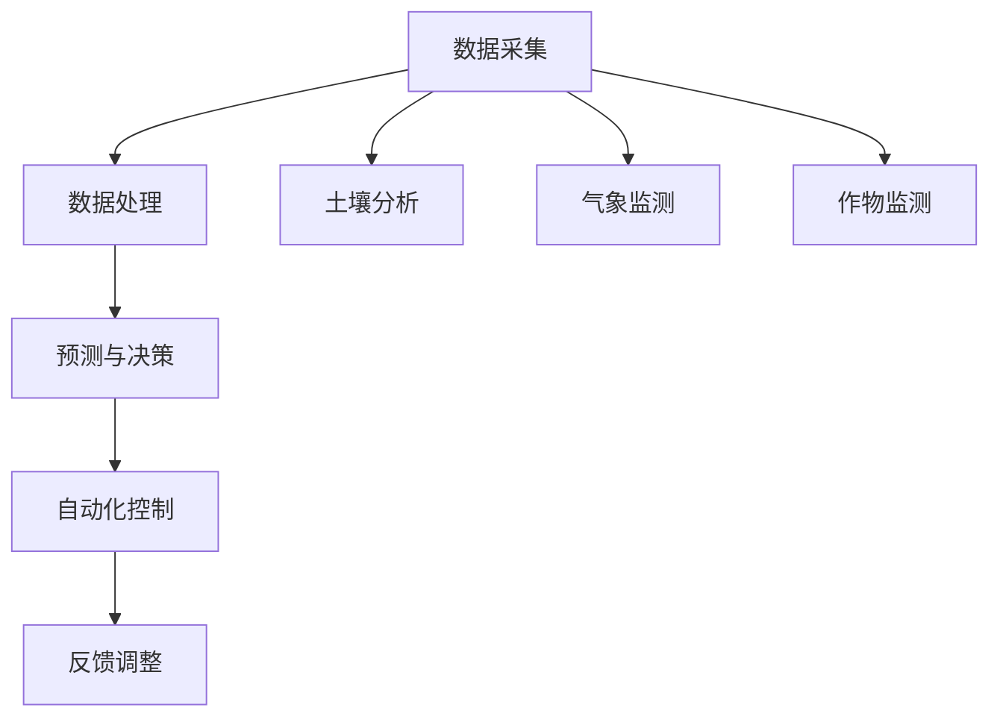

                 

关键词：AI、智能农业、精准种植、收获、计算机视觉、传感器技术、数据驱动决策

> 摘要：本文深入探讨了人工智能（AI）在智能农业中的应用，特别是其在精准种植与收获过程中的关键角色。通过介绍AI的基本概念及其与农业的关联，本文详细阐述了AI在作物监测、土壤分析、气候变化预测、智能灌溉以及机械收获等方面的应用。文章还分析了AI技术的优缺点，并展望了其未来的发展趋势与面临的挑战。

## 1. 背景介绍

### 1.1 智能农业的兴起

智能农业是现代农业与信息技术的深度融合，其目标是利用先进的技术手段提高农业生产的效率和质量，降低成本，实现农业的可持续发展。智能农业的兴起得益于大数据、物联网、云计算、人工智能等技术的快速发展。随着全球人口的增长和可耕地资源的减少，提高农业生产效率和保障粮食安全成为全球共同面临的重要挑战。智能农业的兴起正是为了应对这一挑战，通过技术手段优化农业生产过程，提高作物产量和品质。

### 1.2 AI在农业中的应用

人工智能技术在农业中的应用越来越广泛，从作物监测、病虫害预测到精准灌溉、智能收获，AI正在成为农业生产的重要驱动力。AI能够处理和分析大量的农业数据，提供精准的种植和收获建议，降低生产成本，提高农业生产的可持续性。例如，通过计算机视觉和图像处理技术，AI可以实时监测作物的生长状态，预测病虫害的发生，从而实现精准种植和收获。

## 2. 核心概念与联系

### 2.1 AI的基本概念

人工智能（AI）是指通过计算机程序实现的智能行为，能够模拟、延伸和扩展人类智能。AI可以分为两类：弱AI和强AI。弱AI在特定领域具有智能行为，而强AI则具有全面的人类智能。在农业中，主要应用的是弱AI，如机器学习、计算机视觉和自然语言处理等。

### 2.2 AI与农业的关联

AI与农业的关联主要体现在以下几个方面：

- **数据采集与处理**：AI技术能够高效地采集和处理农业数据，包括土壤、气象、作物生长等方面的数据。
- **预测与决策**：基于收集到的数据，AI可以预测作物生长状态、病虫害发生趋势等，为农业生产提供决策支持。
- **自动化控制**：AI技术可以实现对农业机械的自动化控制，如自动灌溉、自动施肥和自动收获等。

### 2.3 Mermaid 流程图



## 3. 核心算法原理 & 具体操作步骤

### 3.1 算法原理概述

在智能农业中，常用的AI算法包括机器学习、计算机视觉和自然语言处理。机器学习算法通过训练模型，从数据中提取规律，用于预测和决策。计算机视觉算法主要用于图像识别和分析，能够实时监测作物的生长状态。自然语言处理算法则用于处理农业生产中的文本数据，如农技文献、作物品种介绍等。

### 3.2 算法步骤详解

#### 3.2.1 数据采集

数据采集是智能农业的基础，主要包括土壤、气象、作物生长等方面的数据。数据来源可以是传感器、卫星遥感、无人机等。

#### 3.2.2 数据处理

数据处理包括数据清洗、数据转换和数据集成等步骤。数据清洗旨在去除噪声和异常值，提高数据质量。数据转换则是将不同类型的数据转换为统一的格式，便于后续处理。数据集成则是将多个来源的数据整合在一起，形成完整的农业数据集。

#### 3.2.3 预测与决策

基于训练好的机器学习模型，对作物生长状态、病虫害发生趋势等进行预测，为农业生产提供决策支持。预测结果可以用于优化灌溉计划、调整施肥量、预测产量等。

#### 3.2.4 自动化控制

根据预测结果，自动化控制系统可以实现对农业机械的自动控制，如自动开启灌溉系统、自动施肥和自动收获等。

### 3.3 算法优缺点

#### 优点

- 提高生产效率：AI技术能够实时监测作物生长状态，预测病虫害发生，从而实现精准种植和收获，提高生产效率。
- 降低生产成本：通过自动化控制和优化灌溉计划，可以降低生产成本。
- 增强决策支持：AI技术能够处理大量数据，为农业生产提供科学的决策支持。

#### 缺点

- 数据质量要求高：AI算法的性能依赖于数据质量，数据质量较差可能会导致预测结果不准确。
- 算法复杂度高：AI算法通常较为复杂，需要大量的计算资源和时间进行训练和预测。

### 3.4 算法应用领域

AI技术在农业中的应用领域非常广泛，包括但不限于：

- 精准种植：通过监测作物生长状态，优化种植计划，提高作物产量和品质。
- 精准收获：通过预测作物成熟期，实现精准收获，提高产量和降低损失。
- 病虫害监测与防治：通过实时监测病虫害发生，提前采取防治措施，降低损失。
- 智能灌溉：通过分析土壤和气象数据，实现智能灌溉，提高水资源利用效率。
- 农业机械化：通过自动化控制，实现农业机械的智能化操作，提高生产效率。

## 4. 数学模型和公式 & 详细讲解 & 举例说明

### 4.1 数学模型构建

在智能农业中，常用的数学模型包括回归模型、分类模型和时间序列模型。回归模型用于预测作物产量、灌溉量等连续值；分类模型用于预测病虫害、作物品种等离散值；时间序列模型用于预测作物生长趋势、病虫害发生趋势等。

### 4.2 公式推导过程

以线性回归模型为例，其公式推导如下：

$$y = \beta_0 + \beta_1x_1 + \beta_2x_2 + ... + \beta_nx_n + \epsilon$$

其中，$y$ 是预测值，$x_1, x_2, ..., x_n$ 是输入特征，$\beta_0, \beta_1, ..., \beta_n$ 是模型参数，$\epsilon$ 是误差项。

### 4.3 案例分析与讲解

#### 案例：预测小麦产量

假设我们需要预测小麦产量，输入特征包括土壤湿度、气温、降水量等。我们使用线性回归模型进行预测，得到如下公式：

$$y = \beta_0 + \beta_1 \cdot 湿度 + \beta_2 \cdot 气温 + \beta_3 \cdot 降水量 + \epsilon$$

通过训练模型，我们可以得到模型参数 $\beta_0, \beta_1, \beta_2, \beta_3$。然后，输入当前土壤湿度、气温、降水量等数据，即可预测小麦产量。

## 5. 项目实践：代码实例和详细解释说明

### 5.1 开发环境搭建

在实现智能农业项目中，我们需要搭建以下开发环境：

- Python：作为主要的编程语言。
- Scikit-learn：用于机器学习模型的构建和训练。
- Pandas：用于数据处理。
- Matplotlib：用于数据可视化。

### 5.2 源代码详细实现

以下是一个简单的机器学习预测模型实现：

```python
import pandas as pd
from sklearn.linear_model import LinearRegression
from sklearn.model_selection import train_test_split

# 读取数据
data = pd.read_csv('data.csv')
X = data[['湿度', '气温', '降水量']]
y = data['产量']

# 划分训练集和测试集
X_train, X_test, y_train, y_test = train_test_split(X, y, test_size=0.2, random_state=42)

# 构建线性回归模型
model = LinearRegression()
model.fit(X_train, y_train)

# 预测
predictions = model.predict(X_test)

# 打印预测结果
print(predictions)

# 可视化
import matplotlib.pyplot as plt

plt.scatter(X_test['湿度'], y_test)
plt.plot(X_test['湿度'], predictions, color='red')
plt.xlabel('湿度')
plt.ylabel('产量')
plt.show()
```

### 5.3 代码解读与分析

该代码首先读取数据，然后划分训练集和测试集。接下来，构建线性回归模型并进行训练。训练完成后，使用模型对测试集进行预测，并打印预测结果。最后，使用 Matplotlib 对预测结果进行可视化。

## 6. 实际应用场景

### 6.1 精准种植

通过AI技术，可以对不同作物的生长环境进行监测，预测最佳种植时间、种植密度和种植区域。例如，在水稻种植中，通过监测土壤湿度、气温、降水量等数据，可以预测最佳播种期和灌溉计划，提高水稻产量。

### 6.2 精准收获

AI技术可以实时监测作物的生长状态，预测最佳收获时间，从而实现精准收获。例如，在苹果收获中，通过监测果实成熟度、颜色和糖分含量，可以预测最佳收获时间，提高苹果的产量和品质。

### 6.3 病虫害监测与防治

通过AI技术，可以实时监测病虫害的发生，预测病虫害的蔓延趋势，从而提前采取防治措施。例如，在棉花种植中，通过监测叶片图像，可以预测病虫害的发生，并及时喷洒农药，降低损失。

### 6.4 智能灌溉

通过AI技术，可以分析土壤湿度、气象数据等，实现智能灌溉，提高水资源利用效率。例如，在葡萄种植中，通过监测土壤湿度，可以预测灌溉需求，并根据土壤湿度调整灌溉计划，降低水资源浪费。

## 7. 工具和资源推荐

### 7.1 学习资源推荐

- 《深度学习》（Ian Goodfellow、Yoshua Bengio、Aaron Courville 著）：深度学习是AI的核心技术之一，本书详细介绍了深度学习的基础知识、算法和应用。
- 《机器学习实战》（Peter Harrington 著）：本书通过大量实例，介绍了机器学习的基本算法和应用，适合初学者阅读。

### 7.2 开发工具推荐

- Jupyter Notebook：用于编写和运行Python代码，支持Markdown格式，方便文档和代码的编写。
- Matplotlib：用于数据可视化，可以生成各种图表，如折线图、散点图等。
- Scikit-learn：用于机器学习模型的构建和训练，提供丰富的算法和工具。

### 7.3 相关论文推荐

- "Deep Learning for Agricultural Monitoring"（2018年）：介绍了深度学习在农业监测中的应用，包括作物生长状态监测和病虫害预测。
- "Machine Learning in Agriculture: A Comprehensive Review"（2019年）：综述了机器学习在农业中的应用，包括作物产量预测、病虫害监测和灌溉优化等。

## 8. 总结：未来发展趋势与挑战

### 8.1 研究成果总结

智能农业作为AI在农业领域的重要应用，近年来取得了显著成果。通过AI技术，可以实现精准种植、精准收获、病虫害监测与防治、智能灌溉等，提高农业生产效率和品质。同时，AI技术在农业数据挖掘、农业知识图谱构建等方面也取得了重要进展。

### 8.2 未来发展趋势

未来，智能农业将继续向精细化、智能化方向发展。随着AI技术的不断进步，有望实现更高精度的农业监测和预测，提高农业生产的自动化和智能化水平。同时，农业大数据、区块链技术等新兴技术也将与智能农业相结合，推动农业产业的数字化转型。

### 8.3 面临的挑战

尽管智能农业取得了显著成果，但仍面临诸多挑战。首先，数据质量是智能农业的基础，数据质量较差可能会影响预测结果的准确性。其次，AI算法的复杂度高，对计算资源和时间的需求较大。此外，农业领域的标准化和数据共享问题也需要解决。

### 8.4 研究展望

未来，智能农业的研究将重点关注以下几个方面：

- 数据挖掘与知识发现：通过挖掘农业数据，发现作物生长规律和病虫害发生趋势，为农业生产提供科学依据。
- 跨学科融合：将AI技术与其他学科（如生物学、生态学等）相结合，实现农业领域的创新应用。
- 农业大数据与区块链技术：利用大数据和区块链技术，实现农业数据的标准化、共享和安全。

## 9. 附录：常见问题与解答

### 9.1 问题1：AI在智能农业中如何提高生产效率？

AI在智能农业中可以通过以下方式提高生产效率：

- 精准种植：通过监测作物生长状态，优化种植计划，提高作物产量。
- 精准收获：通过预测作物成熟期，实现精准收获，降低损失。
- 病虫害监测与防治：通过实时监测病虫害发生，提前采取防治措施，降低损失。
- 智能灌溉：通过分析土壤和气象数据，实现智能灌溉，提高水资源利用效率。

### 9.2 问题2：AI在智能农业中面临哪些挑战？

AI在智能农业中面临以下挑战：

- 数据质量：数据质量较差可能会影响预测结果的准确性。
- 算法复杂度：AI算法的复杂度高，对计算资源和时间的需求较大。
- 农业标准化与数据共享：农业领域的标准化和数据共享问题也需要解决。

### 9.3 问题3：智能农业的未来发展趋势是什么？

智能农业的未来发展趋势包括：

- 精细化与智能化：实现更高精度的农业监测和预测，提高农业生产的自动化和智能化水平。
- 跨学科融合：将AI技术与其他学科相结合，实现农业领域的创新应用。
- 农业大数据与区块链技术：利用大数据和区块链技术，实现农业数据的标准化、共享和安全。

---

本文详细探讨了人工智能（AI）在智能农业中的应用，特别是其在精准种植与收获过程中的关键角色。通过介绍AI的基本概念及其与农业的关联，本文详细阐述了AI在作物监测、土壤分析、气候变化预测、智能灌溉以及机械收获等方面的应用。同时，分析了AI技术的优缺点，并展望了其未来的发展趋势与面临的挑战。希望本文能为读者提供关于智能农业的全面了解和深入思考。

## 作者署名

作者：禅与计算机程序设计艺术 / Zen and the Art of Computer Programming
----------------------------------------------------------------


