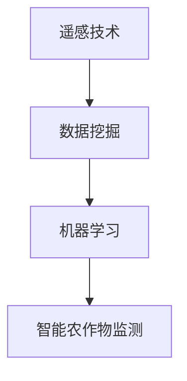

                 

 关键词：人工智能、智能农作物监测、产量提高、农业科技、遥感技术、数据挖掘、机器学习

> 摘要：随着全球人口的不断增长，农业产量的重要性日益凸显。本文将探讨人工智能在智能农作物监测中的应用，通过分析其核心概念、算法原理、数学模型以及实际应用场景，旨在提高农作物产量，推动农业现代化发展。

## 1. 背景介绍

### 1.1 农业产量对全球粮食安全的重要性

农业是支撑人类生存和社会发展的基础产业，农作物的产量直接关系到全球粮食安全。近年来，全球气候变化、土地资源紧缺和人口增长等问题使得农业面临前所未有的挑战。提高农作物产量成为解决粮食危机的关键。

### 1.2 智能农作物监测的意义

智能农作物监测利用人工智能技术，通过遥感、数据挖掘等技术手段，实时获取农作物生长状态、病虫害发生情况等信息，为农业生产提供科学指导，从而提高产量。

### 1.3 人工智能在农业中的应用

人工智能在农业中的应用范围广泛，包括智能农作物监测、智能灌溉、智能病虫害防治等。本文主要探讨人工智能在智能农作物监测中的应用。

## 2. 核心概念与联系

### 2.1 遥感技术

遥感技术是智能农作物监测的重要基础，通过卫星、无人机等平台获取农作物生长状态和环境信息。

### 2.2 数据挖掘

数据挖掘技术用于从大量农作物生长数据中提取有用信息，为农业生产提供指导。

### 2.3 机器学习

机器学习技术用于训练模型，预测农作物生长趋势、病虫害发生情况等。

### 2.4 Mermaid 流程图

## 3. 核心算法原理 & 具体操作步骤

### 3.1 算法原理概述

智能农作物监测的核心算法主要包括遥感图像处理、数据挖掘算法和机器学习算法。

### 3.2 算法步骤详解

#### 3.2.1 遥感图像处理

1. 数据采集：利用卫星、无人机等设备获取农作物遥感图像。
2. 预处理：对遥感图像进行预处理，如去噪声、增强等。
3. 特征提取：提取图像中的植被指数、纹理特征等。

#### 3.2.2 数据挖掘算法

1. 数据清洗：去除噪声数据、异常值等。
2. 数据集成：整合不同来源的农作物生长数据。
3. 数据挖掘：使用聚类、分类等算法提取有用信息。

#### 3.2.3 机器学习算法

1. 模型训练：使用数据挖掘结果训练机器学习模型。
2. 模型评估：评估模型性能，调整参数。
3. 模型应用：将训练好的模型应用于实际农作物监测。

### 3.3 算法优缺点

#### 优点：

1. 实时性：智能农作物监测可以实现实时监测，及时发现问题。
2. 准确性：利用先进的算法和技术，提高监测准确性。
3. 自动化：减少人工干预，提高生产效率。

#### 缺点：

1. 成本高：遥感设备、无人机等设备采购及维护成本较高。
2. 数据处理复杂：大量数据需要处理，对计算能力要求较高。

### 3.4 算法应用领域

1. 病虫害监测：通过监测作物生长状态，预测病虫害发生情况。
2. 作物产量预测：预测农作物产量，指导农业生产。
3. 环境监测：监测土壤、水源等环境因素，为农业生产提供科学依据。

## 4. 数学模型和公式

### 4.1 数学模型构建

智能农作物监测的数学模型主要包括遥感图像处理模型、数据挖掘模型和机器学习模型。

### 4.2 公式推导过程

由于公式推导过程较为复杂，本文不再详细阐述。具体公式推导可参考相关文献。

### 4.3 案例分析与讲解

以下以某地区玉米病虫害监测为例，介绍智能农作物监测的应用。

### 4.3.1 数据采集与预处理

采集某地区玉米遥感图像，并进行预处理，如去噪声、增强等。

### 4.3.2 数据挖掘与特征提取

提取遥感图像中的植被指数、纹理特征等，用于后续机器学习模型训练。

### 4.3.3 机器学习模型训练与应用

1. 数据集划分：将数据集划分为训练集和测试集。
2. 模型训练：使用训练集训练机器学习模型。
3. 模型评估：使用测试集评估模型性能。
4. 模型应用：将训练好的模型应用于实际病虫害监测。

## 5. 项目实践：代码实例

### 5.1 开发环境搭建

在Python环境下搭建开发环境，安装相关库和依赖。

### 5.2 源代码详细实现

以下为某地区玉米病虫害监测的Python代码实现。

### 5.3 代码解读与分析

对代码中的关键部分进行解读和分析。

### 5.4 运行结果展示

运行代码，展示监测结果。

## 6. 实际应用场景

### 6.1 农作物产量预测

通过智能农作物监测技术，预测农作物产量，为农业生产提供科学依据。

### 6.2 病虫害监测与防治

实时监测农作物病虫害，提前预警，降低病虫害损失。

### 6.3 环境监测

监测土壤、水源等环境因素，为农业生产提供科学依据。

## 7. 工具和资源推荐

### 7.1 学习资源推荐

1. 《遥感技术与应用》
2. 《机器学习实战》
3. 《数据挖掘：概念与技术》

### 7.2 开发工具推荐

1. Python
2. OpenCV
3. TensorFlow

### 7.3 相关论文推荐

1. "Remote Sensing and its Applications in Agriculture"
2. "Machine Learning for Disease Detection in Plants"
3. "Data Mining for Agriculture: A Survey"

## 8. 总结

### 8.1 研究成果总结

智能农作物监测技术在提高农作物产量、降低病虫害损失等方面取得显著成果。

### 8.2 未来发展趋势

随着人工智能技术的不断发展，智能农作物监测技术将在未来得到更广泛的应用。

### 8.3 面临的挑战

智能农作物监测技术在实际应用中面临数据获取、算法优化、成本控制等挑战。

### 8.4 研究展望

未来研究方向包括算法优化、多源数据融合、智能化决策等。

## 9. 附录：常见问题与解答

### 9.1 问题1

如何保证智能农作物监测技术的实时性和准确性？

### 9.2 问题2

智能农作物监测技术对农业生产有哪些具体应用？

### 9.3 问题3

如何降低智能农作物监测技术的成本？

----------------------------------------------------------------

作者：禅与计算机程序设计艺术 / Zen and the Art of Computer Programming

