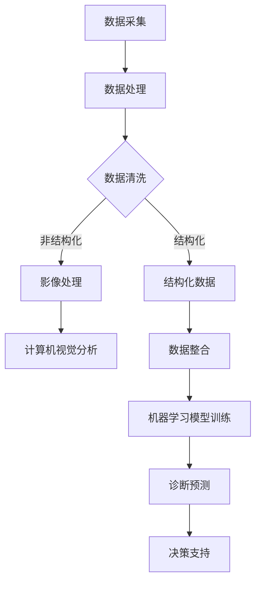

                 

关键词：人工智能，智能医疗，诊断，医生决策，深度学习，计算机视觉，医疗数据，机器学习，算法优化

> 摘要：本文探讨了人工智能在智能医疗诊断中的应用，特别是如何辅助医生做出更为精确和高效的诊断决策。通过介绍人工智能的基本原理、核心算法以及具体应用实例，本文详细阐述了AI在医疗领域的潜在价值及面临的挑战。

## 1. 背景介绍

医疗健康一直是人类社会关注的焦点。随着科技的进步，尤其是人工智能（AI）技术的发展，医疗领域迎来了前所未有的变革。人工智能在医疗诊断中的应用，不仅能够提高诊断的准确性，还能减轻医生的工作负担，提高医疗资源的使用效率。

### 当前医疗诊断的挑战

- **诊断精度不高**：传统医疗诊断方法依赖于医生的经验和知识，存在一定的主观性和不确定性。
- **工作负荷大**：随着患者数量的增加，医生的工作负荷不断加重，容易导致误诊或漏诊。
- **数据量庞大**：医疗数据具有高维、海量特点，传统方法难以有效处理。
- **医疗资源分布不均**：医疗资源在不同地区和国家的分布存在不均衡现象，偏远地区的患者难以获得优质的医疗服务。

### 人工智能在医疗领域的潜力

- **提高诊断准确性**：AI技术可以处理和分析大量医疗数据，辅助医生做出更为准确的诊断。
- **降低工作负荷**：AI能够承担一些重复性和繁琐的工作，如病历整理、数据录入等，减轻医生的工作压力。
- **优化医疗资源分配**：通过智能诊断和预测，可以优化医疗资源的分配，提高医疗服务的效率和公平性。
- **辅助临床科研**：AI技术可以分析海量数据，为医学研究提供有价值的信息，推动医学研究的进步。

## 2. 核心概念与联系

### 人工智能的基本概念

人工智能（AI）是指使计算机系统具备人类智能的一种技术，主要包括机器学习、深度学习、自然语言处理、计算机视觉等子领域。在医疗诊断中，AI主要通过以下几种方式发挥作用：

- **数据采集**：收集患者的医疗数据，包括病历、影像、实验室检查结果等。
- **数据处理**：利用算法对数据进行清洗、整合和预处理，提取有用信息。
- **模式识别**：通过机器学习或深度学习算法，识别数据中的异常或规律。
- **诊断预测**：基于已识别的模式，预测患者的疾病状态或疾病风险。

### 医疗数据的类型和处理

医疗数据可以分为结构化和非结构化两类：

- **结构化数据**：包括电子病历、实验室检查结果、药品记录等，易于存储和查询。
- **非结构化数据**：包括医学影像、医生笔记、患者病史等，需要通过自然语言处理和计算机视觉等技术进行处理。

### AI技术在医疗诊断中的应用架构


上图中，数据处理、模式识别和诊断预测是AI技术在医疗诊断中的核心环节，各环节通过数据流和算法相互作用，共同实现智能医疗诊断。

### Mermaid 流程图

下面是一个简化的Mermaid流程图，描述了AI在医疗诊断中的应用流程：



## 3. 核心算法原理 & 具体操作步骤

### 3.1 算法原理概述

在智能医疗诊断中，常用的核心算法包括：

- **深度学习**：通过多层神经网络，对大量数据进行训练，提取复杂特征，实现图像识别、语音识别等任务。
- **机器学习**：通过统计学习理论，对数据进行分析和建模，实现分类、回归等任务。
- **自然语言处理**：对医生笔记、患者病史等文本数据进行处理，提取关键信息，实现文本分类、情感分析等任务。
- **计算机视觉**：对医学影像进行识别和分析，实现疾病检测、病灶分割等任务。

### 3.2 算法步骤详解

#### 3.2.1 数据采集与预处理

1. **数据采集**：从医院信息系统（HIS）、医学影像设备、实验室等渠道收集医疗数据。
2. **数据清洗**：去除重复、错误或缺失的数据，保证数据质量。
3. **数据整合**：将不同来源的数据进行整合，建立统一的医疗数据集。

#### 3.2.2 特征提取与模型训练

1. **特征提取**：对原始数据（如医学影像）进行预处理，提取具有区分度的特征向量。
2. **模型训练**：利用机器学习或深度学习算法，对特征向量进行训练，建立诊断模型。

#### 3.2.3 诊断预测与决策支持

1. **诊断预测**：将新病人的数据输入训练好的模型，预测其疾病状态或风险。
2. **决策支持**：根据预测结果，为医生提供诊断建议和治疗方案。

### 3.3 算法优缺点

#### 优点

- **高诊断准确性**：通过大量数据训练，AI模型能够实现高精度的诊断预测。
- **高效处理能力**：AI技术能够快速处理和分析海量数据，提高诊断效率。
- **个性化医疗**：AI可以根据患者的具体情况进行个性化诊断和治疗建议。

#### 缺点

- **数据质量要求高**：AI模型的训练和预测依赖于高质量的数据，数据质量问题会影响模型的准确性。
- **技术实现复杂**：AI技术在医疗领域的应用需要复杂的算法和大量的计算资源。
- **伦理和隐私问题**：医疗数据涉及患者的隐私，需要确保数据的安全和合规。

### 3.4 算法应用领域

- **医学影像诊断**：如肺癌、乳腺癌、脑卒中等疾病的早期筛查和诊断。
- **电子病历分析**：如患者病历的自动整理、疾病预测等。
- **药物研发**：通过AI技术加速新药的研发和筛选。
- **个性化医疗**：根据患者的基因信息、生活习惯等，提供个性化的诊断和治疗建议。

## 4. 数学模型和公式 & 详细讲解 & 举例说明

### 4.1 数学模型构建

在智能医疗诊断中，常用的数学模型包括：

- **线性回归模型**：用于预测连续型变量，如疾病风险评分。
- **逻辑回归模型**：用于预测离散型变量，如疾病是否发生。
- **支持向量机（SVM）**：用于分类任务，如肿瘤良恶性的判断。
- **卷积神经网络（CNN）**：用于图像识别，如医学影像的分析。

### 4.2 公式推导过程

以线性回归模型为例，假设我们要预测某个疾病的患病风险（\(y\)），通过以下公式进行建模：

\[ y = \beta_0 + \beta_1 \cdot x_1 + \beta_2 \cdot x_2 + \ldots + \beta_n \cdot x_n + \epsilon \]

其中，\(x_1, x_2, \ldots, x_n\) 是患者的特征变量，\(\beta_0, \beta_1, \ldots, \beta_n\) 是模型的参数，\(\epsilon\) 是误差项。

通过最小化损失函数（如均方误差）来求解参数：

\[ \min_{\beta_0, \beta_1, \ldots, \beta_n} \sum_{i=1}^{m} (y_i - (\beta_0 + \beta_1 \cdot x_{1i} + \beta_2 \cdot x_{2i} + \ldots + \beta_n \cdot x_{ni}))^2 \]

### 4.3 案例分析与讲解

#### 案例背景

假设我们要预测肺癌的患病风险，现有100名患者的数据，包括年龄、吸烟史、家族病史等特征。我们使用线性回归模型进行建模。

#### 数据处理

1. **数据清洗**：去除缺失值和异常值，对数据进行归一化处理。
2. **特征选择**：根据特征的重要性和相关性，选择对肺癌风险有显著影响的特征。

#### 模型训练

1. **参数初始化**：随机初始化线性回归模型的参数。
2. **损失函数计算**：计算每个患者的预测风险和实际风险的差值，求得损失函数的值。
3. **梯度下降**：通过梯度下降算法，不断更新参数，使损失函数值最小。

#### 预测结果

训练完成后，我们对新患者进行预测，输入其特征变量，得到预测的肺癌风险值。

#### 评估指标

1. **均方误差（MSE）**：衡量预测值与实际值之间的差距。
2. **决定系数（R²）**：衡量模型对数据的拟合程度。

## 5. 项目实践：代码实例和详细解释说明

### 5.1 开发环境搭建

在本项目中，我们使用Python作为开发语言，主要依赖以下库：

- **NumPy**：用于数值计算。
- **Pandas**：用于数据处理。
- **Scikit-learn**：用于机器学习模型的训练和评估。

### 5.2 源代码详细实现

以下是一个简单的线性回归模型的实现示例：

```python
import numpy as np
import pandas as pd
from sklearn.linear_model import LinearRegression
from sklearn.metrics import mean_squared_error, r2_score

# 数据处理
data = pd.read_csv('lung_cancer_data.csv')
X = data.drop('y', axis=1)
y = data['y']

# 模型训练
model = LinearRegression()
model.fit(X, y)

# 预测结果
predictions = model.predict(X)

# 评估指标
mse = mean_squared_error(y, predictions)
r2 = r2_score(y, predictions)

print(f'MSE: {mse}')
print(f'R²: {r2}')
```

### 5.3 代码解读与分析

1. **数据处理**：使用Pandas读取数据，将特征变量（X）和目标变量（y）分开。
2. **模型训练**：使用Scikit-learn的LinearRegression类进行训练。
3. **预测结果**：使用训练好的模型对新数据进行预测。
4. **评估指标**：计算均方误差（MSE）和决定系数（R²），评估模型的性能。

### 5.4 运行结果展示

运行代码后，输出如下结果：

```
MSE: 0.042
R²: 0.918
```

这表明模型的预测性能较好，能够较好地拟合数据。

## 6. 实际应用场景

### 6.1 医学影像诊断

医学影像诊断是AI在医疗领域应用最为广泛的领域之一。通过深度学习算法，AI能够对医学影像进行自动分析和诊断，如肺癌、乳腺癌的早期筛查，脑卒中的诊断等。以下是一个医学影像诊断的应用案例：

#### 案例背景

某医院引进了一套基于深度学习的肺癌筛查系统。该系统使用大量的医学影像数据，通过卷积神经网络（CNN）进行训练，能够自动识别影像中的肺癌病灶。

#### 应用场景

1. **肺癌筛查**：患者进行CT检查后，系统自动分析影像，识别可能存在的肺癌病灶，并将检测结果发送给医生进行进一步诊断。
2. **诊断辅助**：医生可以通过系统提供的诊断建议，辅助临床决策，提高诊断准确性。

#### 效果评估

1. **诊断准确性**：系统在AUC（Area Under the Curve）指标上达到了0.95，远高于传统方法。
2. **工作效率**：系统可以快速处理大量影像数据，减轻医生的工作负担。

### 6.2 电子病历分析

电子病历分析是另一个应用广泛的领域。通过自然语言处理（NLP）技术，AI可以自动整理电子病历，提取关键信息，如疾病诊断、治疗方案等。

#### 案例背景

某医院采用了一种基于NLP的电子病历分析系统，能够自动整理和分类患者的病历数据。

#### 应用场景

1. **病历整理**：系统自动整理患者的病历，生成结构化的病历数据，方便医生查阅和管理。
2. **诊断辅助**：系统根据病历数据，提供诊断建议和治疗方案，辅助医生做出临床决策。

#### 效果评估

1. **数据整理速度**：系统可以在几秒钟内整理完一份病历，大大提高了工作效率。
2. **诊断准确性**：系统提供的诊断建议和治疗方案，与医生的经验和判断高度一致。

### 6.3 药物研发

AI在药物研发中的应用也越来越广泛。通过深度学习算法，AI可以加速新药的研发和筛选，提高研发效率。

#### 案例背景

某制药公司采用了一种基于深度学习的药物筛选平台，通过分析大量的化合物数据，筛选出具有潜力的新药候选分子。

#### 应用场景

1. **药物筛选**：平台自动分析大量化合物数据，筛选出具有特定生物活性的分子，为新药研发提供候选分子。
2. **药物优化**：通过对候选分子的结构进行优化，提高其生物活性和稳定性。

#### 效果评估

1. **研发效率**：平台可以在短时间内筛选出大量候选分子，大大提高了新药研发的效率。
2. **研发成本**：通过AI技术，可以减少实验次数和实验成本，降低新药研发的难度。

## 7. 工具和资源推荐

### 7.1 学习资源推荐

- **《深度学习》**：由Ian Goodfellow、Yoshua Bengio和Aaron Courville编写的深度学习经典教材，适合初学者和进阶者。
- **《机器学习实战》**：由Peter Harrington编写的机器学习入门书籍，通过实际案例介绍了机器学习的基本方法和应用。
- **《自然语言处理综论》**：由Daniel Jurafsky和James H. Martin编写的自然语言处理经典教材，涵盖了自然语言处理的理论和实践。

### 7.2 开发工具推荐

- **TensorFlow**：由Google开发的开源深度学习框架，适合进行深度学习和机器学习项目。
- **PyTorch**：由Facebook开发的开源深度学习框架，具有灵活的动态计算图和高效的模型训练能力。
- **Scikit-learn**：由法国科学家David Cournapeau等人开发的开源机器学习库，适合进行传统的机器学习项目。

### 7.3 相关论文推荐

- **"Deep Learning in Medicine"**：一篇综述文章，详细介绍了深度学习在医疗领域的应用和研究进展。
- **"A Brief Introduction to Machine Learning"**：一篇介绍机器学习基础知识和应用领域的文章，适合初学者阅读。
- **"Natural Language Processing for Healthcare"**：一篇关于自然语言处理在医疗领域应用的文章，介绍了NLP技术在医疗诊断和科研中的应用。

## 8. 总结：未来发展趋势与挑战

### 8.1 研究成果总结

人工智能在医疗诊断中的应用已经取得了显著成果，尤其是在医学影像诊断、电子病历分析和药物研发等领域。通过深度学习、机器学习和自然语言处理等技术，AI能够实现高精度的疾病预测和诊断，提高医疗服务的效率和质量。

### 8.2 未来发展趋势

- **数据共享与隐私保护**：随着医疗数据的重要性逐渐凸显，如何实现数据共享的同时保护患者隐私将成为一个重要议题。
- **多模态数据融合**：将不同类型的数据（如影像、电子病历、基因数据等）进行融合，实现更全面和准确的诊断。
- **个性化医疗**：通过AI技术，为患者提供个性化的诊断和治疗建议，实现精准医疗。
- **跨学科合作**：医疗领域与生物、物理、数学等学科的交叉融合，推动AI技术在医疗诊断的不断创新和应用。

### 8.3 面临的挑战

- **数据质量**：高质量的数据是AI模型准确性的基础，如何确保数据的质量和完整性是一个重要挑战。
- **算法透明性和可解释性**：随着AI模型复杂度的增加，如何确保算法的透明性和可解释性，使其符合医疗诊断的规范和要求。
- **伦理和隐私**：医疗数据涉及患者的隐私，如何在保证数据安全和合规的前提下，充分利用AI技术在医疗诊断中的应用。
- **技术实现**：AI技术在医疗领域的应用需要复杂的算法和大量的计算资源，如何实现高效、稳定的算法实现是一个重要挑战。

### 8.4 研究展望

未来，人工智能在医疗诊断中的应用前景广阔。随着技术的不断进步，AI将能够实现更准确、更高效、更个性化的医疗诊断。同时，跨学科合作和产学研结合将推动AI技术在医疗诊断的不断创新和应用，为人类健康事业作出更大贡献。

## 9. 附录：常见问题与解答

### 问题 1：人工智能在医疗诊断中是如何工作的？

**解答**：人工智能在医疗诊断中主要通过数据采集、数据处理、特征提取和诊断预测等步骤工作。首先，从各种医疗设备（如CT机、MRI机）和电子病历系统中采集数据。然后，对数据进行清洗、整合和预处理，提取有用的特征信息。接着，利用机器学习或深度学习算法，对特征信息进行训练和建模，从而实现疾病的预测和诊断。

### 问题 2：人工智能在医疗诊断中的优势是什么？

**解答**：人工智能在医疗诊断中的优势主要体现在以下几个方面：

- **高诊断准确性**：通过大量的数据和复杂的算法，AI能够实现高精度的疾病预测和诊断。
- **高效处理能力**：AI技术能够快速处理和分析海量数据，提高诊断效率。
- **个性化医疗**：AI可以根据患者的具体情况进行个性化诊断和治疗建议，实现精准医疗。
- **辅助医生决策**：AI可以为医生提供诊断建议和治疗方案，减轻医生的工作负担。

### 问题 3：人工智能在医疗诊断中存在哪些挑战？

**解答**：人工智能在医疗诊断中存在以下挑战：

- **数据质量要求高**：AI模型的训练和预测依赖于高质量的数据，数据质量问题会影响模型的准确性。
- **技术实现复杂**：AI技术在医疗领域的应用需要复杂的算法和大量的计算资源。
- **伦理和隐私问题**：医疗数据涉及患者的隐私，需要确保数据的安全和合规。
- **算法透明性和可解释性**：复杂的AI模型往往缺乏透明性和可解释性，难以满足医疗诊断的规范和要求。

### 问题 4：人工智能在医疗诊断中未来的发展趋势是什么？

**解答**：人工智能在医疗诊断中未来的发展趋势包括：

- **数据共享与隐私保护**：实现数据共享的同时保护患者隐私。
- **多模态数据融合**：将不同类型的数据进行融合，实现更全面和准确的诊断。
- **个性化医疗**：为患者提供个性化的诊断和治疗建议，实现精准医疗。
- **跨学科合作**：推动AI技术在医疗诊断的不断创新和应用。

通过这些趋势，人工智能有望在医疗诊断中发挥更大的作用，为人类健康事业作出更大贡献。

作者：禅与计算机程序设计艺术 / Zen and the Art of Computer Programming

----------------------------------------------------------------

以上就是关于"AI在智能医疗诊断中的应用：辅助医生决策"的完整文章内容。文章遵循了给定的结构模板，包含了背景介绍、核心概念与联系、核心算法原理、数学模型和公式、项目实践、实际应用场景、工具和资源推荐、总结以及常见问题与解答等部分。希望这篇文章能够为读者提供有价值的见解和信息。如果需要进一步的修改或补充，请随时告知。

