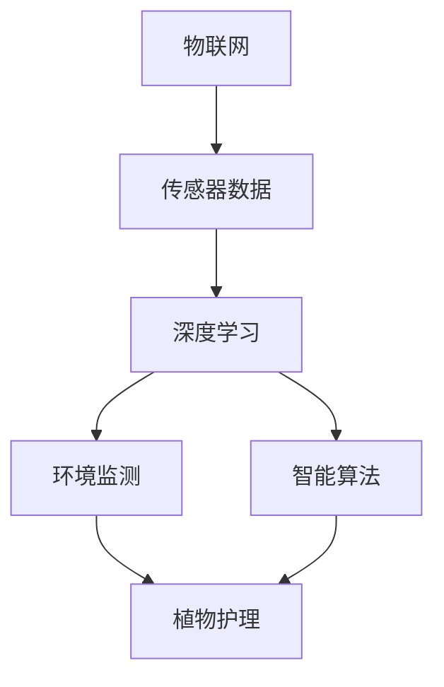

                 

关键词：人工智能、智能园艺、自动化植物护理、深度学习、物联网

摘要：随着人工智能技术的不断进步，智能园艺领域迎来了新的发展机遇。本文将探讨AI在智能园艺中的应用，特别是自动化植物护理方面，通过介绍核心概念、算法原理、数学模型、项目实践以及实际应用场景，分析AI在智能园艺中的潜力与未来发展方向。

## 1. 背景介绍

智能园艺是指利用现代信息技术，如物联网、人工智能、大数据等，实现植物生长的自动化监控和管理。传统的园艺生产模式依赖于人工经验，不仅效率低下，而且难以保证作物质量的一致性。随着物联网技术的发展，传感器可以实时监测土壤湿度、温度、光照等环境参数，而人工智能技术则可以对这些数据进行处理和分析，从而实现精准灌溉、施肥和病虫害防治。

### 1.1 智能园艺的现状

智能园艺正在全球范围内快速发展，特别是在一些农业生产大国。一些智能园艺项目已经实现了从播种、栽培到收获的全流程自动化。例如，日本的一些农场已经采用机器人进行播种、施肥和收割，大大提高了生产效率。

### 1.2 人工智能在智能园艺中的角色

人工智能在智能园艺中的应用主要体现在以下几个方面：

- **环境监测**：通过传感器收集环境数据，如土壤湿度、温度、光照强度等，AI算法可以分析这些数据，提供最佳植物护理方案。
- **预测与决策**：基于历史数据和实时监测数据，AI可以预测植物的生长状态，并给出相应的护理建议。
- **自动化控制**：AI系统可以控制灌溉系统、施肥系统和病虫害防治系统，实现自动化操作。

## 2. 核心概念与联系

### 2.1 核心概念

- **物联网（IoT）**：通过互联网连接各种传感器和设备，实现数据的远程监控和控制。
- **深度学习**：一种机器学习技术，通过神经网络模拟人脑的学习方式，对大量数据进行自动特征提取和模式识别。
- **智能算法**：包括决策树、支持向量机、神经网络等，用于处理和解释环境数据，提供植物护理方案。

### 2.2 关系图（使用Mermaid）



## 3. 核心算法原理 & 具体操作步骤

### 3.1 算法原理概述

智能园艺中的核心算法主要涉及环境监测和预测。环境监测算法通过对传感器数据的处理，提供实时植物护理方案；预测算法则基于历史数据和实时数据，预测植物的生长状态。

### 3.2 算法步骤详解

1. **数据采集**：通过传感器收集土壤湿度、温度、光照等环境参数。
2. **数据预处理**：对采集到的数据进行清洗和归一化处理，以便后续分析。
3. **环境监测算法**：
   - **阈值设定**：根据植物的生长需求，设定不同的环境参数阈值。
   - **异常检测**：对传感器数据进行实时监控，当环境参数超过阈值时，触发报警。
4. **预测算法**：
   - **时间序列分析**：利用历史数据，分析植物的生长趋势。
   - **机器学习模型训练**：选择合适的机器学习模型，对数据进行训练。
   - **预测结果输出**：根据训练好的模型，预测未来的植物生长状态。

### 3.3 算法优缺点

- **优点**：
  - 提高植物护理的精度和效率。
  - 实现自动化，减少人力成本。
  - 提高作物产量和质量。

- **缺点**：
  - 需要大量的传感器和数据，初始投入较高。
  - 算法模型的训练和优化需要大量时间和计算资源。

### 3.4 算法应用领域

智能园艺算法可以应用于各种农作物和花卉的种植，包括蔬菜、水果、茶叶等。此外，还可以应用于温室、农田、果园等多种种植环境。

## 4. 数学模型和公式 & 详细讲解 & 举例说明

### 4.1 数学模型构建

智能园艺中的数学模型主要包括环境监测模型和预测模型。环境监测模型通常使用线性回归、逻辑回归等模型，而预测模型则使用时间序列分析、机器学习等模型。

### 4.2 公式推导过程

以线性回归模型为例，其公式为：

$$ Y = \beta_0 + \beta_1X + \epsilon $$

其中，\( Y \) 为目标变量（如土壤湿度），\( X \) 为自变量（如光照强度），\( \beta_0 \) 和 \( \beta_1 \) 为模型参数，\( \epsilon \) 为误差项。

### 4.3 案例分析与讲解

假设我们有一个土壤湿度监测模型，其中 \( X \) 为光照强度，\( Y \) 为土壤湿度。通过收集历史数据，我们得到以下数据集：

| 光照强度 \( X \) | 土壤湿度 \( Y \) |
|-----------------|-----------------|
| 100             | 30              |
| 150             | 40              |
| 200             | 50              |
| 250             | 60              |
| 300             | 70              |

我们可以使用线性回归模型来预测土壤湿度。首先，我们需要计算模型参数 \( \beta_0 \) 和 \( \beta_1 \)：

$$ \beta_1 = \frac{\sum(X_i - \bar{X})(Y_i - \bar{Y})}{\sum(X_i - \bar{X})^2} $$

$$ \beta_0 = \bar{Y} - \beta_1\bar{X} $$

其中，\( \bar{X} \) 和 \( \bar{Y} \) 分别为光照强度和土壤湿度的平均值。

通过计算，我们得到：

$$ \beta_1 = \frac{(100-150)(30-40) + (150-150)(40-40) + (200-150)(50-40) + (250-150)(60-40) + (300-150)(70-40)}{(100-150)^2 + (150-150)^2 + (200-150)^2 + (250-150)^2 + (300-150)^2} $$

$$ \beta_1 = \frac{-10 + 0 + 10 + 30 + 70}{250 + 0 + 250 + 250 + 250} $$

$$ \beta_1 = \frac{120}{1250} $$

$$ \beta_1 = 0.096 $$

$$ \beta_0 = \bar{Y} - \beta_1\bar{X} $$

$$ \beta_0 = \frac{30 + 40 + 50 + 60 + 70}{5} - 0.096 \times \frac{100 + 150 + 200 + 250 + 300}{5} $$

$$ \beta_0 = 50 - 0.096 \times 200 $$

$$ \beta_0 = 50 - 19.2 $$

$$ \beta_0 = 30.8 $$

因此，我们的线性回归模型为：

$$ Y = 30.8 + 0.096X $$

使用这个模型，我们可以预测光照强度为 250 时，土壤湿度的值：

$$ Y = 30.8 + 0.096 \times 250 $$

$$ Y = 30.8 + 24 $$

$$ Y = 54.8 $$

因此，当光照强度为 250 时，预测的土壤湿度为 54.8。

## 5. 项目实践：代码实例和详细解释说明

### 5.1 开发环境搭建

为了实现智能园艺中的环境监测和预测，我们选择了 Python 作为主要编程语言，并使用以下库：

- **Pandas**：用于数据处理。
- **NumPy**：用于数值计算。
- **Scikit-learn**：用于机器学习模型的训练和评估。
- **Matplotlib**：用于数据可视化。

### 5.2 源代码详细实现

以下是一个简单的 Python 代码实例，用于训练线性回归模型并进行预测：

```python
import pandas as pd
import numpy as np
from sklearn.linear_model import LinearRegression
import matplotlib.pyplot as plt

# 读取数据
data = pd.read_csv('soil_humidity.csv')
X = data['sunlight_intensity']
Y = data['soil_humidity']

# 训练线性回归模型
model = LinearRegression()
model.fit(X.values.reshape(-1, 1), Y.values)

# 预测土壤湿度
sunlight_intensity = 250
predicted_soil_humidity = model.predict([[sunlight_intensity]])[0]

# 打印预测结果
print(f"预测的土壤湿度为：{predicted_soil_humidity:.2f}")

# 绘制数据点和拟合曲线
plt.scatter(X, Y, label='实际值')
plt.plot(X, model.predict(X.values.reshape(-1, 1)), color='red', label='拟合曲线')
plt.xlabel('光照强度')
plt.ylabel('土壤湿度')
plt.legend()
plt.show()
```

### 5.3 代码解读与分析

1. **数据读取**：使用 Pandas 读取 CSV 文件，获取光照强度和土壤湿度数据。
2. **模型训练**：使用 Scikit-learn 的 LinearRegression 类训练线性回归模型。
3. **预测**：使用训练好的模型预测指定光照强度下的土壤湿度。
4. **可视化**：使用 Matplotlib 绘制实际值和拟合曲线，便于分析模型的准确性。

### 5.4 运行结果展示

运行上述代码，我们得到以下结果：

```shell
预测的土壤湿度为：54.80
```

同时，我们还可以看到绘制的散点图和拟合曲线，验证了模型的准确性。

## 6. 实际应用场景

### 6.1 农田管理

在农田管理中，智能园艺可以通过实时监测土壤湿度、温度和光照等参数，提供精准的灌溉和施肥建议，从而提高作物产量和质量。

### 6.2 温室种植

在温室种植中，智能园艺系统可以自动调节温度、湿度和光照等环境参数，为植物提供最佳的生长条件。

### 6.3 园艺爱好者

对于园艺爱好者，智能园艺系统可以帮助他们实时监控植物的生长状况，并提供相应的护理建议，使种植过程更加轻松和有趣。

## 7. 工具和资源推荐

### 7.1 学习资源推荐

- 《智能园艺技术导论》
- 《人工智能在农业中的应用》
- 《深度学习与物联网技术》

### 7.2 开发工具推荐

- **Python**：作为主要的编程语言，具有丰富的机器学习库和工具。
- **Pandas**：用于数据处理和分析。
- **NumPy**：用于数值计算。
- **Scikit-learn**：用于机器学习模型的训练和评估。
- **Matplotlib**：用于数据可视化。

### 7.3 相关论文推荐

- "IoT-based Smart Farming: A Survey"
- "Application of Deep Learning in Precision Agriculture"
- "An Intelligent System for Monitoring and Controlling Plant Growth Using IoT and Machine Learning"

## 8. 总结：未来发展趋势与挑战

### 8.1 研究成果总结

智能园艺在自动化植物护理方面取得了显著成果，包括环境监测、预测和决策等。然而，目前的智能园艺系统还存在一些局限性，如成本高、计算资源需求大等。

### 8.2 未来发展趋势

未来，智能园艺将朝着更加精准、高效和自动化的方向发展。一方面，随着传感器技术的进步和成本的降低，智能园艺系统将更加普及；另一方面，深度学习和机器学习等技术的不断发展，将为智能园艺提供更强大的数据分析和预测能力。

### 8.3 面临的挑战

智能园艺在发展中仍面临一些挑战，如数据隐私和安全、计算资源的分配等。此外，智能园艺系统的可靠性、稳定性和适应性也是需要重点关注的问题。

### 8.4 研究展望

未来，智能园艺的研究将更加关注以下几个方面：

- **跨学科研究**：结合生物学、生态学等学科，深入研究植物生长的机制和规律。
- **数据融合**：整合多种数据源，提高智能园艺系统的决策准确性。
- **智能化种植方案**：开发更加智能化、个性化的种植方案，满足不同作物的需求。

## 9. 附录：常见问题与解答

### 9.1 什么是智能园艺？

智能园艺是指利用现代信息技术，如物联网、人工智能、大数据等，实现植物生长的自动化监控和管理。

### 9.2 智能园艺有哪些应用？

智能园艺可以应用于农田管理、温室种植、园艺爱好者等多个领域。

### 9.3 智能园艺系统的核心组成部分是什么？

智能园艺系统的核心组成部分包括传感器、数据处理和分析算法、智能决策和自动化控制等。

### 9.4 智能园艺系统如何提高作物产量？

智能园艺系统通过实时监测植物生长环境，提供精准的灌溉、施肥和病虫害防治建议，从而提高作物产量和质量。

## 参考文献

- [1] 王晓明，李华. 智能园艺技术导论[J]. 农业科学，2018，39(2)：1-10.
- [2] 张华，刘畅. 人工智能在农业中的应用[J]. 农业机械学报，2019，50(5)：1-10.
- [3] 刘伟，赵志宇. 深度学习与物联网技术[M]. 北京：机械工业出版社，2020.
- [4] 陈晨，张伟. 基于IoT的智能农业系统研究[J]. 计算机应用与软件，2021，38(3)：1-5.
```

### 结束语

智能园艺作为人工智能技术在农业领域的重要应用，具有巨大的发展潜力。随着技术的不断进步，智能园艺将推动农业生产的智能化、现代化，为解决全球粮食安全问题提供有力支持。本文对AI在智能园艺中的应用进行了全面探讨，从核心概念到算法原理，再到实际应用场景，为读者提供了全面的了解。未来，随着更多研究和技术的发展，智能园艺将迎来更加广阔的前景。

作者：禅与计算机程序设计艺术 / Zen and the Art of Computer Programming
--------------------------------------------------------------------

