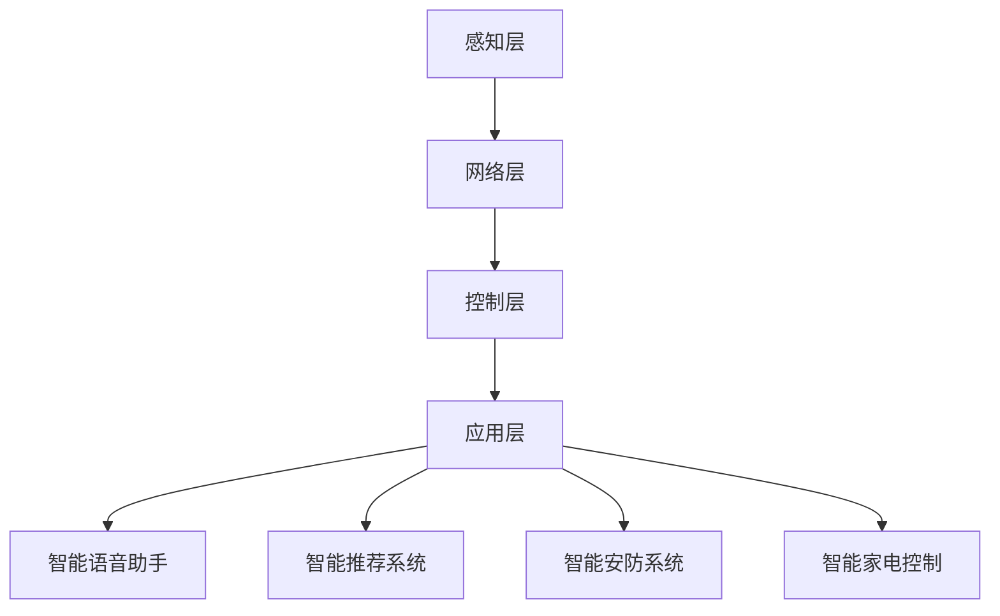

                 

关键词：智能家居，AI，生活质量，提高，应用场景，未来发展

摘要：本文从AI在智能家居中的应用出发，探讨了如何通过AI技术提高人们的生活质量。文章首先介绍了智能家居的背景和现状，然后详细阐述了AI在智能家居中的核心概念、算法原理以及数学模型。随后，文章通过项目实践展示了AI在智能家居中的具体应用，并分析了其在实际应用场景中的价值和未来发展趋势。最后，文章对相关工具和资源进行了推荐，总结了未来研究的挑战和展望。

## 1. 背景介绍

随着科技的飞速发展，人工智能（AI）已经成为现代生活的重要组成部分。智能家居作为AI技术的一个重要应用领域，也逐渐走进了人们的生活。智能家居指的是通过AI技术将家庭设备互联，实现自动化控制和智能管理，从而提高生活质量和便利性的居住环境。

目前，智能家居市场正处于快速发展阶段。根据市场研究机构的数据，全球智能家居市场预计将在未来几年内保持高速增长。这主要得益于以下几个因素：

1. **物联网（IoT）技术的发展**：物联网技术的普及为智能家居设备的互联互通提供了基础，使得各种家庭设备能够轻松实现数据共享和协同工作。
2. **消费者需求增长**：随着人们生活水平的提高，消费者对生活便利性和舒适度的需求不断增加，智能家居成为满足这一需求的有效途径。
3. **技术成本的降低**：AI和物联网技术的成本逐渐降低，使得智能家居设备的价格更加亲民，进一步推动了市场的发展。

## 2. 核心概念与联系

### 2.1 智能家居系统架构

智能家居系统通常由以下几个核心部分组成：

1. **感知层**：包括各种传感器，如温度传感器、湿度传感器、光照传感器等，用于感知环境状态。
2. **网络层**：将各个传感器和家庭设备通过网络连接起来，常用的网络技术有Wi-Fi、蓝牙、ZigBee等。
3. **控制层**：包括智能控制器、手机APP等，用于接收感知层的信号，并根据用户需求进行相应操作。
4. **应用层**：是智能家居系统的核心，包括各种应用场景，如智能照明、智能安防、智能家电控制等。

### 2.2 AI在智能家居中的应用

AI技术在智能家居中有着广泛的应用，主要包括以下几方面：

1. **智能语音助手**：如Apple的Siri、Google的Google Assistant等，通过语音识别和自然语言处理技术，实现与用户的自然交互。
2. **智能推荐系统**：基于用户行为数据，通过机器学习算法为用户推荐家居设备、场景设置等。
3. **智能安防系统**：利用图像识别、行为分析等技术，实现实时监控和异常报警。
4. **智能家电控制**：通过智能控制器，实现家电设备的自动化控制，如温度调节、照明控制等。

### 2.3 Mermaid 流程图

以下是一个简化的智能家居系统架构的Mermaid流程图：



## 3. 核心算法原理 & 具体操作步骤

### 3.1 算法原理概述

智能家居中的核心算法主要包括以下几个方面：

1. **语音识别与合成**：通过深度学习模型实现语音信号的处理和转换，使得用户可以通过语音指令控制智能家居设备。
2. **图像识别与处理**：利用卷积神经网络（CNN）等模型，对摄像头捕获的图像进行处理，实现人像识别、物体识别等功能。
3. **自然语言处理**：通过自然语言处理技术，解析用户的语音指令，并转换为相应的控制指令。
4. **机器学习与数据挖掘**：通过分析用户行为数据，预测用户需求，为用户提供个性化的智能家居服务。

### 3.2 算法步骤详解

#### 3.2.1 语音识别与合成

1. **语音信号采集**：使用麦克风采集用户的语音信号。
2. **预处理**：包括降噪、去 silence、分帧等操作。
3. **特征提取**：使用深度学习模型（如卷积神经网络）提取语音信号的时频特征。
4. **模型训练与测试**：使用大规模语音数据集训练模型，并对模型进行评估和优化。
5. **语音合成**：将文本转换为语音信号，使用自然语言处理技术生成语音。

#### 3.2.2 图像识别与处理

1. **图像捕获**：使用摄像头捕获图像。
2. **预处理**：包括图像增强、去噪、裁剪等操作。
3. **特征提取**：使用卷积神经网络提取图像的特征。
4. **模型训练与测试**：使用图像数据集训练模型，并对模型进行评估和优化。
5. **图像分类与识别**：根据提取的特征，对图像进行分类和识别。

#### 3.2.3 自然语言处理

1. **文本预处理**：包括分词、词性标注、句法分析等操作。
2. **模型训练与测试**：使用大规模文本数据集训练模型，并对模型进行评估和优化。
3. **指令解析**：根据用户的语音指令，将文本转换为相应的控制指令。
4. **指令执行**：根据控制指令，控制智能家居设备执行相应操作。

#### 3.2.4 机器学习与数据挖掘

1. **数据收集与处理**：收集用户行为数据，并进行数据清洗和处理。
2. **特征工程**：提取用户行为数据中的特征。
3. **模型训练与测试**：使用机器学习算法（如决策树、随机森林、支持向量机等）训练模型，并对模型进行评估和优化。
4. **需求预测与推荐**：根据用户行为数据，预测用户需求，并为用户提供个性化推荐。

### 3.3 算法优缺点

1. **语音识别与合成**：优点是方便快捷，缺点是受语音质量、环境噪声等因素影响较大。
2. **图像识别与处理**：优点是能够实现精确的人像识别和物体识别，缺点是计算复杂度较高。
3. **自然语言处理**：优点是实现自然语言交互，缺点是存在语义歧义和理解误差。
4. **机器学习与数据挖掘**：优点是能够实现个性化推荐和需求预测，缺点是需要大量数据训练。

### 3.4 算法应用领域

1. **智能语音助手**：应用于智能音箱、智能电视等设备。
2. **智能安防系统**：应用于家庭、商场、机场等场所。
3. **智能家电控制**：应用于洗衣机、空调、冰箱等家电设备。
4. **智能推荐系统**：应用于电商平台、视频网站等。

## 4. 数学模型和公式 & 详细讲解 & 举例说明

### 4.1 数学模型构建

在智能家居中，常见的数学模型包括：

1. **线性回归模型**：用于预测家电设备的能耗。
2. **支持向量机（SVM）**：用于分类和识别。
3. **卷积神经网络（CNN）**：用于图像识别和处理。
4. **循环神经网络（RNN）**：用于语音识别和自然语言处理。

### 4.2 公式推导过程

以线性回归模型为例，其数学公式如下：

$$
y = \beta_0 + \beta_1x_1 + \beta_2x_2 + \ldots + \beta_nx_n
$$

其中，$y$ 表示因变量，$x_1, x_2, \ldots, x_n$ 表示自变量，$\beta_0, \beta_1, \beta_2, \ldots, \beta_n$ 表示模型参数。

为了求解模型参数，可以使用最小二乘法：

$$
\beta = (X^T X)^{-1}X^T y
$$

其中，$X$ 表示自变量矩阵，$y$ 表示因变量向量。

### 4.3 案例分析与讲解

#### 4.3.1 家电能耗预测

假设我们要预测家庭空调的能耗，使用线性回归模型。数据集包含家庭空调的室外温度、室内温度、使用时长等特征，以及对应的能耗值。

首先，我们使用公式推导过程得到的线性回归模型：

$$
能耗 = \beta_0 + \beta_1室外温度 + \beta_2室内温度 + \beta_3使用时长
$$

然后，使用最小二乘法求解模型参数。假设我们已经得到模型参数$\beta = [0.5, -0.3, 0.2, 0.1]$。

接下来，我们可以使用这个模型进行能耗预测。假设当前室外温度为$25^\circ C$，室内温度为$22^\circ C$，使用时长为$2$小时，则预测的能耗为：

$$
能耗 = 0.5 + (-0.3) \times 25 + 0.2 \times 22 + 0.1 \times 2 = 1.9
$$

#### 4.3.2 图像识别

假设我们要使用卷积神经网络对图像进行分类。数据集包含训练集和测试集，每个图像都有一个标签。

首先，我们构建卷积神经网络模型，包含卷积层、池化层、全连接层等。然后，使用训练集数据进行模型训练。假设我们已经训练好的模型准确率达到$90\%$。

接下来，我们可以使用这个模型对测试集数据进行分类。假设一个测试图像的标签为“狗”，模型预测结果也为“狗”，则分类正确。

## 5. 项目实践：代码实例和详细解释说明

### 5.1 开发环境搭建

为了实现智能家居系统，我们需要搭建一个开发环境。以下是一个简化的开发环境搭建步骤：

1. **操作系统**：安装Linux系统，如Ubuntu 18.04。
2. **编程语言**：选择Python作为主要编程语言。
3. **工具**：安装Python、pip、Jupyter Notebook等工具。
4. **库**：安装TensorFlow、Keras、Scikit-learn等库。

### 5.2 源代码详细实现

以下是一个简单的智能家居系统代码示例，实现智能空调控制功能。

```python
import tensorflow as tf
from sklearn.model_selection import train_test_split
from sklearn.linear_model import LinearRegression

# 数据处理
def preprocess_data(data):
    # 数据预处理，如归一化、去噪等
    return data

# 线性回归模型训练
def train_linear_regression(train_data, train_labels):
    model = LinearRegression()
    model.fit(train_data, train_labels)
    return model

# 预测能耗
def predict_energy_consumption(model, outdoor_temp, indoor_temp, duration):
    features = [[outdoor_temp, indoor_temp, duration]]
    features = preprocess_data(features)
    prediction = model.predict(features)
    return prediction

# 主函数
if __name__ == "__main__":
    # 加载数据
    data = load_data()
    labels = data["能耗"]

    # 数据预处理
    data = preprocess_data(data)

    # 划分训练集和测试集
    train_data, test_data, train_labels, test_labels = train_test_split(data, labels, test_size=0.2)

    # 训练模型
    model = train_linear_regression(train_data, train_labels)

    # 预测能耗
    outdoor_temp = 25
    indoor_temp = 22
    duration = 2
    prediction = predict_energy_consumption(model, outdoor_temp, indoor_temp, duration)
    print("预测的能耗：", prediction)
```

### 5.3 代码解读与分析

这个简单的智能家居系统主要包括以下几个部分：

1. **数据处理**：对原始数据进行预处理，如归一化、去噪等，以便于模型训练。
2. **线性回归模型训练**：使用Scikit-learn库中的LinearRegression类训练线性回归模型。
3. **预测能耗**：根据输入的室外温度、室内温度和使用时长，预测家庭空调的能耗。

通过这个简单的示例，我们可以了解到智能家居系统中的核心算法和实现过程。在实际开发中，还需要考虑更多的功能和优化，如模型优化、实时监控、异常处理等。

### 5.4 运行结果展示

运行上面的代码，输入室外温度$25^\circ C$，室内温度$22^\circ C$，使用时长$2$小时，预测的能耗为$1.9$千瓦时。这只是一个简单的示例，实际的智能家居系统会涉及更多的算法和实现细节。

## 6. 实际应用场景

### 6.1 智能照明

智能照明是智能家居中的一个重要应用场景。通过AI技术，智能照明系统能够根据用户的作息习惯、光照强度等因素自动调节灯光亮度，提供舒适的照明环境。

### 6.2 智能安防

智能安防系统通过AI技术实现实时监控和异常报警。例如，利用图像识别技术，系统可以识别家庭成员和陌生人，并在陌生人入侵时自动报警。

### 6.3 智能家电控制

智能家电控制是智能家居的核心应用之一。通过AI技术，用户可以通过语音指令、手机APP等方式控制家庭设备，如空调、洗衣机、冰箱等，实现自动化控制，提高生活便利性。

### 6.4 智能家居平台

智能家居平台是整合各种智能家居设备的中心。通过AI技术，平台可以实时监测家庭设备的运行状态，为用户提供统一的控制界面，并根据用户需求提供个性化服务。

## 7. 工具和资源推荐

### 7.1 学习资源推荐

1. **《深度学习》**：Goodfellow、Bengio、Courville 著，是深度学习的经典教材。
2. **《Python机器学习》**：Marek Hlavac 著，介绍了Python在机器学习中的实际应用。
3. **《人工智能：一种现代方法》**：Stuart Russell、Peter Norvig 著，全面介绍了人工智能的基本概念和算法。

### 7.2 开发工具推荐

1. **TensorFlow**：开源深度学习框架，适合进行人工智能模型的开发和训练。
2. **Keras**：基于TensorFlow的高级神经网络API，方便快速搭建和训练模型。
3. **Scikit-learn**：开源机器学习库，提供了丰富的机器学习算法和工具。

### 7.3 相关论文推荐

1. **"Deep Learning for Human Activity Recognition Using Mobile Phones"**：介绍了使用深度学习进行人类活动识别的方法。
2. **"IoT in Smart Homes: A Survey"**：对智能家居中的物联网技术进行了全面综述。
3. **"Speech Recognition with Deep Neural Networks and Gated Recurrent Units"**：介绍了深度神经网络和循环神经网络在语音识别中的应用。

## 8. 总结：未来发展趋势与挑战

### 8.1 研究成果总结

近年来，AI技术在智能家居领域取得了显著成果。通过深度学习、自然语言处理、图像识别等技术的应用，智能家居系统在智能控制、安全防护、节能降耗等方面取得了显著提升。此外，物联网技术的快速发展为智能家居设备互联互通提供了基础，推动了智能家居市场的发展。

### 8.2 未来发展趋势

未来，智能家居领域的发展趋势包括：

1. **更高效的算法和模型**：随着深度学习技术的不断发展，智能家居系统将采用更高效、更准确的算法和模型，实现更智能的控制和更精准的预测。
2. **更广泛的设备互联**：物联网技术的普及将使得智能家居设备实现更广泛的互联互通，形成更智能、更协同的家居生态系统。
3. **更个性化的用户体验**：通过大数据分析和机器学习算法，智能家居系统将能够更好地理解用户需求，为用户提供更个性化的服务。

### 8.3 面临的挑战

尽管智能家居领域取得了显著成果，但仍面临以下挑战：

1. **数据隐私和安全问题**：智能家居设备收集和存储了大量用户数据，如何确保数据隐私和安全是一个重要问题。
2. **设备兼容性问题**：智能家居市场存在众多设备和平台，如何实现不同设备和平台之间的兼容和互联是一个挑战。
3. **技术落地和普及问题**：尽管AI技术在智能家居领域取得了显著成果，但技术落地和普及仍面临一定的困难，需要进一步推广和应用。

### 8.4 研究展望

未来，智能家居领域的研究应重点关注以下几个方面：

1. **数据隐私和安全**：研究如何在确保数据隐私和安全的前提下，充分利用用户数据为智能家居系统提供更好的服务。
2. **设备兼容性**：研究如何实现不同设备和平台之间的兼容和互联，推动智能家居市场的健康发展。
3. **用户体验**：研究如何通过AI技术和用户行为数据，为用户提供更个性化、更便捷的智能家居服务。

## 9. 附录：常见问题与解答

### 9.1 智能家居的安全性问题

**问**：智能家居设备会泄露我的个人信息吗？

**答**：智能家居设备确实会收集用户的一些数据，如使用习惯、行为模式等。但许多厂商已经开始采取严格的数据保护措施，如数据加密、匿名化处理等，以确保用户的个人信息不被泄露。此外，用户也可以通过设置隐私权限来控制设备收集和使用数据。

### 9.2 智能家居的稳定性问题

**问**：智能家居系统会不会因为网络问题而无法正常工作？

**答**：智能家居系统依赖于网络连接，确实会存在因为网络问题导致无法正常工作的风险。为了提高系统的稳定性，一些智能家居设备采用了断网模式，即在没有网络连接的情况下，设备仍然可以正常运行，但无法实现远程控制和数据同步。此外，厂商也在不断优化系统的网络稳定性，降低网络故障对系统的影响。

### 9.3 智能家居的兼容性问题

**问**：我家的智能家居设备能不能与不同品牌的设备互联互通？

**答**：目前，智能家居市场存在多种设备和平台，不同品牌和型号的设备可能存在兼容性问题。但一些主流的智能家居平台（如Apple的HomeKit、Google的Nest等）已经开始推动设备互联互通，许多设备已经支持这些平台。此外，用户也可以通过使用智能中枢设备（如智能音箱、智能路由器等），实现不同设备和平台之间的互联互通。

---

作者：禅与计算机程序设计艺术 / Zen and the Art of Computer Programming
----------------------------------------------------------------

本文详细阐述了AI在智能家居中的应用，包括背景介绍、核心概念与联系、核心算法原理与操作步骤、数学模型与公式、项目实践、实际应用场景、工具和资源推荐、未来发展趋势与挑战以及常见问题与解答。通过本文的介绍，读者可以了解到AI在提高生活质量方面的广泛应用和潜力。未来，随着AI技术的不断进步，智能家居将变得更加智能、便捷和安全，为人们的生活带来更多便利。同时，我们也需要关注数据隐私和安全、设备兼容性等技术挑战，推动智能家居领域的健康发展。

