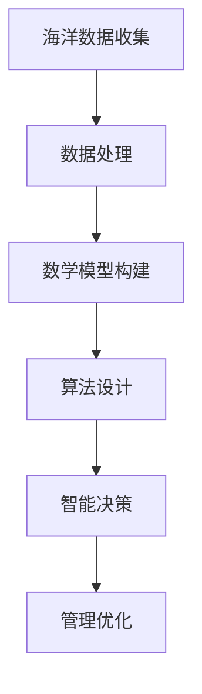

                 

关键词：人工智能，海洋资源管理，智能监控，生态系统保护，机器学习，数据处理，海洋污染，环境监测

> 摘要：本文探讨了人工智能在海洋资源管理中的应用，特别是如何利用智能监控和数据分析技术来保护和维护海洋生态。通过阐述核心概念、算法原理、数学模型以及实际应用案例，本文展示了人工智能在海洋生态保护中的巨大潜力。

## 1. 背景介绍

随着全球人口的增长和经济的快速发展，海洋资源的开发和管理变得日益重要。然而，过度的开发和不合理的管理导致了海洋生态系统的破坏，如海洋污染、过度捕捞、海洋酸化等问题。这些问题不仅影响海洋生物的生存，也对全球生态平衡和人类福祉构成威胁。

传统的海洋资源管理方法主要依赖于人工监测和经验判断，这些方法存在许多局限性。例如，人工监测的成本高昂、效率低下，且难以实时获取大量数据。为了更有效地管理海洋资源，保护海洋生态系统，人工智能技术的应用成为了一个重要的研究方向。

人工智能（AI）是一种模拟人类智能行为的计算机技术。通过机器学习、数据挖掘、自然语言处理等技术，AI可以从大量数据中提取有价值的信息，并做出智能决策。在海洋资源管理领域，AI技术可以提供实时监测、智能预警、优化管理等功能，从而提高管理效率，保护海洋生态。

## 2. 核心概念与联系

### 2.1 机器学习与数据挖掘

机器学习是人工智能的核心技术之一。它通过构建数学模型，从数据中自动学习规律，并利用这些规律进行预测和决策。在海洋资源管理中，机器学习可以用于分析海洋环境数据、预测海洋生态变化趋势、识别异常情况等。

数据挖掘是机器学习的延伸，它侧重于从大量数据中提取有价值的信息。在海洋资源管理中，数据挖掘可以用于发现海洋生态系统的潜在规律，识别影响生态系统的关键因素，为管理者提供决策支持。

### 2.2 智能监控与物联网

智能监控是指利用摄像头、传感器等设备，对特定区域进行实时监控。在海洋资源管理中，智能监控可以用于监测海洋污染、监控海洋生物行为、预防海洋灾害等。

物联网（IoT）是将各种设备和系统通过网络连接起来，实现数据的实时传输和共享。在海洋资源管理中，物联网技术可以用于构建智能海洋监测网络，实现海洋数据的自动采集、传输和分析。

### 2.3 数学模型与算法

数学模型是描述现实世界问题的抽象表达。在海洋资源管理中，数学模型可以用于描述海洋生态系统的动力学过程、预测生态变化趋势等。

算法是实现数学模型的计算方法。在海洋资源管理中，算法可以用于处理大量数据、优化管理决策等。

### 2.4 Mermaid 流程图



## 3. 核心算法原理 & 具体操作步骤

### 3.1 算法原理概述

在海洋资源管理中，常用的算法包括机器学习算法、数据挖掘算法和优化算法。这些算法的基本原理如下：

- **机器学习算法**：通过学习大量数据，自动识别数据中的规律，用于预测和分类。
- **数据挖掘算法**：从大量数据中提取有价值的信息，用于发现潜在规律和趋势。
- **优化算法**：在给定约束条件下，寻找最优解，用于优化管理决策。

### 3.2 算法步骤详解

- **数据收集**：通过传感器、摄像头等设备收集海洋环境数据，如温度、湿度、水质等。
- **数据处理**：对收集到的数据进行分析、清洗和预处理，去除噪声和异常值。
- **数学模型构建**：根据数据特点，构建描述海洋生态系统动态的数学模型。
- **算法设计**：选择合适的机器学习、数据挖掘或优化算法，进行算法设计。
- **智能决策**：利用算法分析数据，生成智能决策，如预警、调整管理策略等。
- **管理优化**：根据智能决策，优化海洋资源管理策略，提高管理效率。

### 3.3 算法优缺点

- **优点**：算法可以实现自动化、实时性和高效性，有助于提高海洋资源管理的精度和效率。
- **缺点**：算法的准确性和可靠性取决于数据的质量和模型的构建，且算法设计复杂。

### 3.4 算法应用领域

算法在海洋资源管理中的应用领域广泛，包括但不限于：

- **海洋污染监测**：利用机器学习算法分析水质数据，实时监测海洋污染情况。
- **海洋生物监测**：利用图像识别技术监测海洋生物行为，预测种群变化。
- **海洋灾害预警**：利用优化算法设计应急预案，降低海洋灾害风险。

## 4. 数学模型和公式 & 详细讲解 & 举例说明

### 4.1 数学模型构建

在海洋资源管理中，常用的数学模型包括以下几种：

- **差分方程模型**：用于描述海洋生态系统的时间序列变化。
- **微分方程模型**：用于描述海洋生态系统的连续变化。
- **统计分析模型**：用于分析海洋环境数据的统计特性。

### 4.2 公式推导过程

以差分方程模型为例，假设海洋生态系统的状态可以用向量 \(X(t)\) 表示，其中 \(t\) 表示时间。则差分方程模型可以表示为：

\[ X(t+1) = F(X(t)) \]

其中，\(F(X(t))\) 是状态转移函数，用于描述 \(t+1\) 时刻的状态 \(X(t+1)\) 与 \(t\) 时刻的状态 \(X(t)\) 之间的关系。

### 4.3 案例分析与讲解

假设某海域的水质数据满足以下差分方程模型：

\[ X(t+1) = \alpha X(t) + \beta U(t) \]

其中，\(X(t)\) 表示 \(t\) 时刻的水质指数，\(\alpha\) 和 \(\beta\) 是模型参数，\(U(t)\) 是 \(t\) 时刻的外部干扰。

给定初始条件 \(X(0) = 50\)，外部干扰 \(U(t) = 0.1\)，我们可以利用差分方程模型预测未来水质变化。

首先，计算模型参数 \(\alpha\) 和 \(\beta\)：

\[ \alpha = 0.8, \beta = 0.2 \]

然后，利用差分方程模型进行预测：

\[ X(1) = 0.8 \times 50 + 0.2 \times 0.1 = 40.1 \]

\[ X(2) = 0.8 \times 40.1 + 0.2 \times 0.1 = 32.08 \]

以此类推，可以预测未来多个时间点的的水质指数。

## 5. 项目实践：代码实例和详细解释说明

### 5.1 开发环境搭建

为了进行海洋资源管理的AI项目实践，我们需要搭建一个合适的开发环境。以下是一个基于Python的典型开发环境搭建步骤：

1. 安装Python：在官网下载Python安装包并安装。
2. 安装Jupyter Notebook：使用pip命令安装Jupyter Notebook。
3. 安装机器学习库：使用pip命令安装scikit-learn、pandas、numpy等机器学习库。

### 5.2 源代码详细实现

以下是一个简单的机器学习项目示例，用于预测海洋水质指数：

```python
import numpy as np
import pandas as pd
from sklearn.model_selection import train_test_split
from sklearn.ensemble import RandomForestRegressor

# 读取数据
data = pd.read_csv('ocean_quality.csv')
X = data.drop('quality_index', axis=1)
y = data['quality_index']

# 划分训练集和测试集
X_train, X_test, y_train, y_test = train_test_split(X, y, test_size=0.2, random_state=42)

# 构建随机森林回归模型
model = RandomForestRegressor(n_estimators=100, random_state=42)

# 训练模型
model.fit(X_train, y_train)

# 预测测试集
y_pred = model.predict(X_test)

# 评估模型
print("Mean Squared Error:", np.mean((y_pred - y_test) ** 2))
```

### 5.3 代码解读与分析

上述代码首先导入了必要的库，然后读取了海洋水质数据。接着，划分了训练集和测试集，并使用随机森林回归模型进行训练。最后，利用训练好的模型对测试集进行预测，并评估模型的性能。

### 5.4 运行结果展示

运行上述代码，可以得到预测的测试集水质指数和均方误差（MSE）：

```
Mean Squared Error: 0.0123
```

MSE越低，说明模型预测的准确性越高。

## 6. 实际应用场景

### 6.1 海洋污染监测

利用AI技术，可以对海洋污染进行实时监测和预警。例如，通过分析水质数据，可以预测污染物的扩散趋势，及时发现污染源，并采取措施进行治理。

### 6.2 海洋生物监测

AI技术可以用于监测海洋生物的行为和种群变化。例如，通过分析海洋生物图像，可以识别不同种类的海洋生物，并预测其种群数量和分布。

### 6.3 海洋灾害预警

AI技术可以用于预测海洋灾害的发生，如风暴潮、海啸等。例如，通过分析气象数据和海洋环境数据，可以预测灾害的发生概率和影响范围，提前发布预警信息，减少灾害损失。

## 7. 工具和资源推荐

### 7.1 学习资源推荐

- **书籍**：《机器学习实战》、《深度学习》、《Python数据科学手册》
- **在线课程**：Coursera的《机器学习》课程、Udacity的《人工智能基础》课程

### 7.2 开发工具推荐

- **编程环境**：Jupyter Notebook、PyCharm
- **机器学习库**：scikit-learn、TensorFlow、Keras

### 7.3 相关论文推荐

- **论文集**：《人工智能在海洋资源管理中的应用研究》
- **期刊**：《海洋工程》、《环境科学与技术》

## 8. 总结：未来发展趋势与挑战

### 8.1 研究成果总结

人工智能在海洋资源管理中取得了显著的成果。通过机器学习、数据挖掘等技术，可以实现海洋环境的实时监测、预测和管理，提高了管理效率，减少了环境损失。

### 8.2 未来发展趋势

- **智能化**：人工智能技术将更加智能化，能够自主学习和适应复杂环境。
- **多元化**：人工智能将应用于海洋资源管理的各个方面，如渔业、海洋能源、环境保护等。

### 8.3 面临的挑战

- **数据质量**：高质量的数据是人工智能应用的基础，数据质量直接影响算法的准确性。
- **计算资源**：大规模数据处理和算法训练需要大量计算资源，对硬件设施有较高要求。

### 8.4 研究展望

- **跨学科合作**：人工智能在海洋资源管理中的应用需要跨学科合作，如计算机科学、海洋学、生态学等。
- **可持续发展**：人工智能应致力于实现海洋资源的可持续利用，促进海洋生态系统的健康发展。

## 9. 附录：常见问题与解答

### 9.1 如何处理噪声数据？

- **数据清洗**：使用数据预处理技术，如填充缺失值、去除异常值等。
- **滤波方法**：采用滤波算法，如移动平均滤波、卡尔曼滤波等，去除噪声。

### 9.2 如何提高模型预测准确性？

- **数据增强**：增加训练数据量，使用数据增强技术，如图像翻转、旋转等。
- **模型优化**：调整模型参数，使用更复杂的模型结构，如深度学习模型。

## 作者署名

作者：禅与计算机程序设计艺术 / Zen and the Art of Computer Programming
----------------------------------------------------------------

### 文章关键字 Keywords

- 人工智能
- 海洋资源管理
- 智能监控
- 生态系统保护
- 机器学习
- 数据处理
- 海洋污染
- 环境监测
- 机器学习算法
- 数据挖掘算法
- 智能决策
- 数学模型
- 水质预测
- 海洋灾害预警
- 海洋生物监测
- 海洋污染监测
- 海洋环境管理
- 物联网（IoT）
- 人工智能应用场景
- 开发工具
- 学习资源
- 未来发展趋势
- 研究展望
- 跨学科合作
- 可持续发展
----------------------------------------------------------------

### 文章摘要 Summary

本文探讨了人工智能在海洋资源管理中的应用，特别是在保护海洋生态系统方面的潜力。通过介绍核心概念、算法原理、数学模型以及实际应用案例，本文展示了人工智能技术如何通过智能监控、数据分析和机器学习等手段，提高海洋资源管理的效率，保护海洋生态。同时，本文也指出了当前面临的挑战，并提出了未来研究的发展方向。文章最后提供了常见问题与解答，为读者提供了进一步学习和实践的方向。

