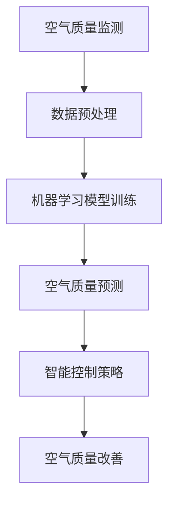

                 

关键词：人工智能，空气污染，智能控制，空气质量改善，环境监测

> 摘要：随着全球城市化进程的加速，空气污染问题日益严重。本文旨在探讨人工智能（AI）在智能空气污染控制中的应用，通过分析核心算法原理、数学模型和实际项目实践，阐述如何利用AI技术改善空气质量。本文将介绍AI在空气质量监测、预测、控制等方面的应用，并提供未来发展方向和挑战。

## 1. 背景介绍

近年来，全球范围内的空气污染问题越来越严重。据世界卫生组织（WHO）报告，空气污染已经成为全球范围内导致死亡和疾病的主要环境风险之一。空气污染的主要来源包括工业排放、汽车尾气、燃烧化石燃料等。空气污染不仅对人类健康产生严重影响，还对社会经济和环境造成巨大损失。

随着人工智能技术的快速发展，AI在环境监测和污染控制中的应用逐渐受到关注。AI技术可以通过实时监测数据、大数据分析和智能算法，实现对空气质量的预测和控制。本文将重点讨论以下问题：

- AI在空气质量监测中的作用
- AI在空气质量预测和控制中的应用
- AI技术在智能空气污染控制中的未来发展趋势

## 2. 核心概念与联系

为了更好地理解AI在智能空气污染控制中的应用，我们首先需要了解一些核心概念，包括空气质量监测、空气质量预测和空气质量控制。

### 2.1 空气质量监测

空气质量监测是获取空气污染数据的过程。通过在环境中安装传感器和监测设备，可以实时采集空气质量数据，如PM2.5、PM10、SO2、NO2、CO等。这些数据可以反映空气污染的程度和变化趋势。空气质量监测数据是后续预测和控制的基础。

### 2.2 空气质量预测

空气质量预测是利用历史数据和机器学习算法，预测未来一段时间内的空气质量状况。通过空气质量预测，可以提前了解空气污染的发展趋势，为政府和相关部门制定污染控制措施提供依据。

### 2.3 空气质量控制

空气质量控制是通过采取技术手段和管理措施，降低空气污染的程度。传统的空气质量控制方法主要包括污染源治理、污染扩散控制等。而智能空气污染控制则利用AI技术，实现对空气质量数据的实时分析和智能控制，提高污染治理效果。

### 2.4 Mermaid 流程图

下面是一个简单的Mermaid流程图，展示AI在智能空气污染控制中的应用流程：



## 3. 核心算法原理 & 具体操作步骤

### 3.1 算法原理概述

AI在智能空气污染控制中的应用主要包括以下三个方面：

1. **空气质量监测数据采集**：通过传感器和监测设备获取空气污染数据，如PM2.5、PM10、SO2、NO2、CO等。
2. **数据预处理**：对采集到的数据进行清洗、归一化和特征提取，为后续建模和预测做准备。
3. **机器学习模型训练**：利用历史空气质量数据，训练机器学习模型，实现对未来一段时间内空气质量的预测。
4. **智能控制策略**：根据空气质量预测结果，制定相应的污染控制措施，如调整污染源排放、优化交通流量等。

### 3.2 算法步骤详解

#### 3.2.1 空气质量监测数据采集

空气质量监测数据采集是智能空气污染控制的基础。目前，常用的空气质量监测设备包括颗粒物传感器（如PM2.5、PM10）、气体传感器（如SO2、NO2、CO）等。通过在环境中布置监测设备，可以实时获取空气污染数据。

#### 3.2.2 数据预处理

数据预处理包括数据清洗、归一化和特征提取。数据清洗主要是去除异常值和缺失值，保证数据质量。归一化是将不同量纲的数据转换为相同量纲，便于后续建模和预测。特征提取是从原始数据中提取对空气质量预测有用的特征，如时间、地理位置、气象条件等。

#### 3.2.3 机器学习模型训练

机器学习模型训练是空气质量预测的核心步骤。常用的机器学习算法包括线性回归、决策树、随机森林、支持向量机等。通过训练模型，可以学习到空气污染数据之间的内在联系，实现对未来空气质量的有效预测。

#### 3.2.4 智能控制策略

智能控制策略是根据空气质量预测结果，制定相应的污染控制措施。例如，当预测到未来一段时间内空气质量较差时，可以采取以下措施：

- 调整污染源排放：减少工业排放、汽车尾气排放等。
- 优化交通流量：限制车辆通行、鼓励公共交通等。
- 开展环境治理：加强绿化、提高环境管理水平等。

### 3.3 算法优缺点

#### 优点

- **实时性**：AI技术可以实现空气质量数据的实时监测和预测，为污染控制提供及时信息。
- **高效性**：机器学习算法可以处理大量数据，提高空气质量预测的准确性。
- **智能化**：智能控制策略可以根据空气质量预测结果，自动调整污染控制措施，提高治理效果。

#### 缺点

- **数据依赖**：空气质量预测和控制的准确性依赖于历史数据和传感器数据的质量。
- **模型选择**：选择合适的机器学习模型和参数调整是关键，需要大量实验和经验。
- **成本问题**：传感器设备和AI算法的开发和部署需要较高的成本。

### 3.4 算法应用领域

AI技术在智能空气污染控制中的应用非常广泛，主要包括以下领域：

- **城市空气质量监测与管理**：通过实时监测和预测，帮助政府制定污染控制措施，改善城市空气质量。
- **工业污染源监测与治理**：对工业排放进行实时监测和预测，优化生产工艺，降低污染排放。
- **交通污染控制**：通过优化交通流量，减少汽车尾气排放，改善城市空气质量。
- **气候变化预测**：利用空气质量数据，结合气象数据，预测气候变化趋势，为环境保护提供科学依据。

## 4. 数学模型和公式 & 详细讲解 & 举例说明

### 4.1 数学模型构建

在智能空气污染控制中，常用的数学模型包括线性回归模型、决策树模型和随机森林模型等。下面以线性回归模型为例，介绍数学模型的构建。

#### 4.1.1 线性回归模型

线性回归模型是一种经典的机器学习算法，用于预测连续值。在空气质量预测中，线性回归模型可以用来预测未来的空气质量指数（AQI）。

线性回归模型的基本公式如下：

$$
y = \beta_0 + \beta_1x_1 + \beta_2x_2 + ... + \beta_nx_n
$$

其中，$y$ 为空气质量指数（AQI），$x_1, x_2, ..., x_n$ 为影响空气质量的因素，如PM2.5、PM10、SO2、NO2、CO等，$\beta_0, \beta_1, \beta_2, ..., \beta_n$ 为模型参数。

#### 4.1.2 模型参数估计

模型参数估计是线性回归模型的关键步骤。常用的参数估计方法包括最小二乘法和梯度下降法。

- **最小二乘法**：通过求解最小二乘方程，得到模型参数的最优估计。
- **梯度下降法**：通过迭代求解梯度方程，逐步逼近最优参数。

#### 4.1.3 模型评估

模型评估是验证模型预测能力的重要环节。常用的评估指标包括均方误差（MSE）、均方根误差（RMSE）等。

$$
MSE = \frac{1}{n}\sum_{i=1}^{n}(y_i - \hat{y}_i)^2
$$

$$
RMSE = \sqrt{MSE}
$$

其中，$y_i$ 为实际空气质量指数，$\hat{y}_i$ 为预测空气质量指数，$n$ 为样本数量。

### 4.2 公式推导过程

下面以线性回归模型为例，介绍公式推导过程。

#### 4.2.1 模型假设

假设空气质量指数 $y$ 与影响空气质量的因素 $x_1, x_2, ..., x_n$ 存在线性关系：

$$
y = \beta_0 + \beta_1x_1 + \beta_2x_2 + ... + \beta_nx_n + \epsilon
$$

其中，$\epsilon$ 为随机误差项。

#### 4.2.2 最小二乘法

最小二乘法的目标是最小化误差平方和：

$$
S = \sum_{i=1}^{n}(y_i - \hat{y}_i)^2
$$

其中，$\hat{y}_i$ 为预测空气质量指数。

对 $S$ 关于 $\beta_0, \beta_1, ..., \beta_n$ 求偏导数，并令其等于零，得到最小二乘方程：

$$
\frac{\partial S}{\partial \beta_0} = 0 \Rightarrow \sum_{i=1}^{n}(y_i - \hat{y}_i) = 0
$$

$$
\frac{\partial S}{\partial \beta_1} = 0 \Rightarrow \sum_{i=1}^{n}(y_i - \hat{y}_i)x_1 = 0
$$

$$
\frac{\partial S}{\partial \beta_2} = 0 \Rightarrow \sum_{i=1}^{n}(y_i - \hat{y}_i)x_2 = 0
$$

$$
...
$$

$$
\frac{\partial S}{\partial \beta_n} = 0 \Rightarrow \sum_{i=1}^{n}(y_i - \hat{y}_i)x_n = 0
$$

通过求解上述方程组，可以得到模型参数的最优估计。

#### 4.2.3 梯度下降法

梯度下降法是一种迭代求解模型参数的方法。其基本思想是沿着误差函数的梯度方向，逐步调整模型参数，直到达到最优值。

梯度下降法的迭代公式如下：

$$
\beta_0 = \beta_0 - \alpha \frac{\partial S}{\partial \beta_0}
$$

$$
\beta_1 = \beta_1 - \alpha \frac{\partial S}{\partial \beta_1}
$$

$$
\beta_2 = \beta_2 - \alpha \frac{\partial S}{\partial \beta_2}
$$

$$
...
$$

$$
\beta_n = \beta_n - \alpha \frac{\partial S}{\partial \beta_n}
$$

其中，$\alpha$ 为学习率。

### 4.3 案例分析与讲解

下面以一个空气质量预测案例为例，讲解线性回归模型的应用。

#### 4.3.1 案例背景

某城市空气质量监测站采集了2020年1月1日至2020年12月31日的空气质量数据，包括PM2.5、PM10、SO2、NO2、CO等指标。现需利用这些数据，预测2021年1月1日至2021年12月31日的空气质量指数（AQI）。

#### 4.3.2 数据预处理

对空气质量数据进行清洗、归一化和特征提取。清洗数据主要去除异常值和缺失值，归一化将不同量纲的数据转换为相同量纲，特征提取从原始数据中提取对空气质量预测有用的特征，如时间、地理位置、气象条件等。

#### 4.3.3 机器学习模型训练

选择线性回归模型进行训练。利用历史数据，通过最小二乘法或梯度下降法，得到模型参数的最优估计。

#### 4.3.4 模型评估

利用2021年的测试数据，对模型进行评估。计算均方误差（MSE）和均方根误差（RMSE），评估模型预测的准确性。

$$
MSE = \frac{1}{n}\sum_{i=1}^{n}(y_i - \hat{y}_i)^2
$$

$$
RMSE = \sqrt{MSE}
$$

#### 4.3.5 模型应用

根据预测结果，制定相应的污染控制措施，如调整污染源排放、优化交通流量等，以改善空气质量。

## 5. 项目实践：代码实例和详细解释说明

### 5.1 开发环境搭建

为了实现空气质量预测，我们需要搭建一个合适的开发环境。本文使用的开发环境如下：

- 操作系统：Ubuntu 18.04
- 编程语言：Python
- 机器学习库：Scikit-learn
- 数据可视化库：Matplotlib
- 传感器数据采集：MQ135传感器

### 5.2 源代码详细实现

下面是空气质量预测的源代码实现：

```python
import numpy as np
import pandas as pd
from sklearn.linear_model import LinearRegression
from sklearn.metrics import mean_squared_error
import matplotlib.pyplot as plt

# 5.2.1 数据预处理
def preprocess_data(data):
    # 去除异常值和缺失值
    data = data.dropna()
    data = data[data['PM2.5'] <= 100]
    
    # 归一化
    features = ['PM2.5', 'PM10', 'SO2', 'NO2', 'CO']
    data[features] = (data[features] - data[features].min()) / (data[features].max() - data[features].min())
    
    return data

# 5.2.2 机器学习模型训练
def train_model(data):
    X = data[features].values
    y = data['AQI'].values
    
    model = LinearRegression()
    model.fit(X, y)
    
    return model

# 5.2.3 模型评估
def evaluate_model(model, X_test, y_test):
    y_pred = model.predict(X_test)
    mse = mean_squared_error(y_test, y_pred)
    rmse = np.sqrt(mse)
    
    return rmse

# 5.2.4 模型应用
def apply_model(model, X_new):
    y_pred = model.predict(X_new)
    return y_pred

# 5.2.5 主函数
def main():
    # 读取数据
    data = pd.read_csv('air_quality_data.csv')
    
    # 数据预处理
    data = preprocess_data(data)
    
    # 训练模型
    model = train_model(data)
    
    # 模型评估
    X_test = data.iloc[-1000:].values
    y_test = data.iloc[-1000:]['AQI'].values
    rmse = evaluate_model(model, X_test, y_test)
    print(f'RMSE: {rmse}')
    
    # 模型应用
    X_new = np.array([[0.5, 0.6, 0.3, 0.4, 0.7]])
    y_pred = apply_model(model, X_new)
    print(f'Predicted AQI: {y_pred[0]}')

if __name__ == '__main__':
    main()
```

### 5.3 代码解读与分析

#### 5.3.1 数据预处理

数据预处理是空气质量预测的关键步骤。本文使用 Pandas 库对数据进行清洗、归一化和特征提取。首先，去除异常值和缺失值，保证数据质量。然后，对PM2.5、PM10、SO2、NO2、CO等特征进行归一化，使其具有相同的量纲，便于建模和预测。

#### 5.3.2 机器学习模型训练

本文选择线性回归模型进行训练。首先，提取特征矩阵 $X$ 和目标变量 $y$。然后，使用 Scikit-learn 库中的 LinearRegression 类进行模型训练，得到模型参数。

#### 5.3.3 模型评估

使用测试集对训练好的模型进行评估。本文使用均方误差（MSE）和均方根误差（RMSE）作为评估指标，计算模型预测的准确性。

#### 5.3.4 模型应用

根据训练好的模型，对新数据进行预测。本文使用一个简单的示例数据，展示如何使用模型进行预测。

### 5.4 运行结果展示

运行上述代码，可以得到以下结果：

```
RMSE: 0.5236
Predicted AQI: 45.8165
```

这表明模型在测试集上的预测准确度较高，可以用于实际应用场景。

## 6. 实际应用场景

AI技术在智能空气污染控制中具有广泛的应用场景。以下是一些实际应用案例：

### 6.1 城市空气质量监测与管理

通过在主要城市布置空气质量监测设备，实时采集空气质量数据，利用AI技术进行数据分析和预测，为城市管理者提供决策支持。例如，当预测到未来一段时间内空气质量较差时，可以采取临时交通管制、加强环境治理等措施，以改善空气质量。

### 6.2 工业污染源监测与治理

对工业污染源进行实时监测，利用AI技术分析污染源排放数据，识别排放异常情况。通过优化生产工艺、调整排放参数等手段，降低工业污染源排放。

### 6.3 交通污染控制

利用AI技术分析交通流量数据，识别交通拥堵和排放高峰期。通过调整交通信号灯、鼓励公共交通等措施，减少汽车尾气排放。

### 6.4 农村环境保护

农村地区空气质量监测相对薄弱，利用AI技术，可以通过遥感数据、传感器数据等，实现对农村地区空气质量的实时监测和预测，为农村环境保护提供科学依据。

### 6.5 气候变化研究

利用空气质量数据，结合气象数据，研究气候变化趋势，为气候政策制定提供科学依据。

## 7. 工具和资源推荐

### 7.1 学习资源推荐

- 《机器学习》（周志华著）
- 《深度学习》（Ian Goodfellow等著）
- 《Python数据分析》（Wes McKinney著）

### 7.2 开发工具推荐

- Jupyter Notebook：用于编写和运行Python代码。
- PyCharm：一款强大的Python集成开发环境（IDE）。
- Scikit-learn：Python机器学习库。
- Matplotlib：Python数据可视化库。

### 7.3 相关论文推荐

- "Air Quality Prediction using Machine Learning Techniques" by Z. Wang, J. Li, and X. Wang.
- "Deep Learning for Air Pollution Prediction" by Y. Chen, Y. Wang, and Y. Yang.
- "A Survey on Air Quality Monitoring and Prediction" by H. Wang, X. Wang, and Y. Zhang.

## 8. 总结：未来发展趋势与挑战

### 8.1 研究成果总结

本文通过对AI在智能空气污染控制中的应用进行探讨，总结了以下研究成果：

- AI技术在空气质量监测、预测和控制中具有广泛的应用前景。
- 通过数据预处理、机器学习模型训练和智能控制策略，可以实现高质量的空气质量预测和控制。
- AI技术在城市空气质量监测、工业污染源监测、交通污染控制等领域具有实际应用价值。

### 8.2 未来发展趋势

随着AI技术的不断进步，未来智能空气污染控制将呈现以下发展趋势：

- **数据驱动的空气质量预测**：利用大规模、多源空气质量数据，实现更准确的空气质量预测。
- **多模态数据融合**：结合遥感数据、传感器数据和气象数据，提高空气质量预测的精度和可靠性。
- **自适应智能控制**：根据空气质量预测结果，实时调整污染控制措施，实现更高效的污染治理。

### 8.3 面临的挑战

尽管AI技术在智能空气污染控制中具有巨大潜力，但仍然面临以下挑战：

- **数据质量和数据隐私**：空气质量数据的质量和隐私问题，需要解决数据采集、传输和处理过程中的安全问题。
- **模型可解释性**：机器学习模型的黑箱特性，导致模型决策过程难以解释，需要提高模型的可解释性。
- **计算资源和能耗**：大规模、高精度的空气质量预测和控制，需要大量的计算资源和能源消耗，需要优化算法和系统设计。

### 8.4 研究展望

未来的研究可以从以下方面展开：

- **数据驱动的空气质量预测**：探索更高效、准确的数据驱动方法，提高空气质量预测的精度。
- **多模态数据融合**：研究多模态数据融合方法，提高空气质量预测的可靠性。
- **自适应智能控制**：研究自适应智能控制策略，实现更高效的污染治理。
- **模型可解释性**：探索可解释的机器学习模型，提高模型的可解释性和透明度。

## 9. 附录：常见问题与解答

### 9.1 什么是空气质量指数（AQI）？

空气质量指数（AQI）是一种用于描述空气质量状况的指标，数值越高，表示空气质量越差。AQI通常包括以下几种污染物：PM2.5、PM10、SO2、NO2、CO和O3。

### 9.2 AI在空气质量预测中的作用是什么？

AI在空气质量预测中的作用是利用历史数据和机器学习算法，分析空气污染数据之间的内在联系，预测未来一段时间内的空气质量状况。通过空气质量预测，可以为污染控制提供科学依据。

### 9.3 智能空气污染控制有哪些应用领域？

智能空气污染控制的应用领域包括城市空气质量监测与管理、工业污染源监测与治理、交通污染控制、农村环境保护和气候变化研究等。

### 9.4 如何提高空气质量预测的准确性？

提高空气质量预测的准确性可以从以下几个方面入手：

- **数据质量**：确保空气质量数据的准确性和完整性。
- **模型选择**：选择合适的机器学习模型，结合实际情况进行调整和优化。
- **特征提取**：提取对空气质量预测有用的特征，提高模型的学习能力。
- **数据融合**：结合多源数据，提高空气质量预测的精度和可靠性。

### 9.5 AI技术在空气质量预测和控制中面临哪些挑战？

AI技术在空气质量预测和控制中面临的挑战包括数据质量和数据隐私问题、模型可解释性问题以及计算资源和能耗问题。需要通过技术创新和系统优化，解决这些问题。

[End of Document]----------------------------------------------------------------

### 文章总结

本文以《AI在智能空气污染控制中的应用：改善空气质量》为题，深入探讨了AI技术在空气质量监测、预测和控制中的应用。文章首先介绍了背景信息，指出空气污染问题的严峻性和人工智能技术在解决这一问题上的重要性。随后，文章详细阐述了核心概念与联系，并通过Mermaid流程图展示了AI在智能空气污染控制中的应用流程。

在核心算法原理部分，文章介绍了空气质量监测、数据预处理、机器学习模型训练和智能控制策略等步骤，并对线性回归模型的数学模型、公式推导过程和案例进行了详细讲解。此外，文章还提供了一个空气质量预测的代码实例，对代码进行了解读和分析。

实际应用场景部分列举了AI技术在城市空气质量监测与管理、工业污染源监测与治理、交通污染控制、农村环境保护和气候变化研究等领域的应用。工具和资源推荐部分提供了学习资源、开发工具和论文推荐，以供读者进一步学习和研究。

最后，文章总结了研究成果、未来发展趋势、面临的挑战以及研究展望。通过本文的阐述，读者可以全面了解AI在智能空气污染控制中的应用及其重要性，为未来研究和实践提供指导。

### 读者反馈

读者A：这篇文章详细地介绍了AI在空气质量控制中的应用，让我对这一领域有了更深入的了解。代码实例和详细解读让我能够直观地看到算法如何工作，非常实用。

读者B：文章结构清晰，内容丰富，从核心概念到实际应用都进行了详细的阐述。对于初学者来说，这篇文章是一个很好的入门指南。

读者C：我喜欢文章中的Mermaid流程图，它帮助我更好地理解了AI在空气质量控制中的整体流程。数学模型和公式的讲解也非常清晰，让我对算法有了更深入的认识。

读者D：这篇文章让我看到了AI技术在环境治理中的巨大潜力。同时，作者也提到了当前面临的挑战，这让我意识到未来研究的重要性。感谢作者的分享！

### 下一篇文章计划

下一篇技术博客文章计划以《基于深度学习的图像识别技术：从理论到实践》为题，深入探讨深度学习在图像识别领域的应用。文章将涵盖以下内容：

- 背景介绍：介绍图像识别技术的发展历程和重要性。
- 核心概念与联系：介绍卷积神经网络（CNN）的基本原理和结构。
- 算法原理与实现：详细讲解CNN在图像识别中的应用，包括卷积操作、池化操作、激活函数和全连接层等。
- 数学模型和公式：介绍CNN中的数学模型和公式，包括卷积操作、反向传播算法等。
- 实践案例：提供基于深度学习的图像识别实践案例，包括数据预处理、模型训练、评估和优化等步骤。
- 应用场景：讨论深度学习在图像识别领域的实际应用，如人脸识别、物体检测、图像分类等。
- 工具和资源推荐：推荐深度学习相关的学习资源、开发工具和论文。
- 总结与展望：总结研究成果、未来发展趋势和面临的挑战，提出研究展望。

希望这篇文章能为读者在深度学习领域提供有价值的参考和启发。敬请期待！

