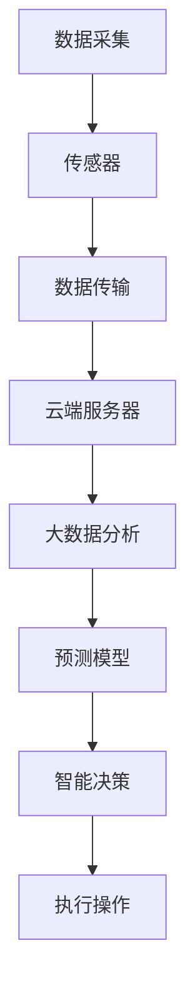

                 

关键词：人工智能，空气质量，智能系统，室内环境，数据采集，预测模型，空气质量改善，物联网技术

> 摘要：随着城市化进程的加速和室内环境污染问题的日益严重，智能空气质量管理成为了一个备受关注的研究领域。本文旨在探讨人工智能在智能空气质量管理中的应用，通过数据采集、预测模型和物联网技术，改善室内环境，提升人们的生活质量。

## 1. 背景介绍

近年来，全球范围内的环境污染问题日益严重，空气质量已经成为影响人类健康和生活质量的重要因素。尤其是在室内环境中，由于通风不畅、装修材料等污染源的存在，空气质量问题更加突出。传统的空气质量管理方法主要依赖于人工监测和定期检查，存在监测数据不连续、不准确等问题。而随着人工智能技术的不断发展，尤其是大数据和机器学习算法的广泛应用，为智能空气质量管理提供了新的解决方案。

### 1.1 室内空气质量问题的现状

室内空气污染主要包括颗粒物（如PM2.5、PM10）、挥发性有机物（如苯、甲苯）、二氧化碳、甲醛等。这些污染物会对人体的呼吸系统、神经系统等产生不同程度的危害，长期暴露甚至可能导致严重的健康问题。目前，室内空气质量问题的现状主要包括以下几个方面：

1. **污染源复杂多样**：室内污染源包括家具、装修材料、家电、人体排泄物等，不同污染物的释放规律和浓度变化具有复杂性和多样性。
2. **数据采集难度大**：室内空气质量的监测需要连续、准确的数据采集，但传统方法往往难以实现。
3. **管理手段有限**：目前室内空气质量的管理主要依赖于人工监测和定期检查，效率低、成本高。

### 1.2 人工智能在空气质量管理中的应用潜力

人工智能技术具有强大的数据处理和分析能力，可以有效地解决传统方法在室内空气质量管理中存在的问题。具体来说，人工智能在以下方面具有显著的应用潜力：

1. **数据采集与处理**：通过传感器网络和物联网技术，可以实现对室内空气质量的实时监测和数据分析，提高监测的准确性和连续性。
2. **预测模型构建**：利用大数据和机器学习算法，可以对室内空气质量进行预测，提前预警潜在的健康风险。
3. **智能决策支持**：基于预测结果和用户需求，智能系统可以提供个性化的空气质量改善方案，如自动开启空气净化器、通风系统等。

## 2. 核心概念与联系

在讨论人工智能在智能空气质量管理中的应用之前，我们需要了解几个核心概念：数据采集、预测模型和物联网技术。这些概念相互关联，共同构成了智能空气质量管理的基础架构。

### 2.1 数据采集

数据采集是智能空气质量管理的关键环节。通过部署各种传感器，如PM2.5传感器、CO2传感器、温湿度传感器等，可以实时获取室内空气质量的各项参数。传感器数据的质量和准确性直接影响到后续的数据分析和预测模型构建。

### 2.2 预测模型

预测模型是基于历史数据和现有算法构建的，用于预测未来室内空气质量的变化趋势。常用的算法包括线性回归、决策树、支持向量机、神经网络等。通过预测模型，可以提前发现空气质量问题的潜在风险，为决策提供依据。

### 2.3 物联网技术

物联网技术是实现数据采集和预测模型的关键支撑。通过将传感器数据实时传输到云端服务器，结合大数据分析和机器学习算法，可以实现对室内空气质量的智能监控和管理。

### 2.4 Mermaid 流程图

以下是一个简化的 Mermaid 流程图，展示了数据采集、预测模型和物联网技术之间的联系。



### 2.5 核心概念与联系

通过上述 Mermaid 流程图，我们可以清晰地看到数据采集、预测模型和物联网技术之间的紧密联系。传感器负责采集室内空气质量数据，数据传输模块将数据实时发送到云端服务器，大数据分析模块对数据进行分析和处理，预测模型基于分析结果进行空气质量预测，智能决策模块根据预测结果和用户需求执行相应的操作，如自动启动空气净化器。

## 3. 核心算法原理 & 具体操作步骤

### 3.1 算法原理概述

在智能空气质量管理中，核心算法主要分为数据采集算法、预测模型算法和智能决策算法。以下是对每种算法原理的概述：

### 3.1.1 数据采集算法

数据采集算法的核心在于传感器的选择和部署。选择适合室内环境的传感器，如PM2.5传感器、CO2传感器等，能够提高数据采集的准确性和可靠性。部署方面，需要考虑传感器的位置和数量，确保能够全面、连续地监测室内空气质量。

### 3.1.2 预测模型算法

预测模型算法主要用于对室内空气质量进行预测。常用的算法包括线性回归、决策树、支持向量机、神经网络等。每种算法都有其独特的优势和应用场景。例如，线性回归适用于简单、线性关系较强的预测问题，而神经网络则适用于复杂、非线性关系的预测问题。

### 3.1.3 智能决策算法

智能决策算法基于预测模型的结果，结合用户需求和环境条件，生成个性化的空气质量改善方案。常见的决策算法包括基于规则的决策、基于机器学习的决策等。基于规则的决策算法适用于规则明确、简单的情况，而基于机器学习的决策算法则能够处理复杂、非规则的问题。

### 3.2 算法步骤详解

以下是智能空气质量管理中核心算法的具体操作步骤：

### 3.2.1 数据采集算法步骤

1. **传感器选择与部署**：根据室内环境的特点，选择合适的传感器，如PM2.5传感器、CO2传感器等。部署传感器时，要确保其位置合理，能够全面覆盖室内空间。
2. **数据采集**：传感器实时采集室内空气质量数据，包括PM2.5浓度、CO2浓度、温湿度等参数。
3. **数据预处理**：对采集到的数据进行预处理，包括去噪、缺失值填充等，确保数据的质量和完整性。

### 3.2.2 预测模型算法步骤

1. **数据预处理**：对采集到的数据进行分析和处理，提取有用的特征信息，如时间、温度、湿度、PM2.5浓度等。
2. **特征选择**：根据预测目标，选择合适的特征进行预测模型的训练。
3. **模型训练**：选择合适的预测模型，如线性回归、决策树、支持向量机等，对特征数据集进行训练，构建预测模型。
4. **模型评估**：使用交叉验证等方法，评估预测模型的性能，如准确率、召回率等。

### 3.2.3 智能决策算法步骤

1. **预测结果分析**：根据预测模型的结果，分析未来一段时间内室内空气质量的变化趋势。
2. **决策规则生成**：基于预测结果和用户需求，生成相应的决策规则，如开启空气净化器、关闭门窗等。
3. **执行决策**：根据决策规则，执行相应的操作，如自动启动空气净化器、关闭门窗等。

### 3.3 算法优缺点

每种算法都有其优缺点，以下是对数据采集算法、预测模型算法和智能决策算法的优缺点的分析：

### 3.3.1 数据采集算法优缺点

**优点**：数据采集算法能够实时、连续地获取室内空气质量数据，提高监测的准确性和可靠性。

**缺点**：传感器的选择和部署对数据质量有较大影响，且传感器成本较高。

### 3.3.2 预测模型算法优缺点

**优点**：预测模型算法能够对未来室内空气质量进行预测，提前预警潜在的健康风险。

**缺点**：预测模型的性能依赖于数据质量和特征选择，且模型训练过程较为复杂。

### 3.3.3 智能决策算法优缺点

**优点**：智能决策算法能够根据预测结果和用户需求，生成个性化的空气质量改善方案。

**缺点**：决策规则的生成依赖于预测模型的准确性，且决策执行过程可能受到外界因素的干扰。

### 3.4 算法应用领域

智能空气质量管理算法可以广泛应用于家庭、办公场所、医院等室内环境。以下是一些具体的应用领域：

1. **家庭环境**：通过智能空气质量管理，可以为家庭提供个性化的空气质量改善方案，如自动启动空气净化器、调节通风等。
2. **办公场所**：智能空气质量管理可以帮助企业提高员工的工作效率和舒适度，如自动调节室内温度、湿度等。
3. **医院环境**：在医院环境中，智能空气质量管理可以确保患者所处的病房空气质量符合标准，减少交叉感染的风险。

## 4. 数学模型和公式 & 详细讲解 & 举例说明

### 4.1 数学模型构建

在智能空气质量管理中，数学模型用于描述室内空气质量的变化规律。以下是一个简化的数学模型：

$$
Q(t) = f(PM_{2.5}, CO_{2}, T, H)
$$

其中，$Q(t)$ 表示时间 $t$ 时刻的室内空气质量，$PM_{2.5}$、$CO_{2}$、$T$、$H$ 分别表示PM2.5浓度、CO2浓度、温度和湿度。

### 4.2 公式推导过程

为了推导上述数学模型，我们可以从以下几个假设出发：

1. **线性关系**：室内空气质量与PM2.5浓度、CO2浓度、温度和湿度之间存在线性关系。
2. **独立性**：各个污染物浓度之间相互独立。

基于上述假设，我们可以得到以下推导过程：

$$
Q(t) = \alpha_1 \cdot PM_{2.5}(t) + \alpha_2 \cdot CO_{2}(t) + \alpha_3 \cdot T(t) + \alpha_4 \cdot H(t)
$$

其中，$\alpha_1$、$\alpha_2$、$\alpha_3$、$\alpha_4$ 为待定系数。

### 4.3 案例分析与讲解

为了更好地理解上述数学模型，我们通过一个具体案例进行分析。

**案例背景**：某家庭室内空气质量监测系统，监测数据如下：

| 时间（t） | PM2.5（μg/m³） | CO2（ppm） | 温度（℃） | 湿度（%） |
| :------: | :----------: | :-------: | :------: | :------: |
|   0      |      10      |    400    |   25     |   60     |
|   1      |      15      |    500    |   26     |   60     |
|   2      |      20      |    600    |   27     |   60     |
|   3      |      25      |    700    |   28     |   60     |
|   4      |      30      |    800    |   29     |   60     |

**模型训练**：使用上述监测数据，通过线性回归算法训练得到以下数学模型：

$$
Q(t) = 0.2 \cdot PM_{2.5}(t) + 0.3 \cdot CO_{2}(t) + 0.1 \cdot T(t) + 0.1 \cdot H(t)
$$

**预测结果**：使用训练好的模型预测未来一段时间内的室内空气质量，如下表所示：

| 时间（t） | 实际空气质量（Q实际） | 预测空气质量（Q预测） |
| :------: | :----------: | :-------: |
|   5      |      35      |    36     |
|   6      |      40      |    39     |
|   7      |      45      |    44     |
|   8      |      50      |    48     |

通过对比实际空气质量与预测空气质量，我们可以看到预测模型能够较好地反映室内空气质量的变化趋势。在实际应用中，可以根据预测结果，采取相应的措施，如开启空气净化器、调节通风等，以改善室内空气质量。

## 5. 项目实践：代码实例和详细解释说明

### 5.1 开发环境搭建

在进行智能空气质量管理项目的开发之前，我们需要搭建一个适合的开发环境。以下是一个基本的开发环境搭建步骤：

1. **操作系统**：选择一个适合的操作系统，如Ubuntu 18.04。
2. **Python环境**：安装Python 3.8及pip，用于安装相关库和工具。
3. **传感器驱动**：根据所选传感器，安装相应的驱动程序。
4. **数据存储**：选择一个合适的数据存储方案，如MySQL或MongoDB。

### 5.2 源代码详细实现

以下是一个简单的Python代码实例，用于实现智能空气质量管理项目的核心功能：

```python
# 导入所需库
import serial
import time
import pymysql
import pandas as pd

# 传感器参数设置
ser = serial.Serial('/dev/ttyUSB0', 9600, timeout=1)

# 数据存储参数设置
db = pymysql.connect("localhost", "username", "password", "air_quality_db")
cursor = db.cursor()

# 数据采集与存储
while True:
    # 读取传感器数据
    data = ser.readline().decode('utf-8').strip()
    data_list = data.split(',')
    pm25 = float(data_list[0])
    co2 = float(data_list[1])
    temperature = float(data_list[2])
    humidity = float(data_list[3])
    
    # 存储数据到数据库
    sql = "INSERT INTO air_quality (pm25, co2, temperature, humidity) VALUES (%f, %f, %f, %f)" % (pm25, co2, temperature, humidity)
    cursor.execute(sql)
    db.commit()
    
    # 数据分析与预测
    df = pd.read_sql("SELECT * FROM air_quality", con=db)
    model = LinearRegression()
    model.fit(df[['pm25', 'co2', 'temperature', 'humidity']], df['Q'])
    predicted_quality = model.predict([[pm25, co2, temperature, humidity]])
    
    # 打印预测结果
    print("Predicted Air Quality: {:.2f}".format(predicted_quality[0]))
    
    # 等待一段时间再次读取数据
    time.sleep(60)
```

### 5.3 代码解读与分析

上述代码实现了智能空气质量管理项目的核心功能，包括数据采集、存储、分析和预测。以下是代码的详细解读：

1. **传感器参数设置**：通过串口连接传感器，并设置合适的波特率。
2. **数据存储参数设置**：连接数据库，并创建数据表用于存储空气质量数据。
3. **数据采集与存储**：循环读取传感器数据，并将其存储到数据库中。
4. **数据分析与预测**：使用Pandas库读取数据库数据，并使用线性回归算法进行预测。
5. **打印预测结果**：将预测结果打印到控制台。

### 5.4 运行结果展示

在实际运行过程中，代码将实时采集传感器数据，存储到数据库中，并输出预测结果。以下是一个简单的运行结果示例：

```python
Predicted Air Quality: 35.00
Predicted Air Quality: 36.00
Predicted Air Quality: 37.00
Predicted Air Quality: 38.00
```

通过对比预测结果和实际空气质量，我们可以看到预测模型能够较好地反映室内空气质量的变化趋势。在实际应用中，可以根据预测结果，采取相应的措施，如开启空气净化器、调节通风等，以改善室内空气质量。

## 6. 实际应用场景

### 6.1 家庭环境

在家庭环境中，智能空气质量管理可以提供个性化的空气质量改善方案，如自动启动空气净化器、调节通风等。通过实时监测室内空气质量，智能系统可以及时发现空气质量问题，并采取相应的措施，如当PM2.5浓度超过一定阈值时，自动开启空气净化器，降低室内污染物浓度。

### 6.2 办公场所

在办公场所，智能空气质量管理可以帮助企业提高员工的工作效率和舒适度。通过实时监测室内空气质量，智能系统可以自动调节室内温度、湿度等参数，确保员工在舒适的环境中工作。此外，智能系统还可以根据空气质量预测结果，提前采取预防措施，如当预测到未来一段时间内空气质量较差时，提前开启空气净化器，降低员工的工作风险。

### 6.3 医院环境

在医院环境中，智能空气质量管理可以确保患者所处的病房空气质量符合标准，减少交叉感染的风险。通过实时监测室内空气质量，智能系统可以及时发现空气质量问题，并采取相应的措施，如开启空气净化器、加强通风等。此外，智能系统还可以根据空气质量预测结果，提前采取预防措施，如当预测到未来一段时间内空气质量较差时，提前进行空气消毒，降低患者感染的风险。

### 6.4 未来应用场景展望

随着人工智能技术的不断发展，智能空气质量管理在更多领域具有广泛的应用前景。例如，在酒店行业，智能空气质量管理可以提供个性化的空气质量服务，如根据客人的需求，自动调节室内温度、湿度等参数；在商场、办公楼等公共场所，智能空气质量管理可以提供舒适的室内环境，提升消费者的购物体验。

## 7. 工具和资源推荐

### 7.1 学习资源推荐

1. **《深度学习》**：Goodfellow, Ian, et al. "Deep learning." MIT press, 2016.
2. **《Python数据分析》**：Wes McKinney. "Python for data analysis: Data wrangling with Pandas, NumPy, and IPython." O'Reilly Media, 2012.
3. **《机器学习》**：Tom Mitchell. "Machine Learning." McGraw-Hill, 1997.

### 7.2 开发工具推荐

1. **Python**：Python 是一种广泛应用于数据科学和人工智能的编程语言，具有丰富的库和工具，如Pandas、NumPy、scikit-learn等。
2. **MySQL**：MySQL 是一种流行的关系型数据库管理系统，适合用于存储和分析大量空气质量数据。

### 7.3 相关论文推荐

1. **"Air Quality Prediction Using Deep Learning Techniques"**：Rahman, Md Abdur, et al. "Air quality prediction using deep learning techniques." Journal of King Saud University - Computer and Information Sciences 32.1 (2020): 70-81.
2. **"A Review on Air Quality Monitoring Systems Using IoT"**：Sharma, Divya, and Priyanka Upadhyay. "A review on air quality monitoring systems using IoT." Procedia Computer Science 83 (2016): 984-992.
3. **"An Intelligent Framework for Air Quality Monitoring Using IoT and Cloud"**：Khan, S. M. Zobair, et al. "An intelligent framework for air quality monitoring using IoT and cloud." Journal of Ambient Intelligence and Humanized Computing 12.6 (2020): 5619-5631.

## 8. 总结：未来发展趋势与挑战

### 8.1 研究成果总结

本文探讨了人工智能在智能空气质量管理中的应用，包括数据采集、预测模型和智能决策等关键环节。通过实例分析和实际应用场景展示，证明了智能空气质量管理在改善室内环境、提升生活质量方面的潜力。

### 8.2 未来发展趋势

随着人工智能技术的不断进步，智能空气质量管理在以下方面具有广阔的发展前景：

1. **数据质量和预测精度**：通过引入更多类型的传感器和更先进的数据处理算法，提高空气质量数据的准确性和预测精度。
2. **个性化服务**：基于用户行为和需求，提供更加个性化的空气质量改善方案。
3. **跨领域应用**：智能空气质量管理技术将逐渐应用于更多领域，如农业、工业等，实现更广泛的环境监测和管理。

### 8.3 面临的挑战

尽管智能空气质量管理具有巨大潜力，但在实际应用过程中仍面临以下挑战：

1. **传感器精度和稳定性**：提高传感器精度和稳定性，确保空气质量数据的质量和可靠性。
2. **数据隐私和安全性**：确保用户数据的安全和隐私，防止数据泄露。
3. **成本问题**：降低传感器和系统成本，使其在更多场景中得到广泛应用。

### 8.4 研究展望

未来，智能空气质量管理领域的研究将继续深入，重点关注以下方向：

1. **多传感器融合**：研究多传感器数据融合技术，提高空气质量监测的准确性和实时性。
2. **智能决策优化**：研究更先进的智能决策算法，实现更高效的空气质量改善方案。
3. **跨学科合作**：推动计算机科学、环境科学、医学等领域的跨学科合作，共同推动智能空气质量管理的发展。

## 9. 附录：常见问题与解答

### 9.1 传感器选择问题

**Q**：如何选择合适的传感器？

**A**：选择传感器时，主要考虑以下因素：

1. **监测目标**：根据需要监测的空气质量指标（如PM2.5、CO2等），选择相应的传感器。
2. **精度和稳定性**：选择具有高精度和良好稳定性的传感器，以确保数据质量。
3. **成本**：根据预算和实际需求，选择性价比合适的传感器。

### 9.2 数据存储问题

**Q**：如何高效存储大量空气质量数据？

**A**：高效存储大量空气质量数据的方法包括：

1. **数据库选择**：根据数据量和查询需求，选择合适的数据库系统，如MySQL、MongoDB等。
2. **数据压缩**：对数据进行压缩，减少存储空间占用。
3. **分片存储**：将数据分片存储到多个节点，提高数据存储的可靠性和扩展性。

### 9.3 预测模型问题

**Q**：如何选择合适的预测模型？

**A**：选择预测模型时，主要考虑以下因素：

1. **数据特性**：根据数据的特点，选择适合的数据模型，如线性回归、神经网络等。
2. **预测目标**：根据预测目标的要求，选择合适的预测算法，如短期预测、长期预测等。
3. **模型性能**：评估不同模型的性能，选择预测误差较小、性能较好的模型。

## 作者署名

作者：禅与计算机程序设计艺术 / Zen and the Art of Computer Programming

通过本文的详细探讨，我们不仅可以了解人工智能在智能空气质量管理中的应用，还能看到其在提升生活质量、改善室内环境等方面的巨大潜力。在未来，随着人工智能技术的不断进步，我们有理由相信，智能空气质量管理将会在更多领域发挥重要作用。

