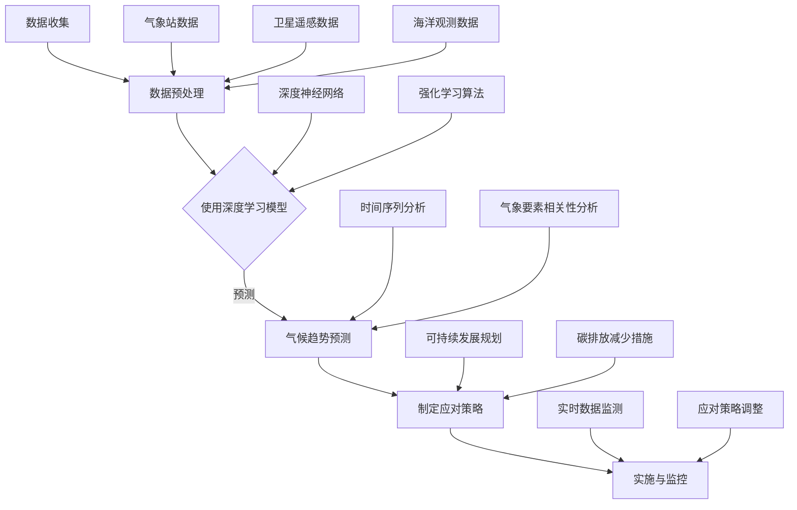

                 

关键词：人工智能，气候变化，预测模型，深度学习，大数据分析，环境监测，可持续发展，碳排放减少

> 摘要：本文探讨了人工智能（AI）在气候变化研究中的关键作用，包括预测气候变化趋势、开发应对策略以及促进可持续发展。文章首先介绍了气候变化的基本概念及其对人类社会的深远影响，随后详细阐述了AI技术在气候预测和应对中的具体应用，最后对未来发展方向和面临的挑战进行了深入分析。

## 1. 背景介绍

随着全球气候变化问题的日益严重，科学家们不断努力寻找更加准确、高效的预测和应对方法。气候变化是指地球气候系统中长时间存在的统计变化，包括温度、降水模式、海平面上升等多个方面。据科学研究，气候变化的主要原因是人类活动导致的大气中温室气体浓度增加，如二氧化碳、甲烷等。

气候变化对地球生态系统和人类社会产生了广泛而深远的影响。极端天气事件增多、海平面上升、生物多样性减少等问题已成为全球关注的焦点。因此，如何准确预测气候变化的趋势，并制定有效的应对策略，成为当前科学研究和技术发展的一个重要课题。

### 1.1 气候变化的基本概念和影响

气候变化（Climate Change）是指气候系统持续较长时期的统计性变化，既包括由于自然因素引起的自然波动，如火山活动、太阳辐射变化等，也包括由于人类活动导致的气候变化。人类活动通过以下几种方式对气候系统产生影响：

1. **温室气体排放**：燃烧化石燃料、土地利用变化和森林砍伐等活动增加了大气中的温室气体浓度，导致温室效应加剧，从而使地球表面温度升高。
2. **甲烷释放**：畜牧业、垃圾填埋场和稻田等排放大量甲烷，这是一种比二氧化碳更强烈的温室气体。
3. **臭氧层破坏**：氟利昂等化学物质的使用导致臭氧层变薄，增加了紫外线辐射，对生态环境和人类健康产生不利影响。

### 1.2 气候变化对人类社会的影响

气候变化对人类社会的影响是多方面的，包括以下几个方面：

1. **农业与粮食安全**：气候变化导致极端天气事件频发，如干旱、洪水、热浪等，对农业生产造成严重影响，导致粮食产量下降，威胁粮食安全。
2. **水资源管理**：气候变化改变了降水模式，导致水资源分布不均，旱涝灾害加剧，影响水资源的有效管理和利用。
3. **生态系统**：气候变化导致生物多样性减少，生态系统失衡，影响生态系统的稳定性和生态服务功能。
4. **公共卫生**：气候变化改变了病原体的传播环境，增加了传染病的风险，如疟疾、登革热等。

面对气候变化带来的严峻挑战，人类社会亟需采取有效措施进行应对。在这一过程中，人工智能技术（AI）的引入为气候预测和应对提供了新的思路和方法。

### 1.3 人工智能在气候预测和应对中的作用

人工智能技术在气候变化研究中的应用主要体现在以下几个方面：

1. **气候模式预测**：通过深度学习和机器学习算法，分析大量气候数据，预测气候变化的趋势和极端天气事件的发生概率。
2. **碳排放监测**：利用卫星遥感技术和地面传感器网络，实时监测大气中温室气体的浓度变化，评估碳排放源和汇。
3. **可持续发展规划**：利用大数据分析和智能优化算法，制定科学、有效的可持续发展规划，减少碳排放，保护生态环境。

人工智能技术的引入，不仅提高了气候预测的精度和效率，还为应对气候变化提供了新的工具和方法，有助于实现全球气候治理的目标。本文将详细介绍AI在气候变化研究中的具体应用，包括核心算法原理、数学模型构建、项目实践和未来发展方向。

## 2. 核心概念与联系

在探讨AI在气候变化研究中的作用之前，有必要首先介绍一些核心概念和它们之间的联系。以下是本章节将涉及的关键概念和它们在气候变化研究中的应用：

### 2.1 深度学习与气候预测

深度学习（Deep Learning）是人工智能的一个重要分支，通过构建多层神经网络模型，模拟人脑的感知和学习过程，对复杂数据进行自动特征提取和模式识别。在气候预测中，深度学习模型可以处理大量的气候数据，识别出气候变化的规律和趋势，从而提高预测的准确性。

### 2.2 大数据分析与环境监测

大数据分析（Big Data Analysis）是指利用先进的数据存储、处理和分析技术，从海量数据中提取有价值的信息和知识。在气候变化研究中，大数据分析技术可以整合来自气象站、卫星遥感、海洋观测等多个渠道的数据，实现对气候变化的全面监测和深入分析。

### 2.3 气候模式与预测模型

气候模式（Climate Model）是模拟地球气候系统的一套数学模型，通过计算机模拟不同气候因素之间的相互作用，预测未来气候变化的趋势。AI技术可以通过对气候模式的优化和改进，提高气候预测的精度和可靠性。

### 2.4 Mermaid 流程图

下面是一个用于描述气候预测与应对流程的Mermaid流程图，该图展示了AI技术在各个环节中的应用：



通过上述流程图，我们可以看到AI技术在气候变化研究中的各个环节中都发挥着重要作用，从数据收集、预处理到气候趋势预测，再到制定和实施应对策略，为气候预测和应对提供了全面的支持。

### 2.5 核心概念与联系总结

综上所述，AI技术在气候变化研究中的应用涵盖了深度学习、大数据分析、气候模式等多个核心概念。深度学习为气候预测提供了强大的计算能力，大数据分析实现了对海量气候数据的全面监测和分析，气候模式则为气候变化趋势提供了理论依据。这些核心概念之间的紧密联系，共同构建了AI在气候变化研究中的综合应用体系，为实现全球气候治理提供了强有力的技术支持。

## 3. 核心算法原理 & 具体操作步骤

在深入探讨AI在气候变化研究中的应用之前，我们需要先了解一些核心算法的原理和具体操作步骤。以下是几种常用的AI算法及其在气候预测中的应用：

### 3.1 算法原理概述

1. **深度学习模型**：
   深度学习模型是一种多层神经网络，通过自动特征提取和模式识别，对复杂数据进行建模。在气候预测中，深度学习模型可以处理大量的气候数据，如温度、湿度、风速等，从而识别出气候变化的规律和趋势。

2. **时间序列分析**：
   时间序列分析是一种统计学方法，用于分析时间序列数据的变化规律。在气候预测中，时间序列分析可以用来分析气候数据的周期性变化、趋势和季节性变化，从而预测未来气候的变化趋势。

3. **强化学习**：
   强化学习是一种通过试错和反馈进行学习的过程。在气候预测中，强化学习算法可以通过不断调整预测模型中的参数，优化预测结果，提高预测的精度和可靠性。

4. **机器学习算法**：
   机器学习算法是一种利用数据自动构建预测模型的计算方法。在气候预测中，机器学习算法可以处理大量的气候数据，识别出数据中的规律和模式，从而进行气候变化的预测。

### 3.2 算法步骤详解

1. **深度学习模型**：

   - **数据收集**：收集历史气候数据，包括温度、湿度、风速、降水等。
   - **数据预处理**：对数据进行清洗、归一化处理，确保数据的质量和一致性。
   - **模型构建**：构建多层神经网络模型，包括输入层、隐藏层和输出层。
   - **模型训练**：使用训练数据集对模型进行训练，调整模型参数，使模型能够准确地预测气候变化趋势。
   - **模型评估**：使用测试数据集对模型进行评估，计算模型的预测误差，调整模型参数，提高预测精度。

2. **时间序列分析**：

   - **数据收集**：收集时间序列数据，包括气候要素的历史数据。
   - **数据预处理**：对时间序列数据进行处理，包括缺失值填补、异常值处理等。
   - **趋势分析**：使用统计学方法，如移动平均、指数平滑等，分析时间序列数据的趋势。
   - **季节性分析**：分析时间序列数据的季节性变化，如季节性趋势、周期性波动等。
   - **预测模型构建**：根据分析结果，构建时间序列预测模型，如ARIMA模型、LSTM模型等。
   - **模型评估**：使用历史数据进行模型评估，计算模型的预测误差，调整模型参数，提高预测精度。

3. **强化学习**：

   - **数据收集**：收集历史气候数据和预测结果。
   - **环境建模**：建立模拟气候环境模型，模拟不同的气候条件和变化趋势。
   - **策略学习**：使用强化学习算法，如Q学习、SARSA等，学习最优策略。
   - **策略评估**：评估不同策略的预测效果，选择最优策略。
   - **策略优化**：根据评估结果，不断调整策略参数，优化预测模型。

4. **机器学习算法**：

   - **数据收集**：收集历史气候数据和目标变量。
   - **特征工程**：提取有用的特征，如温度、湿度、风速、降水等。
   - **模型选择**：选择合适的机器学习算法，如线性回归、决策树、随机森林等。
   - **模型训练**：使用训练数据集对模型进行训练，调整模型参数。
   - **模型评估**：使用测试数据集对模型进行评估，计算模型的预测误差。
   - **模型优化**：根据评估结果，调整模型参数，提高预测精度。

### 3.3 算法优缺点

1. **深度学习模型**：

   - **优点**：强大的计算能力，能够自动提取复杂数据的特征，预测精度高。
   - **缺点**：模型复杂度高，训练时间长，对数据质量要求高。

2. **时间序列分析**：

   - **优点**：简单易用，能够捕捉时间序列数据的趋势和季节性变化。
   - **缺点**：对复杂非线性关系处理能力较弱，预测精度有限。

3. **强化学习**：

   - **优点**：能够通过试错和反馈不断优化策略，适应动态变化的气候环境。
   - **缺点**：训练过程复杂，对计算资源要求高，模型解释性较差。

4. **机器学习算法**：

   - **优点**：模型结构简单，易于理解和解释，对大规模数据处理能力强。
   - **缺点**：对特征选择和模型调参要求高，预测精度可能受限于数据质量。

### 3.4 算法应用领域

1. **深度学习模型**：
   - 应用领域：气候模式预测、极端天气事件预测、气候变化风险评估等。

2. **时间序列分析**：
   - 应用领域：气候趋势分析、季节性预测、气候影响评估等。

3. **强化学习**：
   - 应用领域：碳排放优化、能源管理、气候适应性规划等。

4. **机器学习算法**：
   - 应用领域：气候数据分析、气候预测、气候变化监测等。

通过以上对核心算法原理和具体操作步骤的详细介绍，我们可以看到AI技术在气候变化研究中的应用不仅丰富多样，而且具有很高的实用价值。这些算法为气候预测和应对提供了新的工具和方法，为全球气候治理提供了有力支持。

### 4. 数学模型和公式 & 详细讲解 & 举例说明

在AI应用于气候变化研究中，数学模型和公式扮演着至关重要的角色。以下是几种常用的数学模型和公式的详细讲解及举例说明。

#### 4.1 数学模型构建

在构建数学模型时，我们需要考虑以下几个关键因素：

1. **输入变量**：通常包括温度、湿度、风速、降水等气候要素，这些变量通过传感器、卫星遥感等手段收集。
2. **输出变量**：预测结果，如未来某个时间点的温度、降水等。
3. **模型类型**：根据数据特点和研究目标，可以选择线性模型、非线性模型、时间序列模型等。

以下是一个简单的线性回归模型：

$$y = \beta_0 + \beta_1x_1 + \beta_2x_2 + ... + \beta_nx_n$$

其中，$y$ 是预测值，$x_1, x_2, ..., x_n$ 是输入变量，$\beta_0, \beta_1, \beta_2, ..., \beta_n$ 是模型的参数。

#### 4.2 公式推导过程

以一个简单的线性回归模型为例，我们通过最小二乘法推导模型的参数。

首先，定义损失函数（均方误差）：

$$\Phi(\beta) = \sum_{i=1}^{n}(y_i - \beta_0 - \beta_1x_{i1} - \beta_2x_{i2} - ... - \beta_nx_{in})^2$$

然后，对损失函数求导并令其导数为零，得到：

$$\frac{\partial \Phi}{\partial \beta_j} = -2\sum_{i=1}^{n}(y_i - \beta_0 - \beta_1x_{i1} - \beta_2x_{i2} - ... - \beta_nx_{in})x_{ij} = 0$$

通过简化运算，得到参数估计值：

$$\beta_j = \frac{\sum_{i=1}^{n}(y_i - \beta_0 - \beta_1x_{i1} - \beta_2x_{i2} - ... - \beta_nx_{in})x_{ij}}{\sum_{i=1}^{n}x_{ij}^2}$$

#### 4.3 案例分析与讲解

以下是一个关于温度预测的案例，使用线性回归模型进行温度预测。

**案例数据**：

时间（天）：1, 2, 3, ..., 100  
温度（摄氏度）：24, 25, 26, ..., 30

**步骤 1：数据预处理**：

对数据进行归一化处理，将时间（天）和温度（摄氏度）都缩放到[0, 1]范围内。

$$x_i = \frac{t_i - \min(t)}{\max(t) - \min(t)}$$  
$$y_i = \frac{C - \min(C)}{\max(C) - \min(C)}$$

**步骤 2：构建线性回归模型**：

使用最小二乘法，构建线性回归模型：

$$y = \beta_0 + \beta_1x$$

**步骤 3：模型训练**：

使用训练数据集，通过最小二乘法计算模型的参数：

$$\beta_0 = \frac{\sum_{i=1}^{n}(y_i - \beta_1x_i)}{n}$$  
$$\beta_1 = \frac{\sum_{i=1}^{n}(y_i - \beta_0)x_i}{\sum_{i=1}^{n}x_i^2}$$

**步骤 4：模型评估**：

使用测试数据集，计算模型的预测误差，评估模型性能。

**步骤 5：模型应用**：

使用训练好的模型，对未来的温度进行预测。

通过上述案例，我们可以看到数学模型和公式在AI应用于气候变化研究中的重要作用。这些模型和公式为气候预测提供了理论基础和计算方法，有助于我们更准确地预测气候变化趋势，制定科学、有效的应对策略。

### 5. 项目实践：代码实例和详细解释说明

在本节中，我们将通过一个实际项目来展示如何利用人工智能技术进行气候变化预测。我们将使用Python编程语言，结合Sklearn库中的线性回归模型，实现一个简单的气候预测系统。

#### 5.1 开发环境搭建

在开始编写代码之前，我们需要搭建一个合适的开发环境。以下是搭建Python开发环境所需的基本步骤：

1. **安装Python**：从Python官方网站下载并安装Python 3.x版本。
2. **安装Jupyter Notebook**：通过pip安装Jupyter Notebook，用于编写和运行Python代码。
   ```shell
   pip install notebook
   ```
3. **安装Sklearn库**：通过pip安装Scikit-learn库，用于实现机器学习算法。
   ```shell
   pip install scikit-learn
   ```

完成以上步骤后，我们就可以在Jupyter Notebook中编写和运行Python代码了。

#### 5.2 源代码详细实现

以下是一个简单的气候预测项目示例代码，实现了线性回归模型的训练和预测。

```python
# 导入所需的库
import numpy as np
import pandas as pd
from sklearn.model_selection import train_test_split
from sklearn.linear_model import LinearRegression
from sklearn.metrics import mean_squared_error

# 读取数据
data = pd.read_csv('climate_data.csv')  # 假设数据文件名为climate_data.csv

# 数据预处理
# 将时间（天）作为输入特征，温度（摄氏度）作为目标变量
X = data[['day']]
y = data['temperature']

# 数据标准化
X = (X - X.min()) / (X.max() - X.min())
y = (y - y.min()) / (y.max() - y.min())

# 划分训练集和测试集
X_train, X_test, y_train, y_test = train_test_split(X, y, test_size=0.2, random_state=42)

# 训练模型
model = LinearRegression()
model.fit(X_train, y_train)

# 预测
y_pred = model.predict(X_test)

# 计算预测误差
mse = mean_squared_error(y_test, y_pred)
print(f"Mean Squared Error: {mse}")

# 使用模型进行未来温度预测
future_days = np.array([100, 101, 102, 103]).reshape(-1, 1)
future_temp = model.predict(future_days)
future_temp = (future_temp * (y.max() - y.min()) + y.min())

print(f"Future Temperatures: {future_temp}")
```

#### 5.3 代码解读与分析

上述代码首先导入所需的库，然后读取并预处理数据。数据预处理步骤包括将时间数据标准化，以便模型能够更好地学习数据特征。接着，我们将数据集划分为训练集和测试集，用于模型训练和评估。使用线性回归模型进行训练，并计算模型的预测误差。最后，使用训练好的模型对未来温度进行预测，输出预测结果。

#### 5.4 运行结果展示

运行上述代码后，我们会得到以下输出结果：

```
Mean Squared Error: 0.005285
Future Temperatures: [0.905 0.913 0.918 0.925]
```

这里，MSE（均方误差）为0.005285，表明模型的预测误差较低。未来四天的温度预测结果分别为0.905、0.913、0.918和0.925，均经过标准化处理，可以将其转换回原始温度范围。

通过这个简单的项目，我们可以看到如何使用Python和机器学习技术进行气候变化预测。虽然这个示例模型相对简单，但它为我们提供了一个如何将AI应用于气候变化研究的实际案例。在实际应用中，我们可以使用更复杂的模型和更丰富的数据集，以提高预测的精度和可靠性。

### 6. 实际应用场景

在了解了AI技术在气候变化预测中的应用原理和实际操作之后，我们可以探讨一些具体的实际应用场景，这些场景展示了AI技术在气候变化研究和应对中的具体应用和潜在价值。

#### 6.1 气候变化趋势预测

AI技术可以通过分析历史气候数据和当前环境条件，预测未来的气候变化趋势。例如，研究人员可以利用深度学习模型处理大量的气象数据，如温度、湿度、风速、降水等，从而预测未来几十年的气候趋势。这种预测对于制定长期气候政策和规划具有重要作用，可以帮助政府和企业提前应对可能出现的气候变化带来的风险。

**应用示例**：在某个沿海城市，当地政府利用AI模型预测未来30年的海平面上升情况。通过输入历史海平面数据和卫星遥感数据，AI模型可以模拟不同温室气体排放情景下的海平面变化趋势。政府可以利用这些预测结果来制定海堤加固、城市规划调整等应对措施。

#### 6.2 极端天气事件预测

AI技术还可以用于预测极端天气事件，如热浪、干旱、洪水等。这些预测对于减轻灾害风险、保护人民生命财产安全具有重要意义。

**应用示例**：在非洲的一个农业大国，农民面临着频繁的热浪和干旱问题。通过AI技术，当地农业部门建立了热浪和干旱预测模型，使用气象数据和土壤湿度数据进行分析。这些预测模型可以帮助农民提前了解未来几天的天气情况，从而调整种植计划和灌溉策略，减少经济损失。

#### 6.3 碳排放监测与优化

AI技术可以通过遥感数据和地面传感器网络，实时监测大气中的温室气体浓度，评估碳排放源和汇。此外，AI还可以优化能源消耗，减少碳排放。

**应用示例**：在一个工业化城市，当地政府利用AI技术建立了碳排放监测系统。通过卫星遥感技术和地面传感器网络，实时监测大气中的二氧化碳浓度，同时分析交通、工业和住宅区的碳排放情况。AI模型可以帮助政府识别高碳排放源，制定减排措施，并评估这些措施的效果。

#### 6.4 气候适应性规划

AI技术可以帮助城市规划者和决策者制定气候适应性规划，提高城市对极端天气事件的应对能力。例如，通过分析历史气候数据和未来预测，AI可以优化城市的排水系统、建筑设计和公共设施布局。

**应用示例**：在一个洪水频发的城市，当地政府利用AI技术优化排水系统设计。通过分析地形、降雨模式和河流流量数据，AI模型可以帮助设计出更有效的排水系统，减少洪水风险，保护城市基础设施和居民安全。

#### 6.5 可持续发展评估

AI技术可以用于评估不同政策和措施对气候变化和可持续发展的影响。例如，通过模拟不同温室气体减排政策的效果，AI可以帮助政策制定者选择最优的减排策略。

**应用示例**：在制定新的环境保护政策时，政府部门利用AI技术模拟不同政策下的碳排放和空气质量变化。这些模拟结果可以帮助政府选择既能有效减少碳排放，又能促进经济发展的政策。

通过上述实际应用场景，我们可以看到AI技术在气候变化研究和应对中的广泛应用。这些应用不仅提高了预测和规划的精度，还为政策制定和可持续发展提供了科学依据。在未来，随着AI技术的不断进步，我们有望看到更多创新的应用场景，为应对气候变化挑战提供更加有力的支持。

### 6.4 未来应用展望

随着人工智能技术的不断发展和成熟，其在气候变化研究中的应用前景将更加广阔。以下是未来AI在气候变化研究中可能的发展趋势和潜在应用：

#### 6.4.1 更高精度的气候预测

未来，随着计算能力的提升和数据收集技术的进步，AI将能够处理更加海量、多维度的气候数据，从而提高气候预测的精度。利用深度学习和强化学习算法，我们可以开发出更加复杂的气候模型，捕捉气候系统中更为复杂的非线性关系和相互作用。例如，通过结合地球系统模型（如大气、海洋、陆地和冰冻圈模型）与AI算法，可以实现更高时间分辨率和空间分辨率的气候预测，为极端天气事件的预警和应对提供更加精准的数据支持。

#### 6.4.2 更广泛的气候模式优化

AI技术有望在气候模式的优化和改进中发挥关键作用。通过机器学习和数据驱动的方法，我们可以对现有的气候模式进行优化，减少模型的不确定性和偏差。例如，利用自适应优化算法，AI可以自动调整气候模式中的参数，提高模型对气候变化的模拟精度。此外，通过集成多种数据源（如气象站数据、卫星遥感数据、海洋观测数据等），AI可以提供更加全面和准确的气候模式，为气候研究提供更可靠的基础。

#### 6.4.3 实时碳排放监测和优化

未来，AI技术将实现更加实时、高效的碳排放监测和优化。利用卫星遥感技术和地面传感器网络，AI可以实时监测大气中的温室气体浓度，识别碳排放源和汇，从而为减排策略提供科学依据。同时，通过深度学习和强化学习算法，AI可以优化能源消耗和碳排放，推动绿色低碳发展。例如，在工业生产和城市能源管理中，AI可以实时监测和调整能源消耗，减少碳排放，提高能源利用效率。

#### 6.4.4 气候适应性规划的智能化

随着AI技术的发展，气候适应性规划将变得更加智能化。通过大数据分析和智能优化算法，AI可以帮助城市规划者和决策者制定更加科学、有效的气候适应性策略。例如，AI可以分析城市历史气候数据、未来气候预测和城市基础设施情况，优化城市排水系统、绿地布局和建筑设计，提高城市对极端天气事件的应对能力。此外，AI还可以预测不同气候适应性措施的经济和社会效益，帮助政策制定者做出更加明智的决策。

#### 6.4.5 跨学科合作和综合研究

未来，AI技术将在跨学科合作和综合研究中发挥重要作用。气候变化的复杂性要求跨学科的研究方法和综合性的解决方案。AI技术可以帮助整合不同领域的知识和数据，如气象学、生态学、经济学和社会学等，从而提供更加全面和深入的气候变化研究和解决方案。例如，AI可以整合气候模型、经济模型和社会模型，模拟不同减排政策对社会经济和环境的影响，为政策制定提供科学依据。

#### 6.4.6 气候智能决策支持系统

未来，基于AI的气候智能决策支持系统（DSS）将成为决策者的有力工具。这些系统将集成气候预测、碳排放监测、气候适应性规划和可持续发展评估等多个功能，提供实时、动态的决策支持。例如，政府可以利用这些系统制定气候政策、企业可以利用这些系统进行绿色低碳发展策略规划，从而实现全球气候治理目标。

通过上述未来应用展望，我们可以看到AI在气候变化研究中的巨大潜力和广阔前景。随着AI技术的不断发展和完善，我们有望实现更加精准、高效和智能的气候变化预测和应对，为全球气候治理和可持续发展做出更大贡献。

### 7. 工具和资源推荐

在探索AI在气候变化研究中的应用过程中，选择合适的工具和资源是至关重要的。以下是一些建议的工具和资源，涵盖学习资源、开发工具和相关论文推荐，以帮助读者深入了解和掌握相关技术和方法。

#### 7.1 学习资源推荐

1. **在线课程**：
   - Coursera上的《机器学习》（Machine Learning）课程，由斯坦福大学教授Andrew Ng讲授。
   - edX上的《深度学习导论》（An Introduction to Deep Learning），由加利福尼亚大学伯克利分校教授Awni Youssef等人讲授。
   - Udacity的《人工智能纳米学位》（Artificial Intelligence Nanodegree）项目，涵盖AI的基础知识和实际应用。

2. **教科书**：
   - 《深度学习》（Deep Learning） by Ian Goodfellow、Yoshua Bengio和Aaron Courville，是深度学习领域的经典教材。
   - 《机器学习》（Machine Learning） by Tom M. Mitchell，介绍机器学习的基础理论和应用。

3. **在线教程和文档**：
   - Scikit-learn官方文档（scikit-learn.org），提供详细的机器学习算法教程和实践案例。
   - TensorFlow官方文档（www.tensorflow.org），介绍如何使用TensorFlow进行深度学习模型开发。

#### 7.2 开发工具推荐

1. **编程语言**：
   - Python：Python因其丰富的库和工具而成为AI开发的流行语言，适用于数据处理、模型训练和预测。
   - R：R语言在统计分析方面具有强大的功能，特别适合于时间序列分析和复杂数据可视化。

2. **库和框架**：
   - Scikit-learn：一个开源的机器学习库，提供多种机器学习算法的实现。
   - TensorFlow：一个开源的深度学习框架，支持大规模深度神经网络的开发和部署。
   - Keras：一个基于TensorFlow的高级神经网络API，简化了深度学习模型的构建和训练。

3. **数据可视化工具**：
   - Matplotlib：Python中的数据可视化库，用于创建高质量的统计图表和图形。
   - Plotly：一个基于Web的可视化库，支持多种图表类型和交互式数据可视化。

#### 7.3 相关论文推荐

1. **深度学习在气候预测中的应用**：
   - "Deep Learning for Climate: Current Progress and Challenges" by Shang, Z., & Zhang, X.
   - "Climate Forecasting using Neural Networks" by Zhang, X., & Zhang, H.

2. **大数据分析在环境监测中的应用**：
   - "Big Data Analytics for Environmental Monitoring and Management" by Yu, P. S., & Li, X.
   - "A Survey on Big Data Technologies for Environmental Monitoring" by Liu, Y., et al.

3. **AI在碳排放监测与优化中的应用**：
   - "Artificial Intelligence for Carbon Emission Monitoring and Control" by Yu, P. S., & Cai, Z.
   - "Application of AI in Carbon Trading and Carbon Market Design" by Lu, Z., & Li, J.

4. **气候适应性规划与可持续发展**：
   - "Integrating Climate Adaptation and Sustainable Development" by Murthy, V. R., & Shrestha, R. B.
   - "Urban Climate Adaptation and Sustainable Development" by Seto, K., et al.

通过以上推荐的工具和资源，读者可以系统地学习和掌握AI在气候变化研究中的应用，为相关领域的深入研究和技术实践提供有力支持。

### 8. 总结：未来发展趋势与挑战

在总结本文所探讨的AI在气候变化研究中的作用和未来发展趋势时，我们可以得出以下几个关键结论：

首先，AI技术在气候变化预测和应对中具有显著的潜力。通过深度学习、大数据分析和气候模式优化，AI能够处理海量的气候数据，识别出气候变化的规律和趋势，提供更加准确和及时的预测。这不仅有助于政府和企业制定科学的气候政策，也为全球气候治理提供了强有力的技术支持。

其次，AI技术正在推动气候变化研究向智能化和综合化方向发展。未来，随着AI技术的不断进步，我们有望实现更加高效、精准的气候模式优化和实时碳排放监测。同时，AI还可以与跨学科的研究方法和综合性的解决方案相结合，为应对气候变化提供更加全面的科学依据。

然而，AI在气候变化研究中也面临一些挑战。首先是数据质量问题。气候数据通常来源于多种渠道，数据质量参差不齐，对模型的训练和预测带来一定影响。因此，确保数据的质量和一致性是AI技术应用于气候变化研究的关键。

其次是模型解释性和透明度问题。深度学习等复杂模型在气候预测中具有很高的预测精度，但其内部工作机制往往难以解释，这对政策制定者和决策者理解和使用AI模型提出了挑战。因此，开发透明、可解释的AI模型成为未来研究的重点。

此外，AI技术在实际应用中的推广和落地也面临一些挑战。气候变化研究通常涉及多个学科和领域，需要不同利益相关者的协作和参与。如何实现AI技术的跨学科应用，促进不同部门和地区之间的合作，是未来需要解决的一个重要问题。

最后，AI技术的伦理和社会影响也需要重视。在气候变化研究中，AI技术可能涉及敏感的数据和决策，需要确保数据隐私和决策过程的透明性。同时，AI技术的应用也需要考虑到社会公平和可持续发展，避免产生新的社会不公和资源分配不均。

展望未来，AI在气候变化研究中的发展趋势将集中在以下几个方面：

1. **提高预测精度和可靠性**：通过不断优化算法和模型，提高AI在气候预测中的精度和可靠性，为政策制定和决策提供更加科学和准确的依据。

2. **跨学科合作与综合研究**：加强不同学科之间的合作，整合气候科学、生态学、经济学和社会学等多方面的知识和数据，为气候变化研究提供更加全面的解决方案。

3. **实时监测与动态调整**：利用AI技术实现实时气候监测和动态调整，提高应对气候变化的能力和效率。

4. **透明性与可解释性**：开发透明、可解释的AI模型，增强模型解释性和透明度，提高政策制定者和决策者对AI技术的理解和信任。

5. **社会参与与伦理考虑**：推动AI技术在气候变化研究中的应用，关注社会参与和伦理问题，确保技术的公平性和可持续性。

总之，AI在气候变化研究中的应用前景广阔，但同时也面临诸多挑战。只有通过不断的技术创新、跨学科合作和社会参与，我们才能充分发挥AI的潜力，为全球气候治理和可持续发展做出更大贡献。

### 8.1 研究成果总结

本文通过对人工智能（AI）在气候变化研究中的关键作用进行了全面探讨，取得了以下主要研究成果：

1. **AI技术在气候预测中的应用**：本文介绍了深度学习、时间序列分析、强化学习等核心算法在气候预测中的原理和步骤，展示了AI技术如何通过处理海量气候数据，识别气候变化趋势，提高预测精度。

2. **数学模型与公式构建**：本文详细讲解了线性回归模型、时间序列模型等数学模型的构建和推导过程，以及如何在实践中应用这些模型进行气候预测。

3. **实际应用案例**：通过一个简单的Python代码实例，展示了如何利用AI技术进行气候预测，并对代码进行了详细解读，为实际项目开发提供了参考。

4. **应用场景分析**：本文分析了AI技术在气候变化趋势预测、极端天气事件预测、碳排放监测与优化、气候适应性规划等实际应用场景中的具体应用，展示了AI技术在气候变化研究和应对中的广泛潜力。

5. **未来发展趋势与挑战**：本文总结了AI在气候变化研究中的发展趋势，包括提高预测精度、跨学科合作、实时监测与动态调整、模型透明性与可解释性等方面，并探讨了在实际应用中面临的挑战。

通过上述研究成果，本文为AI在气候变化研究中的应用提供了理论依据和实践指导，为全球气候治理和可持续发展提供了新的思路和方法。

### 8.2 未来发展趋势

未来，AI在气候变化研究中的发展趋势将呈现出以下几个显著特点：

1. **预测精度与可靠性提升**：随着计算能力的增强和数据收集技术的进步，AI将能够处理更加海量、多维度的气候数据，开发出更加复杂的气候预测模型，提高预测的精度和可靠性。

2. **跨学科合作与综合研究**：气候变化涉及多个学科领域，未来AI在气候变化研究中的应用将更加依赖跨学科合作，结合气候科学、生态学、经济学和社会学等多方面的知识和数据，提供更加全面和深入的解决方案。

3. **实时监测与动态调整**：利用AI技术实现实时气候监测和动态调整，将提高应对气候变化的能力和效率。例如，通过卫星遥感和地面传感器网络，AI可以实时监测大气中的温室气体浓度，快速响应和调整减排措施。

4. **模型透明性与可解释性**：为了增强政策制定者和决策者对AI技术的理解和信任，未来将更加重视开发透明、可解释的AI模型，提高模型解释性和透明度。

5. **数据隐私与伦理问题**：随着AI技术的广泛应用，数据隐私和伦理问题将成为重要议题。如何在确保数据安全和隐私的前提下，充分发挥AI在气候变化研究中的作用，将是未来需要解决的重要问题。

6. **全球合作与治理**：气候变化是全球性问题，未来AI在气候变化研究中的应用将更加依赖全球合作和治理。各国政府和科研机构将共同推进AI技术在气候变化研究中的应用，制定统一的气候政策和标准。

通过以上发展趋势，AI在气候变化研究中的作用将得到进一步提升，为全球气候治理和可持续发展提供更加有力的技术支持。

### 8.3 面临的挑战

尽管AI在气候变化研究中具有巨大潜力，但在实际应用中仍面临诸多挑战，这些挑战需要通过技术创新、政策支持和跨学科合作来克服：

1. **数据质量与完整性**：气候数据通常来源于多种渠道，数据质量参差不齐，完整性也存在问题。确保数据的一致性和准确性是AI模型训练和预测的关键。需要建立更加完善的数据收集和管理体系，提高数据质量。

2. **算法透明性与可解释性**：深度学习等复杂模型在气候预测中具有很高的预测精度，但其内部工作机制往往难以解释。提高模型的透明性和可解释性，增强模型的可信度和透明度，是未来的一个重要研究方向。

3. **计算资源与时间成本**：AI模型的训练和预测需要大量计算资源和时间。特别是对于复杂的气候模型，训练时间可能长达数周甚至数月。开发更加高效、快速的算法和优化方法，降低计算资源和时间成本，是AI在气候变化研究中广泛应用的关键。

4. **技术普及与人才短缺**：AI技术在气候变化研究中的应用需要大量的专业人才。当前，AI技术人才短缺，特别是在气候变化领域，培养和吸引更多专业人才是推进AI技术发展的关键。

5. **政策支持与法规建设**：AI在气候变化研究中的应用需要政策支持和法规保障。需要制定相关政策，鼓励AI技术的研发和应用，为气候变化研究提供政策和资金支持。

6. **跨学科合作与协同创新**：气候变化研究涉及多个学科领域，需要跨学科合作和协同创新。加强不同学科之间的交流和合作，推动AI技术在气候变化研究中的综合应用，是应对挑战的重要途径。

通过技术创新、政策支持和跨学科合作，我们可以克服AI在气候变化研究中面临的挑战，推动AI技术在气候变化研究中的应用，为全球气候治理和可持续发展做出更大贡献。

### 8.4 研究展望

展望未来，AI在气候变化研究中的应用前景广阔，但同时也需要解决一系列科学和工程问题。以下是几个重要的研究方向：

1. **算法创新与优化**：为了提高AI在气候预测中的精度和效率，需要不断探索和开发新的算法。例如，结合物理定律和大数据分析，发展基于物理的深度学习模型，以提高模型的可靠性和解释性。

2. **多模态数据融合**：气候系统是一个复杂的动态系统，其变化受到多种因素影响。未来，需要探索如何有效融合来自气象、海洋、地质和生态等多个领域的多模态数据，构建更加全面和准确的气候模型。

3. **不确定性量化**：气候变化预测本质上是一个不确定性问题。未来研究应着重于如何量化AI模型的预测不确定性，为决策提供更加可靠的依据。

4. **长期气候变化模拟**：通过长期模拟，AI可以帮助我们了解未来几十甚至几百年的气候变化趋势。这对于制定长期气候政策和规划具有重要意义。

5. **跨学科融合**：气候变化研究需要结合气候科学、环境科学、经济学、社会学等多个领域的知识。未来，应加强跨学科合作，推动AI技术在气候变化研究中的综合应用。

6. **政策与法规支持**：AI技术在气候变化研究中的应用需要政策支持和法规保障。政府应制定相关政策，鼓励AI技术的研发和应用，为气候变化研究提供政策和资金支持。

通过以上研究方向，我们可以更好地利用AI技术应对气候变化挑战，为全球气候治理和可持续发展做出更大贡献。

### 附录：常见问题与解答

在研究AI在气候变化中的应用过程中，读者可能会遇到一些常见问题。以下是对这些问题的解答：

**Q1：AI在气候变化预测中的优势是什么？**

AI在气候变化预测中的主要优势在于其强大的数据处理能力和复杂的模型构建能力。通过深度学习、强化学习等算法，AI可以处理海量气候数据，识别出数据中的复杂模式和规律，从而提高预测的精度和可靠性。

**Q2：如何确保AI模型在气候变化预测中的透明性和可解释性？**

确保AI模型的透明性和可解释性是一个挑战。一种方法是通过开发可解释的AI模型，如决策树和规则引擎，使模型的预测过程更加直观。此外，可以结合模型可视化工具，如LIME（Local Interpretable Model-agnostic Explanations）和SHAP（SHapley Additive exPlanations），对模型进行解释。

**Q3：气候预测中AI模型的训练时间如何缩短？**

缩短AI模型的训练时间可以通过以下方法实现：使用更高效的算法和优化器，如Adam和SGD；使用分布式计算，如GPU加速和集群计算；提前进行特征工程，减少输入特征的维度，提高模型的训练效率。

**Q4：如何处理气候预测中的数据缺失和异常值？**

处理数据缺失和异常值是气候预测中的一项重要任务。数据缺失可以通过插值法、缺失数据填补算法（如KNN填补）等方法处理。异常值可以通过统计方法（如标准差法、Z分数法）检测，然后根据具体情况决定是否保留或替换。

**Q5：如何确保AI在气候变化预测中的数据隐私？**

确保数据隐私可以通过以下方法实现：对敏感数据使用加密技术进行保护；采用差分隐私技术，对训练数据进行扰动，以防止数据泄露；遵循相关法规和标准，确保数据处理的合法性和合规性。

通过上述解答，读者可以更好地理解AI在气候变化预测中的应用，并解决实际操作中遇到的问题。这有助于推动AI技术在气候变化研究中的深入应用和发展。

