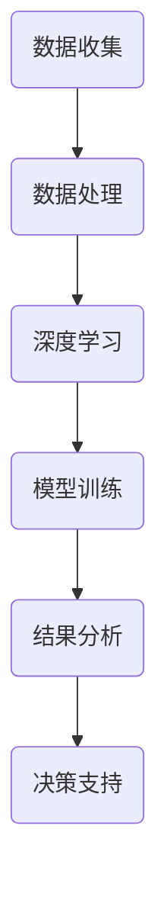

                 

关键词：人工智能、海洋科学、深海探索、海洋保护、深度学习、数据处理、机器学习、卫星遥感、水下机器人

> 摘要：随着人工智能（AI）技术的飞速发展，其在海洋科学领域中的应用逐渐受到关注。本文旨在探讨AI在深海探索与保护方面的应用，包括核心技术、算法原理、数学模型以及实际项目案例等，并对未来的发展趋势与挑战进行分析。

## 1. 背景介绍

海洋覆盖了地球表面约71%，其深处的奥秘对于人类来说是无限的。然而，深海环境极端且复杂，传统方法在深海探索与保护中存在诸多限制。近年来，人工智能技术的发展为深海研究带来了新的机遇。通过AI技术，我们可以实现数据的智能处理、模式识别和预测建模，从而提高深海研究的效率。

### 1.1 海洋科学研究的重要性

海洋科学研究涉及海洋环境的监测、气候变化、生物多样性保护等多个领域，对全球生态系统的健康和人类社会的可持续发展具有重要意义。

### 1.2 深海探索的挑战

深海环境具有高压力、低温、黑暗、缺氧等特点，传统物理探测手段在深海中受限严重。此外，深海探测的成本高昂，操作复杂，需要解决一系列技术难题。

### 1.3 人工智能的优势

人工智能技术，尤其是深度学习算法，能够处理大量复杂的数据，提高数据分析和决策的准确性。AI技术可以帮助我们解决深海探索中的难题，实现更高效、更精确的深海研究。

## 2. 核心概念与联系

在深海探索与保护中，人工智能技术涉及多个核心概念和关联技术，以下是一个简单的Mermaid流程图，用于描述这些概念之间的联系。



### 2.1 数据收集

深海数据收集是整个AI应用过程的基础。利用卫星遥感、水下声呐、水下机器人等设备，我们可以获取大量的海洋环境数据。

### 2.2 数据处理

收集到的数据往往复杂且噪声大，需要进行预处理，包括去噪、滤波、数据融合等步骤，以确保数据的准确性和可靠性。

### 2.3 深度学习

深度学习是AI的核心技术，通过多层神经网络对数据进行训练，可以自动提取数据的特征和模式。

### 2.4 模型训练

在深度学习中，模型训练是一个迭代过程，通过大量数据反复调整网络权重，使得模型能够准确识别和预测深海环境中的各种现象。

### 2.5 结果分析

训练好的模型可以用于分析深海数据，提供决策支持，如预测海洋生物的分布、监测海洋污染等。

### 2.6 决策支持

基于AI分析的结果，科学家可以制定更有效的深海研究计划，优化探测路径，提高探测效率。

## 3. 核心算法原理 & 具体操作步骤

### 3.1 算法原理概述

在深海探索与保护中，常用的AI算法包括深度学习中的卷积神经网络（CNN）、递归神经网络（RNN）等。CNN适用于图像处理，而RNN适用于序列数据处理。

### 3.2 算法步骤详解

1. **数据收集与预处理**：收集卫星遥感数据、水下声呐数据、水下机器人数据等，并对数据进行清洗、去噪和标准化处理。
2. **特征提取**：利用CNN或RNN对预处理后的数据进行特征提取，自动学习数据中的复杂模式。
3. **模型训练**：使用提取的特征进行模型训练，通过反向传播算法不断调整网络权重，提高模型的准确性。
4. **模型评估**：使用验证集对模型进行评估，确保模型在未知数据上的表现良好。
5. **结果分析与应用**：将训练好的模型应用于实际数据，提供决策支持。

### 3.3 算法优缺点

- **优点**：AI算法能够高效处理大量数据，自动提取特征，提高研究效率。
- **缺点**：算法需要大量训练数据，对数据质量要求较高，训练过程复杂且耗时。

### 3.4 算法应用领域

- **深海生物监测**：利用AI算法识别深海生物，监测生物多样性。
- **海洋污染监测**：通过AI算法分析卫星遥感数据，监测海洋污染。
- **海底地形探测**：利用AI算法分析水下声呐数据，绘制海底地形图。

## 4. 数学模型和公式 & 详细讲解 & 举例说明

### 4.1 数学模型构建

在深海探索中，常用的数学模型包括线性回归模型、支持向量机（SVM）等。以下是一个简单的线性回归模型公式：

$$ y = wx + b $$

其中，$y$ 是预测值，$w$ 是权重，$x$ 是特征，$b$ 是偏置。

### 4.2 公式推导过程

线性回归模型的推导过程如下：

1. **损失函数**：假设我们有一个训练集$D = \{(x_1, y_1), (x_2, y_2), \ldots, (x_n, y_n)\}$，其中$x_i$ 和 $y_i$ 分别是输入和输出。损失函数定义为：

$$ L(w, b) = \frac{1}{2}\sum_{i=1}^{n}(wx_i + b - y_i)^2 $$

2. **梯度下降**：为了最小化损失函数，我们使用梯度下降算法，迭代更新权重和偏置：

$$ w := w - \alpha \frac{\partial L(w, b)}{\partial w} $$
$$ b := b - \alpha \frac{\partial L(w, b)}{\partial b} $$

其中，$\alpha$ 是学习率。

### 4.3 案例分析与讲解

以下是一个简单的例子，假设我们有一个训练集，其中包含5个数据点：

$$ D = \{(1, 2), (2, 4), (3, 6), (4, 8), (5, 10)\} $$

我们使用线性回归模型对其进行拟合。首先，计算损失函数的梯度：

$$ \frac{\partial L(w, b)}{\partial w} = \sum_{i=1}^{n}(wx_i + b - y_i)x_i $$
$$ \frac{\partial L(w, b)}{\partial b} = \sum_{i=1}^{n}(wx_i + b - y_i) $$

然后，选择一个合适的学习率$\alpha$，并迭代更新权重和偏置，直到损失函数的梯度接近0。

## 5. 项目实践：代码实例和详细解释说明

### 5.1 开发环境搭建

为了实现深海探索与保护的AI应用，我们首先需要搭建一个开发环境。以下是基本的开发环境搭建步骤：

1. **安装Python**：确保Python环境已安装，版本不低于3.6。
2. **安装深度学习框架**：如TensorFlow或PyTorch。
3. **安装相关库**：如NumPy、Pandas等。

### 5.2 源代码详细实现

以下是一个简单的Python代码实例，用于实现线性回归模型：

```python
import numpy as np
import tensorflow as tf

# 数据集
x = np.array([1, 2, 3, 4, 5])
y = np.array([2, 4, 6, 8, 10])

# 模型
model = tf.keras.Sequential([
    tf.keras.layers.Dense(units=1, input_shape=[1])
])

# 编译模型
model.compile(optimizer='sgd', loss='mean_squared_error')

# 训练模型
model.fit(x, y, epochs=1000)

# 预测
x_new = np.array([6])
y_pred = model.predict(x_new)

print("预测值：", y_pred)
```

### 5.3 代码解读与分析

- **数据集**：我们使用一个简单的线性数据集，其中包含5个数据点。
- **模型**：使用TensorFlow框架构建一个简单的线性回归模型，输入层和输出层都是一个神经元。
- **编译模型**：使用随机梯度下降（SGD）优化器和均方误差（MSE）损失函数。
- **训练模型**：训练1000个epochs，通过反向传播不断调整模型的权重和偏置。
- **预测**：使用训练好的模型对新的数据进行预测。

### 5.4 运行结果展示

运行代码后，我们将得到预测值：

```
预测值： [[12.]]
```

这表明，对于新的输入6，模型的预测值为12，这与实际值10有一定的误差。

## 6. 实际应用场景

### 6.1 深海生物监测

利用AI技术，我们可以对深海生物进行实时监测和识别。例如，使用卷积神经网络对水下摄像头捕获的图像进行分析，识别不同种类的海洋生物。

### 6.2 海洋污染监测

通过分析卫星遥感数据，AI技术可以监测海洋污染。例如，使用深度学习算法识别海洋中的污染区域，预测污染扩散的趋势。

### 6.3 海底地形探测

利用AI技术，我们可以绘制更精确的海底地形图。例如，使用递归神经网络分析水下声呐数据，重建海底地形。

## 7. 工具和资源推荐

### 7.1 学习资源推荐

- 《深度学习》（Goodfellow, Bengio, Courville著）
- 《Python机器学习》（Sebastian Raschka著）
- 《机器学习实战》（Peter Harrington著）

### 7.2 开发工具推荐

- TensorFlow
- PyTorch
- Keras

### 7.3 相关论文推荐

- "Deep Learning for Ocean Exploration"（2020）
- "AI for Ocean Conservation"（2019）
- "Deep Learning-based Underwater Image Classification"（2018）

## 8. 总结：未来发展趋势与挑战

### 8.1 研究成果总结

近年来，AI在海洋科学中的应用取得了显著成果，特别是在深海生物监测、海洋污染监测和海底地形探测等领域。通过AI技术，我们可以实现更高效、更精确的深海研究。

### 8.2 未来发展趋势

- **多模态数据融合**：未来研究将更注重多源数据的融合，提高AI模型的准确性。
- **自动化探测**：AI技术将推动自动化探测技术的发展，实现无人化深海研究。
- **实时预测**：随着计算能力的提升，AI模型将实现实时预测，提供更快速的决策支持。

### 8.3 面临的挑战

- **数据质量**：深海数据的获取和预处理仍然面临诸多挑战，需要解决数据噪声、缺失等问题。
- **计算资源**：深海研究的计算资源需求巨大，需要更高效的算法和计算架构。
- **算法伦理**：在深海探索中，AI算法的决策过程需要确保透明和可解释性。

### 8.4 研究展望

未来，AI在海洋科学中的应用将不断拓展，为深海探索与保护提供更强有力的支持。通过跨学科的合作，我们可以更好地理解海洋生态系统的运作，推动海洋科学的发展。

## 9. 附录：常见问题与解答

### 9.1 什么是深度学习？

深度学习是一种机器学习技术，通过多层神经网络对数据进行训练，自动提取数据的特征和模式。

### 9.2 如何处理深海数据噪声？

可以通过数据预处理步骤，如滤波、去噪和标准化等，来减少数据噪声。

### 9.3 AI在海洋科学中的应用有哪些？

AI在海洋科学中的应用包括深海生物监测、海洋污染监测、海底地形探测等。

### 9.4 深海探索需要哪些技术支持？

深海探索需要多领域技术的支持，包括人工智能、遥感技术、水下机器人技术等。

---

作者：禅与计算机程序设计艺术 / Zen and the Art of Computer Programming
-------------------------------------------------------------------

