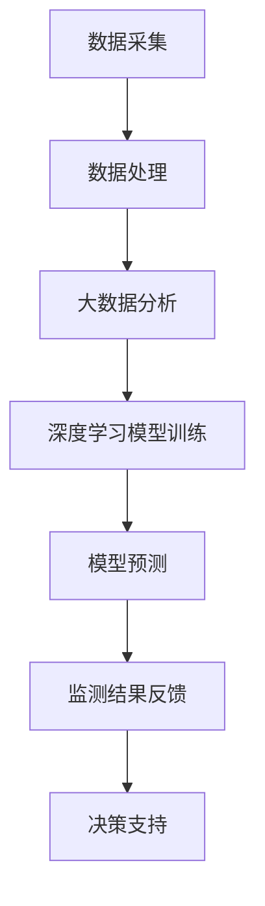

                 

关键词：人工智能，环境监测，保护，数据分析，深度学习，遥感技术

> 摘要：随着全球环境问题的日益严峻，人工智能（AI）技术在环境监测和保护领域的应用变得越来越重要。本文将探讨AI技术在环境监测和保护中的关键作用，包括其如何通过大数据分析、深度学习和遥感技术提高监测精度和效率，以及未来可能的发展趋势和面临的挑战。

## 1. 背景介绍

### 环境监测的重要性

环境监测是了解环境质量、预测环境变化趋势、评估人类活动对环境影响的重要手段。传统的环境监测主要依靠人工采集数据、实验室分析等方法，存在效率低、覆盖面窄、实时性差等问题。随着环境问题的加剧，特别是气候变化、空气污染、水资源短缺等问题的突出，对环境监测的要求越来越高，迫切需要新的技术手段来提升监测的精度和效率。

### 人工智能的发展

人工智能（AI）是一种模拟人类智能行为的计算机技术，包括机器学习、深度学习、自然语言处理等多种技术。近年来，随着计算能力的提升、数据量的爆炸性增长以及算法的进步，AI技术在各行各业中的应用越来越广泛，尤其是在环境监测和保护领域。

## 2. 核心概念与联系

### 大数据分析

大数据分析是通过对大量环境数据进行收集、存储、处理和分析，提取有价值信息的技术。在环境监测中，大数据分析能够帮助识别环境变化的趋势，预测潜在的环境风险。

### 深度学习

深度学习是一种基于多层神经网络的学习方法，能够自动提取数据中的特征，用于分类、识别和预测。在环境监测中，深度学习技术可以提高监测数据的处理速度和准确性。

### 遥感技术

遥感技术利用卫星、无人机等设备获取地表信息，能够实现大范围、高频率的环境监测。与传统的地面监测方法相比，遥感技术具有高效、实时、成本低等优点。

### Mermaid 流程图

下面是环境监测和保护中AI技术应用的Mermaid流程图：



## 3. 核心算法原理 & 具体操作步骤

### 3.1 算法原理概述

在环境监测中，AI技术的核心是机器学习和深度学习算法。这些算法能够通过训练大量数据，提取出环境变化的特征，从而实现对环境质量的监测和预测。

### 3.2 算法步骤详解

1. **数据采集**：通过传感器、卫星、无人机等设备收集环境数据。
2. **数据处理**：对采集到的数据进行清洗、去噪、归一化等预处理。
3. **大数据分析**：利用大数据分析技术，对预处理后的数据进行挖掘，提取有价值的信息。
4. **深度学习模型训练**：使用训练集数据，通过深度学习算法训练出环境监测模型。
5. **模型预测**：使用训练好的模型对新的环境数据进行预测。
6. **监测结果反馈**：将监测结果反馈给相关部门或公众，提供决策支持。

### 3.3 算法优缺点

**优点**：

- 提高监测效率：AI技术能够快速处理大量数据，实现实时监测。
- 提高监测精度：通过深度学习算法，可以自动提取环境数据中的特征，提高监测准确性。
- 减少人力成本：自动化监测可以减少人工采集和处理数据的工作量。

**缺点**：

- 数据依赖性：AI技术的性能依赖于数据的数量和质量。
- 模型复杂性：深度学习模型的训练过程复杂，需要大量的计算资源和时间。
- 数据隐私问题：环境监测数据可能涉及个人隐私，需要加强数据保护。

### 3.4 算法应用领域

- **空气质量监测**：通过AI技术，可以实时监测空气质量，预测污染事件。
- **水质监测**：利用AI技术，可以对水质进行实时监测和预测，及时发现污染源。
- **植被监测**：通过遥感技术和深度学习算法，可以监测植被变化，评估生态状况。

## 4. 数学模型和公式 & 详细讲解 & 举例说明

### 4.1 数学模型构建

在环境监测中，常用的数学模型包括线性回归模型、决策树模型、支持向量机模型等。以下以线性回归模型为例进行介绍。

### 4.2 公式推导过程

线性回归模型的公式为：

$$y = \beta_0 + \beta_1x + \epsilon$$

其中，$y$ 是因变量，$x$ 是自变量，$\beta_0$ 和 $\beta_1$ 是模型参数，$\epsilon$ 是误差项。

通过最小二乘法，可以求得模型参数：

$$\beta_1 = \frac{\sum{(x_i - \bar{x})(y_i - \bar{y})}}{\sum{(x_i - \bar{x})^2}}$$

$$\beta_0 = \bar{y} - \beta_1\bar{x}$$

### 4.3 案例分析与讲解

假设我们要预测某地区的日均温度，我们收集了该地区过去一年的日均温度数据，通过线性回归模型进行预测。首先，我们需要对数据进行预处理，包括去除异常值、归一化等操作。然后，我们可以使用最小二乘法求解模型参数。

经过训练，我们得到模型参数为：

$$\beta_0 = 10.5, \beta_1 = 0.8$$

那么，我们可以用这个模型预测下一周的日均温度：

$$y = 10.5 + 0.8x$$

当$x$为下一周的日期时，我们可以得到预测的日均温度。

## 5. 项目实践：代码实例和详细解释说明

### 5.1 开发环境搭建

为了实践AI在环境监测中的应用，我们需要搭建一个开发环境。这里我们使用Python作为开发语言，主要的库包括NumPy、Pandas、scikit-learn等。

### 5.2 源代码详细实现

以下是一个简单的线性回归模型在环境监测中的应用实例：

```python
import numpy as np
import pandas as pd
from sklearn.linear_model import LinearRegression

# 加载数据
data = pd.read_csv('weather_data.csv')
X = data[['date']]
y = data['temperature']

# 数据预处理
X = (X - X.mean()) / X.std()
y = (y - y.mean()) / y.std()

# 模型训练
model = LinearRegression()
model.fit(X, y)

# 模型预测
next_day = np.array([[2023, 1]])
next_temp = model.predict(next_day)
next_temp = next_temp * y.std() + y.mean()
print(f'预测下一周的日均温度为：{next_temp[0]}')
```

### 5.3 代码解读与分析

上述代码首先加载了环境监测数据，然后对数据进行预处理，包括日期的标准化和温度的归一化。接下来，我们使用线性回归模型进行训练，并使用训练好的模型预测下一周的日均温度。最后，我们将预测结果转换为原始单位，输出预测温度。

### 5.4 运行结果展示

运行上述代码，我们可以得到下一周的日均温度预测值。这个预测值可以帮助相关部门提前做好准备，应对可能出现的极端天气。

## 6. 实际应用场景

### 6.1 空气质量监测

在空气质量监测中，AI技术可以实时分析空气中的污染物浓度，预测污染事件，为政府决策提供支持。

### 6.2 水质监测

利用AI技术，可以对水质进行实时监测，识别污染源，提供水质改善建议。

### 6.3 植被监测

通过遥感技术和深度学习算法，可以监测植被变化，评估生态状况，为生态环境保护提供依据。

## 7. 工具和资源推荐

### 7.1 学习资源推荐

- 《深度学习》（Ian Goodfellow、Yoshua Bengio、Aaron Courville 著）
- 《Python数据分析》（Wes McKinney 著）

### 7.2 开发工具推荐

- Jupyter Notebook：用于编写和运行Python代码。
- PyCharm：Python集成开发环境。

### 7.3 相关论文推荐

- "Deep Learning for Environmental Science"（2018）
- "AI for Environmental Protection: Applications and Challenges"（2020）

## 8. 总结：未来发展趋势与挑战

### 8.1 研究成果总结

近年来，AI技术在环境监测和保护领域取得了显著成果，包括监测精度和效率的提高、监测范围的扩大等。

### 8.2 未来发展趋势

未来，AI技术在环境监测和保护领域将朝着更加智能化、高效化的方向发展，包括：

- 更多的数据来源和种类。
- 更先进的算法和模型。
- 更广泛的应用场景。

### 8.3 面临的挑战

尽管AI技术在环境监测和保护领域具有巨大潜力，但仍然面临以下挑战：

- 数据质量和数量的保证。
- 模型复杂性和计算资源的平衡。
- 数据隐私和安全问题。

### 8.4 研究展望

未来，需要进一步加强AI技术在环境监测和保护领域的研究，包括：

- 开发适用于环境监测的专用AI算法。
- 加强数据采集和处理技术。
- 促进跨学科合作，提升整体研究水平。

## 9. 附录：常见问题与解答

### 9.1 AI技术在环境监测中有什么优势？

AI技术在环境监测中的优势包括：

- 提高监测效率：AI技术能够快速处理大量数据，实现实时监测。
- 提高监测精度：通过深度学习算法，可以自动提取环境数据中的特征，提高监测准确性。
- 减少人力成本：自动化监测可以减少人工采集和处理数据的工作量。

### 9.2 如何保证环境监测数据的准确性？

保证环境监测数据的准确性需要：

- 确保数据采集设备的精度和稳定性。
- 对采集到的数据进行严格的质量控制和校准。
- 使用先进的算法对数据进行处理和分析。

### 9.3 AI技术在环境监测中存在哪些挑战？

AI技术在环境监测中存在以下挑战：

- 数据依赖性：AI技术的性能依赖于数据的数量和质量。
- 模型复杂性：深度学习模型的训练过程复杂，需要大量的计算资源和时间。
- 数据隐私问题：环境监测数据可能涉及个人隐私，需要加强数据保护。

-------------------------------------------------------------------

作者：禅与计算机程序设计艺术 / Zen and the Art of Computer Programming
```<|im_sep|>```

