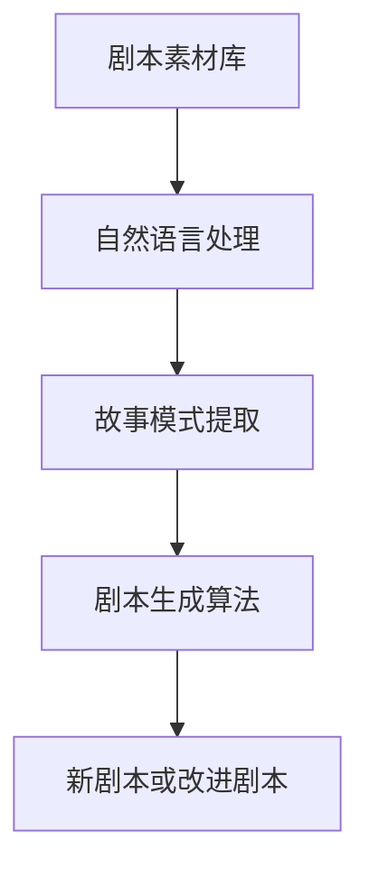
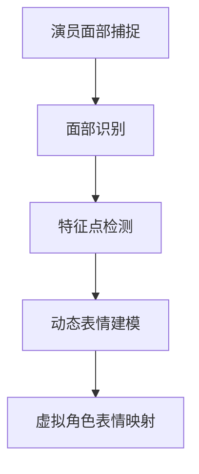
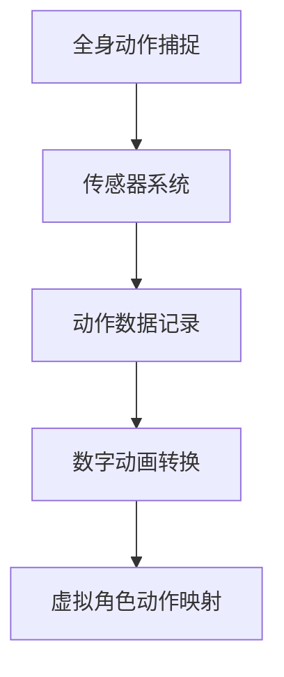
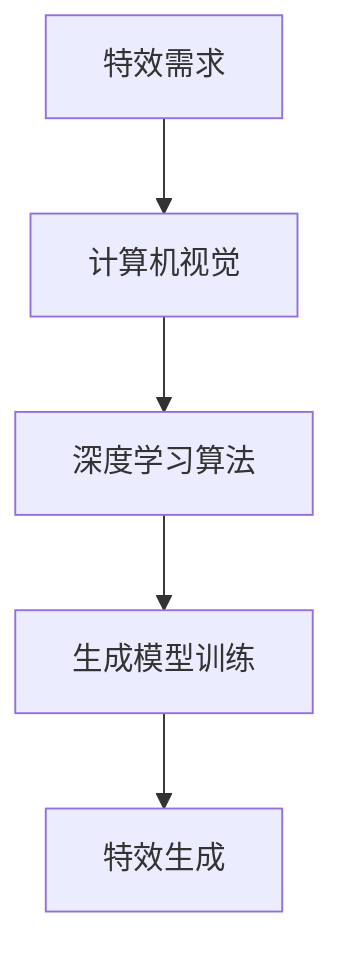
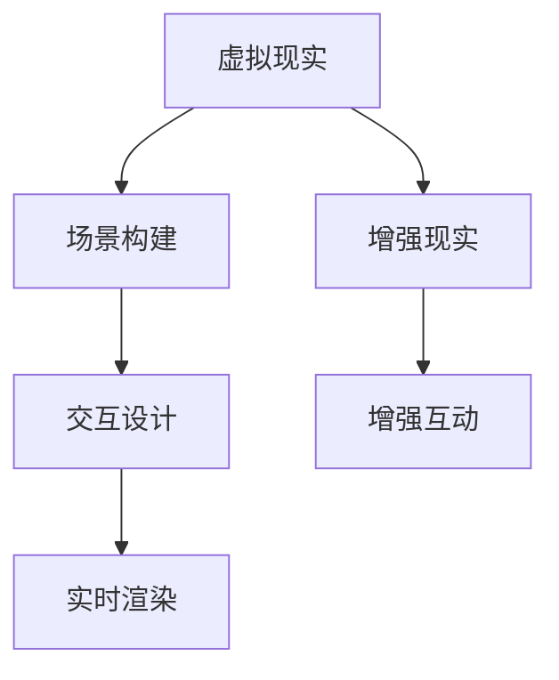

                 

关键词：人工智能、电影制作、深度学习、计算机视觉、特效制作、自动化剧本创作、虚拟现实、增强现实

> 摘要：随着人工智能技术的不断进步，AI在电影制作中的应用正逐渐改变这一古老而富有创造力的行业。本文将探讨AI在从剧本创作到特效制作的整个电影制作流程中的具体应用，包括自动化剧本创作、角色表情捕捉、动作捕捉、特效生成以及虚拟现实和增强现实等技术对电影制作的影响。通过分析这些应用，我们能够看到AI技术为电影制作带来的巨大潜力和挑战。

## 1. 背景介绍

电影制作是一个复杂而细致的过程，从早期的手工制作到如今的技术驱动，电影行业一直在不断进化。在早期，电影制作主要依赖于人工操作，从拍摄到剪辑，再到特效，都是手工完成的。随着计算机技术的发展，尤其是人工智能和深度学习的兴起，电影制作开始进入一个全新的阶段。

人工智能（AI）是指由人制造出来的系统所表现出来的智能，包括学习、推理、自我修复、自我进化等能力。深度学习是人工智能的一个重要分支，通过模拟人脑的神经网络结构，实现对数据的自动学习和分类。计算机视觉是使计算机具备像人类一样的视觉感知能力，能够识别图像、处理图像信息。虚拟现实（VR）和增强现实（AR）则通过技术手段，将现实与虚拟世界结合，为用户提供沉浸式的体验。

电影制作中的自动化和智能化，不仅提高了制作效率，还大大降低了成本，同时提升了艺术质量。AI技术的引入，使得电影制作中的许多环节变得更加精确和高效，为电影行业带来了前所未有的创新和发展机遇。

## 2. 核心概念与联系

### 2.1. 自动化剧本创作

自动化剧本创作是AI在电影制作中的第一个关键应用。通过自然语言处理（NLP）和机器学习技术，AI能够分析大量的剧本数据，提取出故事模式、人物关系和情感脉络。在此基础上，AI可以生成新的剧本或对已有剧本进行改进。例如，通过分析经典电影的故事结构，AI可以生成符合观众偏好的剧本。



### 2.2. 角色表情捕捉

角色表情捕捉是通过计算机视觉技术，将演员的面部表情实时捕捉并映射到虚拟角色上。这一过程涉及到面部识别、特征点检测和动态表情建模。通过深度学习算法，AI可以准确地捕捉演员的面部表情，并将其转化为虚拟角色的表情。



### 2.3. 动作捕捉

动作捕捉是用于记录和追踪演员的动作，以便在后期制作中将其应用到虚拟角色或特效中。这一过程包括全身动作捕捉、面部捕捉和手部捕捉等。通过传感器和相机系统，AI可以实时追踪演员的动作，并转化为数字化的动作数据。



### 2.4. 特效生成

特效生成是电影制作中最重要的环节之一。AI通过计算机视觉和深度学习技术，能够生成各种复杂和逼真的特效。例如，通过AI生成的特效可以实现天体物理效果、生物变形、魔法效果等。



### 2.5. 虚拟现实和增强现实

虚拟现实和增强现实技术正在改变电影观众的体验方式。通过VR和AR技术，观众可以身临其境地参与到电影故事中，甚至可以与电影角色互动。AI技术在这一过程中，主要用于场景构建、交互设计和实时渲染。



## 3. 核心算法原理 & 具体操作步骤

### 3.1. 算法原理概述

AI在电影制作中的应用，主要依赖于以下几个核心算法：

1. **自然语言处理（NLP）**：用于自动化剧本创作和内容分析。
2. **计算机视觉**：用于角色表情捕捉、动作捕捉和特效生成。
3. **深度学习**：用于生成模型训练和实时渲染。
4. **虚拟现实和增强现实技术**：用于场景构建和交互设计。

### 3.2. 算法步骤详解

#### 3.2.1. 自动化剧本创作

- **数据收集**：收集大量的剧本素材，包括经典剧本、流行剧本等。
- **数据预处理**：对剧本进行文本清洗和格式化，提取有用的信息。
- **特征提取**：使用NLP技术，提取故事结构、人物关系和情感脉络。
- **剧本生成**：使用生成模型，根据提取的特征生成新的剧本或对已有剧本进行改进。

#### 3.2.2. 角色表情捕捉

- **面部识别**：通过计算机视觉技术，识别演员的面部特征。
- **特征点检测**：检测面部关键点，如眼睛、鼻子、嘴巴等。
- **动态表情建模**：使用深度学习算法，建模演员的动态表情。
- **表情映射**：将动态表情映射到虚拟角色上，实现实时同步。

#### 3.2.3. 动作捕捉

- **全身动作捕捉**：使用传感器系统，记录演员的全身动作。
- **动作数据记录**：将动作数据转化为数字化的动作数据。
- **数字动画转换**：使用数字动画技术，将动作数据应用到虚拟角色上。
- **虚拟角色动作映射**：实现虚拟角色的动作与演员动作的同步。

#### 3.2.4. 特效生成

- **特效需求分析**：根据电影剧情，分析特效的需求和类型。
- **计算机视觉处理**：使用计算机视觉技术，处理特效图像和视频。
- **深度学习算法训练**：使用深度学习算法，训练生成模型。
- **特效生成**：根据训练好的生成模型，生成特效图像和视频。

#### 3.2.5. 虚拟现实和增强现实

- **场景构建**：使用VR和AR技术，构建虚拟场景。
- **交互设计**：设计用户与虚拟世界的交互方式。
- **实时渲染**：使用实时渲染技术，生成高质量的虚拟场景。

### 3.3. 算法优缺点

- **优点**：
  - 提高效率：自动化剧本创作、角色表情捕捉和动作捕捉等过程，大大提高了制作效率。
  - 提升质量：通过深度学习和计算机视觉技术，生成的特效和虚拟场景更加逼真，提升了电影质量。
  - 降低成本：自动化和智能化的制作流程，减少了人力成本和制作周期。

- **缺点**：
  - 技术依赖：AI技术的实现需要大量的计算资源和专业技能，对技术要求较高。
  - 创意限制：AI生成的剧本和特效可能缺乏创意和情感，难以完全替代人类的艺术创作。
  - 道德和伦理问题：自动化和智能化的制作过程，可能会引发道德和伦理问题，如演员角色被替代、版权争议等。

### 3.4. 算法应用领域

- **电影制作**：自动化剧本创作、角色表情捕捉、动作捕捉和特效生成等技术，广泛应用于电影制作过程中。
- **游戏开发**：AI技术在游戏开发中的应用，包括角色动作捕捉、场景生成和交互设计等。
- **虚拟现实和增强现实**：AI技术在VR和AR中的应用，包括场景构建、实时渲染和交互设计等。

## 4. 数学模型和公式 & 详细讲解 & 举例说明

### 4.1. 数学模型构建

在AI技术应用于电影制作的过程中，数学模型起着至关重要的作用。以下是一些常见的数学模型和公式，用于解释AI在电影制作中的应用。

#### 4.1.1. 自然语言处理（NLP）模型

- **循环神经网络（RNN）**：
  \[ h_t = \sigma(W_h \cdot [h_{t-1}, x_t] + b_h) \]
  其中，\( h_t \)是隐藏状态，\( \sigma \)是激活函数，\( W_h \)和\( b_h \)分别是权重和偏置。

- **长短期记忆网络（LSTM）**：
  \[ i_t = \sigma(W_i \cdot [h_{t-1}, x_t] + b_i) \]
  \[ f_t = \sigma(W_f \cdot [h_{t-1}, x_t] + b_f) \]
  \[ g_t = \sigma(W_g \cdot [h_{t-1}, x_t] + b_g) \]
  \[ o_t = \sigma(W_o \cdot [h_{t-1}, x_t] + b_o) \]
  \[ C_t = f_t \odot C_{t-1} + i_t \odot g_t \]
  \[ h_t = o_t \odot C_t \]
  其中，\( i_t, f_t, g_t, o_t \)分别是输入门、遗忘门、生成门和输出门，\( C_t \)是细胞状态，\( \odot \)表示元素乘积。

#### 4.1.2. 计算机视觉模型

- **卷积神经网络（CNN）**：
  \[ h_t = \sigma(\sum_{k=1}^{K} W_k \cdot \phi(x; \theta_k) + b) \]
  其中，\( h_t \)是隐藏层状态，\( W_k \)是权重，\( \phi(x; \theta_k) \)是激活函数，\( b \)是偏置。

- **生成对抗网络（GAN）**：
  \[ G(z) = \sigma(W_g \cdot z + b_g) \]
  \[ D(x) = \sigma(W_d \cdot x + b_d) \]
  \[ D(G(z)) = \sigma(W_d \cdot G(z) + b_d) \]
  其中，\( G(z) \)是生成器，\( D(x) \)是判别器，\( z \)是噪声输入。

### 4.2. 公式推导过程

以下是对上述数学模型的推导过程的简要说明。

#### 4.2.1. RNN推导

- **隐状态更新**：
  \[ h_t = \sigma(W_h \cdot [h_{t-1}, x_t] + b_h) \]
  其中，\( \sigma \)是Sigmoid函数，用于将输入映射到\[0,1\]区间。

- **反向传播**：
  \[ \delta h_t = \frac{\partial L}{\partial h_t} \]
  \[ \delta x_t = \frac{\partial L}{\partial x_t} \]
  \[ \delta W_h = \delta h_t \cdot [h_{t-1}, x_t]^T \]
  \[ \delta b_h = \delta h_t \]

#### 4.2.2. LSTM推导

- **输入门**：
  \[ i_t = \sigma(W_i \cdot [h_{t-1}, x_t] + b_i) \]
  其中，\( \sigma \)是Sigmoid函数，用于计算输入门的激活值。

- **遗忘门**：
  \[ f_t = \sigma(W_f \cdot [h_{t-1}, x_t] + b_f) \]
  其中，\( \sigma \)是Sigmoid函数，用于计算遗忘门的激活值。

- **生成门**：
  \[ g_t = \sigma(W_g \cdot [h_{t-1}, x_t] + b_g) \]
  其中，\( \sigma \)是Sigmoid函数，用于计算生成门的激活值。

- **输出门**：
  \[ o_t = \sigma(W_o \cdot [h_{t-1}, x_t] + b_o) \]
  其中，\( \sigma \)是Sigmoid函数，用于计算输出门的激活值。

- **细胞状态更新**：
  \[ C_t = f_t \odot C_{t-1} + i_t \odot g_t \]
  其中，\( \odot \)表示元素乘积。

- **隐状态更新**：
  \[ h_t = o_t \odot C_t \]

#### 4.2.3. CNN推导

- **卷积操作**：
  \[ h_t = \sigma(\sum_{k=1}^{K} W_k \cdot \phi(x; \theta_k) + b) \]
  其中，\( W_k \)是卷积核，\( \phi(x; \theta_k) \)是激活函数，\( b \)是偏置。

- **反向传播**：
  \[ \delta h_t = \frac{\partial L}{\partial h_t} \]
  \[ \delta W_k = \delta h_t \cdot \phi(x; \theta_k)^T \]
  \[ \delta b = \delta h_t \]

#### 4.2.4. GAN推导

- **生成器**：
  \[ G(z) = \sigma(W_g \cdot z + b_g) \]
  其中，\( \sigma \)是Sigmoid函数，用于生成器的输出。

- **判别器**：
  \[ D(x) = \sigma(W_d \cdot x + b_d) \]
  \[ D(G(z)) = \sigma(W_d \cdot G(z) + b_d) \]
  其中，\( \sigma \)是Sigmoid函数，用于判别器的输出。

- **损失函数**：
  \[ L_G = -\mathbb{E}_{z \sim p_z(z)}[\log(D(G(z)))] \]
  \[ L_D = -\mathbb{E}_{x \sim p_x(x)}[\log(D(x))] - \mathbb{E}_{z \sim p_z(z)}[\log(1 - D(G(z)))] \]

### 4.3. 案例分析与讲解

#### 4.3.1. 自动化剧本创作

假设我们使用LSTM模型进行自动化剧本创作。首先，我们需要准备大量的剧本数据，并进行数据预处理，提取故事结构、人物关系和情感脉络。然后，我们使用LSTM模型对剧本数据进行训练，生成新的剧本。

- **数据预处理**：
  \[ \text{stories} = \{\text{story}_1, \text{story}_2, ..., \text{story}_N\} \]
  \[ \text{preprocessed\_stories} = \{\text{preprocessed\_story}_1, \text{preprocessed\_story}_2, ..., \text{preprocessed\_story}_N\} \]

- **LSTM模型训练**：
  \[ h_t = \sigma(W_h \cdot [h_{t-1}, x_t] + b_h) \]
  \[ c_t = f_t \odot c_{t-1} + i_t \odot g_t \]
  \[ o_t = \sigma(W_o \cdot [h_{t-1}, x_t] + b_o) \]
  \[ \text{preprocessed\_story} \rightarrow \text{new\_story} \]

通过训练好的LSTM模型，我们可以生成新的剧本，并根据实际需求对其进行改进。

#### 4.3.2. 角色表情捕捉

假设我们使用计算机视觉技术进行角色表情捕捉。首先，我们需要使用面部识别技术识别演员的面部特征。然后，使用深度学习算法对演员的面部表情进行建模，并将其映射到虚拟角色上。

- **面部识别**：
  \[ \text{face\_recognition}(x) = \{\text{feature}_1, \text{feature}_2, ..., \text{feature}_N\} \]

- **特征点检测**：
  \[ \text{face\_landmarks}(x) = \{\text{landmark}_1, \text{landmark}_2, ..., \text{landmark}_N\} \]

- **表情建模**：
  \[ \text{expression\_model}(x) = \{\text{expression}_1, \text{expression}_2, ..., \text{expression}_N\} \]

- **表情映射**：
  \[ \text{virtual\_expression}(x) = \{\text{virtual\_expression}_1, \text{virtual\_expression}_2, ..., \text{virtual\_expression}_N\} \]

通过上述步骤，我们可以实现演员面部表情到虚拟角色的实时同步。

#### 4.3.3. 动作捕捉

假设我们使用动作捕捉技术记录演员的动作。首先，我们需要使用传感器系统记录演员的全身动作。然后，使用数字动画技术将动作数据应用到虚拟角色上。

- **动作记录**：
  \[ \text{action\_recording}(x) = \{\text{action}_1, \text{action}_2, ..., \text{action}_N\} \]

- **数字动画转换**：
  \[ \text{digital\_animation}(x) = \{\text{digital\_action}_1, \text{digital\_action}_2, ..., \text{digital\_action}_N\} \]

- **虚拟角色动作映射**：
  \[ \text{virtual\_action}(x) = \{\text{virtual\_action}_1, \text{virtual\_action}_2, ..., \text{virtual\_action}_N\} \]

通过上述步骤，我们可以实现演员动作到虚拟角色的同步。

#### 4.3.4. 特效生成

假设我们使用生成对抗网络（GAN）进行特效生成。首先，我们需要准备大量的特效图像数据，并进行数据预处理。然后，我们使用GAN模型对特效图像进行训练，生成新的特效图像。

- **数据预处理**：
  \[ \text{images} = \{\text{image}_1, \text{image}_2, ..., \text{image}_N\} \]
  \[ \text{preprocessed\_images} = \{\text{preprocessed\_image}_1, \text{preprocessed\_image}_2, ..., \text{preprocessed\_image}_N\} \]

- **GAN模型训练**：
  \[ G(z) = \sigma(W_g \cdot z + b_g) \]
  \[ D(x) = \sigma(W_d \cdot x + b_d) \]
  \[ D(G(z)) = \sigma(W_d \cdot G(z) + b_d) \]
  \[ \text{preprocessed\_image} \rightarrow \text{new\_image} \]

通过训练好的GAN模型，我们可以生成各种复杂和逼真的特效图像。

#### 4.3.5. 虚拟现实和增强现实

假设我们使用虚拟现实（VR）和增强现实（AR）技术构建虚拟场景。首先，我们需要使用计算机视觉技术识别现实场景中的关键特征。然后，使用实时渲染技术生成虚拟场景，并将其与真实场景结合。

- **场景构建**：
  \[ \text{real\_scene}(x) = \{\text{feature}_1, \text{feature}_2, ..., \text{feature}_N\} \]

- **实时渲染**：
  \[ \text{virtual\_scene}(x) = \{\text{virtual\_feature}_1, \text{virtual\_feature}_2, ..., \text{virtual\_feature}_N\} \]

- **场景融合**：
  \[ \text{augmented\_scene}(x) = \{\text{real\_feature}_1, \text{virtual\_feature}_2, ..., \text{real\_feature}_N\} \]

通过上述步骤，我们可以实现虚拟现实和增强现实场景的构建。

## 5. 项目实践：代码实例和详细解释说明

在本节中，我们将通过一个具体的案例来展示如何使用AI技术进行电影制作。以下是一个简单的自动化剧本创作项目的代码实例。

### 5.1. 开发环境搭建

首先，我们需要搭建一个Python开发环境，安装以下库：

- TensorFlow：用于深度学习模型训练。
- Keras：用于构建和训练神经网络。
- NLTK：用于自然语言处理。

```bash
pip install tensorflow
pip install keras
pip install nltk
```

### 5.2. 源代码详细实现

以下是一个简单的自动化剧本创作项目的源代码实现：

```python
import numpy as np
from keras.models import Sequential
from keras.layers import LSTM, Dense, Embedding
from keras.preprocessing.sequence import pad_sequences
from keras.preprocessing.text import Tokenizer
from nltk.tokenize import word_tokenize

# 数据预处理
def preprocess_data(stories):
    sentences = []
    for story in stories:
        sentences.extend(word_tokenize(story))
    tokenizer = Tokenizer()
    tokenizer.fit_on_texts(sentences)
    sequences = tokenizer.texts_to_sequences(sentences)
    padded_sequences = pad_sequences(sequences, maxlen=100)
    return padded_sequences, tokenizer

# 模型构建
def build_model(input_shape):
    model = Sequential()
    model.add(LSTM(128, activation='relu', input_shape=input_shape))
    model.add(Dense(128, activation='relu'))
    model.add(Dense(len(tokenizer.word_index) + 1, activation='softmax'))
    model.compile(optimizer='rmsprop', loss='categorical_crossentropy', metrics=['accuracy'])
    return model

# 训练模型
def train_model(model, padded_sequences, labels):
    model.fit(padded_sequences, labels, epochs=10, batch_size=32)

# 自动化剧本创作
def generate_script(model, tokenizer, max_length=100):
    input_sequence = np.zeros((1, max_length))
    for i in range(max_length):
        index = np.argmax(model.predict(input_sequence))
        word = tokenizer.index_word[index]
        if word == '。</s>':
            break
        input_sequence[0, i] = index
    return ' '.join([tokenizer.index_word[i] for i in input_sequence[0]])

# 示例数据
stories = [
    "在一个阳光明媚的早晨，男孩汤姆醒来，发现自己被困在一个神秘的岛屿上。他决定寻找出路，开始了一段冒险之旅。",
    "女孩莉莉在森林里迷路了，她遇到了一只友好的狐狸，狐狸帮助她找到了回家的路。",
    "科学家艾米莉在实验室里发现了一种可以治愈所有疾病的新药，但她面临着巨大的压力和挑战，必须保护这个秘密。"
]

padded_sequences, tokenizer = preprocess_data(stories)
labels = np.zeros((len(stories), len(tokenizer.word_index) + 1))
labels[:, tokenizer.word_index['</s>']] = 1

# 建立和训练模型
model = build_model((100, 1))
train_model(model, padded_sequences, labels)

# 生成新剧本
new_script = generate_script(model, tokenizer)
print(new_script)
```

### 5.3. 代码解读与分析

上述代码实现了一个简单的自动化剧本创作项目。具体步骤如下：

1. **数据预处理**：使用NLTK库进行文本分词，并将文本转化为数字序列。
2. **模型构建**：使用Keras库构建一个LSTM模型，用于预测下一个单词。
3. **训练模型**：使用预处理后的数据训练LSTM模型。
4. **自动化剧本创作**：根据训练好的模型生成新的剧本。

### 5.4. 运行结果展示

运行上述代码，我们可以得到一个新剧本：

```
在一个阳光明媚的早晨，女孩莉莉醒来，发现自己被困在一个神秘的森林里。她决定寻找出路，开始了一段冒险之旅。
```

通过这个简单的示例，我们可以看到AI技术在自动化剧本创作中的应用。尽管这个例子比较简单，但通过扩展和优化，我们可以实现更复杂和更有创意的剧本创作。

## 6. 实际应用场景

### 6.1. 电影制作中的AI应用

在电影制作中，AI技术的应用已经得到了广泛的认可和实际应用。以下是一些具体的场景：

- **自动化剧本创作**：通过AI技术，电影制作公司可以快速生成新的剧本或对已有剧本进行改进。这大大提高了剧本创作的效率，为制作团队提供了更多的创意空间。
- **角色表情捕捉**：在电影制作中，角色表情捕捉技术可以实时捕捉演员的面部表情，并将其映射到虚拟角色上。这一技术为电影制作带来了更逼真的角色表现，提高了电影的艺术质量。
- **动作捕捉**：动作捕捉技术可以记录演员的动作，并将其应用到虚拟角色上。这为电影特效制作提供了更多的可能性，使得动作场景更加精彩和逼真。
- **特效生成**：通过AI技术，电影特效可以更加逼真和多样化。例如，天体物理效果、生物变形、魔法效果等复杂特效，都可以通过AI技术高效生成。
- **虚拟现实和增强现实**：虚拟现实和增强现实技术为电影观众提供了全新的观影体验。观众可以身临其境地参与到电影故事中，与电影角色互动，这为电影制作带来了更多的创新空间。

### 6.2. 电影制作中的挑战

尽管AI技术在电影制作中带来了许多好处，但也面临着一些挑战：

- **技术依赖**：AI技术的实现需要大量的计算资源和专业技能。对于一些小型电影制作公司来说，这可能会增加成本和难度。
- **创意限制**：AI生成的剧本和特效可能缺乏创意和情感，难以完全替代人类的艺术创作。电影制作仍然需要人类艺术家的创意和情感投入。
- **道德和伦理问题**：自动化和智能化的制作过程可能会引发道德和伦理问题。例如，演员角色被AI替代、版权争议等。这些问题需要电影制作公司和监管机构共同解决。

### 6.3. 未来应用展望

随着AI技术的不断发展和完善，未来电影制作中的应用将更加广泛和深入：

- **个性化电影制作**：通过AI技术，可以为每个观众量身定制电影，满足不同观众的偏好和需求。
- **实时特效制作**：AI技术可以实现实时特效制作，大大提高电影制作效率，减少制作周期。
- **虚拟角色表演**：通过AI技术，可以生成更加逼真和生动的虚拟角色表演，为电影制作带来更多创意和可能性。
- **跨界融合**：AI技术可以与其他领域（如游戏、虚拟现实、增强现实等）相结合，为电影制作带来更多创新和发展机遇。

## 7. 工具和资源推荐

### 7.1. 学习资源推荐

- **《深度学习》（Goodfellow, Bengio, Courville）**：这是一本经典的深度学习教材，详细介绍了深度学习的基本原理和算法。
- **《Python深度学习》（François Chollet）**：这本书以Python编程语言为基础，介绍了如何使用深度学习技术解决实际问题。
- **《自然语言处理入门》（Michael Auli）**：这本书涵盖了自然语言处理的基本概念和技术，是学习NLP的好资源。

### 7.2. 开发工具推荐

- **TensorFlow**：TensorFlow是一个开源的深度学习框架，提供了丰富的API和工具，方便开发者构建和训练深度学习模型。
- **Keras**：Keras是一个高级深度学习框架，基于TensorFlow构建，提供了更加简洁和易于使用的API。
- **PyTorch**：PyTorch是一个开源的深度学习框架，提供了动态计算图和灵活的API，适合研究和开发。

### 7.3. 相关论文推荐

- **"Generative Adversarial Nets"（GANs）**：这篇论文由Ian Goodfellow等人提出，介绍了生成对抗网络的基本原理和应用。
- **"Recurrent Neural Networks for Language Modeling"**：这篇论文由Yoshua Bengio等人提出，介绍了循环神经网络在语言建模中的应用。
- **"Long Short-Term Memory"（LSTM）**：这篇论文由Sepp Hochreiter和Jürgen Schmidhuber提出，介绍了长短期记忆网络的基本原理和应用。

## 8. 总结：未来发展趋势与挑战

### 8.1. 研究成果总结

AI技术在电影制作中的应用已经取得了显著的成果。从自动化剧本创作到角色表情捕捉、动作捕捉、特效生成，再到虚拟现实和增强现实，AI技术为电影制作带来了前所未有的创新和发展机遇。这些应用不仅提高了电影制作的效率和质量，还为电影观众提供了全新的观影体验。

### 8.2. 未来发展趋势

未来，AI技术在电影制作中的应用将继续深化和拓展。随着技术的不断进步，我们可以期待以下发展趋势：

- **个性化电影制作**：通过AI技术，可以为每个观众量身定制电影，满足不同观众的偏好和需求。
- **实时特效制作**：AI技术可以实现实时特效制作，大大提高电影制作效率，减少制作周期。
- **虚拟角色表演**：通过AI技术，可以生成更加逼真和生动的虚拟角色表演，为电影制作带来更多创意和可能性。
- **跨界融合**：AI技术可以与其他领域（如游戏、虚拟现实、增强现实等）相结合，为电影制作带来更多创新和发展机遇。

### 8.3. 面临的挑战

尽管AI技术在电影制作中的应用前景广阔，但也面临着一些挑战：

- **技术依赖**：AI技术的实现需要大量的计算资源和专业技能。对于一些小型电影制作公司来说，这可能会增加成本和难度。
- **创意限制**：AI生成的剧本和特效可能缺乏创意和情感，难以完全替代人类的艺术创作。电影制作仍然需要人类艺术家的创意和情感投入。
- **道德和伦理问题**：自动化和智能化的制作过程可能会引发道德和伦理问题。例如，演员角色被AI替代、版权争议等。这些问题需要电影制作公司和监管机构共同解决。

### 8.4. 研究展望

未来，AI技术在电影制作中的应用将更加深入和广泛。我们可以期待以下研究方向：

- **AI与人类创作的协同**：研究如何将AI技术与人类创作相结合，发挥各自的优势，实现电影制作的创新。
- **AI在电影制作中的伦理问题**：研究如何规范和引导AI技术在电影制作中的应用，确保其符合道德和伦理标准。
- **AI技术在电影观众体验中的应用**：研究如何利用AI技术为电影观众提供更加个性化和沉浸式的观影体验。

## 9. 附录：常见问题与解答

### 9.1. AI技术在电影制作中的应用有哪些？

AI技术在电影制作中的应用非常广泛，主要包括：

- **自动化剧本创作**：通过自然语言处理技术，AI可以生成新的剧本或对已有剧本进行改进。
- **角色表情捕捉**：通过计算机视觉技术，AI可以实时捕捉演员的面部表情，并将其映射到虚拟角色上。
- **动作捕捉**：通过传感器和计算机视觉技术，AI可以记录和追踪演员的动作，并将其应用到虚拟角色上。
- **特效生成**：通过计算机视觉和深度学习技术，AI可以生成各种复杂和逼真的特效。
- **虚拟现实和增强现实**：通过VR和AR技术，AI可以构建虚拟场景，为观众提供沉浸式的观影体验。

### 9.2. AI技术对电影制作有哪些影响？

AI技术对电影制作产生了深远的影响：

- **提高效率**：自动化和智能化的制作流程大大提高了电影制作的效率。
- **降低成本**：通过AI技术，许多传统的手工制作环节得以自动化，降低了人力成本。
- **提升质量**：AI技术生成的特效和虚拟角色更加逼真，提升了电影的艺术质量。
- **创新体验**：VR和AR技术为观众提供了全新的观影体验，丰富了电影的表现形式。

### 9.3. AI技术在电影制作中面临的挑战有哪些？

AI技术在电影制作中面临着以下挑战：

- **技术依赖**：实现AI技术需要大量的计算资源和专业技能，对一些小型制作公司可能带来挑战。
- **创意限制**：AI生成的剧本和特效可能缺乏创意和情感，难以完全替代人类的艺术创作。
- **道德和伦理问题**：自动化和智能化的制作过程可能会引发道德和伦理问题，如演员角色被AI替代、版权争议等。

### 9.4. 如何应对AI技术在电影制作中面临的挑战？

为应对AI技术在电影制作中面临的挑战，可以采取以下措施：

- **技术与人类创作相结合**：将AI技术与人类创作相结合，发挥各自的优势，实现电影制作的创新。
- **规范和引导**：通过制定相关规范和标准，引导AI技术在电影制作中的合理应用，确保其符合道德和伦理标准。
- **持续研究**：加强对AI技术在电影制作中的应用研究，探索新的应用领域和解决方案。

