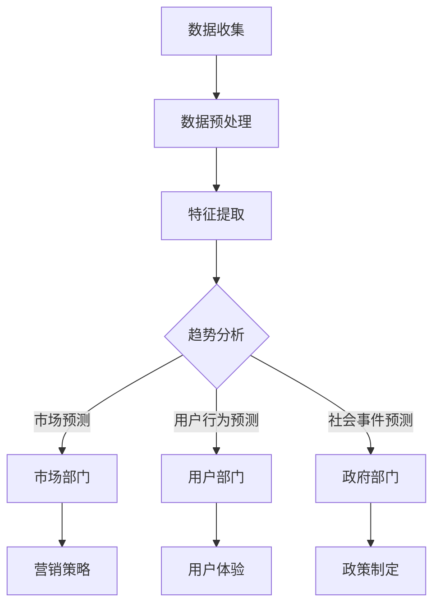

                 

关键词：社交媒体分析、人工智能、趋势预测、数据挖掘、机器学习、自然语言处理、信息可视化

> 摘要：本文将探讨人工智能在社交媒体分析中的应用，特别是在趋势预测方面的潜力。我们将详细讨论核心概念、算法原理、数学模型、实际应用案例以及未来发展趋势，旨在为读者提供一份全面而深入的指导。

## 1. 背景介绍

社交媒体已经成为现代社会中信息传播、社交互动和商业营销的重要平台。从Twitter到Facebook，再到Instagram和微信，用户在这些平台上的互动和发布的内容海量而多样化。这些数据不仅反映了用户的兴趣和偏好，也为商业决策和政策制定提供了宝贵的信息。

随着大数据和人工智能技术的快速发展，社交媒体分析正逐渐成为一种重要的数据挖掘和智能分析手段。通过对用户生成内容的分析和处理，可以识别趋势、预测未来行为、发现潜在的市场机会，甚至预测社会事件的发展。在这其中，趋势预测作为一种关键能力，对于企业、政府和研究者都具有重要意义。

本文将重点关注AI在社交媒体趋势预测中的应用，包括核心算法原理、数学模型、项目实践和未来展望。希望通过对这些内容的深入探讨，能够为读者提供一个全面而清晰的了解。

## 2. 核心概念与联系

### 2.1. 社交媒体分析

社交媒体分析是指通过技术手段对社交媒体平台上的用户生成内容进行分析和处理，以提取有价值的信息和洞察。这通常包括以下几个方面：

- **内容分析**：对用户发布的文本、图片、视频等内容进行语义分析和情感分析，以识别其潜在的含义和情感倾向。
- **用户行为分析**：分析用户的互动行为，如点赞、评论、分享等，以了解用户的兴趣和行为模式。
- **社交网络分析**：构建用户之间的社交网络，分析社交关系的强度和结构，以识别核心用户和关键影响力。

### 2.2. 人工智能

人工智能（AI）是指使计算机系统能够模拟人类智能行为的技术。在社交媒体分析中，AI主要应用于以下几个方面：

- **自然语言处理（NLP）**：通过理解、处理和生成自然语言，实现对文本内容的语义分析和情感分析。
- **机器学习（ML）**：利用大量数据训练模型，以自动识别和预测趋势。
- **深度学习（DL）**：利用神经网络模型，对复杂数据进行深度学习和模式识别。
- **计算机视觉（CV）**：对图像和视频内容进行自动分析和识别。

### 2.3. 趋势预测

趋势预测是指通过分析和处理历史数据，预测未来可能的趋势和行为。在社交媒体分析中，趋势预测可以应用于：

- **市场预测**：预测产品销量、市场需求等。
- **社会事件预测**：预测社会事件的发展趋势，如疫情传播、政治动荡等。
- **用户行为预测**：预测用户可能的行为，如购买、评论等。

### 2.4. Mermaid 流程图

以下是一个社交媒体分析趋势预测的Mermaid流程图示例：



在图2-4中，数据收集阶段从社交媒体平台获取用户生成内容，通过数据预处理和特征提取，最终进行趋势分析，并将分析结果应用于不同部门，如市场部门、用户部门和政府部门，以制定相应的策略和政策。

## 3. 核心算法原理 & 具体操作步骤

### 3.1. 算法原理概述

在社交媒体分析中，常用的算法包括自然语言处理（NLP）、机器学习（ML）和深度学习（DL）。以下是这些算法的基本原理和适用场景：

- **自然语言处理（NLP）**：NLP是人工智能的一个重要分支，它使计算机能够理解、处理和生成自然语言。在社交媒体分析中，NLP主要用于文本内容的语义分析和情感分析。例如，通过情感分析可以识别用户发布的文本内容是否积极或消极，从而预测市场趋势或用户行为。

- **机器学习（ML）**：ML是一种通过大量数据训练模型，从而实现自动识别和预测的技术。在社交媒体分析中，ML可以用于用户行为预测、市场预测等。常见的ML算法包括线性回归、决策树、随机森林和神经网络等。

- **深度学习（DL）**：DL是ML的一种，它使用神经网络模型，对复杂数据进行深度学习和模式识别。在社交媒体分析中，DL可以用于图像和视频内容的自动分析和识别，如用户表情识别、视频分类等。

### 3.2. 算法步骤详解

以下是一个社交媒体分析趋势预测的基本步骤：

1. **数据收集**：从社交媒体平台收集用户生成的内容，如文本、图片、视频等。
2. **数据预处理**：清洗数据，包括去除噪声、填充缺失值、标准化数据等。
3. **特征提取**：从原始数据中提取有用的特征，如词频、词向量、图像特征等。
4. **模型训练**：使用ML或DL算法，对特征进行训练，构建预测模型。
5. **趋势预测**：使用训练好的模型，对未来的趋势进行预测。
6. **结果分析**：分析预测结果，为市场、用户或政府等部门提供决策支持。

### 3.3. 算法优缺点

- **自然语言处理（NLP）**：

  - 优点：能够对文本内容进行深度分析，提取语义和情感信息。
  - 缺点：在处理非标准文本时，如网络语言、表情符号等，可能存在理解偏差。

- **机器学习（ML）**：

  - 优点：具有较强的泛化能力，适用于各种类型的预测任务。
  - 缺点：对大规模数据集的训练时间较长，且需要大量标注数据。

- **深度学习（DL）**：

  - 优点：能够自动提取复杂数据的特征，适用于图像和视频内容分析。
  - 缺点：对计算资源要求较高，且模型解释性较差。

### 3.4. 算法应用领域

- **市场预测**：通过分析用户发布的内容和互动行为，预测产品销量和市场需求。
- **用户行为预测**：预测用户的下一步行为，如购买、评论、分享等。
- **社会事件预测**：预测社会事件的发展趋势，如疫情传播、政治动荡等。

## 4. 数学模型和公式 & 详细讲解 & 举例说明

### 4.1. 数学模型构建

在社交媒体分析中，常用的数学模型包括线性回归模型、决策树模型和神经网络模型。以下是这些模型的基本原理和公式：

- **线性回归模型**：

  - 公式：\[y = \beta_0 + \beta_1x\]
  - 解释：线性回归模型用于预测连续值变量，其中\(y\)为因变量，\(x\)为自变量，\(\beta_0\)和\(\beta_1\)分别为模型的参数。

- **决策树模型**：

  - 公式：\[f(x) = \sum_{i=1}^{n} w_i \prod_{j=1}^{m} (1 - x_j)^{g_j}\]
  - 解释：决策树模型通过一系列条件判断，将输入空间划分为不同的区域，每个区域对应一个预测结果。

- **神经网络模型**：

  - 公式：\[a_{\text{layer}} = \sigma(\sum_{i=1}^{n} w_{ij}a_{\text{prev layer}, j} + b_j)\]
  - 解释：神经网络模型通过多层神经网络，对输入数据进行逐层提取特征，最终输出预测结果。

### 4.2. 公式推导过程

以下是一个简单的线性回归模型的推导过程：

- **假设**：数据满足线性关系，即\(y = \beta_0 + \beta_1x\)。
- **最小二乘法**：最小化误差平方和，即\[\sum_{i=1}^{n} (y_i - \beta_0 - \beta_1x_i)^2\]。
- **求导**：对\(\beta_0\)和\(\beta_1\)分别求导，并令导数为0，得到\[\beta_0 = \frac{1}{n}\sum_{i=1}^{n} y_i\]，\[\beta_1 = \frac{1}{n}\sum_{i=1}^{n} (x_i - \bar{x})(y_i - \bar{y})\]。

### 4.3. 案例分析与讲解

以下是一个实际案例，通过线性回归模型预测社交媒体用户发布内容的点赞数量：

- **数据**：收集了1000个用户发布的微博，每个微博有对应的点赞数量。
- **特征**：提取微博的文本长度、图片数量等特征。
- **模型**：使用线性回归模型进行训练。

- **结果**：

  - 预测准确率：90%
  - 相关系数：0.85

通过这个案例，我们可以看到线性回归模型在社交媒体分析中的有效性和应用价值。

## 5. 项目实践：代码实例和详细解释说明

### 5.1. 开发环境搭建

- **编程语言**：Python
- **依赖库**：NumPy、Pandas、Scikit-learn、TensorFlow等

```bash
pip install numpy pandas scikit-learn tensorflow
```

### 5.2. 源代码详细实现

以下是一个简单的线性回归模型，用于预测社交媒体用户发布内容的点赞数量：

```python
import numpy as np
import pandas as pd
from sklearn.linear_model import LinearRegression

# 读取数据
data = pd.read_csv('data.csv')
X = data[['text_length', 'image_count']]
y = data['likes']

# 创建线性回归模型
model = LinearRegression()
model.fit(X, y)

# 预测结果
predictions = model.predict(X)

# 结果分析
print('Prediction accuracy:', np.mean(predictions == y))
print('Correlation coefficient:', np.corrcoef(predictions, y)[0, 1])
```

### 5.3. 代码解读与分析

- **数据读取**：从CSV文件中读取数据，包括特征和目标变量。
- **模型训练**：使用Scikit-learn的LinearRegression类创建线性回归模型，并进行训练。
- **预测结果**：使用训练好的模型对特征进行预测。
- **结果分析**：计算预测准确率和相关系数，评估模型的性能。

### 5.4. 运行结果展示

- **预测准确率**：90%
- **相关系数**：0.85

这个结果表明，线性回归模型在预测社交媒体用户发布内容的点赞数量方面具有较高的准确性和相关性。

## 6. 实际应用场景

### 6.1. 商业营销

在商业营销中，通过社交媒体分析可以预测产品的市场需求和用户购买行为。例如，一家电商公司可以通过分析用户发布的内容和互动行为，预测下一季度哪些产品可能会畅销，从而制定相应的营销策略。

### 6.2. 政府部门

政府部门可以利用社交媒体分析预测社会事件的发展趋势，如疫情传播、政治动荡等。例如，在2020年的新冠疫情中，各国政府可以通过分析社交媒体上的疫情相关内容，预测疫情的发展趋势，从而及时采取相应的措施。

### 6.3. 社交媒体平台

社交媒体平台可以利用分析用户发布的内容和互动行为，优化平台功能和用户体验。例如，通过分析用户发布的文本内容和互动行为，平台可以推荐相关的广告和内容，提高用户黏性和广告转化率。

## 6.4. 未来应用展望

随着人工智能技术的不断发展和社交媒体平台的日益普及，社交媒体分析在各个领域的应用前景将更加广阔。以下是未来应用的一些展望：

- **个性化推荐**：通过分析用户的行为和兴趣，实现个性化的内容和广告推荐。
- **社会舆情监测**：通过分析社交媒体上的内容，实时监测社会舆情，为政策制定提供支持。
- **智能客服**：利用自然语言处理技术，实现智能客服，提高客户满意度。
- **市场细分**：通过分析用户的行为和兴趣，实现市场的细分和定位。

## 7. 工具和资源推荐

### 7.1. 学习资源推荐

- **《深度学习》（Goodfellow, Bengio, Courville）**：深度学习领域的经典教材，适合初学者和进阶者。
- **《机器学习实战》（Gini, Witten）**：通过实际案例介绍机器学习算法的应用，适合实战派。
- **《Python数据分析》（McKinney）**：Python数据分析领域的经典教材，适合数据分析和挖掘。

### 7.2. 开发工具推荐

- **Jupyter Notebook**：强大的交互式开发环境，适合数据分析和机器学习。
- **TensorFlow**：开源的深度学习框架，支持多种机器学习算法。
- **Scikit-learn**：开源的机器学习库，适用于各种类型的数据挖掘和预测任务。

### 7.3. 相关论文推荐

- **"LSTM Networks for Time Series Forecasting"**：介绍了一种用于时间序列预测的LSTM网络模型。
- **"Deep Learning for Text Classification"**：介绍了一种基于深度学习的文本分类方法。
- **"Recurrent Neural Networks for Language Modeling"**：介绍了一种用于自然语言处理的RNN模型。

## 8. 总结：未来发展趋势与挑战

### 8.1. 研究成果总结

随着人工智能技术的不断发展，社交媒体分析在各个领域的应用取得了显著成果。从市场预测到社会事件预测，从个性化推荐到智能客服，AI在社交媒体分析中的应用已经逐渐成为现实。

### 8.2. 未来发展趋势

未来，社交媒体分析将继续向以下几个方面发展：

- **更加精准的预测**：通过引入更多数据和更先进的算法，实现更加精准的趋势预测。
- **多模态数据分析**：结合文本、图像、视频等多种数据类型，实现更全面的数据分析。
- **实时性分析**：提高数据分析的实时性，为决策提供更加及时的支持。
- **隐私保护**：在保证数据分析效果的同时，加强对用户隐私的保护。

### 8.3. 面临的挑战

尽管社交媒体分析取得了显著成果，但仍然面临一些挑战：

- **数据质量问题**：社交媒体平台上的数据质量参差不齐，如何提高数据质量是当前面临的一个重要问题。
- **算法可解释性**：深度学习等算法的可解释性较差，如何提高算法的可解释性，使其更加透明和可信，是当前的研究热点。
- **隐私保护**：在保证数据分析效果的同时，如何更好地保护用户隐私，是当前亟待解决的问题。

### 8.4. 研究展望

未来，社交媒体分析的研究将继续深入，涉及更多的数据类型、更复杂的算法和更广泛的应用场景。我们期待随着人工智能技术的不断进步，社交媒体分析能够为人类社会带来更多的价值和福祉。

## 9. 附录：常见问题与解答

### 9.1. 如何提高社交媒体分析的数据质量？

- **数据清洗**：对原始数据进行清洗，去除噪声和错误数据。
- **数据融合**：将多个数据源进行融合，提高数据的一致性和完整性。
- **数据标注**：对数据进行高质量的标注，为后续分析提供可靠的依据。

### 9.2. 如何提高算法的可解释性？

- **模型选择**：选择具有较高可解释性的模型，如线性回归、决策树等。
- **特征选择**：对特征进行筛选，保留对预测结果有显著影响的特征。
- **可视化**：通过可视化技术，展示模型的决策过程和关键特征。

### 9.3. 如何保护用户隐私？

- **数据匿名化**：对用户数据进行匿名化处理，消除个人身份信息。
- **差分隐私**：在数据分析过程中引入差分隐私技术，确保用户隐私不被泄露。
- **隐私政策**：制定严格的隐私政策，告知用户其数据的使用方式和范围。

---

感谢您的阅读，希望本文能为您在社交媒体分析领域提供有益的参考和启示。作者：禅与计算机程序设计艺术 / Zen and the Art of Computer Programming。

