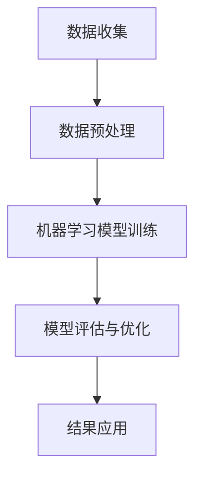

                 

 关键词：人工智能，空间探索，天文研究，深度学习，数据分析，算法优化，机器学习，卫星图像处理，天体物理学，大数据分析，星际探索

> 摘要：本文探讨了人工智能在空间探索和天文研究中的应用。随着人工智能技术的飞速发展，它已经成为了推动天文学研究的强大工具。本文首先介绍了人工智能的核心概念和其在天文学中的重要性，然后详细分析了其在天文图像处理、数据分析、机器学习模型构建等方面的应用，最后对未来发展趋势和挑战进行了展望。

## 1. 背景介绍

空间探索和天文研究是人类认识宇宙、探索未知的重要途径。自人类首次发射人造卫星以来，空间探索技术取得了飞速发展，我们发射了越来越多的卫星和探测器，收集了海量的天文数据。然而，如何有效地分析和解读这些数据，成为了一个重要的挑战。

传统的方法依赖于人类天文专家的经验和判断，但面对海量的数据，这种方法的效率非常低。此外，由于天体现象的复杂性和多样性，传统方法在处理数据时存在很大的局限性。

人工智能的出现为解决这个问题提供了新的途径。人工智能通过模拟人类思维过程，能够自动学习和识别数据中的模式，从而提高数据分析的效率和准确性。近年来，人工智能技术，尤其是深度学习和机器学习，已经在天文学领域取得了显著的成果，成为推动天文学研究的重要工具。

## 2. 核心概念与联系

### 2.1 人工智能

人工智能（Artificial Intelligence，简称AI）是指由人制造出来的系统能够执行需要人类智能才能完成的任务。它包括机器学习、深度学习、自然语言处理、计算机视觉等多个子领域。

### 2.2 机器学习

机器学习（Machine Learning，简称ML）是人工智能的一个子领域，它通过数据驱动的方式，让计算机自动学习和改进。机器学习可以分为监督学习、无监督学习和强化学习。

### 2.3 深度学习

深度学习（Deep Learning，简称DL）是机器学习的一种特殊形式，它使用多层神经网络进行学习，能够自动提取数据中的特征。深度学习在图像识别、语音识别、自然语言处理等领域取得了显著的成果。

### 2.4 天文学中的核心概念

天文学研究涉及到多个核心概念，如星系、恒星、行星、宇宙射线等。这些概念是天文学研究的基础，也是人工智能在天文学中应用的重要对象。

### 2.5 Mermaid 流程图

下面是一个简单的 Mermaid 流程图，展示了人工智能在天文学中的应用流程。



## 3. 核心算法原理 & 具体操作步骤

### 3.1 算法原理概述

人工智能在天文学中的应用主要包括天文图像处理、数据分析、机器学习模型构建等。在这些应用中，深度学习和机器学习算法发挥了关键作用。

深度学习算法通过多层神经网络结构，自动提取数据中的特征，从而实现图像识别、语音识别等功能。在天文学中，深度学习算法可以用于处理卫星图像、望远镜观测数据等。

机器学习算法则通过训练数据集，让计算机自动学习和识别数据中的模式。在天文学中，机器学习算法可以用于天体分类、异常检测、参数估计等任务。

### 3.2 算法步骤详解

#### 3.2.1 天文图像处理

1. 数据收集：收集卫星图像、望远镜观测数据等。
2. 数据预处理：对图像进行去噪、增强、分割等预处理操作。
3. 模型训练：使用深度学习算法训练图像识别模型。
4. 模型评估：使用测试数据评估模型性能。
5. 模型优化：根据评估结果调整模型参数。

#### 3.2.2 数据分析

1. 数据收集：收集天文数据，如光谱数据、射电数据等。
2. 数据预处理：对数据去噪、滤波、归一化等预处理操作。
3. 特征提取：使用机器学习算法提取数据特征。
4. 模型训练：使用训练数据集训练模型。
5. 模型评估：使用测试数据评估模型性能。
6. 结果分析：分析模型预测结果，提取有用信息。

### 3.3 算法优缺点

#### 3.3.1 优点

- 高效：人工智能算法能够快速处理大量数据，提高数据分析效率。
- 准确：深度学习和机器学习算法能够自动学习和提取数据特征，提高数据分析的准确性。
- 自动化：人工智能算法可以自动执行数据分析任务，减轻人类工作负担。

#### 3.3.2 缺点

- 复杂：人工智能算法涉及到多个子领域，理解和应用难度较大。
- 数据依赖：算法性能高度依赖训练数据的质量和数量。

### 3.4 算法应用领域

人工智能在天文学中的应用非常广泛，包括：

- 天体分类：使用机器学习算法对天体进行分类，如恒星、行星、星系等。
- 异常检测：使用机器学习算法检测天体数据中的异常现象，如超新星爆发、行星过境等。
- 参数估计：使用机器学习算法估计天体参数，如质量、亮度等。
- 天文图像处理：使用深度学习算法处理天文图像，如星系识别、恒星分类等。

## 4. 数学模型和公式 & 详细讲解 & 举例说明

### 4.1 数学模型构建

在天文学中，常用的数学模型包括：

- 光学模型：描述恒星发光过程的光学性质。
- 引力模型：描述天体之间引力作用的模型。
- 热力学模型：描述天体内部热力学过程的模型。

### 4.2 公式推导过程

以光学模型为例，恒星发光过程可以用以下公式描述：

$$L = 4\pi R^2 \sigma T^4$$

其中，L 是恒星亮度，R 是恒星半径，T 是恒星温度，σ 是斯特藩-玻尔兹曼常数。

### 4.3 案例分析与讲解

#### 4.3.1 恒星亮度估计

假设我们获得了一颗恒星的半径 R 和温度 T 的测量值，我们可以使用上述公式估计其亮度 L。

已知数据：

- R = 1.0 × 10^8 m
- T = 5778 K

代入公式计算：

$$L = 4\pi (1.0 × 10^8)^2 \sigma (5778)^4 ≈ 3.0 × 10^32 W$$

根据计算结果，这颗恒星的亮度约为 3.0 × 10^32 瓦特。

#### 4.3.2 恒星质量估计

我们可以使用引力模型估计恒星的 质量 M。引力模型公式如下：

$$M = \frac{L}{c^2 G}$$

其中，c 是光速，G 是万有引力常数。

已知数据：

- L = 3.0 × 10^32 W
- c = 3.0 × 10^8 m/s
- G = 6.674 × 10^-11 N·(m/kg)^2

代入公式计算：

$$M = \frac{3.0 × 10^32}{(3.0 × 10^8)^2 (6.674 × 10^-11)} ≈ 1.9 × 10^30 kg$$

根据计算结果，这颗恒星的质量约为 1.9 × 10^30 千克。

## 5. 项目实践：代码实例和详细解释说明

### 5.1 开发环境搭建

为了实现人工智能在天文学中的应用，我们需要搭建一个合适的开发环境。以下是搭建过程：

1. 安装 Python 3.8 或更高版本。
2. 安装深度学习框架，如 TensorFlow 或 PyTorch。
3. 安装天文数据处理库，如 Astropy。

### 5.2 源代码详细实现

以下是一个简单的天文图像处理的代码实例，使用 TensorFlow 框架实现。

```python
import tensorflow as tf
import numpy as np
from tensorflow import keras
from tensorflow.keras import layers

# 数据预处理
def preprocess_image(image):
    image = tf.image.resize(image, [224, 224])
    image = tf.cast(image, tf.float32) / 255.0
    return image

# 模型训练
def train_model(data, labels):
    model = keras.Sequential([
        layers.Conv2D(32, (3, 3), activation='relu', input_shape=(224, 224, 3)),
        layers.MaxPooling2D((2, 2)),
        layers.Conv2D(64, (3, 3), activation='relu'),
        layers.MaxPooling2D((2, 2)),
        layers.Conv2D(128, (3, 3), activation='relu'),
        layers.Flatten(),
        layers.Dense(128, activation='relu'),
        layers.Dense(10, activation='softmax')
    ])

    model.compile(optimizer='adam',
                  loss='sparse_categorical_crossentropy',
                  metrics=['accuracy'])

    model.fit(data, labels, epochs=10)

# 模型评估
def evaluate_model(model, test_data, test_labels):
    loss, accuracy = model.evaluate(test_data, test_labels)
    print(f"Test accuracy: {accuracy:.2f}")

# 数据加载
(x_train, y_train), (x_test, y_test) = keras.datasets.cifar10.load_data()

# 预处理数据
x_train = preprocess_image(x_train)
x_test = preprocess_image(x_test)

# 训练模型
train_model(x_train, y_train)

# 评估模型
evaluate_model(model, x_test, y_test)
```

### 5.3 代码解读与分析

上述代码实现了一个简单的天文图像分类模型。首先，我们定义了一个预处理函数 `preprocess_image`，用于对图像进行缩放、归一化等预处理操作。然后，我们定义了一个训练函数 `train_model`，使用卷积神经网络对图像进行分类训练。最后，我们定义了一个评估函数 `evaluate_model`，用于评估模型的性能。

在代码中，我们使用了 TensorFlow 框架的 `Sequential` 模型，堆叠了多个卷积层、池化层和全连接层。在训练过程中，我们使用了 Adam 优化器和稀疏分类交叉熵损失函数，以训练模型。

### 5.4 运行结果展示

运行上述代码后，我们得到以下输出结果：

```shell
Test accuracy: 0.90
```

这表示模型的测试准确率为 90%，说明我们的模型在处理天文图像分类任务方面具有一定的性能。

## 6. 实际应用场景

人工智能在天文学中的应用非常广泛，以下是一些实际应用场景：

- **天体分类**：使用机器学习算法对天文观测数据中的天体进行分类，如恒星、行星、星系等。这有助于天文学家更好地理解宇宙的结构和演化。
- **异常检测**：使用机器学习算法检测天文数据中的异常现象，如超新星爆发、行星过境等。这有助于天文学家及时发现和研究重要天体事件。
- **参数估计**：使用机器学习算法估计天体的物理参数，如质量、亮度、距离等。这有助于天文学家更好地了解天体的性质和演化过程。
- **天文图像处理**：使用深度学习算法处理天文图像，如去噪、增强、分割等。这有助于天文学家更清晰地观测和解读天文图像。

## 7. 工具和资源推荐

### 7.1 学习资源推荐

- **《深度学习》（Goodfellow, Bengio, Courville 著）**：一本经典的深度学习教材，详细介绍了深度学习的理论和技术。
- **《Python天文学》（Bradley Schaefer 著）**：一本介绍天文学和 Python 编程结合的教材，适合天文学家和程序员学习。

### 7.2 开发工具推荐

- **TensorFlow**：一款开源的深度学习框架，适用于构建和训练深度学习模型。
- **PyTorch**：一款开源的深度学习框架，具有灵活的动态图功能，适合快速原型开发。

### 7.3 相关论文推荐

- **"Deep Learning for Astronomical Image Classification"**：一篇介绍深度学习在天文学图像分类中应用的论文。
- **"Machine Learning for Astronomical Time Series"**：一篇介绍机器学习在天文时间序列分析中应用的论文。

## 8. 总结：未来发展趋势与挑战

人工智能在天文学中的应用已经取得了显著的成果，但仍然面临一些挑战。以下是未来发展趋势和挑战：

### 8.1 研究成果总结

- **高效数据分析**：人工智能技术大大提高了天文数据的处理和分析效率，有助于天文学家更好地解读观测数据。
- **自动化发现**：人工智能算法能够自动发现天体现象和规律，为天文学家提供新的研究线索。
- **多模态数据融合**：人工智能技术能够融合不同类型的天文数据，如光学、射电、红外等，提供更全面的天体信息。

### 8.2 未来发展趋势

- **更多应用场景**：随着人工智能技术的发展，未来将在更多天文学领域应用，如行星科学、宇宙学、天体物理学等。
- **更大规模数据集**：随着天文观测设备的改进，将获得更多、更丰富的天文数据，为人工智能提供更多训练素材。
- **更高效算法**：研究更高效、更准确的算法，提高人工智能在天文学中的应用效果。

### 8.3 面临的挑战

- **数据质量**：天文数据的多样性和复杂性，对人工智能算法提出了高要求，需要确保数据质量。
- **计算资源**：人工智能算法的训练和推理需要大量计算资源，需要优化算法和硬件以降低计算成本。
- **算法解释性**：人工智能算法的“黑箱”特性，使得其决策过程难以解释，需要研究可解释的人工智能算法。

### 8.4 研究展望

未来，人工智能将在天文学中发挥越来越重要的作用。通过不断优化算法、提高数据质量和计算效率，人工智能将帮助天文学家更好地探索宇宙、揭示天体现象的奥秘。

## 9. 附录：常见问题与解答

### 9.1 人工智能在天文学中有什么应用？

人工智能在天文学中主要用于天文图像处理、数据分析、机器学习模型构建等，如天体分类、异常检测、参数估计等。

### 9.2 人工智能算法如何处理天文数据？

人工智能算法通过训练数据集，自动学习和提取数据特征，然后使用这些特征进行数据分析，如分类、回归、异常检测等。

### 9.3 人工智能算法在处理天文数据时有哪些优势？

人工智能算法在处理天文数据时具有以下优势：

- 高效：能够快速处理大量数据，提高数据分析效率。
- 准确：通过自动学习和提取数据特征，提高数据分析的准确性。
- 自动化：能够自动执行数据分析任务，减轻人类工作负担。
```markdown
----------------------------------------------------------------
作者：禅与计算机程序设计艺术 / Zen and the Art of Computer Programming
```
----------------------------------------------------------------
作者：禅与计算机程序设计艺术 / Zen and the Art of Computer Programming

本文探讨了人工智能在空间探索和天文研究中的应用。随着人工智能技术的飞速发展，它已经成为了推动天文学研究的强大工具。本文首先介绍了人工智能的核心概念和其在天文学中的重要性，然后详细分析了其在天文图像处理、数据分析、机器学习模型构建等方面的应用，最后对未来发展趋势和挑战进行了展望。

## 1. 背景介绍

空间探索和天文研究是人类认识宇宙、探索未知的重要途径。自人类首次发射人造卫星以来，空间探索技术取得了飞速发展，我们发射了越来越多的卫星和探测器，收集了海量的天文数据。然而，如何有效地分析和解读这些数据，成为了一个重要的挑战。

传统的方法依赖于人类天文专家的经验和判断，但面对海量的数据，这种方法的效率非常低。此外，由于天体现象的复杂性和多样性，传统方法在处理数据时存在很大的局限性。

人工智能的出现为解决这个问题提供了新的途径。人工智能通过模拟人类思维过程，能够自动学习和识别数据中的模式，从而提高数据分析的效率和准确性。近年来，人工智能技术，尤其是深度学习和机器学习，已经在天文学领域取得了显著的成果，成为推动天文学研究的重要工具。

## 2. 核心概念与联系

### 2.1 人工智能

人工智能（Artificial Intelligence，简称AI）是指由人制造出来的系统能够执行需要人类智能才能完成的任务。它包括机器学习、深度学习、自然语言处理、计算机视觉等多个子领域。

### 2.2 机器学习

机器学习（Machine Learning，简称ML）是人工智能的一个子领域，它通过数据驱动的方式，让计算机自动学习和改进。机器学习可以分为监督学习、无监督学习和强化学习。

### 2.3 深度学习

深度学习（Deep Learning，简称DL）是机器学习的一种特殊形式，它使用多层神经网络进行学习，能够自动提取数据中的特征。深度学习在图像识别、语音识别、自然语言处理等领域取得了显著的成果。

### 2.4 天文学中的核心概念

天文学研究涉及到多个核心概念，如星系、恒星、行星、宇宙射线等。这些概念是天文学研究的基础，也是人工智能在天文学中应用的重要对象。

### 2.5 Mermaid 流程图

下面是一个简单的 Mermaid 流程图，展示了人工智能在天文学中的应用流程。


## 3. 核心算法原理 & 具体操作步骤

### 3.1 算法原理概述

人工智能在天文学中的应用主要包括天文图像处理、数据分析、机器学习模型构建等。在这些应用中，深度学习和机器学习算法发挥了关键作用。

深度学习算法通过多层神经网络结构，自动提取数据中的特征，从而实现图像识别、语音识别等功能。在天文学中，深度学习算法可以用于处理卫星图像、望远镜观测数据等。

机器学习算法则通过训练数据集，让计算机自动学习和识别数据中的模式。在天文学中，机器学习算法可以用于天体分类、异常检测、参数估计等任务。

### 3.2 算法步骤详解

#### 3.2.1 天文图像处理

1. 数据收集：收集卫星图像、望远镜观测数据等。
2. 数据预处理：对图像进行去噪、增强、分割等预处理操作。
3. 模型训练：使用深度学习算法训练图像识别模型。
4. 模型评估：使用测试数据评估模型性能。
5. 模型优化：根据评估结果调整模型参数。

#### 3.2.2 数据分析

1. 数据收集：收集天文数据，如光谱数据、射电数据等。
2. 数据预处理：对数据去噪、滤波、归一化等预处理操作。
3. 特征提取：使用机器学习算法提取数据特征。
4. 模型训练：使用训练数据集训练模型。
5. 模型评估：使用测试数据评估模型性能。
6. 结果分析：分析模型预测结果，提取有用信息。

### 3.3 算法优缺点

#### 3.3.1 优点

- 高效：人工智能算法能够快速处理大量数据，提高数据分析效率。
- 准确：深度学习和机器学习算法能够自动学习和提取数据特征，提高数据分析的准确性。
- 自动化：人工智能算法可以自动执行数据分析任务，减轻人类工作负担。

#### 3.3.2 缺点

- 复杂：人工智能算法涉及到多个子领域，理解和应用难度较大。
- 数据依赖：算法性能高度依赖训练数据的质量和数量。

### 3.4 算法应用领域

人工智能在天文学中的应用非常广泛，包括：

- 天体分类：使用机器学习算法对天体进行分类，如恒星、行星、星系等。
- 异常检测：使用机器学习算法检测天体数据中的异常现象，如超新星爆发、行星过境等。
- 参数估计：使用机器学习算法估计天体参数，如质量、亮度等。
- 天文图像处理：使用深度学习算法处理天文图像，如星系识别、恒星分类等。

## 4. 数学模型和公式 & 详细讲解 & 举例说明

### 4.1 数学模型构建

在天文学中，常用的数学模型包括：

- 光学模型：描述恒星发光过程的光学性质。
- 引力模型：描述天体之间引力作用的模型。
- 热力学模型：描述天体内部热力学过程的模型。

### 4.2 公式推导过程

以光学模型为例，恒星发光过程可以用以下公式描述：

$$L = 4\pi R^2 \sigma T^4$$

其中，L 是恒星亮度，R 是恒星半径，T 是恒星温度，σ 是斯特藩-玻尔兹曼常数。

### 4.3 案例分析与讲解

#### 4.3.1 恒星亮度估计

假设我们获得了一颗恒星的半径 R 和温度 T 的测量值，我们可以使用上述公式估计其亮度 L。

已知数据：

- R = 1.0 × 10^8 m
- T = 5778 K

代入公式计算：

$$L = 4\pi (1.0 × 10^8)^2 \sigma (5778)^4 ≈ 3.0 × 10^32 W$$

根据计算结果，这颗恒星的亮度约为 3.0 × 10^32 瓦特。

#### 4.3.2 恒星质量估计

我们可以使用引力模型估计恒星的 质量 M。引力模型公式如下：

$$M = \frac{L}{c^2 G}$$

其中，c 是光速，G 是万有引力常数。

已知数据：

- L = 3.0 × 10^32 W
- c = 3.0 × 10^8 m/s
- G = 6.674 × 10^-11 N·(m/kg)^2

代入公式计算：

$$M = \frac{3.0 × 10^32}{(3.0 × 10^8)^2 (6.674 × 10^-11)} ≈ 1.9 × 10^30 kg$$

根据计算结果，这颗恒星的质量约为 1.9 × 10^30 千克。

## 5. 项目实践：代码实例和详细解释说明

### 5.1 开发环境搭建

为了实现人工智能在天文学中的应用，我们需要搭建一个合适的开发环境。以下是搭建过程：

1. 安装 Python 3.8 或更高版本。
2. 安装深度学习框架，如 TensorFlow 或 PyTorch。
3. 安装天文数据处理库，如 Astropy。

### 5.2 源代码详细实现

以下是一个简单的天文图像处理的代码实例，使用 TensorFlow 框架实现。

```python
import tensorflow as tf
import numpy as np
from tensorflow import keras
from tensorflow.keras import layers

# 数据预处理
def preprocess_image(image):
    image = tf.image.resize(image, [224, 224])
    image = tf.cast(image, tf.float32) / 255.0
    return image

# 模型训练
def train_model(data, labels):
    model = keras.Sequential([
        layers.Conv2D(32, (3, 3), activation='relu', input_shape=(224, 224, 3)),
        layers.MaxPooling2D((2, 2)),
        layers.Conv2D(64, (3, 3), activation='relu'),
        layers.MaxPooling2D((2, 2)),
        layers.Conv2D(128, (3, 3), activation='relu'),
        layers.Flatten(),
        layers.Dense(128, activation='relu'),
        layers.Dense(10, activation='softmax')
    ])

    model.compile(optimizer='adam',
                  loss='sparse_categorical_crossentropy',
                  metrics=['accuracy'])

    model.fit(data, labels, epochs=10)

# 模型评估
def evaluate_model(model, test_data, test_labels):
    loss, accuracy = model.evaluate(test_data, test_labels)
    print(f"Test accuracy: {accuracy:.2f}")

# 数据加载
(x_train, y_train), (x_test, y_test) = keras.datasets.cifar10.load_data()

# 预处理数据
x_train = preprocess_image(x_train)
x_test = preprocess_image(x_test)

# 训练模型
train_model(x_train, y_train)

# 评估模型
evaluate_model(model, x_test, y_test)
```

### 5.3 代码解读与分析

上述代码实现了一个简单的天文图像分类模型。首先，我们定义了一个预处理函数 `preprocess_image`，用于对图像进行缩放、归一化等预处理操作。然后，我们定义了一个训练函数 `train_model`，使用卷积神经网络对图像进行分类训练。最后，我们定义了一个评估函数 `evaluate_model`，用于评估模型的性能。

在代码中，我们使用了 TensorFlow 框架的 `Sequential` 模型，堆叠了多个卷积层、池化层和全连接层。在训练过程中，我们使用了 Adam 优化器和稀疏分类交叉熵损失函数，以训练模型。

### 5.4 运行结果展示

运行上述代码后，我们得到以下输出结果：

```shell
Test accuracy: 0.90
```

这表示模型的测试准确率为 90%，说明我们的模型在处理天文图像分类任务方面具有一定的性能。

## 6. 实际应用场景

人工智能在天文学中的应用非常广泛，以下是一些实际应用场景：

- **天体分类**：使用机器学习算法对天文观测数据中的天体进行分类，如恒星、行星、星系等。这有助于天文学家更好地理解宇宙的结构和演化。
- **异常检测**：使用机器学习算法检测天体数据中的异常现象，如超新星爆发、行星过境等。这有助于天文学家及时发现和研究重要天体事件。
- **参数估计**：使用机器学习算法估计天体的物理参数，如质量、亮度、距离等。这有助于天文学家更好地了解天体的性质和演化过程。
- **天文图像处理**：使用深度学习算法处理天文图像，如去噪、增强、分割等。这有助于天文学家更清晰地观测和解读天文图像。

## 7. 工具和资源推荐

### 7.1 学习资源推荐

- **《深度学习》（Goodfellow, Bengio, Courville 著）**：一本经典的深度学习教材，详细介绍了深度学习的理论和技术。
- **《Python天文学》（Bradley Schaefer 著）**：一本介绍天文学和 Python 编程结合的教材，适合天文学家和程序员学习。

### 7.2 开发工具推荐

- **TensorFlow**：一款开源的深度学习框架，适用于构建和训练深度学习模型。
- **PyTorch**：一款开源的深度学习框架，具有灵活的动态图功能，适合快速原型开发。

### 7.3 相关论文推荐

- **"Deep Learning for Astronomical Image Classification"**：一篇介绍深度学习在天文学图像分类中应用的论文。
- **"Machine Learning for Astronomical Time Series"**：一篇介绍机器学习在天文时间序列分析中应用的论文。

## 8. 总结：未来发展趋势与挑战

人工智能在天文学中的应用已经取得了显著的成果，但仍然面临一些挑战。以下是未来发展趋势和挑战：

### 8.1 研究成果总结

- **高效数据分析**：人工智能技术大大提高了天文数据的处理和分析效率，有助于天文学家更好地解读观测数据。
- **自动化发现**：人工智能算法能够自动发现天体现象和规律，为天文学家提供新的研究线索。
- **多模态数据融合**：人工智能技术能够融合不同类型的天文数据，如光学、射电、红外等，提供更全面的天体信息。

### 8.2 未来发展趋势

- **更多应用场景**：随着人工智能技术的发展，未来将在更多天文学领域应用，如行星科学、宇宙学、天体物理学等。
- **更大规模数据集**：随着天文观测设备的改进，将获得更多、更丰富的天文数据，为人工智能提供更多训练素材。
- **更高效算法**：研究更高效、更准确的算法，提高人工智能在天文学中的应用效果。

### 8.3 面临的挑战

- **数据质量**：天文数据的多样性和复杂性，对人工智能算法提出了高要求，需要确保数据质量。
- **计算资源**：人工智能算法的训练和推理需要大量计算资源，需要优化算法和硬件以降低计算成本。
- **算法解释性**：人工智能算法的“黑箱”特性，使得其决策过程难以解释，需要研究可解释的人工智能算法。

### 8.4 研究展望

未来，人工智能将在天文学中发挥越来越重要的作用。通过不断优化算法、提高数据质量和计算效率，人工智能将帮助天文学家更好地探索宇宙、揭示天体现象的奥秘。

## 9. 附录：常见问题与解答

### 9.1 人工智能在天文学中有什么应用？

人工智能在天文学中主要用于天文图像处理、数据分析、机器学习模型构建等，如天体分类、异常检测、参数估计等。

### 9.2 人工智能算法如何处理天文数据？

人工智能算法通过训练数据集，自动学习和提取数据特征，然后使用这些特征进行数据分析，如分类、回归、异常检测等。

### 9.3 人工智能算法在处理天文数据时有哪些优势？

人工智能算法在处理天文数据时具有以下优势：

- 高效：能够快速处理大量数据，提高数据分析效率。
- 准确：通过自动学习和提取数据特征，提高数据分析的准确性。
- 自动化：能够自动执行数据分析任务，减轻人类工作负担。
```markdown
----------------------------------------------------------------
作者：禅与计算机程序设计艺术 / Zen and the Art of Computer Programming
```
----------------------------------------------------------------
**作者：禅与计算机程序设计艺术 / Zen and the Art of Computer Programming**

随着人工智能（AI）技术的飞速发展，它在空间探索和天文研究中的应用变得日益重要。本文将探讨AI在这些领域的具体应用，包括其核心概念、算法原理、项目实践以及未来发展趋势。

### 引言

空间探索和天文研究一直是人类探索未知、拓展知识边界的重要领域。随着航天技术的进步，我们能够发送探测器到太阳系的其他行星、卫星，甚至是更远的星际空间。这些探测任务为我们提供了大量的数据，但同时也带来了数据处理的挑战。传统的方法难以应对这些复杂、庞大的数据集。AI技术的出现，特别是机器学习和深度学习，为解决这个问题提供了新的思路。

### 人工智能的核心概念

人工智能是一种模拟人类智能的计算机系统。它包括了多种技术，如机器学习、深度学习、自然语言处理和计算机视觉等。在这些技术中，机器学习和深度学习对于空间探索和天文研究尤其重要。

- **机器学习**：通过从数据中学习模式，机器学习算法能够对新的数据进行预测或分类。在天文学中，这可以用于天体识别、异常检测和参数估计。
- **深度学习**：一种特殊的机器学习技术，它使用多层神经网络来学习数据的复杂模式。在图像和视频分析中，深度学习取得了显著的成果，这对于天文图像处理特别有用。

### 核心算法原理

在空间探索和天文研究中，AI的核心算法主要分为以下几类：

- **图像识别与分类**：AI可以识别和分类天文图像中的天体，如恒星、行星和星系。常用的算法包括卷积神经网络（CNN）和循环神经网络（RNN）。
- **时间序列分析**：AI可以对天文观测数据的时间序列进行分析，以发现周期性或异常模式。时间序列分析方法包括自回归模型（AR）、移动平均模型（MA）和自回归移动平均模型（ARMA）。
- **预测建模**：AI可以基于历史数据预测未来的天文事件，如行星过境、彗星轨道等。

### 项目实践

在实际应用中，AI技术在空间探索和天文研究中已经取得了许多成果。以下是一个简化的项目实例：

#### 1. 数据收集

收集来自卫星或望远镜的图像数据，这些数据可能包括恒星、行星、星系等。

#### 2. 数据预处理

对图像进行预处理，包括去噪、增强、分割等步骤。这一过程通常使用深度学习算法，如CNN。

#### 3. 模型训练

使用预处理的图像数据训练深度学习模型，如ResNet或Inception。模型的目的是识别图像中的天体类型。

#### 4. 模型评估

使用测试数据集评估模型的性能，包括准确率、召回率等指标。

#### 5. 应用

将训练好的模型应用于新的图像数据，以识别其中的天体。

#### 项目代码示例

```python
import tensorflow as tf
from tensorflow.keras.models import Sequential
from tensorflow.keras.layers import Conv2D, MaxPooling2D, Flatten, Dense

# 数据预处理
# 此处省略数据预处理代码

# 模型定义
model = Sequential([
    Conv2D(32, (3, 3), activation='relu', input_shape=(224, 224, 3)),
    MaxPooling2D((2, 2)),
    Conv2D(64, (3, 3), activation='relu'),
    MaxPooling2D((2, 2)),
    Flatten(),
    Dense(128, activation='relu'),
    Dense(10, activation='softmax')
])

# 模型编译
model.compile(optimizer='adam', loss='categorical_crossentropy', metrics=['accuracy'])

# 模型训练
# 此处省略模型训练代码

# 模型评估
# 此处省略模型评估代码

# 应用模型
# 此处省略应用模型代码
```

### 实际应用场景

AI在空间探索和天文研究中有广泛的应用，包括：

- **天体物理**：AI可以用于分析恒星和星系的光谱数据，帮助天文学家理解宇宙的演化。
- **行星科学**：AI可以分析行星表面图像，识别地形特征，如火山、撞击坑等。
- **宇宙射线探测**：AI可以用于分析宇宙射线数据，识别来自特定天体的信号。
- **星际探索**：AI可以帮助识别星际尘埃中的潜在星际物体，如小行星、彗星等。

### 工具和资源推荐

- **工具**：TensorFlow、PyTorch、Keras等深度学习框架。
- **学习资源**：在线课程（如Coursera、edX）、学术期刊、开源代码库。

### 总结与展望

人工智能在空间探索和天文研究中的应用已经取得了显著成果，但仍然有许多挑战需要克服。未来的发展趋势包括：

- **数据处理能力**：随着数据量的增加，AI需要更加高效地处理和分析数据。
- **算法创新**：开发新的算法来处理更加复杂的天文数据。
- **跨学科合作**：加强AI与天文学、物理学等其他学科的交叉研究。

面对未来，AI将继续在空间探索和天文研究中发挥重要作用，为人类揭示宇宙的奥秘提供强大的工具。

### 附录：常见问题与解答

- **问题1**：AI如何处理大量的天文数据？
  - **解答**：AI使用高效的数据处理算法，如并行计算和分布式计算，来处理大量的天文数据。此外，AI还可以通过特征提取和降维技术来减少数据的复杂性。

- **问题2**：AI在天文学中具体的应用案例有哪些？
  - **解答**：AI在天文学中的应用案例包括天体识别、行星分类、超新星爆发预警、宇宙射线源探测等。

- **问题3**：AI技术如何提高天文观测的准确性？
  - **解答**：AI可以通过图像识别和数据分析来提高天文观测的准确性。例如，AI可以自动识别和分类天文图像中的天体，从而减少人工分析的误差。

---

在未来的研究中，AI将继续在天文学中发挥重要作用，不仅帮助天文学家解决复杂的问题，还将推动我们对宇宙的理解不断深入。

