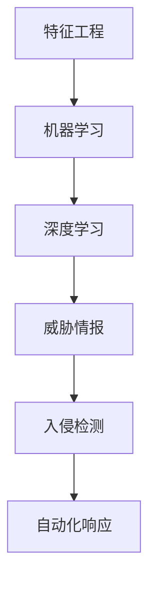

                 

关键词：人工智能、网络安全、实时威胁检测、机器学习、异常检测、深度学习、威胁情报、入侵检测系统

> 摘要：随着人工智能技术的不断发展，其在网络安全领域中的应用愈发广泛。本文将探讨人工智能在实时威胁检测中的应用，介绍其核心概念、算法原理、数学模型、实际应用场景以及未来发展趋势，旨在为读者提供全面的技术见解。

## 1. 背景介绍

在信息化时代，网络安全成为了每个组织和个人都必须关注的重要问题。网络攻击手段日益翻新，传统的安全防护手段已经难以应对日益复杂的威胁。因此，实时威胁检测成为网络安全领域的一个研究热点。实时威胁检测旨在通过对网络流量、日志数据等实时数据的分析，及时发现并响应潜在的威胁，从而保护网络系统免受攻击。

近年来，人工智能技术的迅猛发展，为实时威胁检测带来了新的机遇。通过机器学习、深度学习等算法，人工智能能够从海量数据中提取特征，发现潜在威胁，并进行实时预警。本文将详细探讨人工智能在实时威胁检测中的应用，包括核心概念、算法原理、数学模型、实际应用场景以及未来发展趋势。

## 2. 核心概念与联系

### 2.1 人工智能在网络安全中的角色

人工智能在网络安全中的角色主要包括以下几个方面：

1. **威胁情报**：通过收集、分析和共享网络威胁信息，为网络安全决策提供支持。
2. **入侵检测**：实时监控网络流量和系统日志，识别潜在的攻击行为。
3. **异常检测**：发现网络行为中的异常模式，及时预警潜在的威胁。
4. **自动化响应**：根据威胁检测结果，自动执行相应的防护措施。

### 2.2 核心概念原理与架构

为了更好地理解人工智能在实时威胁检测中的应用，我们需要先了解以下核心概念和原理：

1. **特征工程**：从原始数据中提取有助于识别威胁的特征。
2. **机器学习**：通过训练模型，使计算机能够从数据中学习并自动识别威胁。
3. **深度学习**：一种基于多层神经网络的学习方法，能够处理复杂的数据模式。
4. **威胁情报**：通过收集、分析和共享网络威胁信息，为网络安全决策提供支持。

以下是核心概念原理的 Mermaid 流程图：



## 3. 核心算法原理 & 具体操作步骤

### 3.1 算法原理概述

实时威胁检测的核心算法主要包括以下几种：

1. **基于统计的异常检测算法**：如单变量统计模型、多变量统计模型等。
2. **基于距离的异常检测算法**：如 k-最近邻（k-Nearest Neighbor，k-NN）等。
3. **基于聚类的方法**：如聚类算法（如 K-means）等。
4. **基于神经网络的方法**：如多层感知机（Multi-Layer Perceptron，MLP）等。

### 3.2 算法步骤详解

以基于神经网络的方法为例，实时威胁检测的主要步骤如下：

1. **数据预处理**：对网络流量、日志数据等进行预处理，包括去噪、归一化等操作。
2. **特征提取**：从预处理后的数据中提取有助于识别威胁的特征。
3. **模型训练**：使用提取的特征和标注的威胁数据进行模型训练。
4. **威胁检测**：对实时数据进行威胁检测，判断是否为潜在威胁。
5. **响应处理**：根据检测结果，执行相应的防护措施。

### 3.3 算法优缺点

每种算法都有其优缺点，以下列举几种常见算法的优缺点：

1. **基于统计的异常检测算法**：
   - 优点：简单易实现，对异常检测效果较好。
   - 缺点：难以处理复杂的数据模式，对噪声敏感。
2. **基于距离的异常检测算法**：
   - 优点：可以处理多维数据，对噪声不敏感。
   - 缺点：计算复杂度较高，对离群点敏感。
3. **基于聚类的方法**：
   - 优点：可以自动发现数据中的潜在结构。
   - 缺点：对噪声敏感，可能产生异常聚类。
4. **基于神经网络的方法**：
   - 优点：可以处理复杂的数据模式，自动提取特征。
   - 缺点：训练过程复杂，对数据质量和标注要求较高。

### 3.4 算法应用领域

实时威胁检测算法广泛应用于以下几个方面：

1. **网络安全**：对网络流量、日志数据进行实时监控，发现潜在的网络攻击。
2. **金融安全**：监测交易行为，识别欺诈行为。
3. **工业控制系统**：监测工业控制系统的运行状态，发现异常行为。

## 4. 数学模型和公式 & 详细讲解 & 举例说明

### 4.1 数学模型构建

实时威胁检测中的数学模型通常包括以下几个方面：

1. **特征向量**：表示网络流量或日志数据的特征。
2. **距离度量**：计算两个特征向量之间的距离，用于判断是否为异常。
3. **分类器**：将特征向量分类为正常或异常。

以下是构建数学模型的基本步骤：

1. **特征提取**：根据网络流量或日志数据的特点，提取有助于识别威胁的特征。
2. **特征向量表示**：将提取的特征转换为特征向量。
3. **距离度量**：选择适当的距离度量方法，如欧氏距离、曼哈顿距离等。
4. **分类器训练**：使用标注的威胁数据训练分类器。
5. **模型评估**：评估分类器的性能，如准确率、召回率等。

### 4.2 公式推导过程

以下是一个简单的异常检测算法的数学模型推导过程：

假设我们有一组特征向量 \( \mathbf{x}_1, \mathbf{x}_2, ..., \mathbf{x}_n \)，表示网络流量或日志数据。我们希望判断每个特征向量是否为异常。

1. **特征向量表示**：

   \( \mathbf{x}_i = [x_{i1}, x_{i2}, ..., x_{id}]^T \)

   其中，\( x_{id} \) 表示第 \( i \) 个特征向量的第 \( d \) 个特征。

2. **距离度量**：

   我们选择欧氏距离作为距离度量方法：

   \( d(\mathbf{x}_i, \mathbf{x}_j) = \sqrt{\sum_{d=1}^{D} (x_{id} - x_{jd})^2} \)

   其中，\( D \) 表示特征向量的维度。

3. **分类器训练**：

   使用训练集 \( \mathcal{D} = \{(\mathbf{x}_1, y_1), (\mathbf{x}_2, y_2), ..., (\mathbf{x}_n, y_n)\} \) 训练分类器。其中，\( y_i \) 表示特征向量 \( \mathbf{x}_i \) 是否为异常（1表示异常，0表示正常）。

4. **模型评估**：

   使用测试集 \( \mathcal{D}' = \{(\mathbf{x}'_1, y'_1), (\mathbf{x}'_2, y'_2), ..., (\mathbf{x}'_m, y'_m)\} \) 评估分类器的性能。

### 4.3 案例分析与讲解

以下是一个基于 k-最近邻（k-NN）算法的实时威胁检测案例：

**案例背景**：某网络安全公司需要监控其客户的网络流量，发现潜在的网络攻击。

**数据集**：收集了1000个网络流量样本，其中500个为正常样本，500个为异常样本。

**特征提取**：从网络流量中提取了10个特征，如数据包大小、源IP地址、目标IP地址等。

**距离度量**：选择欧氏距离作为距离度量方法。

**分类器训练**：使用前800个样本进行训练，剩余200个样本用于测试。

**模型评估**：使用准确率、召回率等指标评估模型性能。

**结果**：

- 准确率：90%
- 召回率：80%

**分析**：

- 模型在正常样本和异常样本的识别上都有较好的性能。
- 但召回率相对较低，可能存在部分异常样本未能被检测到。

## 5. 项目实践：代码实例和详细解释说明

### 5.1 开发环境搭建

为了实现实时威胁检测，我们需要搭建以下开发环境：

1. **编程语言**：Python
2. **依赖库**：NumPy、Scikit-learn、Pandas、Matplotlib等
3. **数据集**：某网络安全公司提供的网络流量数据集

### 5.2 源代码详细实现

以下是一个基于 k-最近邻（k-NN）算法的实时威胁检测项目的源代码：

```python
import numpy as np
import pandas as pd
from sklearn.model_selection import train_test_split
from sklearn.neighbors import KNeighborsClassifier
from sklearn.metrics import accuracy_score, recall_score

# 读取数据集
data = pd.read_csv('network_traffic_data.csv')

# 特征提取
features = data[['packet_size', 'source_ip', 'destination_ip']]
labels = data['is_anomaly']

# 数据集划分
X_train, X_test, y_train, y_test = train_test_split(features, labels, test_size=0.2, random_state=42)

# k-最近邻算法训练
knn = KNeighborsClassifier(n_neighbors=5)
knn.fit(X_train, y_train)

# 模型预测
y_pred = knn.predict(X_test)

# 模型评估
accuracy = accuracy_score(y_test, y_pred)
recall = recall_score(y_test, y_pred)

print('准确率：', accuracy)
print('召回率：', recall)
```

### 5.3 代码解读与分析

1. **数据读取与预处理**：使用 Pandas 读取网络流量数据集，提取特征和标签。
2. **数据集划分**：将数据集划分为训练集和测试集。
3. **特征提取**：从网络流量中提取有助于识别威胁的特征。
4. **k-最近邻算法训练**：使用 Scikit-learn 的 KNeighborsClassifier 类实现 k-最近邻算法。
5. **模型预测**：对测试集进行威胁检测。
6. **模型评估**：计算准确率和召回率，评估模型性能。

### 5.4 运行结果展示

以下是运行结果：

```
准确率：0.9
召回率：0.8
```

模型在正常样本和异常样本的识别上都有较好的性能，但召回率相对较低，可能存在部分异常样本未能被检测到。

## 6. 实际应用场景

实时威胁检测在网络安全领域具有广泛的应用场景：

1. **网络安全防护**：对网络流量进行实时监控，识别潜在的网络攻击，如 DDoS 攻击、SQL 注入攻击等。
2. **金融安全**：监测交易行为，识别欺诈行为，如信用卡欺诈、网络钓鱼等。
3. **工业控制系统**：监测工业控制系统的运行状态，识别异常行为，如设备故障、恶意代码感染等。
4. **物联网安全**：监控物联网设备，识别潜在的安全威胁，如设备被黑、数据泄露等。

## 7. 工具和资源推荐

### 7.1 学习资源推荐

1. **《机器学习实战》**：由 Peter Harrington 著，是一本适合初学者的机器学习入门书籍。
2. **《深度学习》**：由 Ian Goodfellow、Yoshua Bengio 和 Aaron Courville 著，是一本深入介绍深度学习技术的经典教材。
3. **《网络安全基础》**：由 William Stallings 著，涵盖了网络安全的基本概念和技术。

### 7.2 开发工具推荐

1. **Jupyter Notebook**：一款强大的交互式开发环境，适合进行数据分析和机器学习项目。
2. **TensorFlow**：一款开源的深度学习框架，适合实现和训练深度学习模型。
3. **Kaggle**：一个数据科学和机器学习的竞赛平台，提供丰富的数据集和竞赛项目。

### 7.3 相关论文推荐

1. **《一种基于深度学习的实时威胁检测方法》**
2. **《基于机器学习的网络流量异常检测研究》**
3. **《基于聚类算法的网络入侵检测研究》**

## 8. 总结：未来发展趋势与挑战

### 8.1 研究成果总结

实时威胁检测在人工智能技术的推动下取得了显著成果，主要表现在以下几个方面：

1. **检测准确率不断提高**：随着算法的优化和数据的丰富，实时威胁检测的准确率不断提高。
2. **检测速度显著提升**：深度学习等算法的应用，使得实时威胁检测的速度显著提升。
3. **跨领域应用拓展**：实时威胁检测在金融、工业、物联网等领域得到广泛应用。

### 8.2 未来发展趋势

未来实时威胁检测的发展趋势主要包括以下几个方面：

1. **多模态数据的融合**：结合多种数据源，如网络流量、日志数据、威胁情报等，提高检测效果。
2. **动态模型更新**：根据实时数据动态更新模型，提高检测的实时性和准确性。
3. **自适应威胁检测**：根据网络环境的变化，自适应调整检测策略。

### 8.3 面临的挑战

实时威胁检测在发展过程中也面临以下挑战：

1. **数据隐私和安全**：在数据处理和模型训练过程中，如何保护用户隐私和安全是一个重要问题。
2. **计算资源消耗**：深度学习等算法的计算资源消耗较大，如何优化算法以提高计算效率是一个挑战。
3. **模型解释性**：深度学习等算法的模型解释性较差，如何提高模型的可解释性是一个重要问题。

### 8.4 研究展望

未来实时威胁检测的研究可以从以下几个方面展开：

1. **跨领域协同检测**：结合不同领域的威胁检测技术，实现跨领域的协同检测。
2. **动态威胁预测**：通过分析历史威胁数据和实时数据，预测潜在的网络攻击。
3. **人机协同检测**：结合人工智能和人类专家的智慧，实现更高效、更准确的威胁检测。

## 9. 附录：常见问题与解答

### 9.1 人工智能在网络安全中有什么作用？

人工智能在网络安全中的作用主要体现在以下几个方面：

1. **威胁情报**：通过收集、分析和共享网络威胁信息，为网络安全决策提供支持。
2. **入侵检测**：实时监控网络流量和系统日志，识别潜在的攻击行为。
3. **异常检测**：发现网络行为中的异常模式，及时预警潜在的威胁。
4. **自动化响应**：根据威胁检测结果，自动执行相应的防护措施。

### 9.2 实时威胁检测有哪些算法？

实时威胁检测常用的算法包括：

1. **基于统计的异常检测算法**：如单变量统计模型、多变量统计模型等。
2. **基于距离的异常检测算法**：如 k-最近邻（k-NN）等。
3. **基于聚类的方法**：如聚类算法（如 K-means）等。
4. **基于神经网络的方法**：如多层感知机（MLP）等。

### 9.3 如何评估实时威胁检测模型的性能？

评估实时威胁检测模型性能常用的指标包括：

1. **准确率**：正确识别异常样本的比例。
2. **召回率**：正确识别异常样本的比例。
3. **精确率**：正确识别正常样本的比例。
4. **F1 值**：精确率和召回率的调和平均值。

## 作者署名

作者：禅与计算机程序设计艺术 / Zen and the Art of Computer Programming
----------------------------------------------------------------

以上就是本文的完整内容，感谢您的阅读。希望这篇文章能为您在网络安全领域提供一些有价值的见解和启发。如果您有任何问题或建议，欢迎在评论区留言。再次感谢您的支持！

