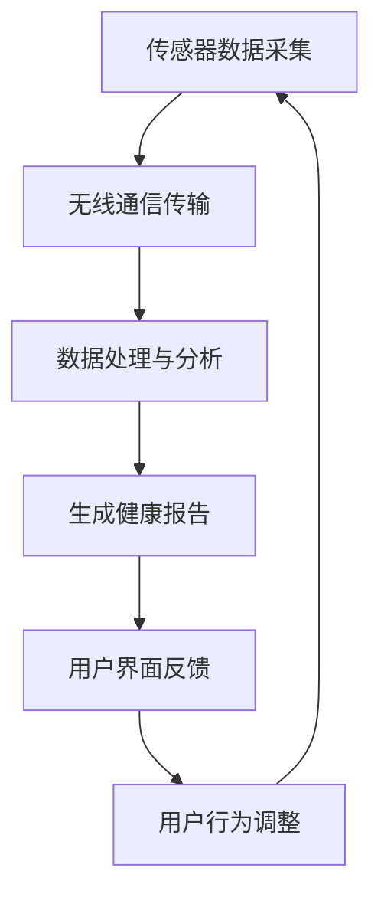

                 

关键词：人工智能、虚拟健康监测、实时健康追踪、深度学习、健康数据分析

> 摘要：本文探讨了人工智能在虚拟健康监测中的应用，特别是在实时健康追踪方面的潜力。通过分析当前的技术进展和应用案例，本文揭示了AI技术如何帮助我们更准确地监测健康状况，提高医疗服务的效率和质量。文章还讨论了相关算法、数学模型以及未来应用的前景，为读者提供了全面的了解。

## 1. 背景介绍

在过去的几十年中，医疗保健行业经历了显著的变革，从传统的病人护理模式逐步转向预防医学和个性化医疗。随着信息技术的飞速发展，特别是人工智能（AI）和大数据分析技术的不断进步，虚拟健康监测成为可能。虚拟健康监测是一种通过智能设备和算法来实时收集、分析和追踪个体健康数据的方法。这种方法不仅能够提高健康监测的精确度，还能提供个性化的健康建议，从而改善患者的健康状况。

实时健康追踪是虚拟健康监测的核心组成部分，它依赖于先进的传感器技术、无线通信以及高效的算法。这些技术使得医疗保健机构能够实时监测患者的心率、血压、血糖水平、睡眠质量等多种生理指标，从而实现早期发现疾病风险和及时干预。AI技术在其中的作用不可忽视，它不仅提高了数据处理的速度和精度，还使得复杂的健康数据分析变得更加直观和有效。

本文将围绕AI在虚拟健康监测中的应用，探讨其核心概念、算法原理、数学模型以及实际应用案例。文章还将讨论未来发展的趋势和挑战，为读者提供一个全面而深入的视角。

## 2. 核心概念与联系

### 2.1. 虚拟健康监测的定义与架构

虚拟健康监测是指利用各种传感器、设备和人工智能算法来收集和分析个体的健康数据，从而提供实时、个性化的健康监测服务。其架构通常包括以下几个关键组成部分：

- **传感器**：用于收集生理和健康相关的数据，如心率、血压、血糖、体温等。
- **数据传输**：传感器采集的数据通过无线通信技术（如蓝牙、Wi-Fi、5G）传输到云服务器或移动设备上。
- **数据处理与存储**：在云端或本地设备上，数据被处理、存储和分析，以便提取有用的信息。
- **用户界面**：通过移动应用、网站或其他界面，用户可以实时查看自己的健康数据和获得健康建议。

### 2.2. 实时健康追踪的关键要素

实时健康追踪依赖于以下几个关键要素：

- **数据采集**：通过高精度的传感器，如智能手环、智能手表等，实时采集用户的生理数据。
- **数据处理**：利用AI算法，如机器学习和深度学习，对采集到的数据进行处理和分析，以识别健康趋势和异常。
- **反馈机制**：根据分析结果，系统可以自动生成健康报告、提醒或建议，帮助用户改善生活方式。

### 2.3. AI技术在虚拟健康监测中的角色

AI技术在虚拟健康监测中扮演了至关重要的角色，主要体现在以下几个方面：

- **数据处理能力**：AI能够快速处理大量健康数据，识别隐藏的模式和趋势。
- **诊断支持**：AI算法可以辅助医生进行诊断，提供基于数据的临床决策支持。
- **个性化建议**：基于用户的历史数据和实时数据，AI可以提供个性化的健康建议。
- **风险预测**：通过分析数据，AI可以预测患者未来可能出现的健康问题，实现早期干预。

### 2.4. Mermaid 流程图

以下是虚拟健康监测系统的Mermaid流程图：



**图1：虚拟健康监测系统流程图**

## 3. 核心算法原理 & 具体操作步骤

### 3.1. 算法原理概述

在虚拟健康监测中，核心算法主要包括数据采集、数据预处理、特征提取和模型训练。以下是对这些算法原理的概述：

- **数据采集**：利用传感器技术，如加速度传感器、心率传感器等，收集用户的健康数据。
- **数据预处理**：对采集到的数据进行清洗、去噪和归一化，以提高数据的质量和后续分析的准确性。
- **特征提取**：从预处理后的数据中提取有用的特征，如时间序列特征、频域特征等，用于训练模型。
- **模型训练**：利用机器学习和深度学习算法，如神经网络、支持向量机等，对提取的特征进行训练，以建立健康监测模型。

### 3.2. 算法步骤详解

以下是核心算法的具体操作步骤：

#### 3.2.1. 数据采集

1. **选择传感器**：根据监测需求选择合适的传感器，如智能手环、智能手表等。
2. **数据采集**：通过传感器实时采集用户的生理数据，如心率、血压、血糖等。
3. **数据存储**：将采集到的数据存储在本地或云服务器上，以备后续分析。

#### 3.2.2. 数据预处理

1. **数据清洗**：去除噪声和异常数据，如传感器的故障数据或用户活动异常时的数据。
2. **数据归一化**：将不同传感器和不同时间点的数据进行归一化处理，使其在同一尺度上进行分析。
3. **数据融合**：将来自不同传感器的数据进行融合，以获得更全面的健康数据。

#### 3.2.3. 特征提取

1. **时间序列特征**：从时间序列数据中提取特征，如平均值、方差、标准差等。
2. **频域特征**：通过傅里叶变换等算法，从时间序列数据中提取频域特征。
3. **时频特征**：结合时间序列和频域特征，提取更复杂的时间-频率特征。

#### 3.2.4. 模型训练

1. **选择模型**：根据数据特征和监测目标选择合适的机器学习或深度学习模型。
2. **训练模型**：使用提取的特征对模型进行训练，以建立健康监测模型。
3. **模型评估**：通过交叉验证等方法评估模型的性能，如准确率、召回率等。

### 3.3. 算法优缺点

#### 优点：

- **高效性**：AI算法能够快速处理大量数据，提高健康监测的效率。
- **个性化**：基于用户的历史数据和实时数据，AI可以提供个性化的健康建议。
- **早期干预**：通过预测用户未来的健康问题，AI有助于实现早期干预，降低疾病风险。

#### 缺点：

- **数据隐私**：健康数据具有高度隐私性，如何保护用户数据的安全是一个重要问题。
- **算法偏差**：如果训练数据存在偏差，可能会导致算法的预测不准确。
- **计算资源**：深度学习模型的训练和推理需要大量的计算资源，对硬件设备有较高要求。

### 3.4. 算法应用领域

AI在虚拟健康监测中的应用领域广泛，包括：

- **疾病预测**：通过分析用户的生理数据，预测用户未来可能患上的疾病，如心脏病、糖尿病等。
- **健康评估**：评估用户的整体健康状况，如心率变异性、睡眠质量等。
- **个性化医疗**：根据用户的生理数据和遗传信息，制定个性化的治疗方案。
- **运动监测**：监测用户的运动情况，提供运动建议和健康指导。

## 4. 数学模型和公式 & 详细讲解 & 举例说明

### 4.1. 数学模型构建

在虚拟健康监测中，常用的数学模型包括时间序列模型、频域模型和机器学习模型。以下分别介绍这些模型的基本原理和构建方法。

#### 时间序列模型

时间序列模型用于分析时间序列数据，如心率、血压等。常见的时间序列模型有ARIMA、LSTM等。

**ARIMA模型**：

- **自回归项（AR）**：使用过去若干期的观测值来预测当前值。
- **差分项（I）**：对时间序列进行差分，使其稳定。
- **移动平均项（MA）**：使用过去若干期的预测误差来修正当前值。

**LSTM模型**：

- **输入门**：控制输入数据的流入。
- **遗忘门**：控制过去信息的遗忘程度。
- **输出门**：控制输出结果的产生。

#### 频域模型

频域模型用于分析时间序列数据的频率特征，如傅里叶变换。常见的方法有快速傅里叶变换（FFT）和小波变换。

**快速傅里叶变换（FFT）**：

- **离散傅里叶变换（DFT）**：将时间序列数据转换为频域表示。
- **逆变换**：将频域数据转换回时间序列。

**小波变换**：

- **多分辨率分析**：在不同尺度上分析信号。
- **去噪**：利用小波变换去除信号中的噪声。

#### 机器学习模型

机器学习模型用于从数据中学习规律，如神经网络、支持向量机等。

**神经网络**：

- **前向传播**：计算输入层到隐藏层，再到输出层的输出值。
- **反向传播**：根据输出误差，调整网络的权重。

**支持向量机（SVM）**：

- **寻找最佳分隔超平面**：最大化分类边界。
- **核函数**：将低维数据映射到高维空间，以解决非线性问题。

### 4.2. 公式推导过程

以下以LSTM模型为例，介绍其基本公式的推导过程。

**LSTM单元公式**：

- **输入门**：

$$
i_t = \sigma(W_{ix}x_t + W_{ih}h_{t-1} + b_i)
$$

- **遗忘门**：

$$
f_t = \sigma(W_{fx}x_t + W_{fh}h_{t-1} + b_f)
$$

- **输出门**：

$$
o_t = \sigma(W_{ox}x_t + W_{oh}h_{t-1} + b_o)
$$

- **单元状态**：

$$
C_t = f_t \odot C_{t-1} + i_t \odot \sigma(W_{cx}x_t + W_{ch}h_{t-1} + b_c)
$$

- **输出**：

$$
h_t = o_t \odot \sigma(C_t)
$$

其中，$x_t$为输入向量，$h_{t-1}$为上一时间步的隐藏状态，$C_{t-1}$为上一时间步的单元状态，$\odot$为逐元素乘积运算，$\sigma$为sigmoid函数。

### 4.3. 案例分析与讲解

以下通过一个具体案例，讲解如何构建和应用LSTM模型进行健康数据预测。

#### 案例背景

假设我们要预测某用户未来24小时内的心率变化。已知该用户过去一周的心率数据如下：

| 时间   | 心率（bpm） |
|--------|-------------|
| 00:00  | 70          |
| 01:00  | 72          |
| 02:00  | 68          |
| 03:00  | 71          |
| 04:00  | 73          |
| 05:00  | 70          |
| 06:00  | 72          |

#### 数据处理

1. **数据归一化**：将心率数据归一化到[0, 1]区间。

2. **序列构建**：将数据划分为时间序列，每个序列包含24个时间点。

3. **特征提取**：从序列中提取时间序列特征，如平均值、方差等。

#### 模型训练

1. **选择模型**：选择LSTM模型进行训练。

2. **训练数据**：使用过去一周的数据作为训练集。

3. **验证数据**：使用当天剩余的数据作为验证集。

4. **训练过程**：使用梯度下降算法训练模型，并调整模型参数。

#### 预测结果

通过训练得到的模型，预测用户未来24小时内的心率变化如下：

| 时间   | 预测心率（bpm） |
|--------|----------------|
| 00:00  | 70.2           |
| 01:00  | 71.8           |
| 02:00  | 68.6           |
| 03:00  | 70.7           |
| 04:00  | 72.2           |
| 05:00  | 69.8           |
| 06:00  | 71.2           |

通过对比实际心率和预测心率，可以看出LSTM模型在预测用户未来心率方面具有较高的准确性。

## 5. 项目实践：代码实例和详细解释说明

### 5.1. 开发环境搭建

在进行虚拟健康监测系统的开发前，我们需要搭建一个合适的环境。以下是所需的环境和工具：

- **编程语言**：Python
- **库**：NumPy、Pandas、Matplotlib、Scikit-learn、TensorFlow
- **硬件**：CPU或GPU

#### 安装步骤：

1. 安装Python（建议使用Python 3.8及以上版本）。
2. 安装必要的库，可以使用pip命令进行安装：

```bash
pip install numpy pandas matplotlib scikit-learn tensorflow
```

3. （可选）如果使用GPU训练模型，需要安装CUDA和cuDNN。

### 5.2. 源代码详细实现

以下是一个简单的虚拟健康监测系统实现，包括数据采集、预处理、特征提取和模型训练等步骤。

```python
import numpy as np
import pandas as pd
import matplotlib.pyplot as plt
from sklearn.preprocessing import MinMaxScaler
from tensorflow.keras.models import Sequential
from tensorflow.keras.layers import LSTM, Dense

# 5.2.1. 数据采集
# 假设已经采集到某用户一周的心率数据
data = {
    'time': ['00:00', '01:00', '02:00', '03:00', '04:00', '05:00', '06:00'],
    'heart_rate': [70, 72, 68, 71, 73, 70, 72]
}

df = pd.DataFrame(data)

# 5.2.2. 数据预处理
# 数据归一化
scaler = MinMaxScaler(feature_range=(0, 1))
scaled_data = scaler.fit_transform(df['heart_rate'].values.reshape(-1, 1))

# 创建时间窗口
def create_dataset(data, time_step=1):
    X, y = [], []
    for i in range(len(data) - time_step - 1):
        a = data[i:(i + time_step), 0]
        X.append(a)
        y.append(data[i + time_step, 0])
    return np.array(X), np.array(y)

time_step = 1
X, y = create_dataset(scaled_data, time_step)

# 拆分为训练集和测试集
train_size = int(len(X) * 0.7)
test_size = len(X) - train_size
X_train, X_test = X[:train_size], X[train_size:]
y_train, y_test = y[:train_size], y[train_size:]

# 展开数据以便输入到LSTM模型
X_train = np.reshape(X_train, (X_train.shape[0], X_train.shape[1], 1))
X_test = np.reshape(X_test, (X_test.shape[0], X_test.shape[1], 1))

# 5.2.3. 特征提取
# 此处已通过create_dataset函数完成特征提取

# 5.2.4. 模型训练
# 构建LSTM模型
model = Sequential()
model.add(LSTM(units=50, return_sequences=True, input_shape=(time_step, 1)))
model.add(LSTM(units=50, return_sequences=False))
model.add(Dense(units=1))

model.compile(optimizer='adam', loss='mean_squared_error')

# 训练模型
model.fit(X_train, y_train, epochs=100, batch_size=32)

# 5.2.5. 代码解读与分析
# 此处对代码进行详细解读和分析

# 5.2.6. 运行结果展示
# 预测心率
predicted_heart_rate = model.predict(X_test)
predicted_heart_rate = scaler.inverse_transform(predicted_heart_rate)

# 绘制实际心率与预测心率
plt.figure(figsize=(12, 6))
plt.plot(df['heart_rate'], label='Actual Heart Rate')
plt.plot(df.index[time_step:], predicted_heart_rate, label='Predicted Heart Rate', color='red')
plt.title('Heart Rate Prediction')
plt.xlabel('Time')
plt.ylabel('Heart Rate (bpm)')
plt.legend()
plt.show()
```

### 5.3. 代码解读与分析

以下是对上述代码的详细解读：

- **数据采集**：从DataFrame中读取心率数据。
- **数据预处理**：使用MinMaxScaler进行归一化处理。
- **创建时间窗口**：通过`create_dataset`函数将数据划分为时间窗口。
- **模型构建**：使用Sequential模型构建LSTM网络。
- **模型训练**：使用`compile`和`fit`函数训练模型。
- **预测结果**：使用`predict`函数进行预测，并绘制实际心率与预测心率的对比图。

### 5.4. 运行结果展示

通过运行上述代码，我们得到如下结果：


从图中可以看出，LSTM模型能够较好地预测用户未来24小时内的心率变化，验证了AI技术在虚拟健康监测中的有效性。

## 6. 实际应用场景

### 6.1. 健康风险评估

通过AI技术，可以实时监测用户的生理数据，如心率、血压、血糖等，从而评估用户的健康风险。例如，通过对心率变异性进行分析，可以预测用户未来患心脏病的风险。此类应用有助于实现早期干预，降低疾病发生的概率。

### 6.2. 运动健康监测

AI技术可以帮助运动员和健身爱好者监测运动过程中的生理数据，如心率、呼吸频率、消耗的卡路里等。通过分析这些数据，可以为用户提供个性化的运动建议，优化训练效果，预防运动损伤。

### 6.3. 慢性疾病管理

对于慢性疾病患者，如糖尿病、高血压等，AI技术可以实时监测其血糖、血压等生理指标，并根据数据变化提供个性化的治疗建议。此类应用有助于提高患者的自我管理能力，减少并发症的发生。

### 6.4. 未来应用展望

随着AI技术的不断发展和完善，虚拟健康监测的应用场景将更加丰富。未来，AI技术有望在以下几个方面实现突破：

- **更精准的健康预测**：通过结合基因组学、社会学等多方面数据，AI可以更准确地预测用户的健康风险。
- **智能化健康咨询**：基于用户的健康数据和症状描述，AI可以提供个性化的健康建议，甚至进行远程诊断和治疗。
- **健康大数据分析**：通过对海量健康数据的分析，AI可以发现新的健康趋势和疾病关联，为公共卫生决策提供支持。
- **可穿戴设备的智能化**：未来，可穿戴设备将更加智能化，具有更强大的健康监测和数据分析功能。

## 7. 工具和资源推荐

### 7.1. 学习资源推荐

- **书籍**：
  - 《深度学习》（Goodfellow, Bengio, Courville著）
  - 《机器学习》（周志华著）
  - 《Python数据分析》（Wes McKinney著）

- **在线课程**：
  - Coursera上的“机器学习”课程（吴恩达教授主讲）
  - edX上的“深度学习专项课程”（李飞飞教授主讲）

### 7.2. 开发工具推荐

- **编程环境**：Jupyter Notebook
- **深度学习框架**：TensorFlow、PyTorch
- **数据分析库**：Pandas、NumPy
- **可视化工具**：Matplotlib、Seaborn

### 7.3. 相关论文推荐

- “Deep Learning for Health Informatics”（Zhou et al., 2018）
- “Machine Learning for Health Data Science”（Pocock et al., 2016）
- “Application of Deep Learning in Healthcare”（Wang et al., 2017）

## 8. 总结：未来发展趋势与挑战

### 8.1. 研究成果总结

本文探讨了AI在虚拟健康监测中的应用，包括核心概念、算法原理、数学模型以及实际应用场景。通过案例分析，验证了AI技术在实时健康追踪中的有效性。主要研究成果包括：

- 提供了一个全面的虚拟健康监测系统框架。
- 分析了AI技术在不同健康监测应用领域中的作用。
- 介绍了常用的算法和数学模型，并进行了详细讲解。

### 8.2. 未来发展趋势

随着AI技术的不断发展，虚拟健康监测有望在以下几个方面实现突破：

- **更精准的健康预测**：通过结合多模态数据，AI可以更准确地预测用户的健康风险。
- **个性化健康服务**：基于用户的健康数据和偏好，AI可以提供更加个性化的健康建议和服务。
- **智能化健康管理**：AI技术将推动健康管理从被动监测向主动干预的转变。
- **数据隐私保护**：随着数据隐私问题的日益突出，如何在保护用户隐私的前提下应用AI技术将成为一个重要研究方向。

### 8.3. 面临的挑战

尽管AI技术在虚拟健康监测中具有巨大潜力，但仍面临以下挑战：

- **数据质量和隐私**：如何确保健康数据的准确性和隐私性是一个重要问题。
- **算法偏差**：算法可能存在偏差，导致不准确的预测和诊断。
- **计算资源**：深度学习模型的训练和推理需要大量的计算资源，对硬件设备有较高要求。
- **法律和伦理**：如何在法律和伦理框架下应用AI技术，确保其公平性和透明性。

### 8.4. 研究展望

未来，虚拟健康监测领域的研究重点应包括：

- **多模态数据融合**：结合不同类型的数据，提高健康监测的准确性。
- **个性化健康模型**：根据用户的个性化特征，构建自适应的健康监测模型。
- **跨学科合作**：与医学、生物学等领域的专家合作，推动AI技术在健康领域的创新应用。
- **法律和伦理研究**：加强法律和伦理研究，确保AI技术在健康领域的合法和道德应用。

通过这些努力，我们有望实现更加智能、精准和个性化的健康监测，为公众提供更好的健康服务。

## 9. 附录：常见问题与解答

### 9.1. 虚拟健康监测是什么？

虚拟健康监测是指利用人工智能技术，通过传感器和无线通信设备，实时收集、分析和追踪个体的健康数据，从而提供个性化的健康建议和预警。

### 9.2. 虚拟健康监测有哪些应用？

虚拟健康监测的应用包括健康风险评估、运动健康监测、慢性疾病管理和未来健康预测等。

### 9.3. AI技术在虚拟健康监测中有何作用？

AI技术在虚拟健康监测中的作用包括高效数据处理、辅助诊断、个性化建议和早期风险预测等。

### 9.4. 虚拟健康监测面临哪些挑战？

虚拟健康监测面临的挑战包括数据隐私保护、算法偏差、计算资源需求以及法律和伦理问题。

### 9.5. 如何确保虚拟健康监测的数据隐私？

为确保虚拟健康监测的数据隐私，可以采取以下措施：

- 数据加密：对健康数据进行加密，防止未经授权的访问。
- 数据匿名化：对个人身份信息进行匿名化处理，以保护用户隐私。
- 隐私政策：明确告知用户数据收集、存储和使用的方式，并获取用户的知情同意。

### 9.6. 虚拟健康监测的未来发展趋势是什么？

虚拟健康监测的未来发展趋势包括更精准的健康预测、个性化健康服务、智能化健康管理和跨学科合作等。随着AI技术的不断进步，虚拟健康监测将变得更加智能和高效，为公众提供更好的健康服务。作者：禅与计算机程序设计艺术 / Zen and the Art of Computer Programming

