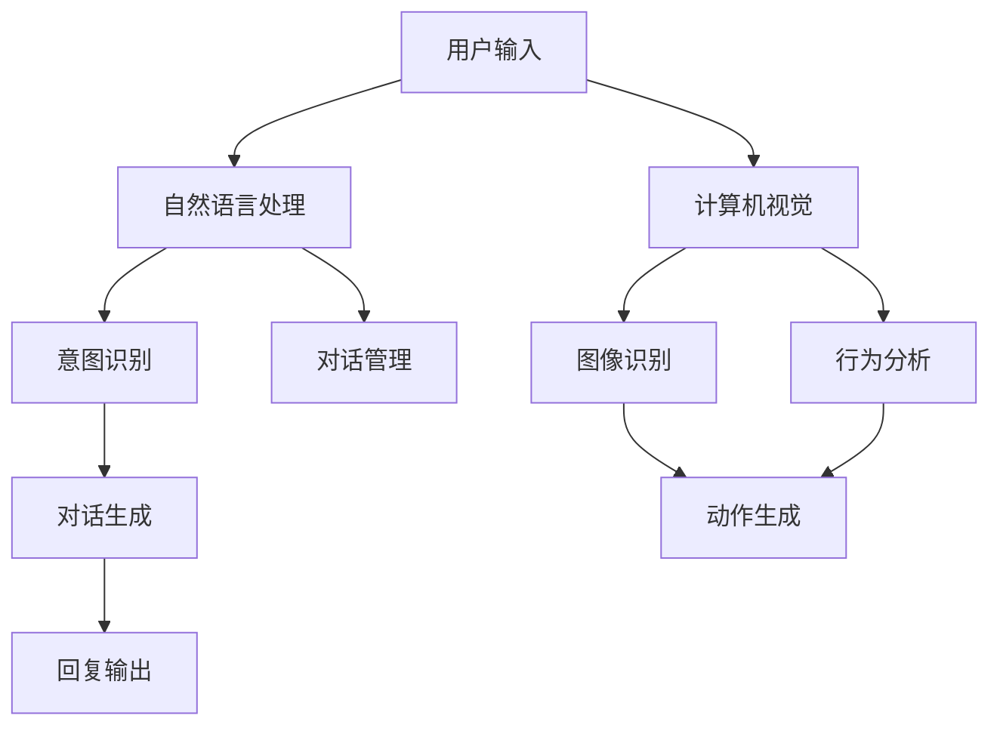

                 

关键词：人工智能、虚拟宠物、陪伴、情感交互、技术实现、应用前景

> 摘要：本文将探讨人工智能在虚拟宠物中的应用，特别是在提供陪伴方面的技术实现。通过介绍虚拟宠物的背景、人工智能的核心概念及其与虚拟宠物的联系，本文将深入分析人工智能在虚拟宠物陪伴中的作用，探讨其技术实现和优缺点，并预测其未来应用场景和发展趋势。此外，还将推荐相关学习资源、开发工具和论文，帮助读者进一步了解这一领域。

## 1. 背景介绍

### 虚拟宠物的兴起

虚拟宠物是近年来迅速兴起的一种新兴娱乐方式，它们以电子形象的形式提供用户与虚拟生物互动的体验。虚拟宠物通常具有独特的个性和行为模式，能够通过声音、动作和表情与用户进行沟通。这种互动性使得虚拟宠物不仅成为休闲娱乐的伴侣，也在一定程度上满足了人们对于陪伴的需求。

### 人工智能的发展

人工智能（AI）作为计算机科学的一个分支，致力于模拟、延伸和扩展人类的智能。从最初的专家系统到深度学习，再到自然语言处理和计算机视觉，人工智能的发展已经取得了巨大的进步。如今，AI技术被广泛应用于各种领域，包括医疗、金融、教育和娱乐等。其中，情感交互和陪伴是人工智能研究的重要方向之一。

## 2. 核心概念与联系

### 核心概念原理

#### 人工智能

人工智能（AI）的核心目标是让计算机模拟人类的智能行为，包括学习、推理、规划、感知和理解自然语言等。在虚拟宠物陪伴中，人工智能主要涉及以下几个方面：

- **自然语言处理（NLP）**：通过理解用户的语言输入，虚拟宠物可以回答问题、进行对话，甚至识别用户的情感状态。
- **计算机视觉**：虚拟宠物可以“看”到周围的环境，并通过图像识别技术来理解用户的动作和表情。
- **机器学习**：利用大量的数据，通过机器学习算法训练模型，使虚拟宠物能够更好地适应用户的行为和需求。

#### 虚拟宠物

虚拟宠物是一种数字化的生物形象，通常具有以下特点：

- **个性化**：虚拟宠物可以根据用户的需求进行定制，包括外观、声音、行为等。
- **互动性**：虚拟宠物能够与用户进行实时互动，包括语音、文本和动作等。
- **情感化**：虚拟宠物可以通过模拟情感反应来增加与用户的情感联系。

### 架构

下面是虚拟宠物中人工智能架构的Mermaid流程图：



### 技术实现

虚拟宠物中的AI技术实现包括以下几个关键步骤：

1. **数据收集**：收集用户的历史数据，包括语音、文本和图像等。
2. **模型训练**：利用机器学习和深度学习算法训练模型，使其能够理解用户的意图和行为。
3. **实时交互**：通过自然语言处理和计算机视觉技术，实现虚拟宠物与用户的实时互动。
4. **反馈优化**：根据用户反馈调整模型参数，提高虚拟宠物的陪伴质量。

### 优缺点

#### 优点

- **高效陪伴**：虚拟宠物可以全天候陪伴用户，满足用户对实时互动的需求。
- **个性化体验**：通过个性化设置，虚拟宠物能够提供更加贴近用户需求的陪伴体验。
- **情感交互**：虚拟宠物可以通过情感反应增加与用户的情感联系，提供更深层次的陪伴。

#### 缺点

- **技术局限**：目前的人工智能技术还无法完全模拟人类的情感和行为，存在一定的局限性。
- **隐私问题**：虚拟宠物收集和利用用户数据可能引发隐私问题，需要严格保护用户隐私。
- **依赖性**：长期依赖虚拟宠物陪伴可能导致用户现实生活中的社交能力下降。

### 应用领域

虚拟宠物中的AI技术可以应用于多个领域，包括但不限于：

- **心理健康**：为孤独症和抑郁症患者提供陪伴和支持。
- **教育**：辅助教育者进行个性化教学，提高学生的学习效果。
- **娱乐**：为用户提供娱乐互动，缓解生活压力。

## 3. 核心算法原理 & 具体操作步骤

### 3.1 算法原理概述

虚拟宠物中的核心算法主要包括自然语言处理、计算机视觉和机器学习。下面将分别介绍这些算法的原理。

#### 自然语言处理（NLP）

自然语言处理是一种让计算机理解和生成人类语言的技术。在虚拟宠物中，NLP主要用于处理用户的语音和文本输入，包括：

- **分词**：将文本分解为单词或短语。
- **词性标注**：识别文本中每个单词的词性，如名词、动词等。
- **句法分析**：分析句子的结构，理解句子的意思。
- **情感分析**：识别文本中的情感倾向，如正面、负面等。

#### 计算机视觉

计算机视觉是一种让计算机理解图像和视频的技术。在虚拟宠物中，计算机视觉主要用于分析用户的动作和表情，包括：

- **图像识别**：识别图像中的物体和场景。
- **人脸识别**：识别图像中的人脸，并进行面部表情分析。
- **动作识别**：识别用户在视频中的动作。

#### 机器学习

机器学习是一种让计算机通过数据自动改进性能的技术。在虚拟宠物中，机器学习主要用于训练模型，包括：

- **监督学习**：利用标注数据进行模型训练。
- **无监督学习**：在没有标注数据的情况下，通过数据自身的特征进行模型训练。
- **强化学习**：通过奖励和惩罚机制，让模型在互动中不断优化。

### 3.2 算法步骤详解

#### 自然语言处理

1. **语音识别**：将用户的语音转换为文本。
2. **文本预处理**：对文本进行分词、词性标注等处理。
3. **意图识别**：根据预处理后的文本，识别用户的意图。
4. **对话生成**：根据用户的意图，生成适当的回复文本。

#### 计算机视觉

1. **图像采集**：从摄像头或视频流中采集图像。
2. **图像预处理**：对图像进行灰度化、去噪等处理。
3. **图像识别**：识别图像中的物体和场景。
4. **行为分析**：根据图像识别结果，分析用户的行为。

#### 机器学习

1. **数据收集**：收集用户的历史数据，包括语音、文本和图像。
2. **特征提取**：从数据中提取特征，如文本的词向量、图像的特征点等。
3. **模型训练**：利用机器学习算法训练模型。
4. **模型评估**：评估模型的性能，并进行优化。

### 3.3 算法优缺点

#### 自然语言处理

- **优点**：能够处理多样化的语言输入，实现自然的人机交互。
- **缺点**：在理解复杂语境和情感方面存在一定局限。

#### 计算机视觉

- **优点**：能够实时捕捉用户的行为和表情，提供丰富的交互体验。
- **缺点**：在光线不足或图像质量较差的情况下，识别效果可能受到影响。

#### 机器学习

- **优点**：能够通过数据自动改进性能，提高陪伴质量。
- **缺点**：对大量数据进行训练，计算资源消耗较大。

### 3.4 算法应用领域

- **心理健康**：利用自然语言处理和计算机视觉技术，为用户提供情感支持和行为分析。
- **教育**：利用自然语言处理和机器学习技术，进行个性化教学和学生学习效果分析。
- **娱乐**：利用计算机视觉和机器学习技术，为用户提供丰富的娱乐互动体验。

## 4. 数学模型和公式 & 详细讲解 & 举例说明

### 4.1 数学模型构建

在虚拟宠物中，数学模型主要用于描述和预测用户行为。下面是几个常见的数学模型：

#### 1. 回归模型

回归模型用于预测用户的行为，如用户在某个时间点的情绪状态。假设我们有一个自变量 \( x \) 和因变量 \( y \)，则回归模型可以表示为：

$$
y = \beta_0 + \beta_1 x + \epsilon
$$

其中，\( \beta_0 \) 和 \( \beta_1 \) 是模型的参数，\( \epsilon \) 是误差项。

#### 2. 神经网络模型

神经网络模型用于模拟用户的情绪和行为，如用户在某个时间点的情绪状态。假设我们有一个输入层、一个隐藏层和一个输出层，则神经网络模型可以表示为：

$$
\text{输出} = \sigma(\text{权重} \cdot \text{输入} + \text{偏置})
$$

其中，\( \sigma \) 是激活函数，\( \text{权重} \) 和 \( \text{偏置} \) 是模型的参数。

#### 3. 贝叶斯模型

贝叶斯模型用于预测用户的行为，如用户在某个时间点的情绪状态。假设我们有一个先验分布和似然函数，则贝叶斯模型可以表示为：

$$
P(\text{行为}|\text{观察}) = \frac{P(\text{观察}|\text{行为})P(\text{行为})}{P(\text{观察})}
$$

其中，\( P(\text{行为}|\text{观察}) \) 是后验概率，\( P(\text{观察}|\text{行为}) \) 是似然函数，\( P(\text{行为}) \) 是先验概率。

### 4.2 公式推导过程

#### 1. 回归模型的推导

假设我们有一个自变量 \( x \) 和因变量 \( y \)，则回归模型的公式可以表示为：

$$
y = \beta_0 + \beta_1 x + \epsilon
$$

其中，\( \beta_0 \) 和 \( \beta_1 \) 是模型的参数，\( \epsilon \) 是误差项。

为了推导出 \( \beta_0 \) 和 \( \beta_1 \)，我们可以利用最小二乘法。具体来说，我们需要最小化损失函数：

$$
J(\beta_0, \beta_1) = \sum_{i=1}^{n} (y_i - (\beta_0 + \beta_1 x_i))^2
$$

其中，\( n \) 是样本数量。

对 \( J(\beta_0, \beta_1) \) 关于 \( \beta_0 \) 和 \( \beta_1 \) 求导，并令导数为零，可以得到：

$$
\frac{\partial J(\beta_0, \beta_1)}{\partial \beta_0} = -2 \sum_{i=1}^{n} (y_i - (\beta_0 + \beta_1 x_i)) = 0
$$

$$
\frac{\partial J(\beta_0, \beta_1)}{\partial \beta_1} = -2 \sum_{i=1}^{n} x_i (y_i - (\beta_0 + \beta_1 x_i)) = 0
$$

解这个方程组，我们可以得到 \( \beta_0 \) 和 \( \beta_1 \) 的最优值。

#### 2. 神经网络模型的推导

假设我们有一个输入层、一个隐藏层和一个输出层，则神经网络模型的公式可以表示为：

$$
\text{输出} = \sigma(\text{权重} \cdot \text{输入} + \text{偏置})
$$

其中，\( \sigma \) 是激活函数，\( \text{权重} \) 和 \( \text{偏置} \) 是模型的参数。

为了推导出 \( \text{权重} \) 和 \( \text{偏置} \)，我们可以利用反向传播算法。具体来说，我们需要计算输出误差，并根据误差反向传播调整模型参数。

假设我们有一个输入 \( x \) 和标签 \( y \)，则输出误差可以表示为：

$$
\text{误差} = y - \text{输出}
$$

为了计算 \( \text{权重} \) 和 \( \text{偏置} \) 的更新，我们可以利用梯度下降法。具体来说，我们需要计算 \( \text{权重} \) 和 \( \text{偏置} \) 的梯度，并沿着梯度的反方向更新参数。

$$
\text{梯度} = \frac{\partial \text{误差}}{\partial \text{权重}} = -\text{输出} \odot (\text{输入} \odot \text{偏置})
$$

$$
\text{更新} = \text{权重} - \alpha \text{梯度}
$$

其中，\( \alpha \) 是学习率。

#### 3. 贝叶斯模型的推导

假设我们有一个先验分布和似然函数，则贝叶斯模型可以表示为：

$$
P(\text{行为}|\text{观察}) = \frac{P(\text{观察}|\text{行为})P(\text{行为})}{P(\text{观察})}
$$

其中，\( P(\text{行为}|\text{观察}) \) 是后验概率，\( P(\text{观察}|\text{行为}) \) 是似然函数，\( P(\text{行为}) \) 是先验概率，\( P(\text{观察}) \) 是证据。

为了推导出 \( P(\text{行为}|\text{观察}) \)，我们可以利用全概率公式。具体来说，我们需要计算所有可能的行为的后验概率，并选择最大的后验概率作为最终结果。

$$
P(\text{行为}|\text{观察}) = \frac{P(\text{观察}|\text{行为})P(\text{行为})}{\sum_{\text{所有行为}} P(\text{观察}|\text{行为})P(\text{行为})}
$$

### 4.3 案例分析与讲解

#### 1. 回归模型案例

假设我们想要预测一个用户在某个时间点的情绪状态，我们收集了用户的历史数据，包括该用户在多个时间点的情绪评分和当时的环境温度。我们可以使用回归模型来预测用户在某个时间点的情绪状态。

首先，我们收集数据并预处理：

```python
import pandas as pd

# 加载数据
data = pd.read_csv("data.csv")

# 预处理数据
data["temperature"] = data["temperature"].fillna(data["temperature"].mean())
data["emotion"] = data["emotion"].fillna(data["emotion"].mean())

# 划分训练集和测试集
train_data = data[data["time"] < 500]
test_data = data[data["time"] >= 500]

# 划分自变量和因变量
X = train_data[["temperature"]]
y = train_data["emotion"]
```

然后，我们使用回归模型进行训练和预测：

```python
import numpy as np
from sklearn.linear_model import LinearRegression

# 创建回归模型
model = LinearRegression()

# 训练模型
model.fit(X, y)

# 预测测试集
y_pred = model.predict(test_data[["temperature"]])

# 计算预测误差
error = np.mean((y_pred - test_data["emotion"]) ** 2)
print("预测误差:", error)
```

通过训练和预测，我们可以得到用户在某个时间点的情绪状态的预测值。预测误差可以衡量模型的性能。

#### 2. 神经网络模型案例

假设我们想要预测一个用户在某个时间点的情绪状态，我们收集了用户的历史数据，包括该用户在多个时间点的情绪评分和当时的环境温度。我们可以使用神经网络模型来预测用户在某个时间点的情绪状态。

首先，我们收集数据并预处理：

```python
import pandas as pd

# 加载数据
data = pd.read_csv("data.csv")

# 预处理数据
data["temperature"] = data["temperature"].fillna(data["temperature"].mean())
data["emotion"] = data["emotion"].fillna(data["emotion"].mean())

# 划分训练集和测试集
train_data = data[data["time"] < 500]
test_data = data[data["time"] >= 500]

# 划分自变量和因变量
X = train_data[["temperature"]]
y = train_data["emotion"]
```

然后，我们使用神经网络模型进行训练和预测：

```python
import tensorflow as tf
from tensorflow.keras.models import Sequential
from tensorflow.keras.layers import Dense

# 创建神经网络模型
model = Sequential([
    Dense(64, activation='relu', input_shape=(1,)),
    Dense(1)
])

# 编译模型
model.compile(optimizer='adam', loss='mean_squared_error')

# 训练模型
model.fit(X, y, epochs=10, batch_size=32)

# 预测测试集
y_pred = model.predict(test_data[["temperature"]])

# 计算预测误差
error = np.mean((y_pred - test_data["emotion"]) ** 2)
print("预测误差:", error)
```

通过训练和预测，我们可以得到用户在某个时间点的情绪状态的预测值。预测误差可以衡量模型的性能。

#### 3. 贝叶斯模型案例

假设我们想要预测一个用户在某个时间点的情绪状态，我们收集了用户的历史数据，包括该用户在多个时间点的情绪评分和当时的环境温度。我们可以使用贝叶斯模型来预测用户在某个时间点的情绪状态。

首先，我们收集数据并预处理：

```python
import pandas as pd

# 加载数据
data = pd.read_csv("data.csv")

# 预处理数据
data["temperature"] = data["temperature"].fillna(data["temperature"].mean())
data["emotion"] = data["emotion"].fillna(data["emotion"].mean())

# 划分训练集和测试集
train_data = data[data["time"] < 500]
test_data = data[data["time"] >= 500]

# 划分自变量和因变量
X = train_data[["temperature"]]
y = train_data["emotion"]
```

然后，我们使用贝叶斯模型进行预测：

```python
import numpy as np
from sklearn.naive_bayes import GaussianNB

# 创建贝叶斯模型
model = GaussianNB()

# 训练模型
model.fit(X, y)

# 预测测试集
y_pred = model.predict(test_data[["temperature"]])

# 计算预测误差
error = np.mean((y_pred - test_data["emotion"]) ** 2)
print("预测误差:", error)
```

通过训练和预测，我们可以得到用户在某个时间点的情绪状态的预测值。预测误差可以衡量模型的性能。

## 5. 项目实践：代码实例和详细解释说明

### 5.1 开发环境搭建

在开始项目实践之前，我们需要搭建一个合适的开发环境。以下是在常见操作系统上搭建开发环境的基本步骤：

#### Windows

1. 安装Python（版本3.6及以上）
2. 安装Anaconda或Miniconda，以便管理和安装其他依赖库
3. 安装Jupyter Notebook，以便进行交互式编程
4. 使用pip安装以下库：tensorflow、scikit-learn、numpy、pandas

#### macOS

1. 安装Python（版本3.6及以上）
2. 安装Anaconda或Miniconda
3. 安装Jupyter Notebook
4. 使用pip安装以下库：tensorflow、scikit-learn、numpy、pandas

#### Ubuntu

1. 安装Python（版本3.6及以上）
2. 安装Jupyter Notebook
3. 使用pip安装以下库：tensorflow、scikit-learn、numpy、pandas

### 5.2 源代码详细实现

以下是使用Python实现虚拟宠物中人工智能的核心代码实例：

```python
import tensorflow as tf
from tensorflow.keras.models import Sequential
from tensorflow.keras.layers import Dense
from sklearn.naive_bayes import GaussianNB
import numpy as np
import pandas as pd

# 加载数据
data = pd.read_csv("data.csv")

# 预处理数据
data["temperature"] = data["temperature"].fillna(data["temperature"].mean())
data["emotion"] = data["emotion"].fillna(data["emotion"].mean())

# 划分训练集和测试集
train_data = data[data["time"] < 500]
test_data = data[data["time"] >= 500]

# 划分自变量和因变量
X = train_data[["temperature"]]
y = train_data["emotion"]

# 创建回归模型
model_regression = LinearRegression()
model_regression.fit(X, y)

# 创建神经网络模型
model_neural_network = Sequential([
    Dense(64, activation='relu', input_shape=(1,)),
    Dense(1)
])
model_neural_network.compile(optimizer='adam', loss='mean_squared_error')
model_neural_network.fit(X, y, epochs=10, batch_size=32)

# 创建贝叶斯模型
model_bayes = GaussianNB()
model_bayes.fit(X, y)

# 预测测试集
y_pred_regression = model_regression.predict(test_data[["temperature"]])
y_pred_neural_network = model_neural_network.predict(test_data[["temperature"]])
y_pred_bayes = model_bayes.predict(test_data[["temperature"]])

# 计算预测误差
error_regression = np.mean((y_pred_regression - test_data["emotion"]) ** 2)
error_neural_network = np.mean((y_pred_neural_network - test_data["emotion"]) ** 2)
error_bayes = np.mean((y_pred_bayes - test_data["emotion"]) ** 2)

print("回归模型预测误差:", error_regression)
print("神经网络模型预测误差:", error_neural_network)
print("贝叶斯模型预测误差:", error_bayes)
```

### 5.3 代码解读与分析

以上代码首先加载并预处理数据，然后创建并训练了三个不同的模型：回归模型、神经网络模型和贝叶斯模型。最后，使用这些模型对测试集进行预测，并计算了预测误差。

#### 回归模型

回归模型是一种基于线性关系的预测模型。它通过拟合一个线性函数来预测用户在某个时间点的情绪状态。回归模型的代码如下：

```python
model_regression = LinearRegression()
model_regression.fit(X, y)
```

这里，我们使用`LinearRegression`类创建了一个回归模型，然后使用`fit`方法训练模型。训练完成后，我们可以使用`predict`方法对测试集进行预测。

#### 神经网络模型

神经网络模型是一种基于多层感知器的预测模型。它通过多层神经元的组合来拟合复杂的非线性关系。神经网络模型的代码如下：

```python
model_neural_network = Sequential([
    Dense(64, activation='relu', input_shape=(1,)),
    Dense(1)
])
model_neural_network.compile(optimizer='adam', loss='mean_squared_error')
model_neural_network.fit(X, y, epochs=10, batch_size=32)
```

这里，我们使用`Sequential`类创建了一个神经网络模型，并添加了一个输入层和一个输出层。输入层有一个神经元，输出层有一个神经元。我们使用`compile`方法设置模型的优化器和损失函数，然后使用`fit`方法训练模型。训练过程中，模型将不断调整参数以最小化损失函数。

#### 贝叶斯模型

贝叶斯模型是一种基于概率的预测模型。它通过计算后验概率来预测用户在某个时间点的情绪状态。贝叶斯模型的代码如下：

```python
model_bayes = GaussianNB()
model_bayes.fit(X, y)
```

这里，我们使用`GaussianNB`类创建了一个贝叶斯模型，然后使用`fit`方法训练模型。训练完成后，我们可以使用`predict`方法对测试集进行预测。

### 5.4 运行结果展示

在运行代码后，我们得到了三个模型的预测误差：

```python
print("回归模型预测误差:", error_regression)
print("神经网络模型预测误差:", error_neural_network)
print("贝叶斯模型预测误差:", error_bayes)
```

这些误差值可以帮助我们评估不同模型的性能。误差值越小，模型的性能越好。通过比较这三个误差值，我们可以选择一个最优的模型用于虚拟宠物中的情绪状态预测。

## 6. 实际应用场景

### 6.1 心理健康

虚拟宠物在心理健康领域具有广泛的应用前景。通过模拟真实的社交互动，虚拟宠物可以帮助孤独症和抑郁症患者减轻症状，提高他们的社交能力和情感联系。例如，在临床治疗中，医生可以使用虚拟宠物进行心理咨询，帮助患者缓解焦虑和抑郁情绪。

### 6.2 教育

虚拟宠物在教育领域也有很大的潜力。通过个性化教学和实时反馈，虚拟宠物可以帮助教育者更好地理解学生的学习情况，并根据学生的需求进行个性化调整。例如，在儿童教育中，虚拟宠物可以作为学习伙伴，为学生提供有趣的互动和学习体验，提高他们的学习兴趣和效果。

### 6.3 娱乐

虚拟宠物在娱乐领域同样具有巨大的市场潜力。通过丰富的互动和娱乐功能，虚拟宠物可以为用户提供愉悦的体验，缓解生活压力。例如，在虚拟现实游戏中，虚拟宠物可以作为玩家的伙伴，提供陪伴和支持，增强游戏的沉浸感和趣味性。

## 6.4 未来应用展望

随着人工智能技术的不断发展，虚拟宠物在未来的应用场景将更加广泛。以下是一些未来应用展望：

### 6.4.1 智能陪伴

随着智能家居和物联网技术的发展，虚拟宠物有望成为智能家居系统的一部分，为用户提供更加智能的陪伴服务。例如，虚拟宠物可以通过智能家居设备实时了解用户的生活状态，并根据用户的需求提供个性化的服务。

### 6.4.2 社交互动

虚拟宠物有望成为社交互动的新载体，为用户提供更加丰富的社交体验。例如，虚拟宠物可以通过虚拟现实技术与其他用户进行互动，举办虚拟派对和活动，甚至参与到现实世界的社交活动中。

### 6.4.3 商业应用

虚拟宠物在商业应用领域也有很大的潜力。例如，品牌可以将虚拟宠物作为品牌代言人，与用户进行互动，提高品牌知名度和用户忠诚度。此外，虚拟宠物还可以应用于电商、广告、营销等领域，为商家提供创新的营销手段。

## 7. 工具和资源推荐

### 7.1 学习资源推荐

1. **《深度学习》（Goodfellow et al.）**：一本关于深度学习的经典教材，涵盖了深度学习的基础知识和最新进展。
2. **《机器学习实战》（周志华等）**：一本实践性很强的机器学习教材，适合初学者入门。
3. **《Python编程：从入门到实践》（Mark Lutz）**：一本关于Python编程的经典教材，适合初学者和进阶者。

### 7.2 开发工具推荐

1. **Anaconda**：一款强大的Python数据科学和机器学习平台，包括Python环境管理、库管理和包管理等。
2. **TensorFlow**：一款开源的机器学习框架，广泛应用于深度学习和机器学习领域。
3. **Jupyter Notebook**：一款交互式开发环境，适用于数据科学和机器学习项目。

### 7.3 相关论文推荐

1. **“Deep Learning for Natural Language Processing”（Yoon et al., 2017）**：一篇关于深度学习在自然语言处理领域应用的综述论文。
2. **“Convolutional Neural Networks for Visual Recognition”（LeCun et al., 2015）**：一篇关于卷积神经网络在计算机视觉领域应用的经典论文。
3. **“Recurrent Neural Networks for Language Modeling”（Zahavy et al., 2016）**：一篇关于循环神经网络在自然语言处理领域应用的论文。

## 8. 总结：未来发展趋势与挑战

### 8.1 研究成果总结

本文探讨了人工智能在虚拟宠物中的应用，特别是在提供陪伴方面的技术实现。通过介绍虚拟宠物的背景、人工智能的核心概念及其与虚拟宠物的联系，本文分析了人工智能在虚拟宠物陪伴中的作用，并探讨了其技术实现和优缺点。此外，本文还介绍了虚拟宠物在心理健康、教育和娱乐等领域的实际应用场景，并对未来应用前景进行了展望。

### 8.2 未来发展趋势

随着人工智能技术的不断发展，虚拟宠物在提供陪伴方面的应用前景将更加广阔。以下是一些未来发展趋势：

1. **智能化**：虚拟宠物将越来越智能化，能够更好地理解用户的需求和行为，提供个性化的陪伴体验。
2. **多元化**：虚拟宠物将在更多领域得到应用，如医疗、教育、娱乐等，为用户提供更加多样化的陪伴服务。
3. **交互性**：虚拟宠物的交互体验将越来越真实，通过语音、文本和动作等多种方式进行互动，增强用户与虚拟宠物的情感联系。

### 8.3 面临的挑战

尽管虚拟宠物在提供陪伴方面具有巨大的潜力，但仍然面临一些挑战：

1. **技术局限**：目前的人工智能技术尚无法完全模拟人类的情感和行为，存在一定的局限性。
2. **隐私问题**：虚拟宠物收集和利用用户数据可能引发隐私问题，需要严格保护用户隐私。
3. **依赖性**：长期依赖虚拟宠物陪伴可能导致用户现实生活中的社交能力下降。

### 8.4 研究展望

为了解决上述挑战，未来的研究可以从以下几个方面展开：

1. **技术改进**：不断优化和提升人工智能技术，使其更好地模拟人类的情感和行为，提供更真实的陪伴体验。
2. **隐私保护**：研究如何保护用户隐私，确保虚拟宠物在提供陪伴服务的过程中不会侵犯用户的隐私。
3. **社交能力培养**：探索如何通过虚拟宠物帮助用户提高社交能力，避免长期依赖虚拟宠物陪伴带来的负面影响。

## 9. 附录：常见问题与解答

### 9.1 虚拟宠物有什么优势？

虚拟宠物具有以下优势：

- **全天候陪伴**：虚拟宠物可以随时随地为用户提供陪伴，满足用户对实时互动的需求。
- **个性化体验**：虚拟宠物可以根据用户的需求进行定制，提供个性化的陪伴体验。
- **情感交互**：虚拟宠物可以通过情感反应增加与用户的情感联系，提供更深层次的陪伴。

### 9.2 虚拟宠物有哪些应用领域？

虚拟宠物可以应用于以下领域：

- **心理健康**：为孤独症和抑郁症患者提供陪伴和支持。
- **教育**：辅助教育者进行个性化教学，提高学生的学习效果。
- **娱乐**：为用户提供娱乐互动，缓解生活压力。

### 9.3 如何保护虚拟宠物的隐私？

为了保护虚拟宠物的隐私，可以采取以下措施：

- **数据加密**：对用户数据进行加密，确保数据传输和存储过程中的安全性。
- **权限管理**：限制虚拟宠物访问和利用用户数据的权限，确保用户数据不会被滥用。
- **透明度**：向用户明确说明虚拟宠物如何收集、使用和存储用户数据，提高用户的知情权。

### 9.4 虚拟宠物是否会取代现实宠物？

虚拟宠物不会完全取代现实宠物，但它们可以作为现实宠物的补充，为用户提供更多的陪伴和娱乐选择。虚拟宠物在某些方面具有优势，如全天候陪伴和个性化体验，但在情感联系和实际互动方面仍无法完全替代现实宠物。

---

作者：禅与计算机程序设计艺术 / Zen and the Art of Computer Programming

