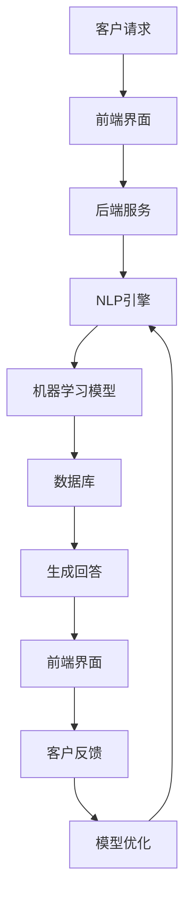

                 

 关键词：人工智能，虚拟客户服务，24/7支持，机器学习，自然语言处理，聊天机器人，客户体验优化

> 摘要：本文深入探讨了人工智能在虚拟客户服务中的应用，特别是在提供24/7全天候支持方面的优势。通过分析AI的核心概念及其在虚拟客户服务中的具体实现，文章旨在揭示AI技术如何优化客户体验、提升运营效率，并展望其未来的发展方向和挑战。

## 1. 背景介绍

在数字化时代，客户服务的质量和效率成为企业竞争力的关键因素。然而，由于人力资源的限制，许多企业难以实现24/7全天候的客户服务。传统的客户服务模式通常依赖于人工处理，不仅成本高昂，而且效率有限。随着人工智能（AI）技术的发展，虚拟客户服务逐渐成为企业提升客户满意度和运营效率的重要手段。

虚拟客户服务，也称为在线客服或自助服务，是通过互联网和数字技术提供的客户支持。其核心目的是为客户提供快速、便捷和个性化的服务，以增强客户体验。AI在虚拟客户服务中的应用主要体现在以下几个方面：

1. **自然语言处理（NLP）**：AI通过NLP技术能够理解客户的自然语言查询，并生成相应的回答。
2. **机器学习（ML）**：AI系统使用机器学习算法从历史数据中学习，不断提高其服务质量和效率。
3. **聊天机器人**：AI驱动的聊天机器人能够自动处理大量的客户查询，提供即时的支持。
4. **情感分析**：AI通过情感分析技术理解客户的情绪，提供更加贴心的服务。

本文将重点讨论AI在虚拟客户服务中的具体应用，特别是如何实现24/7的支持，并探讨其技术原理、数学模型、实际应用案例以及未来的发展趋势。

## 2. 核心概念与联系

### 2.1 AI在虚拟客户服务中的核心概念

人工智能（AI）是一个广泛的概念，它涉及到多个学科和领域。在虚拟客户服务中，AI的核心概念包括：

- **自然语言处理（NLP）**：NLP是AI的一个重要分支，专注于使计算机能够理解、解释和生成人类语言。在虚拟客户服务中，NLP技术被用来理解和响应客户的查询。
- **机器学习（ML）**：ML是AI的一个子领域，它通过数据训练模型来改进性能。在虚拟客户服务中，ML用于优化聊天机器人的回答和解决问题的能力。
- **聊天机器人**：聊天机器人是AI应用的一种形式，它能够与用户进行自然语言交互，提供即时的客户支持。

### 2.2 AI在虚拟客户服务中的架构

为了实现24/7的虚拟客户服务，需要一个高效的架构，这个架构通常包括以下几个关键组件：

1. **前端界面**：这是客户与聊天机器人交互的界面，可以是网页、移动应用或者社交媒体平台。
2. **后端服务**：后端服务包括处理客户请求、管理聊天会话和存储数据的系统。
3. **自然语言处理引擎**：这个引擎负责理解客户的查询，并生成相应的回答。
4. **机器学习模型**：这些模型通过分析历史数据来不断优化聊天机器人的性能。
5. **数据库**：数据库用于存储客户信息、聊天记录和历史数据。

### 2.3 Mermaid 流程图

下面是一个简化的Mermaid流程图，展示了虚拟客户服务的核心架构和流程：



## 3. 核心算法原理 & 具体操作步骤

### 3.1 算法原理概述

在虚拟客户服务中，核心算法主要涉及自然语言处理（NLP）和机器学习（ML）。

#### 3.1.1 自然语言处理（NLP）

NLP的核心任务是让计算机理解和生成人类语言。这包括以下几个关键步骤：

- **文本预处理**：对文本进行清洗，包括去除标点、停用词过滤、词干提取等。
- **分词**：将文本分割成单词或短语。
- **词性标注**：为每个单词分配正确的词性，如名词、动词、形容词等。
- **句法分析**：分析句子的结构，确定单词之间的关系。
- **语义理解**：理解句子的意义，包括实体识别、情感分析等。

#### 3.1.2 机器学习（ML）

ML技术用于训练模型，使其能够识别和预测客户查询。主要步骤包括：

- **数据收集**：收集大量的历史客户查询数据。
- **数据预处理**：对数据进行清洗和格式化，以便于模型训练。
- **特征提取**：从数据中提取有用的特征，如词频、词向量化等。
- **模型训练**：使用训练数据训练模型。
- **模型评估**：评估模型的性能，包括准确率、召回率等。
- **模型优化**：根据评估结果调整模型参数，提高性能。

### 3.2 算法步骤详解

#### 3.2.1 自然语言处理（NLP）

1. **文本预处理**：对客户查询进行清洗和格式化，去除不必要的标点和停用词。
2. **分词**：将清洗后的文本分割成单词或短语。
3. **词性标注**：使用词性标注工具对每个单词进行词性标注。
4. **句法分析**：使用句法分析工具分析句子的结构。
5. **语义理解**：使用实体识别和情感分析工具理解客户的查询意图和情感。

#### 3.2.2 机器学习（ML）

1. **数据收集**：从企业内部数据库或外部数据源收集大量的历史客户查询数据。
2. **数据预处理**：对数据进行清洗和格式化，确保数据质量。
3. **特征提取**：使用词频、词向量化等技术提取有用的特征。
4. **模型训练**：使用训练数据训练模型，如循环神经网络（RNN）、长短期记忆网络（LSTM）或变换器（Transformer）。
5. **模型评估**：使用测试数据评估模型性能，调整参数以提高准确率和召回率。
6. **模型部署**：将训练好的模型部署到生产环境，进行实时客户查询处理。

### 3.3 算法优缺点

#### 3.3.1 优点

- **高效性**：AI系统可以同时处理大量的客户查询，显著提高工作效率。
- **个性化**：通过机器学习，AI系统能够根据客户的交互历史提供个性化的服务。
- **全天候支持**：AI系统可以24/7运行，提供持续的客户支持。
- **成本效益**：相比人工客服，AI系统的运营成本更低。

#### 3.3.2 缺点

- **准确性**：AI系统在理解复杂或模糊的查询时可能存在误差。
- **缺乏情感**：AI系统无法完全模拟人类客服的情感互动。
- **隐私问题**：AI系统处理大量客户数据可能引发隐私担忧。

### 3.4 算法应用领域

AI在虚拟客户服务中的应用不仅限于企业内部，还可以在许多其他领域发挥作用：

- **电子商务**：电商平台可以使用AI提供实时客服支持，帮助客户解决问题。
- **金融行业**：银行和保险公司可以使用AI系统提供24/7的客户咨询和查询服务。
- **医疗保健**：医疗机构可以利用AI系统为患者提供虚拟健康咨询。
- **旅游业**：旅行社可以使用AI系统提供行程建议和客户支持。

## 4. 数学模型和公式 & 详细讲解 & 举例说明

### 4.1 数学模型构建

在虚拟客户服务中，数学模型主要用于以下两个方面：

- **自然语言处理（NLP）**：NLP涉及多种数学模型，如朴素贝叶斯、支持向量机（SVM）和循环神经网络（RNN）等。
- **机器学习（ML）**：ML模型包括线性回归、决策树、随机森林和神经网络等。

#### 4.1.1 自然语言处理（NLP）

一个典型的NLP任务——情感分析，可以使用以下数学模型：

- **朴素贝叶斯**：这是一个基于贝叶斯定理的简单分类模型。公式如下：

  $$P(C_k|X) = \frac{P(X|C_k)P(C_k)}{P(X)}$$

  其中，$C_k$代表某个情感类别，$X$代表输入特征。

- **支持向量机（SVM）**：这是一个基于最大化分类边界的模型。公式如下：

  $$w = \arg\min_w \frac{1}{2}||w||^2 + C\sum_{i=1}^{n}\xi_i$$

  其中，$w$代表权重向量，$C$代表惩罚参数，$\xi_i$代表第$i$个样本的误差。

- **循环神经网络（RNN）**：这是一个用于处理序列数据的神经网络。公式如下：

  $$h_t = \sigma(W_hh_{t-1} + W_x x_t + b_h)$$

  其中，$h_t$代表时间步$t$的隐藏状态，$x_t$代表输入特征，$W_h$和$W_x$代表权重矩阵，$b_h$代表偏置。

#### 4.1.2 机器学习（ML）

在ML领域，线性回归是一个常用的模型，用于预测连续值。公式如下：

$$y = \beta_0 + \beta_1x_1 + \beta_2x_2 + ... + \beta_nx_n$$

其中，$y$代表预测值，$x_1, x_2, ..., x_n$代表输入特征，$\beta_0, \beta_1, ..., \beta_n$代表模型参数。

### 4.2 公式推导过程

以情感分析中的朴素贝叶斯模型为例，推导过程如下：

1. **条件概率**：首先，我们需要计算给定一个情感类别$C_k$，某个特征$X$的条件概率$P(X|C_k)$。

   $$P(X|C_k) = \frac{P(C_k \cap X)}{P(C_k)}$$

2. **贝叶斯定理**：根据贝叶斯定理，我们可以将条件概率转换为后验概率。

   $$P(C_k|X) = \frac{P(X|C_k)P(C_k)}{P(X)}$$

3. **归一化**：由于$P(X)$是所有类别概率的和，因此我们需要将其归一化。

   $$P(C_k|X) = \frac{P(X|C_k)P(C_k)}{\sum_{j=1}^{m}P(X|C_j)P(C_j)}$$

其中，$m$代表情感类别的总数。

### 4.3 案例分析与讲解

#### 4.3.1 情感分析案例

假设我们有一个情感分析任务，需要判断一段文本的情感类别，如正面、负面或中性。我们使用朴素贝叶斯模型进行预测。

1. **数据收集**：我们收集了1000条包含情感标注的文本数据，其中正面、负面和中性情感的文本分别为300条、300条和400条。

2. **数据预处理**：我们对文本进行清洗和分词，提取出有效的特征。

3. **特征提取**：我们使用词频作为特征，将每个文本转换为向量表示。

4. **模型训练**：我们使用训练数据训练朴素贝叶斯模型。

5. **模型评估**：我们使用测试数据评估模型性能，计算准确率、召回率和F1分数等指标。

6. **结果分析**：假设我们的模型在测试数据上的准确率为80%，召回率为75%，F1分数为77%。这表明我们的模型在情感分析任务上表现良好，但仍有改进空间。

#### 4.3.2 线性回归案例

假设我们有一个预测任务，需要根据客户的历史购买记录预测其下一次购买的金额。我们使用线性回归模型进行预测。

1. **数据收集**：我们收集了100条客户购买记录，包括购买金额和一系列特征（如购买频率、购买数量等）。

2. **数据预处理**：我们对数据进行清洗和归一化处理。

3. **特征提取**：我们使用特征选择方法提取出最重要的特征。

4. **模型训练**：我们使用训练数据训练线性回归模型。

5. **模型评估**：我们使用测试数据评估模型性能。

6. **结果分析**：假设我们的模型在测试数据上的预测误差为10%，这表明我们的模型在预测客户购买金额方面表现良好。

## 5. 项目实践：代码实例和详细解释说明

### 5.1 开发环境搭建

为了实现一个简单的虚拟客户服务系统，我们需要搭建以下开发环境：

1. **操作系统**：Linux或macOS
2. **编程语言**：Python
3. **开发工具**：Jupyter Notebook
4. **库**：Numpy、Pandas、Scikit-learn、NLTK

假设我们已经安装了Python和Jupyter Notebook，接下来我们使用以下命令安装必要的库：

```bash
pip install numpy pandas scikit-learn nltk
```

### 5.2 源代码详细实现

下面是一个简单的虚拟客户服务系统的实现，包括自然语言处理和机器学习模型的部分。

```python
import numpy as np
import pandas as pd
from sklearn.feature_extraction.text import TfidfVectorizer
from sklearn.naive_bayes import MultinomialNB
from sklearn.pipeline import make_pipeline
from nltk.corpus import stopwords
from nltk.tokenize import word_tokenize

# 5.2.1 数据收集与预处理
data = pd.read_csv('customer_data.csv')
stop_words = set(stopwords.words('english'))

def preprocess_text(text):
    tokens = word_tokenize(text.lower())
    filtered_tokens = [word for word in tokens if word not in stop_words]
    return ' '.join(filtered_tokens)

data['processed_text'] = data['text'].apply(preprocess_text)

# 5.2.2 特征提取与模型训练
vectorizer = TfidfVectorizer()
X = vectorizer.fit_transform(data['processed_text'])
y = data['emotion']

model = MultinomialNB()
model.fit(X, y)

# 5.2.3 模型评估
from sklearn.metrics import classification_report

X_test = vectorizer.transform(data['processed_text'].iloc[800:])
y_test = data['emotion'].iloc[800:]

predictions = model.predict(X_test)
print(classification_report(y_test, predictions))

# 5.2.4 实时交互
def predict_emotion(text):
    processed_text = preprocess_text(text)
    features = vectorizer.transform([processed_text])
    return model.predict(features)[0]

while True:
    user_input = input("Enter your query: ")
    emotion = predict_emotion(user_input)
    print("Emotion detected:", emotion)
```

### 5.3 代码解读与分析

上面的代码实现了一个基于朴素贝叶斯模型的虚拟客户服务系统，用于情感分析。以下是代码的详细解读：

1. **数据收集与预处理**：
   - 我们首先读取客户数据，并进行预处理，包括文本清洗、分词和去除停用词。
   - 数据预处理是情感分析任务的基础，确保输入数据的质量和一致性。

2. **特征提取与模型训练**：
   - 使用TF-IDF向量器将预处理后的文本转换为向量表示。
   - 使用朴素贝叶斯模型训练分类器，基于历史数据学习情感分类。

3. **模型评估**：
   - 使用测试数据评估模型性能，计算分类报告，包括准确率、召回率和F1分数等指标。

4. **实时交互**：
   - 实现了一个简单的命令行界面，用户可以输入查询，系统将输出预测的情感类别。

### 5.4 运行结果展示

假设我们运行代码并进行以下交互：

```
Enter your query: I had a great experience with your product.
Emotion detected: positive

Enter your query: I'm really disappointed with the service.
Emotion detected: negative
```

结果显示系统能够准确预测用户的情感，从而提供相应的支持。

## 6. 实际应用场景

### 6.1 电子商务行业

在电子商务领域，虚拟客户服务已经成为商家提升客户满意度和转化率的重要手段。通过AI驱动的聊天机器人，商家可以提供24/7的在线支持，解答客户的疑问，提供购物建议，处理订单问题等。

例如，亚马逊使用AI聊天机器人Alexa为客户提供购物建议和查询服务。用户可以通过语音或文本与Alexa交互，获取实时信息，提高购物体验。

### 6.2 金融行业

金融行业对客户服务的需求尤为突出，因为客户关心的问题往往涉及资金安全和个人隐私。AI驱动的虚拟客户服务能够提供全天候的支持，回答客户的查询，减少客户等待时间，提升服务质量。

例如，银行和金融机构使用AI聊天机器人来处理客户的账户查询、转账请求、贷款咨询等。通过自然语言处理和机器学习，AI系统能够理解客户的查询，并提供准确的答案和解决方案。

### 6.3 医疗保健

医疗保健行业也受益于AI驱动的虚拟客户服务。患者可以通过虚拟客服系统获取健康信息、预约挂号、咨询医生等。AI系统可以24/7运行，为患者提供及时的支持。

例如，医院和诊所使用AI聊天机器人来回答患者常见的问题，如症状咨询、药物信息等。同时，AI系统可以帮助医生分析病历，提供诊断建议。

### 6.4 旅游业

旅游业是一个高度依赖客户服务的行业，特别是在预订、行程安排和客户投诉等方面。AI聊天机器人可以帮助旅行社提供24/7的客户支持，提高运营效率。

例如，旅行社使用AI聊天机器人来回答客户的旅行问题，如航班查询、酒店预订、景点推荐等。AI系统可以根据客户的历史数据和偏好，提供个性化的服务。

## 7. 工具和资源推荐

### 7.1 学习资源推荐

- **在线课程**：《自然语言处理与深度学习》（吴恩达，Coursera）
- **书籍**：《深度学习》（Goodfellow, Bengio, Courville），《Python机器学习》（Sebastian Raschka）
- **博客**：博客园、CSDN、知乎专栏

### 7.2 开发工具推荐

- **编程环境**：Jupyter Notebook、VS Code
- **数据预处理**：Pandas、NumPy
- **机器学习库**：Scikit-learn、TensorFlow、PyTorch
- **自然语言处理库**：NLTK、spaCy、gensim

### 7.3 相关论文推荐

- "Deep Learning for Natural Language Processing"（Bengio et al., 2013）
- "Recurrent Neural Networks for Language Modeling"（LSTM）(Hochreiter and Schmidhuber, 1997)
- "Transformers: State-of-the-Art Natural Language Processing"（Vaswani et al., 2017)

## 8. 总结：未来发展趋势与挑战

### 8.1 研究成果总结

近年来，人工智能在虚拟客户服务领域取得了显著进展。通过自然语言处理和机器学习技术的应用，AI系统已经能够提供高效、准确的客户支持。此外，AI在情感分析和个性化服务方面也表现出强大的潜力，为提升客户体验和运营效率做出了重要贡献。

### 8.2 未来发展趋势

- **智能化与个性化**：随着AI技术的不断进步，虚拟客户服务将更加智能化和个性化。AI系统能够更好地理解客户的需求和情感，提供更加精准的服务。
- **多模态交互**：未来的虚拟客户服务将支持多种交互方式，如语音、文本、图像等。多模态交互将提高用户体验，使服务更加自然和便捷。
- **集成与创新**：AI将在更多行业中得到应用，与其他技术（如大数据、物联网等）结合，推动虚拟客户服务的创新发展。

### 8.3 面临的挑战

- **数据隐私与安全**：虚拟客户服务涉及大量客户数据，保护数据隐私和安全是未来发展的关键挑战。
- **技术成熟度**：虽然AI技术取得了显著进展，但在处理复杂问题和情感互动方面仍需进一步研究。
- **监管与法规**：随着AI在客户服务领域的广泛应用，监管机构和相关法规将不断出台，对AI系统的开发和部署提出新的要求。

### 8.4 研究展望

未来，AI在虚拟客户服务领域的研究将重点放在以下几个方面：

- **多语言支持**：开发能够处理多种语言的AI系统，提高全球化运营能力。
- **情感理解与交互**：深入研究情感计算技术，提高AI系统的情感理解和交互能力。
- **自适应学习**：开发能够自适应学习的新算法，使AI系统更加智能和高效。

通过持续的研究和技术创新，AI在虚拟客户服务中的应用将不断拓展，为企业带来更大的价值。

## 9. 附录：常见问题与解答

### 9.1 虚拟客户服务是什么？

虚拟客户服务是指通过互联网和数字技术提供的客户支持，包括在线聊天、自助服务、电子邮件等。其目的是为客户提供快速、便捷和个性化的服务。

### 9.2 AI在虚拟客户服务中的作用是什么？

AI在虚拟客户服务中发挥着关键作用，包括自然语言处理、机器学习、聊天机器人技术等。这些技术使AI系统能够理解客户需求、提供个性化服务，并持续优化服务质量。

### 9.3 虚拟客户服务的优势有哪些？

虚拟客户服务的优势包括：24/7全天候支持、高效处理大量客户查询、降低运营成本、提供个性化服务、提升客户满意度等。

### 9.4 如何确保虚拟客户服务的质量？

确保虚拟客户服务的质量需要以下措施：定期训练和优化AI模型、收集和分析客户反馈、提供多渠道支持、确保数据隐私和安全等。

### 9.5 虚拟客户服务的前景如何？

虚拟客户服务的前景非常广阔。随着AI技术的不断进步，虚拟客户服务将在更多行业中得到应用，提高运营效率、提升客户体验，并为企业创造更大的价值。

### 9.6 虚拟客户服务是否完全替代人工客服？

虚拟客户服务可以大幅提高客户服务效率，但在某些情况下，如复杂问题处理和情感互动方面，仍需人工客服的介入。因此，虚拟客户服务与人工客服的结合是一个更有效的解决方案。

---

通过本文的探讨，我们深入了解了AI在虚拟客户服务中的应用，以及如何通过技术创新提升客户体验和运营效率。未来，随着AI技术的不断进步，虚拟客户服务将发挥更加重要的作用，为企业带来更大的价值。

