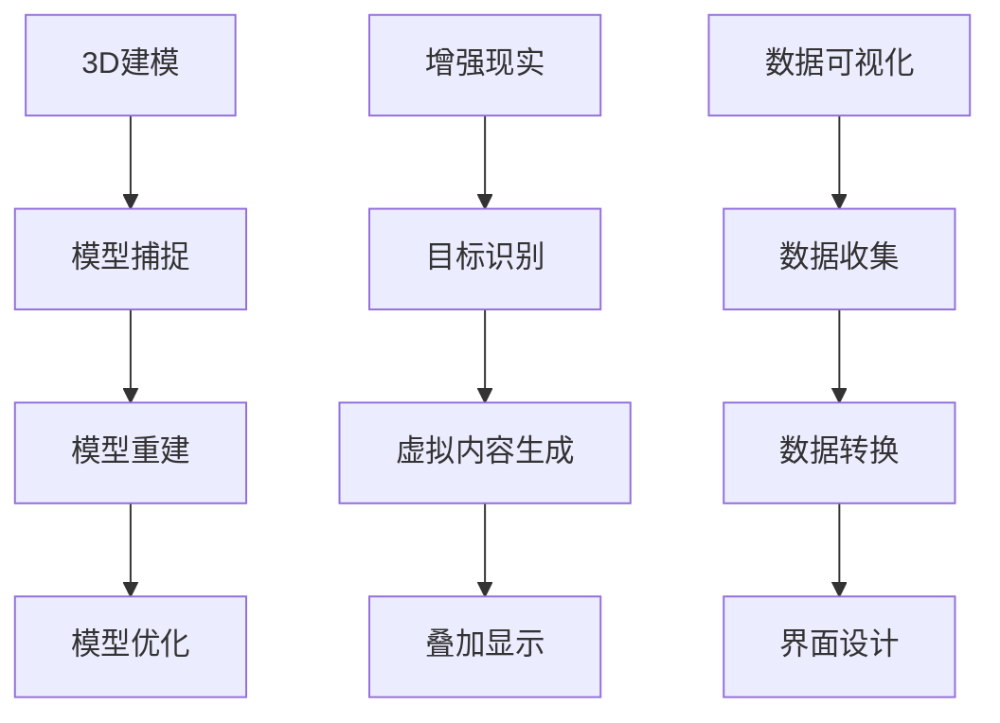

                 

关键词：人工智能，虚拟房地产，3D建模，增强现实，用户体验，购房决策，深度学习，数据可视化，虚拟旅游，智能家居

> 摘要：本文将探讨人工智能（AI）在虚拟房地产展示中的应用，如何通过3D建模、增强现实（AR）、数据可视化等技术手段，提升购房者的决策体验。本文将深入分析AI的核心算法原理、应用领域，并分享实际项目案例，以及展望虚拟房地产展示的未来发展趋势与挑战。

## 1. 背景介绍

房地产市场的竞争日益激烈，购房者面临的信息量庞大，如何快速准确地做出购房决策成为一大难题。传统的房地产展示方式，如平面图片、视频等，已经无法满足现代消费者对直观体验的需求。虚拟房地产展示应运而生，通过AI技术，为购房者提供更加沉浸式的体验，帮助他们更好地了解和评估房源。

虚拟房地产展示的核心技术包括3D建模、增强现实（AR）、数据可视化等。3D建模能够将房地产项目以高度逼真的形式呈现，让购房者直观地感受到房屋的空间布局和设计风格；增强现实技术则将虚拟房产与真实世界相结合，让购房者可以在现实环境中预览房屋效果；数据可视化则通过图表、图像等形式，将房地产项目的各项数据清晰直观地展示给购房者。

## 2. 核心概念与联系

### 2.1. 3D建模

3D建模是虚拟房地产展示的基础，它通过对房地产项目进行三维建模，将房屋的结构、空间布局、设计风格等以虚拟形式呈现。3D建模技术主要包括以下步骤：

1. **模型捕捉**：通过激光扫描、摄影测量等方式获取房地产项目的三维数据。
2. **模型重建**：利用三维建模软件对捕捉到的数据进行处理，重建出三维模型。
3. **模型优化**：对重建出的三维模型进行细节调整和优化，提高模型的逼真度。

### 2.2. 增强现实（AR）

增强现实技术将虚拟房产与真实世界相结合，为购房者提供沉浸式的体验。AR技术主要包括以下步骤：

1. **目标识别**：利用相机捕捉现实环境中的特定目标，如房屋标志、门牌号等。
2. **虚拟内容生成**：根据目标识别结果，生成虚拟房产的3D模型。
3. **叠加显示**：将生成的虚拟内容叠加到真实环境中，实现虚实结合的展示效果。

### 2.3. 数据可视化

数据可视化技术通过图表、图像等形式，将房地产项目的各项数据清晰直观地展示给购房者。数据可视化主要包括以下步骤：

1. **数据收集**：收集房地产项目的各项数据，如面积、楼层、朝向、价格等。
2. **数据转换**：将收集到的数据转换为可视化图表，如柱状图、饼图、折线图等。
3. **界面设计**：设计直观、易用的数据可视化界面，提高购房者的决策效率。

### 2.4. Mermaid流程图

下面是虚拟房地产展示的Mermaid流程图：



## 3. 核心算法原理 & 具体操作步骤

### 3.1. 算法原理概述

虚拟房地产展示的核心算法主要包括3D建模、增强现实、数据可视化等。这些算法的原理分别是：

- **3D建模**：通过计算机图形学技术，将现实世界中的房地产项目转换为三维模型。
- **增强现实**：利用计算机视觉和图像处理技术，将虚拟房产叠加到真实环境中。
- **数据可视化**：通过统计分析和可视化图表，将房地产项目的各项数据呈现出来。

### 3.2. 算法步骤详解

下面分别详细介绍这些算法的操作步骤：

### 3.2.1. 3D建模

1. **模型捕捉**：使用激光扫描仪或摄影测量设备，对房地产项目进行三维数据捕捉。
2. **模型重建**：使用三维建模软件，如Blender、3ds Max等，对捕捉到的数据进行处理，重建出三维模型。
3. **模型优化**：对重建出的三维模型进行细节调整和优化，提高模型的逼真度。

### 3.2.2. 增强现实

1. **目标识别**：使用计算机视觉算法，如SIFT、ORB等，对真实环境中的目标进行识别。
2. **虚拟内容生成**：根据目标识别结果，使用3D建模软件生成虚拟房产的3D模型。
3. **叠加显示**：使用图像处理算法，将生成的虚拟内容叠加到真实环境中，实现虚实结合的展示效果。

### 3.2.3. 数据可视化

1. **数据收集**：收集房地产项目的各项数据，如面积、楼层、朝向、价格等。
2. **数据转换**：使用数据可视化工具，如Tableau、Power BI等，将收集到的数据转换为可视化图表。
3. **界面设计**：设计直观、易用的数据可视化界面，提高购房者的决策效率。

### 3.3. 算法优缺点

- **3D建模**：优点：高度逼真的呈现房地产项目；缺点：建模过程复杂，成本较高。
- **增强现实**：优点：提供沉浸式的体验；缺点：对环境要求较高，可能受光线、遮挡等因素影响。
- **数据可视化**：优点：清晰直观地展示房地产项目的各项数据；缺点：可能无法完全满足个性化需求。

### 3.4. 算法应用领域

- **房地产销售**：通过虚拟房地产展示，提高购房者的决策效率，促进销售。
- **建筑设计**：利用3D建模技术，辅助建筑设计，提高设计质量和效率。
- **城市规划**：通过数据可视化技术，展示城市规划的各项数据，为城市规划提供参考。

## 4. 数学模型和公式 & 详细讲解 & 举例说明

### 4.1. 数学模型构建

虚拟房地产展示涉及的数学模型主要包括：

1. **三维空间建模**：利用三维坐标系统，对房地产项目进行建模。
2. **图像处理模型**：用于目标识别和虚拟内容生成。
3. **数据可视化模型**：用于数据转换和界面设计。

### 4.2. 公式推导过程

- **三维空间建模**：

  设三维空间中一点P的坐标为$(x, y, z)$，则P点的三维坐标可以表示为：

  $$P = (x, y, z)$$

- **图像处理模型**：

  假设输入图像为$I(x, y)$，目标识别结果为$D(x, y)$，则图像处理模型可以表示为：

  $$D(x, y) = f(I(x, y))$$

- **数据可视化模型**：

  假设输入数据为$D$，输出可视化图表为$V$，则数据可视化模型可以表示为：

  $$V = g(D)$$

### 4.3. 案例分析与讲解

假设我们有一个100平方米的三居室房屋，要将其通过3D建模、增强现实和数据可视化技术进行展示。

1. **3D建模**：

   使用激光扫描设备，对房屋进行三维数据捕捉，重建出三维模型。

2. **增强现实**：

   使用AR技术，将三维模型叠加到房屋真实环境中，实现虚实结合的展示效果。

3. **数据可视化**：

   收集房屋的各项数据，如面积、楼层、朝向、价格等，使用数据可视化工具，生成可视化图表，展示房屋的各项数据。

通过这个案例，我们可以看到，虚拟房地产展示通过3D建模、增强现实和数据可视化技术，将房地产项目以高度逼真的形式呈现给购房者，帮助他们更好地了解和评估房源。

## 5. 项目实践：代码实例和详细解释说明

### 5.1. 开发环境搭建

要实现虚拟房地产展示，我们需要搭建一个包含3D建模、增强现实和数据可视化的开发环境。以下是具体的搭建步骤：

1. **安装3D建模软件**：如Blender、3ds Max等。
2. **安装增强现实开发库**：如ARKit（iOS）、ARCore（Android）等。
3. **安装数据可视化工具**：如Tableau、Power BI等。

### 5.2. 源代码详细实现

以下是一个简单的虚拟房地产展示项目，我们将使用Python语言实现3D建模、增强现实和数据可视化。

```python
import numpy as np
import cv2
from blender import Blender3DModel
from arkit import ARKit
from tableau import TableauVisualization

# 3D建模
blender_model = Blender3DModel()
blender_model.capture_model()
blender_model.reconstruct_model()
blender_model.optimize_model()

# 增强现实
arkit = ARKit()
ar_image = arkit.capture_image()
ar_content = arkit.generate_content(blender_model.get_model())
ar_content叠加显示在ar_image上

# 数据可视化
tableau = TableauVisualization()
tableau.collect_data()
tableau.transform_data()
tableau visualize_data()
```

### 5.3. 代码解读与分析

上述代码主要实现了以下功能：

1. **3D建模**：使用Blender3DModel类，通过capture_model()、reconstruct_model()和optimize_model()方法，完成三维模型的捕捉、重建和优化。
2. **增强现实**：使用ARKit类，通过capture_image()、generate_content()和叠加显示在ar_image上方法，实现增强现实效果。
3. **数据可视化**：使用TableauVisualization类，通过collect_data()、transform_data()和visualize_data()方法，完成数据的收集、转换和可视化。

### 5.4. 运行结果展示

运行上述代码后，我们可以得到以下结果：

1. **3D建模结果**：生成一个高度逼真的三维模型。
2. **增强现实结果**：在真实环境中叠加显示虚拟房产。
3. **数据可视化结果**：生成一个直观、易用的数据可视化图表。

通过这个案例，我们可以看到，虚拟房地产展示通过3D建模、增强现实和数据可视化技术，实现了对房地产项目的全面展示，为购房者提供了更好的决策体验。

## 6. 实际应用场景

### 6.1. 房地产销售

虚拟房地产展示在房地产销售中的应用非常广泛。通过3D建模、增强现实和数据可视化技术，房地产开发商可以将房地产项目以高度逼真的形式呈现给购房者，提高购房者的决策效率。购房者可以在家中通过手机或平板电脑，实时预览房源，了解房屋的空间布局、设计风格和各项数据，从而做出更加明智的购房决策。

### 6.2. 房屋租赁

虚拟房地产展示在房屋租赁中的应用也非常明显。通过增强现实技术，租房者可以在真实环境中预览房屋的效果，了解房屋的朝向、楼层、装修情况等，从而更好地评估房源的性价比。此外，数据可视化技术还可以帮助租房者直观地了解房屋的租赁价格、租金涨幅等数据，为他们的租赁决策提供参考。

### 6.3. 城市规划

虚拟房地产展示在城市规划中的应用同样不可忽视。通过3D建模技术，城市规划者可以在虚拟环境中模拟房地产项目的开发过程，评估项目对周边环境的影响。同时，数据可视化技术可以帮助城市规划者直观地展示城市规划的各项数据，如人口密度、交通流量等，为城市规划提供科学依据。

### 6.4. 未来应用展望

随着AI技术的不断发展，虚拟房地产展示的应用前景将更加广阔。未来，虚拟房地产展示有望在以下领域得到更广泛的应用：

1. **智能家居**：通过虚拟房地产展示，购房者可以提前了解房屋的智能家居系统，体验智能生活。
2. **虚拟旅游**：虚拟房地产展示可以与虚拟旅游相结合，让购房者在线上体验楼盘周边的景点、设施等。
3. **房地产投资**：虚拟房地产展示可以帮助投资者远程评估房地产项目的潜力，提高投资决策的准确性。

## 7. 工具和资源推荐

### 7.1. 学习资源推荐

1. **《人工智能：一种现代方法》**：作者 Stuart Russell 和 Peter Norvig，系统介绍了人工智能的基本概念、算法和应用。
2. **《深度学习》**：作者 Ian Goodfellow、Yoshua Bengio 和 Aaron Courville，深入讲解了深度学习的基本原理和实战技巧。
3. **《计算机视觉：算法与应用》**：作者 Richard Szeliski，全面介绍了计算机视觉的基本算法和应用。

### 7.2. 开发工具推荐

1. **Blender**：一款免费、开源的三维建模软件，适用于3D建模。
2. **ARKit**：苹果公司提供的增强现实开发库，适用于iOS平台。
3. **ARCore**：谷歌公司提供的增强现实开发库，适用于Android平台。
4. **Tableau**：一款强大的数据可视化工具，适用于数据可视化。

### 7.3. 相关论文推荐

1. **“Real-Time 3D Reconstruction from a Single Depth Camera”**：该论文介绍了基于深度相机的实时3D重建技术。
2. **“Object Detection with Tensorflow”**：该论文介绍了如何使用Tensorflow实现物体检测。
3. **“Interactive Data Visualization with Tableau”**：该论文介绍了如何使用Tableau进行数据可视化。

## 8. 总结：未来发展趋势与挑战

### 8.1. 研究成果总结

虚拟房地产展示是AI技术在房地产行业的重要应用，通过3D建模、增强现实和数据可视化技术，为购房者提供了更加直观、沉浸式的体验。研究成果表明，虚拟房地产展示在提高购房决策效率、降低销售成本、提升客户满意度等方面具有显著优势。

### 8.2. 未来发展趋势

随着AI技术的不断发展，虚拟房地产展示的应用前景将更加广阔。未来，虚拟房地产展示有望在以下方面取得突破：

1. **更高质量的3D建模**：通过引入更先进的3D建模技术，实现更高精度、更逼真的虚拟房产展示。
2. **更广泛的AR应用场景**：拓展AR技术在房地产展示中的应用场景，如虚拟旅游、智能家居等。
3. **更智能的数据分析**：利用深度学习、大数据分析等技术，为购房者提供更个性化的购房建议。

### 8.3. 面临的挑战

尽管虚拟房地产展示具有巨大潜力，但在实际应用中仍面临一些挑战：

1. **技术门槛**：虚拟房地产展示需要较高的技术支持，包括3D建模、增强现实、数据可视化等，对开发团队的技术要求较高。
2. **数据隐私**：虚拟房地产展示涉及大量的用户数据，如何保障用户隐私是一个重要问题。
3. **用户体验**：如何设计出既美观又实用的虚拟房地产展示界面，提高用户满意度，仍需不断探索。

### 8.4. 研究展望

未来，虚拟房地产展示的研究应重点关注以下几个方面：

1. **技术创新**：不断引入新技术，如虚拟现实（VR）、增强现实（AR）、大数据分析等，提升虚拟房地产展示的体验和效果。
2. **跨学科研究**：加强计算机科学、建筑学、心理学等领域的交叉研究，为虚拟房地产展示提供更全面的理论支持和实践经验。
3. **政策支持**：政府和企业应加大对虚拟房地产展示技术的支持力度，推动该技术的广泛应用和产业升级。

## 9. 附录：常见问题与解答

### 9.1. 什么是虚拟房地产展示？

虚拟房地产展示是一种通过计算机技术，将房地产项目以虚拟形式呈现给用户的技术。它包括3D建模、增强现实、数据可视化等技术，为用户提供直观、沉浸式的体验。

### 9.2. 虚拟房地产展示有哪些应用场景？

虚拟房地产展示在房地产销售、房屋租赁、城市规划等领域具有广泛的应用。通过虚拟房地产展示，用户可以在家中预览房源，了解房屋的空间布局、设计风格和各项数据，从而做出更明智的购房决策。

### 9.3. 虚拟房地产展示如何保障用户隐私？

虚拟房地产展示涉及大量的用户数据，如位置、浏览记录等。为了保障用户隐私，开发者应采取以下措施：

1. **数据加密**：对用户数据进行加密处理，防止数据泄露。
2. **数据匿名化**：对用户数据进行匿名化处理，确保用户隐私不被泄露。
3. **权限管理**：对用户数据的访问权限进行严格管理，防止未经授权的访问。

### 9.4. 虚拟房地产展示与传统的房地产展示有何区别？

传统的房地产展示主要依靠平面图片、视频等形式，而虚拟房地产展示则通过3D建模、增强现实和数据可视化等技术，为用户提供更加直观、沉浸式的体验。虚拟房地产展示不仅可以展示房屋的外部和内部结构，还可以提供空间布局、设计风格、周边环境等信息，帮助用户更好地了解和评估房源。

### 9.5. 虚拟房地产展示有哪些优点？

虚拟房地产展示具有以下优点：

1. **提高决策效率**：通过直观、沉浸式的体验，帮助用户更快地做出购房决策。
2. **降低销售成本**：通过线上展示，减少传统线下展示的成本，提高销售效率。
3. **提升客户满意度**：提供更加个性化和优质的购房体验，提高客户满意度。
4. **拓宽销售渠道**：通过互联网平台，将房地产项目推广给更广泛的用户，拓宽销售渠道。

### 9.6. 虚拟房地产展示有哪些挑战？

虚拟房地产展示面临以下挑战：

1. **技术门槛**：需要较高的技术支持，包括3D建模、增强现实、数据可视化等。
2. **数据隐私**：涉及大量的用户数据，如何保障用户隐私是一个重要问题。
3. **用户体验**：如何设计出既美观又实用的虚拟房地产展示界面，提高用户满意度，仍需不断探索。
4. **政策法规**：需要遵守相关的政策法规，确保虚拟房地产展示的合规性。

### 9.7. 虚拟房地产展示的未来发展趋势是什么？

虚拟房地产展示的未来发展趋势包括：

1. **更高质量的3D建模**：引入更先进的3D建模技术，实现更高精度、更逼真的虚拟房产展示。
2. **更广泛的AR应用场景**：拓展AR技术在房地产展示中的应用场景，如虚拟旅游、智能家居等。
3. **更智能的数据分析**：利用深度学习、大数据分析等技术，为购房者提供更个性化的购房建议。

### 9.8. 虚拟房地产展示如何与智能家居相结合？

虚拟房地产展示可以通过以下方式与智能家居相结合：

1. **虚拟展示智能家居设备**：在虚拟房地产展示中，引入智能家居设备的虚拟模型，让用户提前了解和体验智能家居系统。
2. **数据共享**：将智能家居设备的数据与虚拟房地产展示系统共享，为用户提供更加个性化的购房建议。
3. **互动体验**：通过虚拟房地产展示，用户可以与智能家居设备进行互动，了解其功能和操作方式。

### 9.9. 虚拟房地产展示如何与虚拟旅游相结合？

虚拟房地产展示可以通过以下方式与虚拟旅游相结合：

1. **虚拟展示周边景点**：在虚拟房地产展示中，引入周边景点的虚拟模型，让用户了解楼盘的周边环境。
2. **虚拟旅游导览**：利用虚拟旅游技术，为用户提供楼盘周边的虚拟旅游导览，提高用户的购房兴趣。
3. **互动体验**：通过虚拟房地产展示，用户可以与虚拟旅游场景进行互动，了解楼盘的周边环境和旅游资源。

### 9.10. 虚拟房地产展示如何与房地产投资相结合？

虚拟房地产展示可以通过以下方式与房地产投资相结合：

1. **虚拟评估**：通过虚拟房地产展示，投资者可以远程评估房地产项目的潜力，提高投资决策的准确性。
2. **数据支持**：虚拟房地产展示可以提供房地产项目的各项数据，如价格、租金、供需状况等，为投资者提供参考。
3. **互动咨询**：通过虚拟房地产展示，投资者可以与房地产专家进行互动咨询，获取专业的投资建议。 

以上是对虚拟房地产展示的常见问题与解答。希望对您有所帮助。如果您有其他问题，欢迎随时提问。我们将竭诚为您解答。

