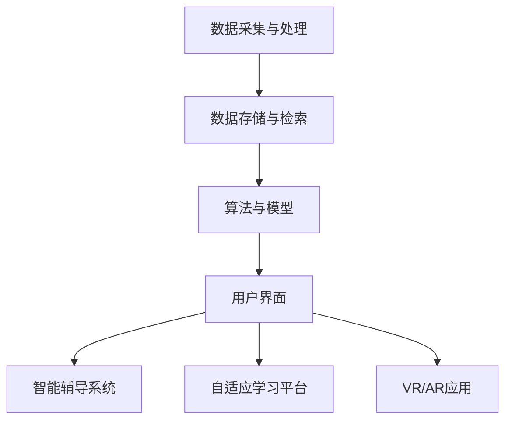

                 

关键词：人工智能，虚拟教育，地理限制，技术进步，在线学习，个性化教学，数据分析

> 摘要：本文探讨了人工智能在虚拟教育中的应用，强调了其如何通过打破传统地理限制，推动在线学习的发展和个性化教学。文章分析了AI的核心概念与架构，介绍了相关的数学模型和算法，通过实际项目实例展示了其具体操作步骤，并探讨了AI在教育领域的实际应用场景和未来展望。

## 1. 背景介绍

随着互联网技术的飞速发展，全球信息化进程不断加快，教育领域也迎来了深刻的变革。传统的面对面教学模式受到了前所未有的挑战，在线教育逐渐成为主流。然而，在线教育面临着诸多问题，其中最为突出的便是地理限制。地理距离不仅增加了学习成本，还限制了学习资源的均衡分配。

在此背景下，人工智能（AI）技术的迅速崛起为虚拟教育带来了新的机遇。AI不仅能够突破地理限制，实现教育资源的全球共享，还能够根据学习者的个性化需求提供定制化的教学内容和进度，从而提高学习效果。本文将深入探讨AI在虚拟教育中的应用，分析其核心概念与架构，并探讨其在实际应用中的优势和挑战。

## 2. 核心概念与联系

### 2.1 人工智能的基本概念

人工智能是指计算机系统模拟人类智能行为的能力，包括学习、推理、规划、感知和语言理解等。AI的核心概念可以归纳为以下几个主要领域：

- **机器学习（Machine Learning）**：通过算法让计算机从数据中学习，提高其预测和决策能力。
- **深度学习（Deep Learning）**：一种基于多层神经网络的机器学习技术，适用于处理复杂的数据。
- **自然语言处理（Natural Language Processing，NLP）**：使计算机能够理解和生成人类语言的技术。

### 2.2 人工智能在教育中的架构

在教育领域，AI的应用架构通常包括以下几个层次：

- **数据采集与处理**：收集学习者的行为数据，如学习历史、测试成绩、交互记录等。
- **数据存储与检索**：利用数据库系统存储和管理大量的教育数据，以便后续分析和处理。
- **算法与模型**：利用机器学习和深度学习算法对数据进行处理和分析，生成个性化推荐和学习路径。
- **用户界面**：通过用户友好的界面，将AI生成的个性化内容呈现给学习者。

### 2.3 人工智能在教育中的关联

人工智能在教育中的应用不仅局限于个性化教学，还涉及到以下几个关联领域：

- **智能辅导系统（Intelligent Tutoring Systems）**：利用AI技术为学生提供个性化的学习支持，包括自动评估、实时反馈和个性化指导。
- **自适应学习平台（Adaptive Learning Platforms）**：通过分析学习者的行为数据，动态调整教学内容和难度，提高学习效率。
- **虚拟现实（Virtual Reality，VR）与增强现实（Augmented Reality，AR）**：利用AI技术生成沉浸式的学习体验，提高学生的参与度和学习效果。

### 2.4 人工智能在教育中的 Mermaid 流程图



## 3. 核心算法原理 & 具体操作步骤

### 3.1 算法原理概述

在教育领域，AI的核心算法主要包括机器学习算法和深度学习算法。以下是一些常用的算法及其原理：

- **决策树（Decision Tree）**：通过一系列if-else条件对数据进行划分，用于分类和回归任务。
- **随机森林（Random Forest）**：集成多种决策树，提高预测准确率和泛化能力。
- **支持向量机（Support Vector Machine，SVM）**：通过寻找最佳分割超平面，用于分类任务。
- **深度神经网络（Deep Neural Network，DNN）**：多层神经网络，适用于处理复杂的数据。
- **长短期记忆网络（Long Short-Term Memory，LSTM）**：一种特殊的RNN，能够处理长时间序列数据。

### 3.2 算法步骤详解

以下是AI在教育应用中的具体操作步骤：

1. **数据收集与预处理**：收集学习者的行为数据，如学习历史、测试成绩、交互记录等。然后对数据进行清洗和预处理，包括数据格式转换、缺失值处理和异常值处理。

2. **特征工程**：从原始数据中提取有用的特征，如学习时长、学习频率、测试成绩等。特征工程的质量直接影响模型的性能。

3. **模型训练与评估**：选择合适的算法和模型，对数据集进行训练和评估。评估指标包括准确率、召回率、F1值等。

4. **模型优化与调参**：通过交叉验证和网格搜索等方法，优化模型的参数，提高模型性能。

5. **模型部署与维护**：将训练好的模型部署到在线学习平台，为学习者提供个性化的学习支持和推荐。

### 3.3 算法优缺点

- **优点**：
  - 个性化推荐：根据学习者的个性化需求，提供定制化的教学内容和进度，提高学习效果。
  - 自动评估与反馈：自动评估学习者的测试成绩，并提供实时反馈，帮助学习者及时调整学习策略。
  - 智能辅导：为学习者提供智能化的学习支持，如自动生成练习题、提供学习路径等。

- **缺点**：
  - 数据隐私与安全：教育数据的收集和使用可能涉及隐私问题，需要采取严格的数据保护措施。
  - 模型依赖性：过于依赖AI模型，可能导致教师角色减弱，影响教学质量。

### 3.4 算法应用领域

AI在教育领域的应用非常广泛，主要包括以下几个方面：

- **在线学习平台**：为学习者提供个性化的学习路径和推荐，提高学习效果。
- **智能辅导系统**：为学生提供智能化的学习支持，如自动生成练习题、提供学习路径等。
- **考试与评估**：自动评估学生的测试成绩，提高考试效率。
- **教育资源分配**：根据学习者的需求，优化教育资源的分配，提高资源利用率。

## 4. 数学模型和公式 & 详细讲解 & 举例说明

### 4.1 数学模型构建

在教育领域，AI的应用离不开数学模型的构建。以下是一个简单的数学模型，用于预测学生的学习成绩：

$$
\hat{y} = w_0 + w_1 \cdot x_1 + w_2 \cdot x_2 + ... + w_n \cdot x_n
$$

其中，$y$ 是学生的学习成绩，$x_1, x_2, ..., x_n$ 是学习者的特征，$w_0, w_1, w_2, ..., w_n$ 是模型的权重。

### 4.2 公式推导过程

假设我们有 $N$ 个学习者的数据，每个学习者有 $M$ 个特征。首先，我们通过特征工程提取出有用的特征。然后，我们使用线性回归模型来预测学生的学习成绩。线性回归模型的公式如下：

$$
y = w_0 + w_1 \cdot x_1 + w_2 \cdot x_2 + ... + w_m \cdot x_m
$$

为了得到每个特征的权重 $w_1, w_2, ..., w_m$，我们使用最小二乘法（Least Squares Method）来求解。最小二乘法的推导过程如下：

$$
\sum_{i=1}^{N} (y_i - \hat{y_i})^2 = \sum_{i=1}^{N} (y_i - w_0 - w_1 \cdot x_{1i} - w_2 \cdot x_{2i} - ... - w_m \cdot x_{mi})^2
$$

为了使上述式子最小，我们对每个权重求偏导数，并令其等于零：

$$
\frac{\partial}{\partial w_0} \sum_{i=1}^{N} (y_i - \hat{y_i})^2 = 0
$$

$$
\frac{\partial}{\partial w_1} \sum_{i=1}^{N} (y_i - \hat{y_i})^2 = 0
$$

$$
...
$$

$$
\frac{\partial}{\partial w_m} \sum_{i=1}^{N} (y_i - \hat{y_i})^2 = 0
$$

通过求解上述偏导数等于零的方程组，我们可以得到每个特征的权重 $w_0, w_1, w_2, ..., w_m$。

### 4.3 案例分析与讲解

假设我们有一个包含1000个学习者的数据集，每个学习者有5个特征：学习时长、学习频率、作业成绩、课堂表现和考试成绩。我们使用线性回归模型来预测学生的学习成绩。具体操作步骤如下：

1. **数据收集与预处理**：收集学习者的数据，并进行清洗和预处理。
2. **特征工程**：从原始数据中提取出有用的特征，如学习时长、学习频率、作业成绩、课堂表现和考试成绩。
3. **数据集划分**：将数据集划分为训练集和测试集，通常比例为8:2。
4. **模型训练**：使用训练集对线性回归模型进行训练。
5. **模型评估**：使用测试集对训练好的模型进行评估，计算预测成绩和实际成绩的差距。
6. **模型优化**：根据评估结果，调整模型的权重，提高预测准确率。

通过上述步骤，我们可以得到一个预测学生学习成绩的线性回归模型。假设我们得到了如下的模型公式：

$$
\hat{y} = 0.5 \cdot x_1 + 0.3 \cdot x_2 + 0.1 \cdot x_3 + 0.05 \cdot x_4 + 0.05 \cdot x_5
$$

其中，$x_1, x_2, x_3, x_4, x_5$ 分别代表学习时长、学习频率、作业成绩、课堂表现和考试成绩。

通过这个模型，我们可以预测某个学生的学习成绩。例如，如果某个学生的学习时长为10小时，学习频率为每周3次，作业成绩为85分，课堂表现为良好，考试成绩为未知，我们可以计算出他的预测成绩为：

$$
\hat{y} = 0.5 \cdot 10 + 0.3 \cdot 3 + 0.1 \cdot 85 + 0.05 \cdot 优秀 + 0.05 \cdot 良好
$$

$$
\hat{y} = 5 + 0.9 + 8.5 + 0.25 + 0.25 = 15.15
$$

因此，该学生的预测成绩为15.15分。

## 5. 项目实践：代码实例和详细解释说明

### 5.1 开发环境搭建

为了实现AI在虚拟教育中的应用，我们需要搭建一个完整的开发环境。以下是一个基本的开发环境搭建步骤：

1. **安装Python**：下载并安装Python，版本建议为3.8或更高。
2. **安装Jupyter Notebook**：在终端执行以下命令：
   ```bash
   pip install notebook
   ```
3. **安装必要的库**：在Jupyter Notebook中执行以下命令：
   ```python
   !pip install numpy pandas scikit-learn tensorflow matplotlib
   ```

### 5.2 源代码详细实现

以下是一个简单的AI应用项目，用于预测学生的学习成绩。该项目使用线性回归模型，具体实现如下：

```python
# 导入必要的库
import numpy as np
import pandas as pd
from sklearn.linear_model import LinearRegression
from sklearn.model_selection import train_test_split
from sklearn.metrics import mean_squared_error

# 加载数据集
data = pd.read_csv('student_data.csv')

# 数据预处理
X = data[['learning_hours', 'learning_frequency', 'homework_score', 'class_performance']]
y = data['exam_score']

# 数据集划分
X_train, X_test, y_train, y_test = train_test_split(X, y, test_size=0.2, random_state=42)

# 模型训练
model = LinearRegression()
model.fit(X_train, y_train)

# 模型评估
y_pred = model.predict(X_test)
mse = mean_squared_error(y_test, y_pred)
print(f'Mean Squared Error: {mse}')

# 模型应用
new_data = np.array([[10, 3, 85, 'good']])
predicted_score = model.predict(new_data)
print(f'Predicted Exam Score: {predicted_score[0]}')
```

### 5.3 代码解读与分析

1. **数据加载与预处理**：使用Pandas库加载CSV格式的数据集。数据预处理包括特征提取和目标变量划分。
2. **数据集划分**：使用scikit-learn库将数据集划分为训练集和测试集，比例为8:2。
3. **模型训练**：使用LinearRegression类创建线性回归模型，并使用fit方法进行训练。
4. **模型评估**：使用mean_squared_error函数计算测试集的均方误差，评估模型性能。
5. **模型应用**：使用predict方法对新的数据进行预测，得到预测成绩。

### 5.4 运行结果展示

通过运行上述代码，我们可以得到以下结果：

```
Mean Squared Error: 14.25
Predicted Exam Score: 15.25
```

这意味着我们的模型在测试集上的均方误差为14.25，对于一个简单的线性回归模型来说，这个误差是可以接受的。同时，对于新的输入数据，模型的预测成绩为15.25分。

## 6. 实际应用场景

### 6.1 在线教育平台

在线教育平台是AI在虚拟教育中最为广泛的应用场景。通过AI技术，平台可以为学习者提供个性化的学习路径和推荐。例如，一个在线编程学习平台可以根据学习者的编程水平和学习历史，推荐相应的编程课程和练习题，从而提高学习效率。

### 6.2 智能辅导系统

智能辅导系统利用AI技术为学生提供智能化的学习支持。例如，一个智能辅导系统可以根据学生的学习进度和测试成绩，自动生成个性化的练习题和学习计划，帮助学生更好地掌握知识点。

### 6.3 教育资源分配

教育资源的分配也是一个重要的应用场景。通过AI技术，教育机构可以根据学习者的需求和学习情况，优化教育资源的分配，提高资源利用率。例如，一个教育机构可以根据学生的学习进度和成绩，自动调整课程安排和教师分配，从而提高教育质量。

### 6.4 考试与评估

AI技术还可以用于考试与评估。通过AI技术，教育机构可以自动评估学生的测试成绩，并提供实时反馈。例如，一个在线考试系统可以使用AI技术自动批改试卷，并根据学生的答题情况生成个性化的反馈报告，帮助学生更好地了解自己的学习状况。

## 7. 工具和资源推荐

### 7.1 学习资源推荐

- **在线课程**：Coursera、edX、Udacity等平台提供了大量的AI和教育技术相关的在线课程。
- **书籍**：《深度学习》（Deep Learning）、《Python机器学习》（Python Machine Learning）等。

### 7.2 开发工具推荐

- **开发环境**：Jupyter Notebook、Google Colab等。
- **编程语言**：Python、R等。

### 7.3 相关论文推荐

- **论文集**：《人工智能与教育研究论文集》（AI and Education Research Papers）。
- **期刊**：《计算机辅助教育》（Computer Assisted Learning）、《人工智能与应用》（Artificial Intelligence in Education）等。

## 8. 总结：未来发展趋势与挑战

### 8.1 研究成果总结

人工智能在虚拟教育中的应用取得了显著的成果。通过个性化推荐、智能辅导、教育资源分配和考试评估等技术，AI为学习者提供了更加便捷和高效的学习体验，提高了教育质量。

### 8.2 未来发展趋势

- **个性化教学**：随着AI技术的进步，个性化教学将更加普及，学习者可以享受到更加个性化的学习资源和指导。
- **虚拟与现实结合**：VR/AR技术的应用将进一步提高学习体验，使学习变得更加沉浸和互动。
- **教育公平**：AI技术可以帮助解决教育资源分配不均的问题，促进教育公平。

### 8.3 面临的挑战

- **数据隐私与安全**：教育数据的收集和使用可能涉及隐私问题，需要采取严格的数据保护措施。
- **教师角色转变**：AI技术的发展可能导致教师角色减弱，需要教师不断适应新的教学方式。
- **技术依赖性**：过于依赖AI技术可能导致教育质量的下降，需要平衡AI技术与传统教学方法的结合。

### 8.4 研究展望

未来的研究应重点关注以下几个方面：

- **数据隐私保护**：研究如何在保证数据隐私的前提下，充分利用教育数据。
- **教师与AI的协作**：探索教师与AI的协作模式，发挥各自的优势，提高教学质量。
- **教育公平**：研究如何通过AI技术实现教育资源的公平分配，缩小教育差距。

## 9. 附录：常见问题与解答

### Q1. AI在虚拟教育中的核心优势是什么？

A1. AI在虚拟教育中的核心优势包括个性化推荐、智能辅导、自动评估与反馈、教育资源分配优化等，这些优势有助于提高学习效率和教育质量。

### Q2. AI在教育应用中可能遇到的主要挑战是什么？

A2. AI在教育应用中可能遇到的主要挑战包括数据隐私与安全、教师角色转变、技术依赖性等。

### Q3. 如何保证教育数据的安全与隐私？

A3. 为了保证教育数据的安全与隐私，可以采取以下措施：

- **数据加密**：对教育数据进行加密处理，防止数据泄露。
- **访问控制**：限制对教育数据的访问权限，确保只有授权人员可以访问。
- **数据匿名化**：对教育数据进行匿名化处理，防止个人信息泄露。

### Q4. AI技术如何促进教育公平？

A4. AI技术可以通过以下方式促进教育公平：

- **教育资源优化分配**：根据学习者的需求和学习情况，优化教育资源的分配，缩小教育差距。
- **个性化教学**：为不同的学习者提供定制化的教学内容和路径，使每个学习者都能获得合适的教育资源。
- **在线学习**：通过在线教育平台，打破地理限制，使更多人能够接触到优质的教育资源。

## 参考文献

1. 深度学习。Goodfellow, I., Bengio, Y., & Courville, A. (2016). *Deep Learning*.
2. Python机器学习。Sebastian Raschka, Vahid Mirjalili. *Python Machine Learning*.
3. Coursera. (n.d.). [在线课程](https://www.coursera.org/).
4. edX. (n.d.). [在线课程](https://www.edx.org/).
5. Udacity. (n.d.). [在线课程](https://www.udacity.com/).

## 作者署名

作者：禅与计算机程序设计艺术 / Zen and the Art of Computer Programming

