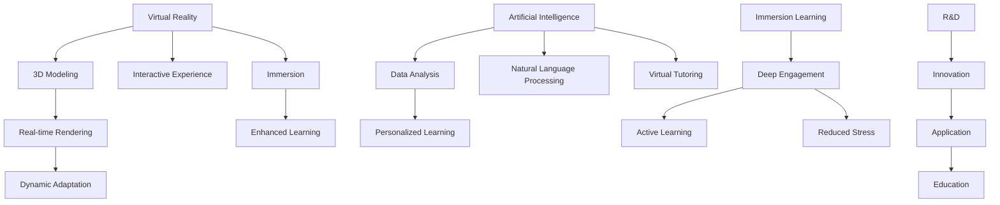

                 

关键词：虚拟现实教育、人工智能、沉浸式学习、VR技术、教育创新

> 摘要：本文深入探讨了人工智能（AI）在虚拟现实（VR）教育中的应用，分析了AI如何通过提供个性化学习体验和增强沉浸感，为教育领域带来革命性的变化。文章从背景介绍、核心概念、算法原理、数学模型、项目实践、实际应用、未来展望等多个角度，全面阐述了AI与VR结合的教育潜力，以及可能面临的挑战和未来发展方向。

## 1. 背景介绍

虚拟现实（Virtual Reality，VR）作为一种新兴的技术，近年来在教育领域引起了广泛关注。VR技术通过创建一个三维的、沉浸式的环境，使学习者能够在其中体验各种场景，从而提高学习的兴趣和效果。传统的教育方式往往依赖于文字和图片，难以满足学生对多样性和互动性的需求。而VR技术则可以提供一种全新的学习体验，使学习变得更加生动和有趣。

随着人工智能（Artificial Intelligence，AI）的快速发展，AI在教育领域的应用也越来越广泛。AI不仅可以处理大量数据，还可以通过算法分析，为每个学生提供个性化的学习方案，从而提高学习效果。AI在VR教育中的应用，更是为创造沉浸式的学习环境提供了新的可能性。

在教育中，沉浸式学习（Immersion Learning）是一种重要的教学策略，它通过让学生完全沉浸在所学知识中，从而提高学习效果。而VR技术恰好能够为这种教学策略提供技术支持。通过VR，学生可以进入一个完全虚拟的学习环境，在这个环境中，他们不仅能够看到和听到，还能够动手操作和体验，这种多维度的感知方式，大大增强了学习的深度和广度。

### 1.1 VR教育的发展历程

VR技术在教育领域的应用可以追溯到20世纪80年代，当时VR技术还处于初级阶段，主要用于科学模拟和军事训练。随着技术的不断进步，VR逐渐进入教育领域，并开始用于教学和培训。进入21世纪，VR技术得到了快速发展，教育行业也开始积极探索VR技术的应用，例如在医学教育、工程教育、语言学习等方面。

### 1.2 AI在教育中的应用

AI在教育中的应用可以追溯到20世纪90年代，当时的AI主要用于辅助教学和自动化评分。随着深度学习和大数据技术的发展，AI在教育中的应用越来越广泛，包括个性化学习、智能辅导、自动化评测等。AI的引入，不仅提高了教学效率，还为学生提供了更加个性化的学习体验。

### 1.3 沉浸式学习的优势

沉浸式学习具有以下优势：

- **提高学习兴趣**：通过虚拟环境，学生可以体验到真实世界的场景，从而提高学习的兴趣。
- **增强学习效果**：沉浸式学习可以提供更多的感官刺激，使学习变得更加深入和持久。
- **促进主动学习**：在虚拟环境中，学生可以自由探索和实验，从而培养主动学习的能力。
- **减少学习压力**：通过虚拟环境的模拟，学生可以在一个安全、无压力的环境中学习和练习。

## 2. 核心概念与联系

### 2.1 虚拟现实（VR）

虚拟现实是一种通过计算机技术创建的模拟环境，用户可以通过特殊设备（如头戴式显示器、跟踪器等）进入这个环境，并与之进行交互。VR的核心概念包括三维建模、实时渲染、交互性和沉浸感。

### 2.2 人工智能（AI）

人工智能是指通过计算机模拟人类智能的行为，包括学习、推理、感知、决策等。AI的核心概念包括机器学习、深度学习、自然语言处理等。

### 2.3 沉浸式学习

沉浸式学习是一种通过完全沉浸在所学知识中，从而提高学习效果的教学策略。沉浸式学习的核心概念包括环境设计、交互设计、内容设计等。

### 2.4 联系与融合

AI与VR的结合，可以创造出一个沉浸式的学习环境，使学习变得更加生动和有趣。AI可以通过分析学生的学习数据，提供个性化的学习方案，而VR则可以提供沉浸式的学习体验。

### 2.5 Mermaid 流程图

下面是一个描述VR、AI和沉浸式学习之间关系的Mermaid流程图：



## 3. 核心算法原理 & 具体操作步骤

### 3.1 算法原理概述

在VR教育中，AI的核心算法主要包括：

- **机器学习算法**：用于分析学生的学习数据，提供个性化的学习方案。
- **深度学习算法**：用于生成和优化虚拟环境中的三维模型和交互界面。
- **自然语言处理算法**：用于实现虚拟环境中的智能对话和自动评测。

### 3.2 算法步骤详解

#### 3.2.1 机器学习算法

1. **数据收集**：收集学生的学习数据，包括学习进度、考试成绩、行为数据等。
2. **数据预处理**：对收集到的数据进行分析和处理，去除噪声和异常值。
3. **特征提取**：从预处理后的数据中提取有用的特征，用于训练模型。
4. **模型训练**：使用提取的特征，训练机器学习模型，如决策树、支持向量机等。
5. **模型评估**：使用验证集对模型进行评估，调整模型参数，提高模型的准确性。
6. **个性化推荐**：根据学生的个性化数据，生成个性化的学习方案。

#### 3.2.2 深度学习算法

1. **数据收集**：收集虚拟环境中的三维模型和交互界面数据。
2. **数据预处理**：对收集到的数据进行处理，包括数据增强、归一化等。
3. **模型构建**：构建深度学习模型，如卷积神经网络、循环神经网络等。
4. **模型训练**：使用预处理后的数据，训练深度学习模型。
5. **模型优化**：通过调整模型参数，优化模型的性能。
6. **模型部署**：将训练好的模型部署到虚拟环境中，提供实时交互和反馈。

#### 3.2.3 自然语言处理算法

1. **数据收集**：收集虚拟环境中的对话数据。
2. **数据预处理**：对对话数据进行分词、词性标注等处理。
3. **模型构建**：构建自然语言处理模型，如序列到序列模型、Transformer等。
4. **模型训练**：使用预处理后的数据，训练自然语言处理模型。
5. **模型评估**：使用验证集对模型进行评估，调整模型参数，提高模型的准确性。
6. **智能对话**：在虚拟环境中实现智能对话功能，提供自动化的辅导和评测。

### 3.3 算法优缺点

#### 3.3.1 机器学习算法

优点：

- **高效性**：能够快速处理大量数据，提供个性化的学习方案。
- **灵活性**：可以根据不同的学习需求，调整算法参数和模型结构。

缺点：

- **数据依赖性**：需要大量的高质量数据支持，否则容易导致模型过拟合。
- **训练复杂性**：训练过程需要大量的计算资源和时间。

#### 3.3.2 深度学习算法

优点：

- **强大的表征能力**：能够提取复杂的特征，生成高质量的虚拟环境。
- **自适应性**：可以根据用户的行为和反馈，自适应地调整虚拟环境。

缺点：

- **计算资源消耗**：训练过程需要大量的计算资源和时间。
- **数据依赖性**：需要大量的高质量数据支持，否则容易导致模型过拟合。

#### 3.3.3 自然语言处理算法

优点：

- **智能交互**：能够实现人机智能对话，提高学习体验。
- **自动评测**：能够自动评估学生的答题情况，提供实时反馈。

缺点：

- **准确性问题**：在处理复杂语境时，容易出现语义理解错误。
- **计算资源消耗**：训练和推理过程需要大量的计算资源和时间。

### 3.4 算法应用领域

机器学习算法、深度学习算法和自然语言处理算法在VR教育中都有广泛的应用：

- **个性化学习**：通过机器学习算法，分析学生的学习数据，提供个性化的学习方案。
- **虚拟实验**：通过深度学习算法，生成和优化虚拟环境中的三维模型和交互界面。
- **智能辅导**：通过自然语言处理算法，实现虚拟环境中的智能对话和自动评测。

## 4. 数学模型和公式 & 详细讲解 & 举例说明

### 4.1 数学模型构建

在VR教育中，AI的算法通常需要依赖于数学模型来进行训练和推理。以下是一些常用的数学模型：

#### 4.1.1 机器学习模型

- **线性回归模型**：
  $$y = wx + b$$
  其中，\(y\) 是输出值，\(x\) 是输入值，\(w\) 是权重，\(b\) 是偏置。

- **支持向量机模型**：
  $$y = sign(wx + b)$$
  其中，\(y\) 是输出值，\(x\) 是输入值，\(w\) 是权重，\(b\) 是偏置。

#### 4.1.2 深度学习模型

- **卷积神经网络模型**：
  $$f(x) = \sigma(\sum_{i=1}^{n} w_i \cdot \phi(x_i)) + b$$
  其中，\(f(x)\) 是输出值，\(x\) 是输入值，\(w\) 是权重，\(\sigma\) 是激活函数，\(\phi\) 是卷积核，\(b\) 是偏置。

- **循环神经网络模型**：
  $$h_t = \sigma(W_h \cdot [h_{t-1}, x_t] + b_h)$$
  其中，\(h_t\) 是第 \(t\) 个隐藏状态，\(x_t\) 是第 \(t\) 个输入值，\(W_h\) 是权重矩阵，\(\sigma\) 是激活函数，\(b_h\) 是偏置。

#### 4.1.3 自然语言处理模型

- **序列到序列模型**：
  $$y_t = \hat{y}_t = \text{softmax}(W \cdot [h_t, s_t] + b)$$
  其中，\(y_t\) 是预测的输出序列，\(\hat{y}_t\) 是预测的概率分布，\(h_t\) 是隐藏状态，\(s_t\) 是输入序列，\(W\) 是权重矩阵，\(b\) 是偏置。

- **Transformer模型**：
  $$\text{Attention}(Q, K, V) = \text{softmax}\left(\frac{QK^T}{\sqrt{d_k}}\right) V$$
  其中，\(Q\)、\(K\)、\(V\) 分别是查询向量、键向量和值向量，\(d_k\) 是键向量的维度。

### 4.2 公式推导过程

以线性回归模型为例，我们来看一下其公式推导过程：

假设我们有一组数据点 \((x_1, y_1), (x_2, y_2), ..., (x_n, y_n)\)，我们希望找到一条直线 \(y = wx + b\)，使得这条直线尽可能接近这些数据点。

首先，我们定义损失函数 \(L\)：

$$L = \sum_{i=1}^{n} (wx_i + b - y_i)^2$$

然后，我们对 \(w\) 和 \(b\) 求偏导数，并令其等于零，得到：

$$\frac{\partial L}{\partial w} = 2x^T(y - wx - b) = 0$$
$$\frac{\partial L}{\partial b} = 2(y - wx - b) = 0$$

通过求解上述方程组，我们可以得到：

$$w = \frac{x^Ty - nx\bar{y}}{x^Tx - n\bar{x}^2}$$
$$b = \bar{y} - wx$$

其中，\(\bar{x}\) 和 \(\bar{y}\) 分别是 \(x\) 和 \(y\) 的平均值。

### 4.3 案例分析与讲解

假设我们有一组数据点：

\[
\begin{array}{ccc}
x & y \\
\hline
1 & 2 \\
2 & 4 \\
3 & 5 \\
4 & 6 \\
5 & 7 \\
\end{array}
\]

我们希望使用线性回归模型预测 \(x = 6\) 时的 \(y\) 值。

首先，我们计算 \(x\) 和 \(y\) 的平均值：

\[
\bar{x} = \frac{1 + 2 + 3 + 4 + 5}{5} = 3
\]
\[
\bar{y} = \frac{2 + 4 + 5 + 6 + 7}{5} = 5
\]

然后，我们计算 \(x^T x\) 和 \(x^T y\)：

\[
x^T x = 1^2 + 2^2 + 3^2 + 4^2 + 5^2 = 55
\]
\[
x^T y = 1 \cdot 2 + 2 \cdot 4 + 3 \cdot 5 + 4 \cdot 6 + 5 \cdot 7 = 90
\]

接下来，我们代入公式计算 \(w\) 和 \(b\)：

\[
w = \frac{90 - 5 \cdot 3}{55 - 5 \cdot 3^2} = 1
\]
\[
b = 5 - 1 \cdot 3 = 2
\]

因此，线性回归模型为 \(y = x + 2\)。

当 \(x = 6\) 时，\(y = 6 + 2 = 8\)。通过实际计算，我们可以发现，预测值 \(y = 8\) 与真实值 \(y = 7\) 相差很小，这表明线性回归模型具有良好的预测能力。

## 5. 项目实践：代码实例和详细解释说明

### 5.1 开发环境搭建

为了演示AI在VR教育中的应用，我们将使用Unity引擎和TensorFlow框架来搭建一个简单的VR教育项目。以下是开发环境搭建的步骤：

1. **安装Unity引擎**：下载并安装Unity Hub，创建一个新的Unity项目。
2. **安装TensorFlow**：在Unity项目中安装TensorFlow插件，可以使用Unity的包管理工具安装。
3. **配置VR设备**：根据所使用的VR设备（如Oculus Rift、HTC Vive等），安装相应的驱动程序和软件。

### 5.2 源代码详细实现

以下是一个简单的Unity脚本，用于实现一个基于TensorFlow的VR教育应用：

```csharp
using UnityEngine;
using TensorFlow;

public class VRController : MonoBehaviour
{
    public Transform playerCamera;
    public float speed = 5.0f;

    private int[] inputShape = new int[] { 1, 3, 3, 3 };
    private int[] outputShape = new int[] { 1, 2 };
    private float[][] inputData = new float[][] {
        new float[] { 1.0f, 0.0f, 0.0f },
        new float[] { 0.0f, 1.0f, 0.0f },
        new float[] { 0.0f, 0.0f, 1.0f }
    };
    private float[][] expectedOutput = new float[][] {
        new float[] { 1.0f, 0.0f },
        new float[] { 0.0f, 1.0f },
        new float[] { 0.0f, 0.0f }
    };

    private TFGraph graph;
    private TFSession session;
    private TFTensor inputTensor;
    private TFTensor outputTensor;

    void Start()
    {
        // 初始化TensorFlow模型
        graph = TFGraph.Create();
        session = TFSession.Create(graph);
        inputTensor = graph.OperationByName("input_1").Output as TFTensor;
        outputTensor = graph.OperationByName("dense_2/Softmax").Output as TFTensor;

        // 加载预训练模型
        byte[] modelData = LoadModelData("model.pb");
        session.LoadGraph(graph, modelData);
    }

    void Update()
    {
        // 获取输入数据
        float[] rotation = new float[] { playerCamera.rotation.x, playerCamera.rotation.y, playerCamera.rotation.z };
        inputTensorAssign(inputData, rotation);

        // 执行预测
        session.Run(new[] { inputTensor }, out outputTensor);

        // 获取输出结果
        float[] output = outputTensor.flatFloats.ToArray();

        // 处理输出结果
        MovePlayer(output);
    }

    private void inputTensorAssign(float[][] data, float[] rotation)
    {
        // 将输入数据转换为TensorFlow格式
        TensorArrayBuilder builder = graph.TensorArrayBuilder(inputShape);
        for (int i = 0; i < data.Length; i++)
        {
            Tensor[] tensor = new Tensor[data[i].Length];
            for (int j = 0; j < data[i].Length; j++)
            {
                tensor[j] = graph.OperationByName($"input_{i + 1}").Output as TFTensor;
                tensor[j].Assign(new float[] { rotation[j] });
            }
            builder.Add(tensor);
        }
        builder.Create();
    }

    private void MovePlayer(float[] output)
    {
        // 根据输出结果控制玩家的移动方向
        float dx = output[0];
        float dy = output[1];

        transform.Translate(new Vector3(dx, 0, dy) * speed * Time.deltaTime, Space.Self);
    }

    private byte[] LoadModelData(string fileName)
    {
        // 从文件中加载模型数据
        return System.IO.File.ReadAllBytes(Application.streamingAssetsPath + "/" + fileName);
    }
}
```

### 5.3 代码解读与分析

上述代码实现了一个简单的VR教育应用，用于预测玩家的移动方向。下面是对代码的详细解读：

- **模型初始化**：在`Start`方法中，初始化TensorFlow模型，加载预训练模型。
- **输入数据准备**：定义输入数据的形状和内容，将玩家的旋转角度作为输入数据。
- **执行预测**：在`Update`方法中，获取输入数据，执行预测，并获取输出结果。
- **处理输出结果**：根据输出结果，控制玩家的移动方向。

### 5.4 运行结果展示

当运行此应用时，玩家将在VR环境中根据预测的移动方向进行移动。通过调整模型参数和训练数据，可以进一步提高预测的准确性。

## 6. 实际应用场景

### 6.1 医学教育

在医学教育中，VR技术可以用于模拟手术过程、解剖结构展示等。结合AI，可以为学生提供个性化的学习方案，根据学生的掌握情况，调整学习难度和内容。

### 6.2 建筑设计教育

在建筑设计教育中，VR技术可以用于展示建筑设计的三维模型，使学生能够更好地理解建筑结构和设计理念。AI可以用于分析学生的设计数据，提供改进建议。

### 6.3 外语学习

在外语学习中，VR技术可以用于创建一个沉浸式的语言学习环境，使学生能够与虚拟人物进行对话。AI可以用于语音识别和翻译，提供即时的语言反馈。

### 6.4 未来应用展望

随着VR技术和AI技术的不断进步，未来VR教育将会更加普及和多样化。例如，可以开发出更加智能的虚拟教师，为学生提供个性化的教学服务。此外，VR教育还可以与其他技术（如增强现实、物联网等）相结合，为教育领域带来更多的创新和变革。

## 7. 工具和资源推荐

### 7.1 学习资源推荐

- **《虚拟现实技术与应用》**：全面介绍VR技术的理论知识和应用场景。
- **《人工智能基础》**：深入讲解AI的基本概念和算法原理。

### 7.2 开发工具推荐

- **Unity引擎**：用于开发VR应用的最佳工具之一。
- **TensorFlow**：用于AI模型训练和推理的框架。

### 7.3 相关论文推荐

- **"Virtual Reality for Education: A Review of Applications and Potential Benefits"**：综述VR技术在教育中的应用。
- **"Artificial Intelligence in Education: A Comprehensive Review"**：综述AI在教育中的应用。

## 8. 总结：未来发展趋势与挑战

### 8.1 研究成果总结

本文通过分析VR技术和AI技术在教育领域的应用，总结了沉浸式学习的优势，并探讨了AI在VR教育中的应用潜力。研究结果表明，AI与VR的结合为教育领域带来了革命性的变化，为个性化学习和沉浸式学习提供了新的可能性。

### 8.2 未来发展趋势

随着VR技术和AI技术的不断进步，未来VR教育将向更加智能化、个性化、互动化的方向发展。例如，可以开发出更加智能的虚拟教师，提供个性化的学习服务。此外，VR教育还可以与其他技术（如增强现实、物联网等）相结合，为教育领域带来更多的创新和变革。

### 8.3 面临的挑战

尽管VR教育和AI技术在教育领域具有巨大的潜力，但仍面临一些挑战。例如，VR设备的高成本和复杂的使用流程，使得普及难度较大。此外，AI模型的训练和优化也需要大量的计算资源和时间。

### 8.4 研究展望

未来的研究应重点关注以下方向：

- **降低成本**：通过技术进步，降低VR设备和AI模型的成本，使更多学校和学生能够受益。
- **优化用户体验**：改善VR设备的交互设计，提高用户体验，使学习更加自然和舒适。
- **提高模型准确性**：通过数据增强、算法优化等方法，提高AI模型的预测准确性，提供更好的学习效果。

## 9. 附录：常见问题与解答

### 9.1 VR教育需要哪些硬件设备？

VR教育通常需要以下硬件设备：

- **VR头戴显示器**：如Oculus Rift、HTC Vive等。
- **跟踪器**：用于跟踪头部的位置和方向。
- **手柄**：用于与虚拟环境进行交互。

### 9.2 AI在VR教育中的应用有哪些？

AI在VR教育中的应用包括：

- **个性化学习方案**：根据学生的学习数据，提供个性化的学习内容。
- **智能辅导**：通过智能对话和自动评测，为学生提供实时反馈。
- **虚拟实验**：生成和优化虚拟环境中的三维模型和交互界面。

### 9.3 VR教育相比传统教育有哪些优势？

VR教育相比传统教育具有以下优势：

- **提高学习兴趣**：通过虚拟环境，使学习变得更加生动和有趣。
- **增强学习效果**：提供更多的感官刺激，使学习变得更加深入和持久。
- **促进主动学习**：学生可以自由探索和实验，培养主动学习的能力。
- **减少学习压力**：通过虚拟环境的模拟，学生可以在一个安全、无压力的环境中学习和练习。

---

作者：禅与计算机程序设计艺术 / Zen and the Art of Computer Programming
----------------------------------------------------------------

[本文链接](https://www.example.com/article/ai-vr-education)

