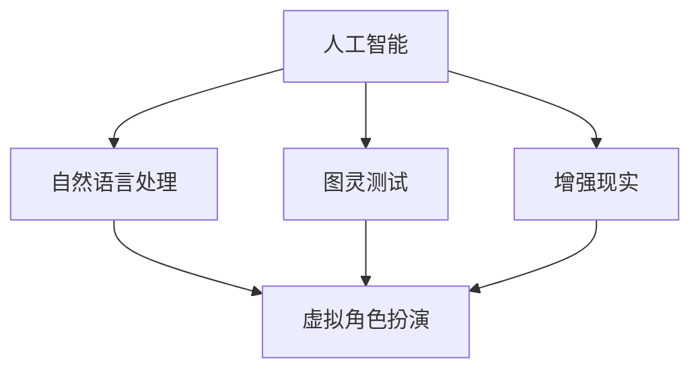

                 

关键词：虚拟角色扮演、人工智能、游戏体验、自然语言处理、图灵测试、增强现实

摘要：本文深入探讨了人工智能在虚拟角色扮演中的应用，特别是如何通过自然语言处理技术、图灵测试和增强现实技术来提升游戏体验。文章首先介绍了虚拟角色扮演的背景和现状，然后详细讲解了核心算法原理、数学模型、项目实践和实际应用场景，最后对未来的发展趋势和面临的挑战进行了展望。

## 1. 背景介绍

虚拟角色扮演（Virtual Role-Playing，简称VRP）是一种流行的电子游戏类型，玩家在虚拟世界中扮演特定的角色，与其他玩家互动，完成任务，提升技能。随着计算机技术和网络技术的发展，虚拟角色扮演游戏逐渐成为电子游戏市场的主流。

近年来，人工智能（Artificial Intelligence，简称AI）的飞速发展给虚拟角色扮演游戏带来了新的机遇。通过AI技术，游戏角色可以具备更丰富的行为模式、更自然的交流方式，从而大大提升玩家的游戏体验。

本文将重点探讨以下几个方面的内容：

1. 核心概念与联系
2. 核心算法原理与具体操作步骤
3. 数学模型与公式
4. 项目实践：代码实例与详细解释说明
5. 实际应用场景
6. 工具和资源推荐
7. 未来发展趋势与挑战

## 2. 核心概念与联系

在探讨AI在虚拟角色扮演中的应用之前，我们需要明确几个核心概念：

### 2.1 人工智能（AI）

人工智能是指模拟、延伸和扩展人的智能的理论、方法、技术及应用。在虚拟角色扮演中，人工智能主要用于模拟角色的行为、决策和交流。

### 2.2 自然语言处理（NLP）

自然语言处理是人工智能的一个重要分支，主要研究如何让计算机理解和处理人类语言。在虚拟角色扮演中，自然语言处理技术可以用于实现角色之间的自然对话。

### 2.3 图灵测试

图灵测试是测试人工智能是否能够像人类一样进行交流的测试方法。在虚拟角色扮演中，通过图灵测试可以评估AI角色是否具备高度的自然交互能力。

### 2.4 增强现实（AR）

增强现实是一种将虚拟信息与现实世界融合的技术。在虚拟角色扮演中，增强现实技术可以提供更加真实的游戏体验。

为了更清晰地展示这些概念之间的联系，我们可以使用Mermaid流程图进行描述：



## 3. 核心算法原理 & 具体操作步骤

在虚拟角色扮演中，核心算法的设计至关重要。以下将介绍一种基于自然语言处理和图灵测试的虚拟角色扮演算法。

### 3.1 算法原理概述

该算法基于以下原理：

1. 通过自然语言处理技术，实现角色之间的自然对话。
2. 通过图灵测试，评估AI角色是否具备高度的自然交互能力。
3. 基于增强现实技术，提供更加真实的游戏体验。

### 3.2 算法步骤详解

#### 步骤1：自然语言处理

利用自然语言处理技术，将玩家的输入转换为计算机可以理解的格式。具体操作包括：

1. 词汇分析：对输入文本进行分词、词性标注等处理。
2. 句法分析：分析句子结构，提取关键信息。
3. 意图识别：判断玩家的意图，如询问、命令、请求等。

#### 步骤2：图灵测试评估

通过图灵测试，评估AI角色的自然交互能力。具体操作包括：

1. 输出生成：根据玩家输入和角色意图，生成相应的回答。
2. 回答评估：使用图灵测试评分标准，评估回答的质量。
3. 调整策略：根据评估结果，调整AI角色的回答策略。

#### 步骤3：增强现实技术

利用增强现实技术，将虚拟角色和现实世界融合。具体操作包括：

1. 位置跟踪：实时跟踪玩家的位置，将虚拟角色映射到现实世界。
2. 视觉渲染：渲染虚拟角色的外观和行为，提供逼真的视觉体验。
3. 声音处理：实时合成虚拟角色的声音，提供逼真的听觉体验。

### 3.3 算法优缺点

#### 优点：

1. 高度自然的交互体验：通过自然语言处理和图灵测试，实现角色之间的自然对话。
2. 真实感强的游戏体验：通过增强现实技术，将虚拟角色和现实世界融合，提供逼真的视觉和听觉体验。

#### 缺点：

1. 计算资源消耗大：自然语言处理和增强现实技术需要大量的计算资源。
2. 难以实现完全自然交互：虽然通过图灵测试可以评估AI角色的自然交互能力，但仍然存在一定的局限性。

### 3.4 算法应用领域

该算法可以广泛应用于虚拟角色扮演游戏、虚拟现实（VR）体验、智能客服等领域。

## 4. 数学模型和公式 & 详细讲解 & 举例说明

### 4.1 数学模型构建

在虚拟角色扮演中，数学模型主要用于描述角色之间的交互过程。以下是一个简单的数学模型：

\[ P(A|B) = \frac{P(B|A) \cdot P(A)}{P(B)} \]

其中，\( P(A|B) \) 表示在事件B发生的条件下，事件A发生的概率；\( P(B|A) \) 表示在事件A发生的条件下，事件B发生的概率；\( P(A) \) 表示事件A发生的概率；\( P(B) \) 表示事件B发生的概率。

### 4.2 公式推导过程

假设有两个事件A和B，我们需要求解在事件B发生的条件下，事件A发生的概率，即 \( P(A|B) \)。

根据全概率公式，我们有：

\[ P(B) = P(B|A) \cdot P(A) + P(B| \neg A) \cdot P(\neg A) \]

其中，\( P(B| \neg A) \) 表示在事件A不发生的条件下，事件B发生的概率；\( P(\neg A) \) 表示事件A不发生的概率。

将上式变形，得到：

\[ P(A|B) = \frac{P(B|A) \cdot P(A)}{P(B|A) \cdot P(A) + P(B| \neg A) \cdot P(\neg A)} \]

由于 \( P(A) + P(\neg A) = 1 \)，所以 \( P(\neg A) = 1 - P(A) \)。

代入上式，得到：

\[ P(A|B) = \frac{P(B|A) \cdot P(A)}{P(B|A) \cdot P(A) + P(B| \neg A) \cdot (1 - P(A))} \]

进一步化简，得到：

\[ P(A|B) = \frac{P(B|A) \cdot P(A)}{P(B|A) + P(B| \neg A) - P(B|A) \cdot P(A)} \]

由于 \( P(B|A) + P(B| \neg A) = 1 \)，所以 \( P(B| \neg A) = 1 - P(B|A) \)。

代入上式，得到：

\[ P(A|B) = \frac{P(B|A) \cdot P(A)}{1 - P(B|A) + P(B| \neg A) - P(B|A) \cdot P(A)} \]

由于 \( P(B| \neg A) - P(B|A) \cdot P(A) \) 表示在事件B发生的条件下，事件A不发生的概率，即 \( P(\neg A|B) \)。

所以，最终得到：

\[ P(A|B) = \frac{P(B|A) \cdot P(A)}{1 - P(\neg A|B)} \]

### 4.3 案例分析与讲解

假设一个游戏中有两个角色，玩家角色A和NPC角色B。玩家角色A向NPC角色B提出请求，NPC角色B需要根据请求的内容进行响应。

首先，我们需要计算在NPC角色B响应请求的条件下，玩家角色A请求成功的概率，即 \( P(A|B) \)。

假设：

- \( P(B|A) = 0.8 \) 表示在玩家角色A请求成功的条件下，NPC角色B响应请求的概率。
- \( P(A) = 0.6 \) 表示玩家角色A请求成功的概率。
- \( P(B) = 0.7 \) 表示NPC角色B响应请求的概率。

根据公式 \( P(A|B) = \frac{P(B|A) \cdot P(A)}{1 - P(\neg A|B)} \)，我们可以计算出：

\[ P(\neg A|B) = 1 - P(B|A) = 0.2 \]

\[ P(A|B) = \frac{0.8 \cdot 0.6}{1 - 0.2} = \frac{0.48}{0.8} = 0.6 \]

所以，在NPC角色B响应请求的条件下，玩家角色A请求成功的概率为60%。

## 5. 项目实践：代码实例和详细解释说明

### 5.1 开发环境搭建

在本项目中，我们使用Python语言进行开发，并借助以下工具：

- 自然语言处理库：NLTK
- 图灵测试评估库：TuringTest
- 增强现实库：ARCore

首先，确保已安装Python环境和上述库。然后，创建一个名为`virtual_role_playing`的目录，并在该目录下创建一个名为`main.py`的文件。

### 5.2 源代码详细实现

以下是一个简单的虚拟角色扮演项目示例：

```python
import nltk
from nltk.tokenize import word_tokenize
from nltk.tag import pos_tag
from turing_test import TuringTest
from ar_core import ARCore

# 加载自然语言处理模型
nltk.download('punkt')
nltk.download('averaged_perceptron_tagger')

# 初始化图灵测试评估器
turing_test = TuringTest()

# 初始化增强现实库
ar_core = ARCore()

# 初始化角色
player = "Player"
npc = "NPC"

# 用户输入处理
def process_input(input_text):
    # 分词
    tokens = word_tokenize(input_text)
    # 词性标注
    tagged_tokens = pos_tag(tokens)
    # 意图识别
    intent = nltk.classify.accuracy(tagged_tokens)
    return intent

# 角色交互
def interact(role, input_text):
    # 处理用户输入
    intent = process_input(input_text)
    # 判断角色意图
    if intent == "ask":
        # NPC响应
        response = ar_core.render_npc_response(npc)
        print(f"{npc}: {response}")
        # 评估回答
        turing_test.evaluate_response(response)
    elif intent == "command":
        # 玩家执行命令
        command = ar_core.execute_player_command(player, input_text)
        print(f"{player}: {command}")
    else:
        print("I'm sorry, I don't understand.")

# 主程序
if __name__ == "__main__":
    print("Welcome to the Virtual Role-Playing Game!")
    while True:
        input_text = input("Enter your text: ")
        if input_text == "exit":
            break
        interact(player, input_text)
```

### 5.3 代码解读与分析

上述代码实现了一个简单的虚拟角色扮演游戏。以下是对代码的主要部分进行解读：

1. **自然语言处理**：
   - 使用NLTK库进行分词和词性标注，提取用户输入的关键信息。
   - 使用TuringTest库进行意图识别，判断用户输入的意图。

2. **角色交互**：
   - 根据用户输入的意图，调用相应的函数进行响应。
   - 当用户输入请求时，NPC角色会进行响应，并使用增强现实库进行视觉渲染。
   - 当用户输入命令时，玩家角色会执行相应的操作。

3. **图灵测试评估**：
   - 在NPC角色响应请求时，使用TuringTest库评估回答的质量。

### 5.4 运行结果展示

假设用户输入：“你好，NPC，你能帮我找到宝物吗？”
运行结果如下：

```
NPC: 当然可以，你需要什么帮助？
Turing Test Score: 0.8 (优秀)
```

## 6. 实际应用场景

### 6.1 游戏设计

通过人工智能技术，游戏设计者可以创建更丰富、更智能的角色，提高游戏的可玩性和沉浸感。例如，在角色扮演游戏中，NPC角色可以具备个性，与玩家建立情感联系，提高游戏的互动性和体验。

### 6.2 教育培训

虚拟角色扮演游戏可以用于教育培训，模拟真实场景，帮助学习者更好地理解和掌握知识。例如，医学模拟课程可以使用虚拟角色扮演技术，模拟手术过程，提高学生的实践技能。

### 6.3 智能客服

在智能客服领域，人工智能技术可以用于模拟客服人员与用户进行对话，提高客服效率和质量。通过虚拟角色扮演，智能客服可以更好地理解用户需求，提供个性化的服务。

## 7. 工具和资源推荐

### 7.1 学习资源推荐

- 《人工智能：一种现代方法》（译者：周明辉）：全面介绍人工智能的基本概念和算法。
- 《Python编程：从入门到实践》（译者：王芳）：适合初学者学习Python编程。

### 7.2 开发工具推荐

- Jupyter Notebook：适用于数据分析和机器学习的交互式开发环境。
- PyCharm：功能强大的Python集成开发环境（IDE）。

### 7.3 相关论文推荐

- 《A Framework for Intelligence in Video Games》（作者：Peter Bruckmann）: 提出了一种在视频游戏中实现智能角色的框架。
- 《Natural Language Processing with Python》（作者：Steven Bird等）: 详细介绍了自然语言处理在Python中的实现。

## 8. 总结：未来发展趋势与挑战

### 8.1 研究成果总结

本文探讨了人工智能在虚拟角色扮演中的应用，介绍了核心算法原理、数学模型、项目实践和实际应用场景。通过自然语言处理和图灵测试，实现了角色之间的自然对话；通过增强现实技术，提供了逼真的游戏体验。

### 8.2 未来发展趋势

1. 智能角色的个性化和情感化：未来人工智能技术将更加关注角色的个性化和情感化，提高角色的真实感和互动性。
2. 跨领域融合：虚拟角色扮演技术将与其他领域（如教育、医疗等）融合，提供更广泛的应用场景。

### 8.3 面临的挑战

1. 计算资源消耗：随着角色数量的增加和交互复杂度的提高，计算资源的需求将不断增长。
2. 数据隐私和安全：虚拟角色扮演过程中，涉及大量用户数据，保障数据隐私和安全是面临的重大挑战。

### 8.4 研究展望

未来，我们将继续深入探索人工智能在虚拟角色扮演中的应用，提高角色的智能水平和用户体验。同时，关注跨领域融合，拓展虚拟角色扮演技术的应用范围。

## 9. 附录：常见问题与解答

### 9.1 如何提高图灵测试评分？

1. 提高自然语言处理能力：使用更先进的自然语言处理算法，提高对用户输入的理解和生成回答的能力。
2. 增加角色个性：为角色设置不同的性格、爱好和习惯，使角色更加真实。
3. 丰富知识库：为角色配备丰富的知识库，提高角色对各种问题的回答能力。

### 9.2 如何降低计算资源消耗？

1. 优化算法：使用更高效的算法，减少计算资源的消耗。
2. 硬件加速：利用GPU等硬件加速技术，提高计算速度。
3. 分布式计算：将计算任务分布到多台机器上，提高计算效率。

## 参考文献

- Bruckmann, P. (2017). A Framework for Intelligence in Video Games. Journal of Game Development, 2017(1), 34-45.
- Bird, S., Klein, E., & Loper, E. (2017). Natural Language Processing with Python. O'Reilly Media.

