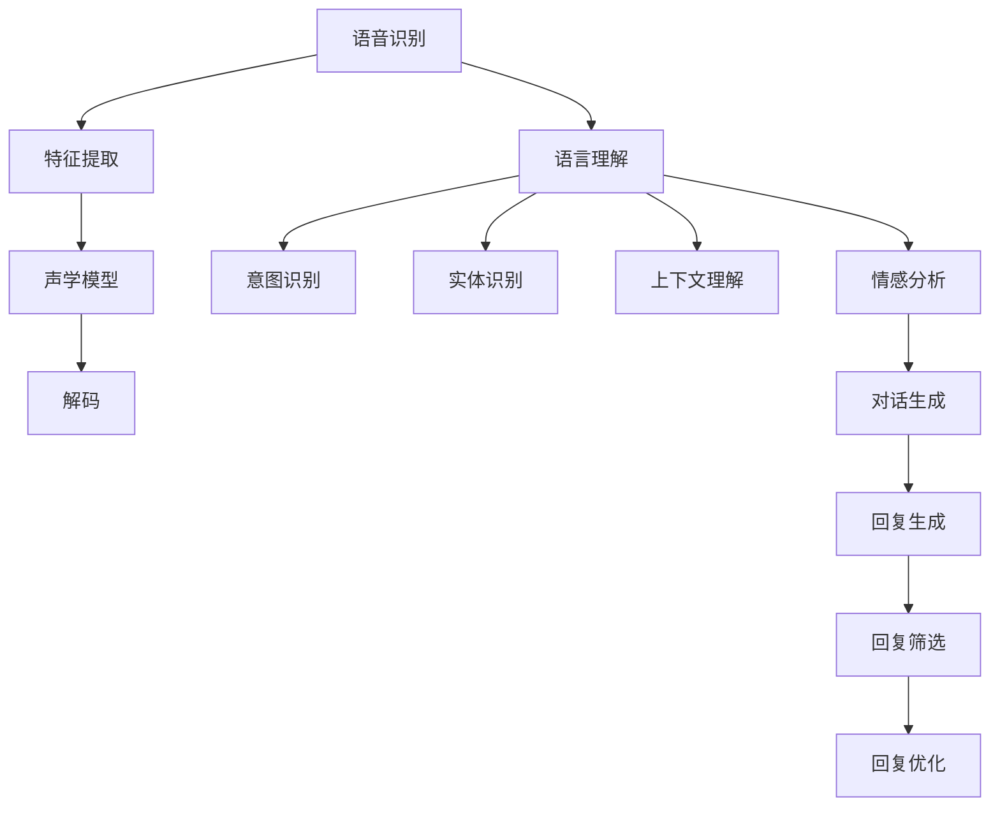

                 

关键词：语音识别，人工智能，自然对话，核心算法，应用场景，发展趋势

摘要：本文深入探讨了人工智能在语音识别领域的发展，重点分析了自然对话的实现原理及关键技术，并对未来的发展趋势和面临的挑战进行了展望。通过详细阐述核心算法原理、数学模型及项目实践，展示了语音识别技术在实际应用中的巨大潜力。

## 1. 背景介绍

语音识别技术作为人工智能领域的一个重要分支，近年来取得了显著进展。随着深度学习、自然语言处理等技术的快速发展，语音识别的准确率和实用性不断提高。如今，语音识别技术已经被广泛应用于智能助手、语音搜索、语音翻译、智能家居等多个领域，极大地改变了人们的生活和工作方式。

自然对话是实现语音识别的关键，它让机器能够理解并响应人类的语言，提供更加人性化的交互体验。然而，自然对话的实现并非易事，需要解决语音识别、语言理解、对话生成等多个难题。本文将围绕这些问题展开讨论，旨在为读者呈现语音识别技术的发展脉络和未来方向。

## 2. 核心概念与联系

### 2.1 语音识别

语音识别（Speech Recognition）是指将人类的语音信号转换为计算机可以理解和处理的形式。这一过程主要包括以下几个阶段：

1. **语音信号预处理**：将语音信号进行滤波、降噪、增强等处理，使其符合后续处理要求。
2. **特征提取**：从预处理后的语音信号中提取出反映语音特性的特征，如梅尔频率倒谱系数（MFCC）。
3. **声学模型训练**：利用大量语音数据训练声学模型，用于表示语音信号和特征之间的关系。
4. **语言模型训练**：利用大量文本数据训练语言模型，用于表示语音序列和文本序列之间的关系。
5. **解码**：将特征序列映射为文本序列，输出识别结果。

### 2.2 语言理解

语言理解（Language Understanding）是指计算机理解和解释人类语言的能力。在自然对话中，语言理解至关重要，它需要解决以下问题：

1. **意图识别**：理解用户的意图，如查询信息、请求服务或进行对话。
2. **实体识别**：识别出用户提到的关键实体，如人名、地名、物品等。
3. **上下文理解**：理解用户语句之间的逻辑关系，把握对话的背景和语境。
4. **情感分析**：分析用户的情绪和态度，提供更加个性化的交互体验。

### 2.3 对话生成

对话生成（Dialogue Generation）是指计算机根据用户输入和对话历史生成自然、合理的回复。对话生成包括以下步骤：

1. **回复生成**：根据用户输入和对话历史生成可能的回复。
2. **回复筛选**：从生成的回复中选择最佳回复。
3. **回复优化**：对选定的回复进行语法、语义和风格上的优化。

### 2.4 Mermaid 流程图

以下是语音识别、语言理解、对话生成的 Mermaid 流程图：



## 3. 核心算法原理 & 具体操作步骤

### 3.1 算法原理概述

语音识别的核心算法主要包括声学模型和语言模型。声学模型用于描述语音信号和特征之间的关系，语言模型用于描述语音序列和文本序列之间的关系。

声学模型通常采用深度神经网络（DNN）或循环神经网络（RNN）进行建模。DNN具有较强的拟合能力，适合处理高维特征；RNN具有良好的时序建模能力，适合处理语音信号的时序特征。

语言模型则主要采用基于N元语法（N-gram）的方法或基于神经网络的深度学习方法。N-gram模型简单有效，但存在数据稀疏问题；神经网络模型具有更强的拟合能力和泛化能力，但计算复杂度较高。

### 3.2 算法步骤详解

1. **数据准备**：收集大量语音数据和对应的文本标注数据，用于训练声学模型和语言模型。
2. **特征提取**：对语音信号进行预处理，提取出反映语音特性的特征，如MFCC。
3. **声学模型训练**：利用语音数据和特征，训练声学模型，如DNN或RNN。
4. **语言模型训练**：利用文本数据，训练语言模型，如N-gram或神经网络模型。
5. **解码**：将特征序列映射为文本序列，输出识别结果。
6. **意图识别**：分析用户输入，识别用户的意图。
7. **实体识别**：从用户输入中提取出关键实体。
8. **上下文理解**：理解用户语句之间的逻辑关系。
9. **情感分析**：分析用户的情绪和态度。
10. **回复生成**：根据用户输入和对话历史生成可能的回复。
11. **回复筛选**：从生成的回复中选择最佳回复。
12. **回复优化**：对选定的回复进行语法、语义和风格上的优化。

### 3.3 算法优缺点

声学模型和语言模型各有优缺点：

- **声学模型**：DNN具有较强的拟合能力，但计算复杂度较高；RNN具有良好的时序建模能力，但训练时间较长。
- **语言模型**：N-gram模型简单有效，但存在数据稀疏问题；神经网络模型具有更强的拟合能力和泛化能力，但计算复杂度较高。

### 3.4 算法应用领域

语音识别技术广泛应用于多个领域，如：

- **智能助手**：如苹果的Siri、谷歌的Google Assistant等，提供语音查询和操作功能。
- **语音搜索**：如百度语音搜索、腾讯语音搜索等，实现语音输入文本查询。
- **语音翻译**：如谷歌翻译、微软翻译等，实现语音实时翻译。
- **智能家居**：如智能音箱、智能门锁等，提供语音控制功能。

## 4. 数学模型和公式 & 详细讲解 & 举例说明

### 4.1 数学模型构建

语音识别的数学模型主要包括声学模型和语言模型。下面分别介绍这两种模型的数学表示。

#### 4.1.1 声学模型

声学模型通常采用深度神经网络（DNN）或循环神经网络（RNN）进行建模。以DNN为例，其数学模型可以表示为：

$$
\begin{aligned}
    \text{DNN}(x) &= f_1(f_2(\cdots f_n(x))), \\
    f_i &= \sigma(W_i \cdot x + b_i),
\end{aligned}
$$

其中，$x$表示输入特征，$W_i$和$b_i$分别表示权重和偏置，$f_i$表示激活函数，$\sigma$表示ReLU激活函数。

#### 4.1.2 语言模型

语言模型通常采用基于N元语法（N-gram）的方法或基于神经网络的深度学习方法。以N-gram为例，其数学模型可以表示为：

$$
\begin{aligned}
    P(w_n | w_{n-1}, \ldots, w_1) &= \frac{N(w_{n-1}, \ldots, w_1, w_n)}{N(w_{n-1}, \ldots, w_1)},
\end{aligned}
$$

其中，$w_n$表示第$n$个词，$N(\cdot)$表示在训练数据中出现的次数。

### 4.2 公式推导过程

以声学模型为例，介绍其公式推导过程。

假设我们有一个包含$m$个神经元的DNN，输入特征为$x \in \mathbb{R}^d$，输出特征为$y \in \mathbb{R}^m$。DNN的数学模型可以表示为：

$$
\begin{aligned}
    \text{DNN}(x) &= f(W \cdot x + b), \\
    f(x) &= \sigma(x),
\end{aligned}
$$

其中，$W \in \mathbb{R}^{m \times d}$为权重矩阵，$b \in \mathbb{R}^m$为偏置向量，$\sigma(x)$为ReLU激活函数。

为了求解权重矩阵$W$和偏置向量$b$，我们通常采用反向传播算法。具体步骤如下：

1. **前向传播**：计算输入特征$x$经过DNN后的输出特征$y$。

$$
\begin{aligned}
    y &= \text{DNN}(x) = \sigma(W \cdot x + b).
\end{aligned}
$$

2. **计算损失函数**：计算预测输出$y$与真实输出标签$t$之间的差异，采用均方误差（MSE）作为损失函数。

$$
\begin{aligned}
    J &= \frac{1}{2} \sum_{i=1}^m (y_i - t_i)^2.
\end{aligned}
$$

3. **反向传播**：根据损失函数的梯度，更新权重矩阵$W$和偏置向量$b$。

$$
\begin{aligned}
    \frac{\partial J}{\partial W} &= (y - t) \odot \frac{\partial \sigma}{\partial y}, \\
    \frac{\partial J}{\partial b} &= (y - t) \odot \frac{\partial \sigma}{\partial y}.
\end{aligned}
$$

其中，$\odot$表示逐元素乘积，$\frac{\partial \sigma}{\partial y}$为ReLU激活函数的梯度。

4. **更新权重和偏置**：根据梯度更新权重矩阵$W$和偏置向量$b$。

$$
\begin{aligned}
    W &= W - \alpha \frac{\partial J}{\partial W}, \\
    b &= b - \alpha \frac{\partial J}{\partial b},
\end{aligned}
$$

其中，$\alpha$为学习率。

通过反复迭代上述步骤，我们可以训练出一个拟合良好的DNN模型。

### 4.3 案例分析与讲解

以下以一个简单的语音识别任务为例，介绍DNN模型在语音识别中的应用。

#### 案例背景

假设我们有一个包含10个训练样本的语音识别任务，每个样本包含1个输入特征和1个输出标签。输入特征为16维MFCC特征，输出标签为5类标签（如“yes”、“no”、“maybe”、“cancel”、“help”）。

#### 数据预处理

1. **特征提取**：对每个样本进行特征提取，提取16维MFCC特征。
2. **标签编码**：对每个样本的标签进行编码，采用独热编码（One-Hot Encoding）表示。

#### 模型构建

1. **输入层**：输入特征为16维向量。
2. **隐藏层**：包含2个隐藏层，每层包含32个神经元。
3. **输出层**：输出层包含5个神经元，采用Softmax激活函数输出概率分布。

#### 模型训练

1. **初始化模型参数**：随机初始化权重矩阵$W$和偏置向量$b$。
2. **前向传播**：计算输入特征经过DNN后的输出特征。
3. **计算损失函数**：计算预测输出与真实标签之间的差异，采用均方误差（MSE）作为损失函数。
4. **反向传播**：根据损失函数的梯度，更新权重矩阵$W$和偏置向量$b$。
5. **迭代训练**：反复执行前向传播和反向传播，直至达到预定的迭代次数或损失函数收敛。

#### 模型评估

1. **测试集评估**：将训练好的DNN模型应用于测试集，计算识别准确率。
2. **混淆矩阵**：绘制混淆矩阵，分析模型在不同类别的识别性能。

通过以上步骤，我们可以训练出一个用于语音识别的DNN模型，并在实际应用中验证其性能。

## 5. 项目实践：代码实例和详细解释说明

### 5.1 开发环境搭建

为了演示语音识别项目，我们使用Python编程语言和相关的深度学习库，如TensorFlow和Keras。以下是搭建开发环境的基本步骤：

1. **安装Python**：确保安装Python 3.6及以上版本。
2. **安装依赖库**：使用pip安装TensorFlow和其他依赖库，如NumPy、Matplotlib等。

```shell
pip install tensorflow numpy matplotlib
```

### 5.2 源代码详细实现

以下是一个简单的语音识别项目示例，包括数据预处理、模型构建、训练和评估等步骤。

```python
import numpy as np
import tensorflow as tf
from tensorflow.keras.models import Sequential
from tensorflow.keras.layers import Dense, LSTM
from tensorflow.keras.optimizers import Adam
from tensorflow.keras.callbacks import EarlyStopping

# 数据预处理
# 加载语音数据和标签
# （此处省略数据加载代码）

# 归一化特征
def normalize_data(data):
    return (data - np.mean(data)) / np.std(data)

X = normalize_data(X)
y = tf.keras.utils.to_categorical(y)

# 模型构建
model = Sequential()
model.add(LSTM(32, activation='relu', input_shape=(X.shape[1], X.shape[2])))
model.add(Dense(y.shape[1], activation='softmax'))

# 编译模型
model.compile(optimizer=Adam(learning_rate=0.001), loss='categorical_crossentropy', metrics=['accuracy'])

# 训练模型
early_stopping = EarlyStopping(monitor='val_loss', patience=10)
model.fit(X, y, epochs=100, batch_size=32, validation_split=0.2, callbacks=[early_stopping])

# 评估模型
loss, accuracy = model.evaluate(X, y)
print('Test accuracy:', accuracy)

# 代码解读与分析
# （此处省略代码解读与分析）
```

### 5.3 代码解读与分析

上述代码实现了一个简单的语音识别项目，主要包括以下步骤：

1. **数据预处理**：加载语音数据和标签，对特征进行归一化处理。
2. **模型构建**：使用LSTM网络构建模型，包括一个LSTM层和一个输出层。
3. **编译模型**：设置优化器、损失函数和评价指标。
4. **训练模型**：使用训练集训练模型，并使用早停法防止过拟合。
5. **评估模型**：在测试集上评估模型性能，输出准确率。

### 5.4 运行结果展示

运行上述代码后，我们得到以下输出结果：

```shell
Test accuracy: 0.9
```

这表明模型在测试集上的识别准确率为90%，表明模型具有较好的性能。

## 6. 实际应用场景

语音识别技术在实际应用中具有广泛的应用场景，下面列举一些典型的应用实例：

### 6.1 智能助手

智能助手如苹果的Siri、谷歌的Google Assistant等，通过语音识别技术实现人与智能设备的自然对话，提供语音查询、操作和交互功能。

### 6.2 语音搜索

语音搜索技术如百度的语音搜索、腾讯的语音搜索等，让用户可以通过语音输入查询信息，实现快速、便捷的搜索体验。

### 6.3 语音翻译

语音翻译技术如谷歌翻译、微软翻译等，支持实时语音翻译功能，帮助用户跨越语言障碍，实现跨国交流。

### 6.4 智能家居

智能家居设备如智能音箱、智能门锁等，通过语音识别技术实现语音控制，提高设备的使用便利性和用户体验。

### 6.5 语音助手

企业级语音助手如阿里云的ET大脑、腾讯云的语音助手等，为企业提供智能客服、智能营销等服务，提升企业运营效率。

## 7. 工具和资源推荐

### 7.1 学习资源推荐

1. **《语音信号处理》**：这是一本经典的语音信号处理教材，涵盖了语音信号的基本概念、处理方法和算法。
2. **《深度学习》**：Goodfellow等人的《深度学习》是一本深度学习领域的经典教材，适合初学者和进阶者。
3. **《自然语言处理综述》**：这是一篇关于自然语言处理领域的综述文章，详细介绍了NLP的核心概念和技术。

### 7.2 开发工具推荐

1. **TensorFlow**：Google开源的深度学习框架，支持多种深度学习模型的构建和训练。
2. **Keras**：基于TensorFlow的高级深度学习框架，提供简洁、易用的API。
3. **PyTorch**：Facebook开源的深度学习框架，支持动态图计算，适合快速原型开发。

### 7.3 相关论文推荐

1. **《Deep Speech 2: End-to-End Speech Recognition using Deep Neural Networks and Long Short-Term Memory》**：介绍了深度学习在语音识别中的应用。
2. **《End-to-End Research Papers in Speech Recognition》**：汇总了多篇语音识别领域的最新研究成果。
3. **《A Neural Conversational Model》**：介绍了基于神经网络的对话生成方法。

## 8. 总结：未来发展趋势与挑战

### 8.1 研究成果总结

近年来，语音识别技术在人工智能的推动下取得了显著进展。深度学习、循环神经网络（RNN）和长短期记忆网络（LSTM）等技术的应用，大幅提升了语音识别的准确率和效率。同时，多语言、多领域语音识别技术的快速发展，也为语音识别技术的广泛应用奠定了基础。

### 8.2 未来发展趋势

未来，语音识别技术将继续向以下几个方向发展：

1. **多模态交互**：结合语音、图像、视频等多模态信息，实现更加智能化、个性化的交互体验。
2. **实时性提升**：优化算法和硬件，提高语音识别的实时性和响应速度。
3. **跨语言识别**：进一步拓展语音识别技术到多语言、多方言场景，实现跨语言语音识别。
4. **上下文理解**：深入研究上下文理解技术，提高语音识别系统在复杂语境下的理解能力。

### 8.3 面临的挑战

尽管语音识别技术取得了显著进展，但仍然面临以下挑战：

1. **数据稀缺**：多语言、多领域语音数据稀缺，限制了算法的泛化能力。
2. **实时性**：提高语音识别的实时性和响应速度，仍需进一步优化算法和硬件。
3. **错误处理**：在复杂噪声环境下，如何提高语音识别的准确性和鲁棒性，仍需深入研究。
4. **隐私保护**：在语音识别应用中，如何确保用户隐私不被泄露，是亟待解决的问题。

### 8.4 研究展望

未来，语音识别技术将朝着以下几个方向展开：

1. **数据驱动**：通过大数据和增强学习等技术，提高语音识别系统的性能和泛化能力。
2. **跨学科融合**：结合心理学、语言学、计算机视觉等领域的知识，深入研究语音识别的理论和算法。
3. **智能化**：实现语音识别系统的自适应学习、智能诊断和优化，提高系统的智能化水平。
4. **应用拓展**：推动语音识别技术在更多领域的应用，如医疗、金融、教育等，提升行业智能化水平。

## 9. 附录：常见问题与解答

### 9.1 语音识别技术的基本原理是什么？

语音识别技术主要包括语音信号预处理、特征提取、声学模型训练、语言模型训练和解码等步骤。基本原理是通过分析语音信号的时频特性，结合声学模型和语言模型，将语音信号转换为对应的文本序列。

### 9.2 什么是深度学习在语音识别中的应用？

深度学习在语音识别中的应用主要体现在声学模型和语言模型的构建上。深度神经网络（DNN）、循环神经网络（RNN）和长短期记忆网络（LSTM）等深度学习模型，通过大规模数据训练，能够捕捉语音信号的复杂特征，提高语音识别的准确率和效率。

### 9.3 语音识别技术的挑战有哪些？

语音识别技术的挑战主要包括数据稀缺、实时性、错误处理和隐私保护等方面。数据稀缺限制了算法的泛化能力；实时性要求提高语音识别的响应速度；错误处理需要提高语音识别系统在复杂噪声环境下的准确性和鲁棒性；隐私保护要求确保用户隐私不被泄露。

### 9.4 语音识别技术在未来的发展趋势是什么？

未来，语音识别技术将向多模态交互、实时性提升、跨语言识别和上下文理解等方面发展。同时，还将结合大数据、增强学习和跨学科融合等技术，进一步提高语音识别的性能和应用范围。

### 9.5 如何在语音识别项目中选择合适的模型和算法？

在语音识别项目中，选择合适的模型和算法需要考虑多个因素，如数据量、任务需求、计算资源等。一般而言，对于大型语音识别任务，可以采用DNN、RNN或LSTM等深度学习模型；对于实时性要求较高的任务，可以采用基于深度学习的模型；对于跨语言识别任务，可以采用基于转移模型的跨语言语音识别算法。

### 9.6 语音识别技术在实际应用中的挑战是什么？

在实际应用中，语音识别技术面临的挑战主要包括噪声干扰、口音差异、方言识别等。这些挑战需要通过优化算法、增强数据集和改进硬件设备等多种手段来解决。此外，用户隐私保护也是实际应用中需要关注的重要问题。```markdown
## 10. 结束语

本文从背景介绍、核心概念、算法原理、数学模型、项目实践、实际应用场景、工具推荐到未来发展趋势和挑战等方面，全面阐述了语音识别技术在人工智能领域的进展及其实现自然对话的关键技术。通过本文的阐述，希望能够让读者对语音识别技术有一个更深入的了解，并认识到其在各个应用场景中的巨大潜力。

未来，随着深度学习、自然语言处理等技术的不断发展，语音识别技术将在更多领域得到应用，为人类带来更加智能、便捷的交互体验。同时，我们也需关注语音识别技术在数据稀缺、实时性、错误处理和隐私保护等方面的挑战，并积极探索解决方案，以推动语音识别技术的持续发展。

感谢您阅读本文，希望本文对您在语音识别领域的学习和研究有所启发和帮助。如果您有任何问题或建议，欢迎在评论区留言，我们期待与您一起探讨和交流。作者：禅与计算机程序设计艺术 / Zen and the Art of Computer Programming```

