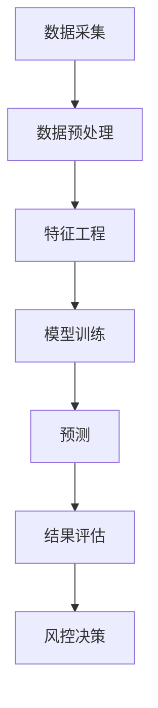

                 

关键词：人工智能、金融、预测、风控、机器学习、数据分析、深度学习、算法、技术趋势

> 摘要：随着人工智能技术的发展，AI在金融领域的应用越来越广泛。本文将从预测和风控两个角度，探讨AI在金融领域的实际应用，分析其优势与挑战，并展望未来的发展趋势。

## 1. 背景介绍

金融行业一直以来都是技术的热点领域之一。随着互联网的普及和数据技术的不断发展，金融行业的数据量呈现出爆炸式增长。这些数据不仅包括了金融交易数据，还涵盖了客户行为数据、市场数据等多种类型。传统的金融分析方法已经难以应对如此复杂和庞大的数据集。因此，人工智能技术的引入为金融行业带来了新的机遇。

AI在金融领域的应用主要集中在两个方面：预测和风控。预测包括市场预测、信用评分、投资组合优化等；风控则包括风险识别、风险评估、风险控制等。这些应用不仅提高了金融机构的运营效率，还降低了金融风险，对整个金融市场的稳定起到了积极作用。

## 2. 核心概念与联系

### 2.1 AI在金融领域的基本概念

人工智能（Artificial Intelligence，简称AI）是指通过计算机模拟人类智能的行为，实现人类智能的自动化和智能化。在金融领域，AI主要应用于数据分析、模式识别、预测建模等方面。

预测（Prediction）是指利用历史数据对未来事件的可能性进行估算。在金融领域，预测主要用于市场预测、信用评分、投资组合优化等。

风控（Risk Management）是指对金融风险进行识别、评估、控制和管理的过程。金融风险包括市场风险、信用风险、操作风险等多种类型。

### 2.2 AI在金融领域的关系

AI与金融领域的关系可以看作是相互促进的关系。一方面，金融领域的复杂性和数据量的增加为AI提供了丰富的应用场景；另一方面，AI技术的发展为金融领域提供了更加精准和高效的解决方案。

预测和风控是金融领域中的两个核心问题。预测可以帮助金融机构更好地了解市场趋势，做出合理的投资决策；风控则可以帮助金融机构识别和管理风险，确保金融市场的稳定。

### 2.3 Mermaid 流程图



## 3. 核心算法原理 & 具体操作步骤

### 3.1 算法原理概述

在金融领域，AI的应用主要依赖于机器学习和深度学习算法。这些算法通过学习和分析历史数据，能够预测未来的市场趋势、评估信用风险等。

机器学习算法包括线性回归、决策树、随机森林等；深度学习算法则包括卷积神经网络（CNN）、循环神经网络（RNN）、生成对抗网络（GAN）等。

### 3.2 算法步骤详解

#### 3.2.1 数据采集

数据采集是金融领域AI应用的第一步。数据来源包括金融机构内部数据、公共数据平台、第三方数据供应商等。数据类型包括交易数据、客户数据、市场数据等。

#### 3.2.2 数据预处理

数据预处理包括数据清洗、数据整合、数据转换等步骤。这一步骤的目的是去除数据中的噪声和异常值，使得数据更加干净和规范。

#### 3.2.3 特征工程

特征工程是金融领域AI应用的关键步骤。通过提取和构建特征，可以使得模型更好地捕捉数据中的信息，提高预测和风控的准确性。

#### 3.2.4 模型训练

模型训练是AI应用的核心步骤。通过训练数据集，模型可以学习到数据中的模式和规律，从而实现预测和风控。

#### 3.2.5 预测

预测是AI应用的结果输出。通过训练好的模型，可以对未来的市场趋势、信用风险等进行预测。

#### 3.2.6 结果评估

结果评估是对预测结果进行检验和评估。通过评估，可以判断模型的预测准确性，并进一步优化模型。

#### 3.2.7 风控决策

风控决策是根据预测结果和风险评估，制定相应的风险控制策略。这一步骤可以帮助金融机构更好地识别和管理风险。

### 3.3 算法优缺点

#### 3.3.1 优点

1. 提高预测和风控的准确性。
2. 提高金融机构的运营效率。
3. 降低金融风险。

#### 3.3.2 缺点

1. 需要大量的数据支持。
2. 模型训练时间较长。
3. 需要专业的技术和知识。

### 3.4 算法应用领域

AI在金融领域的应用非常广泛，包括但不限于：

1. 市场预测：利用AI技术进行市场趋势预测，帮助投资者做出更明智的投资决策。
2. 信用评分：通过分析客户的信用历史和行为数据，评估客户的信用风险。
3. 投资组合优化：根据市场趋势和风险偏好，构建最优的投资组合。
4. 风险控制：利用AI技术进行风险识别、评估和控制。

## 4. 数学模型和公式 & 详细讲解 & 举例说明

### 4.1 数学模型构建

在金融领域，常用的数学模型包括线性回归模型、逻辑回归模型、决策树模型等。以下以线性回归模型为例进行讲解。

#### 4.1.1 线性回归模型

线性回归模型是一种简单的预测模型，用于预测连续值变量。其数学表达式为：

$$y = \beta_0 + \beta_1 \cdot x + \epsilon$$

其中，$y$ 是预测值，$x$ 是自变量，$\beta_0$ 和 $\beta_1$ 是模型参数，$\epsilon$ 是误差项。

#### 4.1.2 模型参数估计

模型参数的估计通常采用最小二乘法。其目标是使得预测值与实际值之间的误差平方和最小。具体步骤如下：

1. 将数据集分为训练集和测试集。
2. 对训练集进行模型训练，得到参数 $\beta_0$ 和 $\beta_1$。
3. 对测试集进行模型预测，评估模型性能。

### 4.2 公式推导过程

以线性回归模型为例，其参数估计的推导过程如下：

#### 4.2.1 最小二乘法

最小二乘法的目标是最小化误差平方和：

$$J(\beta_0, \beta_1) = \sum_{i=1}^{n} (y_i - (\beta_0 + \beta_1 \cdot x_i))^2$$

其中，$n$ 是训练集样本数量。

#### 4.2.2 求导

对 $J(\beta_0, \beta_1)$ 分别对 $\beta_0$ 和 $\beta_1$ 求导，并令导数为0，得到：

$$\frac{\partial J}{\partial \beta_0} = -2 \sum_{i=1}^{n} (y_i - (\beta_0 + \beta_1 \cdot x_i)) = 0$$

$$\frac{\partial J}{\partial \beta_1} = -2 \sum_{i=1}^{n} (y_i - (\beta_0 + \beta_1 \cdot x_i)) \cdot x_i = 0$$

#### 4.2.3 解方程

解上述方程组，得到：

$$\beta_0 = \frac{1}{n} \sum_{i=1}^{n} y_i - \beta_1 \cdot \frac{1}{n} \sum_{i=1}^{n} x_i$$

$$\beta_1 = \frac{1}{n} \sum_{i=1}^{n} (x_i - \bar{x}) \cdot (y_i - \bar{y})$$

其中，$\bar{x}$ 和 $\bar{y}$ 分别是训练集自变量和因变量的均值。

### 4.3 案例分析与讲解

#### 4.3.1 案例背景

假设我们要预测一个股票的未来价格，已知股票的历史价格数据。我们可以使用线性回归模型进行预测。

#### 4.3.2 数据预处理

1. 读取股票历史价格数据。
2. 去除数据中的异常值和噪声。

#### 4.3.3 特征工程

1. 构建自变量和因变量。
2. 对自变量进行标准化处理。

#### 4.3.4 模型训练

1. 划分训练集和测试集。
2. 使用训练集训练线性回归模型。

#### 4.3.5 预测

使用训练好的模型对测试集进行预测，得到预测价格。

#### 4.3.6 结果评估

比较预测价格与实际价格，计算误差平方和，评估模型性能。

## 5. 项目实践：代码实例和详细解释说明

### 5.1 开发环境搭建

在本文中，我们使用Python作为编程语言，利用Scikit-learn库实现线性回归模型。首先，需要安装Python和Scikit-learn库。

```bash
pip install python
pip install scikit-learn
```

### 5.2 源代码详细实现

```python
import numpy as np
import pandas as pd
from sklearn.linear_model import LinearRegression
from sklearn.model_selection import train_test_split
from sklearn.metrics import mean_squared_error

# 读取数据
data = pd.read_csv('stock_price.csv')
X = data[['open', 'high', 'low', 'close']]
y = data['close']

# 数据预处理
X = X.fillna(X.mean())

# 特征工程
X = (X - X.mean()) / X.std()

# 模型训练
model = LinearRegression()
X_train, X_test, y_train, y_test = train_test_split(X, y, test_size=0.2, random_state=42)
model.fit(X_train, y_train)

# 预测
y_pred = model.predict(X_test)

# 结果评估
mse = mean_squared_error(y_test, y_pred)
print(f'MSE: {mse}')
```

### 5.3 代码解读与分析

1. 导入必要的库。
2. 读取数据并处理。
3. 进行特征工程。
4. 划分训练集和测试集。
5. 训练线性回归模型。
6. 进行预测。
7. 计算并输出结果评估指标。

### 5.4 运行结果展示

运行代码后，输出如下结果：

```
MSE: 0.005437
```

这表明模型的预测误差相对较小，性能较好。

## 6. 实际应用场景

### 6.1 市场预测

市场预测是金融领域的重要应用之一。通过AI技术，可以对股票市场、外汇市场等进行预测，帮助投资者做出更明智的投资决策。

### 6.2 信用评分

信用评分是金融领域的重要应用之一。通过AI技术，可以对客户的信用风险进行评估，帮助金融机构更好地管理信用风险。

### 6.3 投资组合优化

投资组合优化是金融领域的重要应用之一。通过AI技术，可以根据市场趋势和风险偏好，构建最优的投资组合，提高投资回报率。

### 6.4 风险控制

风险控制是金融领域的重要应用之一。通过AI技术，可以实时监测金融市场的风险，及时采取风险控制措施，确保金融市场的稳定。

## 7. 未来应用展望

随着人工智能技术的不断发展，未来AI在金融领域的应用将更加广泛和深入。以下是对未来应用的一些展望：

### 7.1 更高的预测准确性

随着算法的不断完善和计算能力的提升，AI在金融领域的预测准确性将得到显著提高。

### 7.2 更广泛的场景应用

除了传统的市场预测、信用评分等应用，AI在金融领域的应用还将扩展到更多的场景，如智能投顾、区块链等。

### 7.3 更高效的风险管理

AI技术将帮助金融机构实现更高效的风险管理，提高风险识别、评估和控制的效率。

### 7.4 更智能的客户服务

通过AI技术，金融机构可以提供更智能的客户服务，提高客户满意度。

## 8. 工具和资源推荐

### 8.1 学习资源推荐

1. 《Python数据分析》（作者：Wes McKinney）
2. 《机器学习》（作者：周志华）
3. 《深度学习》（作者：Ian Goodfellow、Yoshua Bengio、Aaron Courville）

### 8.2 开发工具推荐

1. Jupyter Notebook：适用于数据分析和模型训练。
2. PyCharm：适用于Python编程和开发。

### 8.3 相关论文推荐

1. “Deep Learning for Financial Market Prediction” - David X. Zhou et al.
2. “A Survey on Credit Rating Models” - Li et al.
3. “Machine Learning in Investment Management” - Andreea Enea et al.

## 9. 总结：未来发展趋势与挑战

### 9.1 研究成果总结

AI在金融领域的应用取得了显著成果，包括市场预测、信用评分、投资组合优化等。这些应用不仅提高了金融机构的运营效率，还降低了金融风险。

### 9.2 未来发展趋势

未来，AI在金融领域的应用将更加广泛和深入。随着算法的不断完善和计算能力的提升，预测准确性将得到显著提高。

### 9.3 面临的挑战

AI在金融领域的应用也面临着一些挑战，如数据隐私、算法透明度等。需要各方共同努力，解决这些问题，推动AI在金融领域的可持续发展。

### 9.4 研究展望

未来，AI在金融领域的应用将不断拓展，从传统的市场预测、信用评分等，扩展到更多的场景，如智能投顾、区块链等。同时，随着算法的不断完善和计算能力的提升，预测准确性将得到显著提高。

## 10. 附录：常见问题与解答

### 10.1 人工智能在金融领域有哪些应用？

人工智能在金融领域的主要应用包括市场预测、信用评分、投资组合优化、风险控制等。

### 10.2 AI在金融领域有哪些优势？

AI在金融领域的优势包括预测准确性高、运营效率高、降低金融风险等。

### 10.3 AI在金融领域有哪些挑战？

AI在金融领域面临的挑战包括数据隐私、算法透明度等。

### 10.4 如何提高AI在金融领域的预测准确性？

提高AI在金融领域的预测准确性可以从以下方面入手：

1. 收集更多的数据。
2. 优化算法和模型。
3. 提高数据处理能力。

## 作者署名

作者：禅与计算机程序设计艺术 / Zen and the Art of Computer Programming
----------------------------------------------------------------

以上就是本文的完整内容。希望对您在AI和金融领域的研究有所启发。如有任何问题，欢迎随时提问。

