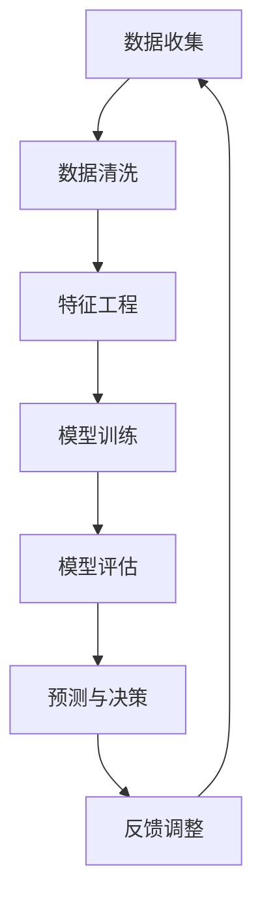

                 

关键词：人工智能、金融预测、风控模型、机器学习、算法、金融科技

> 摘要：本文将探讨人工智能（AI）在金融领域的应用，特别是其在预测和风控方面的作用。通过介绍核心算法原理、数学模型构建、案例分析和项目实践，本文旨在为读者提供对AI在金融领域应用的深入理解。

## 1. 背景介绍

### 金融领域的重要性

金融是现代经济的核心，它的稳定性和发展对整个社会的经济健康至关重要。从银行到投资、保险再到金融科技（FinTech），金融行业涵盖了广泛的业务领域，其中每一个环节都对数据有着极大的依赖。

### 数据的重要性

在金融领域，数据是决策的基础。有效的数据分析可以帮助金融机构理解市场动态、预测风险、优化投资组合、提高客户满意度等。随着数据量的爆炸性增长，传统的数据处理方法已无法满足需求。

### 人工智能的兴起

人工智能（AI）的快速发展为金融领域带来了新的机遇。通过机器学习和深度学习算法，AI能够处理和分析大量复杂的数据，提供更精确的预测和决策支持。在金融预测和风险控制方面，AI的应用具有巨大的潜力。

## 2. 核心概念与联系

### 人工智能在金融预测中的核心概念

- **机器学习（Machine Learning）**：通过算法让计算机从数据中学习，自动识别模式并进行预测。
- **深度学习（Deep Learning）**：一种特殊的机器学习方法，通过多层神经网络模拟人类大脑的决策过程。
- **自然语言处理（Natural Language Processing，NLP）**：让计算机理解和生成自然语言，用于文本分析和自动化客服等。

### Mermaid 流程图（核心概念原理和架构）



## 3. 核心算法原理 & 具体操作步骤

### 3.1 算法原理概述

在金融预测中，常用的AI算法包括：

- **线性回归（Linear Regression）**：通过建立变量之间的关系来预测数值。
- **逻辑回归（Logistic Regression）**：用于分类问题，如贷款审批通过与否。
- **决策树（Decision Tree）**：通过一系列条件分支进行决策。
- **随机森林（Random Forest）**：通过集成多个决策树来提高预测准确性。
- **神经网络（Neural Networks）**：模拟人脑神经元的工作方式，适用于复杂非线性问题。

### 3.2 算法步骤详解

1. **数据收集**：从各种数据源收集历史交易数据、客户信息、市场动态等。
2. **数据清洗**：处理缺失值、异常值，确保数据质量。
3. **特征工程**：选择和构造对预测有帮助的特征。
4. **模型训练**：使用训练数据集训练模型，调整模型参数。
5. **模型评估**：使用验证数据集评估模型性能，调整模型结构。
6. **预测与决策**：使用模型对新数据进行预测，辅助金融决策。
7. **反馈调整**：根据预测结果进行调整，优化模型性能。

### 3.3 算法优缺点

- **线性回归**：简单、易于理解，但可能不适用于非线性问题。
- **逻辑回归**：适用于二分类问题，但可能无法捕捉复杂关系。
- **决策树**：直观、易于解释，但可能过拟合，且无法处理非线性关系。
- **随机森林**：提高预测准确性，减少过拟合，但模型复杂度增加。
- **神经网络**：适用于复杂非线性问题，但训练过程较慢，模型难以解释。

### 3.4 算法应用领域

- **股票市场预测**：通过分析历史交易数据，预测股票价格走势。
- **信用评分**：通过客户信息评估其信用风险。
- **欺诈检测**：实时监测交易行为，识别潜在欺诈活动。
- **风险控制**：预测金融市场的波动性，制定相应的风险管理策略。

## 4. 数学模型和公式 & 详细讲解 & 举例说明

### 4.1 数学模型构建

金融预测中的常见数学模型包括线性回归模型和逻辑回归模型。

#### 线性回归模型

$$ y = \beta_0 + \beta_1x_1 + \beta_2x_2 + ... + \beta_nx_n + \epsilon $$

其中，\( y \) 是预测目标，\( x_1, x_2, ..., x_n \) 是特征变量，\( \beta_0, \beta_1, ..., \beta_n \) 是模型参数，\( \epsilon \) 是误差项。

#### 逻辑回归模型

$$ P(y=1) = \frac{1}{1 + e^{-(\beta_0 + \beta_1x_1 + \beta_2x_2 + ... + \beta_nx_n )}} $$

其中，\( P(y=1) \) 是事件发生的概率，其余符号含义与线性回归相同。

### 4.2 公式推导过程

以线性回归模型为例，推导过程如下：

1. **目标函数**：最小化误差平方和（Mean Squared Error，MSE）

$$ J(\theta) = \frac{1}{2m} \sum_{i=1}^{m} (h_\theta(x^{(i)}) - y^{(i)})^2 $$

其中，\( m \) 是训练数据集大小，\( h_\theta(x) \) 是模型的预测值，\( y \) 是实际值。

2. **梯度下降法**：更新模型参数，最小化目标函数

$$ \theta_j := \theta_j - \alpha \frac{\partial J(\theta)}{\partial \theta_j} $$

其中，\( \alpha \) 是学习率，\( \theta_j \) 是第 \( j \) 个参数。

### 4.3 案例分析与讲解

#### 股票价格预测

假设我们要预测某股票在未来一天的价格。收集历史交易数据，包括价格、成交量、利率等特征。使用线性回归模型进行预测，目标函数为：

$$ P(y_{t+1} = y_t + \beta_0 + \beta_1 \cdot vol_t + \beta_2 \cdot int_t + \epsilon) $$

其中，\( y_t \) 是当前价格，\( vol_t \) 是当前成交量，\( int_t \) 是当前利率。

通过训练数据和验证数据集，调整模型参数，最终得到预测结果。

## 5. 项目实践：代码实例和详细解释说明

### 5.1 开发环境搭建

- Python 3.8+
- Jupyter Notebook
- Scikit-learn、Pandas、NumPy、Matplotlib 等库

### 5.2 源代码详细实现

以下是一个简单的股票价格预测项目：

```python
import numpy as np
import pandas as pd
from sklearn.model_selection import train_test_split
from sklearn.linear_model import LinearRegression
import matplotlib.pyplot as plt

# 读取数据
data = pd.read_csv('stock_data.csv')
X = data[['volume', 'interest_rate']]
y = data['price']

# 数据预处理
X_train, X_test, y_train, y_test = train_test_split(X, y, test_size=0.2, random_state=42)

# 模型训练
model = LinearRegression()
model.fit(X_train, y_train)

# 模型评估
score = model.score(X_test, y_test)
print(f'Model accuracy: {score:.2f}')

# 预测
X_new = np.array([[100, 0.05]])
price_pred = model.predict(X_new)
print(f'Predicted price: {price_pred[0]:.2f}')
```

### 5.3 代码解读与分析

- **数据读取与预处理**：使用 Pandas 读取数据，并进行拆分，以便后续处理。
- **模型选择与训练**：选择线性回归模型，使用训练数据集进行训练。
- **模型评估**：使用测试数据集评估模型性能，得到准确率。
- **预测**：使用训练好的模型对新数据进行预测，得到预测价格。

### 5.4 运行结果展示

运行上述代码，可以得到模型的准确率以及预测的股票价格。通过可视化工具，我们可以更直观地看到模型的预测效果。

```python
plt.scatter(X_test['volume'], y_test, color='blue', label='Actual')
plt.plot(X_test['volume'], model.predict(X_test), color='red', label='Predicted')
plt.xlabel('Volume')
plt.ylabel('Price')
plt.legend()
plt.show()
```

## 6. 实际应用场景

### 6.1 股票市场预测

通过AI模型，投资者可以更好地了解市场趋势，制定投资策略，从而降低投资风险。

### 6.2 信用评分

金融机构可以利用AI模型对客户进行信用评估，提高审批效率，降低信用风险。

### 6.3 欺诈检测

AI模型可以帮助金融机构实时监测交易行为，识别和防范欺诈活动，保护用户资金安全。

### 6.4 风险控制

通过分析市场数据，AI模型可以预测金融市场的波动性，为金融机构提供风险管理建议。

## 7. 工具和资源推荐

### 7.1 学习资源推荐

- 《机器学习》（周志华 著）
- 《深度学习》（Goodfellow, Bengio, Courville 著）
- Coursera上的《机器学习》课程（吴恩达 开设）

### 7.2 开发工具推荐

- Jupyter Notebook：用于编写和运行代码
- Google Colab：免费的云端计算环境
- Scikit-learn：Python机器学习库

### 7.3 相关论文推荐

- “Deep Learning for Financial Forecasting”
- “Application of Machine Learning in Credit Scoring”
- “Detecting Fraud Using Machine Learning Techniques”

## 8. 总结：未来发展趋势与挑战

### 8.1 研究成果总结

AI在金融领域的应用已经取得了显著的成果，特别是在预测和风控方面。通过机器学习和深度学习算法，金融机构能够更准确地预测市场走势，降低风险，提高业务效率。

### 8.2 未来发展趋势

- **更复杂的模型**：随着AI技术的进步，更复杂的模型将得到应用，如生成对抗网络（GAN）等。
- **实时预测**：AI模型将实现更实时、更准确的预测，为金融机构提供更快速、更精准的决策支持。
- **跨领域应用**：AI在金融领域的应用将逐渐扩展到其他行业，如保险、供应链金融等。

### 8.3 面临的挑战

- **数据隐私与安全**：金融数据涉及大量敏感信息，如何确保数据安全和隐私是一个重大挑战。
- **模型解释性**：尽管AI模型在预测准确性上有优势，但其“黑盒”特性使得解释性较差，这限制了其在金融领域的广泛应用。
- **法律和监管**：随着AI在金融领域的应用，相关的法律法规和监管要求也需要不断完善。

### 8.4 研究展望

未来的研究应重点关注以下几个方面：

- **数据隐私保护技术**：开发新的数据隐私保护技术，确保数据在处理过程中的安全性和隐私性。
- **模型可解释性研究**：提高AI模型的可解释性，使其在金融领域得到更广泛的应用。
- **跨领域合作**：加强跨学科、跨领域的合作，推动AI在金融领域的创新发展。

## 9. 附录：常见问题与解答

### 9.1 问题1：为什么AI在金融领域应用广泛？

**解答**：AI在金融领域应用广泛是因为它能够处理大量复杂的数据，提供精确的预测和决策支持。在股票市场预测、信用评分、欺诈检测等方面，AI模型能够显著提高金融机构的运营效率和风险管理能力。

### 9.2 问题2：AI模型在金融领域的应用有哪些局限？

**解答**：AI模型在金融领域的应用存在一些局限，主要包括：

- **数据隐私与安全**：金融数据涉及大量敏感信息，如何确保数据在处理过程中的安全性和隐私性是一个重大挑战。
- **模型解释性**：尽管AI模型在预测准确性上有优势，但其“黑盒”特性使得解释性较差，这限制了其在金融领域的广泛应用。
- **法律和监管**：随着AI在金融领域的应用，相关的法律法规和监管要求也需要不断完善。

### 9.3 问题3：如何提高AI模型在金融领域的解释性？

**解答**：提高AI模型在金融领域的解释性可以从以下几个方面入手：

- **模型选择**：选择可解释性较强的模型，如决策树、线性回归等。
- **模型可视化**：通过可视化工具展示模型的结构和参数，帮助用户理解模型的决策过程。
- **可解释性增强技术**：结合领域知识，开发新的可解释性增强技术，如LIME、SHAP等。

---

# 作者：禅与计算机程序设计艺术 / Zen and the Art of Computer Programming

本文旨在为读者提供对AI在金融领域应用的深入理解，探讨其在预测和风控方面的作用。通过介绍核心算法原理、数学模型构建、案例分析和项目实践，本文希望读者能够掌握AI在金融领域的应用方法，并为未来的研究提供参考。作者衷心希望本文能够对读者有所帮助，并激励大家在AI与金融领域的探索中取得更多成就。禅与计算机程序设计艺术，追求极致、耐心与智慧，让我们一起在这个充满挑战与机遇的领域不断前行。|

