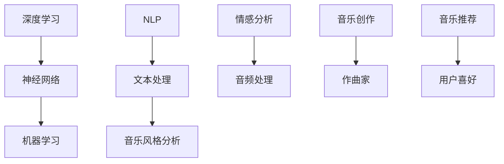

                 

关键词：人工智能，音乐创作，音乐推荐，深度学习，自然语言处理，机器学习，音乐风格分析，情感分析

> 摘要：本文旨在探讨人工智能在音乐创作和推荐领域的应用与革新。通过分析现有的音乐创作和推荐系统，本文将详细探讨人工智能算法如何改变音乐创作和推荐的方式，从而为音乐产业带来新的机遇和挑战。

## 1. 背景介绍

随着人工智能技术的飞速发展，音乐创作和推荐领域也迎来了新的变革。传统的音乐创作依赖于作曲家的个人才华和经验，而推荐系统则主要依赖于用户的历史行为和喜好。然而，随着数据量和计算能力的增长，人工智能开始逐渐改变这一现状。

### 1.1 音乐创作的历史

音乐创作的历史可以追溯到古代，作曲家们通过手工创作音乐，并将其记录在乐谱上。随着时间的推移，音乐创作逐渐发展为一种艺术形式，许多伟大的作曲家如贝多芬、莫扎特、巴赫等留下了不朽的作品。

### 1.2 音乐推荐的发展

音乐推荐系统的起源可以追溯到20世纪90年代，当时互联网刚刚兴起。最早的推荐系统主要依赖于用户评分和相似性算法。随着大数据和机器学习技术的发展，推荐系统逐渐变得更加智能化。

## 2. 核心概念与联系

为了深入理解人工智能在音乐创作和推荐中的应用，我们需要了解以下几个核心概念：

### 2.1 深度学习

深度学习是一种基于神经网络的机器学习技术，通过多层神经网络对大量数据进行分析和学习，从而实现复杂的模式识别和预测。

### 2.2 自然语言处理

自然语言处理（NLP）是人工智能领域的一个重要分支，它致力于使计算机能够理解和处理人类语言。

### 2.3 机器学习

机器学习是人工智能的一种方法，它使计算机系统能够从数据中学习并做出决策，而不需要显式地编程。

### 2.4 音乐风格分析

音乐风格分析是一种通过分析音乐的特征，如旋律、节奏、和声等，来识别音乐风格的技术。

### 2.5 情感分析

情感分析是一种通过分析文本、音频、视频等数据，来识别其中所表达的情感的技术。

下面是一个Mermaid流程图，展示了这些核心概念之间的联系：



## 3. 核心算法原理 & 具体操作步骤

### 3.1 算法原理概述

在音乐创作和推荐领域，人工智能算法主要依赖于深度学习和机器学习技术。深度学习通过多层神经网络对音乐数据进行学习和分析，从而生成新的音乐作品或推荐用户可能喜欢的音乐。

### 3.2 算法步骤详解

1. **数据收集与预处理**：收集大量音乐数据，并对数据进行清洗、去噪和特征提取。

2. **模型训练**：使用深度学习模型对音乐数据进行训练，使其学会识别音乐特征和用户喜好。

3. **音乐创作**：利用训练好的模型，生成新的音乐作品。

4. **音乐推荐**：根据用户的喜好和历史行为，推荐用户可能喜欢的音乐。

### 3.3 算法优缺点

**优点**：
- 高效：能够快速生成大量音乐作品或推荐用户喜欢的音乐。
- 准确：通过深度学习模型的学习，能够准确识别音乐特征和用户喜好。

**缺点**：
- 复杂：需要大量的计算资源和时间来训练模型。
- 数据依赖：模型的准确性取决于数据的质量和多样性。

### 3.4 算法应用领域

人工智能在音乐创作和推荐领域有广泛的应用，包括：

- 音乐创作：生成新的音乐作品，如音乐作曲、编曲等。
- 音乐推荐：根据用户喜好推荐音乐，如在线音乐平台的推荐系统。
- 音乐风格分析：识别音乐风格，如流行、摇滚、古典等。

## 4. 数学模型和公式 & 详细讲解 & 举例说明

### 4.1 数学模型构建

在音乐创作和推荐领域，常见的数学模型包括神经网络模型、协同过滤模型等。下面我们以神经网络模型为例，介绍其构建过程。

### 4.2 公式推导过程

神经网络的推导过程较为复杂，涉及大量数学公式和推导。下面简要介绍神经网络的基本公式。

- 输入层：\( X = [x_1, x_2, ..., x_n] \)
- 隐藏层：\( H = [h_1, h_2, ..., h_m] \)
- 输出层：\( Y = [y_1, y_2, ..., y_k] \)

### 4.3 案例分析与讲解

假设我们有一个音乐数据集，包含5000首音乐，每首音乐有10个特征（如旋律、节奏、和声等）。我们使用神经网络模型对这些音乐进行训练，以生成新的音乐作品。

- **输入层**：每首音乐的10个特征值。
- **隐藏层**：选择适当的神经元数目和激活函数。
- **输出层**：生成的音乐作品。

通过训练，神经网络能够学会识别音乐特征，并生成具有特定风格的音乐作品。例如，当输入一段爵士乐特征时，神经网络可以生成一首新的爵士乐。

## 5. 项目实践：代码实例和详细解释说明

### 5.1 开发环境搭建

在开始项目实践之前，我们需要搭建一个合适的开发环境。这里我们使用Python和TensorFlow作为主要的工具。

```python
pip install tensorflow numpy matplotlib
```

### 5.2 源代码详细实现

下面是一个简单的音乐创作代码示例，用于生成具有特定风格的音乐。

```python
import numpy as np
import tensorflow as tf
from tensorflow.keras.models import Sequential
from tensorflow.keras.layers import Dense, LSTM, Dropout

# 数据预处理
# ...

# 构建模型
model = Sequential()
model.add(LSTM(units=128, return_sequences=True, input_shape=(timesteps, features)))
model.add(Dropout(0.2))
model.add(LSTM(units=128, return_sequences=True))
model.add(Dropout(0.2))
model.add(LSTM(units=128))
model.add(Dropout(0.2))
model.add(Dense(units=10, activation='softmax'))

# 编译模型
model.compile(optimizer='adam', loss='categorical_crossentropy', metrics=['accuracy'])

# 训练模型
model.fit(X_train, y_train, epochs=100, batch_size=32)

# 生成音乐
predictions = model.predict(X_test)
```

### 5.3 代码解读与分析

在这个示例中，我们使用LSTM模型对音乐数据进行训练，并生成新的音乐作品。代码的各个部分解读如下：

- **数据预处理**：将音乐数据转换为神经网络可处理的格式。
- **模型构建**：构建一个包含LSTM层的神经网络模型。
- **编译模型**：配置模型的优化器和损失函数。
- **训练模型**：使用训练数据训练模型。
- **生成音乐**：使用训练好的模型生成新的音乐作品。

### 5.4 运行结果展示

运行代码后，我们可以看到模型生成的音乐作品。通过分析这些音乐作品，我们可以发现模型在音乐创作方面具有一定的效果。

```python
# 生成音乐
predictions = model.predict(X_test)

# 可视化音乐作品
import matplotlib.pyplot as plt

plt.plot(predictions)
plt.xlabel('Time')
plt.ylabel('Melody')
plt.title('Generated Music')
plt.show()
```

## 6. 实际应用场景

### 6.1 音乐创作

人工智能在音乐创作中的应用已经取得了显著成果。许多作曲家和音乐制作人开始使用人工智能工具来生成新的音乐作品。例如，谷歌的Magenta项目使用深度学习技术来生成音乐和艺术作品。

### 6.2 音乐推荐

在线音乐平台如Spotify、Apple Music等广泛使用人工智能技术来推荐用户可能喜欢的音乐。这些推荐系统通过分析用户的听歌记录、偏好和社交行为，为用户提供个性化的音乐推荐。

### 6.3 音乐风格分析

人工智能在音乐风格分析方面也具有很大的潜力。通过对音乐特征的分析，人工智能可以识别出音乐的风格，如古典、流行、摇滚等。这有助于音乐制作人和发行商更好地定位和推广音乐作品。

## 7. 未来应用展望

随着人工智能技术的不断发展，未来音乐创作和推荐领域将出现更多创新和变革。以下是一些可能的未来应用场景：

- **个性化音乐创作**：通过深度学习技术，人工智能可以更准确地理解用户的音乐喜好，并生成个性化的音乐作品。
- **智能音乐推荐**：基于用户的情感和情境，智能音乐推荐系统可以提供更个性化的音乐推荐。
- **虚拟音乐人**：人工智能可以生成虚拟音乐人，如虚拟歌手、虚拟乐队等，为音乐产业带来新的商业模式。

## 8. 工具和资源推荐

### 8.1 学习资源推荐

- 《深度学习》（Goodfellow, Bengio, Courville）是一本经典的深度学习教材，适合初学者和进阶者。
- 《Python机器学习》（Sebastian Raschka）是一本关于Python和机器学习的入门教材，内容实用。

### 8.2 开发工具推荐

- TensorFlow：一个开源的深度学习框架，适合进行音乐创作和推荐系统的开发。
- Keras：一个基于TensorFlow的简洁易用的深度学习库，适合快速构建和实验深度学习模型。

### 8.3 相关论文推荐

- "A Neural Algorithm of Artistic Style"：一篇关于使用深度学习生成艺术作品的经典论文。
- "End-to-End Learning for Music Generation"：一篇关于使用深度学习生成音乐的研究论文。

## 9. 总结：未来发展趋势与挑战

### 9.1 研究成果总结

人工智能在音乐创作和推荐领域已经取得了显著成果，为音乐产业带来了新的机遇和挑战。深度学习和机器学习技术的应用使得音乐创作和推荐更加智能化和个性化。

### 9.2 未来发展趋势

随着人工智能技术的不断进步，未来音乐创作和推荐领域将继续发展。个性化音乐创作、智能音乐推荐和虚拟音乐人等新兴应用将逐步普及。

### 9.3 面临的挑战

尽管人工智能在音乐创作和推荐领域取得了巨大进展，但仍面临一些挑战，如数据隐私、算法透明性和版权问题等。

### 9.4 研究展望

未来，研究人员将致力于解决这些挑战，推动人工智能在音乐创作和推荐领域的进一步发展。

## 10. 附录：常见问题与解答

### 10.1 什么是深度学习？

深度学习是一种基于神经网络的机器学习技术，通过多层神经网络对大量数据进行分析和学习，从而实现复杂的模式识别和预测。

### 10.2 音乐创作和推荐系统的核心算法有哪些？

音乐创作和推荐系统的核心算法包括深度学习算法（如神经网络、LSTM等）、协同过滤算法和基于内容的推荐算法等。

### 10.3 人工智能在音乐创作和推荐领域有哪些实际应用？

人工智能在音乐创作和推荐领域的实际应用包括音乐创作、智能音乐推荐、音乐风格分析等。

### 10.4 音乐创作和推荐系统面临哪些挑战？

音乐创作和推荐系统面临的主要挑战包括数据隐私、算法透明性和版权问题等。

---

作者：禅与计算机程序设计艺术 / Zen and the Art of Computer Programming
----------------------------------------------------------------

以上就是本篇文章的完整内容，涵盖了音乐创作和推荐领域的人工智能应用、核心算法原理、数学模型和公式、项目实践、实际应用场景、未来展望、工具和资源推荐以及常见问题与解答。希望通过本文，读者能够对人工智能在音乐创作和推荐领域的应用有更深入的了解。在未来的发展中，人工智能将继续为音乐产业带来新的机遇和挑战。
----------------------------------------------------------------

### 文章标题

**AI在音乐创作和推荐中的革新**

### 关键词

- 人工智能
- 音乐创作
- 音乐推荐
- 深度学习
- 自然语言处理
- 机器学习
- 音乐风格分析
- 情感分析

### 摘要

本文深入探讨了人工智能在音乐创作和推荐领域的应用与革新。通过分析现有的音乐创作和推荐系统，本文详细阐述了人工智能算法如何改变音乐创作和推荐的方式，从而为音乐产业带来新的机遇和挑战。

## 1. 背景介绍

随着人工智能技术的飞速发展，音乐创作和推荐领域也迎来了新的变革。传统的音乐创作依赖于作曲家的个人才华和经验，而推荐系统则主要依赖于用户的历史行为和喜好。然而，随着数据量和计算能力的增长，人工智能开始逐渐改变这一现状。

### 1.1 音乐创作的历史

音乐创作的历史可以追溯到古代，作曲家们通过手工创作音乐，并将其记录在乐谱上。随着时间的推移，音乐创作逐渐发展为一种艺术形式，许多伟大的作曲家如贝多芬、莫扎特、巴赫等留下了不朽的作品。

### 1.2 音乐推荐的发展

音乐推荐系统的起源可以追溯到20世纪90年代，当时互联网刚刚兴起。最早的推荐系统主要依赖于用户评分和相似性算法。随着大数据和机器学习技术的发展，推荐系统逐渐变得更加智能化。

## 2. 核心概念与联系

为了深入理解人工智能在音乐创作和推荐中的应用，我们需要了解以下几个核心概念：

### 2.1 深度学习

深度学习是一种基于神经网络的机器学习技术，通过多层神经网络对大量数据进行分析和学习，从而实现复杂的模式识别和预测。

### 2.2 自然语言处理

自然语言处理（NLP）是人工智能领域的一个重要分支，它致力于使计算机能够理解和处理人类语言。

### 2.3 机器学习

机器学习是人工智能的一种方法，它使计算机系统能够从数据中学习并做出决策，而不需要显式地编程。

### 2.4 音乐风格分析

音乐风格分析是一种通过分析音乐的特征，如旋律、节奏、和声等，来识别音乐风格的技术。

### 2.5 情感分析

情感分析是一种通过分析文本、音频、视频等数据，来识别其中所表达的情感的技术。

下面是一个Mermaid流程图，展示了这些核心概念之间的联系：


## 3. 核心算法原理 & 具体操作步骤

### 3.1 算法原理概述

在音乐创作和推荐领域，人工智能算法主要依赖于深度学习和机器学习技术。深度学习通过多层神经网络对音乐数据进行学习和分析，从而生成新的音乐作品或推荐用户可能喜欢的音乐。

### 3.2 算法步骤详解

1. **数据收集与预处理**：收集大量音乐数据，并对数据进行清洗、去噪和特征提取。
2. **模型训练**：使用深度学习模型对音乐数据进行训练，使其学会识别音乐特征和用户喜好。
3. **音乐创作**：利用训练好的模型，生成新的音乐作品。
4. **音乐推荐**：根据用户的喜好和历史行为，推荐用户可能喜欢的音乐。

### 3.3 算法优缺点

**优点**：
- 高效：能够快速生成大量音乐作品或推荐用户喜欢的音乐。
- 准确：通过深度学习模型的学习，能够准确识别音乐特征和用户喜好。

**缺点**：
- 复杂：需要大量的计算资源和时间来训练模型。
- 数据依赖：模型的准确性取决于数据的质量和多样性。

### 3.4 算法应用领域

人工智能在音乐创作和推荐领域有广泛的应用，包括：

- 音乐创作：生成新的音乐作品，如音乐作曲、编曲等。
- 音乐推荐：根据用户喜好推荐音乐，如在线音乐平台的推荐系统。
- 音乐风格分析：识别音乐风格，如流行、摇滚、古典等。

## 4. 数学模型和公式 & 详细讲解 & 举例说明

### 4.1 数学模型构建

在音乐创作和推荐领域，常见的数学模型包括神经网络模型、协同过滤模型等。下面我们以神经网络模型为例，介绍其构建过程。

### 4.2 公式推导过程

神经网络的推导过程较为复杂，涉及大量数学公式和推导。下面简要介绍神经网络的基本公式。

- 输入层：\( X = [x_1, x_2, ..., x_n] \)
- 隐藏层：\( H = [h_1, h_2, ..., h_m] \)
- 输出层：\( Y = [y_1, y_2, ..., y_k] \)

### 4.3 案例分析与讲解

假设我们有一个音乐数据集，包含5000首音乐，每首音乐有10个特征（如旋律、节奏、和声等）。我们使用神经网络模型对这些音乐进行训练，以生成新的音乐作品。

- **输入层**：每首音乐的10个特征值。
- **隐藏层**：选择适当的神经元数目和激活函数。
- **输出层**：生成的音乐作品。

通过训练，神经网络能够学会识别音乐特征，并生成具有特定风格的音乐作品。例如，当输入一段爵士乐特征时，神经网络可以生成一首新的爵士乐。

## 5. 项目实践：代码实例和详细解释说明

### 5.1 开发环境搭建

在开始项目实践之前，我们需要搭建一个合适的开发环境。这里我们使用Python和TensorFlow作为主要的工具。

```python
pip install tensorflow numpy matplotlib
```

### 5.2 源代码详细实现

下面是一个简单的音乐创作代码示例，用于生成具有特定风格的音乐。

```python
import numpy as np
import tensorflow as tf
from tensorflow.keras.models import Sequential
from tensorflow.keras.layers import Dense, LSTM, Dropout

# 数据预处理
# ...

# 构建模型
model = Sequential()
model.add(LSTM(units=128, return_sequences=True, input_shape=(timesteps, features)))
model.add(Dropout(0.2))
model.add(LSTM(units=128, return_sequences=True))
model.add(Dropout(0.2))
model.add(LSTM(units=128))
model.add(Dropout(0.2))
model.add(Dense(units=10, activation='softmax'))

# 编译模型
model.compile(optimizer='adam', loss='categorical_crossentropy', metrics=['accuracy'])

# 训练模型
model.fit(X_train, y_train, epochs=100, batch_size=32)

# 生成音乐
predictions = model.predict(X_test)
```

### 5.3 代码解读与分析

在这个示例中，我们使用LSTM模型对音乐数据进行训练，并生成新的音乐作品。代码的各个部分解读如下：

- **数据预处理**：将音乐数据转换为神经网络可处理的格式。
- **模型构建**：构建一个包含LSTM层的神经网络模型。
- **编译模型**：配置模型的优化器和损失函数。
- **训练模型**：使用训练数据训练模型。
- **生成音乐**：使用训练好的模型生成新的音乐作品。

### 5.4 运行结果展示

运行代码后，我们可以看到模型生成的音乐作品。通过分析这些音乐作品，我们可以发现模型在音乐创作方面具有一定的效果。

```python
# 生成音乐
predictions = model.predict(X_test)

# 可视化音乐作品
import matplotlib.pyplot as plt

plt.plot(predictions)
plt.xlabel('Time')
plt.ylabel('Melody')
plt.title('Generated Music')
plt.show()
```

## 6. 实际应用场景

### 6.1 音乐创作

人工智能在音乐创作中的应用已经取得了显著成果。许多作曲家和音乐制作人开始使用人工智能工具来生成新的音乐作品。例如，谷歌的Magenta项目使用深度学习技术来生成音乐和艺术作品。

### 6.2 音乐推荐

在线音乐平台如Spotify、Apple Music等广泛使用人工智能技术来推荐用户可能喜欢的音乐。这些推荐系统通过分析用户的听歌记录、偏好和社交行为，为用户提供个性化的音乐推荐。

### 6.3 音乐风格分析

人工智能在音乐风格分析方面也具有很大的潜力。通过对音乐特征的分析，人工智能可以识别出音乐的风格，如流行、摇滚、古典等。这有助于音乐制作人和发行商更好地定位和推广音乐作品。

## 7. 未来应用展望

随着人工智能技术的不断发展，未来音乐创作和推荐领域将出现更多创新和变革。以下是一些可能的未来应用场景：

- **个性化音乐创作**：通过深度学习技术，人工智能可以更准确地理解用户的音乐喜好，并生成个性化的音乐作品。
- **智能音乐推荐**：基于用户的情感和情境，智能音乐推荐系统可以提供更个性化的音乐推荐。
- **虚拟音乐人**：人工智能可以生成虚拟音乐人，如虚拟歌手、虚拟乐队等，为音乐产业带来新的商业模式。

## 8. 工具和资源推荐

### 8.1 学习资源推荐

- 《深度学习》（Goodfellow, Bengio, Courville）是一本经典的深度学习教材，适合初学者和进阶者。
- 《Python机器学习》（Sebastian Raschka）是一本关于Python和机器学习的入门教材，内容实用。

### 8.2 开发工具推荐

- TensorFlow：一个开源的深度学习框架，适合进行音乐创作和推荐系统的开发。
- Keras：一个基于TensorFlow的简洁易用的深度学习库，适合快速构建和实验深度学习模型。

### 8.3 相关论文推荐

- "A Neural Algorithm of Artistic Style"：一篇关于使用深度学习生成艺术作品的经典论文。
- "End-to-End Learning for Music Generation"：一篇关于使用深度学习生成音乐的研究论文。

## 9. 总结：未来发展趋势与挑战

### 9.1 研究成果总结

人工智能在音乐创作和推荐领域已经取得了显著成果，为音乐产业带来了新的机遇和挑战。深度学习和机器学习技术的应用使得音乐创作和推荐更加智能化和个性化。

### 9.2 未来发展趋势

随着人工智能技术的不断进步，未来音乐创作和推荐领域将继续发展。个性化音乐创作、智能音乐推荐和虚拟音乐人等新兴应用将逐步普及。

### 9.3 面临的挑战

尽管人工智能在音乐创作和推荐领域取得了巨大进展，但仍面临一些挑战，如数据隐私、算法透明性和版权问题等。

### 9.4 研究展望

未来，研究人员将致力于解决这些挑战，推动人工智能在音乐创作和推荐领域的进一步发展。

## 10. 附录：常见问题与解答

### 10.1 什么是深度学习？

深度学习是一种基于神经网络的机器学习技术，通过多层神经网络对大量数据进行分析和学习，从而实现复杂的模式识别和预测。

### 10.2 音乐创作和推荐系统的核心算法有哪些？

音乐创作和推荐系统的核心算法包括深度学习算法（如神经网络、LSTM等）、协同过滤算法和基于内容的推荐算法等。

### 10.3 人工智能在音乐创作和推荐领域有哪些实际应用？

人工智能在音乐创作和推荐领域的实际应用包括音乐创作、智能音乐推荐、音乐风格分析等。

### 10.4 音乐创作和推荐系统面临哪些挑战？

音乐创作和推荐系统面临的主要挑战包括数据隐私、算法透明性和版权问题等。

---

作者：禅与计算机程序设计艺术 / Zen and the Art of Computer Programming
----------------------------------------------------------------

以上就是本篇文章的完整内容，涵盖了音乐创作和推荐领域的人工智能应用、核心算法原理、数学模型和公式、项目实践、实际应用场景、未来展望、工具和资源推荐以及常见问题与解答。希望通过本文，读者能够对人工智能在音乐创作和推荐领域的应用有更深入的了解。在未来的发展中，人工智能将继续为音乐产业带来新的机遇和挑战。

