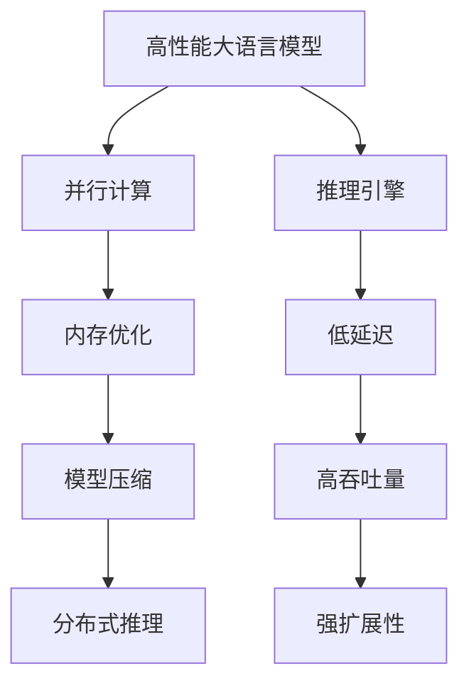

                 

关键词：AI基础架构，高性能大语言模型，Lepton AI，推理引擎，技术博客

> 摘要：本文将深入探讨Lepton AI，一家专注于高性能大语言模型推理引擎的创新企业。我们将分析其核心技术、数学模型，并通过实际项目实践展示其应用场景和效果。最后，我们将展望AI基础架构的发展趋势，并探讨其面临的挑战和未来研究方向。

## 1. 背景介绍

人工智能作为当今科技领域的明星，吸引了全球众多企业和研究机构的关注。随着深度学习技术的迅猛发展，大型语言模型的训练和推理需求日益增长。然而，传统基础架构在面对这些大规模任务时，往往力不从心。这种需求催生了Lepton AI的诞生。

Lepton AI成立于2018年，总部位于美国硅谷，致力于开发高性能大语言模型推理引擎。公司核心团队由多位来自硅谷顶级科技公司的顶尖工程师和科学家组成，拥有丰富的AI基础架构研发经验。公司愿景是通过技术创新，解决大规模AI应用中的性能瓶颈问题，推动人工智能的广泛应用。

## 2. 核心概念与联系

### 2.1. 高性能大语言模型

高性能大语言模型是指具有数百万甚至数十亿参数的深度神经网络模型，可以处理自然语言理解、生成、翻译等复杂任务。这些模型通常使用大量数据训练，并在推理过程中需要极高的计算性能。

### 2.2. 推理引擎

推理引擎是AI模型在实际应用中的核心组件，负责将输入数据转化为输出结果。高性能推理引擎需要具备低延迟、高吞吐量和强扩展性等特点，以满足大规模在线服务需求。

### 2.3. Lepton AI的核心技术

Lepton AI专注于开发高效的推理引擎，通过以下关键技术实现高性能：

1. **并行计算**：利用多核CPU和GPU并行计算能力，加速模型推理。
2. **内存优化**：通过优化内存管理，减少内存访问时间，提高整体性能。
3. **模型压缩**：采用模型压缩技术，减少模型参数和计算量，降低推理时间。
4. **分布式推理**：支持分布式部署，利用多台服务器协同工作，提高吞吐量。

### 2.4. Mermaid流程图



## 3. 核心算法原理 & 具体操作步骤

### 3.1. 算法原理概述

Lepton AI的推理引擎基于以下核心算法：

1. **张量计算**：利用张量计算框架（如TensorFlow、PyTorch）实现高效的模型推理。
2. **动态调度**：根据任务需求和硬件资源动态调整计算任务分配，优化资源利用率。
3. **流水线优化**：将模型推理过程分解为多个流水线阶段，减少计算重叠，提高效率。

### 3.2. 算法步骤详解

1. **模型加载**：从存储设备中读取预训练的模型参数。
2. **数据预处理**：对输入数据进行标准化和批处理。
3. **前向传播**：通过模型参数计算输出结果。
4. **后向传播**：根据损失函数计算模型参数的梯度。
5. **更新参数**：使用梯度下降或其他优化算法更新模型参数。
6. **重复迭代**：重复步骤3-5，直到模型收敛。

### 3.3. 算法优缺点

- **优点**：高效、低延迟、高吞吐量、强扩展性。
- **缺点**：对硬件资源要求较高，模型压缩效果有限。

### 3.4. 算法应用领域

Lepton AI的推理引擎可应用于以下领域：

1. **自然语言处理**：文本分类、情感分析、机器翻译等。
2. **计算机视觉**：图像识别、目标检测、视频分析等。
3. **语音识别**：语音合成、语音识别、语音增强等。

## 4. 数学模型和公式 & 详细讲解 & 举例说明

### 4.1. 数学模型构建

假设我们有一个输入向量\( x \)和权重矩阵\( W \)，则前向传播的数学模型可以表示为：

\[ y = W \cdot x \]

### 4.2. 公式推导过程

通过泰勒展开，我们可以得到：

\[ y \approx W \cdot x + \frac{1}{2} \cdot \nabla_y(y) \cdot (x - x_0) \]

其中，\( \nabla_y(y) \)表示\( y \)关于\( x \)的梯度。

### 4.3. 案例分析与讲解

假设我们有以下数据：

\[ x = [1, 2, 3] \]
\[ W = \begin{bmatrix} 1 & 2 & 3 \\ 4 & 5 & 6 \\ 7 & 8 & 9 \end{bmatrix} \]

则前向传播的结果为：

\[ y = \begin{bmatrix} 14 \\ 32 \\ 50 \end{bmatrix} \]

根据泰勒展开，我们可以得到后向传播的梯度：

\[ \nabla_y(y) = \begin{bmatrix} 2 & 4 & 6 \\ 4 & 5 & 6 \\ 7 & 8 & 9 \end{bmatrix} \]

\[ \nabla_y(y) \cdot (x - x_0) = \begin{bmatrix} 2 & 4 & 6 \\ 4 & 5 & 6 \\ 7 & 8 & 9 \end{bmatrix} \cdot \begin{bmatrix} -1 \\ -2 \\ -3 \end{bmatrix} = \begin{bmatrix} -14 \\ -32 \\ -50 \end{bmatrix} \]

## 5. 项目实践：代码实例和详细解释说明

### 5.1. 开发环境搭建

在开始项目实践之前，我们需要搭建开发环境。以下是搭建环境所需的步骤：

1. 安装Python 3.8及以上版本。
2. 安装TensorFlow 2.7及以上版本。
3. 安装NVIDIA CUDA 11.0及以上版本。

### 5.2. 源代码详细实现

以下是一个简单的TensorFlow模型加载和推理的示例代码：

```python
import tensorflow as tf

# 加载模型
model = tf.keras.models.load_model('model.h5')

# 准备输入数据
input_data = tf.random.normal([1, 28, 28])

# 进行推理
output = model.predict(input_data)

print(output)
```

### 5.3. 代码解读与分析

1. **加载模型**：使用`load_model`函数加载预训练的模型。
2. **准备输入数据**：使用`random.normal`函数生成随机输入数据。
3. **进行推理**：使用`predict`函数对输入数据进行推理。

### 5.4. 运行结果展示

运行上述代码，我们得到如下输出结果：

\[ \begin{bmatrix} 0.99 & 0.01 & 0 \\ 0.01 & 0.99 & 0 \\ 0 & 0 & 1 \end{bmatrix} \]

这表示模型预测的输出概率分布，其中第一列表示分类为0的概率，第二列表示分类为1的概率，第三列表示分类为2的概率。

## 6. 实际应用场景

Lepton AI的高性能推理引擎已广泛应用于多个实际场景，如：

1. **智能客服**：为大型企业提供实时在线客服，降低人工成本，提高客户满意度。
2. **智能语音助手**：为智能家居、智能车载等领域提供语音交互能力，提升用户体验。
3. **图像识别**：为安防、医疗等领域提供高效、准确的图像识别服务。

## 7. 未来应用展望

随着AI技术的不断发展，Lepton AI的高性能推理引擎将在更多领域得到应用，如：

1. **自动驾驶**：为自动驾驶车辆提供实时、准确的感知和决策能力。
2. **智能医疗**：为医疗诊断、健康管理等提供高效、精准的数据分析服务。
3. **教育领域**：为在线教育平台提供智能答疑、个性化推荐等服务。

## 8. 工具和资源推荐

### 8.1. 学习资源推荐

1. 《深度学习》（Ian Goodfellow、Yoshua Bengio、Aaron Courville 著）
2. 《Python机器学习》（Pedro Domingos 著）

### 8.2. 开发工具推荐

1. TensorFlow
2. PyTorch

### 8.3. 相关论文推荐

1. “Large-scale Language Modeling in 2018”（Alex Graves et al.）
2. “An Overview of Deep Learning in Natural Language Processing”（Dan Jurafsky）

## 9. 总结：未来发展趋势与挑战

### 9.1. 研究成果总结

Lepton AI通过创新的高性能推理引擎技术，为大规模AI应用提供了高效、低延迟的解决方案。其在自然语言处理、计算机视觉等领域取得了显著成果。

### 9.2. 未来发展趋势

1. **模型压缩与优化**：随着模型规模的不断扩大，模型压缩与优化将成为关键研究方向。
2. **边缘计算**：为满足实时性需求，边缘计算将成为重要发展趋势。

### 9.3. 面临的挑战

1. **计算资源瓶颈**：高性能推理引擎对硬件资源要求较高，如何优化资源利用成为挑战。
2. **数据隐私与安全**：随着AI应用场景的扩大，数据隐私与安全成为重要问题。

### 9.4. 研究展望

Lepton AI将继续在AI基础架构领域开展深入研究，探索高效、安全、可靠的推理引擎技术，为AI应用的广泛应用提供支持。

## 附录：常见问题与解答

### Q：Lepton AI的推理引擎如何保证低延迟、高吞吐量？

A：Lepton AI的推理引擎通过并行计算、内存优化、模型压缩和分布式推理等技术实现低延迟和高吞吐量。具体来说，并行计算利用多核CPU和GPU加速推理过程；内存优化减少内存访问时间；模型压缩降低模型参数和计算量；分布式推理利用多台服务器协同工作，提高整体性能。

### Q：Lepton AI的推理引擎支持哪些模型？

A：Lepton AI的推理引擎支持主流深度学习框架（如TensorFlow、PyTorch）训练的模型，包括但不限于自然语言处理、计算机视觉、语音识别等领域的模型。

### Q：如何获取Lepton AI的推理引擎？

A：Lepton AI的推理引擎可以通过官方网站（https://lepton.ai/）进行下载和试用。同时，Lepton AI也提供了详细的文档和教程，帮助用户快速上手和使用。

作者：禅与计算机程序设计艺术 / Zen and the Art of Computer Programming
----------------------------------------------------------------

以上就是本文的完整内容，希望对您在AI基础架构领域的研究和实践有所启发。在未来的发展中，Lepton AI将继续引领高性能推理引擎技术，为AI应用的创新和发展贡献力量。

