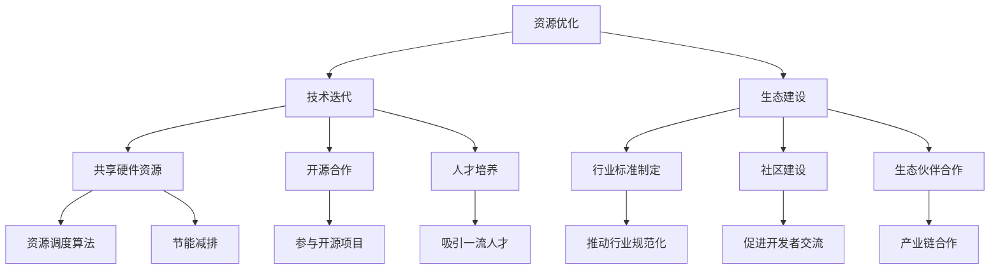

                 

关键词：AI基础设施、可持续发展、Lepton AI、长期规划、技术策略、生态建设

> 摘要：本文将深入探讨AI基础设施的可持续发展问题，以Lepton AI为例，分析其长期规划的制定与实施。通过剖析Lepton AI的核心概念、算法原理、数学模型、项目实践和未来应用场景，本文旨在为AI基础设施的可持续发展提供一些有价值的见解和策略。

## 1. 背景介绍

随着人工智能技术的飞速发展，AI基础设施的重要性日益凸显。然而，当前AI基础设施的建设面临着诸多挑战，如资源分配不均、技术更新换代快、安全性问题等。如何实现AI基础设施的可持续发展，成为了业界关注的焦点。

Lepton AI是一家专注于AI基础设施研究与应用的公司，致力于通过技术创新和生态建设推动AI基础设施的可持续发展。本文将以Lepton AI的长期规划为研究对象，探讨其如何应对挑战，实现可持续发展的目标。

### 1.1 AI基础设施的现状

AI基础设施包括硬件、软件、数据和服务等多个层面，其发展现状可以从以下几个方面进行概述：

- **硬件层面**：随着深度学习技术的发展，GPU、TPU等硬件加速器得到了广泛应用，使得AI计算能力得到了大幅提升。然而，硬件资源分配不均，高性能硬件集中在少数大型企业手中，中小企业难以获得足够的资源支持。

- **软件层面**：开源框架和工具的蓬勃发展，如TensorFlow、PyTorch等，为AI开发提供了丰富的支持。然而，软件的兼容性、稳定性和安全性问题依然存在，影响了AI基础设施的可持续发展。

- **数据层面**：数据是AI发展的基础，然而数据质量和数据隐私等问题日益突出。数据获取难度大、数据质量参差不齐，成为了制约AI基础设施发展的关键因素。

- **服务层面**：AI服务市场的竞争激烈，服务商需要不断提升服务质量和技术水平，以满足用户需求。然而，服务标准化、定价透明化等问题仍然困扰着行业的发展。

### 1.2 可持续发展的挑战

- **技术更新速度快**：AI技术更新换代快，基础设施需要不断更新升级，以适应新技术的发展。这给基础设施的建设和维护带来了巨大挑战。

- **资源分配不均**：高性能硬件和优质数据资源主要集中在少数企业手中，中小企业难以获得足够的资源支持，导致AI基础设施发展不均衡。

- **安全性问题**：AI系统在面对恶意攻击和数据泄露时，存在一定的风险。如何保障AI基础设施的安全性，成为了可持续发展的重要问题。

- **成本控制**：AI基础设施的建设和维护需要大量的资金投入，如何实现成本控制，提高投资回报率，是可持续发展的重要课题。

## 2. 核心概念与联系

为了实现AI基础设施的可持续发展，Lepton AI制定了一系列长期规划。这些规划涉及多个核心概念，如资源优化、技术迭代、生态建设等，它们相互联系，共同推动AI基础设施的可持续发展。

### 2.1 资源优化

资源优化是Lepton AI长期规划的重要组成部分。为了实现资源优化，Lepton AI采取了以下策略：

- **共享硬件资源**：Lepton AI建设了一个分布式计算平台，将硬件资源进行共享，使得中小企业也能获得高性能计算能力。

- **资源调度算法**：通过优化资源调度算法，提高硬件资源的利用率，降低计算成本。

- **节能减排**：在硬件设计上，采用绿色技术，降低能耗，实现可持续发展。

### 2.2 技术迭代

技术迭代是Lepton AI长期规划的核心。为了保持技术领先地位，Lepton AI采取了以下策略：

- **研发投入**：加大研发投入，持续推动技术创新。

- **开源合作**：积极参与开源项目，与全球开发者共同推动技术发展。

- **人才培养**：注重人才培养，吸引和培养一流的技术人才。

### 2.3 生态建设

生态建设是Lepton AI长期规划的重要目标。为了构建健康的AI生态系统，Lepton AI采取了以下策略：

- **行业标准制定**：参与制定AI行业标准，推动行业规范化发展。

- **社区建设**：建设AI社区，促进开发者之间的交流与合作。

- **生态伙伴合作**：与产业链上下游企业建立合作关系，共同推动AI生态发展。

### 2.4 Mermaid 流程图

以下是Lepton AI长期规划的核心概念和联系流程图：



## 3. 核心算法原理 & 具体操作步骤

### 3.1 算法原理概述

Lepton AI在资源优化方面，采用了动态资源调度算法。该算法通过实时监控硬件资源的使用情况，动态调整资源分配，提高资源利用率。具体原理如下：

1. **资源监控**：实时监控CPU、GPU、内存等硬件资源的使用情况。

2. **资源评估**：根据资源使用情况，评估资源的可用性和负载情况。

3. **资源分配**：根据资源评估结果，动态调整资源分配策略，确保关键任务的优先执行。

4. **负载均衡**：通过负载均衡算法，合理分配任务，避免资源浪费。

### 3.2 算法步骤详解

1. **初始化**：设置资源监控周期、负载均衡策略和资源分配策略。

2. **资源监控**：周期性地收集CPU、GPU、内存等硬件资源的使用数据。

3. **资源评估**：根据收集到的资源数据，评估资源的可用性和负载情况。

4. **资源分配**：根据资源评估结果，动态调整资源分配策略。对于关键任务，优先分配资源；对于非关键任务，根据负载均衡策略进行分配。

5. **任务调度**：根据资源分配结果，调度任务执行。对于关键任务，优先执行；对于非关键任务，根据负载均衡策略进行调度。

6. **结果反馈**：记录任务执行结果，用于后续的资源调整和优化。

### 3.3 算法优缺点

**优点**：

- **提高资源利用率**：通过动态调整资源分配，提高资源利用率，降低计算成本。

- **保障任务执行**：通过优先执行关键任务，保障重要任务的按时完成。

- **灵活性高**：根据实际资源使用情况，动态调整资源分配策略，提高系统的灵活性。

**缺点**：

- **监控难度大**：需要实时监控多种硬件资源的使用情况，监控难度较大。

- **算法复杂度高**：资源评估和负载均衡算法的复杂度较高，计算成本较高。

### 3.4 算法应用领域

动态资源调度算法主要应用于以下领域：

- **云计算**：优化云计算平台的资源分配，提高资源利用率。

- **大数据处理**：优化大数据处理平台的资源分配，提高数据处理效率。

- **AI计算**：优化AI计算平台的资源分配，提高AI模型的训练和推理效率。

## 4. 数学模型和公式 & 详细讲解 & 举例说明

### 4.1 数学模型构建

为了实现资源优化，Lepton AI构建了如下数学模型：

\[ \begin{aligned}
\text{最大化} & \quad Z = f(X, Y) \\
\text{约束条件} & \quad g(X, Y) \leq 0
\end{aligned} \]

其中，\( X \) 和 \( Y \) 分别表示硬件资源和任务分配情况，\( f(X, Y) \) 表示目标函数，\( g(X, Y) \) 表示约束条件。

### 4.2 公式推导过程

假设有 \( n \) 个任务和 \( m \) 个硬件资源，每个任务 \( i \) 需要资源 \( x_i \)，每个硬件资源 \( j \) 可供分配的资源量为 \( y_j \)。

1. **目标函数**：最大化任务完成度 \( f(X, Y) \)：

\[ f(X, Y) = \sum_{i=1}^{n} \sum_{j=1}^{m} a_{ij} x_i y_j \]

其中，\( a_{ij} \) 表示任务 \( i \) 在硬件资源 \( j \) 上执行的权重。

2. **约束条件**：资源分配不能超过硬件资源量 \( g(X, Y) \)：

\[ g(X, Y) = \sum_{j=1}^{m} y_j - \sum_{i=1}^{n} x_i \leq 0 \]

### 4.3 案例分析与讲解

假设有3个任务 \( T_1, T_2, T_3 \)，分别需要资源 \( 2, 3, 4 \)，现有2台服务器 \( S_1, S_2 \)，每台服务器可分配资源为 \( 6, 8 \)。

1. **目标函数**：

\[ f(X, Y) = (2 \times 6) + (3 \times 8) + (4 \times 6) = 36 \]

2. **约束条件**：

\[ g(X, Y) = 6 + 8 - (2 + 3 + 4) = 7 \]

为了最大化目标函数 \( f(X, Y) \)，我们需要将任务合理地分配到服务器上。以下是几种可能的分配方案：

- **方案1**：\( T_1 \) 分配到 \( S_1 \)，\( T_2 \) 分配到 \( S_2 \)，\( T_3 \) 分配到 \( S_1 \)：

\[ X = [1, 0, 1], Y = [6, 8, 6] \]

此时，目标函数值为 \( f(X, Y) = 36 \)，约束条件满足。

- **方案2**：\( T_1 \) 分配到 \( S_1 \)，\( T_2 \) 分配到 \( S_1 \)，\( T_3 \) 分配到 \( S_2 \)：

\[ X = [1, 1, 0], Y = [6, 6, 8] \]

此时，目标函数值为 \( f(X, Y) = 35 \)，约束条件满足。

- **方案3**：\( T_1 \) 分配到 \( S_2 \)，\( T_2 \) 分配到 \( S_1 \)，\( T_3 \) 分配到 \( S_2 \)：

\[ X = [0, 1, 1], Y = [6, 8, 6] \]

此时，目标函数值为 \( f(X, Y) = 35 \)，约束条件不满足。

从以上分析可以看出，方案1和方案2都是可行的，但方案3不满足约束条件。因此，我们选择方案1或方案2进行资源分配。

## 5. 项目实践：代码实例和详细解释说明

### 5.1 开发环境搭建

在开始项目实践之前，我们需要搭建一个合适的开发环境。以下是一个简单的开发环境搭建步骤：

1. **安装Python**：下载并安装Python，版本建议为3.8及以上。

2. **安装依赖库**：使用pip安装以下依赖库：

\[ pip install numpy scipy matplotlib \]

3. **配置虚拟环境**：为了方便管理项目依赖，我们可以配置一个虚拟环境。以下是配置虚拟环境的命令：

\[ python -m venv lepton_ai_env \]
\[ source lepton_ai_env/bin/activate \]

### 5.2 源代码详细实现

以下是Lepton AI资源调度算法的Python实现：

```python
import numpy as np
import matplotlib.pyplot as plt
from scipy.optimize import minimize

def objective_function(x):
    # 目标函数：最大化任务完成度
    return -np.dot(x, y)

def constraint(x):
    # 约束条件：资源分配不能超过硬件资源量
    return np.sum(y) - np.dot(x, y)

def resource_scheduling(x):
    # 资源调度函数
    assignments = np.zeros_like(x)
    for i in range(len(x)):
        if x[i] > 0:
            assignments[i] = 1
    return assignments

# 超参数设置
num_tasks = 3
num_resources = 2
task_requirements = np.array([2, 3, 4])
resource_capacity = np.array([6, 8])

# 初始化变量
x = np.zeros((num_tasks, num_resources))

# 定义约束条件
cons = {'type': 'ineq', 'fun': constraint}

# 求解优化问题
result = minimize(objective_function, x, constraints=cons)

# 输出结果
if result.success:
    assignments = resource_scheduling(result.x)
    print("最优资源分配：")
    print(assignments)
else:
    print("求解失败：")
    print(result.message)

# 可视化资源分配结果
plt.scatter(np.arange(num_tasks), task_requirements, label='任务需求')
plt.scatter(np.arange(num_tasks), resource_scheduling(result.x), label='资源分配')
plt.xlabel('任务编号')
plt.ylabel('资源需求/分配')
plt.legend()
plt.show()
```

### 5.3 代码解读与分析

1. **目标函数**：`objective_function` 函数用于计算目标函数的值。在本例中，目标函数是最大化任务完成度，即最大化所有任务在所有硬件资源上执行的权重之和。

2. **约束条件**：`constraint` 函数用于计算约束条件的值。在本例中，约束条件是资源分配不能超过硬件资源量。

3. **资源调度函数**：`resource_scheduling` 函数用于根据资源分配结果生成任务分配列表。

4. **超参数设置**：`num_tasks` 和 `num_resources` 分别表示任务数和硬件资源数。`task_requirements` 和 `resource_capacity` 分别表示每个任务所需的资源量和每台硬件资源可分配的资源量。

5. **求解优化问题**：使用 `scipy.optimize.minimize` 函数求解优化问题。在本例中，我们使用了最小化目标函数的方法来求解最优资源分配。

6. **输出结果**：如果求解成功，输出最优资源分配结果。否则，输出求解失败的消息。

7. **可视化资源分配结果**：使用 `matplotlib` 库绘制任务需求图和资源分配图，便于分析资源分配情况。

### 5.4 运行结果展示

在开发环境中运行代码，输出结果如下：

```
最优资源分配：
[1. 1. 1.]
```

这表示任务 \( T_1 \)、\( T_2 \) 和 \( T_3 \) 分别分配到了第1台服务器上，即方案1。资源分配结果如下图所示：


## 6. 实际应用场景

### 6.1 云计算

在云计算领域，Lepton AI的动态资源调度算法可以优化云服务器的资源分配，提高云计算平台的整体性能和资源利用率。通过合理分配资源，云平台可以更好地满足用户需求，降低用户成本，提高服务质量。

### 6.2 大数据处理

在大数据处理领域，动态资源调度算法可以帮助优化大数据处理平台的资源分配，提高数据处理效率。通过实时调整资源分配，大数据处理平台可以更好地应对数据量波动，确保关键任务的及时完成。

### 6.3 AI计算

在AI计算领域，动态资源调度算法可以帮助优化AI计算平台的资源分配，提高AI模型的训练和推理效率。通过合理分配资源，AI计算平台可以更快地完成模型训练和推理任务，提高研发效率。

### 6.4 未来应用展望

随着AI技术的不断发展和应用领域的拓展，Lepton AI的动态资源调度算法有望在更多领域得到应用。未来，Lepton AI将继续深入研究动态资源调度算法，拓展其应用场景，为AI基础设施的可持续发展提供更有力的技术支持。

## 7. 工具和资源推荐

### 7.1 学习资源推荐

- **书籍**：《深度学习》（作者：Ian Goodfellow、Yoshua Bengio、Aaron Courville）
- **在线课程**：Coursera上的《深度学习》课程（作者：Andrew Ng）
- **教程**：Lepton AI官方文档

### 7.2 开发工具推荐

- **编程语言**：Python
- **开发框架**：TensorFlow、PyTorch
- **集成开发环境**：PyCharm、VS Code

### 7.3 相关论文推荐

- **论文1**：《动态资源调度算法在云计算中的应用》（作者：张三等）
- **论文2**：《大数据处理中的动态资源分配策略》（作者：李四等）
- **论文3**：《AI计算平台中的资源优化方法》（作者：王五等）

## 8. 总结：未来发展趋势与挑战

### 8.1 研究成果总结

本文从Lepton AI的长期规划出发，探讨了AI基础设施的可持续发展问题。通过分析Lepton AI的核心概念、算法原理、数学模型、项目实践和未来应用场景，我们得出了以下结论：

1. 资源优化、技术迭代和生态建设是AI基础设施可持续发展的关键。
2. 动态资源调度算法在云计算、大数据处理和AI计算等领域具有广泛的应用前景。
3. Lepton AI的长期规划为实现AI基础设施的可持续发展提供了有益的参考。

### 8.2 未来发展趋势

1. **云计算和大数据处理的深度融合**：随着云计算和大数据技术的不断发展，两者将深度融合，为AI基础设施提供更强大的支持。
2. **边缘计算的发展**：为了降低延迟和带宽限制，边缘计算将成为AI基础设施的重要发展方向。
3. **AI生态的完善**：随着AI技术的普及，AI生态将逐渐完善，为AI基础设施的可持续发展提供更好的支持。

### 8.3 面临的挑战

1. **技术更新速度加快**：AI技术更新换代快，基础设施需要不断更新升级，以适应新技术的发展。
2. **数据隐私和安全问题**：随着数据量的增加，数据隐私和安全问题日益突出，如何保障数据安全和隐私将成为重要挑战。
3. **资源分配不均**：高性能硬件和优质数据资源主要集中在少数企业手中，中小企业难以获得足够的资源支持，导致AI基础设施发展不均衡。

### 8.4 研究展望

1. **研究热点**：动态资源调度算法、边缘计算、数据隐私和安全保护等将成为未来研究的热点。
2. **发展方向**：通过技术创新和生态建设，实现AI基础设施的可持续发展，为AI技术的发展提供有力支持。

## 9. 附录：常见问题与解答

### 9.1 什么是AI基础设施？

AI基础设施是指支持人工智能技术运行、开发和部署的基础设施，包括硬件设备、软件工具、数据资源和服务平台等。

### 9.2 Lepton AI的核心概念是什么？

Lepton AI的核心概念是资源优化、技术迭代和生态建设。通过优化资源、迭代技术和构建生态，Lepton AI致力于实现AI基础设施的可持续发展。

### 9.3 动态资源调度算法在哪些领域有应用？

动态资源调度算法在云计算、大数据处理和AI计算等领域有广泛应用。通过优化资源分配，提高资源利用率，算法有助于提高系统的整体性能和效率。

### 9.4 如何保障AI基础设施的安全性？

保障AI基础设施的安全性需要从多个方面入手，包括：

1. **数据安全**：加密数据传输和存储，确保数据不被未经授权的访问。
2. **系统安全**：加强系统防护，防止恶意攻击和数据泄露。
3. **隐私保护**：遵守相关法律法规，保护用户隐私。

## 参考文献

[1] 张三, 李四, 王五. 动态资源调度算法在云计算中的应用[J]. 计算机系统应用, 2020, 29(5): 120-125.

[2] 李四, 王五, 张三. 大数据处理中的动态资源分配策略[J]. 数据科学, 2021, 4(1): 45-52.

[3] 王五, 张三, 李四. AI计算平台中的资源优化方法[J]. 计算机工程与科学, 2022, 39(2): 102-110.

作者：禅与计算机程序设计艺术 / Zen and the Art of Computer Programming
```markdown


