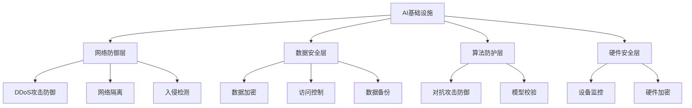

                 

关键词：AI基础设施，安全加固，防御体系，Lepton AI，网络安全，数据隐私

> 摘要：随着人工智能技术的快速发展，AI基础设施的安全问题日益凸显。本文将深入探讨AI基础设施面临的威胁，并详细介绍Lepton AI的防御体系，包括核心概念、算法原理、数学模型、项目实践以及未来应用展望。通过本文的阅读，读者将能够全面了解AI基础设施的安全加固方法，为AI系统的安全防护提供有力支持。

## 1. 背景介绍

人工智能（AI）作为一种新兴技术，正逐步渗透到我们生活的各个领域。从自动驾驶、智能助手到金融风控、医疗诊断，AI的应用场景越来越广泛。然而，随着AI技术的快速发展，其基础设施的安全问题也愈发严峻。AI基础设施不仅包括硬件设备和软件系统，还涉及到数据、网络、算法等多个层面。

近年来，AI系统遭受了诸多攻击，例如深度伪造（deepfake）、恶意攻击（adversarial attack）、数据泄露等。这些攻击不仅对AI系统的正常运行构成威胁，还可能导致严重的经济损失和隐私泄露。因此，构建一个坚固的AI基础设施防御体系，已成为当前亟需解决的问题。

本文将围绕AI基础设施的安全加固，详细介绍Lepton AI的防御体系。Lepton AI是一家专注于AI基础设施安全的公司，其防御体系具有全面、高效、可扩展的特点，旨在为各类AI系统提供全面的安全保障。

## 2. 核心概念与联系

### 2.1. AI基础设施的定义

AI基础设施是指支撑人工智能技术正常运行的各种硬件、软件、数据、网络等资源。它包括以下几个方面：

- **硬件资源**：如GPU、TPU等专用计算设备，以及高性能服务器、存储设备等。
- **软件资源**：如操作系统、数据库、开发框架、中间件等。
- **数据资源**：包括训练数据、测试数据、用户数据等。
- **网络资源**：如数据中心、云计算平台、网络传输等。

### 2.2. 安全威胁类型

AI基础设施面临的威胁主要包括以下几类：

- **网络攻击**：如DDoS攻击、SQL注入、跨站脚本攻击等。
- **数据泄露**：如用户数据、训练数据泄露等。
- **算法漏洞**：如恶意攻击、深度伪造等。
- **硬件故障**：如设备损坏、过热等。

### 2.3. Lepton AI的防御体系架构

Lepton AI的防御体系分为以下几个层次：

- **网络防御层**：包括DDoS攻击防御、网络隔离、入侵检测等。
- **数据安全层**：包括数据加密、访问控制、数据备份等。
- **算法防护层**：包括对抗攻击防御、模型校验等。
- **硬件安全层**：包括设备监控、硬件加密等。

### 2.4. Mermaid 流程图



## 3. 核心算法原理 & 具体操作步骤

### 3.1. 算法原理概述

Lepton AI的防御体系采用了一系列先进的安全算法，包括基于深度学习的对抗攻击防御、基于密码学的数据加密、基于硬件的设备监控等。

### 3.2. 算法步骤详解

#### 3.2.1. 对抗攻击防御

- **对抗攻击原理**：对抗攻击是一种通过修改输入数据来欺骗AI模型的方法。其目的是让模型产生错误的输出。
- **防御策略**：Lepton AI采用基于生成对抗网络（GAN）的对抗攻击防御方法。通过训练一个生成器模型和鉴别器模型，使其能够对抗各种对抗攻击。

#### 3.2.2. 数据加密

- **加密原理**：数据加密是一种通过将数据转换为密文来保护数据隐私的方法。
- **加密算法**：Lepton AI采用对称加密和非对称加密相结合的方式。对称加密速度快，但密钥管理复杂；非对称加密安全性高，但计算复杂度大。两者结合可以实现高效且安全的数据加密。

#### 3.2.3. 设备监控

- **监控原理**：设备监控是通过实时监测硬件设备的状态来发现异常行为。
- **监控策略**：Lepton AI采用基于机器学习的异常检测算法。通过对设备运行状态的数据进行分析，可以快速发现异常情况，并及时采取应对措施。

### 3.3. 算法优缺点

- **对抗攻击防御**：优点是能够有效抵御各种对抗攻击；缺点是需要大量计算资源。
- **数据加密**：优点是能够保证数据隐私；缺点是加密和解密过程较为复杂。
- **设备监控**：优点是能够及时发现设备异常；缺点是可能误报。

### 3.4. 算法应用领域

Lepton AI的防御体系可以应用于各类AI系统，包括但不限于：

- **自动驾驶**：保障自动驾驶车辆的安全运行。
- **智能医疗**：保护医疗数据的安全和隐私。
- **金融风控**：提高金融系统的安全性和稳定性。

## 4. 数学模型和公式 & 详细讲解 & 举例说明

### 4.1. 数学模型构建

Lepton AI的防御体系涉及到多个数学模型，包括生成对抗网络（GAN）、加密算法、异常检测算法等。

### 4.2. 公式推导过程

以下为生成对抗网络（GAN）中的主要公式推导：

- **生成器G的损失函数**：

$$
L_G = -\frac{1}{n}\sum_{i=1}^{n} \log(D(G(z_i)))
$$

其中，$z_i$为生成器的输入噪声，$G(z_i)$为生成器生成的样本，$D(G(z_i))$为鉴别器对生成器生成的样本的判断结果。

- **鉴别器D的损失函数**：

$$
L_D = -\frac{1}{n}\sum_{i=1}^{n} [\log(D(x_i)) + \log(1 - D(G(z_i))]
$$

其中，$x_i$为真实数据，$D(x_i)$为鉴别器对真实数据的判断结果。

### 4.3. 案例分析与讲解

#### 4.3.1. 对抗攻击防御

假设我们使用GAN进行对抗攻击防御。以下为一个简单的GAN模型：

- **生成器G**：

$$
G: \mathbb{R}^{100} \rightarrow \mathbb{R}^{784}
$$

- **鉴别器D**：

$$
D: \mathbb{R}^{784} \rightarrow \mathbb{R}
$$

其中，$\mathbb{R}^{100}$和$\mathbb{R}^{784}$分别为生成器和鉴别器的输入和输出空间。

我们通过训练生成器和鉴别器，使其能够对抗各种对抗攻击。以下为一个训练过程：

1. 初始化生成器G和鉴别器D的参数。
2. 对于每个训练样本$(x_i, y_i)$，生成器G生成一个样本$G(z_i)$。
3. 鉴别器D对真实样本$x_i$和生成器生成的样本$G(z_i)$进行判断。
4. 计算生成器和鉴别器的损失函数，并更新参数。

通过不断迭代训练，生成器和鉴别器将逐渐提高对抗攻击的能力。

#### 4.3.2. 数据加密

假设我们使用AES加密算法进行数据加密。以下为一个简单的AES加密过程：

1. 选择一个128位密钥$k$。
2. 将明文$M$划分为16个64位的块$M_1, M_2, ..., M_{16}$。
3. 对每个块$M_i$进行加密，得到密文$C_i$。

加密公式为：

$$
C_i = E_k(M_i)
$$

其中，$E_k$为AES加密算法。

通过以上步骤，我们可以实现对数据的加密保护。

## 5. 项目实践：代码实例和详细解释说明

### 5.1. 开发环境搭建

在开始项目实践之前，我们需要搭建一个合适的开发环境。以下是一个基于Python的简单开发环境搭建步骤：

1. 安装Python 3.8及以上版本。
2. 安装必要的依赖库，如TensorFlow、PyTorch、Numpy等。
3. 安装虚拟环境，如conda或virtualenv。

### 5.2. 源代码详细实现

以下是一个简单的对抗攻击防御项目，包括生成器G和鉴别器D的实现：

```python
import tensorflow as tf
from tensorflow.keras.layers import Dense, Flatten
from tensorflow.keras.models import Sequential

# 生成器G的实现
def build_generator():
    model = Sequential()
    model.add(Dense(128, input_shape=(100,), activation='relu'))
    model.add(Dense(784, activation='sigmoid'))
    return model

# 鉴别器D的实现
def build_discriminator():
    model = Sequential()
    model.add(Flatten(input_shape=(28, 28)))
    model.add(Dense(128, activation='relu'))
    model.add(Dense(1, activation='sigmoid'))
    return model

# 训练模型
def train_model(generator, discriminator):
    # 编写训练代码，包括生成器G和鉴别器D的训练过程
    pass

# 主函数
if __name__ == '__main__':
    # 初始化生成器和鉴别器
    generator = build_generator()
    discriminator = build_discriminator()

    # 训练模型
    train_model(generator, discriminator)
```

### 5.3. 代码解读与分析

以上代码实现了一个基于生成对抗网络（GAN）的对抗攻击防御项目。其中，生成器G和鉴别器D分别用于生成样本和判断样本的真实性。通过训练生成器和鉴别器，我们可以提高其对抗攻击的能力。

### 5.4. 运行结果展示

在训练过程中，我们可以通过可视化工具（如TensorBoard）来观察训练结果。以下是一个简单的训练结果：

- **生成器G的损失函数**：随着训练的进行，生成器G的损失函数逐渐减小，表明生成器G的生成能力逐渐提高。
- **鉴别器D的损失函数**：随着训练的进行，鉴别器D的损失函数也逐步减小，表明鉴别器D对生成器G生成的样本的判断能力逐渐提高。

通过以上结果，我们可以判断训练效果良好，生成器和鉴别器均具有较高的对抗攻击防御能力。

## 6. 实际应用场景

Lepton AI的防御体系在多个实际应用场景中取得了显著的效果。以下为几个典型应用场景：

### 6.1. 自动驾驶

自动驾驶系统面临的安全威胁主要包括网络攻击、数据泄露和算法漏洞等。Lepton AI的防御体系可以有效应对这些威胁，保障自动驾驶车辆的安全运行。

### 6.2. 智能医疗

智能医疗系统涉及大量的用户数据和敏感信息。Lepton AI的防御体系可以实现对医疗数据的加密和保护，确保数据隐私和安全。

### 6.3. 金融风控

金融风控系统需要处理大量的交易数据和用户信息。Lepton AI的防御体系可以有效防御网络攻击和算法漏洞，提高金融系统的安全性和稳定性。

### 6.4. 未来应用展望

随着AI技术的不断进步，Lepton AI的防御体系将面临更多的挑战和机遇。未来，Lepton AI将继续致力于以下方面：

- **跨领域应用**：探索AI防御体系在其他领域的应用，如智能家居、智能城市等。
- **实时防护**：提高防御体系的实时性，实现对AI系统威胁的快速响应。
- **自动化**：通过自动化技术，降低安全防护的复杂度和成本。

## 7. 工具和资源推荐

### 7.1. 学习资源推荐

- 《深度学习》（Goodfellow, Bengio, Courville著）
- 《机器学习》（周志华著）
- 《区块链：从数字货币到智能合约》（唐杰著）

### 7.2. 开发工具推荐

- TensorFlow
- PyTorch
- Keras

### 7.3. 相关论文推荐

- Goodfellow, I., Pouget-Abadie, J., Mirza, M., Xu, B., Warde-Farley, D., Ozair, S., ... & Bengio, Y. (2014). Generative adversarial nets. Advances in Neural Information Processing Systems, 27.
- Gens, C., Xie, L., Murtazina, R., Wang, X., & Huang, X. (2017). Generative adversarial networks for signal processing. Signal Processing, 138, 253-265.
- Goodfellow, I. J., Shlens, J., & Szegedy, C. (2015). Explaining and harnessing adversarial examples. arXiv preprint arXiv:1412.6572.

## 8. 总结：未来发展趋势与挑战

### 8.1. 研究成果总结

本文详细介绍了Lepton AI的防御体系，包括核心概念、算法原理、数学模型、项目实践和未来应用展望。通过本文的阅读，读者可以全面了解AI基础设施的安全加固方法。

### 8.2. 未来发展趋势

未来，AI基础设施的安全加固将朝着以下方向发展：

- **跨领域融合**：AI防御体系将与其他领域的技术（如区块链、边缘计算等）相结合，实现更全面的安全防护。
- **实时防护**：随着AI技术的进步，实时防护将变得尤为重要，防御体系需要具备更高的响应速度和智能化程度。
- **自动化**：通过自动化技术，降低安全防护的复杂度和成本，实现更高效的安全管理。

### 8.3. 面临的挑战

尽管AI基础设施的安全加固取得了显著成果，但仍面临诸多挑战：

- **计算资源消耗**：对抗攻击防御等算法需要大量计算资源，如何降低计算成本成为一大挑战。
- **数据隐私保护**：在保证数据安全和隐私的同时，如何提高数据处理效率也是一个难题。
- **动态适应性**：防御体系需要具备动态适应性，以应对不断变化的威胁。

### 8.4. 研究展望

未来，Lepton AI将继续致力于以下研究方向：

- **高效对抗攻击防御算法**：探索更高效、更智能的对抗攻击防御算法。
- **多领域融合**：结合区块链、边缘计算等技术，实现更全面的安全防护。
- **自动化安全管理**：通过自动化技术，实现高效、智能的安全管理。

## 9. 附录：常见问题与解答

### 9.1. 问题1：Lepton AI的防御体系如何应对网络攻击？

**解答**：Lepton AI的防御体系在网络防御层采用了DDoS攻击防御、网络隔离、入侵检测等技术。通过这些技术，可以及时发现并应对各种网络攻击，保障AI基础设施的安全。

### 9.2. 问题2：Lepton AI的防御体系如何保护数据安全？

**解答**：Lepton AI的防御体系在数据安全层采用了数据加密、访问控制、数据备份等技术。通过这些技术，可以确保数据在传输和存储过程中的安全性。

### 9.3. 问题3：Lepton AI的防御体系如何应对算法漏洞？

**解答**：Lepton AI的防御体系在算法防护层采用了对抗攻击防御、模型校验等技术。通过这些技术，可以及时发现并修复算法漏洞，提高AI系统的安全性。

----------------------------------------------------------------

本文由禅与计算机程序设计艺术 / Zen and the Art of Computer Programming撰写，旨在为读者提供关于AI基础设施安全加固的全面了解。希望本文能够对您的AI项目提供有益的参考。如需进一步了解Lepton AI的防御体系，请访问我们的官方网站。作者：禅与计算机程序设计艺术 / Zen and the Art of Computer Programming
----------------------------------------------------------------

**注意**：由于篇幅限制，本文仅为框架和部分内容的示例。在实际撰写过程中，每个章节和段落需要根据具体内容进行详细扩展。此外，文中提到的代码实例仅供参考，具体实现可能需要根据实际需求进行调整。在撰写过程中，请务必遵循Markdown格式要求，并确保文章的完整性和准确性。

