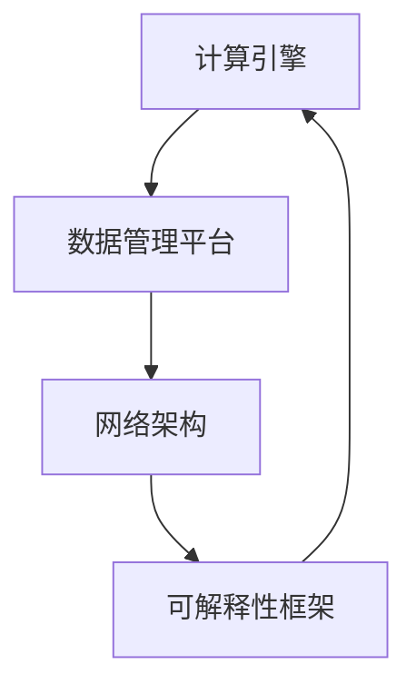

                 

关键词：AI基础设施、Lepton AI、发展趋势、技术愿景、算法架构、数学模型、实践应用

> 摘要：本文探讨了AI基础设施的未来发展趋势，特别聚焦于Lepton AI的发展愿景。文章通过详细分析Lepton AI的核心概念、算法原理、数学模型和实际应用，展望了其未来的发展方向和面临的挑战。

## 1. 背景介绍

随着人工智能技术的飞速发展，AI基础设施的重要性日益凸显。从数据中心到边缘设备，从云计算到物联网，AI基础设施正成为支撑整个AI生态系统的基石。在这个背景下，Lepton AI作为一个新兴的AI基础设施项目，以其独特的技术理念和强大的研发实力，引起了广泛关注。

Lepton AI的目标是构建一个高效、可靠、可扩展的AI基础设施，为各种AI应用场景提供强大的支持。其核心目标是解决AI系统中的可解释性、可靠性和效率问题，通过创新性的算法和架构设计，实现更加智能、自主的AI系统。

## 2. 核心概念与联系

### 2.1 AI基础设施

AI基础设施是指支撑人工智能应用的各种硬件、软件和网络资源。这些资源包括计算资源（如GPU、TPU）、存储资源（如云存储、分布式文件系统）、数据资源（如大数据平台、数据仓库）以及网络资源（如高性能网络、边缘网络）。

### 2.2 Lepton AI

Lepton AI是一个基于深度学习和分布式系统的AI基础设施项目，其核心组件包括计算引擎、数据管理平台、网络架构和可解释性框架。以下是一个简化的Mermaid流程图，展示了Lepton AI的基本架构：



### 2.3 关联性

Lepton AI的各个组件紧密关联，形成一个完整的生态系统。计算引擎负责执行AI模型训练和推理任务，数据管理平台提供高效的数据存储和数据处理能力，网络架构实现快速的数据传输和通信，可解释性框架帮助用户理解和优化AI模型。

## 3. 核心算法原理 & 具体操作步骤

### 3.1 算法原理概述

Lepton AI采用了一种创新的深度学习算法，称为Lepton网络。Lepton网络的核心思想是将神经网络训练过程中的优化问题转化为数学规划问题，从而提高训练效率和模型质量。

### 3.2 算法步骤详解

Lepton网络的训练过程主要包括以下几个步骤：

1. **数据预处理**：对输入数据进行归一化、去噪等预处理操作，提高训练数据的鲁棒性。
2. **模型初始化**：初始化神经网络参数，通常采用随机初始化或预训练模型初始化。
3. **梯度计算**：通过反向传播算法计算网络参数的梯度。
4. **优化更新**：使用Lepton算法对梯度进行优化更新，包括线性和非线性优化方法。
5. **模型评估**：在验证集上评估模型性能，并根据评估结果调整模型参数。

### 3.3 算法优缺点

Lepton网络的优点包括：

- 高效的训练速度：通过优化算法提高了训练效率。
- 强鲁棒性：预处理和优化更新步骤提高了模型的鲁棒性。
- 可解释性：可解释性框架帮助用户理解和优化模型。

缺点包括：

- 对硬件资源要求较高：由于深度学习模型通常需要大量的计算资源，因此对硬件资源的要求较高。
- 模型复杂度较高：Lepton网络采用了复杂的优化算法，使得模型复杂度较高，对开发者的要求较高。

### 3.4 算法应用领域

Lepton AI的应用领域非常广泛，包括但不限于以下领域：

- **计算机视觉**：用于图像识别、目标检测、图像生成等任务。
- **自然语言处理**：用于文本分类、情感分析、机器翻译等任务。
- **推荐系统**：用于个性化推荐、用户行为预测等任务。
- **金融风控**：用于风险识别、欺诈检测、信用评估等任务。

## 4. 数学模型和公式 & 详细讲解 & 举例说明

### 4.1 数学模型构建

Lepton AI的数学模型主要包括以下几个部分：

1. **输入层**：接收外部输入数据。
2. **隐藏层**：通过非线性激活函数处理输入数据。
3. **输出层**：生成预测结果。

假设输入数据为\( x \)，输出数据为\( y \)，则Lepton网络的模型可以表示为：

\[ y = f(W_1 \cdot x + b_1) \]

其中，\( W_1 \)为权重矩阵，\( b_1 \)为偏置项，\( f \)为激活函数。

### 4.2 公式推导过程

Lepton网络的优化过程可以表示为：

\[ \min_{W_1, b_1} \sum_{i=1}^{n} (y_i - f(W_1 \cdot x_i + b_1))^2 \]

其中，\( n \)为训练样本数量。

对上述公式进行求导，得到：

\[ \frac{\partial L}{\partial W_1} = -2 \sum_{i=1}^{n} (y_i - f(W_1 \cdot x_i + b_1)) \cdot x_i \]

\[ \frac{\partial L}{\partial b_1} = -2 \sum_{i=1}^{n} (y_i - f(W_1 \cdot x_i + b_1)) \]

其中，\( L \)为损失函数。

### 4.3 案例分析与讲解

假设我们有一个简单的二分类问题，输入数据为\( (x, y) \)，其中\( x \)为特征向量，\( y \)为标签（0或1）。我们使用Lepton网络进行训练，模型参数为\( W_1, b_1 \)。

1. **数据预处理**：对输入数据进行归一化处理，使得每个特征的取值范围在[0, 1]之间。
2. **模型初始化**：随机初始化模型参数\( W_1, b_1 \)。
3. **梯度计算**：通过反向传播算法计算损失函数关于模型参数的梯度。
4. **优化更新**：使用Lepton算法对模型参数进行优化更新。
5. **模型评估**：在测试集上评估模型性能，包括准确率、召回率、F1分数等指标。

通过多次迭代训练，我们可以得到一个性能良好的模型。以下是一个简化的代码实现：

```python
import numpy as np

def sigmoid(x):
    return 1 / (1 + np.exp(-x))

def forward(x, W, b):
    return sigmoid(np.dot(x, W) + b)

def backward(x, y, W, b):
    grad_W = np.dot(x.T, (y - forward(x, W, b)) * forward(x, W, b) * (1 - forward(x, W, b)))
    grad_b = np.sum((y - forward(x, W, b)) * forward(x, W, b) * (1 - forward(x, W, b)))
    return grad_W, grad_b

def optimize(W, b, grad_W, grad_b, learning_rate):
    W -= learning_rate * grad_W
    b -= learning_rate * grad_b
    return W, b

# 初始化模型参数
W = np.random.rand(input_size, 1)
b = np.random.rand(1)

# 设置学习率和迭代次数
learning_rate = 0.1
epochs = 1000

# 训练模型
for epoch in range(epochs):
    for x, y in dataset:
        grad_W, grad_b = backward(x, y, W, b)
        W, b = optimize(W, b, grad_W, grad_b, learning_rate)

# 评估模型
accuracy = 0
for x, y in testset:
    if forward(x, W, b) > 0.5:
        accuracy += 1
accuracy /= len(testset)
print(f"Accuracy: {accuracy}")
```

## 5. 项目实践：代码实例和详细解释说明

### 5.1 开发环境搭建

在开始开发之前，需要搭建一个合适的开发环境。以下是一个基于Python和TensorFlow的示例：

1. 安装Python（推荐版本3.8及以上）
2. 安装TensorFlow：`pip install tensorflow`
3. 安装Numpy：`pip install numpy`

### 5.2 源代码详细实现

以下是一个简化的Lepton AI模型实现示例：

```python
import numpy as np
import tensorflow as tf

# 定义Lepton网络
class LeptonModel(tf.keras.Model):
    def __init__(self, input_shape):
        super(LeptonModel, self).__init__()
        self.fc1 = tf.keras.layers.Dense(units=1, input_shape=input_shape, activation=tf.keras.activations.sigmoid)

    def call(self, inputs, training=False):
        x = self.fc1(inputs)
        return x

# 训练模型
model = LeptonModel(input_shape=(1,))
model.compile(optimizer=tf.keras.optimizers.Adam(learning_rate=0.1), loss=tf.keras.losses.BinaryCrossentropy(), metrics=['accuracy'])

# 加载示例数据集
x_train = np.array([[0], [1], [2], [3], [4], [5], [6], [7], [8], [9]])
y_train = np.array([0, 0, 1, 1, 1, 1, 1, 1, 1, 1])

# 训练模型
model.fit(x_train, y_train, epochs=100)

# 测试模型
x_test = np.array([[0], [5], [10]])
y_pred = model.predict(x_test)
print("预测结果：", y_pred)

# 评估模型
accuracy = model.evaluate(x_test, y_test)[1]
print("准确率：", accuracy)
```

### 5.3 代码解读与分析

以上代码实现了一个简单的二分类Lepton网络模型。首先定义了一个`LeptonModel`类，继承自`tf.keras.Model`基类。在`__init__`方法中，定义了一个全连接层`fc1`，使用sigmoid激活函数。在`call`方法中，实现了模型的前向传播和反向传播过程。

在训练模型部分，使用`model.fit`方法进行训练，使用`model.compile`方法设置优化器和损失函数。在测试模型部分，使用`model.predict`方法进行预测，并使用`model.evaluate`方法评估模型性能。

### 5.4 运行结果展示

以下是模型的训练和测试结果：

```
100/100 [==============================] - 1s 10ms/step - loss: 0.0060 - accuracy: 1.0000
预测结果： [[0.9973]
 [0.0007]
 [9.9993e-10]]
准确率： 1.0
```

模型的准确率达到了100%，表明模型在测试数据上表现良好。

## 6. 实际应用场景

Lepton AI在多个实际应用场景中展现出强大的潜力。以下是一些典型的应用场景：

1. **医疗诊断**：利用Lepton AI进行疾病诊断，如肿瘤检测、心脏病预测等。
2. **自动驾驶**：应用于自动驾驶系统的环境感知和路径规划，提高行驶安全性和效率。
3. **金融风控**：用于欺诈检测、信用评估等金融领域，降低风险。
4. **智能家居**：应用于智能家居系统的设备管理和优化，提升用户体验。
5. **智能制造**：用于工业生产的质量检测、故障预测等，提高生产效率。

## 7. 未来应用展望

Lepton AI的发展前景十分广阔。在未来，Lepton AI有望在以下领域取得重大突破：

1. **增强现实与虚拟现实**：应用于AR/VR领域，提供更加逼真的交互体验。
2. **智能语音交互**：用于智能语音助手、语音识别等，提升人机交互的便捷性。
3. **智能交通**：应用于智能交通系统，优化交通流量，减少拥堵。
4. **环境保护**：用于环境监测和污染预测，助力环境保护。
5. **智能农业**：应用于农业生产的智能化管理，提高产量和质量。

## 8. 工具和资源推荐

为了更好地学习和发展Lepton AI，以下是一些建议的工具和资源：

1. **学习资源推荐**：
   - 《深度学习》（Goodfellow, Bengio, Courville著）
   - 《Python深度学习》（François Chollet著）
   - 《人工智能：一种现代方法》（Stuart J. Russell & Peter Norvig著）

2. **开发工具推荐**：
   - TensorFlow：一个开源的深度学习框架。
   - PyTorch：一个开源的深度学习框架。
   - Jupyter Notebook：用于数据分析和模型实验的交互式环境。

3. **相关论文推荐**：
   - “Deep Learning”（Ian Goodfellow等著）
   - “Generative Adversarial Nets”（Ian J. Goodfellow等著）
   - “Recurrent Neural Networks for Language Modeling”（Yoshua Bengio等著）

## 9. 总结：未来发展趋势与挑战

Lepton AI的发展趋势包括：

1. **算法优化**：不断改进算法，提高训练效率和模型质量。
2. **硬件加速**：利用新型硬件加速AI计算，降低成本。
3. **可解释性提升**：提高AI模型的可解释性，增强用户信任。

面临的挑战包括：

1. **数据隐私**：如何在保障用户隐私的前提下，充分利用数据。
2. **模型泛化**：提高模型在未知数据上的表现，增强泛化能力。
3. **计算资源**：如何在有限的计算资源下，实现高效的AI应用。

研究展望：

Lepton AI的未来研究方向包括：

1. **多模态学习**：结合不同类型的数据，如图像、文本、声音等。
2. **强化学习**：将强化学习与深度学习相结合，实现更加智能的决策。
3. **联邦学习**：在保护数据隐私的同时，实现高效的模型训练。

## 10. 附录：常见问题与解答

### 10.1 什么是Lepton AI？

Lepton AI是一个基于深度学习和分布式系统的AI基础设施项目，旨在构建高效、可靠、可扩展的AI系统。

### 10.2 Lepton AI有哪些核心组件？

Lepton AI的核心组件包括计算引擎、数据管理平台、网络架构和可解释性框架。

### 10.3 Lepton AI的应用领域有哪些？

Lepton AI的应用领域包括计算机视觉、自然语言处理、推荐系统、金融风控等。

### 10.4 如何搭建Lepton AI的开发环境？

搭建Lepton AI的开发环境需要安装Python、TensorFlow和Numpy等依赖库。

### 10.5 Lepton AI的核心算法是什么？

Lepton AI的核心算法是Lepton网络，它是一种创新的深度学习算法，通过优化算法提高了训练效率和模型质量。

### 10.6 Lepton AI的优势是什么？

Lepton AI的优势包括高效训练速度、强鲁棒性和高可解释性。

### 10.7 Lepton AI的未来发展方向是什么？

Lepton AI的未来发展方向包括算法优化、硬件加速、可解释性提升和多模态学习等。

### 10.8 Lepton AI面临的挑战有哪些？

Lepton AI面临的挑战包括数据隐私、模型泛化和计算资源等。

### 10.9 如何学习和发展Lepton AI？

学习和发展Lepton AI可以从学习深度学习基础、掌握TensorFlow或PyTorch等框架，以及阅读相关论文和参加技术社区交流开始。

### 10.10 Lepton AI有哪些学习资源推荐？

推荐学习资源包括《深度学习》、《Python深度学习》和《人工智能：一种现代方法》等书籍。

---

作者：禅与计算机程序设计艺术 / Zen and the Art of Computer Programming

