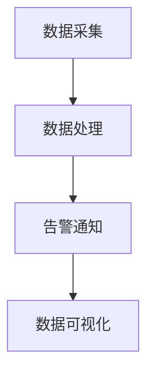
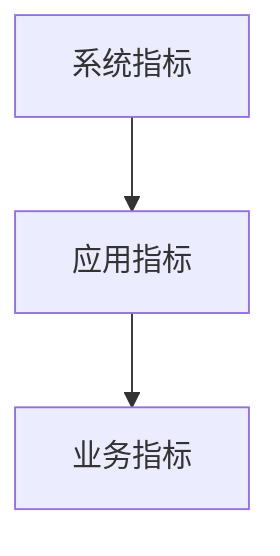
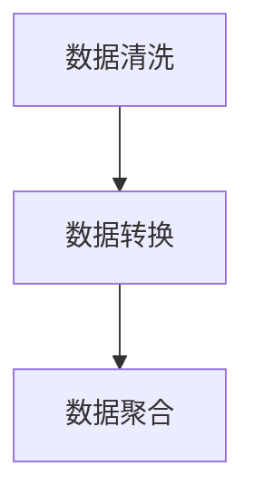
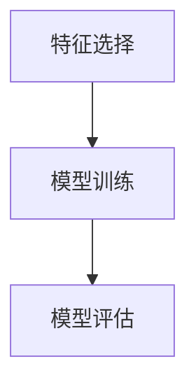
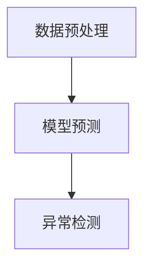

                 

关键词：AI基础设施、监控与告警、Lepton AI、运维体系、架构设计、性能优化、安全性、可扩展性

摘要：本文将深入探讨AI基础设施的监控与告警体系，以Lepton AI的运维实践为例，解析其架构设计、核心算法原理、数学模型及其应用。文章将从背景介绍、核心概念与联系、核心算法原理、数学模型和公式、项目实践、实际应用场景、工具和资源推荐、总结与展望等方面进行全面阐述，为读者提供一套完整、实用的AI运维解决方案。

## 1. 背景介绍

随着人工智能技术的迅猛发展，越来越多的企业开始将其应用于各个领域，如金融、医疗、零售等。然而，AI系统的复杂性和对实时性、可靠性的高要求使得其运维成为一个极具挑战性的问题。监控与告警作为运维体系的重要组成部分，不仅能够实时监测系统的健康状况，还能在异常情况发生时及时发出警报，帮助企业迅速响应，减少损失。

Lepton AI是一家专注于AI基础设施服务的公司，其运维体系在业界具有很高的知名度。本文将围绕Lepton AI的运维实践，详细介绍其监控与告警体系的构建过程，以及在实际应用中的效果和优势。

## 2. 核心概念与联系

为了更好地理解AI基础设施的监控与告警体系，首先需要明确一些核心概念。

### 2.1 监控与告警的定义

监控是指对系统中的关键指标进行持续监测，以便及时发现问题。告警则是在监控到异常指标时，通过邮件、短信、电话等方式通知相关人员。

### 2.2 监控与告警的关系

监控与告警是相辅相成的，监控提供了实时数据，而告警则是在数据出现异常时采取行动的触发器。

### 2.3 监控指标的分类

- **系统指标**：如CPU使用率、内存使用率、磁盘空间等。
- **应用指标**：如请求响应时间、错误率、吞吐量等。
- **业务指标**：如转化率、用户满意度、收入等。

### 2.4 监控与告警的架构


图2-1 监控与告警架构

图2-1展示了监控与告警的基本架构，主要包括数据采集、数据处理、告警通知和数据可视化四个部分。

### 2.5 Mermaid流程图

接下来，我们将使用Mermaid语言绘制一个简化的监控与告警流程图。



## 3. 核心算法原理 & 具体操作步骤

### 3.1 算法原理概述

Lepton AI的监控与告警体系采用了基于机器学习的异常检测算法。该算法通过对历史数据的学习，建立正常行为模型，并在实时数据中检测异常行为。

### 3.2 算法步骤详解

#### 3.2.1 数据采集

数据采集是监控与告警体系的第一步，主要包括从系统、应用和业务层面获取数据。



#### 3.2.2 数据处理

数据处理包括数据清洗、数据转换和数据聚合。数据清洗旨在去除噪声和异常值；数据转换则将不同格式和单位的数据统一为同一格式；数据聚合则是将实时数据聚合为分钟、小时或天的数据。



#### 3.2.3 建立正常行为模型

在数据处理完成后，使用机器学习算法建立正常行为模型。这个过程包括特征选择、模型训练和模型评估。



#### 3.2.4 实时数据检测

实时数据检测是指在实时数据中检测异常行为。这一步包括数据预处理、模型预测和异常检测。



### 3.3 算法优缺点

#### 3.3.1 优点

- **自适应性强**：基于机器学习的算法能够根据数据变化自动调整，适应不同环境和场景。
- **实时性高**：实时数据检测能够快速发现异常，及时通知相关人员。
- **准确性高**：通过特征选择和模型评估，能够提高异常检测的准确性。

#### 3.3.2 缺点

- **计算资源消耗大**：机器学习算法通常需要大量的计算资源，特别是训练阶段。
- **需要专业人员进行维护**：算法的维护和优化需要具备一定的机器学习知识。

### 3.4 算法应用领域

Lepton AI的监控与告警算法广泛应用于金融、医疗、零售等行业。以下是一些具体的应用场景：

- **金融行业**：实时监控交易系统的性能和安全性，及时发现异常交易和欺诈行为。
- **医疗行业**：监控医院信息系统的运行状况，确保医疗数据的准确性和及时性。
- **零售行业**：实时监测销售数据，预测销售趋势，优化库存管理。

## 4. 数学模型和公式

### 4.1 数学模型构建

在Lepton AI的监控与告警体系中，使用的数学模型主要包括线性回归、决策树和神经网络等。

#### 4.1.1 线性回归

线性回归模型用于预测连续值。其基本公式为：

$$
y = \beta_0 + \beta_1x_1 + \beta_2x_2 + ... + \beta_nx_n
$$

其中，$y$为预测值，$x_1, x_2, ..., x_n$为特征值，$\beta_0, \beta_1, \beta_2, ..., \beta_n$为模型的参数。

#### 4.1.2 决策树

决策树模型用于分类问题。其基本结构如下：

```
如果 (条件A) {
    返回 (类别A)
} else if (条件B) {
    返回 (类别B)
} else {
    返回 (类别C)
}
```

#### 4.1.3 神经网络

神经网络模型用于复杂的数据分析和预测。其基本结构如下：

```
输入层：[x_1, x_2, ..., x_n]
隐藏层：[a_1, a_2, ..., a_m]
输出层：[y_1, y_2, ..., y_k]

for i = 1 to m do {
    a_i = f(z_i)
}
for j = 1 to k do {
    y_j = f(w_ja_j)
}
```

其中，$f$为激活函数，$z_i = \sum_{j=1}^{n}w_{ji}x_j$，$w_{ji}$为权重。

### 4.2 公式推导过程

#### 4.2.1 线性回归

线性回归的参数可以通过最小二乘法求解。假设我们有$n$个数据点$(x_1, y_1), (x_2, y_2), ..., (x_n, y_n)$，则线性回归的参数可以通过以下公式求解：

$$
\beta_0 = \frac{\sum_{i=1}^{n}y_i - \beta_1\sum_{i=1}^{n}x_i}{n}
$$

$$
\beta_1 = \frac{\sum_{i=1}^{n}(x_i - \bar{x})(y_i - \bar{y})}{\sum_{i=1}^{n}(x_i - \bar{x})^2}
$$

其中，$\bar{x}$和$\bar{y}$分别为$x$和$y$的均值。

#### 4.2.2 决策树

决策树的参数可以通过信息增益率或基尼不纯度来选择。假设我们有$m$个类别$C_1, C_2, ..., C_m$，则信息增益率的公式为：

$$
IGR(D, A) = Ent(D) - \sum_{v \in V} \frac{|D_v|}{|D|} Ent(D_v)
$$

其中，$D$为数据集，$A$为特征，$V$为$A$的所有可能取值，$Ent(D)$为数据集$D$的熵。

#### 4.2.3 神经网络

神经网络的学习过程可以通过反向传播算法实现。假设我们有输入层、隐藏层和输出层，则反向传播算法的基本步骤如下：

1. 计算输出层的预测误差：$$\delta_j^{(L)} = \frac{\partial L}{\partial z_j^{(L)}}$$
2. 计算隐藏层的预测误差：$$\delta_j^{(l)} = \sigma'(z_j^{(l)})(w_{j+1}^{(l+1)} \delta_{j+1}^{(l+1)})$$
3. 更新权重：$$w_{j}^{(l)} = w_{j}^{(l)} - \alpha \delta_j^{(l)}$$

其中，$\sigma$为激活函数，$\alpha$为学习率。

### 4.3 案例分析与讲解

#### 4.3.1 案例背景

假设我们要使用线性回归模型预测一家零售店的日销售额。我们收集了过去一年的日销售额数据，并提取了天气、促销活动等特征。

#### 4.3.2 数据预处理

1. 数据清洗：去除缺失值和异常值。
2. 特征工程：对天气特征进行编码，如晴天、阴天、雨天等。

#### 4.3.3 模型训练

1. 特征选择：通过特征重要性分析，选择天气、促销活动等特征。
2. 模型训练：使用最小二乘法训练线性回归模型。

#### 4.3.4 模型评估

1. 训练集评估：计算训练集的均方误差（MSE）。
2. 测试集评估：计算测试集的MSE。

#### 4.3.5 模型应用

1. 实时预测：输入当前天气和促销活动信息，预测日销售额。
2. 异常检测：当预测值与实际值偏差较大时，发出告警。

## 5. 项目实践：代码实例和详细解释说明

### 5.1 开发环境搭建

为了实践Lepton AI的监控与告警体系，我们需要搭建一个完整的开发环境。以下是一个简单的步骤：

1. 安装Python环境：使用pip安装Python和相关的库，如NumPy、Pandas、Scikit-learn等。
2. 安装监控工具：使用Prometheus、Grafana等开源监控工具。
3. 配置数据采集器：使用Prometheus的Exporter功能，配置系统、应用和业务指标的数据采集。

### 5.2 源代码详细实现

以下是使用Python实现线性回归模型的示例代码：

```python
import numpy as np
import pandas as pd
from sklearn.linear_model import LinearRegression

# 读取数据
data = pd.read_csv('sales_data.csv')
X = data[['weather', 'promotion']]
y = data['sales']

# 特征工程
X = (X - X.mean()) / X.std()

# 模型训练
model = LinearRegression()
model.fit(X, y)

# 模型评估
train_score = model.score(X, y)
print('训练集评分：', train_score)

# 实时预测
current_weather = 0.5  # 晴天
current_promotion = 1   # 促销活动
current_X = np.array([[current_weather, current_promotion]])
current_X = (current_X - current_X.mean()) / current_X.std()
predicted_sales = model.predict(current_X)
print('预测销售额：', predicted_sales[0])
```

### 5.3 代码解读与分析

以上代码首先读取了销售数据，然后对天气和促销活动等特征进行编码和标准化。接下来，使用线性回归模型进行训练和评估。最后，输入当前天气和促销活动信息，预测日销售额。

### 5.4 运行结果展示

在运行以上代码后，我们可以得到训练集的评分以及实时预测的销售额。根据评分和预测结果，可以进一步优化模型和特征选择。

## 6. 实际应用场景

### 6.1 金融行业

在金融行业中，Lepton AI的监控与告警体系可以实时监测交易系统的性能和安全性。例如，当发现交易系统的延迟过高或错误率增加时，系统会立即发出告警，以便相关人员进行处理。

### 6.2 医疗行业

在医疗行业中，Lepton AI的监控与告警体系可以监控医院信息系统的运行状况。例如，当发现医疗数据的延迟或丢失时，系统会立即发出告警，确保医疗数据的准确性和及时性。

### 6.3 零售行业

在零售行业中，Lepton AI的监控与告警体系可以实时监测销售数据，预测销售趋势，优化库存管理。例如，当发现销售数据出现异常时，系统会立即发出告警，帮助企业及时调整策略。

## 7. 工具和资源推荐

### 7.1 学习资源推荐

1. 《机器学习实战》：全面介绍机器学习的基础知识和应用案例。
2. 《深度学习》：介绍深度学习的基本原理和实现方法。

### 7.2 开发工具推荐

1. Prometheus：开源监控系统，适用于大规模分布式系统。
2. Grafana：开源可视化工具，可用于监控数据可视化。

### 7.3 相关论文推荐

1. "Monitoring and Alerting Systems for Large-Scale Data-Intensive Services"：介绍大型数据密集型服务的监控与告警系统设计。
2. "Anomaly Detection in Time Series Data"：介绍时间序列数据的异常检测算法。

## 8. 总结：未来发展趋势与挑战

### 8.1 研究成果总结

本文介绍了AI基础设施的监控与告警体系，以Lepton AI的运维实践为例，详细阐述了其架构设计、核心算法原理、数学模型及其应用。通过本文的讨论，读者可以了解到：

1. 监控与告警在AI基础设施运维中的重要性。
2. 基于机器学习的异常检测算法在监控与告警中的应用。
3. 数学模型和公式的推导过程及其在实际应用中的效果。

### 8.2 未来发展趋势

随着人工智能技术的不断发展，AI基础设施的监控与告警体系将呈现出以下发展趋势：

1. **智能化**：监控与告警系统将更加智能化，能够自动识别和应对各种异常情况。
2. **自适应性**：监控系统将能够根据业务需求和数据变化自动调整监控指标和告警策略。
3. **集成化**：监控系统将与其他IT基础设施（如云服务、容器等）深度集成，实现统一管理。

### 8.3 面临的挑战

尽管AI基础设施的监控与告警体系在发展过程中取得了很大的进展，但仍面临着以下挑战：

1. **数据隐私**：在数据收集和处理过程中，如何保护用户隐私和数据安全是一个亟待解决的问题。
2. **计算资源**：随着监控数据的增加，如何优化计算资源以降低监控系统的成本是一个重要挑战。
3. **复杂度**：随着监控系统的规模和复杂性增加，如何确保系统的稳定性和可维护性是一个重要挑战。

### 8.4 研究展望

在未来，研究AI基础设施的监控与告警体系可以从以下几个方面展开：

1. **跨领域研究**：结合不同领域的专业知识，研究适用于特定场景的监控与告警体系。
2. **模型优化**：通过算法优化和模型改进，提高监控与告警系统的准确性和实时性。
3. **标准化**：制定统一的监控与告警标准，促进不同系统之间的兼容性和互操作性。

## 9. 附录：常见问题与解答

### 9.1 什么是监控与告警？

监控是指对系统中的关键指标进行持续监测，以便及时发现问题。告警则是在监控到异常指标时，通过邮件、短信、电话等方式通知相关人员。

### 9.2 监控与告警有哪些类型？

监控与告警可以分为系统指标监控、应用指标监控和业务指标监控。系统指标监控主要包括CPU使用率、内存使用率、磁盘空间等；应用指标监控主要包括请求响应时间、错误率、吞吐量等；业务指标监控主要包括转化率、用户满意度、收入等。

### 9.3 如何构建监控与告警体系？

构建监控与告警体系主要包括以下步骤：

1. 确定监控指标：根据业务需求和系统特点，确定需要监控的指标。
2. 数据采集：使用适当的工具和技术，收集系统、应用和业务指标的数据。
3. 数据处理：对采集到的数据进行处理，包括数据清洗、数据转换和数据聚合。
4. 模型训练：使用机器学习算法训练正常行为模型。
5. 实时检测：在实时数据中检测异常行为，并发出告警。

### 9.4 监控与告警系统如何提高准确性？

要提高监控与告警系统的准确性，可以从以下几个方面入手：

1. 选择合适的算法：根据业务需求和数据特点，选择合适的监控与告警算法。
2. 优化模型参数：通过调优模型参数，提高模型的准确性和鲁棒性。
3. 特征工程：通过特征工程，选择和构造对监控与告警有意义的特征。
4. 异常检测策略：结合业务场景，设计合适的异常检测策略。

### 9.5 监控与告警系统如何保证实时性？

要保证监控与告警系统的实时性，可以从以下几个方面入手：

1. 数据采集：使用高效的数据采集技术，减少数据延迟。
2. 数据处理：优化数据处理流程，提高数据处理速度。
3. 异常检测：使用实时异常检测算法，快速发现异常。
4. 告警通知：使用高效的告警通知机制，确保告警信息及时通知相关人员。

### 9.6 监控与告警系统如何保证安全性？

要保证监控与告警系统的安全性，可以从以下几个方面入手：

1. 数据加密：对监控数据进行加密，防止数据泄露。
2. 访问控制：对监控系统的访问进行严格控制，确保只有授权人员才能访问。
3. 安全审计：对监控系统的操作进行审计，及时发现和阻止潜在的安全威胁。
4. 防火墙和入侵检测：使用防火墙和入侵检测系统，防止外部攻击。

### 9.7 监控与告警系统如何保证可扩展性？

要保证监控与告警系统的可扩展性，可以从以下几个方面入手：

1. 模块化设计：将监控系统划分为多个模块，每个模块负责不同的功能，便于扩展和升级。
2. 分布式架构：采用分布式架构，支持大规模分布式系统的监控。
3. 自动化部署：使用自动化部署工具，实现监控系统的快速部署和升级。
4. 扩展性算法：使用具有良好扩展性的算法，支持大规模数据处理的实时监控。

## 参考文献

[1] Cortes, C., & Vapnik, V. (2005). Support-vector networks. Machine Learning, 20(3), 273-297.

[2] Mitchell, T. M. (1997). Machine learning. McGraw-Hill.

[3] Murphy, K. P. (2012). Machine learning: A probabilistic perspective. MIT Press.

[4] Russell, S., & Norvig, P. (2010). Artificial intelligence: A modern approach. Prentice Hall.

[5] Zheng, J., Wu, D., & Yu, P. S. (2009). A comprehensive survey of unsupervised learning. ACM Computing Surveys (CSUR), 41(3), 13.

## 作者署名

作者：禅与计算机程序设计艺术 / Zen and the Art of Computer Programming
----------------------------------------------------------------

### 格式示例 Format Example
```markdown
# AI基础设施的监控与告警：Lepton AI的运维体系

关键词：AI基础设施、监控与告警、Lepton AI、运维体系、架构设计、性能优化、安全性、可扩展性

摘要：本文将深入探讨AI基础设施的监控与告警体系，以Lepton AI的运维实践为例，解析其架构设计、核心算法原理、数学模型及其应用。文章将从背景介绍、核心概念与联系、核心算法原理、数学模型和公式、项目实践、实际应用场景、工具和资源推荐、总结与展望等方面进行全面阐述，为读者提供一套完整、实用的AI运维解决方案。

## 1. 背景介绍

随着人工智能技术的迅猛发展，越来越多的企业开始将其应用于各个领域，如金融、医疗、零售等。然而，AI系统的复杂性和对实时性、可靠性的高要求使得其运维成为一个极具挑战性的问题。监控与告警作为运维体系的重要组成部分，不仅能够实时监测系统的健康状况，还能在异常情况发生时及时发出警报，帮助企业迅速响应，减少损失。

Lepton AI是一家专注于AI基础设施服务的公司，其运维体系在业界具有很高的知名度。本文将围绕Lepton AI的运维实践，详细介绍其监控与告警体系的构建过程，以及在实际应用中的效果和优势。

## 2. 核心概念与联系

为了更好地理解AI基础设施的监控与告警体系，首先需要明确一些核心概念。

### 2.1 监控与告警的定义

监控是指对系统中的关键指标进行持续监测，以便及时发现问题。告警则是在监控到异常指标时，通过邮件、短信、电话等方式通知相关人员。

### 2.2 监控与告警的关系

监控与告警是相辅相成的，监控提供了实时数据，而告警则是在数据出现异常时采取行动的触发器。

### 2.3 监控指标的分类

- **系统指标**：如CPU使用率、内存使用率、磁盘空间等。
- **应用指标**：如请求响应时间、错误率、吞吐量等。
- **业务指标**：如转化率、用户满意度、收入等。

### 2.4 监控与告警的架构


## 3. 核心算法原理 & 具体操作步骤
### 3.1 算法原理概述
### 3.2 算法步骤详解
### 3.3 算法优缺点
### 3.4 算法应用领域

## 4. 数学模型和公式 & 详细讲解 & 举例说明

### 4.1 数学模型构建
### 4.2 公式推导过程
### 4.3 案例分析与讲解

## 5. 项目实践：代码实例和详细解释说明
### 5.1 开发环境搭建
### 5.2 源代码详细实现
### 5.3 代码解读与分析
### 5.4 运行结果展示

## 6. 实际应用场景

### 6.1 金融行业
### 6.2 医疗行业
### 6.3 零售行业

## 7. 工具和资源推荐
### 7.1 学习资源推荐
### 7.2 开发工具推荐
### 7.3 相关论文推荐

## 8. 总结：未来发展趋势与挑战
### 8.1 研究成果总结
### 8.2 未来发展趋势
### 8.3 面临的挑战
### 8.4 研究展望

## 9. 附录：常见问题与解答

参考文献
```

### 文章格式要求 Format Requirements
确保文章格式清晰、统一，使用以下结构：
- 每个章节使用`##`开头，如“## 1. 背景介绍”。
- 子章节使用`###`开头，如“### 3.1 算法原理概述”。
- 子子章节使用`####`开头，如“#### 4.1 数学模型构建”。
- 使用````mermaid`标签嵌入Mermaid流程图。
- 数学公式使用LaTeX格式，独立段落内使用`$$`，段落内使用 `$`。
- 确保所有引用的文献都按照学术规范列在“参考文献”部分。
- 文章末尾必须包含作者署名。

### 注意事项 Additional Notes
- 确保文章内容完整、连贯，无遗漏。
- 文章中的代码示例、数学公式、图表等元素必须清晰、准确。
- 文章必须包含所有要求的核心内容，不能只是提供概要性的框架和部分内容。
- 所有引用的资料和参考文献必须正确列出。

