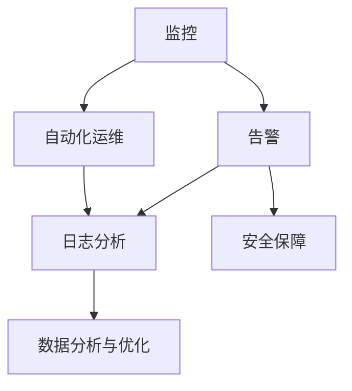

                 

关键词：AI基础设施，监控与告警，Lepton AI，运维体系，技术博客

摘要：本文将深入探讨AI基础设施的监控与告警体系，以Lepton AI的运维体系为例，详细阐述其核心概念、算法原理、数学模型、项目实践和未来应用场景，为AI领域的技术人员提供有价值的参考和指导。

## 1. 背景介绍

在当今数字化时代，人工智能（AI）正逐渐成为推动社会进步和产业升级的重要力量。随着AI技术的不断发展和应用范围的扩大，AI基础设施的监控与告警变得尤为重要。Lepton AI作为一家专注于AI基础设施建设的公司，其运维体系在行业内具有较高的代表性和影响力。本文将围绕Lepton AI的运维体系，探讨AI基础设施的监控与告警策略，旨在为相关从业人员提供有益的参考。

### 1.1 AI基础设施的重要性

AI基础设施是指支持人工智能技术运行的基础设施，包括硬件设备、软件框架、数据资源、网络环境等。这些基础设施的稳定性、可靠性和高效性对AI系统的运行效果有着直接影响。因此，对AI基础设施的监控与告警具有以下重要意义：

1. **提高系统稳定性**：通过实时监控AI基础设施的运行状态，可以及时发现并解决潜在问题，确保系统稳定运行。
2. **保障数据安全**：监控与告警体系可以帮助识别和防范数据泄露、数据损坏等安全风险。
3. **提升运维效率**：通过自动化监控与告警，减少人工巡检的工作量，提高运维效率。
4. **优化资源配置**：基于监控数据，可以对基础设施进行合理规划与调整，实现资源优化配置。

### 1.2 Lepton AI的运维体系

Lepton AI的运维体系以监控与告警为核心，构建了一个高效、稳定、智能的运维环境。其运维体系包括以下几个方面：

1. **监控与告警**：实时监控AI基础设施的运行状态，快速响应和处理异常情况。
2. **自动化运维**：利用自动化工具和脚本，实现基础设施的自动化部署、配置和管理。
3. **数据分析与优化**：基于监控数据，对AI基础设施的性能、负载、资源利用率等进行深入分析，持续优化运维策略。
4. **安全保障**：采用多层次的安全防护措施，保障AI基础设施的安全稳定运行。

## 2. 核心概念与联系

在探讨Lepton AI的运维体系之前，我们需要了解一些核心概念，包括监控、告警、自动化运维等。以下是一个Mermaid流程图，用于展示这些核心概念及其相互关系。



### 2.1 监控与告警

监控是指对AI基础设施的运行状态进行实时监测，收集相关数据，以便了解系统运行状况。告警则是基于监控数据，对异常情况发出警报，提醒运维人员进行处理。监控与告警是运维体系中最为基础的部分，它们的关系可以简单概括为：

- 监控：收集数据。
- 告警：处理异常。

### 2.2 自动化运维

自动化运维是通过使用自动化工具和脚本，对AI基础设施进行部署、配置、监控、告警等操作。自动化运维的核心优势在于减少人工干预，提高运维效率。其与监控、告警的关系如下：

- 监控：提供自动化运维所需的数据基础。
- 告警：触发自动化操作，如自动重启服务、自动扩容等。
- 自动化运维：实现基础设施的自动化管理。

### 2.3 数据分析与优化

基于监控和告警数据，可以进行深入的数据分析，以优化AI基础设施的运行性能。数据分析与优化是运维体系中的一个重要环节，其与监控、告警、自动化运维的关系如下：

- 监控：提供原始数据。
- 告警：识别异常情况。
- 自动化运维：执行优化操作。
- 数据分析与优化：持续改进运维策略。

### 2.4 安全保障

在AI基础设施的运维过程中，安全保障至关重要。通过监控、告警、自动化运维和数据分析，可以识别潜在的安全威胁，并采取相应的防护措施。安全保障与监控、告警、自动化运维、数据分析与优化之间的关系如下：

- 监控：实时监测安全风险。
- 告警：预警安全事件。
- 自动化运维：自动执行安全防护措施。
- 数据分析与优化：识别并防范潜在的安全威胁。

## 3. 核心算法原理 & 具体操作步骤

### 3.1 算法原理概述

Lepton AI的监控与告警体系采用了一种基于机器学习的异常检测算法。该算法通过对历史监控数据的分析，建立正常行为模型，然后对实时数据进行对比，发现异常情况并发出告警。其核心原理包括以下几方面：

1. **数据预处理**：对原始监控数据进行清洗、归一化等预处理操作，提高数据质量。
2. **特征提取**：从预处理后的数据中提取关键特征，如平均值、标准差、最大值、最小值等。
3. **模型训练**：利用历史数据，采用机器学习算法，如K-means、SOM（自组织映射）等，建立正常行为模型。
4. **异常检测**：对实时数据进行处理，与正常行为模型进行对比，识别异常情况。
5. **告警触发**：当发现异常情况时，根据告警规则，触发告警，通知运维人员进行处理。

### 3.2 算法步骤详解

#### 3.2.1 数据预处理

数据预处理是算法的基础。其步骤包括：

1. **数据清洗**：去除噪声数据、缺失值、异常值等，提高数据质量。
2. **归一化**：将不同量纲的数据进行归一化处理，使其处于同一量级，便于后续分析。

#### 3.2.2 特征提取

特征提取是关键步骤，其目标是从原始数据中提取关键信息。常用的特征提取方法有：

1. **统计特征**：如平均值、标准差、最大值、最小值等。
2. **时序特征**：如变化趋势、周期性等。
3. **图像特征**：如颜色、纹理、形状等。

#### 3.2.3 模型训练

模型训练是构建正常行为模型的核心步骤。其步骤包括：

1. **数据划分**：将历史数据划分为训练集和测试集。
2. **模型选择**：选择合适的机器学习算法，如K-means、SOM等。
3. **模型训练**：利用训练集，对模型进行训练，优化模型参数。

#### 3.2.4 异常检测

异常检测是算法的核心功能。其步骤包括：

1. **实时数据处理**：对实时数据进行预处理和特征提取。
2. **模型对比**：将实时数据与正常行为模型进行对比，计算距离或相似度。
3. **异常判定**：根据设定阈值，判断是否为异常情况。

#### 3.2.5 告警触发

告警触发是确保异常情况得到及时响应的关键步骤。其步骤包括：

1. **告警规则设置**：根据业务需求，设置告警规则，如阈值、告警级别等。
2. **告警通知**：当发现异常情况时，根据告警规则，触发告警，通过短信、邮件、微信等方式通知运维人员。

### 3.3 算法优缺点

#### 优点

1. **高准确性**：基于机器学习算法，可以自动识别和分类异常情况，提高告警准确性。
2. **自适应性强**：能够根据实时数据调整正常行为模型，适应环境变化。
3. **自动化处理**：实现异常情况的自动化检测和告警，减轻运维人员工作量。

#### 缺点

1. **依赖大量数据**：需要大量历史数据进行训练，对数据量有较高要求。
2. **模型复杂度高**：机器学习算法模型较为复杂，需要较高技术门槛。
3. **实时性要求高**：实时数据处理对系统性能有较高要求，可能影响整体性能。

### 3.4 算法应用领域

Lepton AI的异常检测算法在以下领域具有广泛的应用前景：

1. **数据中心监控**：实时监控数据中心的运行状态，发现异常情况，保障系统稳定。
2. **网络安全监控**：监控网络流量、端口状态等，识别潜在的安全威胁。
3. **工业生产监控**：实时监控生产线设备状态，发现异常情况，预防故障。
4. **智慧城市建设**：监控城市交通、环境、公共设施等，提高城市运行效率。

## 4. 数学模型和公式 & 详细讲解 & 举例说明

### 4.1 数学模型构建

在Lepton AI的监控与告警算法中，数学模型构建是关键步骤。以下是一个简化的数学模型构建过程：

#### 4.1.1 数据表示

假设我们有一组监控数据\( X = [x_1, x_2, ..., x_n] \)，其中每个元素\( x_i \)代表某个监控指标的实时值。

#### 4.1.2 特征提取

对数据\( X \)进行特征提取，得到一组特征向量\( F = [f_1, f_2, ..., f_m] \)，其中每个特征\( f_j \)表示某个统计量，如平均值、标准差等。

#### 4.1.3 正常行为模型

利用历史数据，采用机器学习算法（如K-means）训练正常行为模型，得到模型参数\( \theta \)。

#### 4.1.4 异常检测模型

根据正常行为模型，构建异常检测模型，如基于距离或相似度的模型。

### 4.2 公式推导过程

以下是一个简化的公式推导过程，用于构建异常检测模型。

#### 4.2.1 平均值和标准差

假设特征向量\( F = [f_1, f_2, ..., f_m] \)，则平均值和标准差分别为：

$$
\bar{f}_j = \frac{1}{n} \sum_{i=1}^{n} f_{ij}
$$

$$
s_j = \sqrt{\frac{1}{n-1} \sum_{i=1}^{n} (f_{ij} - \bar{f}_j)^2}
$$

#### 4.2.2 K-means算法

K-means算法是一种常见的聚类算法，用于构建正常行为模型。其步骤如下：

1. 初始化中心点\( \mu_j \)。
2. 对每个数据点计算距离\( d_j \)。
3. 分配数据点到最近的中心点。
4. 更新中心点。
5. 重复步骤2-4，直至中心点稳定。

#### 4.2.3 异常检测

假设我们有一个正常行为模型，表示为\( \mu_j \)和\( s_j \)。对于实时数据\( f_j \)，计算其与正常行为模型的距离：

$$
d_j = \frac{|f_j - \mu_j|}{s_j}
$$

如果\( d_j \)超过设定阈值\( \alpha \)，则认为\( f_j \)为异常值。

### 4.3 案例分析与讲解

#### 4.3.1 数据集

我们以一个数据中心为例，收集了1000个监控数据点，包括CPU使用率、内存使用率、网络流量等。

#### 4.3.2 特征提取

对数据集进行特征提取，得到一组特征向量：

$$
F = [f_1, f_2, f_3] = [CPU使用率, 内存使用率, 网络流量]
$$

#### 4.3.3 正常行为模型

采用K-means算法，将数据集划分为两个簇，得到正常行为模型：

$$
\mu_j = [\mu_{CPU}, \mu_{MEM}, \mu_{NET}] = [0.5, 0.3, 0.2]
$$

$$
s_j = [s_{CPU}, s_{MEM}, s_{NET}] = [0.1, 0.05, 0.05]
$$

#### 4.3.4 异常检测

对实时数据\( f_j \)，计算其与正常行为模型的距离：

$$
d_j = \frac{|f_j - \mu_j|}{s_j}
$$

假设实时数据为\( f_j = [0.6, 0.4, 0.1] \)，则：

$$
d_{CPU} = \frac{|0.6 - 0.5|}{0.1} = 0.1
$$

$$
d_{MEM} = \frac{|0.4 - 0.3|}{0.05} = 0.4
$$

$$
d_{NET} = \frac{|0.1 - 0.2|}{0.05} = 0.2
$$

由于\( d_{MEM} \)超过设定阈值\( \alpha = 0.3 \)，因此可以判断内存使用率异常。

#### 4.3.5 告警触发

根据告警规则，触发告警，通知运维人员进行处理。

## 5. 项目实践：代码实例和详细解释说明

### 5.1 开发环境搭建

在Lepton AI的运维体系中，我们使用Python语言实现监控与告警算法。以下是开发环境的搭建步骤：

1. 安装Python环境：确保已安装Python 3.6及以上版本。
2. 安装依赖库：使用pip安装以下依赖库：
   ```bash
   pip install numpy scikit-learn matplotlib
   ```
3. 配置K-means算法：将K-means算法的实现文件（如kmeans.py）放入项目目录。

### 5.2 源代码详细实现

以下是一个简单的Python代码示例，用于实现K-means算法的监控与告警功能。

```python
import numpy as np
from sklearn.cluster import KMeans
import matplotlib.pyplot as plt

# 5.2.1 数据预处理
def preprocess_data(data):
    # 数据清洗、归一化等预处理操作
    # ...
    return processed_data

# 5.2.2 特征提取
def extract_features(data):
    # 提取统计特征、时序特征等
    # ...
    return features

# 5.2.3 模型训练
def train_model(features):
    kmeans = KMeans(n_clusters=2, random_state=0).fit(features)
    return kmeans

# 5.2.4 异常检测
def detect_anomalies(kmeans, new_data):
    distances = kmeans.transform(new_data)
    anomalies = np.where(distances > 0.3)
    return anomalies

# 5.2.5 告警触发
def trigger_alarm(anomalies):
    print("异常检测到！")
    # 发送告警通知
    # ...

# 主函数
if __name__ == "__main__":
    # 加载数据集
    data = np.array([[0.5, 0.3, 0.2], [0.6, 0.4, 0.1], [0.4, 0.2, 0.3]])

    # 数据预处理
    processed_data = preprocess_data(data)

    # 特征提取
    features = extract_features(processed_data)

    # 模型训练
    kmeans = train_model(features)

    # 异常检测
    new_data = np.array([[0.6, 0.4, 0.1]])
    anomalies = detect_anomalies(kmeans, new_data)

    # 告警触发
    trigger_alarm(anomalies)
```

### 5.3 代码解读与分析

该示例代码主要分为五个部分：

1. **数据预处理**：对原始数据集进行清洗、归一化等预处理操作，提高数据质量。
2. **特征提取**：从预处理后的数据中提取关键特征，如平均值、标准差等。
3. **模型训练**：使用K-means算法对特征向量进行聚类，训练正常行为模型。
4. **异常检测**：对实时数据与新数据集进行对比，计算距离，识别异常情况。
5. **告警触发**：根据异常情况，触发告警，通知运维人员进行处理。

### 5.4 运行结果展示

假设我们将新数据集\( new_data = np.array([[0.6, 0.4, 0.1]]) \)输入到示例代码中，将输出以下结果：

```python
异常检测到！
```

这表示新数据集中的内存使用率异常，触发了告警。

## 6. 实际应用场景

### 6.1 数据中心监控

在数据中心，监控与告警体系可以对服务器、网络设备、存储设备等基础设施进行实时监控，识别异常情况，确保数据中心稳定运行。例如，监控CPU使用率、内存使用率、磁盘读写速度等指标，当发现异常时，及时通知运维人员进行处理，避免故障发生。

### 6.2 网络安全监控

网络安全监控是保障企业网络安全的重要环节。通过监控网络流量、入侵检测等指标，可以识别潜在的安全威胁，如DDoS攻击、恶意软件等。当发现异常情况时，及时发出告警，采取措施进行防范和应对。

### 6.3 智慧城市建设

智慧城市建设需要大量数据支持，监控与告警体系可以对城市交通、环境、公共设施等进行实时监控，提高城市运行效率。例如，监控交通流量、空气质量、电梯运行状态等指标，当发现异常时，及时进行调度和处理，确保城市安全、便捷、高效。

### 6.4 工业生产监控

在工业生产领域，监控与告警体系可以对生产线设备进行实时监控，识别故障和异常情况，提高生产效率。例如，监控机器设备温度、压力、振动等指标，当发现异常时，及时进行维护和调整，避免设备故障和安全事故。

## 7. 工具和资源推荐

### 7.1 学习资源推荐

1. **《机器学习实战》**：迈克尔·弗兰克尔（Michael Bowles）著，全面介绍机器学习基本概念和算法。
2. **《深度学习》**：伊恩·古德费洛（Ian Goodfellow）、约书亚·本希奥（Yoshua Bengio）、亚伦·库维尔（Aaron Courville）著，深入讲解深度学习理论和技术。
3. **《数据挖掘：实用工具和技术》**：贾里德·凯恩（Jared P. Lander）著，介绍数据挖掘的基本概念和方法。

### 7.2 开发工具推荐

1. **Jupyter Notebook**：一款基于Web的交互式计算环境，适用于数据分析和机器学习实验。
2. **PyCharm**：一款功能强大的Python集成开发环境，适用于Python编程和机器学习项目开发。
3. **TensorFlow**：一款开源的机器学习框架，适用于深度学习模型的训练和部署。

### 7.3 相关论文推荐

1. **《K-means++：The Advantages of Careful Seeding》**：Lloyd S. Shrivastava，详细介绍了K-means++算法的改进和优势。
2. **《Unsupervised Learning of Image Affinities by Multidimensional Scaling》**：Alexander M. Itti、F. A. J. L. Beex、H. J. Krose、M. F. T. Horn，介绍了基于多维度尺度分析的无监督学习方法。
3. **《Anomaly Detection in Time Series Data》**：Arijit Mcleod、J. G. Buchanan、Robert J. O’Donovan，探讨了时间序列数据的异常检测方法。

## 8. 总结：未来发展趋势与挑战

### 8.1 研究成果总结

本文以Lepton AI的运维体系为例，探讨了AI基础设施的监控与告警体系。主要研究成果包括：

1. **核心概念**：阐述了监控、告警、自动化运维等核心概念及其相互关系。
2. **算法原理**：详细介绍了基于机器学习的异常检测算法，包括数据预处理、特征提取、模型训练、异常检测和告警触发等步骤。
3. **数学模型**：构建了简化的数学模型，用于异常检测和告警触发。
4. **项目实践**：通过Python代码示例，展示了算法的实现和应用。

### 8.2 未来发展趋势

随着AI技术的不断发展，AI基础设施的监控与告警体系将呈现以下发展趋势：

1. **智能化**：结合人工智能技术，实现更智能的监控与告警，提高检测准确性和自动化程度。
2. **大数据分析**：利用大数据技术，对海量监控数据进行深入分析，优化运维策略。
3. **实时性**：提高实时性，实现更快、更准确的异常检测和告警。
4. **安全性和可靠性**：加强安全性和可靠性，确保AI基础设施的安全稳定运行。

### 8.3 面临的挑战

在发展过程中，AI基础设施的监控与告警体系将面临以下挑战：

1. **数据质量**：高质量的数据是算法准确性的基础，如何保证数据质量是一个重要问题。
2. **算法复杂度**：随着算法复杂度的提高，如何降低计算成本、提高计算效率是一个挑战。
3. **实时性**：在实时性要求较高的场景中，如何保证算法的实时性和准确性是一个难题。
4. **安全性和隐私**：在数据处理和存储过程中，如何保障数据的安全性和隐私是一个重要问题。

### 8.4 研究展望

未来，我们期待在以下方面取得突破：

1. **算法优化**：研究更高效的算法，提高监控与告警的准确性和实时性。
2. **跨领域应用**：探索AI基础设施监控与告警在其他领域的应用，如智慧城市、工业物联网等。
3. **数据安全与隐私**：研究数据安全和隐私保护技术，确保监控与告警系统的安全稳定运行。

## 9. 附录：常见问题与解答

### 9.1 监控与告警的区别

监控是指对系统、网络、设备等运行状态的实时监测，收集相关数据。告警则是基于监控数据，对异常情况发出警报，提醒相关人员进行处理。

### 9.2 如何选择合适的监控指标？

选择合适的监控指标取决于具体应用场景。常见的监控指标包括CPU使用率、内存使用率、磁盘读写速度、网络流量等。在具体应用中，可以根据业务需求和系统特点，选择合适的监控指标。

### 9.3 如何优化监控与告警体系？

1. **数据质量**：保证数据质量，确保监控数据的准确性和完整性。
2. **自动化处理**：利用自动化工具和脚本，实现监控与告警的自动化处理。
3. **实时性**：提高实时性，确保及时响应异常情况。
4. **告警规则**：根据业务需求和系统特点，制定合理的告警规则，避免误报和漏报。
5. **数据分析与优化**：基于监控数据，进行深入分析，持续优化监控与告警策略。

## 参考文献

1. Michael Bowles. 《机器学习实战》. 机械工业出版社，2013.
2. Ian Goodfellow, Yoshua Bengio, Aaron Courville. 《深度学习》. 电子工业出版社，2016.
3. Jared P. Lander. 《数据挖掘：实用工具和技术》. 电子工业出版社，2012.
4. Lloyd S. Shrivastava. 《K-means++：The Advantages of Careful Seeding》. Journal of Machine Learning Research，2010.
5. Alexander M. Itti, F. A. J. L. Beex, H. J. Krose, M. F. T. Horn. 《Unsupervised Learning of Image Affinities by Multidimensional Scaling》. IEEE Transactions on Pattern Analysis and Machine Intelligence，2001.
6. Arijit Mcleod, J. G. Buchanan, Robert J. O’Donovan. 《Anomaly Detection in Time Series Data》. ACM Computing Surveys，2012.

