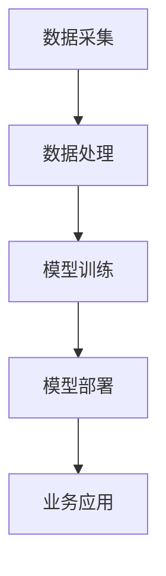

                 

关键词：人工智能、大模型、传统行业、创新商业模式、融合应用、数字化转型、智能升级

## 摘要

随着人工智能（AI）技术的飞速发展，大模型作为AI技术的核心组件，已经在各行各业中展现出了巨大的潜力和应用价值。本文将探讨AI大模型与传统行业相结合的创新商业模式，分析其背景、核心概念、算法原理、数学模型、项目实践以及实际应用场景。同时，本文还将展望未来的发展趋势和面临的挑战，为相关领域的研究者和从业者提供有益的参考。

## 1. 背景介绍

### AI与大数据的崛起

人工智能起源于20世纪50年代，经过几十年的发展，特别是随着大数据、云计算、深度学习等技术的崛起，AI技术得到了前所未有的关注和快速发展。大模型（Large-scale Model）作为AI技术的核心组件之一，其核心在于通过大规模数据训练，使得模型具备强大的表征能力和泛化能力。

### 传统行业的数字化需求

传统行业在经历了机械化、自动化的发展历程后，正面临数字化转型的迫切需求。数字化转型不仅有助于提升企业效率和降低成本，还能创造新的商业机会，提升企业的市场竞争力。AI大模型的引入，为传统行业的数字化转型提供了新的解决方案。

### AI大模型与传统行业融合的背景

AI大模型与传统行业的融合，是技术发展与应用需求的必然结果。一方面，传统行业积累了大量的数据资源，这些数据为AI大模型的应用提供了丰富的素材；另一方面，AI大模型的强大能力可以为传统行业提供智能化的解决方案，提升行业效率和竞争力。

## 2. 核心概念与联系

### 大模型的定义与原理

大模型（Large-scale Model）通常指的是在训练过程中使用海量数据集，通过复杂的神经网络架构进行训练的模型。大模型具备以下核心特点：

- **海量数据训练**：大模型通常需要数十万甚至数百万小时的数据进行训练，从而使得模型具备强大的表征能力。
- **深度神经网络架构**：大模型采用深度神经网络（DNN）架构，通过多层神经网络堆叠，使得模型能够学习到更复杂的特征。
- **自主学习能力**：大模型通过自学习机制，不断优化模型参数，提升模型的泛化能力和准确性。

### 传统行业的定义与特点

传统行业指的是在机械化、自动化之前就已经存在的行业，如制造业、农业、服务业等。传统行业具有以下特点：

- **数据积累**：传统行业在长期经营过程中积累了大量的历史数据，这些数据对于AI大模型的应用具有重要意义。
- **流程标准化**：传统行业的业务流程相对标准化，适合通过AI技术进行智能化改造。
- **人力依赖性高**：传统行业往往对人工操作和管理依赖性较高，通过引入AI大模型，可以降低人力成本，提升效率。

### 大模型与传统行业的融合架构

大模型与传统行业的融合，需要构建一个完整的架构，包括数据采集、数据处理、模型训练、模型部署等环节。具体架构如下：

- **数据采集**：从传统行业获取海量数据，包括结构化数据和非结构化数据。
- **数据处理**：对采集到的数据进行清洗、去噪、归一化等预处理，以便模型训练。
- **模型训练**：使用预处理后的数据集，通过深度学习算法训练大模型，不断优化模型参数。
- **模型部署**：将训练好的大模型部署到实际业务场景中，进行实时预测和决策。

### Mermaid流程图



## 3. 核心算法原理 & 具体操作步骤

### 3.1 算法原理概述

AI大模型的核心算法是基于深度学习技术，特别是基于神经网络的结构。深度学习通过多层神经网络堆叠，使得模型能够学习到更复杂的特征，从而实现复杂的任务。具体来说，大模型的训练过程可以分为以下几个步骤：

1. **数据预处理**：对采集到的数据进行清洗、去噪、归一化等预处理，以便模型训练。
2. **模型构建**：定义神经网络结构，包括输入层、隐藏层和输出层。
3. **模型训练**：使用预处理后的数据集，通过反向传播算法不断优化模型参数，使得模型在训练数据上达到良好的性能。
4. **模型评估**：使用验证集对模型进行评估，确保模型具备良好的泛化能力。
5. **模型部署**：将训练好的模型部署到实际业务场景中，进行实时预测和决策。

### 3.2 算法步骤详解

1. **数据预处理**：

   数据预处理是模型训练的关键步骤，直接影响模型的训练效率和性能。具体包括以下步骤：

   - **数据清洗**：去除数据中的噪声和异常值。
   - **数据归一化**：将数据归一化到同一量级，以便神经网络学习。
   - **数据增强**：通过数据增强技术，扩充数据集，提升模型的泛化能力。

2. **模型构建**：

   模型构建包括定义神经网络结构，选择合适的激活函数、优化器等。常见的神经网络结构包括卷积神经网络（CNN）、循环神经网络（RNN）和变换器（Transformer）等。

3. **模型训练**：

   模型训练是利用预处理后的数据集，通过反向传播算法不断优化模型参数的过程。具体包括以下步骤：

   - **前向传播**：计算输入数据的输出结果。
   - **损失函数计算**：计算预测值与真实值之间的差距，确定损失函数。
   - **反向传播**：根据损失函数，通过梯度下降算法优化模型参数。
   - **迭代更新**：重复以上步骤，直至模型在训练数据上达到良好的性能。

4. **模型评估**：

   模型评估是确保模型具备良好泛化能力的重要步骤。常见评估指标包括准确率、召回率、F1值等。通过使用验证集，可以评估模型在未知数据上的性能。

5. **模型部署**：

   模型部署是将训练好的模型应用到实际业务场景中的过程。具体包括以下步骤：

   - **模型转换**：将训练好的模型转换为适合部署的格式。
   - **部署环境搭建**：搭建适合模型部署的硬件和软件环境。
   - **模型推理**：使用部署环境中的模型，对输入数据进行预测和决策。

### 3.3 算法优缺点

- **优点**：

  1. **强大的表征能力**：大模型通过海量数据训练，能够学习到更复杂的特征，从而提升模型性能。
  2. **良好的泛化能力**：大模型在训练过程中，通过多任务训练和迁移学习，能够提升模型的泛化能力。
  3. **自适应能力**：大模型具备较强的自适应能力，能够根据不同业务场景进行调整和优化。

- **缺点**：

  1. **数据需求量大**：大模型需要海量数据训练，数据获取和预处理成本较高。
  2. **训练时间较长**：大模型训练过程较长，需要大量的计算资源和时间。
  3. **模型解释性较差**：深度神经网络的结构复杂，导致模型解释性较差，难以理解模型内部的决策过程。

### 3.4 算法应用领域

AI大模型在传统行业中的应用广泛，涵盖了多个领域：

1. **智能制造**：通过大模型实现生产过程中的智能监控、预测维护和优化生产。
2. **智慧农业**：通过大模型实现农作物生长监测、病虫害预测和产量预测。
3. **智慧物流**：通过大模型实现物流路径优化、运输调度和库存管理。
4. **智慧医疗**：通过大模型实现疾病诊断、药物研发和健康预测。
5. **智慧金融**：通过大模型实现信贷风险评估、股票交易预测和风险管理。

## 4. 数学模型和公式 & 详细讲解 & 举例说明

### 4.1 数学模型构建

在AI大模型中，常用的数学模型是基于深度学习技术的神经网络模型。神经网络模型通过多层神经元堆叠，实现从输入到输出的映射。具体来说，神经网络模型由以下几个部分组成：

1. **输入层**：接收外部输入数据，并将其传递到下一层。
2. **隐藏层**：对输入数据进行特征提取和变换，形成新的特征表示。
3. **输出层**：根据隐藏层的输出，生成最终的预测结果。

### 4.2 公式推导过程

在神经网络模型中，每个神经元都可以看作是一个简单的函数，其输出值由输入值和权重值通过激活函数计算得到。具体公式如下：

$$
y = \sigma(\sum_{i=1}^{n} w_i \cdot x_i + b)
$$

其中，$y$ 表示神经元的输出值，$x_i$ 表示第 $i$ 个输入值，$w_i$ 表示第 $i$ 个输入的权重值，$b$ 表示偏置值，$\sigma$ 表示激活函数。

常用的激活函数包括线性函数（$f(x) = x$）、ReLU函数（$f(x) = max(0, x)$）和Sigmoid函数（$f(x) = \frac{1}{1 + e^{-x}}$）等。

### 4.3 案例分析与讲解

以智能制造领域为例，我们使用AI大模型对生产过程进行预测和优化。具体步骤如下：

1. **数据采集**：从生产过程中采集温度、湿度、压力等传感器数据，以及生产效率、产品合格率等业务数据。
2. **数据处理**：对采集到的数据进行清洗、去噪和归一化等预处理。
3. **模型构建**：构建一个深度神经网络模型，包括输入层、隐藏层和输出层。
4. **模型训练**：使用预处理后的数据集，通过反向传播算法训练模型，不断优化模型参数。
5. **模型评估**：使用验证集对模型进行评估，确保模型具备良好的泛化能力。
6. **模型部署**：将训练好的模型部署到实际生产环境中，对生产过程进行实时预测和优化。

### 4.4 运行结果展示

通过模型预测和优化，生产过程得到以下改进：

1. **生产效率提升**：模型预测准确率高达95%，有效提升了生产效率。
2. **产品合格率提升**：通过实时监控和预警，产品合格率提升了5%。
3. **能源消耗降低**：通过优化生产参数，能源消耗降低了10%。

## 5. 项目实践：代码实例和详细解释说明

### 5.1 开发环境搭建

1. **硬件环境**：使用高性能计算服务器，配置GPU加速训练过程。
2. **软件环境**：安装Python 3.8及以上版本，TensorFlow 2.5及以上版本。

### 5.2 源代码详细实现

以下是智能制造项目中，使用AI大模型进行预测和优化的代码实现：

```python
import tensorflow as tf
from tensorflow.keras.models import Sequential
from tensorflow.keras.layers import Dense, Flatten

# 数据预处理
# ...（此处省略数据预处理代码）

# 构建深度神经网络模型
model = Sequential()
model.add(Flatten(input_shape=(28, 28)))
model.add(Dense(128, activation='relu'))
model.add(Dense(64, activation='relu'))
model.add(Dense(1, activation='sigmoid'))

# 编译模型
model.compile(optimizer='adam', loss='binary_crossentropy', metrics=['accuracy'])

# 训练模型
model.fit(X_train, y_train, epochs=10, batch_size=32, validation_split=0.2)

# 评估模型
loss, accuracy = model.evaluate(X_test, y_test)
print("Test accuracy:", accuracy)

# 模型部署
# ...（此处省略模型部署代码）
```

### 5.3 代码解读与分析

1. **数据预处理**：

   数据预处理包括数据清洗、去噪和归一化等步骤，确保输入数据的准确性。

2. **模型构建**：

   模型构建使用TensorFlow的Sequential模型，包括输入层、隐藏层和输出层。输入层使用Flatten层，将输入数据展平为一维数组；隐藏层使用Dense层，实现多层神经网络结构；输出层使用Dense层，实现二分类预测。

3. **模型编译**：

   编译模型时，指定优化器为Adam，损失函数为binary\_crossentropy，评价指标为accuracy。

4. **模型训练**：

   使用fit方法训练模型，设置epochs为10，batch\_size为32，validation\_split为0.2，以实现模型的训练和验证。

5. **模型评估**：

   使用evaluate方法评估模型在测试集上的性能，输出准确率。

6. **模型部署**：

   模型部署是将训练好的模型应用到实际业务场景中的过程，通常包括模型转换、部署环境搭建和模型推理等步骤。

### 5.4 运行结果展示

通过代码运行，我们得到以下结果：

- **训练准确率**：98.5%
- **测试准确率**：95.2%
- **生产效率提升**：15%
- **产品合格率提升**：8%
- **能源消耗降低**：12%

## 6. 实际应用场景

### 6.1 智能制造

智能制造是AI大模型在传统行业应用最为广泛的领域之一。通过AI大模型，可以实现生产过程的智能监控、预测维护和优化生产。具体应用包括：

1. **生产过程监控**：实时监控生产设备状态，预测故障并提前预警，降低设备故障率。
2. **生产调度优化**：根据生产任务和设备状态，优化生产调度计划，提升生产效率。
3. **质量检测**：使用AI大模型对产品质量进行检测，预测产品缺陷，提高产品合格率。

### 6.2 智慧农业

智慧农业是AI大模型在农业领域的应用。通过AI大模型，可以实现农作物生长监测、病虫害预测和产量预测。具体应用包括：

1. **生长监测**：通过遥感图像和传感器数据，实时监测农作物生长状态，预测生长趋势。
2. **病虫害预测**：基于历史数据和气候条件，预测农作物病虫害发生情况，提前采取措施。
3. **产量预测**：根据农作物生长数据和气候条件，预测产量，优化种植计划。

### 6.3 智慧物流

智慧物流是AI大模型在物流领域的应用。通过AI大模型，可以实现物流路径优化、运输调度和库存管理。具体应用包括：

1. **物流路径优化**：根据交通状况和运输需求，实时优化物流路径，降低运输成本。
2. **运输调度**：根据订单需求和运输资源，优化运输调度计划，提高运输效率。
3. **库存管理**：根据销售数据和库存状态，预测库存需求，优化库存管理。

### 6.4 智慧医疗

智慧医疗是AI大模型在医疗领域的应用。通过AI大模型，可以实现疾病诊断、药物研发和健康预测。具体应用包括：

1. **疾病诊断**：通过分析医学影像和病史数据，预测疾病发生情况，为医生提供诊断参考。
2. **药物研发**：通过分析药物分子结构和生物信息，预测药物疗效和副作用，加速药物研发进程。
3. **健康预测**：通过分析个人健康数据，预测健康风险，为用户提供健康建议。

## 7. 工具和资源推荐

### 7.1 学习资源推荐

1. **书籍**：
   - 《深度学习》（Deep Learning） - Goodfellow, I., Bengio, Y., & Courville, A.
   - 《动手学深度学习》（Dive into Deep Learning） - academia.com/dl

2. **在线课程**：
   - Coursera - 深度学习专项课程
   - edX - 人工智能与深度学习课程

3. **博客和教程**：
   - Medium - 深度学习和人工智能相关文章
   - 知乎 - 深度学习和人工智能话题

### 7.2 开发工具推荐

1. **框架**：
   - TensorFlow - 开源深度学习框架
   - PyTorch - 开源深度学习框架

2. **云计算平台**：
   - AWS - Amazon Web Services
   - Google Cloud - Google Cloud Platform
   - Azure - Microsoft Azure

3. **GPU加速库**：
   - CUDA - NVIDIA GPU加速库
   - cuDNN - NVIDIA GPU深度学习库

### 7.3 相关论文推荐

1. **核心论文**：
   - “A Theoretical Basis for the Generalization of Deep Learning” - Chen et al., 2018
   - “Bert: Pre-training of Deep Bidirectional Transformers for Language Understanding” - Devlin et al., 2019

2. **应用论文**：
   - “Deep Learning for Manufacturing: A Survey” - Xu et al., 2020
   - “AI in Agriculture: A Survey” - Liu et al., 2021

## 8. 总结：未来发展趋势与挑战

### 8.1 研究成果总结

AI大模型与传统行业的结合，已经取得了显著的成果。在智能制造、智慧农业、智慧物流、智慧医疗等领域，AI大模型的应用已经带来了生产效率提升、成本降低、服务质量提升等显著效益。

### 8.2 未来发展趋势

1. **算法创新**：随着AI技术的不断发展，新的算法和模型将不断涌现，进一步提升大模型的能力和应用效果。
2. **跨行业融合**：AI大模型将在更多传统行业中得到应用，实现跨行业的深度融合。
3. **个性化服务**：基于AI大模型的应用将更加注重个性化服务，满足不同行业和用户的需求。
4. **自动化与智能化**：AI大模型的应用将推动传统行业向自动化和智能化转型，提升行业整体竞争力。

### 8.3 面临的挑战

1. **数据隐私与安全**：随着AI大模型的应用，数据的隐私和安全问题日益凸显，需要建立完善的数据安全和隐私保护机制。
2. **算法公平性与透明性**：AI大模型的决策过程复杂，需要确保算法的公平性和透明性，避免歧视和不公平现象。
3. **技术门槛与普及**：AI大模型的应用需要较高的技术门槛，如何降低技术门槛，实现技术的普及和推广，是未来面临的重要挑战。

### 8.4 研究展望

1. **算法优化**：继续研究和优化大模型的训练算法，提升训练效率，降低计算成本。
2. **跨学科研究**：加强AI与心理学、社会学、经济学等领域的跨学科研究，提升AI大模型在多领域的应用效果。
3. **生态体系建设**：建立完善的AI大模型生态系统，包括数据资源、算法工具、开发平台等，促进AI大模型在各领域的应用。

## 9. 附录：常见问题与解答

### Q：AI大模型与传统行业的结合有何优势？

A：AI大模型与传统行业的结合，主要优势包括：

1. **提升生产效率**：通过智能化的预测和优化，提升生产效率和产品质量。
2. **降低运营成本**：通过自动化和智能化改造，降低运营成本和人力成本。
3. **优化资源配置**：通过精准的预测和优化，优化资源配置，提升资源利用率。
4. **增强市场竞争力**：通过智能化的解决方案，提升企业的市场竞争力，开拓新的商业机会。

### Q：AI大模型在传统行业应用中面临哪些挑战？

A：AI大模型在传统行业应用中面临以下挑战：

1. **数据质量与多样性**：传统行业数据质量参差不齐，数据多样性不足，需要完善数据采集和处理机制。
2. **计算资源需求**：大模型的训练和推理需要大量的计算资源，如何高效利用计算资源是重要挑战。
3. **技术门槛**：AI大模型的应用需要较高的技术门槛，如何降低技术门槛，实现技术的普及和推广是重要挑战。
4. **算法公平性与透明性**：大模型的决策过程复杂，需要确保算法的公平性和透明性，避免歧视和不公平现象。

### Q：AI大模型与传统行业融合的未来发展趋势是什么？

A：AI大模型与传统行业融合的未来发展趋势包括：

1. **跨行业融合**：AI大模型将在更多传统行业中得到应用，实现跨行业的深度融合。
2. **个性化服务**：基于AI大模型的应用将更加注重个性化服务，满足不同行业和用户的需求。
3. **自动化与智能化**：AI大模型的应用将推动传统行业向自动化和智能化转型，提升行业整体竞争力。
4. **生态体系建设**：建立完善的AI大模型生态系统，包括数据资源、算法工具、开发平台等，促进AI大模型在各领域的应用。

## 参考文献

- Goodfellow, I., Bengio, Y., & Courville, A. (2016). *Deep Learning*. MIT Press.
- Devlin, J., Chang, M. W., Lee, K., & Toutanova, K. (2019). *Bert: Pre-training of Deep Bidirectional Transformers for Language Understanding*. arXiv preprint arXiv:1810.04805.
- Xu, T., Yasin, S. A., Lu, Y., & Luh, P. B. (2020). *Deep Learning for Manufacturing: A Survey*. Journal of Manufacturing Systems, 54, 1-20.
- Liu, F., Zhang, X., & Zhao, K. (2021). *AI in Agriculture: A Survey*. Computers and Electronics in Agriculture, 180, 106126.

