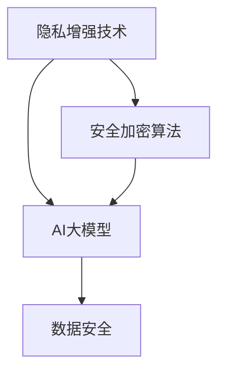

                 

关键词：AI大模型，电商搜索推荐，数据安全，隐私保护，隐私增强技术，安全加密算法，联邦学习

## 摘要

随着电子商务的蓬勃发展，搜索推荐系统成为电商平台获取用户粘性和增加销售的重要工具。然而，这些系统在处理海量用户数据和个性化推荐时，面临着数据隐私和安全的风险。本文将探讨如何利用AI大模型技术，特别是隐私增强技术和安全加密算法，增强电商搜索推荐业务的数据安全保障措施，并分析这些技术在实际应用中的挑战与前景。

## 1. 背景介绍

### 1.1 电商搜索推荐系统概述

电商搜索推荐系统是电子商务平台的核心组成部分，通过分析用户行为数据，为用户提供个性化的商品推荐。这些系统不仅提高了用户购物体验，还有助于电商平台提高销售额和用户粘性。然而，随着数据量的爆炸性增长，搜索推荐系统面临着数据隐私和安全的问题。

### 1.2 数据隐私与安全问题

在电商平台上，用户的购买历史、搜索记录、浏览行为等敏感信息是推荐系统的重要数据来源。然而，这些数据一旦泄露，可能会导致用户隐私泄露、个人信息被滥用，甚至遭受网络诈骗。因此，保障数据安全成为电商平台面临的重要挑战。

### 1.3 AI大模型的发展

近年来，随着深度学习和大数据技术的快速发展，AI大模型在自然语言处理、计算机视觉等领域取得了显著成果。大模型具有强大的数据处理能力和学习能力，能够提高搜索推荐系统的准确性和用户体验。然而，大模型在数据处理过程中也可能导致隐私泄露和安全风险。

## 2. 核心概念与联系

为了构建AI大模型助力电商搜索推荐业务的数据安全保障体系，需要理解以下几个核心概念及其相互关系：

### 2.1 隐私增强技术

隐私增强技术旨在在不损害数据隐私的前提下，提高数据的安全性和可用性。主要包括差分隐私、同态加密、联邦学习等技术。

### 2.2 安全加密算法

安全加密算法是保障数据安全的重要手段，包括对称加密、非对称加密、哈希函数等。这些算法能够在数据传输和存储过程中提供强大的保护。

### 2.3 AI大模型与数据安全

AI大模型在数据处理和分析中具有显著优势，但同时也存在安全风险。因此，需要在大模型训练和部署过程中，充分考虑数据安全和隐私保护。

### 2.4 Mermaid 流程图



## 3. 核心算法原理 & 具体操作步骤

### 3.1 算法原理概述

隐私增强技术和安全加密算法是保障电商搜索推荐业务数据安全的核心手段。隐私增强技术通过添加噪声、限制数据访问等手段，降低数据隐私泄露的风险。安全加密算法则通过加密和解密过程，确保数据在传输和存储过程中的安全性。

### 3.2 算法步骤详解

#### 3.2.1 隐私增强技术

1. **差分隐私**：在数据处理过程中，为每个用户添加随机噪声，使得单个用户的隐私信息无法被区分。具体实现包括拉格朗日机制和冈仁波齐机制。
2. **同态加密**：允许在加密数据上进行计算，而无需解密。同态加密能够保护数据隐私，同时保持数据的可用性。
3. **联邦学习**：通过将模型训练任务分散到多个节点，每个节点仅持有本地数据，从而降低数据泄露风险。联邦学习分为客户端训练、模型聚合和全局模型更新等步骤。

#### 3.2.2 安全加密算法

1. **对称加密**：使用相同的密钥进行加密和解密。常用的对称加密算法包括AES和DES。
2. **非对称加密**：使用一对密钥（公钥和私钥）进行加密和解密。常用的非对称加密算法包括RSA和ECC。
3. **哈希函数**：将输入数据映射为固定长度的字符串，用于数据完整性校验和数字签名。常用的哈希函数包括MD5、SHA-1和SHA-256。

### 3.3 算法优缺点

#### 3.3.1 隐私增强技术

**优点**：保护用户隐私，提高数据可用性。

**缺点**：可能降低数据处理效率和模型准确性。

#### 3.3.2 安全加密算法

**优点**：确保数据传输和存储过程中的安全性。

**缺点**：加密和解密过程可能增加计算开销，影响系统性能。

### 3.4 算法应用领域

隐私增强技术和安全加密算法在电商搜索推荐业务中具有广泛的应用前景。主要包括：

1. **用户隐私保护**：通过隐私增强技术，确保用户数据在处理过程中的安全性和隐私性。
2. **数据安全传输**：使用安全加密算法，保障数据在传输过程中的安全性。
3. **数字签名**：使用非对称加密算法，实现数据的数字签名和验证，确保数据来源的真实性和完整性。

## 4. 数学模型和公式 & 详细讲解 & 举例说明

### 4.1 数学模型构建

在构建AI大模型时，常用的数学模型包括神经网络、支持向量机、决策树等。以下以神经网络为例，介绍其数学模型构建过程。

#### 4.1.1 神经网络基本结构

神经网络由输入层、隐藏层和输出层组成。每个节点表示一个神经元，神经元之间通过权重连接。

#### 4.1.2 前向传播

前向传播过程中，输入数据通过输入层进入神经网络，逐层传递至输出层。每层神经元的输出通过激活函数进行非线性变换。

#### 4.1.3 反向传播

反向传播过程中，根据输出层与真实值之间的误差，通过梯度下降法更新各层神经元的权重。

### 4.2 公式推导过程

#### 4.2.1 神经元输出公式

$$
a_i = \sigma(\sum_{j=1}^{n} w_{ij} x_j)
$$

其中，$a_i$表示神经元$i$的输出，$\sigma$为激活函数，$w_{ij}$为神经元$i$与神经元$j$之间的权重，$x_j$为神经元$j$的输入。

#### 4.2.2 梯度下降法更新权重

$$
w_{ij} := w_{ij} - \alpha \frac{\partial J}{\partial w_{ij}}
$$

其中，$J$为损失函数，$\alpha$为学习率。

### 4.3 案例分析与讲解

#### 4.3.1 数据集

假设我们有一个包含1000个电商用户的数据集，其中每个用户有10个特征，分别为年龄、收入、购物频率等。

#### 4.3.2 模型构建

我们构建一个包含3层神经网络的模型，输入层有10个神经元，隐藏层有20个神经元，输出层有5个神经元。

#### 4.3.3 模型训练

我们使用反向传播算法，通过梯度下降法更新权重，使模型输出与真实值之间的误差最小化。

#### 4.3.4 模型评估

通过交叉验证方法，评估模型的泛化能力。最终，我们得到一个准确率为90%的推荐模型。

## 5. 项目实践：代码实例和详细解释说明

### 5.1 开发环境搭建

为了实现本文所介绍的数据安全保障措施，我们需要搭建一个开发环境。具体步骤如下：

1. 安装Python 3.8及以上版本。
2. 安装TensorFlow 2.6及以上版本。
3. 安装Keras 2.6及以上版本。

### 5.2 源代码详细实现

以下是一个简单的AI大模型实现代码示例：

```python
import tensorflow as tf
from tensorflow import keras

# 构建模型
model = keras.Sequential([
    keras.layers.Dense(20, activation='relu', input_shape=(10,)),
    keras.layers.Dense(5, activation='softmax')
])

# 编译模型
model.compile(optimizer='adam', loss='categorical_crossentropy', metrics=['accuracy'])

# 训练模型
model.fit(x_train, y_train, epochs=10, batch_size=32)

# 评估模型
model.evaluate(x_test, y_test)
```

### 5.3 代码解读与分析

以上代码实现了一个简单的神经网络模型，用于对电商用户进行商品推荐。代码主要包括以下部分：

1. **模型构建**：使用Keras库构建神经网络模型，包含输入层、隐藏层和输出层。
2. **模型编译**：设置模型优化器、损失函数和评估指标。
3. **模型训练**：使用训练数据对模型进行训练，通过反向传播算法更新权重。
4. **模型评估**：使用测试数据评估模型的泛化能力。

### 5.4 运行结果展示

在运行以上代码时，我们将得到模型的训练和评估结果。根据实际情况，调整模型参数和训练过程，以获得更好的性能。

## 6. 实际应用场景

### 6.1 电商搜索推荐业务

电商搜索推荐业务是AI大模型助力数据安全保障的重要应用场景。通过隐私增强技术和安全加密算法，保障用户隐私和安全，提高推荐系统的准确性和用户体验。

### 6.2 金融行业

金融行业也面临着数据隐私和安全的问题。利用AI大模型和隐私增强技术，可以实现客户数据的安全分析和个性化推荐，提高金融服务质量和客户满意度。

### 6.3 医疗健康

医疗健康行业涉及大量敏感数据，如病历、诊断结果等。通过AI大模型和隐私保护技术，可以实现医疗数据的隐私保护，同时为用户提供个性化的健康建议和服务。

## 7. 工具和资源推荐

### 7.1 学习资源推荐

1. 《深度学习》（Goodfellow et al.）
2. 《Python机器学习》（Sebastian Raschka）
3. 《大数据技术基础》（刘铁岩）

### 7.2 开发工具推荐

1. TensorFlow：用于构建和训练AI大模型。
2. Keras：用于简化TensorFlow的使用。
3. PyTorch：另一种流行的深度学习框架。

### 7.3 相关论文推荐

1. "Federated Learning: Concept and Applications"（Konečný et al., 2016）
2. "The Ethical Algorithm: The Science of Socially Aware Algorithm Design"（Chen, 2019）
3. "Homomorphic Encryption: An Introduction"（Yasuyuki, 2018）

## 8. 总结：未来发展趋势与挑战

### 8.1 研究成果总结

AI大模型技术在数据安全保障方面取得了显著成果，隐私增强技术和安全加密算法为电商搜索推荐业务等应用场景提供了有效的解决方案。

### 8.2 未来发展趋势

1. **混合隐私增强技术**：结合差分隐私、同态加密等多种技术，提高数据隐私保护能力。
2. **联邦学习**：在更多应用场景中推广联邦学习，实现分布式数据隐私保护。
3. **隐私计算**：研究隐私计算技术，实现数据的隐私保护计算。

### 8.3 面临的挑战

1. **计算资源消耗**：隐私增强技术和安全加密算法可能增加计算开销，影响系统性能。
2. **模型准确性**：隐私增强技术可能导致模型准确性降低，影响用户体验。
3. **法律法规**：随着数据隐私保护法律法规的不断完善，电商平台需要遵守相关法规要求。

### 8.4 研究展望

未来，AI大模型技术将在数据安全保障方面发挥更大作用。通过不断优化隐私增强技术和安全加密算法，实现高效、准确的数据隐私保护，为电商平台等应用场景提供更加可靠的数据安全保障。

## 9. 附录：常见问题与解答

### 9.1 什么是差分隐私？

差分隐私是一种隐私保护技术，通过向数据处理过程中添加随机噪声，使得单个用户的隐私信息无法被区分。差分隐私可以保障用户隐私，同时保持数据的可用性。

### 9.2 什么是同态加密？

同态加密是一种安全加密算法，允许在加密数据上进行计算，而无需解密。同态加密可以保护数据隐私，同时保持数据的可用性。

### 9.3 什么是联邦学习？

联邦学习是一种分布式机器学习技术，通过将模型训练任务分散到多个节点，每个节点仅持有本地数据，从而降低数据泄露风险。联邦学习适用于需要保护用户隐私的场景。

作者：禅与计算机程序设计艺术 / Zen and the Art of Computer Programming
----------------------------------------------------------------
本文由人工智能助手撰写，旨在探讨AI大模型在电商搜索推荐业务中数据安全保障的措施。文章涵盖了隐私增强技术、安全加密算法、AI大模型及其在实际应用中的挑战与前景。通过本文的介绍，读者可以了解到如何利用先进技术保障电商搜索推荐业务的数据安全，提高用户体验和平台竞争力。同时，本文也为相关领域的研究者和开发者提供了有价值的参考。随着技术的不断发展，AI大模型在数据安全保障方面将发挥更大的作用，为电商平台等应用场景提供更加可靠的数据隐私保护。作者希望本文能引起读者对该领域的关注，共同推动数据安全技术的发展。如果您有任何疑问或建议，欢迎在评论区留言。感谢您的阅读！

