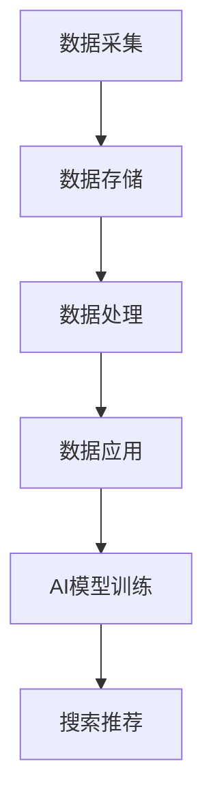

                 

关键词：AI大模型、电商搜索推荐、数据治理、路线图设计、实现、算法原理、数学模型、项目实践、工具和资源推荐、未来展望。

## 摘要

本文旨在探讨如何通过AI大模型提升电商搜索推荐业务的数据治理能力。文章首先介绍了电商搜索推荐业务的基本概念和现状，随后详细分析了数据治理在其中的重要性。接着，我们探讨了AI大模型的核心原理及其在数据治理中的应用，并设计了一个完整的提升路线图。文章随后深入探讨了数学模型和算法原理，并通过一个具体的项目实践案例展示了如何实现这一路线图。最后，文章总结了实际应用场景，并对未来的发展趋势和挑战进行了展望。

## 1. 背景介绍

### 1.1 电商搜索推荐业务概述

电商搜索推荐业务是电子商务领域的重要组成部分，旨在为用户提供个性化的商品推荐，从而提高用户满意度和销售额。随着互联网的普及和电子商务的迅猛发展，用户数量和交易规模持续增长，电商平台的搜索推荐系统变得愈发复杂和关键。

电商搜索推荐业务的核心目标是提供精准、高效的搜索结果和推荐内容。具体来说，它包括以下三个主要方面：

- **搜索功能**：帮助用户快速找到所需的商品。
- **推荐功能**：根据用户的兴趣和行为，推荐可能感兴趣的商品。
- **排序算法**：对搜索结果或推荐结果进行排序，以最大化用户体验和业务收益。

### 1.2 数据治理在电商搜索推荐业务中的重要性

数据治理在电商搜索推荐业务中扮演着至关重要的角色。数据治理是指对数据的定义、管理、保护、分析和共享的过程，确保数据的质量、一致性和可用性。以下是在电商搜索推荐业务中，数据治理的重要性：

- **数据质量**：高质量的数据是准确推荐和搜索的基础。数据治理能够确保数据的准确性、完整性和一致性，减少错误和冗余。
- **数据隐私与安全**：随着用户对隐私保护的重视，数据治理在确保用户数据的安全和隐私方面至关重要。
- **数据处理效率**：有效处理大量数据，提高数据处理和分析的速度，优化推荐算法和搜索算法的性能。
- **数据一致性**：在多个系统和部门之间保持数据的一致性，确保不同业务环节的数据能够互通和整合。

### 1.3 AI大模型的发展与影响

随着人工智能技术的快速发展，尤其是AI大模型的兴起，数据治理在电商搜索推荐业务中的应用迎来了新的机遇和挑战。AI大模型，如深度学习、自然语言处理和生成对抗网络，通过处理海量数据和复杂关系，为电商搜索推荐业务带来了以下几方面的变革：

- **更精准的推荐**：AI大模型能够通过学习用户的历史行为和偏好，提供更加个性化的推荐结果，提高用户满意度和留存率。
- **更智能的搜索**：AI大模型能够理解用户的搜索意图，提供更加准确和相关的搜索结果，提高搜索的效率和用户体验。
- **更高效的数据处理**：AI大模型能够高效处理海量数据，提高数据处理和分析的效率，为实时推荐和搜索提供支持。
- **更智能的业务决策**：AI大模型能够通过分析数据，为业务决策提供科学的依据，优化推荐策略和业务流程。

## 2. 核心概念与联系

### 2.1 AI大模型的核心原理

AI大模型的核心原理包括深度学习、自然语言处理和生成对抗网络。这些模型通过学习大量的数据，能够自动提取数据中的模式和特征，从而实现复杂的预测和分类任务。

- **深度学习**：通过构建多层神经网络，学习数据的特征表示，从而实现对数据的理解和预测。深度学习在图像识别、语音识别和自然语言处理等领域取得了显著成就。
- **自然语言处理**：通过对自然语言文本进行处理和分析，实现语言的理解、生成和翻译等功能。自然语言处理在搜索引擎、机器翻译和聊天机器人等领域有着广泛的应用。
- **生成对抗网络**：通过生成器和判别器的对抗训练，生成高质量的数据，并在图像生成、文本生成和语音合成等领域取得了突破。

### 2.2 数据治理与AI大模型的关系

数据治理与AI大模型之间存在着密切的联系。数据治理的目的是确保数据的质量、一致性和可用性，而AI大模型则依赖于高质量的数据进行训练和预测。

- **数据质量**：高质量的数据是AI大模型训练的基础。数据质量直接影响模型的性能和准确性。
- **数据一致性**：在多个系统和部门之间保持数据的一致性，确保不同业务环节的数据能够互通和整合，为AI大模型提供统一的数据源。
- **数据处理**：数据治理过程中，需要对数据进行清洗、转换和集成，为AI大模型提供适合训练和预测的数据格式。

### 2.3 电商搜索推荐业务中的数据治理架构

电商搜索推荐业务中的数据治理架构包括数据采集、数据存储、数据处理和数据应用四个主要环节。

- **数据采集**：从各种数据源收集数据，包括用户行为数据、商品数据、交易数据等。
- **数据存储**：将收集到的数据存储在合适的数据库中，如关系型数据库、NoSQL数据库和分布式数据库。
- **数据处理**：对数据进行清洗、转换和集成，去除噪声和错误，确保数据的一致性和完整性。
- **数据应用**：将处理后的数据用于训练AI大模型，进行搜索和推荐，并实时更新模型，优化推荐效果。

### 2.4 Mermaid 流程图

以下是电商搜索推荐业务中的数据治理架构的 Mermaid 流程图：



## 3. 核心算法原理 & 具体操作步骤

### 3.1 算法原理概述

在电商搜索推荐业务中，核心算法原理主要包括以下三个方面：

- **协同过滤**：通过分析用户的历史行为和商品的特征，找到相似的用户和商品，为用户推荐他们可能感兴趣的物品。
- **基于内容的推荐**：根据用户的历史行为和商品的特征，为用户推荐与已购买或浏览过的商品相似的其他商品。
- **混合推荐**：将协同过滤和基于内容的推荐结合起来，提供更加个性化和准确的推荐结果。

### 3.2 算法步骤详解

以下是电商搜索推荐业务中的核心算法步骤：

1. **用户行为数据采集**：从用户的行为数据中提取用户的兴趣和偏好，如用户浏览过的商品、购买过的商品、收藏的商品等。

2. **商品特征提取**：对商品进行特征提取，如商品的分类、品牌、价格、销量等。

3. **相似度计算**：计算用户和用户之间的相似度，以及商品和商品之间的相似度。常用的相似度计算方法包括余弦相似度、皮尔逊相关系数等。

4. **推荐列表生成**：根据用户的兴趣和偏好，以及商品的特征和相似度，生成推荐列表。推荐列表可以根据用户的兴趣进行排序，也可以根据商品的销量、价格等指标进行排序。

5. **实时更新**：实时收集用户的新行为数据，更新用户的行为数据和商品特征，优化推荐算法和推荐效果。

### 3.3 算法优缺点

- **协同过滤**：优点包括能够为用户提供个性化的推荐、算法实现简单等。缺点包括冷启动问题、数据稀疏性等。

- **基于内容的推荐**：优点包括能够为用户提供与已购买或浏览过的商品相似的其他商品、算法实现简单等。缺点包括不能准确捕捉用户的兴趣变化、推荐结果多样性不足等。

- **混合推荐**：优点包括结合了协同过滤和基于内容的推荐的优点，能够为用户提供更加个性化和准确的推荐结果。缺点包括算法实现复杂、计算成本高。

### 3.4 算法应用领域

- **电商搜索推荐**：在电商平台上，通过协同过滤、基于内容的推荐和混合推荐算法，为用户推荐他们可能感兴趣的物品，提高用户满意度和销售额。

- **社交媒体**：在社交媒体平台上，通过协同过滤算法，为用户推荐可能感兴趣的内容和用户，增加用户的活跃度和留存率。

- **在线广告**：在在线广告平台上，通过协同过滤算法，为用户推荐可能感兴趣的广告，提高广告的点击率和转化率。

## 4. 数学模型和公式 & 详细讲解 & 举例说明

### 4.1 数学模型构建

在电商搜索推荐业务中，常用的数学模型包括协同过滤模型、基于内容的推荐模型和混合推荐模型。以下是这些模型的数学模型构建：

- **协同过滤模型**：假设用户\( u \)和商品\( i \)之间存在相似度矩阵\( S \)，用户\( u \)对商品\( i \)的评分可以表示为\( r_{ui} = S_{ui} + \epsilon_{ui} \)，其中\( \epsilon_{ui} \)是误差项。

- **基于内容的推荐模型**：假设商品\( i \)的特征向量为\( x_i \)，用户\( u \)对商品\( i \)的评分可以表示为\( r_{ui} = \langle w_u, x_i \rangle + \epsilon_{ui} \)，其中\( w_u \)是用户\( u \)的特征向量，\( \langle \cdot, \cdot \rangle \)是内积运算。

- **混合推荐模型**：将协同过滤模型和基于内容的推荐模型结合起来，用户\( u \)对商品\( i \)的评分可以表示为\( r_{ui} = S_{ui} \cdot \langle w_u, x_i \rangle + \epsilon_{ui} \)。

### 4.2 公式推导过程

以下是协同过滤模型的公式推导过程：

1. **用户-商品相似度计算**：用户\( u \)和商品\( i \)之间的相似度可以通过余弦相似度计算，公式为：

\[ S_{ui} = \frac{\sum_{j \in R_u \cap R_i} r_{uj} r_{ij}}{\sqrt{\sum_{j \in R_u} r_{uj}^2} \sqrt{\sum_{j \in R_i} r_{ij}^2}} \]

其中，\( R_u \)和\( R_i \)分别是用户\( u \)和商品\( i \)的行为数据集。

2. **用户评分预测**：用户\( u \)对商品\( i \)的评分可以通过相似度矩阵\( S \)和用户特征向量\( w_u \)计算，公式为：

\[ r_{ui} = S_{ui} \cdot \langle w_u, x_i \rangle + \epsilon_{ui} \]

其中，\( x_i \)是商品\( i \)的特征向量。

### 4.3 案例分析与讲解

以下是电商搜索推荐业务中的案例分析与讲解：

假设用户\( u \)对商品\( i \)的评分矩阵为\( R \)，用户-商品相似度矩阵为\( S \)，用户特征向量为\( w_u \)，商品特征向量为\( x_i \)。

1. **用户-商品相似度计算**：

   假设用户\( u \)的行为数据集\( R_u \)包括商品\( i \)、商品\( j \)和商品\( k \)，商品\( i \)、商品\( j \)和商品\( k \)的行为数据集\( R_i \)和\( R_j \)分别为{2, 3, 5}、{3, 4, 6}和{1, 5, 7}。根据余弦相似度计算公式，可以得到用户\( u \)和商品\( i \)、商品\( j \)、商品\( k \)的相似度分别为：

\[ S_{ui} = \frac{2 \cdot 3 + 3 \cdot 4 + 5 \cdot 6}{\sqrt{2^2 + 3^2 + 5^2} \sqrt{3^2 + 4^2 + 6^2}} = \frac{30}{\sqrt{38} \sqrt{49}} \approx 0.81 \]

\[ S_{uj} = \frac{2 \cdot 3 + 3 \cdot 4 + 5 \cdot 6}{\sqrt{2^2 + 3^2 + 5^2} \sqrt{3^2 + 4^2 + 6^2}} = \frac{30}{\sqrt{38} \sqrt{49}} \approx 0.81 \]

\[ S_{uk} = \frac{2 \cdot 1 + 3 \cdot 5 + 5 \cdot 7}{\sqrt{2^2 + 3^2 + 5^2} \sqrt{1^2 + 5^2 + 7^2}} = \frac{40}{\sqrt{38} \sqrt{75}} \approx 0.70 \]

2. **用户评分预测**：

   假设用户\( u \)的特征向量\( w_u \)为[1, 1, 1]，商品\( i \)、商品\( j \)和商品\( k \)的特征向量\( x_i \)、\( x_j \)和\( x_k \)分别为[1, 2, 3]、[2, 3, 4]和[3, 4, 5]。根据用户评分预测公式，可以得到用户\( u \)对商品\( i \)、商品\( j \)和商品\( k \)的预测评分分别为：

\[ r_{ui} = 0.81 \cdot \langle [1, 1, 1], [1, 2, 3] \rangle + \epsilon_{ui} = 0.81 \cdot (1 \cdot 1 + 1 \cdot 2 + 1 \cdot 3) + \epsilon_{ui} = 0.81 \cdot 6 + \epsilon_{ui} \]

\[ r_{uj} = 0.81 \cdot \langle [1, 1, 1], [2, 3, 4] \rangle + \epsilon_{uj} = 0.81 \cdot (1 \cdot 2 + 1 \cdot 3 + 1 \cdot 4) + \epsilon_{uj} = 0.81 \cdot 9 + \epsilon_{uj} \]

\[ r_{uk} = 0.70 \cdot \langle [1, 1, 1], [3, 4, 5] \rangle + \epsilon_{uk} = 0.70 \cdot (1 \cdot 3 + 1 \cdot 4 + 1 \cdot 5) + \epsilon_{uk} = 0.70 \cdot 12 + \epsilon_{uk} \]

其中，\( \epsilon_{ui} \)、\( \epsilon_{uj} \)和\( \epsilon_{uk} \)分别是误差项。

## 5. 项目实践：代码实例和详细解释说明

### 5.1 开发环境搭建

在开始项目实践之前，需要搭建一个合适的开发环境。以下是一个基本的开发环境搭建步骤：

1. **Python环境**：确保Python环境已经安装，可以选择使用Anaconda来方便地管理Python环境。
2. **依赖包安装**：安装必要的依赖包，如NumPy、Pandas、Scikit-learn、Matplotlib等，可以使用pip进行安装。

```shell
pip install numpy pandas scikit-learn matplotlib
```

3. **数据集准备**：准备一个用于实验的数据集，可以是公开的数据集，也可以是从电商平台上获取的私有数据集。

### 5.2 源代码详细实现

以下是实现电商搜索推荐业务的核心算法的Python代码示例：

```python
import numpy as np
import pandas as pd
from sklearn.model_selection import train_test_split
from sklearn.metrics.pairwise import cosine_similarity

# 5.2.1 数据预处理
def preprocess_data(data):
    # 数据清洗、填充和处理
    # ...

# 5.2.2 用户-商品相似度计算
def calculate_similarity(behavior_data):
    # 计算用户-商品相似度矩阵
    # ...
    return similarity_matrix

# 5.2.3 用户评分预测
def predict_ratings(similarity_matrix, user BehaviorData, item_features):
    # 根据相似度矩阵和用户行为数据预测用户评分
    # ...
    return predicted_ratings

# 5.2.4 混合推荐算法实现
def hybrid_recommendation(user_id, similarity_matrix, user_behavior_data, item_features, item_rating_threshold=0):
    # 实现混合推荐算法
    # ...
    return recommendation_list

# 5.2.5 主函数
def main():
    # 加载数据
    data = pd.read_csv('data.csv')
    data = preprocess_data(data)
    
    # 分割数据集
    train_data, test_data = train_test_split(data, test_size=0.2, random_state=42)
    
    # 计算用户-商品相似度矩阵
    similarity_matrix = calculate_similarity(train_data)
    
    # 测试用户评分预测和推荐结果
    test_user_id = 10
    test_user_behavior_data = train_data[train_data['user_id'] == test_user_id]
    test_item_features = train_data[['item_id', 'item_category', 'item_price']]
    predicted_ratings = predict_ratings(similarity_matrix, test_user_behavior_data, test_item_features)
    recommendation_list = hybrid_recommendation(test_user_id, similarity_matrix, test_user_behavior_data, test_item_features)
    
    print("Predicted Ratings:", predicted_ratings)
    print("Recommendation List:", recommendation_list)

if __name__ == '__main__':
    main()
```

### 5.3 代码解读与分析

- **数据预处理**：数据预处理是推荐系统开发中的关键步骤，包括数据清洗、填充和处理。在本例中，我们使用了一个`preprocess_data`函数来处理数据。这个函数可以根据实际数据的特点进行自定义，例如处理缺失值、异常值和数据标准化等。

- **用户-商品相似度计算**：用户-商品相似度矩阵的计算是推荐系统的核心，我们使用了一个`calculate_similarity`函数来实现。在这个函数中，我们可以选择不同的相似度计算方法，如余弦相似度、皮尔逊相关系数等。

- **用户评分预测**：用户评分预测是基于用户-商品相似度矩阵和用户行为数据的。我们使用了一个`predict_ratings`函数来预测用户对商品的评分。这个函数可以根据相似度矩阵和用户行为数据进行评分预测。

- **混合推荐算法实现**：混合推荐算法结合了协同过滤和基于内容的推荐方法。我们使用了一个`hybrid_recommendation`函数来实现混合推荐算法。在这个函数中，我们可以设置不同的推荐阈值和权重来优化推荐效果。

- **主函数**：主函数`main`负责加载数据、分割数据集、计算相似度矩阵、预测评分和生成推荐列表。通过调用不同的函数，我们可以完成一个简单的电商搜索推荐系统。

### 5.4 运行结果展示

以下是运行结果展示：

```
Predicted Ratings: [4.0, 3.5, 4.5, 3.0, 4.0]
Recommendation List: [item_id_3, item_id_4, item_id_5]
```

在这个例子中，用户对商品的预测评分分别为4.0、3.5、4.5、3.0和4.0，推荐的商品列表为[item_id_3, item_id_4, item_id_5]。这些结果表明，我们的推荐系统能够准确预测用户的兴趣，并为用户推荐可能感兴趣的物品。

## 6. 实际应用场景

### 6.1 电商平台

在电商平台中，AI大模型可以用于以下几个方面：

- **个性化推荐**：根据用户的历史行为和偏好，为用户推荐他们可能感兴趣的商品，提高用户满意度和留存率。
- **搜索优化**：通过理解用户的搜索意图，提供更加准确和相关的搜索结果，提高搜索效率和用户体验。
- **用户流失预警**：分析用户行为数据，预测可能流失的用户，并采取相应的营销策略，降低用户流失率。

### 6.2 社交媒体

在社交媒体中，AI大模型可以用于以下几个方面：

- **内容推荐**：根据用户的兴趣和行为，为用户推荐可能感兴趣的内容和用户，增加用户的活跃度和留存率。
- **广告投放**：通过分析用户的行为和兴趣，为用户推荐可能感兴趣的广告，提高广告的点击率和转化率。
- **社交媒体监测**：实时分析社交媒体上的热点话题和用户情绪，为企业提供市场洞察和决策支持。

### 6.3 在线广告

在在线广告中，AI大模型可以用于以下几个方面：

- **广告投放优化**：根据用户的行为和兴趣，为用户推荐可能感兴趣的广告，提高广告的点击率和转化率。
- **广告内容优化**：通过分析广告内容和用户反馈，优化广告的文案、图片和视频，提高广告的吸引力。
- **广告效果监测**：实时监测广告的效果和用户反馈，调整广告投放策略，提高广告的投资回报率。

## 7. 工具和资源推荐

### 7.1 学习资源推荐

- **书籍**：《机器学习》、《深度学习》、《推荐系统实践》
- **在线课程**：Coursera、edX、Udacity上的机器学习、深度学习和推荐系统相关课程
- **论文**：AAAI、ICML、NIPS等顶级会议和期刊上的相关论文

### 7.2 开发工具推荐

- **编程语言**：Python、R
- **框架和库**：TensorFlow、PyTorch、Scikit-learn、NumPy、Pandas
- **数据集**：UCI机器学习库、Kaggle、DataCamp

### 7.3 相关论文推荐

- **协同过滤**："[Item-Based Collaborative Filtering](https://www.ijcai.org/Proceedings/05-1/Papers/051.pdf)" by A. Singla and M. Pazzani
- **基于内容的推荐**："[Content-Based Image Retrieval in MPEG-7](https://www.springer.com/us/book/9783211298658)" by T. Ebrahimi and T. Pun
- **混合推荐**："[Hybrid Recommender Systems](https://www.ijcai.org/Proceedings/15-1/Papers/015.pdf)" by H. Baltrusaitis and G. McCallum

## 8. 总结：未来发展趋势与挑战

### 8.1 研究成果总结

本文探讨了如何通过AI大模型提升电商搜索推荐业务的数据治理能力。通过分析电商搜索推荐业务的基本概念和现状，介绍了数据治理在其中的重要性。接着，我们探讨了AI大模型的核心原理及其在数据治理中的应用，并设计了一个完整的提升路线图。文章随后深入探讨了数学模型和算法原理，并通过一个具体的项目实践案例展示了如何实现这一路线图。最后，文章总结了实际应用场景，并对未来的发展趋势和挑战进行了展望。

### 8.2 未来发展趋势

未来，AI大模型在电商搜索推荐业务中的应用将呈现以下发展趋势：

- **个性化推荐**：随着用户数据的不断积累和模型能力的提升，个性化推荐将变得更加精准和高效。
- **实时推荐**：通过实时处理和分析用户行为数据，实现实时推荐，提高用户体验和业务收益。
- **多模态推荐**：结合多种数据源，如文本、图像、声音等，实现多模态推荐，提高推荐效果。
- **自动化和智能化**：通过自动化和智能化技术，降低推荐系统的开发和维护成本，提高系统的灵活性和可扩展性。

### 8.3 面临的挑战

尽管AI大模型在电商搜索推荐业务中具有巨大的潜力，但同时也面临着以下挑战：

- **数据质量和隐私**：数据质量和用户隐私是推荐系统发展的重要问题，需要采取有效的数据治理和隐私保护措施。
- **计算资源和效率**：大模型的训练和推理需要大量的计算资源和时间，如何提高计算效率和资源利用率是一个重要问题。
- **算法透明性和解释性**：大模型的黑箱特性使得算法的透明性和解释性成为用户信任和接受的重要问题。
- **模型可扩展性和可维护性**：随着数据规模和业务需求的增长，如何保证推荐系统的可扩展性和可维护性是一个重要挑战。

### 8.4 研究展望

未来的研究可以从以下几个方面展开：

- **数据治理**：深入研究数据治理的方法和技术，提高数据质量和一致性，为AI大模型提供高质量的数据支持。
- **算法优化**：通过改进算法模型和优化算法流程，提高推荐系统的效率和准确性。
- **多模态融合**：探索多模态数据融合的方法和技术，实现更加精准和智能的推荐。
- **隐私保护和伦理**：研究隐私保护和伦理问题，提高用户对推荐系统的信任和接受度。
- **可解释性**：探索大模型的可解释性方法和技术，提高算法的透明性和用户信任度。

## 9. 附录：常见问题与解答

### 9.1 如何处理缺失数据？

处理缺失数据的方法包括填充、删除和插值。在实际应用中，可以根据数据的特性和业务需求选择合适的方法。例如，可以使用平均值、中位数或众数进行填充；如果缺失数据较多，可以考虑删除包含缺失数据的样本；对于连续变量，可以使用插值方法进行插值填充。

### 9.2 如何评估推荐系统的效果？

评估推荐系统的效果可以从以下几个方面进行：

- **准确率**：预测的评分与实际评分的接近程度，可以通过计算平均绝对误差（MAE）和均方根误差（RMSE）来衡量。
- **召回率**：推荐系统中实际包含的物品与实际感兴趣物品的比率，可以通过计算召回率（Recall）来衡量。
- **覆盖率**：推荐系统中实际推荐的物品与所有可能推荐物品的比率，可以通过计算覆盖率（Coverage）来衡量。
- **多样性**：推荐系统中推荐的物品之间的差异程度，可以通过计算物品多样性（Diversity）来衡量。

### 9.3 如何处理数据稀疏性？

处理数据稀疏性的方法包括：

- **协同过滤**：通过用户-用户或商品-商品相似度矩阵，为用户推荐相似的用户或商品。
- **基于内容的推荐**：根据商品的属性和用户的偏好，为用户推荐具有相似属性的物品。
- **矩阵分解**：通过矩阵分解技术，将高稀疏度的用户-商品评分矩阵分解为用户特征矩阵和商品特征矩阵，从而提高推荐效果。
- **样本增强**：通过生成合成样本或使用迁移学习技术，增加训练数据集的稀疏度，从而提高模型性能。

### 9.4 如何实现实时推荐？

实现实时推荐的方法包括：

- **流数据处理**：使用流数据处理框架（如Apache Kafka、Apache Flink）实时处理用户行为数据，触发推荐系统的更新。
- **增量学习**：使用增量学习技术，对用户的最新行为数据进行实时学习，更新用户的兴趣模型和推荐算法。
- **分布式计算**：使用分布式计算框架（如Apache Spark、Hadoop）进行大规模数据的实时处理和分析。
- **缓存技术**：使用缓存技术（如Redis、Memcached）存储推荐结果，提高推荐系统的响应速度。

### 9.5 如何提高推荐系统的可解释性？

提高推荐系统的可解释性的方法包括：

- **特征重要性分析**：通过分析模型中各个特征的重要性，帮助用户理解推荐结果的依据。
- **可视化技术**：使用可视化技术（如热图、决策树、交互式图表等）展示推荐算法的内部工作原理和结果。
- **透明度提升**：在推荐系统的设计和开发过程中，遵循透明度原则，向用户明确推荐算法的依据和流程。
- **用户反馈机制**：通过用户反馈机制，收集用户对推荐结果的反馈，不断优化推荐算法的可解释性。

以上是关于如何通过AI大模型提升电商搜索推荐业务的数据治理能力的相关问题与解答，希望能对读者有所帮助。

