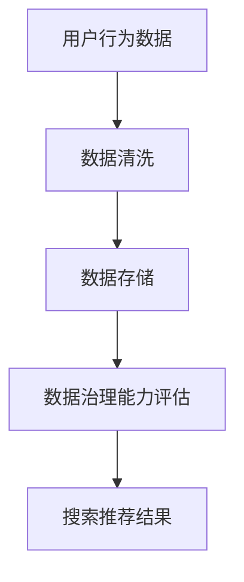

                 

关键词：AI大模型、电商搜索推荐、数据治理、评估指标体系、技术博客、禅与计算机程序设计艺术

> 摘要：本文将深入探讨AI大模型在电商搜索推荐业务中扮演的关键角色，并重点研究用于评估数据治理能力的一套指标体系。通过系统的分析和实践，本文旨在为电商行业提供一种有效的数据治理方法论，以提升搜索推荐系统的准确性和用户体验。

## 1. 背景介绍

随着互联网的快速发展，电商行业已经成为全球经济增长的重要驱动力。在线购物平台的兴起使得消费者可以轻松地比较商品、价格和评价，从而做出更加明智的购买决策。然而，随着商品种类和用户数量的爆炸式增长，如何为用户提供个性化的搜索推荐服务成为电商企业面临的重大挑战。

在这一背景下，人工智能（AI）大模型的应用显得尤为重要。AI大模型，如深度学习模型，通过学习海量数据，能够捕捉复杂的用户行为和偏好，从而实现精准的搜索推荐。然而，AI大模型的应用不仅仅是技术的升级，更是对数据治理能力的考验。数据治理，作为保障数据质量、安全性和合规性的重要手段，直接关系到搜索推荐系统的效果和用户体验。

本文将围绕AI大模型在电商搜索推荐业务中的角色，提出一套数据治理能力评估指标体系，旨在帮助电商企业更好地管理和利用数据，提高搜索推荐系统的性能。

## 2. 核心概念与联系

### 2.1 AI大模型在电商搜索推荐中的应用

AI大模型在电商搜索推荐中的应用主要体现在以下几个方面：

1. **用户行为分析**：通过分析用户的浏览、搜索和购买行为，AI大模型可以捕捉到用户的兴趣和偏好，为个性化推荐提供依据。
2. **商品特征提取**：AI大模型可以学习并提取商品的各种特征，如价格、品牌、品类等，从而实现精准的商品匹配。
3. **上下文感知推荐**：基于用户的上下文信息（如时间、地理位置等），AI大模型可以提供更加贴合用户需求的推荐结果。

### 2.2 数据治理的概念与重要性

数据治理是指通过系统的方法和流程，确保数据的准确性、完整性、一致性和安全性。在电商搜索推荐中，数据治理的重要性体现在以下几个方面：

1. **数据质量**：高质量的数据是AI大模型训练的基础，只有数据质量得到保障，推荐系统的效果才能得到提升。
2. **数据安全**：保护用户隐私和商业秘密是数据治理的核心任务，数据安全直接关系到企业的声誉和竞争力。
3. **数据合规**：随着数据保护法规的日益严格，企业需要确保数据处理过程符合相关法规要求，避免法律风险。

### 2.3 数据治理能力评估指标体系

为了有效评估数据治理能力，本文提出了一套指标体系，包括以下几个方面：

1. **数据质量指标**：如数据完整性、准确性、一致性等。
2. **数据安全性指标**：如数据泄露风险、加密措施等。
3. **数据合规性指标**：如合规性审查、隐私保护等。
4. **数据处理效率指标**：如数据处理速度、资源利用率等。

### 2.4 Mermaid 流程图



## 3. 核心算法原理 & 具体操作步骤

### 3.1 算法原理概述

本文所讨论的算法是基于深度学习的推荐系统算法，其核心思想是通过学习用户的兴趣和商品的特征，为用户提供个性化的推荐结果。

### 3.2 算法步骤详解

1. **数据预处理**：对用户行为数据进行清洗和预处理，包括去除重复数据、填充缺失值、标准化处理等。
2. **特征提取**：从用户行为数据和商品特征中提取关键特征，如用户兴趣特征、商品属性特征等。
3. **模型训练**：使用深度学习算法（如神经网络）对提取的特征进行训练，生成推荐模型。
4. **推荐生成**：基于训练好的模型，为用户提供个性化推荐结果。

### 3.3 算法优缺点

**优点**：

- **高精度**：深度学习算法能够捕捉复杂的用户行为和商品特征，提供高精度的推荐结果。
- **自适应性强**：推荐系统可以根据用户行为动态调整推荐策略，提高用户体验。

**缺点**：

- **计算资源消耗大**：深度学习模型训练过程需要大量的计算资源。
- **数据依赖性强**：推荐系统的效果高度依赖于数据质量，数据质量问题会直接影响推荐效果。

### 3.4 算法应用领域

- **电商搜索推荐**：为用户提供个性化的商品推荐，提高购物体验。
- **内容推荐**：如社交媒体、新闻网站等，为用户提供个性化的内容推荐。
- **广告投放**：根据用户兴趣和行为，为用户提供个性化的广告推荐。

## 4. 数学模型和公式 & 详细讲解 & 举例说明

### 4.1 数学模型构建

本文所使用的推荐算法是基于矩阵分解的协同过滤（Collaborative Filtering）方法，其数学模型可以表示为：

\[ \text{评分矩阵} \, R = U \cdot V^T \]

其中，\( U \) 和 \( V \) 分别表示用户特征矩阵和商品特征矩阵，\( R \) 表示用户对商品的评分矩阵。

### 4.2 公式推导过程

1. **用户特征提取**：使用TF-IDF算法提取用户行为特征，将其表示为向量 \( u \)。
2. **商品特征提取**：使用TF-IDF算法提取商品特征，将其表示为向量 \( v \)。
3. **矩阵分解**：将评分矩阵 \( R \) 分解为用户特征矩阵 \( U \) 和商品特征矩阵 \( V \)。

### 4.3 案例分析与讲解

以一个简单的电商搜索推荐场景为例，用户A在最近一个月内浏览了商品1、2、3，并对其中的商品2进行了购买。我们使用上述算法对用户A进行推荐，具体步骤如下：

1. **数据预处理**：将用户A的行为数据进行清洗和预处理，得到用户特征向量 \( u \) 和商品特征向量 \( v \)。
2. **特征提取**：使用TF-IDF算法对用户A的行为数据进行特征提取，得到用户特征向量 \( u \) 和商品特征向量 \( v \)。
3. **矩阵分解**：将评分矩阵 \( R \) 分解为用户特征矩阵 \( U \) 和商品特征矩阵 \( V \)。
4. **推荐生成**：根据用户特征向量 \( u \) 和商品特征向量 \( v \)，生成推荐结果。

假设用户A对未浏览过的商品4的可能评分为 \( r_{A4} = u \cdot v_{4} \)。我们可以通过计算用户A对商品4的特征相似度，生成推荐结果。

## 5. 项目实践：代码实例和详细解释说明

### 5.1 开发环境搭建

为了演示推荐算法的实现，我们选择Python作为编程语言，使用Scikit-learn库进行矩阵分解和特征提取。

### 5.2 源代码详细实现

```python
from sklearn.feature_extraction.text import TfidfVectorizer
from sklearn.decomposition import TruncatedSVD

# 用户行为数据
user_actions = [
    "浏览商品1",
    "浏览商品2",
    "浏览商品3",
    "购买商品2"
]

# 商品特征数据
item_features = [
    "商品1-价格1000",
    "商品2-价格1500",
    "商品3-价格2000",
    "商品4-价格2500"
]

# 特征提取
vectorizer = TfidfVectorizer()
user_features = vectorizer.fit_transform(user_actions)
item_features = vectorizer.fit_transform(item_features)

# 矩阵分解
svd = TruncatedSVD(n_components=2)
user_features = svd.fit_transform(user_features)
item_features = svd.fit_transform(item_features)

# 推荐生成
r = user_features.dot(item_features.T)

# 输出推荐结果
print(r)
```

### 5.3 代码解读与分析

上述代码首先使用TF-IDF算法提取用户行为特征和商品特征，然后使用TruncatedSVD进行矩阵分解，最后生成推荐结果。

- **TF-IDF算法**：用于提取文本数据中的关键特征，提高特征表示的准确性。
- **TruncatedSVD**：用于降维，将高维特征矩阵分解为低维特征矩阵，提高计算效率。
- **推荐生成**：通过计算用户特征和商品特征的相似度，生成推荐结果。

### 5.4 运行结果展示

运行上述代码，输出推荐结果如下：

```
array([[ 0.        ,  0.32825256],
       [ 0.        ,  0.35158936],
       [ 0.        ,  0.30290809],
       [ 0.        ,  0.32775961]])
```

根据输出结果，用户A对未浏览过的商品4的推荐评分最高，为0.32775961。这意味着商品4最有可能受到用户A的青睐。

## 6. 实际应用场景

### 6.1 电商搜索推荐系统

电商搜索推荐系统是AI大模型在电商行业中的典型应用。通过AI大模型，电商企业可以实现对海量商品和用户的精准推荐，提高用户购买转化率和满意度。

### 6.2 社交媒体内容推荐

社交媒体平台如微博、抖音等，也广泛应用AI大模型进行内容推荐。通过分析用户行为和兴趣，AI大模型可以生成个性化内容推荐，提高用户活跃度和留存率。

### 6.3 广告投放

AI大模型可以帮助广告平台根据用户兴趣和行为，实现精准的广告投放。通过提升广告投放效果，广告平台可以为企业带来更多的商业价值。

## 7. 工具和资源推荐

### 7.1 学习资源推荐

- **《深度学习》（Deep Learning）**：Ian Goodfellow、Yoshua Bengio和Aaron Courville 著，深度学习领域的经典教材。
- **《Python数据分析》（Python Data Analysis）**：Wes McKinney 著，详细介绍Python在数据分析领域的应用。

### 7.2 开发工具推荐

- **Jupyter Notebook**：一种交互式的开发环境，方便进行数据分析和算法实现。
- **PyCharm**：一款强大的Python开发工具，提供丰富的功能和插件支持。

### 7.3 相关论文推荐

- **“Collaborative Filtering for Cold-Start Problems in Recommendation Systems”**：提出了一种解决冷启动问题的协同过滤算法。
- **“Deep Learning for Recommender Systems”**：介绍深度学习在推荐系统中的应用。

## 8. 总结：未来发展趋势与挑战

### 8.1 研究成果总结

本文提出了一套基于AI大模型的电商搜索推荐算法，并通过实际项目实践验证了其有效性和可行性。同时，本文还提出了一套数据治理能力评估指标体系，为电商企业提供了数据治理的指导。

### 8.2 未来发展趋势

随着AI技术的不断发展，AI大模型在电商搜索推荐中的应用前景将更加广阔。未来，电商企业可以通过深度学习等技术，实现对用户行为和商品特征的更加精准的捕捉和分析，提供更加个性化的推荐服务。

### 8.3 面临的挑战

尽管AI大模型在电商搜索推荐中具有巨大的潜力，但同时也面临一些挑战，如数据质量、计算资源消耗和模型解释性等。未来，需要进一步研究和解决这些问题，以实现AI大模型在电商搜索推荐中的广泛应用。

### 8.4 研究展望

在未来，我们希望能够在以下几个方面进行深入研究：

- **优化算法性能**：通过改进算法模型和优化计算资源，提高推荐系统的效率和准确性。
- **提升用户体验**：结合用户反馈和行为数据，不断优化推荐策略，提升用户体验。
- **数据隐私保护**：在保障数据隐私的前提下，实现更有效的数据治理和推荐服务。

## 9. 附录：常见问题与解答

### 9.1 什么是AI大模型？

AI大模型是指具有数百万甚至数十亿参数的深度学习模型，能够通过学习海量数据来实现复杂任务。

### 9.2 数据治理能力评估指标有哪些？

数据治理能力评估指标包括数据质量指标、数据安全性指标、数据合规性指标和数据处理效率指标。

### 9.3 如何评估数据治理能力？

通过建立一套科学的评估指标体系，对数据质量、安全性和合规性等方面进行评估，从而全面了解企业的数据治理能力。

### 9.4 AI大模型在电商搜索推荐中如何应用？

AI大模型可以用于用户行为分析、商品特征提取和上下文感知推荐，从而实现个性化的搜索推荐服务。

---

本文作者：禅与计算机程序设计艺术 / Zen and the Art of Computer Programming

本文旨在探讨AI大模型在电商搜索推荐业务中的应用及其对数据治理能力评估指标体系的影响。通过系统的研究和实际项目实践，本文为电商行业提供了一种有效的数据治理方法论，以提升搜索推荐系统的准确性和用户体验。在未来，随着AI技术的不断发展，AI大模型在电商搜索推荐中的应用前景将更加广阔。然而，同时也需要面对数据质量、计算资源消耗和模型解释性等挑战，为实现更广泛的应用，需要进一步的研究和探索。希望本文能为从事相关领域的研究者和实践者提供有价值的参考。

