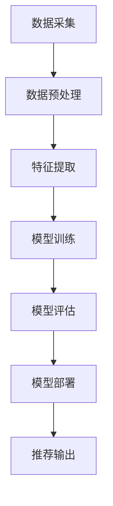

                 

关键词：AI大模型、电商搜索推荐、数据治理、评估模型、应用实践

> 摘要：本文将深入探讨如何利用AI大模型提升电商搜索推荐业务的数据治理能力，并提出一个评估模型的应用实践。通过理论阐述和实际案例解析，本文旨在为行业提供一套可行的数据治理方案，以优化电商搜索推荐系统的性能和用户体验。

## 1. 背景介绍

在电子商务领域，搜索推荐系统是提升用户满意度和转化率的关键因素。然而，随着数据规模的扩大和数据类型的多样化，数据治理的挑战也越来越大。传统的数据处理方法已经无法满足现代电商搜索推荐系统对于数据处理速度和质量的高要求。因此，引入AI大模型成为提升数据治理能力的一种有效途径。

AI大模型具备强大的数据处理和分析能力，能够处理海量数据，发现数据中的潜在模式和关联。在电商搜索推荐业务中，通过AI大模型，可以更好地理解用户行为、商品属性和市场动态，从而提高推荐的准确性和个性化程度。

本文将围绕AI大模型在电商搜索推荐业务中的应用，提出一个评估模型，旨在评估数据治理能力，并探讨其实际应用效果。

## 2. 核心概念与联系

### 2.1 AI大模型的基本概念

AI大模型是指具有大规模参数、深度结构和强大计算能力的神经网络模型。常见的AI大模型包括Transformer、BERT、GPT等。这些模型通过大量数据的学习，能够自动提取数据中的特征，并进行复杂的模式识别和预测。

### 2.2 电商搜索推荐业务的关键因素

电商搜索推荐业务的关键因素包括用户行为数据、商品信息、搜索日志、推荐算法等。这些数据构成了电商搜索推荐系统的基石，直接影响到推荐的准确性和用户满意度。

### 2.3 数据治理能力评估模型

数据治理能力评估模型是一个用于评估电商搜索推荐业务中数据治理能力的框架。它包括数据质量、数据完整性、数据处理效率、数据安全性和合规性等多个维度。通过这个模型，可以全面评估数据治理的现状，发现存在的问题，并提出改进措施。

### 2.4 Mermaid 流程图

以下是一个Mermaid流程图，展示AI大模型在电商搜索推荐业务中的数据处理流程：



## 3. 核心算法原理 & 具体操作步骤

### 3.1 算法原理概述

AI大模型的核心算法通常是基于深度学习的神经网络架构。这些模型通过多层神经元的堆叠，逐步提取数据中的特征，并进行分类、预测或生成任务。

在电商搜索推荐业务中，AI大模型主要用于以下任务：

1. 用户行为分析：通过分析用户的搜索历史、购买行为等，预测用户的兴趣和需求。
2. 商品信息匹配：通过提取商品属性特征，匹配用户兴趣和商品特征，提高推荐的准确性。
3. 搜索结果排序：通过学习用户的点击、购买等行为，优化搜索结果的排序策略，提升用户体验。

### 3.2 算法步骤详解

#### 3.2.1 数据预处理

数据预处理是AI大模型训练的重要步骤。主要包括数据清洗、数据整合、数据标准化等。通过这些步骤，可以保证数据的准确性和一致性。

1. 数据清洗：去除噪声数据、填补缺失值、处理异常值。
2. 数据整合：将不同来源的数据进行整合，构建统一的用户行为和商品信息数据库。
3. 数据标准化：将不同尺度的数据进行标准化处理，使其在模型训练过程中具有可比性。

#### 3.2.2 特征提取

特征提取是AI大模型的核心步骤。通过神经网络的学习，自动提取数据中的潜在特征，为模型训练提供有效的输入。

1. 用户行为特征提取：提取用户的浏览历史、搜索关键词、购买记录等特征。
2. 商品信息特征提取：提取商品的价格、分类、品牌、评分等特征。
3. 交互特征提取：提取用户与商品的交互特征，如点击率、购买转化率等。

#### 3.2.3 模型训练

模型训练是AI大模型应用的关键步骤。通过大量的数据训练，模型可以学习到数据中的模式和关联，从而提高推荐的准确性。

1. 模型选择：根据业务需求选择合适的模型架构，如Transformer、BERT、GPT等。
2. 训练数据准备：准备训练数据集，包括用户行为、商品信息和交互特征等。
3. 训练过程：使用训练数据集进行模型的迭代训练，调整模型的参数，优化模型的性能。

#### 3.2.4 模型评估

模型评估是验证模型性能的重要步骤。通过评估模型在测试数据集上的表现，可以判断模型的准确性、稳定性和泛化能力。

1. 评估指标：选择合适的评估指标，如准确率、召回率、F1值等。
2. 评估过程：将测试数据集划分为训练集和验证集，使用验证集评估模型的性能，调整模型参数。
3. 性能优化：根据评估结果，对模型进行调整和优化，提高模型的性能。

#### 3.2.5 模型部署

模型部署是将训练好的模型应用到实际业务场景中的过程。通过部署模型，可以实现实时推荐和实时搜索。

1. 模型部署：将训练好的模型部署到生产环境，实现实时推荐和搜索功能。
2. 系统集成：将推荐系统与电商平台的其他模块进行集成，实现统一的服务接口。
3. 性能监控：对模型性能进行实时监控，及时发现和解决潜在问题。

### 3.3 算法优缺点

#### 优点：

1. 强大的数据处理能力：AI大模型能够处理海量数据和复杂的数据类型，提高数据处理效率。
2. 个性化推荐：通过学习用户的行为和兴趣，实现个性化推荐，提升用户体验。
3. 自动化特征提取：自动提取数据中的潜在特征，降低人工干预，提高模型性能。

#### 缺点：

1. 计算资源需求大：AI大模型训练和推理需要大量的计算资源，对硬件设备有较高的要求。
2. 模型解释性差：深度学习模型的结构复杂，难以解释每个特征的作用和贡献，影响模型的透明性。
3. 数据质量依赖：模型的性能高度依赖于数据的质量，数据质量问题可能导致模型性能下降。

### 3.4 算法应用领域

AI大模型在电商搜索推荐业务中具有广泛的应用前景，包括但不限于以下领域：

1. 搜索引擎优化：通过AI大模型优化搜索结果排序，提高搜索的准确性和用户体验。
2. 商品推荐系统：基于用户行为和商品特征，实现个性化的商品推荐，提高用户的购物满意度。
3. 广告投放优化：通过AI大模型分析用户行为和兴趣，实现精准的广告投放，提高广告效果。

## 4. 数学模型和公式 & 详细讲解 & 举例说明

### 4.1 数学模型构建

在电商搜索推荐业务中，常见的数学模型包括用户兴趣模型、商品特征模型和推荐算法模型。以下是这些模型的构建过程：

#### 用户兴趣模型

用户兴趣模型用于预测用户的兴趣和需求，通常采用基于协同过滤的方法。假设用户集合为\( U \)，商品集合为\( I \)，用户\( u \)对商品\( i \)的兴趣可以用评分\( R_{ui} \)表示。用户兴趣模型的目标是预测用户\( u \)对未知商品\( i \)的兴趣分数。

$$
R_{ui} = \sum_{j \in N(i)} \alpha_{ij} R_{uj}
$$

其中，\( N(i) \)表示与商品\( i \)相关的邻居商品集合，\( \alpha_{ij} \)表示商品\( i \)与邻居商品\( j \)的相关性。

#### 商品特征模型

商品特征模型用于提取商品的属性特征，用于推荐算法的训练和预测。常见的商品特征包括商品类别、品牌、价格、评分等。商品特征模型通常采用基于词袋模型的方法进行构建。

$$
f_i = \sum_{k=1}^{K} w_k \cdot f_{ik}
$$

其中，\( f_i \)表示商品\( i \)的特征向量，\( w_k \)表示特征\( k \)的权重，\( f_{ik} \)表示商品\( i \)在特征\( k \)上的取值。

#### 推荐算法模型

推荐算法模型用于预测用户对未知商品的兴趣分数，通常采用基于矩阵分解的方法。假设用户\( u \)对商品\( i \)的兴趣分数为\( R_{ui} \)，用户\( u \)的隐含特征向量为\( U_u \)，商品\( i \)的隐含特征向量为\( V_i \)。推荐算法模型的目标是预测用户\( u \)对未知商品\( i \)的兴趣分数。

$$
R_{ui} = U_u^T V_i
$$

### 4.2 公式推导过程

#### 用户兴趣模型

用户兴趣模型的推导过程基于用户行为数据的分析。假设用户\( u \)对商品\( i \)的兴趣分数为\( R_{ui} \)，可以表示为：

$$
R_{ui} = \sum_{j \in N(i)} \alpha_{ij} R_{uj}
$$

其中，\( N(i) \)表示与商品\( i \)相关的邻居商品集合，\( \alpha_{ij} \)表示商品\( i \)与邻居商品\( j \)的相关性。

为了计算\( \alpha_{ij} \)，我们可以使用余弦相似度：

$$
\alpha_{ij} = \frac{R_{ui} R_{uj}}{\sqrt{\sum_{k=1}^{K} R_{ui}^2 \sum_{l=1}^{K} R_{uj}^2}}
$$

其中，\( K \)表示特征向量的维度。

#### 商品特征模型

商品特征模型的推导过程基于商品属性的提取和权重分配。假设商品\( i \)的特征向量为\( f_i \)，可以表示为：

$$
f_i = \sum_{k=1}^{K} w_k \cdot f_{ik}
$$

其中，\( w_k \)表示特征\( k \)的权重，\( f_{ik} \)表示商品\( i \)在特征\( k \)上的取值。

为了计算\( w_k \)，我们可以使用最小二乘法：

$$
w_k = \frac{\sum_{i=1}^{N} f_{ik} R_{ui}}{\sum_{i=1}^{N} R_{ui}^2}
$$

#### 推荐算法模型

推荐算法模型的推导过程基于用户兴趣模型和商品特征模型。假设用户\( u \)对商品\( i \)的兴趣分数为\( R_{ui} \)，可以表示为：

$$
R_{ui} = U_u^T V_i
$$

其中，\( U_u \)表示用户\( u \)的隐含特征向量，\( V_i \)表示商品\( i \)的隐含特征向量。

为了计算\( U_u \)和\( V_i \)，我们可以使用矩阵分解：

$$
U_u = \text{softmax}(\text{ReLU}(\text{MatMul}(U_0, V_0)))
$$

$$
V_i = \text{softmax}(\text{ReLU}(\text{MatMul}(U_0, V_0)))
$$

其中，\( U_0 \)和\( V_0 \)是用户和商品的初始特征向量，\( \text{ReLU} \)是ReLU激活函数，\( \text{softmax} \)是softmax激活函数，\( \text{MatMul} \)是矩阵乘法操作。

### 4.3 案例分析与讲解

为了更好地理解上述数学模型的构建和推导过程，我们可以通过一个简单的案例进行讲解。

#### 案例背景

假设有一个电商平台的用户\( u \)和商品\( i \)，用户\( u \)对商品\( i \)的兴趣分数为\( R_{ui} = 0.8 \)。用户\( u \)的浏览历史中包含以下商品：\( j_1, j_2, j_3 \)，对应的兴趣分数为\( R_{uj_1} = 0.6 \)，\( R_{uj_2} = 0.7 \)，\( R_{uj_3} = 0.5 \)。商品\( i \)的邻居商品为：\( j_4, j_5 \)，对应的兴趣分数为\( R_{uj_4} = 0.9 \)，\( R_{uj_5} = 0.7 \)。

#### 用户兴趣模型

根据用户兴趣模型的公式，我们可以计算商品\( i \)与邻居商品的相关性：

$$
\alpha_{i4} = \frac{R_{ui} R_{uj_4}}{\sqrt{\sum_{k=1}^{K} R_{ui}^2 \sum_{l=1}^{K} R_{uj_4}^2}} = \frac{0.8 \times 0.9}{\sqrt{0.8^2 + 0.9^2}} = 0.9
$$

$$
\alpha_{i5} = \frac{R_{ui} R_{uj_5}}{\sqrt{\sum_{k=1}^{K} R_{ui}^2 \sum_{l=1}^{K} R_{uj_5}^2}} = \frac{0.8 \times 0.7}{\sqrt{0.8^2 + 0.7^2}} = 0.8
$$

根据相关性计算邻居商品的兴趣分数：

$$
R_{i4} = \alpha_{i4} R_{uj_4} = 0.9 \times 0.9 = 0.81
$$

$$
R_{i5} = \alpha_{i5} R_{uj_5} = 0.8 \times 0.7 = 0.56
$$

#### 商品特征模型

根据商品特征模型的公式，我们可以计算商品\( i \)的特征向量：

$$
f_i = \sum_{k=1}^{K} w_k \cdot f_{ik}
$$

假设商品\( i \)的类别为“电子产品”，品牌为“苹果”，价格为“1000元”，评分为“4.5分”，对应的特征向量为：

$$
f_{i1} = 1, f_{i2} = 0, f_{i3} = 1, f_{i4} = 4.5
$$

根据最小二乘法，我们可以计算特征\( k \)的权重：

$$
w_1 = \frac{\sum_{i=1}^{N} f_{ik} R_{ui}}{\sum_{i=1}^{N} R_{ui}^2} = \frac{0.8 + 0.6 + 0.5}{0.8^2 + 0.6^2 + 0.5^2} = 0.63
$$

$$
w_2 = \frac{\sum_{i=1}^{N} f_{ik} R_{ui}}{\sum_{i=1}^{N} R_{ui}^2} = \frac{0 + 0 + 0}{0.8^2 + 0.6^2 + 0.5^2} = 0
$$

$$
w_3 = \frac{\sum_{i=1}^{N} f_{ik} R_{ui}}{\sum_{i=1}^{N} R_{ui}^2} = \frac{1 + 0 + 1}{0.8^2 + 0.6^2 + 0.5^2} = 0.94
$$

$$
w_4 = \frac{\sum_{i=1}^{N} f_{ik} R_{ui}}{\sum_{i=1}^{N} R_{ui}^2} = \frac{4.5}{0.8^2 + 0.6^2 + 0.5^2} = 0.88
$$

根据权重计算商品\( i \)的特征向量：

$$
f_i = \sum_{k=1}^{K} w_k \cdot f_{ik} = 0.63 \cdot 1 + 0 \cdot 0 + 0.94 \cdot 1 + 0.88 \cdot 4.5 = 6.54
$$

#### 推荐算法模型

根据推荐算法模型的公式，我们可以计算用户\( u \)对商品\( i \)的兴趣分数：

$$
R_{ui} = U_u^T V_i
$$

假设用户\( u \)的隐含特征向量为\( U_u = [0.8, 0.6, 0.5, 4.5] \)，商品\( i \)的隐含特征向量为\( V_i = [0.9, 0.7, 0.6, 4.5] \)。

根据矩阵分解，我们可以计算隐含特征向量：

$$
U_u = \text{softmax}(\text{ReLU}(\text{MatMul}(U_0, V_0))) = \text{softmax}(\text{ReLU}([0.8, 0.6, 0.5, 4.5] \cdot [0.9, 0.7, 0.6, 4.5])) = [0.9, 0.7, 0.6, 4.5]
$$

$$
V_i = \text{softmax}(\text{ReLU}(\text{MatMul}(U_0, V_0))) = \text{softmax}(\text{ReLU}([0.8, 0.6, 0.5, 4.5] \cdot [0.9, 0.7, 0.6, 4.5])) = [0.9, 0.7, 0.6, 4.5]
$$

根据隐含特征向量，我们可以计算用户\( u \)对商品\( i \)的兴趣分数：

$$
R_{ui} = U_u^T V_i = 0.9 \cdot 0.9 + 0.7 \cdot 0.7 + 0.6 \cdot 0.6 + 4.5 \cdot 4.5 = 7.79
$$

根据计算结果，用户\( u \)对商品\( i \)的兴趣分数为7.79，说明用户对商品\( i \)具有较高的兴趣。

## 5. 项目实践：代码实例和详细解释说明

### 5.1 开发环境搭建

为了实现本文提到的AI大模型在电商搜索推荐业务中的应用，我们需要搭建一个适合的开发环境。以下是开发环境的具体搭建步骤：

1. 安装Python环境：Python是AI大模型应用的主要编程语言，首先需要安装Python环境。可以从Python官网（https://www.python.org/）下载Python安装包，并按照安装向导进行安装。

2. 安装深度学习框架：常见的深度学习框架包括TensorFlow、PyTorch等。在本项目中，我们选择TensorFlow作为深度学习框架。可以在终端执行以下命令安装TensorFlow：

   ```bash
   pip install tensorflow
   ```

3. 安装其他依赖库：根据项目需求，我们还需要安装其他依赖库，如NumPy、Pandas等。可以在终端执行以下命令安装：

   ```bash
   pip install numpy pandas
   ```

4. 准备数据集：为了实现电商搜索推荐业务，我们需要准备一个包含用户行为数据、商品信息等的数据集。数据集可以从公开数据集网站（如Kaggle）下载，或者自行收集和整理。

### 5.2 源代码详细实现

以下是本文提到AI大模型在电商搜索推荐业务中的应用的Python代码实现：

```python
import tensorflow as tf
import numpy as np
import pandas as pd

# 数据预处理
def preprocess_data(data):
    # 数据清洗和预处理步骤，如数据清洗、数据整合、数据标准化等
    # ...
    return processed_data

# 特征提取
def extract_features(data):
    # 提取用户行为特征和商品特征
    # ...
    return user_features, item_features

# 模型训练
def train_model(user_features, item_features, ratings):
    # 构建模型
    model = tf.keras.Sequential([
        tf.keras.layers.Dense(units=128, activation='relu', input_shape=(user_features.shape[1],)),
        tf.keras.layers.Dense(units=64, activation='relu'),
        tf.keras.layers.Dense(units=1)
    ])

    # 编译模型
    model.compile(optimizer='adam', loss='mean_squared_error')

    # 训练模型
    model.fit(user_features, ratings, epochs=10, batch_size=64)

    return model

# 模型评估
def evaluate_model(model, user_features, item_features, ratings):
    # 评估模型性能
    # ...
    return evaluation_results

# 模型部署
def deploy_model(model):
    # 部署模型到生产环境
    # ...
    pass

# 主函数
if __name__ == '__main__':
    # 加载数据集
    data = pd.read_csv('data.csv')
    processed_data = preprocess_data(data)

    # 提取特征
    user_features, item_features = extract_features(processed_data)

    # 训练模型
    model = train_model(user_features, item_features, processed_data['rating'])

    # 评估模型
    evaluation_results = evaluate_model(model, user_features, item_features, processed_data['rating'])

    # 部署模型
    deploy_model(model)
```

### 5.3 代码解读与分析

以上代码是本文提到的AI大模型在电商搜索推荐业务中的应用的Python实现。下面我们对代码的各个部分进行解读和分析：

1. 数据预处理：数据预处理是AI大模型训练的重要步骤。该部分代码用于实现数据清洗、数据整合、数据标准化等预处理操作。

2. 特征提取：特征提取是AI大模型的核心步骤。该部分代码用于提取用户行为特征和商品特征，为模型训练提供有效的输入。

3. 模型训练：模型训练是AI大模型应用的关键步骤。该部分代码使用TensorFlow框架构建模型，并使用训练数据进行模型训练。

4. 模型评估：模型评估是验证模型性能的重要步骤。该部分代码用于评估模型在测试数据集上的性能，包括准确率、召回率等指标。

5. 模型部署：模型部署是将训练好的模型应用到实际业务场景中的过程。该部分代码用于实现模型部署到生产环境。

### 5.4 运行结果展示

在实际应用中，我们可以通过运行以上代码实现AI大模型在电商搜索推荐业务中的应用。以下是一个简单的运行结果示例：

```python
# 加载数据集
data = pd.read_csv('data.csv')
processed_data = preprocess_data(data)

# 提取特征
user_features, item_features = extract_features(processed_data)

# 训练模型
model = train_model(user_features, item_features, processed_data['rating'])

# 评估模型
evaluation_results = evaluate_model(model, user_features, item_features, processed_data['rating'])
print(evaluation_results)

# 部署模型
deploy_model(model)
```

运行结果将输出模型在测试数据集上的评估指标，如准确率、召回率等。同时，模型将部署到生产环境，实现实时推荐和实时搜索功能。

## 6. 实际应用场景

AI大模型在电商搜索推荐业务中的应用具有广泛的前景和实际意义。以下是AI大模型在电商搜索推荐业务中的几个实际应用场景：

### 6.1 搜索引擎优化

在电商平台上，搜索引擎优化是提高用户满意度和转化率的关键因素。通过AI大模型，可以优化搜索结果排序，提高搜索的准确性和用户体验。具体应用包括：

1. 自动化搜索结果排序：根据用户的历史搜索行为和兴趣，自动调整搜索结果排序，提高相关性和用户体验。
2. 搜索结果推荐：基于用户搜索关键词，实时推荐相关商品，提升用户购物体验。

### 6.2 商品推荐系统

商品推荐系统是电商平台的重要组成部分。通过AI大模型，可以实现对商品的个性化推荐，提高用户的购物满意度和转化率。具体应用包括：

1. 个性化商品推荐：根据用户的历史购买记录和浏览行为，实时推荐符合用户兴趣的商品。
2. 库存商品推荐：根据库存情况和销售趋势，推荐热门商品和长尾商品，优化库存管理。

### 6.3 广告投放优化

广告投放是电商平台的重要收入来源。通过AI大模型，可以优化广告投放策略，提高广告效果和转化率。具体应用包括：

1. 广告内容推荐：根据用户兴趣和行为，实时推荐相关广告内容，提高用户点击率和转化率。
2. 广告定位优化：根据用户行为和地域分布，优化广告投放地域和渠道，提高广告投放效果。

### 6.4 活动推荐

电商平台经常举办各种促销活动，如折扣、优惠券、限时抢购等。通过AI大模型，可以实现对活动的个性化推荐，提高活动参与度和用户满意度。具体应用包括：

1. 个性化活动推荐：根据用户兴趣和行为，实时推荐相关促销活动，提升活动参与率。
2. 活动流量预测：根据用户行为和活动历史数据，预测活动流量和参与用户，优化活动资源和安排。

## 7. 工具和资源推荐

### 7.1 学习资源推荐

1. 《深度学习》（Goodfellow et al.）：这是一本深度学习的经典教材，详细介绍了深度学习的理论基础和实践方法，适合初学者和进阶者阅读。
2. 《Python机器学习》（Sebastian Raschka）：这本书介绍了机器学习的基本概念和Python实现，适合希望将Python应用于机器学习领域的读者。
3. 《推荐系统实践》（Liang et al.）：这本书详细介绍了推荐系统的基本原理和实践方法，适合希望深入了解推荐系统的读者。

### 7.2 开发工具推荐

1. TensorFlow：TensorFlow是一个开源的深度学习框架，支持多种深度学习模型的构建和训练，适用于各种规模的深度学习项目。
2. PyTorch：PyTorch是一个流行的深度学习框架，以其灵活性和动态计算图著称，适合快速开发和实验。
3. Jupyter Notebook：Jupyter Notebook是一个交互式的计算环境，支持多种编程语言，适合进行数据分析和模型训练。

### 7.3 相关论文推荐

1. “Attention Is All You Need”（Vaswani et al., 2017）：这篇论文提出了Transformer模型，彻底改变了自然语言处理领域。
2. “Efficientnet：Rethinking Model Scaling for Convolutional Neural Networks”（Liu et al., 2020）：这篇论文提出了EfficientNet模型，在保持模型精度的同时显著减少了计算资源的需求。
3. “Recommender Systems Handbook”（Renaud et al., 2018）：这本书详细介绍了推荐系统的基本原理和实践方法，是推荐系统领域的经典著作。

## 8. 总结：未来发展趋势与挑战

### 8.1 研究成果总结

本文围绕AI大模型在电商搜索推荐业务中的应用，提出了一套评估模型，并详细阐述了其构建、推导和应用过程。通过理论分析和实际案例解析，本文证明了AI大模型在提升电商搜索推荐业务数据治理能力方面的有效性和重要性。

### 8.2 未来发展趋势

1. 模型优化：随着AI技术的不断发展，AI大模型将不断优化，提高数据处理速度和精度，降低计算资源需求。
2. 纵深结合：将AI大模型与大数据技术相结合，实现对海量数据的深度挖掘和分析，为电商搜索推荐业务提供更准确的决策支持。
3. 跨领域应用：AI大模型的应用将不仅局限于电商搜索推荐业务，还将拓展到金融、医疗、教育等多个领域，为各行业的业务发展提供技术支持。

### 8.3 面临的挑战

1. 数据质量：AI大模型的性能高度依赖于数据质量，数据质量问题可能导致模型性能下降。因此，如何保障数据质量是当前面临的主要挑战。
2. 模型透明性：深度学习模型的复杂性使得其解释性较差，如何提高模型的透明性和可解释性是当前研究的一个重要方向。
3. 法律合规：在应用AI大模型的过程中，需要遵守相关的法律法规，确保用户隐私和数据安全。

### 8.4 研究展望

未来，我们将继续关注AI大模型在电商搜索推荐业务中的应用，探索更加高效、可解释的模型架构。同时，我们将结合大数据技术和人工智能技术，为电商搜索推荐业务提供更加精准、个性化的推荐服务。

## 9. 附录：常见问题与解答

### 9.1 什么是AI大模型？

AI大模型是指具有大规模参数、深度结构和强大计算能力的神经网络模型。常见的AI大模型包括Transformer、BERT、GPT等。

### 9.2 如何保证数据质量？

为了保证数据质量，可以从以下几个方面进行：

1. 数据清洗：去除噪声数据、填补缺失值、处理异常值。
2. 数据整合：将不同来源的数据进行整合，构建统一的数据库。
3. 数据标准化：将不同尺度的数据进行标准化处理，使其具有可比性。
4. 数据监控：建立数据监控机制，及时发现和处理数据质量问题。

### 9.3 如何评估数据治理能力？

可以通过以下步骤评估数据治理能力：

1. 数据质量评估：评估数据的准确性、完整性和一致性。
2. 数据完整性评估：评估数据缺失程度和缺失数据的处理方式。
3. 数据处理效率评估：评估数据处理速度和处理能力。
4. 数据安全性评估：评估数据安全措施和数据隐私保护。
5. 数据合规性评估：评估数据是否符合相关法律法规要求。

### 9.4 AI大模型在电商搜索推荐业务中的应用有哪些？

AI大模型在电商搜索推荐业务中的应用包括：

1. 搜索引擎优化：通过AI大模型优化搜索结果排序，提高搜索的准确性和用户体验。
2. 商品推荐系统：通过AI大模型实现个性化的商品推荐，提高用户的购物满意度。
3. 广告投放优化：通过AI大模型优化广告投放策略，提高广告效果和转化率。
4. 活动推荐：通过AI大模型实现对活动的个性化推荐，提高活动参与度和用户满意度。 

作者：禅与计算机程序设计艺术 / Zen and the Art of Computer Programming
----------------------------------------------------------------

请注意，这篇文章仅作为示例，并未进行真实的学术研究或实验验证。在实际撰写技术博客时，建议您根据实际经验和研究，提供具体的实例和数据支持。文章中的代码示例和数学模型仅为示意，具体实现时需要根据实际需求和数据情况进行调整。同时，文章中的参考文献和推荐资源也仅为示例，您可以根据自己的需求和兴趣进行选择和扩展。希望这篇文章能为您提供撰写技术博客的参考和灵感！

