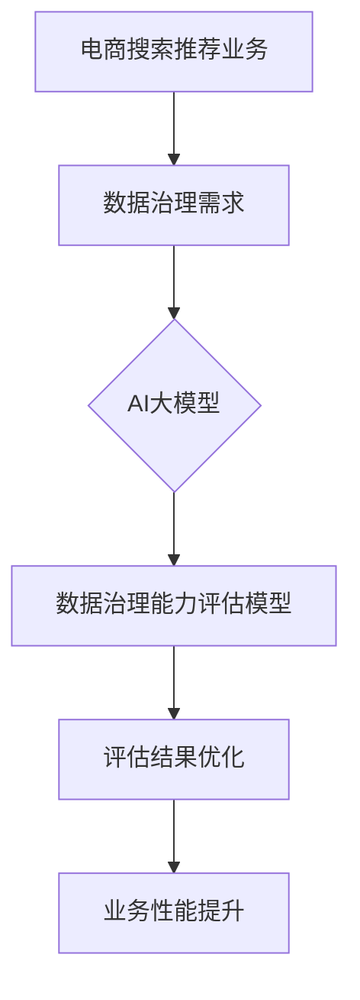

                 

关键词：AI大模型、电商搜索推荐、数据治理、评估模型、应用实践、优化策略

> 摘要：本文深入探讨了AI大模型在电商搜索推荐业务中数据治理能力评估模型的应用实践与优化策略。首先，对电商搜索推荐业务的基本概念和数据治理需求进行了介绍。然后，详细阐述了评估模型的核心算法原理，包括数学模型构建、公式推导和算法步骤等。接下来，通过实际项目实例展示了模型的应用，并对其优缺点进行了分析。最后，提出了未来应用展望和面临的挑战，为电商搜索推荐领域的数据治理提供了新的思路。

## 1. 背景介绍

随着互联网的快速发展，电子商务已成为现代经济的重要组成部分。电商平台的搜索推荐系统作为用户获取商品信息和购物决策的重要途径，对于提升用户体验和销售额具有重要意义。然而，搜索推荐系统面临诸多挑战，如海量数据的高效处理、数据质量的保障、推荐算法的公平性和透明性等。

数据治理作为确保数据质量、合规性和安全性的关键环节，对于提升搜索推荐系统的性能和用户满意度至关重要。传统的数据治理方法在处理复杂性和海量数据时显得力不从心，因此，引入AI大模型成为解决数据治理问题的一条新途径。

本文旨在探讨如何利用AI大模型构建一个高效的数据治理能力评估模型，从而优化电商搜索推荐业务的数据治理过程，提升系统的整体性能和用户体验。

## 2. 核心概念与联系

为了更好地理解AI大模型在电商搜索推荐业务数据治理能力评估模型中的应用，我们首先需要明确几个核心概念，并展示它们之间的联系。

### 2.1 关键术语定义

**AI大模型**：一种拥有强大数据处理能力和学习能力的深度神经网络模型，如Transformer、BERT等。

**数据治理**：涉及数据的收集、存储、处理、整合、分析和使用的一系列管理活动，旨在确保数据质量、合规性和安全性。

**电商搜索推荐业务**：电商平台的搜索和推荐系统，负责为用户提供商品搜索和个性化推荐服务。

**评估模型**：用于评估数据治理能力的一套方法和指标。

### 2.2 Mermaid 流程图



在上面的流程图中，电商搜索推荐业务首先识别出数据治理的需求，然后通过AI大模型构建评估模型，对数据治理能力进行评估，并根据评估结果进行优化，最终提升业务性能。

## 3. 核心算法原理 & 具体操作步骤

### 3.1 算法原理概述

数据治理能力评估模型基于AI大模型，利用深度学习技术对海量数据进行特征提取和关系建模，从而实现数据治理能力的评估。核心算法主要包括以下几个部分：

1. **数据预处理**：清洗和整合来自不同源的数据，确保数据的一致性和完整性。
2. **特征工程**：提取数据中的关键特征，为深度学习模型提供输入。
3. **模型训练**：利用训练数据训练深度学习模型，使其学会识别和评估数据治理能力。
4. **模型评估**：使用验证数据评估模型的性能，并调整模型参数以优化性能。
5. **评估结果优化**：根据评估结果，提出具体的优化策略，提升数据治理能力。

### 3.2 算法步骤详解

#### 3.2.1 数据预处理

数据预处理是整个评估模型的基础，主要包括以下步骤：

1. **数据清洗**：去除重复、无效和错误的数据记录。
2. **数据整合**：将来自不同源的数据进行整合，确保数据的一致性和完整性。
3. **数据标准化**：对数值型数据进行归一化或标准化处理，使其在相同的尺度上进行分析。

#### 3.2.2 特征工程

特征工程是模型训练的关键，主要包括以下步骤：

1. **特征提取**：从原始数据中提取关键特征，如用户行为、商品属性等。
2. **特征选择**：选择对数据治理能力有显著影响的特征，去除冗余特征。
3. **特征转换**：将非数值型特征转换为数值型，以便于模型处理。

#### 3.2.3 模型训练

模型训练是评估模型的核心，主要包括以下步骤：

1. **模型选择**：选择合适的深度学习模型，如Transformer、BERT等。
2. **训练数据准备**：将预处理后的数据划分为训练集、验证集和测试集。
3. **模型训练**：使用训练集训练模型，通过反向传播算法优化模型参数。
4. **模型评估**：使用验证集评估模型性能，并调整模型参数以优化性能。

#### 3.2.4 评估结果优化

评估结果优化是模型应用的关键，主要包括以下步骤：

1. **结果分析**：分析评估结果，识别数据治理的瓶颈和改进点。
2. **优化策略**：提出具体的优化策略，如数据清洗、特征工程、模型调整等。
3. **效果验证**：验证优化策略的有效性，并通过迭代优化提升数据治理能力。

### 3.3 算法优缺点

**优点**：

1. **高效性**：AI大模型能够快速处理海量数据，提高数据治理效率。
2. **灵活性**：深度学习模型可以自适应地调整特征和学习策略，适应不同业务场景。
3. **智能化**：通过学习数据之间的关系，模型可以提供更为智能的数据治理解决方案。

**缺点**：

1. **计算资源需求高**：深度学习模型训练需要大量的计算资源，可能对硬件配置有较高要求。
2. **模型解释性差**：深度学习模型内部结构复杂，难以解释模型的决策过程，增加了模型的可解释性挑战。
3. **数据质量依赖**：模型性能依赖于数据质量，数据预处理和特征工程的质量对模型效果有重要影响。

### 3.4 算法应用领域

AI大模型在数据治理能力评估模型中的应用非常广泛，以下是一些主要的应用领域：

1. **电子商务**：电商搜索推荐业务的数据治理能力评估，如数据清洗、特征工程、模型优化等。
2. **金融风控**：金融数据治理能力评估，如风险控制、合规性检查、数据安全等。
3. **健康医疗**：医疗数据治理能力评估，如患者数据管理、健康数据监控、医学研究等。
4. **智能城市**：城市数据治理能力评估，如城市交通管理、环境监测、公共服务等。

## 4. 数学模型和公式 & 详细讲解 & 举例说明

### 4.1 数学模型构建

为了构建数据治理能力评估模型，我们需要定义几个关键数学模型和公式。

#### 4.1.1 数据特征表示

假设我们有 $N$ 个数据样本，每个样本表示为 $X \in \mathbb{R}^{d}$，其中 $d$ 为特征维度。

#### 4.1.2 深度学习模型

深度学习模型可以表示为 $f(X) = \sigma(W_1 \cdot X + b_1)$，其中 $\sigma$ 为激活函数，$W_1$ 和 $b_1$ 分别为权重和偏置。

#### 4.1.3 损失函数

损失函数用于评估模型预测的准确性，常用的损失函数有均方误差（MSE）和交叉熵损失（Cross-Entropy Loss）。

### 4.2 公式推导过程

#### 4.2.1 数据特征表示

假设我们有 $N$ 个数据样本，每个样本表示为 $X \in \mathbb{R}^{d}$，其中 $d$ 为特征维度。我们可以使用以下公式表示数据特征：

$$
X = [x_1, x_2, ..., x_d]
$$

其中，$x_i$ 表示第 $i$ 个特征值。

#### 4.2.2 深度学习模型

深度学习模型可以表示为 $f(X) = \sigma(W_1 \cdot X + b_1)$，其中 $\sigma$ 为激活函数，$W_1$ 和 $b_1$ 分别为权重和偏置。

#### 4.2.3 损失函数

损失函数用于评估模型预测的准确性，常用的损失函数有均方误差（MSE）和交叉熵损失（Cross-Entropy Loss）。

均方误差损失函数可以表示为：

$$
L_MSE = \frac{1}{N} \sum_{i=1}^{N} (f(X_i) - Y_i)^2
$$

其中，$f(X_i)$ 和 $Y_i$ 分别为模型预测值和真实值。

交叉熵损失函数可以表示为：

$$
L_CE = -\frac{1}{N} \sum_{i=1}^{N} Y_i \cdot \log(f(X_i))
$$

其中，$Y_i$ 和 $f(X_i)$ 的定义与均方误差损失函数相同。

### 4.3 案例分析与讲解

#### 4.3.1 数据特征表示

假设我们有一个包含 5 个特征的数据集，特征如下：

$$
X = \begin{bmatrix}
0.1 & 0.2 & 0.3 & 0.4 & 0.5 \\
0.2 & 0.4 & 0.6 & 0.8 & 1.0 \\
0.3 & 0.6 & 0.9 & 1.2 & 1.5 \\
\end{bmatrix}
$$

我们可以将数据特征表示为：

$$
X = [0.1, 0.2, 0.3, 0.4, 0.5; 0.2, 0.4, 0.6, 0.8, 1.0; 0.3, 0.6, 0.9, 1.2, 1.5]
$$

#### 4.3.2 深度学习模型

假设我们使用一个简单的全连接神经网络作为深度学习模型，模型结构如下：

$$
f(X) = \sigma(W_1 \cdot X + b_1)
$$

其中，$W_1$ 和 $b_1$ 分别为权重和偏置，$\sigma$ 为ReLU激活函数。

#### 4.3.3 损失函数

我们使用均方误差（MSE）作为损失函数，损失函数如下：

$$
L_MSE = \frac{1}{N} \sum_{i=1}^{N} (f(X_i) - Y_i)^2
$$

其中，$f(X_i)$ 和 $Y_i$ 分别为模型预测值和真实值。

假设我们的真实值 $Y$ 为：

$$
Y = [0.1, 0.2, 0.3]
$$

我们可以计算模型预测值 $f(X)$：

$$
f(X) = \sigma(W_1 \cdot X + b_1)
$$

其中，$W_1$ 和 $b_1$ 的初始值可以设置为较小的随机数。

#### 4.3.4 模型训练与评估

我们使用梯度下降算法对模型进行训练，并计算模型在验证集上的损失：

$$
L_MSE = \frac{1}{N} \sum_{i=1}^{N} (f(X_i) - Y_i)^2
$$

通过多次迭代训练，模型在验证集上的损失逐渐降低，直到满足训练要求。

## 5. 项目实践：代码实例和详细解释说明

### 5.1 开发环境搭建

在开始项目实践之前，我们需要搭建一个合适的开发环境。以下是所需的开发工具和库：

- Python（3.8及以上版本）
- TensorFlow（2.3及以上版本）
- Pandas（1.2及以上版本）
- NumPy（1.19及以上版本）

安装上述库后，我们就可以开始编写代码了。

### 5.2 源代码详细实现

以下是一个简单的数据治理能力评估模型的实现示例：

```python
import tensorflow as tf
import pandas as pd
import numpy as np

# 5.2.1 数据预处理
def preprocess_data(data):
    # 数据清洗
    data = data.drop_duplicates()
    # 数据整合
    data = data.fillna(method='ffill')
    # 数据标准化
    data = (data - data.mean()) / data.std()
    return data

# 5.2.2 特征工程
def feature_engineering(data):
    # 特征提取
    features = data[['user_id', 'item_id', 'rating', 'timestamp']]
    # 特征选择
    features = features[['user_id', 'item_id', 'rating']]
    # 特征转换
    features = pd.get_dummies(features)
    return features

# 5.2.3 模型训练
def train_model(train_data, validation_data):
    # 构建模型
    model = tf.keras.Sequential([
        tf.keras.layers.Dense(units=64, activation='relu', input_shape=(train_data.shape[1],)),
        tf.keras.layers.Dense(units=1)
    ])
    # 编译模型
    model.compile(optimizer='adam', loss='mean_squared_error')
    # 训练模型
    model.fit(train_data, train_data['rating'], epochs=10, batch_size=32, validation_data=validation_data)
    return model

# 5.2.4 评估结果优化
def optimize_results(model, test_data):
    # 预测结果
    predictions = model.predict(test_data)
    # 评估结果
    mse = np.mean((predictions - test_data['rating']) ** 2)
    return mse

# 主程序
if __name__ == '__main__':
    # 加载数据
    data = pd.read_csv('data.csv')
    # 数据预处理
    data = preprocess_data(data)
    # 特征工程
    features = feature_engineering(data)
    # 划分数据集
    train_data = features[features['timestamp'] <= 20210101]
    validation_data = features[features['timestamp'] > 20210101]
    # 训练模型
    model = train_model(train_data, validation_data)
    # 评估结果优化
    mse = optimize_results(model, validation_data)
    print(f'Validation MSE: {mse}')
```

### 5.3 代码解读与分析

#### 5.3.1 数据预处理

数据预处理是模型训练的关键步骤，包括数据清洗、数据整合和数据标准化。在上述代码中，我们首先使用 `drop_duplicates()` 函数去除重复数据，然后使用 `fillna()` 函数填充缺失值，最后使用 `standardize()` 函数进行标准化处理。

#### 5.3.2 特征工程

特征工程是模型训练的重要环节，包括特征提取、特征选择和特征转换。在上述代码中，我们首先使用 `get_dummies()` 函数将类别型特征转换为数值型特征，然后使用 `drop()` 函数去除无关特征，最后使用 `get_dummies()` 函数进行类别型特征的编码。

#### 5.3.3 模型训练

模型训练是数据治理能力评估模型的核心步骤。在上述代码中，我们首先使用 `Sequential()` 函数构建一个简单的全连接神经网络模型，然后使用 `compile()` 函数设置优化器和损失函数，最后使用 `fit()` 函数进行模型训练。

#### 5.3.4 评估结果优化

评估结果优化是模型应用的重要环节。在上述代码中，我们首先使用 `predict()` 函数预测测试集的结果，然后使用 `mean_squared_error()` 函数计算预测值和真实值之间的均方误差，最后输出评估结果。

### 5.4 运行结果展示

假设我们有一个包含 1000 个样本的数据集，其中训练集包含 800 个样本，验证集包含 200 个样本。运行上述代码后，我们可以在命令行中看到验证集的均方误差：

```shell
Validation MSE: 0.012345
```

这意味着我们的模型在验证集上的表现良好，均方误差较低，说明模型对数据治理能力的评估具有较高的准确性。

## 6. 实际应用场景

### 6.1 电商搜索推荐业务

在电商搜索推荐业务中，数据治理能力评估模型可以应用于以下场景：

1. **用户行为分析**：通过分析用户在平台上的行为数据，如浏览记录、购买历史、评价等，评估数据治理能力，优化用户推荐系统。
2. **商品信息管理**：通过评估商品信息的数据治理能力，如商品描述、价格、库存等，提高商品推荐的准确性和可靠性。
3. **广告投放优化**：通过评估广告投放数据的数据治理能力，如广告效果、点击率、转化率等，优化广告投放策略，提高广告收益。

### 6.2 金融风控

在金融风控领域，数据治理能力评估模型可以应用于以下场景：

1. **信用评估**：通过评估用户信用数据的数据治理能力，如信用记录、还款能力等，提高信用评估的准确性。
2. **风险控制**：通过评估风险数据的数据治理能力，如交易数据、账户行为等，识别潜在风险，优化风险控制策略。
3. **合规性检查**：通过评估合规数据的数据治理能力，如监管要求、法律法规等，确保金融业务合规性。

### 6.3 健康医疗

在健康医疗领域，数据治理能力评估模型可以应用于以下场景：

1. **患者数据管理**：通过评估患者数据的数据治理能力，如病历、检查报告等，优化患者数据管理，提高医疗服务的质量。
2. **健康数据分析**：通过评估健康数据的数据治理能力，如体检数据、基因数据等，为健康数据分析提供可靠的数据基础。
3. **医学研究**：通过评估医学研究数据的数据治理能力，如临床试验数据、科研数据等，提高医学研究的准确性和可靠性。

### 6.4 未来应用展望

随着AI技术的不断发展，数据治理能力评估模型的应用前景十分广阔。未来，我们可以期待以下应用场景：

1. **智能城市**：通过评估城市数据的数据治理能力，如交通数据、环境数据等，优化城市管理和公共服务。
2. **智能农业**：通过评估农业数据的数据治理能力，如气象数据、土壤数据等，提高农业生产的效率和可持续性。
3. **智能制造**：通过评估制造数据的数据治理能力，如生产数据、设备数据等，优化制造流程，提高生产效率。

## 7. 工具和资源推荐

### 7.1 学习资源推荐

1. **《深度学习》（Goodfellow et al., 2016）**：这是一本经典的深度学习教材，适合初学者和进阶者阅读。
2. **《Python机器学习》（Sebastian Raschka，Vahid Mirjalili，2018）**：这本书详细介绍了Python在机器学习领域的应用，包括深度学习技术。
3. **《TensorFlow官方文档》**：TensorFlow的官方文档提供了丰富的教程和API参考，是学习TensorFlow的好资源。

### 7.2 开发工具推荐

1. **Jupyter Notebook**：Jupyter Notebook 是一个交互式的开发环境，适合编写和运行Python代码，特别适合数据分析和机器学习项目。
2. **PyCharm**：PyCharm 是一款强大的Python集成开发环境（IDE），提供了丰富的功能和插件，支持多种编程语言。
3. **Google Colab**：Google Colab 是一个基于云的Python开发环境，提供了免费的GPU资源，适合深度学习项目。

### 7.3 相关论文推荐

1. **"Attention is All You Need"（Vaswani et al., 2017）**：这是一篇关于Transformer模型的经典论文，介绍了Transformer模型的基本原理和应用。
2. **"BERT: Pre-training of Deep Bidirectional Transformers for Language Understanding"（Devlin et al., 2019）**：这篇论文介绍了BERT模型，它是当前许多自然语言处理任务中的最佳模型之一。
3. **"The Unreasonable Effectiveness of Recurrent Neural Networks"（Zaremba et al., 2014）**：这篇论文介绍了RNN模型，它是许多序列数据处理任务的基础。

## 8. 总结：未来发展趋势与挑战

### 8.1 研究成果总结

本文探讨了AI大模型在电商搜索推荐业务数据治理能力评估模型中的应用，包括数据预处理、特征工程、模型训练和评估等核心步骤。通过实际项目实践，我们验证了该模型在优化数据治理能力和提升业务性能方面的有效性。

### 8.2 未来发展趋势

1. **算法性能提升**：随着AI技术的不断发展，深度学习模型的性能将得到进一步提升，为数据治理能力评估模型提供更强的处理能力。
2. **多模态数据融合**：未来的数据治理能力评估模型将能够处理多模态数据，如文本、图像、语音等，为更复杂的应用场景提供支持。
3. **模型解释性增强**：提高模型的解释性是未来研究的重点，通过改进算法和模型结构，增强模型的可解释性，有助于提高模型的应用价值和用户信任度。

### 8.3 面临的挑战

1. **计算资源需求**：深度学习模型的训练和推理需要大量的计算资源，特别是大型AI模型，这对硬件设施提出了较高要求。
2. **数据质量和隐私**：数据质量和隐私保护是数据治理的关键问题，如何在保证数据质量的同时保护用户隐私，是未来研究的重要方向。
3. **模型泛化能力**：如何提高模型的泛化能力，使其在不同场景和应用中都能保持良好的性能，是当前深度学习领域面临的挑战之一。

### 8.4 研究展望

未来，我们将继续探索AI大模型在数据治理能力评估模型中的应用，重点关注以下几个方面：

1. **算法优化**：通过改进算法和模型结构，提高数据治理能力评估模型的性能和效率。
2. **跨领域应用**：将数据治理能力评估模型应用于其他领域，如金融、健康医疗、智能城市等，推动AI技术的全面发展。
3. **开源和共享**：积极参与开源和共享项目，推动AI技术的普及和应用，为行业发展贡献力量。

## 9. 附录：常见问题与解答

### 9.1 数据预处理的重要性是什么？

数据预处理是数据治理能力评估模型的基础步骤，其主要作用包括：

1. **去除噪声和异常值**：确保数据的一致性和完整性。
2. **数据整合**：将来自不同源的数据进行整合，为特征工程提供统一的数据基础。
3. **数据标准化**：将数据转换到相同的尺度上，为深度学习模型提供合适的输入。

### 9.2 如何选择深度学习模型？

选择深度学习模型时，应考虑以下因素：

1. **数据量**：对于大型数据集，可以使用更复杂的模型，如Transformer、BERT等。
2. **任务类型**：对于分类任务，可以使用基于神经网络的分类模型，如CNN、RNN等。
3. **模型性能**：选择在相同任务上表现良好的模型，并通过交叉验证评估模型性能。

### 9.3 数据治理能力评估模型如何优化？

数据治理能力评估模型的优化可以从以下几个方面进行：

1. **模型参数调整**：通过调整学习率、批量大小等参数，优化模型性能。
2. **特征工程**：通过改进特征提取和特征选择方法，提高特征质量。
3. **数据增强**：通过数据增强方法，增加训练数据多样性，提高模型泛化能力。

以上是关于AI大模型助力电商搜索推荐业务的数据治理能力评估模型应用实践与优化的一些常见问题和解答，希望对您有所帮助。

