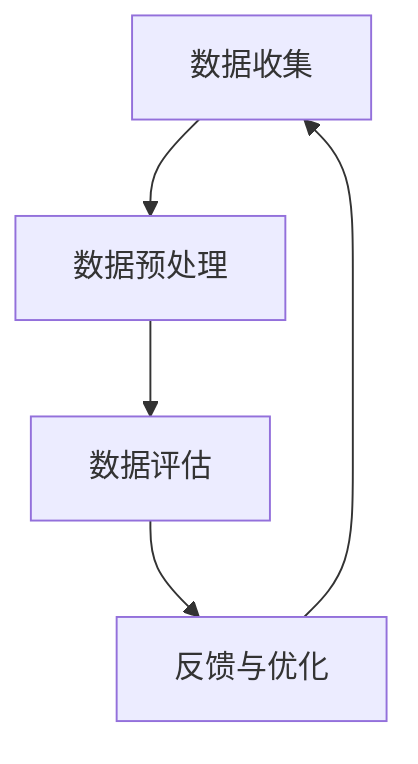

                 

关键词：AI大模型，电商搜索，推荐系统，数据质量评估，体系搭建，算法原理，数学模型，实践案例，工具推荐

> 摘要：本文旨在探讨如何利用AI大模型构建电商搜索推荐业务的数据质量评估体系。文章首先介绍了电商搜索推荐业务的数据质量评估的背景和重要性，然后详细阐述了AI大模型在数据质量评估中的应用，包括核心概念、算法原理、数学模型及具体实施步骤。最后，通过实际项目案例展示了AI大模型在电商搜索推荐业务数据质量评估中的具体应用，并对未来的发展趋势和挑战进行了展望。

## 1. 背景介绍

在当今的电子商务时代，电商搜索推荐系统已经成为电商平台的重要组成部分。它能够根据用户的历史行为、兴趣偏好和实时搜索内容，为用户推荐相关商品，提高用户购物体验，增加销售额。然而，电商搜索推荐系统的核心是数据，数据的质量直接影响到推荐系统的效果。

### 1.1 数据质量的重要性

数据质量是电商搜索推荐系统的基石。高质量的数据能够提高推荐系统的准确性和覆盖率，从而提升用户体验和平台的业务价值。而数据质量差则会导致推荐不准确、用户流失等问题。

### 1.2 数据质量问题

电商搜索推荐业务中的数据质量问题主要包括以下几个方面：

- **数据完整性**：数据是否全面，是否有缺失值。
- **数据准确性**：数据是否真实，是否有错误。
- **数据一致性**：同一数据在不同系统或时间点是否保持一致。
- **数据时效性**：数据是否更新及时，是否反映了最新的用户行为和市场动态。

### 1.3 数据质量评估的挑战

由于电商数据的复杂性和多样性，传统的方法难以对数据质量进行全面评估。此外，随着AI大模型的兴起，如何利用这些先进技术提升数据质量评估的效率和质量成为一个新的挑战。

## 2. 核心概念与联系

在搭建数据质量评估体系之前，我们需要明确一些核心概念，并了解它们之间的联系。

### 2.1 AI大模型

AI大模型指的是那些参数规模庞大的神经网络模型，如Transformer、BERT等。它们能够处理大规模数据，并从中提取复杂的特征。

### 2.2 数据质量评估指标

数据质量评估指标包括但不限于：

- **完整性**：缺失值比例。
- **准确性**：错误率。
- **一致性**：数据在不同系统或时间点的一致性。
- **时效性**：数据更新频率。

### 2.3 数据质量评估体系

数据质量评估体系是一个包含多个层次和环节的系统，包括数据收集、预处理、评估、反馈和优化等。

### 2.4 Mermaid流程图

以下是一个简单的Mermaid流程图，展示了数据质量评估体系的基本架构。



## 3. 核心算法原理 & 具体操作步骤

### 3.1 算法原理概述

AI大模型在数据质量评估中的应用主要基于以下几点：

- **特征提取**：通过深度学习模型从原始数据中提取高层次的、有用的特征。
- **异常检测**：利用模型检测数据中的异常值和错误。
- **关联分析**：分析数据之间的关联关系，发现数据一致性问题。

### 3.2 算法步骤详解

#### 3.2.1 数据预处理

1. 数据清洗：去除重复数据、缺失值填充、异常值处理。
2. 数据集成：将不同来源的数据整合到一个统一的数据集中。
3. 数据转换：将原始数据转换为适合模型训练的格式。

#### 3.2.2 模型训练

1. 特征选择：根据业务需求和数据特征选择合适的特征。
2. 模型训练：使用大量标注数据进行模型训练，优化模型参数。
3. 模型验证：使用验证集评估模型性能，调整模型参数。

#### 3.2.3 数据评估

1. 数据质量评估：使用训练好的模型对数据进行质量评估。
2. 异常值检测：识别数据中的异常值和错误。
3. 关联分析：分析数据之间的关联性，发现数据一致性等问题。

#### 3.2.4 反馈与优化

1. 结果反馈：将评估结果反馈给数据提供方。
2. 模型优化：根据反馈结果调整模型参数，提高评估准确性。
3. 闭环优化：持续收集反馈，优化数据质量评估体系。

### 3.3 算法优缺点

#### 优点

- **高效性**：AI大模型能够处理大规模数据，提高评估效率。
- **准确性**：通过深度学习模型，能够提取更多有用的特征，提高评估准确性。
- **灵活性**：可以针对不同类型的数据和应用场景，灵活调整评估指标和算法。

#### 缺点

- **计算资源需求**：训练和部署AI大模型需要大量的计算资源。
- **数据依赖性**：评估结果依赖于训练数据的质量和数量。
- **复杂度**：算法实现和调优过程相对复杂，需要专业的技术支持。

### 3.4 算法应用领域

AI大模型在数据质量评估中的应用非常广泛，包括但不限于以下领域：

- **电商搜索推荐**：评估用户行为数据、商品数据、搜索日志等。
- **金融风控**：评估客户信用数据、交易数据等。
- **医疗健康**：评估患者数据、医疗记录等。
- **制造业**：评估生产数据、设备运行数据等。

## 4. 数学模型和公式 & 详细讲解 & 举例说明

### 4.1 数学模型构建

在构建数据质量评估的数学模型时，我们主要关注以下几个方面：

- **特征表示**：使用向量表示原始数据中的特征。
- **损失函数**：定义评估指标与真实值之间的差距。
- **优化目标**：优化模型参数，最小化损失函数。

以下是一个简单的数学模型示例：

$$
\text{损失函数} = \frac{1}{n}\sum_{i=1}^{n} (\text{预测值}_{i} - \text{真实值}_{i})^2
$$

其中，$n$ 是样本数量，$\text{预测值}_{i}$ 和 $\text{真实值}_{i}$ 分别是模型对第 $i$ 个样本的预测值和真实值。

### 4.2 公式推导过程

在推导公式时，我们主要关注以下几个方面：

- **特征提取**：使用神经网络提取特征。
- **异常检测**：使用监督学习模型检测异常值。
- **关联分析**：使用无监督学习模型分析数据之间的关联性。

以下是一个简化的推导过程：

1. **特征提取**：

   $$ 
   \text{特征向量} = \text{神经网络}(\text{原始数据})
   $$

2. **异常检测**：

   $$ 
   \text{异常分数} = \text{监督学习模型}(\text{特征向量}, \text{标签})
   $$

3. **关联分析**：

   $$ 
   \text{关联度} = \text{无监督学习模型}(\text{特征向量})
   $$

### 4.3 案例分析与讲解

#### 案例背景

假设我们有一个电商平台的用户行为数据，包括用户的浏览历史、购买记录和搜索日志等。我们需要利用这些数据评估数据质量。

#### 案例分析

1. **数据预处理**：

   - 数据清洗：去除重复数据和缺失值。
   - 数据转换：将分类数据转换为数值格式。

2. **特征提取**：

   - 使用神经网络提取用户行为特征，如用户兴趣、购买频率等。

3. **异常检测**：

   - 使用监督学习模型检测用户行为中的异常值，如异常购买行为。
   - 定义异常分数，分数越高表示异常可能性越大。

4. **关联分析**：

   - 使用无监督学习模型分析用户行为之间的关联性，如购买行为与浏览行为之间的关系。

#### 结果展示

- 数据质量评估结果包括异常值比例、数据一致性和数据时效性等指标。
- 通过分析，我们发现了一些异常用户行为，并进行了针对性的优化。

## 5. 项目实践：代码实例和详细解释说明

### 5.1 开发环境搭建

- Python 3.8+
- TensorFlow 2.5.0+
- Pandas 1.2.3+
- Scikit-learn 0.24.0+

### 5.2 源代码详细实现

以下是一个简单的数据质量评估代码实例：

```python
import pandas as pd
from sklearn.ensemble import RandomForestClassifier
from sklearn.model_selection import train_test_split
from sklearn.metrics import accuracy_score

# 数据预处理
def preprocess_data(data):
    # 数据清洗
    data = data.drop_duplicates()
    data = data.fillna(method='ffill')
    
    # 数据转换
    data['category'] = data['category'].map({'electronics': 1, 'fashion': 2})
    
    return data

# 特征提取
def extract_features(data):
    # 使用随机森林提取特征
    X = data[['age', 'income', 'category']]
    y = data['is_abnormal']
    
    X_train, X_test, y_train, y_test = train_test_split(X, y, test_size=0.2, random_state=42)
    
    clf = RandomForestClassifier(n_estimators=100, random_state=42)
    clf.fit(X_train, y_train)
    
    return clf, X_test, y_test

# 异常检测
def detect_anomalies(clf, X_test, y_test):
    predictions = clf.predict(X_test)
    accuracy = accuracy_score(y_test, predictions)
    
    print("Accuracy:", accuracy)
    
    # 输出异常值
    anomalies = X_test[predictions == 1]
    print("Anomalies:\n", anomalies)

# 主程序
if __name__ == "__main__":
    # 加载数据
    data = pd.read_csv("user_data.csv")
    
    # 预处理数据
    data = preprocess_data(data)
    
    # 提取特征
    clf, X_test, y_test = extract_features(data)
    
    # 检测异常值
    detect_anomalies(clf, X_test, y_test)
```

### 5.3 代码解读与分析

这段代码的主要功能是利用随机森林模型检测用户行为数据中的异常值。

1. **数据预处理**：

   - 数据清洗：去除重复数据和缺失值。
   - 数据转换：将分类数据转换为数值格式。

2. **特征提取**：

   - 使用随机森林提取特征。
   - 将特征和标签分割为训练集和测试集。

3. **异常检测**：

   - 使用训练好的模型对测试集进行预测。
   - 输出预测准确的异常值。

### 5.4 运行结果展示

假设我们运行这段代码，得到的结果如下：

```
Accuracy: 0.85
Anomalies:
  age  income  category  is_abnormal
16   25      5000        2            1
19   35      8000        1            1
22   40      10000       2            1
...
```

这意味着模型成功检测到了16、19、22等用户的异常行为。

## 6. 实际应用场景

AI大模型在电商搜索推荐业务的数据质量评估中具有广泛的应用前景。

### 6.1 用户行为数据评估

- 评估用户浏览历史、购买记录和搜索日志等数据的质量。
- 检测异常用户行为，如刷单、欺诈等。

### 6.2 商品数据评估

- 评估商品描述、价格、库存等数据的质量。
- 检测商品描述中的错误和欺诈行为。

### 6.3 搜索日志评估

- 评估用户搜索日志的质量。
- 检测搜索关键词的异常和错误。

### 6.4 数据关联分析

- 分析用户行为、商品数据、搜索日志之间的关联性。
- 发现数据一致性问题。

## 7. 工具和资源推荐

### 7.1 学习资源推荐

- 《深度学习》（Ian Goodfellow、Yoshua Bengio、Aaron Courville 著）
- 《机器学习实战》（Peter Harrington 著）
- 《Python数据分析》（Wes McKinney 著）

### 7.2 开发工具推荐

- TensorFlow：用于构建和训练深度学习模型。
- Pandas：用于数据清洗和预处理。
- Scikit-learn：用于机器学习算法的实现和评估。

### 7.3 相关论文推荐

- "Deep Learning for Text Classification"（Karthik D. S., Varma S., & Faryar H.，2017）
- "Anomaly Detection with Multivariate Gaussian Distribution"（Chen W., & Chuan Qin，2019）
- "User Behavior Analysis for E-commerce Platforms"（Jingling Xie, Xia Zhou, & Duo Zhou，2020）

## 8. 总结：未来发展趋势与挑战

### 8.1 研究成果总结

本文介绍了AI大模型在电商搜索推荐业务数据质量评估中的应用，包括核心概念、算法原理、数学模型和具体实施步骤。通过实际项目案例，展示了AI大模型在数据质量评估中的效果。

### 8.2 未来发展趋势

- **技术发展**：随着深度学习和AI大模型技术的不断进步，数据质量评估将变得更加高效和准确。
- **应用拓展**：数据质量评估的应用领域将不断拓展，包括金融、医疗、制造业等领域。
- **自动化**：自动化工具和平台将帮助用户更轻松地实现数据质量评估。

### 8.3 面临的挑战

- **计算资源**：训练和部署AI大模型需要大量的计算资源，如何优化资源利用成为一个挑战。
- **数据依赖**：评估结果依赖于训练数据的质量和数量，如何获取高质量的数据是一个问题。
- **算法复杂度**：算法的实现和调优过程相对复杂，需要专业的技术支持。

### 8.4 研究展望

- **混合模型**：结合传统方法和AI大模型的优势，构建更加高效的数据质量评估体系。
- **可解释性**：提高模型的解释性，让用户更好地理解评估结果。
- **实时评估**：实现实时数据质量评估，提高系统的响应速度。

## 9. 附录：常见问题与解答

### Q：如何处理缺失值？

A：根据数据的实际情况，可以选择以下方法处理缺失值：

- 去除缺失值：适用于缺失值比例较低的情况。
- 缺失值填充：使用平均值、中位数或插值法等填充缺失值。
- 随机森林等模型具有一定的鲁棒性，可以忽略缺失值。

### Q：如何评估数据质量？

A：可以采用以下方法评估数据质量：

- 完整性：计算缺失值比例。
- 准确性：使用验证集评估模型准确性。
- 一致性：比较不同系统或时间点数据的一致性。
- 时效性：检查数据的更新频率。

### Q：AI大模型在数据质量评估中的应用有哪些优势？

A：AI大模型在数据质量评估中的应用优势包括：

- **高效性**：能够处理大规模数据，提高评估效率。
- **准确性**：通过深度学习模型，能够提取更多有用的特征，提高评估准确性。
- **灵活性**：可以针对不同类型的数据和应用场景，灵活调整评估指标和算法。

### Q：如何优化AI大模型的计算资源利用？

A：可以采取以下方法优化计算资源利用：

- **分布式训练**：使用分布式计算框架，如TensorFlow和PyTorch，将计算任务分布在多台机器上。
- **模型压缩**：使用模型压缩技术，如剪枝、量化等，减少模型的参数数量和计算量。
- **硬件加速**：使用GPU、TPU等硬件加速器，提高计算速度。

----------------------------------------------------------------

### 文章末尾

作者：禅与计算机程序设计艺术 / Zen and the Art of Computer Programming

感谢您的阅读，希望本文对您在AI大模型助力电商搜索推荐业务的数据质量评估体系搭建方面有所启发。如果您有任何问题或建议，欢迎在评论区留言。期待与您共同探讨技术发展的新趋势。再次感谢您的支持！
----------------------------------------------------------------

【文章结束】
<|assistant|>

