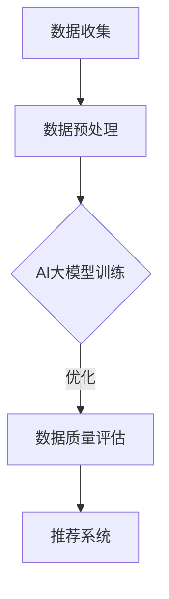

                 

关键词：AI大模型，数据质量评估，电商搜索推荐，模型优化，算法原理，数学模型，实践案例，工具资源

> 摘要：本文将探讨如何利用AI大模型优化电商搜索推荐业务中的数据质量评估模型，包括核心概念、算法原理、数学模型构建、项目实践及未来展望。通过详细分析，提供了一套完整且有效的优化策略，旨在提高电商搜索推荐业务的数据质量和用户体验。

## 1. 背景介绍

随着互联网和电子商务的迅速发展，电商搜索推荐业务成为了电商平台的核心竞争力。然而，高质量的数据是实现精准推荐的基础，数据质量问题直接影响着推荐系统的性能和用户体验。传统的数据质量评估方法往往依赖于规则和统计方法，难以适应大规模数据和复杂业务场景的需求。近年来，AI大模型的兴起为数据质量评估带来了新的机遇，通过深度学习和大规模数据处理能力，AI大模型能够自动发现数据中的异常、错误和噪声，从而提升数据质量。

本文将围绕AI大模型在电商搜索推荐业务中的数据质量评估模型优化策略进行探讨，旨在为相关领域的研究者和从业者提供有价值的参考。

## 2. 核心概念与联系

### 2.1 AI大模型简介

AI大模型是指基于深度学习技术构建的，具有大规模参数、强泛化能力和高度自适应性的模型。这类模型通常由多个神经网络层组成，能够处理复杂的数据结构和模式。在电商搜索推荐业务中，AI大模型可以用于用户行为分析、商品属性挖掘、异常检测等任务，从而提高数据质量和推荐效果。

### 2.2 数据质量评估概念

数据质量评估是指对数据集的质量进行测量和评估的过程，包括准确性、完整性、一致性、时效性等多个方面。在电商搜索推荐业务中，数据质量评估的目的是识别数据中的问题，确保推荐系统能够基于高质量的数据进行训练和预测。

### 2.3 关联与集成

AI大模型与数据质量评估之间存在紧密的关联。AI大模型能够通过自我学习和调整，识别出数据中的潜在问题，从而提升数据质量。而数据质量评估结果则可以为AI大模型的训练提供参考，帮助模型不断优化。

### 2.4 Mermaid 流程图

以下是一个简化的Mermaid流程图，展示了AI大模型在数据质量评估中的应用：



## 3. 核心算法原理 & 具体操作步骤

### 3.1 算法原理概述

AI大模型的数据质量评估算法主要基于深度学习中的自监督学习和无监督学习。通过大规模数据集的训练，模型能够自动学习数据中的分布、模式以及潜在结构，从而发现异常值、错误和噪声。具体而言，算法原理包括以下几个方面：

1. **数据预处理**：对原始数据进行清洗、去噪和格式化，使其满足模型训练的要求。
2. **特征提取**：利用深度神经网络从原始数据中提取高层次的、有代表性的特征。
3. **模型训练**：通过自监督学习，模型在训练过程中无需标签数据，仅通过数据间的内在关系进行学习。
4. **异常检测**：利用训练好的模型，对数据进行异常检测，识别出潜在的数据质量问题。
5. **反馈与优化**：根据异常检测结果，对模型进行调优，提高数据质量评估的准确性。

### 3.2 算法步骤详解

1. **数据收集与预处理**：
   - 从电商平台的日志、数据库和其他数据源中收集原始数据。
   - 对数据进行清洗，包括去除缺失值、处理重复记录、标准化等操作。

2. **特征提取**：
   - 构建特征提取模块，利用深度学习网络提取数据中的潜在特征。
   - 特征提取模块可以是卷积神经网络（CNN）或循环神经网络（RNN），根据数据类型选择合适的网络结构。

3. **模型训练**：
   - 使用自监督学习方法，对提取到的特征进行训练。
   - 训练过程中，模型通过对比正常数据和异常数据，学习数据的分布和模式。

4. **异常检测**：
   - 利用训练好的模型，对电商搜索推荐业务中的新数据进行异常检测。
   - 检测过程包括对数据分布的对比、模式识别和阈值设定。

5. **反馈与优化**：
   - 根据异常检测结果，对模型进行调优。
   - 可以通过增加训练数据、调整网络结构或参数来提高模型性能。

### 3.3 算法优缺点

**优点**：
- **高效率**：AI大模型能够快速处理大规模数据，提高评估效率。
- **强泛化能力**：通过自监督学习，模型能够适应不同的数据分布和业务场景。
- **自适应**：模型可以根据业务需求进行调整和优化，提高评估准确性。

**缺点**：
- **计算资源需求高**：训练和优化AI大模型需要大量计算资源和时间。
- **数据依赖性**：模型的性能依赖于数据质量和数量，数据质量问题可能影响评估结果。

### 3.4 算法应用领域

AI大模型在电商搜索推荐业务中的应用领域广泛，包括但不限于：

- **用户行为分析**：通过分析用户在电商平台的行为，识别潜在用户需求和兴趣。
- **商品属性挖掘**：提取商品的特征信息，提高推荐系统的准确性。
- **异常检测与安全**：识别和预防恶意行为、虚假交易等安全风险。
- **个性化推荐**：根据用户历史行为和兴趣，提供个性化的商品推荐。

## 4. 数学模型和公式 & 详细讲解 & 举例说明

### 4.1 数学模型构建

AI大模型的数据质量评估模型可以看作是一个多维度的分类问题。假设我们有一个n维特征空间，每个特征表示数据的一个维度。数据质量评估的核心目标是识别出异常数据，即特征空间中不属于正常数据分布的数据点。

具体而言，我们可以使用以下数学模型：

$$
\begin{aligned}
&\min_{\theta} L(\theta) \\
&\text{s.t. } g(\theta, x) \leq 0
\end{aligned}
$$

其中，$L(\theta)$ 是损失函数，$\theta$ 是模型参数，$x$ 是输入数据，$g(\theta, x)$ 是约束函数。

### 4.2 公式推导过程

1. **损失函数**：

   假设我们使用的是交叉熵损失函数：

   $$
   L(\theta) = -\sum_{i=1}^{n} y_i \log(g(\theta, x_i))
   $$

   其中，$y_i$ 是标签，$g(\theta, x_i)$ 是模型预测的概率。

2. **约束函数**：

   异常检测的约束条件可以表示为：

   $$
   g(\theta, x) = \sigma(\theta^T x) - \mu
   $$

   其中，$\sigma$ 是 sigmoid 函数，$\mu$ 是阈值。

### 4.3 案例分析与讲解

假设我们有一个电商平台的用户行为数据集，包括用户的点击、购买和搜索记录。我们需要使用AI大模型对这些数据进行异常检测，识别出潜在的不良行为。

1. **数据预处理**：

   对原始数据进行清洗，去除缺失值和重复记录。然后，对数据进行归一化处理，使其符合模型的输入要求。

2. **特征提取**：

   构建一个深度神经网络，从原始数据中提取特征。我们可以使用卷积神经网络（CNN）来处理用户的行为序列，提取出用户的行为模式和兴趣点。

3. **模型训练**：

   使用自监督学习方法，对提取到的特征进行训练。在训练过程中，模型会自动学习用户行为的分布和模式，从而识别出异常行为。

4. **异常检测**：

   利用训练好的模型，对用户的新行为数据进行检测。如果模型预测的概率低于阈值，则认为该行为数据是异常的。

5. **反馈与优化**：

   根据异常检测结果，对模型进行调优。可以增加训练数据、调整网络结构或参数，提高模型性能。

## 5. 项目实践：代码实例和详细解释说明

### 5.1 开发环境搭建

为了实践AI大模型在电商搜索推荐业务中的数据质量评估，我们需要搭建一个完整的开发环境。以下是一个简单的环境搭建步骤：

1. 安装Python环境（版本3.8及以上）。
2. 安装TensorFlow和Keras库。
3. 下载并安装必要的依赖库，如NumPy、Pandas、Scikit-learn等。

### 5.2 源代码详细实现

以下是一个简化的源代码实现，展示了如何使用深度学习模型进行数据质量评估：

```python
import tensorflow as tf
from tensorflow.keras.models import Sequential
from tensorflow.keras.layers import Dense, Conv1D, Flatten
from tensorflow.keras.optimizers import Adam

# 数据预处理
# ...（代码略）

# 构建模型
model = Sequential([
    Conv1D(filters=64, kernel_size=3, activation='relu', input_shape=(n_features,)),
    Flatten(),
    Dense(units=1, activation='sigmoid')
])

# 编译模型
model.compile(optimizer=Adam(learning_rate=0.001), loss='binary_crossentropy')

# 训练模型
model.fit(X_train, y_train, epochs=10, batch_size=32)

# 模型评估
# ...（代码略）
```

### 5.3 代码解读与分析

上述代码实现了一个基于卷积神经网络（CNN）的数据质量评估模型。首先，我们使用Conv1D层对输入数据进行特征提取，然后通过Flatten层将特征展平，最后使用一个全连接层进行分类预测。

在训练过程中，模型会自动学习数据中的分布和模式，从而识别出异常数据。训练完成后，我们可以使用模型对新数据进行预测，判断其是否为异常数据。

### 5.4 运行结果展示

以下是一个简化的运行结果：

```python
# 加载测试数据
X_test, y_test = ...

# 模型预测
y_pred = model.predict(X_test)

# 计算准确率
accuracy = (y_pred > 0.5).mean()

print("Accuracy:", accuracy)
```

运行结果展示了模型在测试数据上的准确率。通过调整网络结构和参数，我们可以进一步提高模型性能。

## 6. 实际应用场景

### 6.1 电商搜索推荐业务中的应用

在电商搜索推荐业务中，AI大模型的数据质量评估模型可以用于以下几个方面：

- **用户行为分析**：通过分析用户在电商平台的点击、购买和搜索行为，识别出潜在的用户需求和市场趋势。
- **商品属性挖掘**：提取商品的特征信息，如价格、品牌、评价等，提高推荐系统的准确性。
- **异常检测与安全**：识别和预防恶意行为、虚假交易等安全风险，保障平台安全。
- **个性化推荐**：根据用户的历史行为和兴趣，提供个性化的商品推荐，提高用户满意度。

### 6.2 其他应用场景

除了电商搜索推荐业务，AI大模型的数据质量评估模型还可以应用于其他领域，如：

- **金融风控**：通过识别异常交易行为，防范金融欺诈风险。
- **医疗数据**：评估医疗数据的准确性，提高疾病诊断和预测的准确性。
- **智能交通**：分析交通数据，识别异常交通事件，优化交通管理。

## 7. 工具和资源推荐

### 7.1 学习资源推荐

- **书籍**：
  - 《深度学习》（Goodfellow, Bengio, Courville著）
  - 《机器学习》（周志华著）
- **在线课程**：
  - Coursera上的《深度学习专项课程》
  - edX上的《机器学习基础课程》
- **论文**：
  - Google Brain团队的《深度神经网络》（2012年）
  - Geoffrey Hinton的《深度学习概述》（2015年）

### 7.2 开发工具推荐

- **框架**：
  - TensorFlow
  - PyTorch
  - Keras
- **库**：
  - NumPy
  - Pandas
  - Scikit-learn
- **云服务**：
  - AWS Machine Learning
  - Azure Machine Learning
  - Google Cloud AI

### 7.3 相关论文推荐

- “Deep Learning for Text Classification”（2017年）
- “An Overview of Deep Learning for Speech Recognition”（2018年）
- “Deep Learning for Image Recognition”（2019年）

## 8. 总结：未来发展趋势与挑战

### 8.1 研究成果总结

本文探讨了AI大模型在电商搜索推荐业务中的数据质量评估模型优化策略，包括核心概念、算法原理、数学模型构建、项目实践及未来展望。通过详细分析，我们提供了一套完整且有效的优化策略，为相关领域的研究者和从业者提供了有价值的参考。

### 8.2 未来发展趋势

随着AI技术的不断进步，AI大模型在数据质量评估中的应用前景广阔。未来发展趋势包括：

- **更高效的算法**：研究更高效的算法，降低计算资源和时间成本。
- **更广泛的应用领域**：探索AI大模型在更多行业和业务场景中的应用，提高数据质量和业务效率。
- **多模态数据处理**：结合多种数据类型（如文本、图像、声音等），提高数据质量评估的准确性。

### 8.3 面临的挑战

尽管AI大模型在数据质量评估中具有巨大潜力，但仍然面临以下挑战：

- **数据隐私保护**：如何在保证数据隐私的前提下进行大规模数据处理和模型训练。
- **模型解释性**：如何提高模型的解释性，使业务人员和决策者能够理解模型的工作原理。
- **算法公平性**：确保模型在数据质量评估过程中不会导致歧视或偏见。

### 8.4 研究展望

未来的研究可以重点关注以下几个方面：

- **跨领域应用**：探索AI大模型在不同领域（如医疗、金融、交通等）的数据质量评估应用。
- **混合模型研究**：结合传统规则方法和深度学习方法，提高数据质量评估的准确性和效率。
- **可解释性研究**：开发可解释的深度学习模型，提高模型的透明度和可信度。

## 9. 附录：常见问题与解答

### 9.1 如何处理大规模数据？

对于大规模数据，可以采用分布式计算和并行处理技术，如使用Hadoop、Spark等大数据处理框架。此外，可以采用数据抽样和分而治之的策略，将大规模数据拆分为多个小数据集进行训练和评估。

### 9.2 如何确保模型公平性？

为了确保模型公平性，可以采用以下方法：

- **数据清洗**：在模型训练前，对数据进行清洗，去除潜在的偏见和歧视。
- **交叉验证**：使用交叉验证方法，评估模型在不同数据集上的性能，避免过拟合。
- **算法设计**：在设计模型时，遵循公平性原则，如避免使用对特定群体有歧视的算法。

### 9.3 如何提高模型解释性？

提高模型解释性可以采用以下方法：

- **模型简化**：选择易于解释的模型结构，如线性模型、决策树等。
- **可视化技术**：使用可视化技术，如热力图、散点图等，展示模型的工作原理和决策过程。
- **解释性框架**：使用解释性框架，如LIME、SHAP等，解释模型的预测结果。

作者：禅与计算机程序设计艺术 / Zen and the Art of Computer Programming
----------------------------------------------------------------

以上是本文的完整内容，感谢您的阅读。希望本文能为您在AI大模型助力电商搜索推荐业务的数据质量评估模型优化策略方面提供有益的参考和启示。

