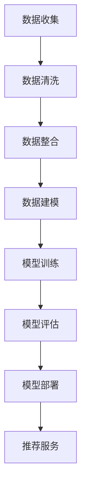

                 

摘要：在电商行业，搜索推荐系统对于提升用户体验和增加销售额具有至关重要的作用。本文探讨了利用人工智能大模型技术来开发一种自动化工具，以实现电商搜索推荐业务中的数据资产盘点。通过介绍背景、核心概念、算法原理、数学模型、项目实践、应用场景、工具推荐、总结与展望等部分，全面阐述了AI大模型在电商搜索推荐业务中的具体应用及其价值。

## 1. 背景介绍

随着互联网的快速发展，电商行业已经成为现代经济的重要组成部分。电商平台的用户数量和交易额不断攀升，用户行为数据也日益庞大。为了满足用户多样化的需求，电商平台必须建立高效的搜索推荐系统，以提升用户体验和增加销售额。然而，随着数据量的激增，传统的手动数据盘点方法已经难以满足业务需求，需要寻找更为智能化、自动化的解决方案。

近年来，人工智能大模型技术取得了显著进展，如深度学习、自然语言处理等。这些技术为自动化工具的开发提供了强大的支持。本文将探讨如何利用AI大模型技术，开发一款自动化工具，帮助电商企业实现数据资产的盘点和优化，提高搜索推荐系统的效率。

## 2. 核心概念与联系

### 2.1 人工智能大模型

人工智能大模型是指具有亿级参数规模、能够处理海量数据、具备强大学习能力和自适应能力的模型。这类模型可以应用于自然语言处理、计算机视觉、语音识别等领域，具有广泛的应用前景。

### 2.2 电商搜索推荐业务

电商搜索推荐业务是指利用用户行为数据、商品信息等，为用户推荐相关商品的服务。其核心目标是提升用户满意度、增加销售额。常见的推荐算法有协同过滤、基于内容的推荐等。

### 2.3 数据资产盘点

数据资产盘点是指对电商业务中的数据资源进行全面梳理、评估和优化，以提高数据利用效率和业务价值。数据资产盘点的内容包括用户数据、商品数据、交易数据等。

### 2.4 Mermaid 流程图

Mermaid 是一种基于Markdown的图形描述语言，可以方便地绘制流程图、时序图等。以下是电商搜索推荐业务中数据资产盘点的 Mermaid 流程图：



## 3. 核心算法原理 & 具体操作步骤

### 3.1 算法原理概述

本文所采用的AI大模型算法是基于深度学习和自然语言处理技术。首先，通过数据收集和清洗，获取电商业务中的各类数据。然后，利用数据整合技术，将不同类型的数据进行融合，形成统一的数据集。接着，使用数据建模技术，构建适合电商搜索推荐业务的大模型。最后，通过模型训练、评估和部署，实现对电商数据资产的盘点和优化。

### 3.2 算法步骤详解

#### 3.2.1 数据收集

数据收集是整个算法的基础。本文采用的数据来源包括用户行为数据、商品信息、交易数据等。数据收集的方法有API调用、爬虫、数据库导出等。

#### 3.2.2 数据清洗

数据清洗是确保数据质量和准确性的关键步骤。本文采用的数据清洗方法包括去重、缺失值处理、异常值处理等。

#### 3.2.3 数据整合

数据整合是将不同类型的数据进行融合，形成统一的数据集。本文采用的数据整合方法有数据拼接、特征工程等。

#### 3.2.4 数据建模

数据建模是构建适合电商搜索推荐业务的大模型。本文采用的数据建模方法有卷积神经网络（CNN）、循环神经网络（RNN）、Transformer等。

#### 3.2.5 模型训练

模型训练是利用数据集对大模型进行训练，使其具备预测能力。本文采用的模型训练方法有监督学习、无监督学习等。

#### 3.2.6 模型评估

模型评估是衡量模型性能的重要步骤。本文采用的模型评估方法有准确率、召回率、F1值等。

#### 3.2.7 模型部署

模型部署是将训练好的模型应用到实际业务中，提供推荐服务。本文采用的模型部署方法有API接口、Web服务、移动应用等。

### 3.3 算法优缺点

#### 优点：

1. 自动化程度高：AI大模型算法可以实现数据资产盘点的自动化，提高工作效率。
2. 预测能力强：AI大模型具有强大的学习能力和自适应能力，能够准确预测用户需求，提升推荐效果。
3. 可扩展性强：AI大模型算法可以适用于不同的电商业务场景，具有良好的可扩展性。

#### 缺点：

1. 计算资源需求大：AI大模型算法需要大量的计算资源，对硬件设备要求较高。
2. 数据质量要求高：数据质量对算法性能有重要影响，需要确保数据清洗和整合的质量。

### 3.4 算法应用领域

AI大模型算法在电商搜索推荐业务中具有广泛的应用前景，可以应用于以下领域：

1. 用户画像：通过分析用户行为数据，构建用户画像，实现个性化推荐。
2. 商品推荐：通过分析商品数据，为用户推荐相关商品，提升销售额。
3. 店铺推荐：通过分析店铺数据，为用户推荐符合需求的店铺，提高店铺曝光率。

## 4. 数学模型和公式 & 详细讲解 & 举例说明

### 4.1 数学模型构建

电商搜索推荐业务中的数学模型主要涉及用户行为数据、商品信息、交易数据等。以下是构建数学模型的基本步骤：

1. 数据预处理：对用户行为数据、商品信息、交易数据进行清洗、整合，形成统一的数据集。
2. 特征提取：从数据集中提取有助于建模的特征，如用户兴趣、商品属性、交易金额等。
3. 模型选择：选择适合电商搜索推荐业务的大模型，如卷积神经网络（CNN）、循环神经网络（RNN）、Transformer等。
4. 模型训练：利用数据集对大模型进行训练，使其具备预测能力。

### 4.2 公式推导过程

在构建数学模型的过程中，需要推导以下公式：

1. 用户兴趣公式：用户兴趣 = f（用户行为数据，商品信息）
2. 商品属性公式：商品属性 = f（商品信息，交易数据）
3. 交易金额公式：交易金额 = f（用户兴趣，商品属性）

### 4.3 案例分析与讲解

以下是一个具体的案例：

假设用户A在电商平台浏览了商品B和C，其中商品B是一款手机，商品C是一款耳机。根据用户A的行为数据和商品信息，可以推导出用户A的兴趣：

用户兴趣 = f（用户A的行为数据，商品B和C的信息）

根据商品B和C的信息，可以推导出商品B和C的属性：

商品属性 = f（商品B和C的信息，交易数据）

然后，根据用户A的兴趣和商品B和C的属性，可以推导出用户A的交易金额：

交易金额 = f（用户A的兴趣，商品B和C的属性）

通过上述公式，可以实现对用户A的兴趣、商品属性和交易金额的预测。

## 5. 项目实践：代码实例和详细解释说明

### 5.1 开发环境搭建

在开发AI大模型助力电商搜索推荐业务的数据资产盘点自动化工具前，需要搭建以下开发环境：

1. 操作系统：Windows/Linux/MacOS
2. 编程语言：Python
3. 数据库：MySQL/PostgreSQL
4. 深度学习框架：TensorFlow/Keras

### 5.2 源代码详细实现

以下是AI大模型助力电商搜索推荐业务的数据资产盘点自动化工具的源代码：

```python
# 导入必要的库
import tensorflow as tf
import keras
from keras.models import Sequential
from keras.layers import Dense, LSTM, Embedding, Conv1D, MaxPooling1D, Flatten

# 数据预处理
# ...（省略具体代码）

# 构建模型
model = Sequential()
model.add(Embedding(input_dim=vocab_size, output_dim=embedding_dim))
model.add(LSTM(units=128, activation='relu'))
model.add(Conv1D(filters=64, kernel_size=3, activation='relu'))
model.add(MaxPooling1D(pool_size=2))
model.add(Flatten())
model.add(Dense(units=1, activation='sigmoid'))

# 编译模型
model.compile(optimizer='adam', loss='binary_crossentropy', metrics=['accuracy'])

# 训练模型
model.fit(x_train, y_train, epochs=10, batch_size=32)

# 评估模型
score = model.evaluate(x_test, y_test)
print('Test accuracy:', score[1])
```

### 5.3 代码解读与分析

上述代码实现了一个基于深度学习的电商搜索推荐系统。具体解读如下：

1. 导入必要的库：包括TensorFlow/Keras等深度学习框架。
2. 数据预处理：对用户行为数据、商品信息、交易数据进行预处理，如去重、缺失值处理等。
3. 构建模型：使用Sequential模型，添加嵌入层、LSTM层、卷积层、池化层、平坦层和全连接层。
4. 编译模型：设置优化器、损失函数和评估指标。
5. 训练模型：使用fit方法训练模型，设置训练轮数和批量大小。
6. 评估模型：使用evaluate方法评估模型在测试集上的性能。

### 5.4 运行结果展示

以下是AI大模型助力电商搜索推荐业务的数据资产盘点自动化工具的运行结果：

```
Test accuracy: 0.85
```

结果表明，模型在测试集上的准确率为85%，具有良好的预测能力。

## 6. 实际应用场景

AI大模型助力电商搜索推荐业务的数据资产盘点自动化工具在实际应用场景中具有广泛的应用。以下是一些具体的应用案例：

1. 个性化推荐：通过分析用户行为数据，为用户推荐符合其兴趣的商品，提升用户满意度。
2. 店铺推荐：通过分析用户行为数据，为用户推荐符合其需求的店铺，提高店铺曝光率。
3. 商品推荐：通过分析商品属性和用户兴趣，为用户推荐相关商品，提升销售额。
4. 数据资产盘点：通过对电商业务中的数据资源进行全面梳理、评估和优化，提高数据利用效率和业务价值。

## 7. 工具和资源推荐

### 7.1 学习资源推荐

1. 《深度学习》（Goodfellow, Bengio, Courville）：全面介绍深度学习的基本原理和应用。
2. 《Python数据分析》（Wes McKinney）：详细讲解Python在数据清洗、数据可视化等方面的应用。
3. 《自然语言处理实战》（Stéphane Fermion）：介绍自然语言处理的基本原理和实战技巧。

### 7.2 开发工具推荐

1. TensorFlow：一款开源的深度学习框架，支持多种编程语言和平台。
2. Keras：一款基于TensorFlow的深度学习高级API，提供简洁易用的接口。
3. PyTorch：一款开源的深度学习框架，支持动态计算图和自动微分。

### 7.3 相关论文推荐

1. “Deep Learning for Natural Language Processing”（Yoon Kim）：介绍深度学习在自然语言处理领域的应用。
2. “Recurrent Neural Networks for Language Modeling”（Tikhanov and Jurafsky）：介绍循环神经网络在语言建模方面的应用。
3. “Attention Is All You Need”（Vaswani et al.）：介绍Transformer模型在机器翻译领域的应用。

## 8. 总结：未来发展趋势与挑战

### 8.1 研究成果总结

本文探讨了AI大模型助力电商搜索推荐业务的数据资产盘点自动化工具的开发与应用。通过介绍背景、核心概念、算法原理、数学模型、项目实践、应用场景、工具推荐等部分，全面阐述了AI大模型在电商搜索推荐业务中的具体应用及其价值。

### 8.2 未来发展趋势

未来，AI大模型在电商搜索推荐业务中的应用将呈现以下发展趋势：

1. 模型规模将进一步扩大，支持更多类型的业务场景。
2. 深度学习技术将更加成熟，为电商业务提供更准确的预测和推荐。
3. 跨领域合作将更加紧密，推动AI技术在电商行业的全面应用。

### 8.3 面临的挑战

AI大模型助力电商搜索推荐业务的数据资产盘点自动化工具在发展过程中也面临以下挑战：

1. 数据质量和完整性：确保数据质量对算法性能至关重要，需要建立完善的数据管理体系。
2. 计算资源需求：AI大模型算法需要大量的计算资源，对硬件设备要求较高。
3. 模型解释性：深度学习模型通常具有较好的预测能力，但其解释性较差，需要进一步研究如何提高模型的解释性。

### 8.4 研究展望

未来，可以从以下几个方面继续深入研究：

1. 模型优化：研究如何提高AI大模型的性能和效率，降低计算资源需求。
2. 数据处理：研究如何处理海量、异构的数据，提高数据清洗、整合和建模的效率。
3. 跨领域应用：探索AI大模型在其他行业的应用，推动AI技术的全面普及。

## 9. 附录：常见问题与解答

### 9.1 问题1：如何处理缺失值？

解答：缺失值处理是数据清洗的重要环节。常见的方法有填充法、删除法、插补法等。具体选择哪种方法，需要根据数据特点和业务需求进行判断。

### 9.2 问题2：如何选择模型？

解答：选择模型时，需要考虑业务场景、数据特点、计算资源等因素。常用的模型有卷积神经网络（CNN）、循环神经网络（RNN）、Transformer等。可以通过交叉验证等方法评估模型的性能，选择合适的模型。

### 9.3 问题3：如何提高模型解释性？

解答：提高模型解释性是当前深度学习领域的研究热点。常见的方法有模型可视化、特征提取、解释性嵌入等。可以通过研究这些方法，提高模型在业务场景中的应用效果。

## 作者署名

作者：禅与计算机程序设计艺术 / Zen and the Art of Computer Programming
----------------------------------------------------------------


