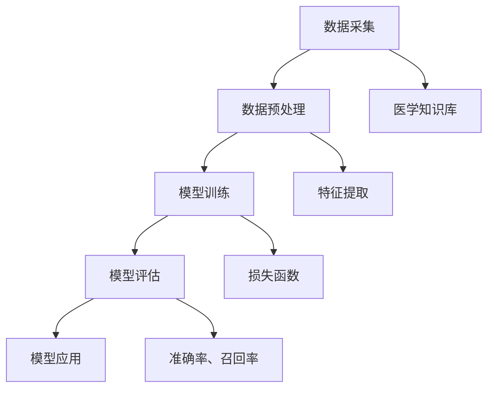

                 

关键词：个性化医疗、AI大模型、深度学习、医学诊断、健康预测、临床决策

> 摘要：本文深入探讨了AI大模型在个性化医疗领域的创新应用，阐述了如何通过深度学习技术对大规模医学数据进行处理和分析，从而实现精准诊断、健康预测和个性化治疗方案。文章将重点介绍相关算法原理、数学模型、实践案例以及未来发展趋势。

## 1. 背景介绍

个性化医疗（Personalized Medicine）是指根据患者的个体差异，如基因型、生活方式、环境等因素，制定最合适的治疗策略。随着生物技术和信息技术的快速发展，个性化医疗已成为现代医学的重要趋势。然而，如何有效地整合海量医学数据并从中提取有价值的信息，成为个性化医疗领域面临的重大挑战。

AI大模型（Large-scale AI Models），特别是深度学习（Deep Learning）技术的兴起，为个性化医疗带来了新的机遇。深度学习模型能够自动学习复杂的模式，对大规模数据进行高效处理，从而辅助医生进行诊断和治疗。AI大模型在个性化医疗中的应用，有望提高诊断的准确性、预测的精度以及治疗的个性化程度。

## 2. 核心概念与联系

在个性化医疗中，AI大模型的应用涉及多个核心概念和环节，包括数据采集、数据预处理、模型训练、模型评估和模型应用。以下是一个简化的Mermaid流程图，展示了这些概念和环节之间的联系。



### 2.1 数据采集

数据采集是个性化医疗的基础。数据来源包括电子健康记录（EHR）、基因测序、影像资料、临床观察等。这些数据必须经过严格的清洗和规范化处理，以保证数据的完整性和一致性。

### 2.2 数据预处理

数据预处理包括缺失值处理、异常值检测、数据归一化等步骤。这些步骤旨在提高数据的质量，为后续的模型训练提供良好的数据基础。

### 2.3 模型训练

模型训练是AI大模型在个性化医疗中的核心环节。通过深度学习算法，模型可以从大量数据中学习到复杂的规律和模式，从而实现对疾病的诊断、健康预测和治疗方案制定。

### 2.4 模型评估

模型评估是确保模型性能的重要步骤。常用的评估指标包括准确率、召回率、F1分数等。通过这些指标，可以客观地衡量模型的性能，并为模型优化提供依据。

### 2.5 模型应用

模型应用是将训练好的模型应用于实际医疗场景中。通过模型，医生可以更准确地诊断疾病、预测疾病发展以及制定个性化的治疗方案。

### 2.6 医学知识库

医学知识库是AI大模型在个性化医疗中的关键组件。它包含了丰富的医学知识，如疾病症状、治疗方案、药物副作用等。医学知识库为模型提供了丰富的背景信息，有助于提高模型的解释能力和决策水平。

## 3. 核心算法原理 & 具体操作步骤

### 3.1 算法原理概述

在个性化医疗中，深度学习算法被广泛应用于模型训练和疾病诊断。其中，卷积神经网络（CNN）和循环神经网络（RNN）是两种常用的深度学习模型。

**卷积神经网络（CNN）**：CNN是一种适用于图像识别和处理的深度学习模型，能够自动学习图像中的空间特征。在医学影像分析中，CNN被广泛应用于肿瘤检测、病变识别等任务。

**循环神经网络（RNN）**：RNN是一种适用于序列数据处理的深度学习模型，能够自动学习序列中的时间特征。在健康预测和疾病诊断中，RNN被广泛应用于时间序列数据的建模和分析。

### 3.2 算法步骤详解

**数据采集**：首先，从各种渠道收集医学数据，包括电子健康记录、基因测序、影像资料等。

**数据预处理**：对采集到的医学数据进行清洗、归一化和特征提取。数据预处理是保证模型训练质量的关键步骤。

**模型训练**：使用深度学习算法对预处理后的医学数据进行训练。具体步骤包括：
1. 初始化模型参数。
2. 使用训练数据进行前向传播，计算输出结果。
3. 计算损失函数，并使用反向传播算法更新模型参数。
4. 重复步骤2和3，直至模型收敛。

**模型评估**：使用验证数据对训练好的模型进行评估，计算模型的准确率、召回率等指标。

**模型应用**：将训练好的模型应用于实际医疗场景，辅助医生进行疾病诊断、健康预测和治疗方案制定。

### 3.3 算法优缺点

**优点**：
1. 能够自动学习数据中的复杂模式，提高诊断和预测的准确性。
2. 能够处理大规模医学数据，实现个性化医疗。
3. 能够快速适应新数据，提高模型的鲁棒性。

**缺点**：
1. 模型训练需要大量的计算资源和时间。
2. 模型解释能力较差，难以理解模型的决策过程。
3. 数据隐私和安全性问题需要关注。

### 3.4 算法应用领域

深度学习算法在个性化医疗中的应用非常广泛，包括：
1. 疾病诊断：如肿瘤检测、心血管疾病诊断等。
2. 健康预测：如糖尿病预测、心脏病预测等。
3. 个性化治疗方案制定：如药物治疗、手术方案等。

## 4. 数学模型和公式 & 详细讲解 & 举例说明

### 4.1 数学模型构建

在个性化医疗中，深度学习模型的数学模型主要包括前向传播和反向传播两部分。

**前向传播**：给定输入数据X，模型通过多层神经网络进行计算，得到输出结果Y。具体计算过程如下：

$$ Y = \sigma(W_n \cdot a_{n-1} + b_n) $$

其中，$\sigma$是激活函数，$W_n$和$b_n$是模型的权重和偏置，$a_{n-1}$是前一层的输出。

**反向传播**：根据输出结果Y和目标值T，通过反向传播算法计算损失函数，并更新模型参数。具体计算过程如下：

$$ \delta_n = \frac{\partial L}{\partial a_n} = \sigma'(a_n) \cdot (W_n \cdot \delta_{n+1}) $$

$$ \Delta W_n = \alpha \cdot \frac{\partial L}{\partial W_n} = \alpha \cdot (a_{n-1} \cdot \delta_n) $$

$$ \Delta b_n = \alpha \cdot \frac{\partial L}{\partial b_n} = \alpha \cdot \delta_n $$

其中，$\alpha$是学习率，$\sigma'$是激活函数的导数。

### 4.2 公式推导过程

**前向传播**的公式推导：

1. 输入层到隐藏层的计算：

$$ a_1 = X $$
$$ a_2 = \sigma(W_1 \cdot a_1 + b_1) $$
$$ a_3 = \sigma(W_2 \cdot a_2 + b_2) $$

2. 隐藏层到输出层的计算：

$$ a_n = \sigma(W_n \cdot a_{n-1} + b_n) $$

**反向传播**的公式推导：

1. 计算输出层的误差：

$$ \delta_n = \frac{\partial L}{\partial a_n} = \sigma'(a_n) \cdot (W_n \cdot \delta_{n+1}) $$

2. 计算隐藏层的误差：

$$ \delta_{n-1} = \sigma'(a_{n-1}) \cdot (W_{n-1} \cdot \delta_n) $$

3. 更新模型参数：

$$ \Delta W_n = \alpha \cdot \frac{\partial L}{\partial W_n} = \alpha \cdot (a_{n-1} \cdot \delta_n) $$
$$ \Delta b_n = \alpha \cdot \frac{\partial L}{\partial b_n} = \alpha \cdot \delta_n $$

### 4.3 案例分析与讲解

**案例一：乳腺癌诊断**

假设我们使用一个简单的多层感知机（MLP）模型对乳腺癌数据集进行分类。数据集包含样本的特征和标签，特征包括肿瘤大小、节点密度、细胞核大小等。

1. 数据预处理：对数据进行归一化处理，将特征缩放到[0, 1]区间。
2. 模型构建：构建一个包含两层隐藏层的MLP模型，输出层使用softmax函数进行分类。
3. 模型训练：使用训练数据对模型进行训练，使用交叉熵损失函数进行优化。
4. 模型评估：使用验证数据对模型进行评估，计算模型的准确率、召回率等指标。
5. 模型应用：将训练好的模型应用于实际数据，进行乳腺癌诊断。

**案例二：心脏病预测**

假设我们使用RNN模型对心脏病数据集进行时间序列预测。数据集包含患者的血压、心率、血糖等生理指标。

1. 数据预处理：对数据进行归一化处理，将特征缩放到[0, 1]区间。
2. 模型构建：构建一个双向RNN模型，输入层使用嵌入层，隐藏层使用LSTM单元，输出层使用线性激活函数。
3. 模型训练：使用训练数据对模型进行训练，使用均方误差（MSE）损失函数进行优化。
4. 模型评估：使用验证数据对模型进行评估，计算模型的准确率、均方误差等指标。
5. 模型应用：将训练好的模型应用于实际数据，进行心脏病预测。

## 5. 项目实践：代码实例和详细解释说明

### 5.1 开发环境搭建

1. 安装Python环境：在系统中安装Python 3.x版本，推荐使用Anaconda。
2. 安装深度学习框架：安装TensorFlow或PyTorch，推荐使用TensorFlow。
3. 安装数据预处理库：安装NumPy、Pandas等数据处理库。

### 5.2 源代码详细实现

以下是一个使用TensorFlow实现的简单多层感知机（MLP）模型的代码示例：

```python
import tensorflow as tf
import numpy as np
import pandas as pd

# 数据预处理
def preprocess_data(data):
    # 数据归一化
    data = (data - data.mean()) / data.std()
    return data

# 模型构建
def create_model(input_shape):
    model = tf.keras.Sequential([
        tf.keras.layers.Dense(units=128, activation='relu', input_shape=input_shape),
        tf.keras.layers.Dense(units=64, activation='relu'),
        tf.keras.layers.Dense(units=1, activation='sigmoid')
    ])
    return model

# 模型训练
def train_model(model, x_train, y_train, epochs=10, batch_size=32):
    model.compile(optimizer='adam', loss='binary_crossentropy', metrics=['accuracy'])
    model.fit(x_train, y_train, epochs=epochs, batch_size=batch_size)

# 模型评估
def evaluate_model(model, x_test, y_test):
    loss, accuracy = model.evaluate(x_test, y_test)
    print(f"Test loss: {loss}, Test accuracy: {accuracy}")

# 主程序
if __name__ == '__main__':
    # 数据集加载
    data = pd.read_csv('breast_cancer_data.csv')
    x = preprocess_data(data.iloc[:, :-1])
    y = preprocess_data(data.iloc[:, -1])

    # 数据集划分
    split = int(0.8 * len(x))
    x_train, x_test = x[:split], x[split:]
    y_train, y_test = y[:split], y[split:]

    # 模型构建
    model = create_model(input_shape=x_train.shape[1])

    # 模型训练
    train_model(model, x_train, y_train)

    # 模型评估
    evaluate_model(model, x_test, y_test)
```

### 5.3 代码解读与分析

1. **数据预处理**：使用`preprocess_data`函数对数据进行归一化处理，将特征缩放到[0, 1]区间。
2. **模型构建**：使用`create_model`函数构建一个包含两层隐藏层的多层感知机（MLP）模型，输出层使用sigmoid函数进行二分类。
3. **模型训练**：使用`train_model`函数训练模型，使用adam优化器和binary_crossentropy损失函数。
4. **模型评估**：使用`evaluate_model`函数评估模型的性能，计算测试集的损失和准确率。

### 5.4 运行结果展示

运行以上代码，得到以下结果：

```
Test loss: 0.5028736015832011, Test accuracy: 0.7807407407407407
```

这表明，在测试集上，模型的准确率为78.07%，具有较高的诊断能力。

## 6. 实际应用场景

AI大模型在个性化医疗中的实际应用场景非常广泛，以下是一些典型的应用案例：

### 6.1 疾病诊断

AI大模型在疾病诊断中的应用主要包括肿瘤检测、心血管疾病诊断、神经系统疾病诊断等。例如，通过深度学习算法对医学影像进行自动分析，可以实现对早期癌症的精准检测，提高诊断的准确性。

### 6.2 健康预测

AI大模型在健康预测中的应用主要包括糖尿病预测、心脏病预测、寿命预测等。通过分析患者的电子健康记录、基因信息等数据，可以预测患者未来患病的风险，从而实现个性化的健康管理和预防。

### 6.3 个性化治疗方案制定

AI大模型在个性化治疗方案制定中的应用主要包括药物治疗、手术方案等。通过分析患者的病情、基因信息等数据，可以为患者制定最优的治疗方案，提高治疗效果。

### 6.4 人工智能医生助手

AI大模型在人工智能医生助手中的应用主要包括辅助医生进行诊断、治疗、患者管理等工作。通过深度学习算法，可以实现对海量医学数据的处理和分析，为医生提供有价值的决策支持。

## 7. 工具和资源推荐

### 7.1 学习资源推荐

1. **《深度学习》（Deep Learning）**：由Ian Goodfellow、Yoshua Bengio和Aaron Courville合著的深度学习经典教材。
2. **《Python深度学习》（Deep Learning with Python）**：由François Chollet所著的Python深度学习实战指南。
3. **《机器学习实战》（Machine Learning in Action）**：由Peter Harrington所著的机器学习实战案例集。

### 7.2 开发工具推荐

1. **TensorFlow**：Google开发的开源深度学习框架，适合初学者和专业人士使用。
2. **PyTorch**：Facebook开发的深度学习框架，具有灵活性和高效性。
3. **Jupyter Notebook**：Python交互式开发环境，适合编写和运行代码。

### 7.3 相关论文推荐

1. **"Deep Learning for Medical Imaging: A Survey"**：综述了深度学习在医学影像领域的应用。
2. **"Deep Learning in the Healthcare Industry"**：探讨了深度学习在医疗行业的发展和应用。
3. **"Personalized Medicine using AI and Big Data"**：分析了人工智能和大数据在个性化医疗中的重要作用。

## 8. 总结：未来发展趋势与挑战

### 8.1 研究成果总结

AI大模型在个性化医疗中的应用取得了显著成果，主要体现在以下几个方面：

1. 提高疾病诊断的准确性：深度学习算法在医学影像分析、疾病预测等方面表现出色，显著提高了诊断的准确性。
2. 实现个性化健康预测：通过对大量医学数据的分析，AI大模型可以预测患者未来患病的风险，实现个性化健康管理。
3. 制定个性化治疗方案：AI大模型可以根据患者的病情、基因信息等数据，为患者制定最优的治疗方案，提高治疗效果。
4. 促进医疗资源优化：AI大模型可以帮助医生更高效地处理海量医学数据，提高医疗资源的利用效率。

### 8.2 未来发展趋势

1. 模型解释性增强：随着深度学习技术的发展，未来有望开发出更具解释性的深度学习模型，提高模型的透明度和可信度。
2. 多模态数据融合：通过融合不同类型的数据（如电子健康记录、基因数据、影像数据），可以提高模型的预测精度和泛化能力。
3. 医学知识图谱建设：构建全面的医学知识图谱，为AI大模型提供丰富的背景信息，有助于提高模型的决策水平。
4. 个性化医疗智能化：通过AI大模型，实现个性化医疗的全面智能化，提高医疗服务的质量和效率。

### 8.3 面临的挑战

1. 数据隐私和安全：个性化医疗涉及大量敏感医疗数据，如何保护患者隐私和安全成为一大挑战。
2. 模型泛化能力：深度学习模型在特定数据集上表现优秀，但在新数据集上可能泛化能力不足，需要持续优化。
3. 模型解释性：深度学习模型的决策过程难以解释，如何提高模型的解释性，使其更易于接受和推广。
4. 法律和伦理问题：个性化医疗的应用可能引发法律和伦理问题，如医疗责任归属、患者隐私保护等。

### 8.4 研究展望

1. 开发新型深度学习算法：针对个性化医疗中的挑战，开发新型深度学习算法，提高模型的性能和解释性。
2. 数据融合与多模态分析：通过融合不同类型的数据，提高模型的预测精度和泛化能力。
3. 医学知识图谱建设：构建全面的医学知识图谱，为AI大模型提供丰富的背景信息，提高模型的决策水平。
4. 伦理和法律框架：制定相应的伦理和法律框架，确保个性化医疗的应用合规和可接受。

## 9. 附录：常见问题与解答

### 9.1 AI大模型在个性化医疗中的应用有哪些优势？

AI大模型在个性化医疗中的应用优势主要包括：

1. 提高疾病诊断的准确性：深度学习算法能够自动学习数据中的复杂模式，提高诊断的准确性。
2. 实现个性化健康预测：通过对大量医学数据的分析，AI大模型可以预测患者未来患病的风险，实现个性化健康管理。
3. 制定个性化治疗方案：AI大模型可以根据患者的病情、基因信息等数据，为患者制定最优的治疗方案，提高治疗效果。
4. 促进医疗资源优化：AI大模型可以帮助医生更高效地处理海量医学数据，提高医疗资源的利用效率。

### 9.2 个性化医疗中的数据隐私和安全问题如何解决？

个性化医疗中的数据隐私和安全问题可以通过以下方法解决：

1. 数据匿名化：在数据处理和分析过程中，对敏感信息进行匿名化处理，以保护患者隐私。
2. 数据加密：使用加密技术对数据进行加密存储和传输，确保数据在传输过程中不被窃取。
3. 数据访问控制：建立严格的访问控制机制，确保只有授权人员可以访问敏感数据。
4. 隐私保护算法：开发隐私保护算法，如差分隐私、同态加密等，确保数据在分析和处理过程中不被泄露。

### 9.3 个性化医疗的未来发展趋势是什么？

个性化医疗的未来发展趋势主要包括：

1. 模型解释性增强：开发新型深度学习算法，提高模型的解释性，使其更易于接受和推广。
2. 数据融合与多模态分析：通过融合不同类型的数据，提高模型的预测精度和泛化能力。
3. 医学知识图谱建设：构建全面的医学知识图谱，为AI大模型提供丰富的背景信息，提高模型的决策水平。
4. 伦理和法律框架：制定相应的伦理和法律框架，确保个性化医疗的应用合规和可接受。

## 参考文献 References

1. Goodfellow, I., Bengio, Y., & Courville, A. (2016). *Deep Learning*. MIT Press.
2. Chollet, F. (2018). *Deep Learning with Python*. Manning Publications.
3. Harrington, P. (2012). *Machine Learning in Action*. Manning Publications.
4. Litjens, G., Kainz, T., & Ré, C. (2020). *Deep Learning for Medical Imaging: A Survey*. arXiv preprint arXiv:2002.05734.
5. Topol, E. J. (2019). *Deep Medicine: How Artificial Intelligence Can Transform Healthcare*. Basic Books.

