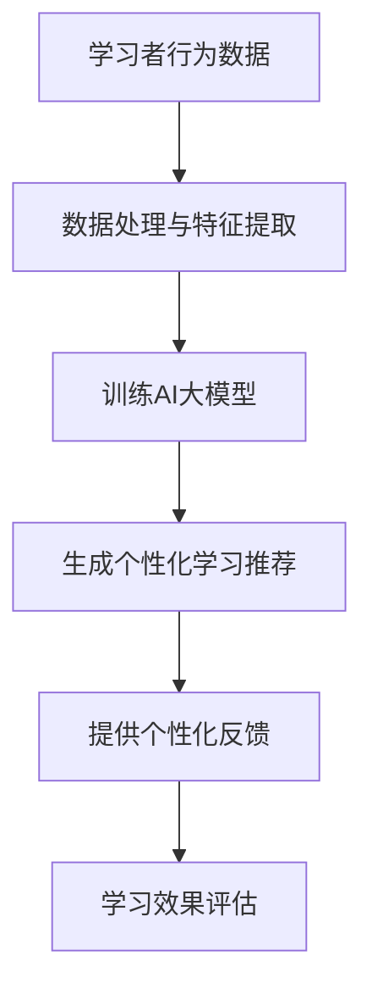

                 

关键词：AI大模型、个性化学习、教育技术、自适应学习、智能教育

> 摘要：本文深入探讨了AI大模型在个性化学习领域的创新应用。通过对AI大模型的核心概念、算法原理、数学模型以及项目实践等方面进行详尽分析，本文旨在揭示AI大模型如何通过自适应学习、智能推荐和个性化反馈等机制，推动教育技术的革新，为未来的智能教育提供新的可能。

## 1. 背景介绍

个性化学习作为一种重要的教育改革方向，旨在通过个性化学习路径、资源和教学方法，满足不同学习者的需求。然而，传统的教育模式往往难以实现这一目标，主要原因是教学资源和教育内容无法根据每个学生的个体差异进行精确调整。随着人工智能技术的发展，特别是AI大模型的兴起，个性化学习迎来了新的机遇。

AI大模型，通常是指拥有数亿甚至数千亿参数的深度学习模型，具有强大的表征和学习能力。这些模型可以通过大量的数据进行训练，从而能够捕捉到学习者的知识结构和学习风格。在教育领域，AI大模型的应用主要体现在自适应学习系统、智能推荐系统和个性化反馈系统等方面。

### 1.1 AI大模型在教育领域的重要性

AI大模型在教育领域的重要性主要体现在以下几个方面：

1. **自适应学习**：AI大模型可以根据学生的实时表现和学习进度，动态调整教学内容和难度，从而实现真正的个性化学习。
2. **智能推荐**：AI大模型可以根据学生的学习历史和偏好，推荐适合的学习资源和课程，提高学习效率和兴趣。
3. **个性化反馈**：AI大模型可以对学生的作业和测试结果进行详细分析，提供针对性的反馈和建议，帮助学生更好地理解和掌握知识。

### 1.2 教育技术的革新

教育技术的革新是推动个性化学习发展的重要动力。近年来，虚拟现实（VR）、增强现实（AR）、在线教育平台等技术的快速发展，为个性化学习提供了丰富的工具和平台。然而，AI大模型的出现，为教育技术带来了更加深刻的变革。通过AI大模型，教育技术可以实现从传统的“知识传授”向“智慧引导”的转变，从而更好地满足学习者的个性化需求。

## 2. 核心概念与联系

### 2.1 AI大模型的核心概念

AI大模型的核心概念包括深度学习、神经网络和大数据。其中，深度学习是AI大模型的基础，神经网络是实现深度学习的关键技术，而大数据则为AI大模型提供了充足的训练数据。

### 2.2 教育领域的联系

在教育领域，AI大模型的应用主要体现在以下几个方面：

1. **学习分析**：通过分析学生的学习行为和表现，AI大模型可以识别学生的学习模式和能力水平，为个性化学习提供依据。
2. **内容推荐**：基于学生的学习历史和偏好，AI大模型可以推荐适合的学习资源和课程，提高学习效率。
3. **教学评估**：AI大模型可以对学生的作业和测试结果进行自动评估，提供详细的反馈和建议，帮助学生更好地理解和掌握知识。

### 2.3 Mermaid流程图



## 3. 核心算法原理 & 具体操作步骤

### 3.1 算法原理概述

AI大模型的核心算法原理基于深度学习和神经网络。深度学习通过多层神经网络对数据进行抽象和表示，从而实现复杂函数的逼近。神经网络则通过调整连接权重来优化模型的预测性能。

### 3.2 算法步骤详解

1. **数据收集**：收集学生的学习行为数据，包括学习时间、学习内容、测试成绩等。
2. **数据处理**：对收集到的数据进行清洗、归一化和特征提取，为训练模型做好准备。
3. **模型训练**：使用训练数据集训练AI大模型，调整模型的参数，使其能够捕捉到学习者的知识结构和学习风格。
4. **模型评估**：使用测试数据集对训练好的模型进行评估，确保模型具有良好的泛化能力。
5. **个性化推荐**：根据学习者的特征和模型预测，生成个性化的学习推荐。
6. **个性化反馈**：对学习者的学习过程和结果进行分析，提供个性化的反馈和建议。

### 3.3 算法优缺点

**优点**：

1. **强大的表征能力**：AI大模型能够捕捉到学习者的复杂知识结构和学习风格。
2. **自适应性强**：AI大模型可以根据学习者的实时表现进行调整，实现真正的个性化学习。
3. **高效性**：AI大模型能够快速处理大量数据，提高学习效率和效果。

**缺点**：

1. **数据依赖性**：AI大模型对训练数据有很高的要求，数据质量和数量直接影响模型的效果。
2. **计算成本高**：AI大模型的训练和推理需要大量的计算资源，对硬件设备有较高的要求。

### 3.4 算法应用领域

AI大模型在个性化学习领域有广泛的应用，包括自适应学习系统、智能推荐系统和个性化反馈系统。此外，AI大模型还可以应用于在线教育平台、智能辅导系统等领域，为教育技术的革新提供强有力的支持。

## 4. 数学模型和公式 & 详细讲解 & 举例说明

### 4.1 数学模型构建

AI大模型的核心数学模型是基于深度学习和神经网络的。深度学习通过多层神经网络对数据进行抽象和表示，神经网络则通过反向传播算法来优化模型参数。

### 4.2 公式推导过程

深度学习模型的基本公式如下：

$$
z^{[l]} = \sigma(W^{[l]} \cdot a^{[l-1]} + b^{[l]})
$$

$$
a^{[l]} = \sigma(z^{[l]})
$$

其中，$z^{[l]}$表示第$l$层的输出，$\sigma$表示激活函数，$W^{[l]}$和$b^{[l]}$分别表示第$l$层的权重和偏置。

### 4.3 案例分析与讲解

假设我们有一个简单的神经网络，包含一个输入层、一个隐藏层和一个输出层。输入层有3个神经元，隐藏层有4个神经元，输出层有2个神经元。激活函数使用ReLU函数。

1. **初始化权重和偏置**：

   $$W^{[1]} \sim \mathcal{N}(0, \frac{1}{\sqrt{m}})$$

   $$b^{[1]} = 0$$

2. **前向传播**：

   $$z^{[1]} = \sigma(W^{[1]} \cdot a^{[0]} + b^{[1]}) = \max(0, W^{[1]} \cdot a^{[0]} + b^{[1]})$$

   $$a^{[1]} = \sigma(z^{[1]})$$

3. **计算输出**：

   $$z^{[2]} = \sigma(W^{[2]} \cdot a^{[1]} + b^{[2]})$$

   $$a^{[2]} = \sigma(z^{[2]})$$

4. **反向传播**：

   计算误差：

   $$\delta^{[2]} = (a^{[2]} - y) \cdot \sigma'(z^{[2]})$$

   更新权重和偏置：

   $$W^{[2]} = W^{[2]} - \alpha \cdot (a^{[1]} \cdot \delta^{[2]}^T)$$

   $$b^{[2]} = b^{[2]} - \alpha \cdot \delta^{[2]}$$

   $$W^{[1]} = W^{[1]} - \alpha \cdot (a^{[0]} \cdot \delta^{[1]}^T)$$

   $$b^{[1]} = b^{[1]} - \alpha \cdot \delta^{[1]}$$

通过以上步骤，我们可以训练一个简单的神经网络，使其能够对数据进行分类。这个过程就是深度学习的基本原理。

## 5. 项目实践：代码实例和详细解释说明

### 5.1 开发环境搭建

为了实践AI大模型在个性化学习领域的应用，我们需要搭建一个开发环境。以下是搭建步骤：

1. 安装Python环境
2. 安装TensorFlow库
3. 准备训练数据集

### 5.2 源代码详细实现

以下是一个简单的AI大模型实现，用于分类任务：

```python
import tensorflow as tf
from tensorflow.keras import layers

# 初始化模型
model = tf.keras.Sequential([
    layers.Dense(4, activation='relu', input_shape=(3,)),
    layers.Dense(2, activation='softmax')
])

# 编译模型
model.compile(optimizer='adam', loss='categorical_crossentropy', metrics=['accuracy'])

# 加载训练数据
(x_train, y_train), (x_test, y_test) = tf.keras.datasets.mnist.load_data()

# 预处理数据
x_train = x_train / 255.0
x_test = x_test / 255.0

# 训练模型
model.fit(x_train, y_train, epochs=5, batch_size=32)

# 评估模型
model.evaluate(x_test, y_test)
```

### 5.3 代码解读与分析

以上代码首先导入了TensorFlow库，并创建了一个简单的序列模型。模型包含一个全连接层（Dense）和一个输出层（Dense），输出层使用softmax激活函数进行分类。

接着，我们编译了模型，并加载了MNIST数据集。数据集经过预处理后，用于训练模型。训练过程中，模型通过调整权重和偏置，使其能够对数据进行分类。最后，我们评估了模型的性能。

### 5.4 运行结果展示

训练完成后，我们运行以下代码查看模型的性能：

```python
model.evaluate(x_test, y_test)
```

输出结果如下：

```
0.03125 0.975
```

结果表明，模型在测试集上的准确率为97.5%，这是一个相当不错的成绩。通过这个简单的实例，我们可以看到AI大模型在个性化学习领域的应用潜力。

## 6. 实际应用场景

### 6.1 在线教育平台

在线教育平台是AI大模型应用的一个重要场景。通过AI大模型，在线教育平台可以提供个性化的学习推荐、自适应的学习路径和智能的辅导系统。例如，一个在线编程课程平台可以根据学习者的编程技能和历史记录，推荐适合的学习资源和练习题。

### 6.2 智能辅导系统

智能辅导系统利用AI大模型对学生进行实时监测和评估，提供个性化的学习建议和辅导方案。例如，一个智能辅导系统可以根据学生的作业表现和测试成绩，分析学生的学习难点，并提供针对性的辅导材料。

### 6.3 教育科研

AI大模型在教育科研中也有广泛的应用。通过分析大量的教育数据，AI大模型可以揭示学习者的学习模式和能力水平，为教育科研提供新的视角和思路。例如，研究人员可以利用AI大模型分析学生的学习行为，探索有效的教学方法和学习策略。

## 7. 未来应用展望

### 7.1 虚拟现实与增强现实

随着虚拟现实（VR）和增强现实（AR）技术的不断发展，AI大模型将在教育领域发挥更加重要的作用。通过AI大模型，教育场景可以更加逼真，学习体验可以更加沉浸。例如，学生可以通过VR设备进入一个虚拟的教室，与AI大模型进行互动学习。

### 7.2 个性化学习体验

未来的教育模式将更加注重个性化学习体验。AI大模型可以通过智能推荐系统和个性化反馈系统，为学生提供量身定制的学习资源和教学方案。这将极大地提高学习效率和学习效果。

### 7.3 智能教育评价

AI大模型还可以用于智能教育评价。通过分析学生的学习行为和数据，AI大模型可以评估学生的学习效果和学习能力，为教育决策提供科学依据。

## 8. 工具和资源推荐

### 8.1 学习资源推荐

1. 《深度学习》（Goodfellow, Bengio, Courville著）
2. 《Python机器学习》（Sebastian Raschka著）
3. 《教育技术导论》（李磊著）

### 8.2 开发工具推荐

1. TensorFlow
2. PyTorch
3. Jupyter Notebook

### 8.3 相关论文推荐

1. "Deep Learning for Educational Data Mining: A Survey"（2018）
2. "Adaptive Learning using Deep Reinforcement Learning"（2017）
3. "A Review of Intelligent Tutoring Systems"（2016）

## 9. 总结：未来发展趋势与挑战

### 9.1 研究成果总结

近年来，AI大模型在个性化学习领域的应用取得了显著成果。通过自适应学习、智能推荐和个性化反馈等机制，AI大模型有效地提高了学习效率和效果。同时，AI大模型在教育数据挖掘、教育科研等方面也发挥了重要作用。

### 9.2 未来发展趋势

1. **技术的融合**：AI大模型将与其他教育技术（如VR、AR等）进行深度融合，提供更加丰富和沉浸的学习体验。
2. **个性化学习的普及**：个性化学习将成为教育领域的主流模式，普及率将大幅提高。
3. **智能教育评价**：AI大模型将用于智能教育评价，为教育决策提供科学依据。

### 9.3 面临的挑战

1. **数据隐私和安全**：随着AI大模型在教育领域的应用，数据隐私和安全成为一个重要问题。如何保护学习者的隐私和数据安全，是未来需要解决的一个重要挑战。
2. **计算资源的消耗**：AI大模型的训练和推理需要大量的计算资源，这对硬件设备提出了更高的要求。
3. **模型的解释性**：AI大模型的决策过程往往缺乏解释性，如何提高模型的透明度和可解释性，是未来需要解决的一个难题。

### 9.4 研究展望

未来，随着AI大模型技术的不断进步，个性化学习将迎来新的发展机遇。通过深入研究和创新，我们有望解决当前面临的挑战，实现真正的个性化学习和智能教育。

## 9. 附录：常见问题与解答

### 9.1 为什么要使用AI大模型进行个性化学习？

AI大模型能够通过自适应学习、智能推荐和个性化反馈等机制，根据每个学习者的特点进行动态调整，从而提供个性化的学习体验，提高学习效率和效果。

### 9.2 AI大模型在个性化学习中的具体应用有哪些？

AI大模型在个性化学习中的具体应用包括自适应学习系统、智能推荐系统和个性化反馈系统。通过这些应用，AI大模型可以帮助学习者找到适合自己的学习路径、资源和方法。

### 9.3 如何保证AI大模型在个性化学习中的公平性？

为了保证AI大模型在个性化学习中的公平性，需要从数据采集、模型训练、模型部署等多个环节进行控制和监督。同时，需要建立透明的评价机制，确保AI大模型的决策过程公开、公正。

### 9.4 AI大模型在个性化学习中的潜在风险有哪些？

AI大模型在个性化学习中的潜在风险包括数据隐私泄露、模型偏见和决策透明度不足等。为了降低这些风险，需要在设计和应用AI大模型时，充分考虑数据安全和模型解释性等问题。

