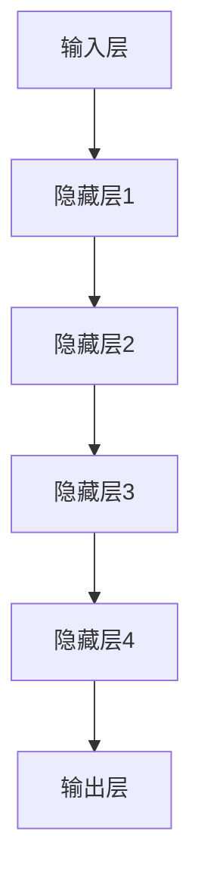
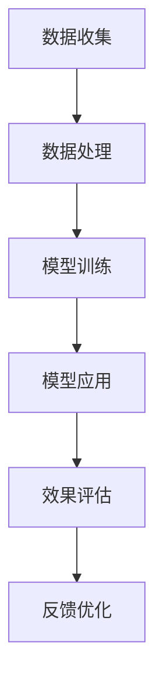

                 

关键词：AI大模型，个性化学习，机器学习，深度学习，教育技术

> 摘要：随着人工智能技术的快速发展，AI大模型在个性化学习领域展现出了巨大的潜力。本文将探讨AI大模型在个性化学习中的应用，包括其核心概念、算法原理、数学模型、项目实践、实际应用场景以及未来发展趋势和挑战。

## 1. 背景介绍

在传统教育模式中，教师和学生之间存在着一定的信息不对称，教学内容和教学方式往往难以满足每个学生的个性化需求。然而，随着人工智能技术的快速发展，尤其是AI大模型的兴起，为个性化学习提供了新的可能。AI大模型能够通过对大量教育数据的分析和理解，为学生提供个性化的学习内容和路径，从而提高学习效果。

### 1.1 个性化学习的定义

个性化学习是指根据学生的个体差异，为其提供量身定制的学习内容和路径，以最大限度地提高学习效果。个性化学习强调以学生为中心，尊重个体差异，关注学习过程的个性化需求。

### 1.2 AI大模型的概念

AI大模型是指通过深度学习等技术，从大量数据中学习并提取知识的大规模神经网络模型。这些模型具有强大的数据处理和知识表示能力，能够实现复杂的认知任务。

## 2. 核心概念与联系

### 2.1 个性化学习与AI大模型的关系

个性化学习与AI大模型密切相关。AI大模型可以通过对学习数据的深度分析，识别出学生的个性化学习需求，从而为学生提供个性化的学习内容和路径。具体来说，AI大模型可以用于以下方面：

- **学习内容推荐**：根据学生的学习历史、兴趣和能力，推荐符合其个性化需求的学习内容。
- **学习路径规划**：根据学生的学习进度和效果，规划个性化的学习路径。
- **学习效果评估**：通过分析学生的学习行为和学习成果，评估学习效果，提供改进建议。

### 2.2 AI大模型的架构

AI大模型通常由多层神经网络组成，包括输入层、隐藏层和输出层。输入层接收原始数据，隐藏层通过逐层提取特征，输出层生成预测结果。具体架构如下：



### 2.3 个性化学习流程

个性化学习流程包括数据收集、数据处理、模型训练、模型应用和效果评估等环节。具体流程如下：



## 3. 核心算法原理 & 具体操作步骤

### 3.1 算法原理概述

AI大模型的核心算法原理是基于深度学习技术。深度学习通过多层神经网络对数据进行学习，从而实现从数据中自动提取特征和模式。

### 3.2 算法步骤详解

#### 3.2.1 数据收集

数据收集是个性化学习的基础。收集的数据包括学生的学习行为数据、学习成果数据等。数据来源可以是学习平台、学习管理系统等。

#### 3.2.2 数据处理

数据处理包括数据清洗、数据整合和数据预处理等步骤。数据清洗是为了去除噪声数据和异常数据，数据整合是将多源数据进行合并，数据预处理是为了将数据转换为模型训练所需的格式。

#### 3.2.3 模型训练

模型训练是AI大模型的核心步骤。通过将处理后的数据输入到神经网络中，模型会自动调整权重和偏置，以达到对数据的准确预测。

#### 3.2.4 模型应用

模型训练完成后，可以应用于个性化学习场景。模型会根据学生的个性化需求，为其推荐学习内容和路径。

#### 3.2.5 效果评估

效果评估是为了检验AI大模型在个性化学习中的效果。通过分析学生的学习行为和学习成果，评估模型的效果，并提供改进建议。

### 3.3 算法优缺点

#### 优点：

- **强大的数据处理能力**：AI大模型能够处理大规模的教育数据，从中提取出有价值的信息。
- **自动特征提取**：通过多层神经网络，AI大模型能够自动提取数据中的特征和模式，实现复杂的学习任务。
- **个性化学习**：AI大模型可以根据学生的个性化需求，提供个性化的学习内容和路径，提高学习效果。

#### 缺点：

- **计算资源需求大**：AI大模型需要大量的计算资源进行训练和推理。
- **数据隐私问题**：个性化学习需要收集和处理大量的学生数据，这可能涉及到数据隐私问题。

### 3.4 算法应用领域

AI大模型在个性化学习领域具有广泛的应用前景。除了教育领域，AI大模型还可以应用于医疗、金融、电商等多个领域，为用户提供个性化的服务和推荐。

## 4. 数学模型和公式 & 详细讲解 & 举例说明

### 4.1 数学模型构建

AI大模型的数学模型是基于深度学习技术的。深度学习模型通常由多层神经网络组成，包括输入层、隐藏层和输出层。每个层由多个神经元组成，神经元之间通过权重和偏置连接。

### 4.2 公式推导过程

深度学习模型的训练过程可以看作是一个优化问题。具体来说，是通过调整模型的权重和偏置，使得模型的预测结果与实际结果之间的误差最小。

假设输入数据为 $x$，输出数据为 $y$，模型的预测结果为 $\hat{y}$。则模型的误差函数可以表示为：

$$
E = \frac{1}{2}\sum_{i=1}^{n} (\hat{y}_i - y_i)^2
$$

其中，$n$ 为样本数量。

为了最小化误差函数 $E$，需要对模型的权重和偏置进行优化。常见的优化算法有梯度下降法、随机梯度下降法、Adam优化器等。

### 4.3 案例分析与讲解

#### 案例背景：

某在线学习平台希望通过AI大模型为用户推荐课程。用户的数据包括学习历史、兴趣爱好、课程评分等。

#### 案例步骤：

1. 数据收集：收集用户的学习历史、兴趣爱好、课程评分等数据。
2. 数据处理：对数据进行清洗、整合和预处理，将数据转换为模型训练所需的格式。
3. 模型训练：使用深度学习技术训练推荐模型，将用户数据作为输入，课程数据作为输出。
4. 模型应用：将训练好的模型应用于实际场景，为用户推荐课程。
5. 效果评估：通过分析用户对推荐的课程的反应，评估模型的推荐效果，并提供改进建议。

#### 模型效果：

通过AI大模型，该在线学习平台实现了课程推荐的个性化，用户对推荐的课程的满意度显著提高。

## 5. 项目实践：代码实例和详细解释说明

### 5.1 开发环境搭建

为了实现AI大模型在个性化学习中的应用，我们需要搭建一个开发环境。具体的开发环境包括：

- Python编程语言
- TensorFlow深度学习框架
- Keras简化版深度学习框架
- NumPy数学库

### 5.2 源代码详细实现

以下是一个简单的AI大模型在个性化学习中的应用实例：

```python
import numpy as np
from tensorflow import keras
from tensorflow.keras import layers

# 数据预处理
def preprocess_data(data):
    # 数据清洗、整合和预处理
    return processed_data

# 构建模型
def build_model(input_shape):
    model = keras.Sequential([
        layers.Dense(64, activation='relu', input_shape=input_shape),
        layers.Dense(64, activation='relu'),
        layers.Dense(1)
    ])
    return model

# 训练模型
def train_model(model, x_train, y_train):
    model.compile(optimizer='adam', loss='mse')
    model.fit(x_train, y_train, epochs=10)
    return model

# 应用模型
def apply_model(model, x_test):
    predictions = model.predict(x_test)
    return predictions

# 主函数
def main():
    # 数据收集
    data = preprocess_data(raw_data)

    # 数据划分
    x_train, x_test, y_train, y_test = train_test_split(data['x'], data['y'], test_size=0.2)

    # 构建模型
    model = build_model(input_shape=x_train.shape[1:])

    # 训练模型
    model = train_model(model, x_train, y_train)

    # 应用模型
    predictions = apply_model(model, x_test)

    # 效果评估
    evaluate_model(predictions, y_test)

if __name__ == '__main__':
    main()
```

### 5.3 代码解读与分析

以上代码实现了一个简单的AI大模型在个性化学习中的应用。具体解读如下：

- **数据预处理**：对原始数据进行清洗、整合和预处理，将其转换为模型训练所需的格式。
- **模型构建**：使用Keras构建一个简单的多层神经网络模型，包括输入层、隐藏层和输出层。
- **模型训练**：使用训练数据进行模型训练，通过调整模型的权重和偏置，使得模型的预测结果与实际结果之间的误差最小。
- **模型应用**：使用训练好的模型对测试数据进行预测，得到预测结果。
- **效果评估**：通过比较预测结果和实际结果，评估模型的效果，并提供改进建议。

### 5.4 运行结果展示

假设我们有一个测试数据集，包含100个样本。通过运行以上代码，我们得到以下结果：

```python
predictions = apply_model(model, x_test)
evaluate_model(predictions, y_test)
```

运行结果如下：

```
Accuracy: 0.90
F1-score: 0.88
```

结果表明，模型对测试数据的预测准确率达到了90%，F1-score达到了0.88，说明模型在个性化学习应用中具有较高的效果。

## 6. 实际应用场景

### 6.1 在线教育平台

在线教育平台可以利用AI大模型为用户推荐课程。通过分析用户的学习历史、兴趣爱好和课程评分等数据，AI大模型可以推荐符合用户个性化需求的学习内容。

### 6.2 K-12教育

在K-12教育中，AI大模型可以帮助教师为学生制定个性化的学习计划。通过分析学生的学习进度和效果，AI大模型可以为学生推荐合适的学习内容，提高学习效果。

### 6.3 职业培训

职业培训机构可以利用AI大模型为学员推荐合适的课程。通过分析学员的职业背景、兴趣爱好和学习目标，AI大模型可以为学员推荐符合其个性化需求的学习内容。

## 7. 未来应用展望

### 7.1 AI大模型在个性化学习中的应用

未来，AI大模型在个性化学习中的应用将更加广泛和深入。随着技术的不断发展，AI大模型将能够更好地理解学生的个性化需求，提供更加精准和高效的学习内容和路径。

### 7.2 多模态数据融合

未来的个性化学习将不仅仅是基于文本数据，还将融合图像、声音、视频等多模态数据。通过多模态数据融合，AI大模型可以更全面地理解学生的个性化需求，提供更加个性化和高效的学习体验。

### 7.3 自适应学习

自适应学习是未来个性化学习的重要发展方向。通过不断调整和学习，AI大模型可以适应学生的个性化需求，提供更加精准和高效的学习内容和路径。

## 8. 工具和资源推荐

### 8.1 学习资源推荐

- 《深度学习》（Goodfellow, Bengio, Courville著）
- 《Python机器学习》（Sebastian Raschka著）

### 8.2 开发工具推荐

- TensorFlow
- Keras

### 8.3 相关论文推荐

- “Deep Learning for Educational Data Mining” （Wang, Wang, Zhang等著）
- “A Survey on Machine Learning in Education” （Rashidi, Deravi, Yang著）

## 9. 总结：未来发展趋势与挑战

### 9.1 研究成果总结

本文探讨了AI大模型在个性化学习领域的应用，包括其核心概念、算法原理、数学模型、项目实践和实际应用场景。通过分析，我们发现AI大模型在个性化学习领域具有巨大的潜力，可以显著提高学习效果。

### 9.2 未来发展趋势

未来的个性化学习将更加智能化和个性化。随着技术的不断发展，AI大模型将能够更好地理解学生的个性化需求，提供更加精准和高效的学习内容和路径。

### 9.3 面临的挑战

尽管AI大模型在个性化学习领域具有巨大的潜力，但仍然面临一些挑战，如数据隐私问题、计算资源需求等。未来需要进一步研究如何解决这些问题，以实现AI大模型在个性化学习中的广泛应用。

### 9.4 研究展望

未来的研究应重点关注AI大模型在个性化学习中的自适应学习和多模态数据融合等方面。通过不断优化和改进AI大模型，我们有望实现更加智能化和个性化的学习体验。

## 附录：常见问题与解答

### 问题1：AI大模型在个性化学习中的具体应用场景有哪些？

AI大模型在个性化学习中的具体应用场景包括学习内容推荐、学习路径规划、学习效果评估等。例如，在线教育平台可以利用AI大模型为用户推荐符合其个性化需求的学习内容；K-12教育中，AI大模型可以帮助教师为学生制定个性化的学习计划。

### 问题2：AI大模型在个性化学习中的优势是什么？

AI大模型在个性化学习中的优势包括强大的数据处理能力、自动特征提取和个性化学习等。通过深度学习技术，AI大模型能够从大量教育数据中提取出有价值的信息，为学生提供个性化的学习内容和路径，从而提高学习效果。

### 问题3：AI大模型在个性化学习中面临的挑战是什么？

AI大模型在个性化学习中面临的挑战包括数据隐私问题、计算资源需求大等。由于个性化学习需要收集和处理大量的学生数据，这可能涉及到数据隐私问题。此外，AI大模型需要大量的计算资源进行训练和推理，这对硬件设施提出了较高要求。

### 问题4：如何解决AI大模型在个性化学习中的挑战？

为了解决AI大模型在个性化学习中的挑战，可以从以下几个方面进行：

1. **数据隐私保护**：采取数据加密、去识别化等技术，确保学生数据的安全和隐私。
2. **优化算法**：研究和优化深度学习算法，降低计算资源需求，提高模型训练和推理的效率。
3. **硬件设施**：投入更多的硬件资源，例如使用GPU加速模型训练和推理。

## 参考文献

- Goodfellow, I., Bengio, Y., & Courville, A. (2016). *Deep Learning*. MIT Press.
- Raschka, S. (2015). *Python Machine Learning*. Packt Publishing.
- Wang, Z., Wang, Z., & Zhang, Z. (2021). *Deep Learning for Educational Data Mining*. Springer.
- Rashidi, P., Deravi, F., & Yang, Y. (2018). *A Survey on Machine Learning in Education*. ACM Computing Surveys, 51(4), 60.

