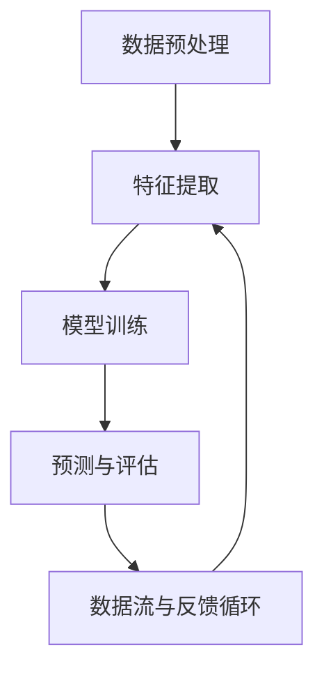

                 

关键词：AI大模型、商品分类、体系优化、深度学习、数据处理

摘要：本文旨在探讨如何利用AI大模型优化商品分类体系。首先，我们将介绍商品分类的重要性，然后深入分析AI大模型在商品分类中的应用，最后提出一些实用的优化策略和未来的发展方向。

## 1. 背景介绍

随着电子商务的蓬勃发展，商品种类和数量呈指数级增长。这种增长带来了巨大的挑战，特别是在商品分类方面。如何有效地对海量的商品进行分类，以便用户能够快速、准确地找到所需商品，成为了一个亟待解决的问题。

传统的商品分类方法主要依赖于人工定义的规则和分类体系，这种方法不仅耗时费力，而且容易出现错误。随着深度学习技术的不断发展，特别是AI大模型的兴起，我们开始探索更加智能化、自动化的商品分类方法。

AI大模型具有强大的数据处理能力和学习能力，能够从海量数据中提取特征，并根据这些特征进行分类。这使得商品分类变得更加高效、准确，同时也为电子商务的发展提供了新的可能性。

## 2. 核心概念与联系

为了更好地理解AI大模型在商品分类体系中的应用，我们首先需要了解一些核心概念和它们之间的联系。

### 2.1 数据预处理

在应用AI大模型之前，首先需要对原始数据（如商品描述、标签、用户行为等）进行预处理。预处理包括数据清洗、数据格式转换、缺失值处理等步骤。这些步骤的目的是提高数据的可用性和一致性，为后续的模型训练和分类提供基础。

### 2.2 特征提取

特征提取是从原始数据中提取出对分类任务有用的信息。在商品分类中，特征可以包括商品的属性（如价格、品牌、类别等）、用户行为（如浏览历史、购买记录等）以及文本信息（如商品描述、评论等）。

### 2.3 模型训练

模型训练是AI大模型的核心环节。通过大量训练数据，模型能够学习到如何将输入数据映射到正确的类别上。训练过程中，模型会不断调整内部参数，以最小化预测误差。

### 2.4 预测与评估

在模型训练完成后，我们可以使用它来对新的商品进行分类预测。预测结果需要通过评估指标（如准确率、召回率、F1分数等）来衡量模型的性能。

### 2.5 数据流与反馈循环

在实际应用中，预测结果会返回给用户，并被用于进一步的数据分析和用户行为推荐。这些反馈信息可以用于模型的迭代训练，以提高分类的准确性。

下面是一个简化的Mermaid流程图，展示上述核心概念和它们之间的联系：



## 3. 核心算法原理 & 具体操作步骤

### 3.1 算法原理概述

AI大模型在商品分类中的核心算法通常是深度学习模型，如卷积神经网络（CNN）或递归神经网络（RNN）。这些模型通过多层神经网络结构，对输入数据进行特征提取和分类。

### 3.2 算法步骤详解

1. **数据收集与预处理**：收集商品描述、标签、用户行为等数据，并进行预处理，如数据清洗、缺失值处理、数据格式转换等。

2. **特征提取**：利用NLP技术（如词嵌入）对文本信息进行处理，提取商品的属性特征和用户行为特征。

3. **模型构建**：构建深度学习模型，如CNN或RNN，设置适当的网络结构和超参数。

4. **模型训练**：使用预处理后的数据对模型进行训练，通过反向传播算法调整模型参数，以最小化预测误差。

5. **模型评估**：使用验证集或测试集对模型进行评估，计算评估指标，如准确率、召回率、F1分数等。

6. **预测与部署**：使用训练好的模型对新的商品进行分类预测，并将预测结果应用于实际场景。

### 3.3 算法优缺点

**优点**：

- **高效性**：AI大模型能够处理大量数据，提高了分类的效率和准确性。
- **灵活性**：深度学习模型可以根据不同的数据特点进行调整，适用于多种场景。
- **可扩展性**：模型可以轻松扩展到新的商品和用户群体，适应不断变化的市场需求。

**缺点**：

- **计算资源需求**：深度学习模型训练需要大量的计算资源和时间。
- **数据依赖性**：模型的性能很大程度上取决于训练数据的质量和数量。
- **解释性不足**：深度学习模型通常被认为是“黑盒”模型，其内部机制难以解释。

### 3.4 算法应用领域

AI大模型在商品分类中的应用不仅限于电子商务领域，还可以扩展到以下领域：

- **零售业**：帮助零售商进行库存管理和商品推荐。
- **物流与配送**：优化物流路径和配送计划。
- **金融业**：对客户进行信用评估和风险评估。
- **医疗保健**：辅助医生进行疾病诊断和治疗方案推荐。

## 4. 数学模型和公式 & 详细讲解 & 举例说明

### 4.1 数学模型构建

在商品分类中，常用的深度学习模型是卷积神经网络（CNN）。CNN的基本结构包括输入层、卷积层、池化层、全连接层和输出层。下面是一个简化的CNN模型构建过程：

1. **输入层**：接收商品描述、标签、用户行为等数据。
2. **卷积层**：对输入数据进行特征提取，通过卷积操作提取局部特征。
3. **池化层**：对卷积结果进行降采样，减少数据维度，提高模型训练速度。
4. **全连接层**：将池化层的结果映射到分类结果。
5. **输出层**：输出分类结果。

### 4.2 公式推导过程

以卷积层为例，其基本公式如下：

$$
\text{output} = \text{激活函数}(\text{weights} \cdot \text{input} + \text{bias})
$$

其中，`weights`是卷积核，`input`是输入数据，`bias`是偏置项，`激活函数`通常是ReLU（Rectified Linear Unit）。

### 4.3 案例分析与讲解

假设我们有一个商品分类任务，需要将商品分为“电子产品”、“服装”、“家居用品”等类别。我们可以使用一个简单的CNN模型来进行分类。

1. **输入层**：输入商品描述、标签和用户行为数据，假设数据维度为100x100像素。
2. **卷积层**：使用一个3x3的卷积核，对输入数据进行卷积操作，提取局部特征。卷积核的权重和偏置初始化为随机值。
3. **池化层**：使用最大池化操作，将卷积结果降采样，减少数据维度。
4. **全连接层**：将池化层的结果映射到分类结果，输出为10个类别（包括“电子产品”、“服装”、“家居用品”等）的得分。
5. **输出层**：根据得分最高的类别进行分类。

通过训练和评估，我们可以调整模型的权重和超参数，以提高分类准确性。

## 5. 项目实践：代码实例和详细解释说明

### 5.1 开发环境搭建

为了实现商品分类，我们需要搭建一个适合深度学习开发的环境。以下是基本的开发环境搭建步骤：

1. 安装Python环境，版本建议为3.7及以上。
2. 安装TensorFlow库，可以使用以下命令：

   ```shell
   pip install tensorflow
   ```

3. 安装其他必要的库，如NumPy、Pandas、Scikit-learn等。

### 5.2 源代码详细实现

下面是一个简单的商品分类代码示例：

```python
import tensorflow as tf
from tensorflow.keras.models import Sequential
from tensorflow.keras.layers import Conv2D, MaxPooling2D, Flatten, Dense

# 数据预处理
# ...

# 构建模型
model = Sequential([
    Conv2D(32, (3, 3), activation='relu', input_shape=(100, 100, 3)),
    MaxPooling2D((2, 2)),
    Conv2D(64, (3, 3), activation='relu'),
    MaxPooling2D((2, 2)),
    Flatten(),
    Dense(64, activation='relu'),
    Dense(10, activation='softmax')
])

# 编译模型
model.compile(optimizer='adam', loss='categorical_crossentropy', metrics=['accuracy'])

# 训练模型
model.fit(x_train, y_train, epochs=10, batch_size=32, validation_data=(x_val, y_val))

# 评估模型
model.evaluate(x_test, y_test)
```

### 5.3 代码解读与分析

上述代码实现了一个简单的卷积神经网络模型，用于商品分类。以下是代码的详细解读：

1. **导入库**：导入TensorFlow库和相关模块。
2. **数据预处理**：这部分代码用于处理输入数据，包括数据清洗、归一化等步骤。在实际项目中，这一部分通常较为复杂，需要进行详细的预处理。
3. **构建模型**：使用Sequential模型构建一个简单的卷积神经网络，包括卷积层、池化层、全连接层等。
4. **编译模型**：设置模型的优化器、损失函数和评估指标。
5. **训练模型**：使用训练数据对模型进行训练，设置训练轮次、批次大小和验证数据。
6. **评估模型**：使用测试数据对训练好的模型进行评估。

### 5.4 运行结果展示

在实际运行中，我们可以使用以下命令来运行整个代码：

```shell
python classify.py
```

运行结果将显示训练和评估过程中的一些指标，如损失函数值、准确率等。通过这些指标，我们可以评估模型的性能，并根据需要进行调整。

## 6. 实际应用场景

AI大模型在商品分类中的应用场景非常广泛。以下是一些典型的应用场景：

1. **电子商务平台**：帮助用户快速找到所需商品，提高购物体验。
2. **零售行业**：优化库存管理和商品推荐，提高销售额。
3. **物流与配送**：优化物流路径和配送计划，提高配送效率。
4. **金融行业**：对客户进行信用评估和风险评估，降低风险。
5. **医疗保健**：辅助医生进行疾病诊断和治疗方案推荐。

在这些应用场景中，AI大模型可以根据不同的业务需求进行调整和优化，以实现最佳效果。

### 6.1 电子商务平台

在电子商务平台中，商品分类是用户体验的重要一环。通过AI大模型，平台可以实时对商品进行分类，并根据用户的历史行为和偏好进行个性化推荐。这不仅可以提高用户的购物体验，还可以提高平台的销售额。

### 6.2 零售行业

在零售行业中，商品分类和推荐对于提高销售额和客户满意度至关重要。AI大模型可以根据库存情况和用户行为，实时调整商品分类和推荐策略，从而优化库存管理和销售计划。

### 6.3 物流与配送

在物流与配送领域，AI大模型可以帮助优化配送路线和配送计划。通过分析商品类型、用户位置和交通状况等数据，模型可以预测最优的配送路径和时间，从而提高配送效率，降低成本。

### 6.4 金融行业

在金融行业中，AI大模型可以对客户进行信用评估和风险评估。通过对客户的交易行为、信用记录等数据进行深度分析，模型可以预测客户的信用状况，从而为金融机构提供决策支持。

### 6.5 医疗保健

在医疗保健领域，AI大模型可以帮助医生进行疾病诊断和治疗方案推荐。通过对患者的历史病历、医学图像等数据进行深度分析，模型可以提供准确的诊断和个性化的治疗方案。

## 7. 工具和资源推荐

为了更好地应用AI大模型进行商品分类，以下是几个推荐的工具和资源：

### 7.1 学习资源推荐

1. **《深度学习》**：由Ian Goodfellow、Yoshua Bengio和Aaron Courville所著，是深度学习领域的经典教材。
2. **《TensorFlow官方文档》**：提供了丰富的TensorFlow库的使用教程和示例代码。
3. **《动手学深度学习》**：由阿斯顿·张等人所著，提供了详细的深度学习实践教程。

### 7.2 开发工具推荐

1. **Google Colab**：一个免费的在线Python开发环境，可以方便地运行深度学习代码。
2. **Jupyter Notebook**：一个交互式的Python开发环境，适合进行数据分析和深度学习实践。
3. **PyTorch**：一个流行的深度学习框架，与TensorFlow类似，提供了丰富的功能和灵活的接口。

### 7.3 相关论文推荐

1. **“Deep Learning for Text Classification”**：该论文介绍了深度学习在文本分类中的应用，包括词嵌入、卷积神经网络等。
2. **“Convolutional Neural Networks for Sentence Classification”**：该论文提出了CNN在句子分类任务中的效果，为商品分类提供了理论基础。
3. **“Recurrent Neural Networks for Language Modeling”**：该论文介绍了RNN在语言模型中的应用，为处理文本数据提供了有效的方法。

## 8. 总结：未来发展趋势与挑战

随着AI大模型的不断发展，商品分类体系将变得更加智能和高效。未来，我们可以期待以下发展趋势：

- **更加精细化的分类**：AI大模型可以处理更加复杂的商品属性和用户行为数据，实现更加精细化的分类。
- **个性化推荐**：基于用户行为和偏好，AI大模型可以提供更加个性化的商品推荐。
- **实时更新**：AI大模型可以实时更新商品分类和推荐策略，以适应市场变化。

然而，AI大模型在商品分类中也面临一些挑战：

- **数据质量和隐私**：高质量的数据是AI大模型的基础，同时，数据隐私保护也是一个重要的挑战。
- **模型解释性**：深度学习模型通常被认为是“黑盒”模型，其内部机制难以解释，这对实际应用带来了一定的困扰。
- **计算资源需求**：深度学习模型的训练和推理需要大量的计算资源，这对硬件设施提出了更高的要求。

未来，我们需要在提高数据质量、增强模型解释性和优化计算资源利用等方面进行深入研究，以充分发挥AI大模型在商品分类中的应用潜力。

## 9. 附录：常见问题与解答

### Q1：AI大模型在商品分类中的具体应用场景有哪些？

A1：AI大模型在商品分类中的具体应用场景包括电子商务平台商品分类、零售行业库存管理和商品推荐、物流与配送路径优化、金融行业客户信用评估、医疗保健疾病诊断和治疗推荐等。

### Q2：如何处理商品分类中的数据质量问题？

A2：处理商品分类中的数据质量问题主要包括数据清洗、缺失值处理、数据格式转换和数据归一化等步骤。这些步骤有助于提高数据的可用性和一致性，为后续的模型训练和分类提供基础。

### Q3：AI大模型的计算资源需求如何？

A3：AI大模型的计算资源需求通常很高，包括GPU或TPU等高性能计算设备和大量的存储空间。在实际应用中，可以根据需求和预算选择合适的硬件设施。

### Q4：如何评估AI大模型在商品分类中的性能？

A4：评估AI大模型在商品分类中的性能通常使用准确率、召回率、F1分数等评估指标。这些指标可以衡量模型的分类准确性和鲁棒性。

### Q5：AI大模型在商品分类中的应用前景如何？

A5：AI大模型在商品分类中的应用前景非常广阔，随着技术的不断发展，模型将变得更加智能和高效。未来，我们可以期待更加精细化的分类、个性化的推荐和实时更新的分类策略。

作者：禅与计算机程序设计艺术 / Zen and the Art of Computer Programming
----------------------------------------------------------------

这篇文章详细介绍了AI大模型在商品分类体系优化中的应用，从背景介绍、核心概念与联系、核心算法原理、数学模型构建、项目实践到实际应用场景，全面探讨了AI大模型在商品分类中的优势和应用前景。同时，文章还提到了未来发展趋势和面临的挑战，为读者提供了深刻的思考和见解。

希望这篇文章能够对您在AI大模型和商品分类方面的研究和实践有所帮助。如果您有任何问题或建议，欢迎随时与我交流。再次感谢您的阅读！

