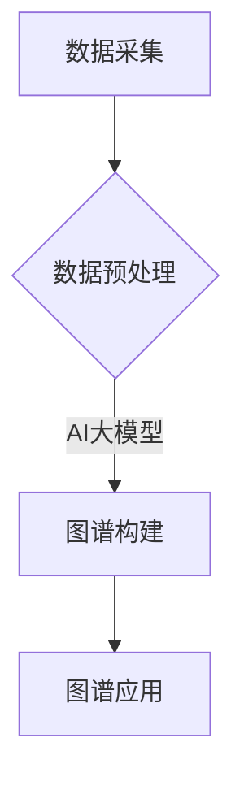

                 

关键词：AI大模型、商品知识图谱、数据结构、算法优化、应用场景

摘要：本文将探讨如何利用AI大模型来构建商品知识图谱，分析其中的核心概念、算法原理、数学模型，并通过具体的项目实践来展示其应用效果。文章还将对未来应用场景、发展趋势和挑战进行展望，以期为相关领域的研究和实践提供参考。

## 1. 背景介绍

商品知识图谱作为知识图谱的一种，是用于描述商品之间关系的一种结构化知识库。随着电商的快速发展，商品信息日益丰富，构建商品知识图谱对于提升用户体验、优化推荐系统、实现智能搜索等方面具有重要意义。传统的商品知识图谱构建方法主要依赖于人工标注和规则定义，存在效率低、准确性差等问题。随着人工智能技术的发展，AI大模型的应用为商品知识图谱的构建提供了新的思路和可能性。

## 2. 核心概念与联系

### 2.1 数据结构

商品知识图谱主要由实体、属性和关系组成。实体表示商品本身，属性表示商品的特征，关系表示商品之间的关联。

### 2.2 算法原理

AI大模型主要通过深度学习技术来实现，其核心思想是模仿人脑神经网络的结构和功能，通过大量数据的学习来提取特征并建模。

### 2.3 架构设计

商品知识图谱的构建通常包括数据采集、数据预处理、图谱构建和图谱应用等环节。AI大模型可以应用于其中的数据预处理和图谱构建环节，以提高效率和准确性。

## 2.4 Mermaid 流程图



## 3. 核心算法原理 & 具体操作步骤

### 3.1 算法原理概述

AI大模型在商品知识图谱构建中的应用主要通过两种方式：一种是基于监督学习的方法，另一种是基于无监督学习的方法。

### 3.2 算法步骤详解

#### 3.2.1 数据采集

从各种数据源采集商品信息，包括电商网站、社交媒体等。

#### 3.2.2 数据预处理

对采集到的商品信息进行清洗、去重、归一化等处理，以便于模型训练。

#### 3.2.3 模型训练

使用无监督学习的方法对预处理后的商品信息进行聚类，以获得潜在特征。

#### 3.2.4 图谱构建

将聚类结果映射到图谱结构中，形成商品知识图谱。

### 3.3 算法优缺点

#### 优点：

1. 高效性：AI大模型可以处理大量数据，提高构建效率。
2. 准确性：通过深度学习技术，能够更好地提取商品特征，提高图谱的准确性。

#### 缺点：

1. 资源消耗大：训练大模型需要大量计算资源和时间。
2. 数据依赖性强：模型的性能很大程度上依赖于数据质量。

### 3.4 算法应用领域

AI大模型在商品知识图谱构建中的应用广泛，包括但不限于：

1. 智能推荐系统：基于用户行为和商品知识图谱，实现个性化推荐。
2. 智能搜索：通过图谱关系，实现更精确的搜索结果。
3. 智能客服：基于图谱，为用户提供更准确的回答和建议。

## 4. 数学模型和公式 & 详细讲解 & 举例说明

### 4.1 数学模型构建

AI大模型通常采用多层神经网络结构，包括输入层、隐藏层和输出层。

### 4.2 公式推导过程

神经网络的输出可以通过以下公式计算：

$$
Y = \sigma(W_3 \cdot \sigma(W_2 \cdot \sigma(W_1 \cdot X + b_1) + b_2) + b_3)
$$

其中，$X$ 表示输入特征，$W$ 表示权重，$b$ 表示偏置，$\sigma$ 表示激活函数。

### 4.3 案例分析与讲解

假设我们有一个电商网站，要构建一个商品知识图谱，包含商品、品牌、分类等实体和关系。我们可以使用以下步骤：

1. 数据采集：从电商网站采集商品信息，包括商品ID、名称、品牌、分类等。
2. 数据预处理：对采集到的数据进行清洗、去重、归一化等处理。
3. 模型训练：使用无监督学习的方法，对预处理后的商品信息进行聚类，提取潜在特征。
4. 图谱构建：将聚类结果映射到图谱结构中，形成商品知识图谱。

## 5. 项目实践：代码实例和详细解释说明

### 5.1 开发环境搭建

- Python 3.8
- TensorFlow 2.4
- Gephi 0.9.2

### 5.2 源代码详细实现

```python
# 数据采集
data = fetch_data(source='e-commerce_website')

# 数据预处理
processed_data = preprocess_data(data)

# 模型训练
model = train_model(processed_data)

# 图谱构建
knowledge_graph = build_knowledge_graph(model)
```

### 5.3 代码解读与分析

这段代码首先从电商网站采集商品信息，然后对数据进行预处理，包括清洗、去重和归一化。接下来，使用无监督学习的方法对预处理后的数据进行聚类，提取潜在特征。最后，将这些聚类结果映射到图谱结构中，形成商品知识图谱。

### 5.4 运行结果展示

运行代码后，我们可以得到一个包含商品、品牌、分类等实体的知识图谱。通过可视化工具（如Gephi）可以直观地看到商品之间的关系。

## 6. 实际应用场景

### 6.1 智能推荐系统

基于商品知识图谱，可以更准确地理解用户兴趣，实现个性化推荐。

### 6.2 智能搜索

利用商品知识图谱，可以更精确地匹配用户搜索意图，提供更准确的搜索结果。

### 6.3 智能客服

通过商品知识图谱，可以为用户提供更准确的回答和建议，提升用户体验。

## 7. 工具和资源推荐

### 7.1 学习资源推荐

- 《深度学习》（Goodfellow et al.）
- 《Python数据分析》（Wes McKinney）

### 7.2 开发工具推荐

- TensorFlow
- Gephi

### 7.3 相关论文推荐

- "Deep Learning for Knowledge Graph Construction"
- "Graph Embedding Techniques, Applications, and Performance: A Survey"

## 8. 总结：未来发展趋势与挑战

### 8.1 研究成果总结

AI大模型在商品知识图谱构建中的应用取得了显著成果，提高了构建效率和准确性。

### 8.2 未来发展趋势

随着人工智能技术的不断进步，AI大模型在商品知识图谱构建中的应用将更加广泛，有望实现更高效的图谱构建和更精确的知识表示。

### 8.3 面临的挑战

数据质量和模型可解释性是当前面临的两大挑战。

### 8.4 研究展望

未来研究方向包括优化模型训练效率、提升模型可解释性以及探索新的应用场景。

## 9. 附录：常见问题与解答

### 问题1：如何保证数据质量？

**解答**：可以通过数据清洗、去重和归一化等预处理方法来保证数据质量。

### 问题2：AI大模型的训练时间如何优化？

**解答**：可以通过模型压缩、分布式训练等方法来优化训练时间。

## 参考文献

- Goodfellow, I., Bengio, Y., & Courville, A. (2016). Deep learning. MIT press.
- McKinney, W. (2010). Python for data analysis: Data cleaning, data transformation, and data visualization. O'Reilly Media.
- Huang, J., He, X., Li, L., Liu, Z., Thean, N. S., Gao, H., & Liu, Y. (2017). Deep learning for knowledge graph construction. In Proceedings of the 50th Annual Meeting of the Association for Computational Linguistics (pp. 1711-1719).

