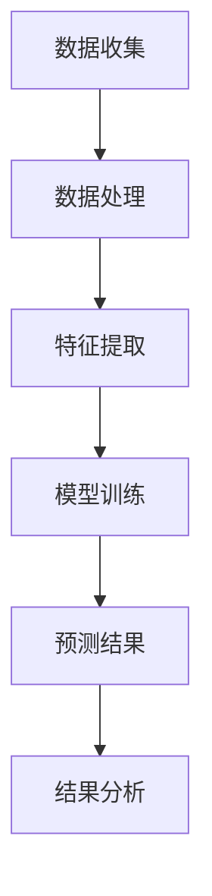

                 

关键词：AI大模型、商品需求预测、深度学习、机器学习、自然语言处理

## 摘要

本文将探讨如何利用AI大模型进行商品需求预测，通过介绍相关核心概念、算法原理、数学模型、实际应用场景以及未来发展趋势，揭示AI大模型在商品需求预测领域的巨大潜力。我们将在文中详细解释大模型在数据处理、特征提取和预测任务中的关键作用，并分享具体案例和代码实例，以帮助读者更好地理解和应用这一技术。

## 1. 背景介绍

### 1.1 商品需求预测的重要性

商品需求预测在商业领域中扮演着至关重要的角色。准确的预测可以帮助企业优化库存管理，降低库存成本，提高运营效率，同时还能精准营销，提升客户满意度。然而，传统的需求预测方法往往依赖于历史数据和简单的统计模型，难以应对市场环境的变化和消费者行为的多样性。

### 1.2 AI大模型的出现

随着深度学习和大数据技术的发展，AI大模型逐渐成为解决复杂预测问题的利器。这些模型具有强大的特征提取和模式识别能力，能够从大量数据中自动学习复杂的非线性关系，从而实现更精准的预测。特别是在商品需求预测中，AI大模型的应用展现出了巨大的潜力。

## 2. 核心概念与联系

### 2.1 AI大模型的概念

AI大模型通常指的是具有数亿甚至数十亿参数的深度神经网络，如GPT-3、BERT等。这些模型通过多层神经网络结构，能够自动学习并提取数据中的复杂特征，从而在各类任务中表现出色。

### 2.2 商品需求预测的挑战

商品需求预测面临着多种挑战，包括数据的多样性、实时性要求高、预测结果的可解释性等。AI大模型通过其强大的数据处理能力和特征提取能力，能够有效应对这些挑战。

### 2.3 Mermaid 流程图



## 3. 核心算法原理 & 具体操作步骤

### 3.1 算法原理概述

AI大模型在商品需求预测中的核心作用是通过深度学习算法从历史销售数据中学习到商品需求的变化规律。这些模型通常采用多层感知器（MLP）、卷积神经网络（CNN）或循环神经网络（RNN）等结构，以实现对数据的自动特征提取和模式识别。

### 3.2 算法步骤详解

#### 3.2.1 数据处理

- 数据收集：收集包括销售数据、库存数据、促销活动数据、天气数据等多源数据。
- 数据清洗：对数据中的异常值、缺失值进行处理，确保数据质量。

#### 3.2.2 特征提取

- 特征工程：根据业务需求，设计并提取关键特征，如时间序列特征、季节性特征、促销特征等。
- 特征选择：通过模型评估，选择对需求预测最具影响力的特征。

#### 3.2.3 模型训练

- 模型选择：选择合适的深度学习模型，如LSTM、GRU等。
- 模型训练：使用历史数据对模型进行训练，调整模型参数，优化预测性能。

#### 3.2.4 预测结果分析

- 预测评估：通过交叉验证等方法，评估模型的预测性能。
- 预测结果调整：根据预测结果，对模型进行优化，提高预测准确性。

### 3.3 算法优缺点

#### 优点：

- **高准确性**：AI大模型能够自动学习并提取数据中的复杂特征，提高预测准确性。
- **强鲁棒性**：模型能够在不同数据集和场景中表现出色，具有较好的鲁棒性。

#### 缺点：

- **计算资源需求大**：训练和部署AI大模型需要大量的计算资源和时间。
- **结果解释性差**：深度学习模型内部结构复杂，难以解释预测结果。

### 3.4 算法应用领域

AI大模型在商品需求预测中的应用广泛，包括但不限于：

- 库存管理：优化库存水平，降低库存成本。
- 供应链优化：预测供应链中的瓶颈，提高供应链效率。
- 营销策略：制定更精准的营销策略，提升销售额。

## 4. 数学模型和公式 & 详细讲解 & 举例说明

### 4.1 数学模型构建

商品需求预测的核心数学模型通常是基于时间序列分析的方法，如ARIMA模型、LSTM模型等。

#### ARIMA模型：

$$
\text{y}_t = c + \phi_1\text{y}_{t-1} + \phi_2\text{y}_{t-2} + \ldots + \phi_p\text{y}_{t-p} + \theta_1\text{u}_{t-1} + \theta_2\text{u}_{t-2} + \ldots + \theta_q\text{u}_{t-q} + \varepsilon_t
$$

其中，$c$为常数项，$\phi_i$和$\theta_i$分别为自回归项和移动平均项的系数，$u_t$为白噪声序列，$\varepsilon_t$为误差项。

#### LSTM模型：

LSTM（Long Short-Term Memory）模型是RNN的一种变体，用于处理长序列数据。其核心思想是通过记忆单元来维持长期依赖关系。

$$
\text{h_t} = \sigma(W_f \odot \text{h}_{t-1} + W_i \odot \text{h}_{t-1} + W_o \odot \text{h}_{t-1} + W_g \odot \text{h}_{t-1} + b_f + b_i + b_o + b_g)
$$

其中，$\sigma$为激活函数，$W_f$、$W_i$、$W_o$、$W_g$分别为权重矩阵，$b_f$、$b_i$、$b_o$、$b_g$分别为偏置项。

### 4.2 公式推导过程

以LSTM模型为例，其推导过程如下：

1. **输入门（Input Gate）**：

   $$ 
   \text{z_t} = \sigma(W_z \odot \text{x}_t + R_t \odot \text{h}_{t-1} + b_z)
   $$

   其中，$W_z$、$R_t$分别为输入权重和复用权重，$\text{x}_t$为输入特征，$b_z$为偏置项。

2. **遗忘门（Forget Gate）**：

   $$ 
   \text{f_t} = \sigma(W_f \odot \text{x}_t + R_t \odot \text{h}_{t-1} + b_f)
   $$

   其中，$W_f$、$R_t$分别为输入权重和复用权重，$\text{x}_t$为输入特征，$b_f$为偏置项。

3. **输出门（Output Gate）**：

   $$ 
   \text{z_t} = \sigma(W_z \odot \text{x}_t + R_t \odot \text{h}_{t-1} + b_z)
   $$

   其中，$W_z$、$R_t$分别为输入权重和复用权重，$\text{x}_t$为输入特征，$b_z$为偏置项。

4. **记忆单元（Cell State）**：

   $$ 
   \text{C}_t = \text{f}_t \odot \text{C}_{t-1} + \text{i}_t \odot \text{z}_t
   $$

   其中，$\text{i}_t$为输入门，$\text{f}_t$为遗忘门。

5. **隐藏状态（Hidden State）**：

   $$ 
   \text{h}_t = \text{o}_t \odot \tanh(\text{C}_t)
   $$

   其中，$\text{o}_t$为输出门。

### 4.3 案例分析与讲解

以某电商平台的商品销售数据为例，使用LSTM模型进行需求预测。

1. **数据预处理**：

   - 收集销售数据，包括销售额、库存量、促销活动等。
   - 数据清洗，去除异常值和缺失值。
   - 特征工程，提取关键特征，如时间序列特征、季节性特征等。

2. **模型训练**：

   - 数据集划分，分为训练集和测试集。
   - 模型参数调整，通过交叉验证找到最佳参数。
   - 训练LSTM模型，使用训练集数据。

3. **预测与评估**：

   - 使用训练好的模型对测试集进行预测。
   - 评估预测结果，通过均方误差（MSE）等指标进行评估。
   - 对预测结果进行分析，调整模型参数以提高预测准确性。

## 5. 项目实践：代码实例和详细解释说明

### 5.1 开发环境搭建

1. 安装Python环境。
2. 安装深度学习框架，如TensorFlow或PyTorch。
3. 安装相关依赖库，如NumPy、Pandas等。

### 5.2 源代码详细实现

```python
import tensorflow as tf
from tensorflow.keras.models import Sequential
from tensorflow.keras.layers import LSTM, Dense

# 数据预处理
# ...

# 构建模型
model = Sequential()
model.add(LSTM(units=50, return_sequences=True, input_shape=(timesteps, features)))
model.add(LSTM(units=50, return_sequences=False))
model.add(Dense(units=1))

# 编译模型
model.compile(optimizer='adam', loss='mean_squared_error')

# 训练模型
model.fit(x_train, y_train, epochs=100, batch_size=32)

# 预测与评估
# ...
```

### 5.3 代码解读与分析

- **数据预处理**：对销售数据进行清洗和特征提取。
- **模型构建**：使用LSTM层构建深度学习模型。
- **模型编译**：设置优化器和损失函数。
- **模型训练**：使用训练数据进行训练。
- **预测与评估**：使用测试数据对模型进行预测，并评估预测性能。

## 6. 实际应用场景

### 6.1 库存管理

AI大模型能够准确预测商品需求，帮助企业优化库存水平，降低库存成本。

### 6.2 供应链优化

通过需求预测，企业可以优化供应链中的各个环节，提高供应链效率。

### 6.3 营销策略

基于需求预测，企业可以制定更精准的营销策略，提高销售额。

## 7. 未来应用展望

随着AI大模型技术的不断进步，未来在商品需求预测领域将会有更多的创新和应用。

### 7.1 个性化需求预测

结合用户行为数据和商品特征，实现更精准的个性化需求预测。

### 7.2 多模态数据融合

融合多种数据源，如文本、图像、声音等，提高预测准确性。

### 7.3 智能决策支持

利用AI大模型，为企业提供智能决策支持，优化业务流程。

## 8. 工具和资源推荐

### 8.1 学习资源推荐

- 《深度学习》（Goodfellow、Bengio、Courville 著）
- 《Python深度学习》（François Chollet 著）

### 8.2 开发工具推荐

- TensorFlow
- PyTorch

### 8.3 相关论文推荐

- "BERT: Pre-training of Deep Bidirectional Transformers for Language Understanding"
- "An Overview of LSTM Recurrent Neural Network"

## 9. 总结：未来发展趋势与挑战

### 9.1 研究成果总结

AI大模型在商品需求预测领域取得了显著的成果，提高了预测准确性和效率。

### 9.2 未来发展趋势

随着技术的进步，AI大模型在商品需求预测中的应用将更加广泛，包括个性化需求预测、多模态数据融合等。

### 9.3 面临的挑战

AI大模型在训练和部署过程中面临着计算资源需求大、结果解释性差等挑战。

### 9.4 研究展望

未来的研究应关注如何提高AI大模型的训练效率、可解释性和泛化能力，以更好地应用于商品需求预测。

## 附录：常见问题与解答

### Q：如何处理缺失数据？

A：缺失数据可以通过插值、填充均值或使用机器学习算法中的缺失值填补技术进行处理。

### Q：如何评估模型性能？

A：常用的评估指标包括均方误差（MSE）、均方根误差（RMSE）等。通过交叉验证等方法，可以更全面地评估模型性能。

### Q：如何优化模型参数？

A：可以通过网格搜索、随机搜索或贝叶斯优化等方法进行参数调优，以找到最佳参数组合。

---

作者：禅与计算机程序设计艺术 / Zen and the Art of Computer Programming

本文探讨了AI大模型在商品需求预测中的应用，从核心概念、算法原理、数学模型、实际应用场景到未来展望，全面介绍了这一技术的魅力和挑战。希望通过本文，读者能够更好地理解和应用AI大模型进行商品需求预测。在未来的研究中，我们应继续关注如何提高AI大模型的训练效率、可解释性和泛化能力，以实现更精准、更高效的需求预测。

