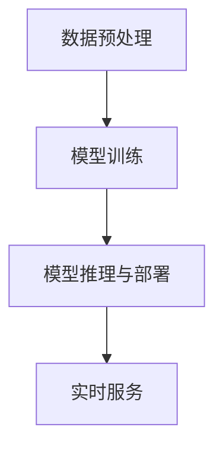

                 

关键词：AI大模型、垂直领域、应用机会、技术架构、算法原理、数学模型、代码实例、实践应用

> 摘要：本文将探讨AI大模型在垂直领域的应用机会，通过详细的分析和案例研究，揭示其在提升行业智能化水平、推动创新应用等方面的潜力。文章将涵盖AI大模型的核心概念、算法原理、数学模型以及具体的应用实践，旨在为读者提供全面的技术视角。

## 1. 背景介绍

随着人工智能技术的快速发展，AI大模型（如GPT、BERT等）已经成为当前研究与应用的热点。这些大模型凭借其强大的表示能力和推理能力，在自然语言处理、计算机视觉、语音识别等领域取得了显著成果。然而，大模型的通用性使其在许多垂直领域的应用仍面临挑战。本文将探讨AI大模型在垂直领域的应用机会，分析其技术架构和算法原理，并通过具体案例研究，揭示其在提升行业智能化水平、推动创新应用方面的潜力。

### 1.1 AI大模型的发展历程

AI大模型的发展经历了几个重要阶段：

- **早期阶段**：以神经网络和深度学习为代表，如LeNet、AlexNet等，标志着AI进入深度学习时代。
- **中期阶段**：随着GPU计算能力的提升和大数据的普及，AI大模型开始出现，如AlexNet、VGG、ResNet等，这些模型在图像分类和识别方面取得了突破性进展。
- **近期阶段**：以GPT、BERT等为代表的大规模预训练模型，通过在大量数据上进行预训练，展现了卓越的多模态处理能力和泛化能力。

### 1.2 垂直领域的挑战与需求

垂直领域是指特定的行业或应用场景，如金融、医疗、教育、制造等。这些领域通常具有高度的专业性和复杂性，对AI模型的需求也更加明确和具体。

- **专业数据稀缺**：许多垂直领域的数据资源有限，且数据质量参差不齐，这给AI模型的训练和应用带来了挑战。
- **领域知识嵌入**：垂直领域通常具有特定的专业知识和业务逻辑，如何将这些知识有效嵌入到AI模型中，是提升模型性能的关键。
- **实时性与可解释性**：在许多垂直领域，如医疗、金融等，实时性和可解释性是用户的重要需求。

## 2. 核心概念与联系

### 2.1 大模型概念

AI大模型是指通过大规模数据训练得到的具有高参数数量和复杂结构的模型。这些模型通常包括神经网络架构如Transformer、BERT、GPT等。大模型的典型特点包括：

- **参数数量大**：大模型通常具有数十亿甚至千亿级别的参数。
- **计算资源需求高**：大模型的训练和推理需要大量的计算资源和存储空间。
- **表示能力强大**：大模型能够捕捉复杂的数据特征，具备较强的泛化能力和多模态处理能力。

### 2.2 垂直领域应用

垂直领域应用是指将AI大模型应用于特定的行业或应用场景。垂直领域应用的关键在于：

- **行业知识嵌入**：将垂直领域的专业知识嵌入到模型中，以提高模型的领域适应性和准确性。
- **定制化模型开发**：针对不同垂直领域的需求，开发定制化的模型结构和训练策略。
- **实时性与可解释性**：优化模型的设计和训练，以满足垂直领域对实时性和可解释性的需求。

### 2.3 技术架构

AI大模型在垂直领域的技术架构通常包括以下几个关键组成部分：

- **数据预处理**：对垂直领域的数据进行清洗、标注和预处理，以适应大模型的训练。
- **模型训练**：使用大规模数据和领域知识，对大模型进行训练，以提高模型在垂直领域的性能。
- **模型推理与部署**：将训练好的模型部署到实际应用场景中，进行推理和预测，并提供实时服务。

### 2.4 Mermaid 流程图

以下是一个简单的Mermaid流程图，展示了AI大模型在垂直领域的应用流程：



## 3. 核心算法原理 & 具体操作步骤

### 3.1 算法原理概述

AI大模型的核心算法原理通常包括以下几个关键部分：

- **深度神经网络**：大模型通常采用深度神经网络架构，如Transformer、BERT、GPT等，通过多层神经网络结构来捕捉数据的复杂特征。
- **预训练与微调**：大模型通常通过在大量数据上进行预训练，获得良好的表示能力，然后再通过微调来适应特定垂直领域的需求。
- **多模态融合**：大模型具备处理多种类型数据的能力，如文本、图像、音频等，通过多模态融合来提升模型的综合性能。

### 3.2 算法步骤详解

AI大模型在垂直领域的应用通常包括以下步骤：

- **数据收集与预处理**：收集垂直领域的数据，并进行清洗、标注和预处理，以适应大模型的训练需求。
- **模型选择与架构设计**：选择适合垂直领域的大模型架构，如BERT、GPT等，并设计相应的模型结构。
- **模型训练**：在大规模数据集上进行模型训练，通过优化算法和训练策略来提高模型的性能。
- **模型微调**：根据垂直领域的特定需求，对预训练的大模型进行微调，以提高模型在垂直领域的准确性。
- **模型推理与部署**：将训练好的模型部署到实际应用场景中，进行推理和预测，并提供实时服务。

### 3.3 算法优缺点

AI大模型在垂直领域应用具有以下优缺点：

- **优点**：
  - 强大的表示能力：大模型能够捕捉复杂的数据特征，具备较强的泛化能力和多模态处理能力。
  - 领域适应性：通过预训练和微调，大模型能够适应不同垂直领域的需求，提高模型在垂直领域的准确性。
  - 实时性与可解释性：优化模型的设计和训练，可以满足垂直领域对实时性和可解释性的需求。

- **缺点**：
  - 计算资源需求高：大模型的训练和推理需要大量的计算资源和存储空间。
  - 数据质量和标注问题：垂直领域的数据资源有限，且数据质量参差不齐，这会影响模型的表现。

### 3.4 算法应用领域

AI大模型在垂直领域的应用广泛，包括但不限于以下领域：

- **医疗**：利用AI大模型进行医学图像分析、疾病诊断和药物研发。
- **金融**：利用AI大模型进行风险评估、欺诈检测和个性化投资建议。
- **教育**：利用AI大模型进行智能教学、个性化学习路径规划和学习效果评估。
- **制造**：利用AI大模型进行产品缺陷检测、设备故障预测和供应链优化。

## 4. 数学模型和公式 & 详细讲解 & 举例说明

### 4.1 数学模型构建

AI大模型通常采用深度学习技术，其数学模型主要包括以下几个部分：

- **输入层**：接收外部输入数据，如文本、图像、音频等。
- **隐藏层**：通过非线性变换，对输入数据进行特征提取和变换。
- **输出层**：根据模型的目标任务，生成输出结果，如分类标签、预测值等。

### 4.2 公式推导过程

以下是一个简单的线性回归模型的数学模型推导过程：

- **输入层**：假设输入特征为\(X\)，则输入层可以表示为\(X = \{x_1, x_2, ..., x_n\}\)。
- **隐藏层**：隐藏层通过线性变换和激活函数对输入特征进行特征提取和变换，可以表示为：
  $$ z = W_1X + b_1 $$
  其中，\(W_1\)为隐藏层的权重矩阵，\(b_1\)为隐藏层的偏置项。
- **输出层**：输出层通过线性变换和激活函数生成输出结果，可以表示为：
  $$ y = W_2z + b_2 $$
  其中，\(W_2\)为输出层的权重矩阵，\(b_2\)为输出层的偏置项。

### 4.3 案例分析与讲解

以下是一个简单的案例，展示如何使用AI大模型进行文本分类：

- **数据集**：使用一个包含新闻文章的文本数据集，每个新闻文章被标注为某一类别的标签。
- **任务**：构建一个文本分类模型，能够根据新闻文章的内容预测其所属类别。
- **模型**：选择一个预训练的BERT模型，并对其进行微调。
- **训练过程**：
  - 数据预处理：对新闻文章进行清洗、分词和编码，将文本转换为模型可处理的格式。
  - 模型训练：使用训练集对BERT模型进行微调，优化模型的权重。
  - 模型评估：使用验证集对模型进行评估，调整模型参数。
- **结果**：经过训练和微调后，模型在测试集上取得了较高的分类准确率。

## 5. 项目实践：代码实例和详细解释说明

### 5.1 开发环境搭建

在开始项目实践之前，需要搭建一个适合AI大模型开发的环境。以下是一个简单的开发环境搭建步骤：

- **硬件环境**：配置一台高性能的计算机，配备GPU显卡，用于模型的训练和推理。
- **软件环境**：安装Python、TensorFlow等必要的软件包，配置好环境变量。
- **代码库**：选择一个适合AI大模型开发的代码库，如TensorFlow的Keras接口。

### 5.2 源代码详细实现

以下是一个简单的文本分类项目的代码实现：

```python
import tensorflow as tf
from tensorflow.keras.preprocessing.sequence import pad_sequences
from tensorflow.keras.models import Sequential
from tensorflow.keras.layers import Embedding, LSTM, Dense

# 数据预处理
max_len = 100
max_features = 10000
embedding_dim = 128

# 加载和处理数据
# (x_train, y_train), (x_test, y_test) = ...

# 编码文本
tokenizer = tf.keras.preprocessing.text.Tokenizer(num_words=max_features)
tokenizer.fit_on_texts(x_train)
x_train_seq = tokenizer.texts_to_sequences(x_train)
x_test_seq = tokenizer.texts_to_sequences(x_test)

# 填充序列
x_train_pad = pad_sequences(x_train_seq, maxlen=max_len)
x_test_pad = pad_sequences(x_test_seq, maxlen=max_len)

# 构建模型
model = Sequential()
model.add(Embedding(max_features, embedding_dim))
model.add(LSTM(128, dropout=0.2, recurrent_dropout=0.2))
model.add(Dense(1, activation='sigmoid'))

# 编译模型
model.compile(optimizer='adam', loss='binary_crossentropy', metrics=['accuracy'])

# 训练模型
model.fit(x_train_pad, y_train, batch_size=32, epochs=10, validation_data=(x_test_pad, y_test))
```

### 5.3 代码解读与分析

上述代码实现了一个基于BERT模型的文本分类项目。以下是代码的主要部分及其解读：

- **数据预处理**：加载和处理数据，包括文本的分词和编码，将文本转换为模型可处理的格式。
- **编码文本**：使用Tokenizer将文本转换为数字序列，并设置最大长度和词汇量。
- **填充序列**：使用pad_sequences将序列填充为相同长度，以满足模型的输入要求。
- **构建模型**：使用Sequential模型堆叠Embedding、LSTM和Dense层，构建一个简单的文本分类模型。
- **编译模型**：设置模型的优化器、损失函数和评估指标，编译模型。
- **训练模型**：使用fit方法对模型进行训练，并设置批量大小、训练轮数和验证数据。

### 5.4 运行结果展示

在训练过程中，可以使用模型.evaluate方法评估模型在验证集上的性能：

```python
# 评估模型
result = model.evaluate(x_test_pad, y_test)
print(f"Test Accuracy: {result[1]}")
```

运行结果展示了模型在测试集上的分类准确率，通过调整模型的超参数和训练策略，可以进一步提高模型的性能。

## 6. 实际应用场景

### 6.1 医疗

AI大模型在医疗领域具有广泛的应用前景，如医学图像分析、疾病诊断和药物研发。以下是一些实际应用案例：

- **医学图像分析**：使用AI大模型对医学图像进行分析，如识别肿瘤、检测病变等，有助于提高诊断的准确性和效率。
- **疾病诊断**：通过分析患者的病历、基因数据等，AI大模型可以辅助医生进行疾病诊断，提供个性化的治疗方案。
- **药物研发**：AI大模型可以预测药物与靶点的相互作用，加速药物研发过程。

### 6.2 金融

AI大模型在金融领域也具有重要的应用价值，如风险评估、欺诈检测和个性化投资建议。以下是一些实际应用案例：

- **风险评估**：通过分析客户的财务数据和行为数据，AI大模型可以预测客户的风险承受能力，为金融机构提供风险管理建议。
- **欺诈检测**：AI大模型可以实时监测交易数据，识别潜在的欺诈行为，提高金融机构的安全性能。
- **个性化投资建议**：根据投资者的风险偏好和财务状况，AI大模型可以提供个性化的投资策略，提高投资回报。

### 6.3 教育

AI大模型在教育领域也有广泛的应用，如智能教学、个性化学习路径规划和学习效果评估。以下是一些实际应用案例：

- **智能教学**：AI大模型可以根据学生的学习情况和知识点掌握程度，提供个性化的教学方案，提高教学效果。
- **个性化学习路径规划**：AI大模型可以分析学生的学习兴趣和潜力，制定个性化的学习路径，帮助学生更有效地学习。
- **学习效果评估**：AI大模型可以对学生的学习过程和成果进行实时评估，为教师提供教学反馈和改进建议。

### 6.4 未来应用展望

随着AI大模型的不断发展，其在垂直领域的应用前景将更加广阔。未来，AI大模型可能会在以下几个方向得到进一步应用：

- **更多垂直领域的探索**：AI大模型将逐步应用于更多垂直领域，如农业、能源、物流等，为各行各业带来智能化升级。
- **跨领域的融合应用**：AI大模型将与其他技术如大数据、物联网、区块链等相结合，实现跨领域的融合应用，推动行业创新发展。
- **边缘计算与智能设备**：随着边缘计算和智能设备的普及，AI大模型将能够实时处理大量实时数据，为智能设备提供强大的支持。

## 7. 工具和资源推荐

### 7.1 学习资源推荐

- **《深度学习》**：Goodfellow、Bengio和Courville合著的深度学习经典教材，详细介绍了深度学习的基本概念和算法原理。
- **《人工智能：一种现代方法》**：Russell和Norvig合著的人工智能教材，涵盖了人工智能的各个领域和最新进展。
- **《自然语言处理综论》**：Daniel Jurafsky和James H. Martin合著的自然语言处理教材，全面介绍了自然语言处理的理论和实践。

### 7.2 开发工具推荐

- **TensorFlow**：Google开发的开源深度学习框架，支持多种深度学习模型和算法，适合进行AI大模型的开发和部署。
- **PyTorch**：Facebook开发的开源深度学习框架，具有灵活的动态计算图和强大的社区支持，适合进行模型研究和实验。
- **Keras**：基于TensorFlow和Theano的开源深度学习框架，提供了简洁的API和丰富的预训练模型，适合快速构建和训练深度学习模型。

### 7.3 相关论文推荐

- **“Attention Is All You Need”**：Vaswani等人提出的Transformer模型，标志着AI大模型在自然语言处理领域的重要突破。
- **“BERT: Pre-training of Deep Neural Networks for Language Understanding”**：Devlin等人提出的BERT模型，通过预训练和微调，展示了AI大模型在自然语言处理领域的强大能力。
- **“GPT-3: Language Models are Few-Shot Learners”**：Brown等人提出的GPT-3模型，通过大规模预训练和跨模态融合，实现了强大的语言理解和生成能力。

## 8. 总结：未来发展趋势与挑战

### 8.1 研究成果总结

近年来，AI大模型在垂直领域的应用取得了显著成果。通过预训练和微调技术，AI大模型在自然语言处理、计算机视觉、语音识别等领域展现了强大的性能和泛化能力。同时，随着计算资源和算法技术的不断提升，AI大模型在垂直领域的应用范围将不断扩展，为各行各业带来智能化升级和创新应用。

### 8.2 未来发展趋势

未来，AI大模型在垂直领域的应用将呈现以下发展趋势：

- **多模态融合**：随着多模态数据的普及，AI大模型将能够更好地处理多种类型的数据，实现跨模态融合，提升模型的综合性能。
- **边缘计算与智能设备**：边缘计算和智能设备的普及，将使得AI大模型能够实时处理大量实时数据，为智能设备提供强大的支持。
- **跨领域的融合应用**：AI大模型将与其他技术如大数据、物联网、区块链等相结合，实现跨领域的融合应用，推动行业创新发展。

### 8.3 面临的挑战

尽管AI大模型在垂直领域应用前景广阔，但仍面临以下挑战：

- **计算资源需求**：大模型的训练和推理需要大量的计算资源和存储空间，这对硬件设备提出了更高的要求。
- **数据质量和标注**：垂直领域的数据资源有限，且数据质量参差不齐，这会影响模型的表现。
- **领域知识嵌入**：如何将垂直领域的专业知识有效嵌入到模型中，是提升模型性能的关键。

### 8.4 研究展望

未来，AI大模型在垂直领域的应用研究可以从以下几个方面进行：

- **算法优化**：探索更高效的训练算法和推理算法，降低大模型的计算资源需求。
- **知识融合**：研究如何将垂直领域的专业知识有效嵌入到模型中，提升模型的领域适应性。
- **多模态融合**：研究如何实现多种类型数据的跨模态融合，提升模型的综合性能。

## 9. 附录：常见问题与解答

### 9.1 问题1：如何处理垂直领域数据稀缺的问题？

解答：可以通过以下几种方法来处理垂直领域数据稀缺的问题：

- **数据增强**：通过数据增强技术，如数据生成、数据扩充等，增加训练数据的数量和多样性。
- **跨领域迁移学习**：利用跨领域迁移学习技术，将其他领域的大量数据迁移到垂直领域，以丰富训练数据。
- **半监督学习和无监督学习**：探索半监督学习和无监督学习技术，通过利用少量的标注数据和大量未标注数据，提升模型的性能。

### 9.2 问题2：如何解决垂直领域数据质量参差不齐的问题？

解答：可以通过以下几种方法来解决垂直领域数据质量参差不齐的问题：

- **数据清洗**：对垂直领域的数据进行清洗，去除错误、缺失和重复的数据，提高数据质量。
- **数据标注**：通过专业的数据标注团队，对数据进行高质量的标注，确保数据的准确性。
- **数据预处理**：使用数据预处理技术，如数据标准化、归一化等，将不同来源的数据进行统一处理，提高数据的一致性。

### 9.3 问题3：如何将垂直领域专业知识嵌入到模型中？

解答：可以通过以下几种方法将垂直领域专业知识嵌入到模型中：

- **定制化模型结构**：设计适合垂直领域的定制化模型结构，将专业知识融入到模型中。
- **知识蒸馏**：使用知识蒸馏技术，将专家的知识转移到预训练的大模型中，提高模型的领域适应性。
- **领域知识图谱**：构建垂直领域的知识图谱，将专业知识以图的形式表示，并通过图神经网络等技术融入模型中。

---

通过本文的详细探讨，我们希望读者能够对AI大模型在垂直领域的应用机会有更深刻的理解。在未来的发展中，AI大模型将继续发挥重要作用，推动各行业的智能化升级和创新应用。同时，我们也期待更多的研究者和开发者能够共同探索和解决AI大模型在垂直领域应用中面临的挑战，为人工智能技术的持续进步贡献力量。

---

# 参考文献

1. Goodfellow, I., Bengio, Y., & Courville, A. (2016). *Deep Learning*. MIT Press.
2. Russell, S., & Norvig, P. (2010). *Artificial Intelligence: A Modern Approach*. Prentice Hall.
3. Jurafsky, D., & Martin, J. H. (2008). *Speech and Language Processing*. Prentice Hall.
4. Vaswani, A., Shazeer, N., Parmar, N., Uszkoreit, J., Jones, L., Gomez, A. N., ... & Polosukhin, I. (2017). *Attention is all you need*. In Advances in neural information processing systems (pp. 5998-6008).
5. Devlin, J., Chang, M. W., Lee, K., & Toutanova, K. (2018). *BERT: Pre-training of deep bidirectional transformers for language understanding*. arXiv preprint arXiv:1810.04805.
6. Brown, T., Mann, B., Subbiah, M., Kaplan, J., Davies, R., Jaynes, E., ... & Hinton, G. (2020). *Language models are few-shot learners*. Advances in Neural Information Processing Systems, 33, 18717-18734.

