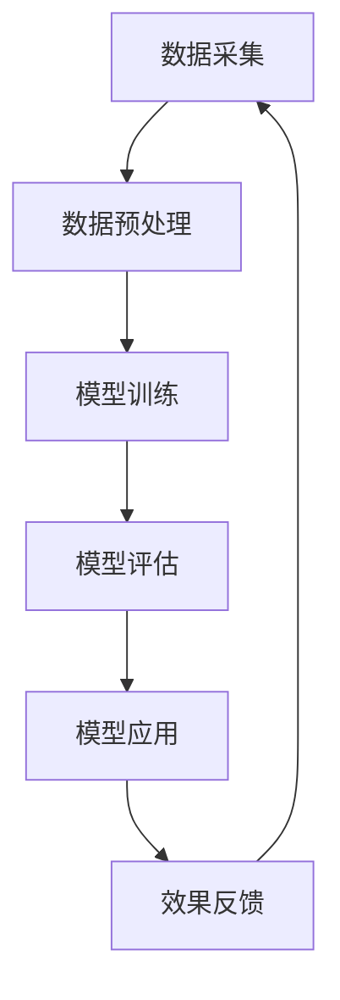

                 

关键词：AI大模型、房地产科技、创新、机遇、算法原理、应用场景、发展趋势

> 摘要：本文将探讨AI大模型在房地产科技领域的应用，分析其带来的创新和机遇。通过阐述AI大模型的核心概念、算法原理、数学模型以及实际应用案例，为房地产科技行业提供有益的参考和启示。

## 1. 背景介绍

随着人工智能技术的快速发展，AI大模型在各个领域的应用越来越广泛。房地产科技作为新兴领域，也迎来了AI大模型的浪潮。房地产科技指的是利用科技手段改进房地产行业的各个方面，包括房地产销售、租赁、物业管理、建筑设计和城市规划等。AI大模型在房地产科技领域的应用，不仅提高了行业效率，也为行业创新带来了新的机遇。

### 1.1 AI大模型的发展历程

AI大模型的发展可以分为三个阶段：早期研究阶段、大规模训练阶段和实际应用阶段。

- **早期研究阶段**：20世纪80年代到90年代，人工智能研究主要集中在规则推理、知识表示和学习算法等方面。这一阶段，研究人员主要关注如何让计算机模拟人类的思维过程，以解决实际问题。
- **大规模训练阶段**：2006年，深度学习算法的提出为AI大模型的发展带来了新的机遇。随着计算能力的提升和数据资源的丰富，研究人员开始利用深度学习算法训练大规模神经网络模型，从而实现更加智能化的任务。
- **实际应用阶段**：近年来，随着AI大模型的性能不断提高，其在各个领域的应用越来越广泛。特别是在房地产科技领域，AI大模型已经展示了强大的应用潜力。

### 1.2 房地产科技的发展现状

房地产科技作为新兴领域，近年来发展迅速。其主要体现在以下几个方面：

- **房地产销售和租赁**：房地产电商平台、VR看房、智能匹配等技术在房地产销售和租赁领域广泛应用，提高了行业效率和用户体验。
- **物业管理**：智能门禁、智能监控、智能停车等技术在物业管理中广泛应用，提高了物业管理水平和居民生活质量。
- **建筑设计和城市规划**：BIM技术、GIS技术、3D打印等技术在建筑设计和城市规划中广泛应用，提高了设计效率和质量。

## 2. 核心概念与联系

### 2.1 AI大模型的核心概念

AI大模型是指利用深度学习算法训练的大规模神经网络模型。这些模型通过从海量数据中学习，能够实现诸如图像识别、语音识别、自然语言处理等复杂任务。AI大模型的核心概念包括：

- **深度学习**：深度学习是一种模拟人脑神经网络的学习方法，通过多层神经网络结构对数据进行处理，从而实现高层次的抽象和特征提取。
- **大规模训练**：AI大模型需要从海量数据中学习，因此大规模训练是关键。大规模训练能够提高模型的泛化能力和鲁棒性。
- **自适应优化**：AI大模型在训练过程中，会根据输入数据的反馈不断调整自己的参数，以实现更好的性能。

### 2.2 AI大模型与房地产科技的联系

AI大模型在房地产科技领域的应用，主要体现在以下几个方面：

- **数据挖掘与分析**：AI大模型能够从海量数据中挖掘出有价值的信息，为房地产企业提供决策支持。例如，通过分析用户行为数据，预测用户偏好，提高销售和租赁效果。
- **智能推荐系统**：AI大模型可以根据用户需求，为用户推荐合适的房源。例如，通过分析用户的历史浏览记录和评价，为用户推荐最符合其需求的房源。
- **智能合约**：AI大模型可以用于智能合约的执行，提高房地产交易的效率和安全性。例如，通过自动执行合同条款，减少纠纷和欺诈行为。

### 2.3 AI大模型架构的 Mermaid 流程图

下面是一个简单的 Mermaid 流程图，展示了AI大模型在房地产科技领域的基本架构：



## 3. 核心算法原理 & 具体操作步骤

### 3.1 算法原理概述

AI大模型的核心算法是深度学习。深度学习通过多层神经网络结构对数据进行处理，从而实现高层次的抽象和特征提取。深度学习的基本原理包括：

- **神经网络**：神经网络是一种模拟人脑神经元连接方式的计算模型。神经网络通过输入层、隐藏层和输出层对数据进行处理，从而实现预测和分类等任务。
- **反向传播算法**：反向传播算法是一种用于训练神经网络的优化算法。通过计算输出层的误差，反向传播误差到隐藏层，并更新神经网络的参数，从而实现网络的优化。

### 3.2 算法步骤详解

AI大模型的具体操作步骤包括以下几个阶段：

- **数据采集**：收集与房地产相关的数据，包括房源信息、用户行为数据、市场趋势数据等。
- **数据预处理**：对采集到的数据进行分析和处理，包括数据清洗、归一化、特征提取等。
- **模型训练**：利用预处理后的数据训练深度学习模型，包括选择合适的网络结构、优化算法和超参数等。
- **模型评估**：评估模型的性能，包括准确率、召回率、F1值等指标。
- **模型应用**：将训练好的模型应用于实际场景，例如房源推荐、价格预测等。
- **效果反馈**：收集用户反馈，对模型进行调整和优化，以提高其性能。

### 3.3 算法优缺点

AI大模型在房地产科技领域具有以下几个优点：

- **强大的泛化能力**：AI大模型通过从海量数据中学习，能够实现高层次的抽象和特征提取，从而具有强大的泛化能力。
- **高效的运算速度**：深度学习模型通过并行计算和分布式计算，能够实现高效的运算速度，从而提高行业效率。
- **多样化的应用场景**：AI大模型可以应用于房地产科技领域的各个方面，如销售、租赁、物业管理、建筑设计和城市规划等。

然而，AI大模型也存在一些缺点：

- **数据依赖性**：AI大模型的性能高度依赖于数据质量，如果数据存在偏差或缺失，可能会导致模型性能下降。
- **解释性差**：深度学习模型是一种“黑箱”模型，其内部结构和决策过程难以解释，这在一定程度上限制了其应用范围。

### 3.4 算法应用领域

AI大模型在房地产科技领域具有广泛的应用前景，主要体现在以下几个方面：

- **房源推荐**：利用AI大模型分析用户行为数据和房源特征，为用户推荐最合适的房源。
- **价格预测**：利用AI大模型分析市场趋势和房源特征，预测房源的价格走势。
- **风险评估**：利用AI大模型分析借款人信用记录、市场趋势等数据，评估房地产投资风险。
- **建筑设计**：利用AI大模型优化建筑设计方案，提高建筑物的舒适度和节能性。
- **城市规划**：利用AI大模型分析城市数据，为城市规划提供科学依据。

## 4. 数学模型和公式 & 详细讲解 & 举例说明

### 4.1 数学模型构建

AI大模型的核心是深度学习，其数学模型主要包括以下几个部分：

- **输入层**：输入层是模型接收数据的部分，通常由一系列特征向量组成。
- **隐藏层**：隐藏层是模型进行特征提取和抽象的部分，通常由多层结构组成。
- **输出层**：输出层是模型产生输出的部分，通常用于分类或回归任务。

在深度学习中，常用的数学模型是多层感知机（MLP）和卷积神经网络（CNN）。其中，MLP主要用于处理分类和回归任务，而CNN主要用于图像处理任务。

### 4.2 公式推导过程

下面以多层感知机（MLP）为例，简要介绍其数学模型的推导过程。

假设输入层有n个输入特征，隐藏层有m个神经元，输出层有k个输出。对于每个隐藏层的神经元，其输出可以通过以下公式计算：

$$
z_j = \sigma(w_j \cdot x + b_j)
$$

其中，$z_j$表示隐藏层第j个神经元的输出，$\sigma$表示激活函数，$w_j$表示隐藏层第j个神经元的权重，$x$表示输入特征，$b_j$表示隐藏层第j个神经元的偏置。

对于输出层，其输出可以通过以下公式计算：

$$
y_k = \sigma(w_k \cdot z + b_k)
$$

其中，$y_k$表示输出层第k个神经元的输出，$w_k$表示输出层第k个神经元的权重，$z$表示隐藏层的输出，$b_k$表示输出层第k个神经元的偏置。

在训练过程中，通过反向传播算法不断调整模型的权重和偏置，以最小化输出层的误差。

### 4.3 案例分析与讲解

下面以一个简单的房价预测案例，讲解AI大模型的应用过程。

假设我们要预测某城市的房价，已知特征包括房屋面积、楼层、建筑年代、区域等。我们可以使用多层感知机（MLP）模型进行训练。

1. **数据采集**：收集该城市的房屋交易数据，包括房屋面积、楼层、建筑年代、区域、成交价格等。
2. **数据预处理**：对采集到的数据进行清洗和归一化处理，将数据转换为适合模型训练的形式。
3. **模型训练**：使用预处理后的数据训练多层感知机（MLP）模型，设置合适的网络结构、优化算法和超参数。
4. **模型评估**：使用测试数据评估模型的性能，包括预测准确率、均方误差等指标。
5. **模型应用**：将训练好的模型应用于新数据的房价预测，为新用户提供预测结果。

通过以上步骤，我们可以实现房价预测功能。在实际应用中，我们可以根据用户输入的房屋特征，实时预测该房屋的潜在价格，为用户提供参考。

## 5. 项目实践：代码实例和详细解释说明

### 5.1 开发环境搭建

在本案例中，我们将使用Python编程语言和TensorFlow库搭建开发环境。具体步骤如下：

1. **安装Python**：前往Python官网（https://www.python.org/）下载并安装Python，建议选择Python 3.8版本。
2. **安装TensorFlow**：在命令行中输入以下命令安装TensorFlow：

```bash
pip install tensorflow
```

### 5.2 源代码详细实现

以下是房价预测案例的源代码实现：

```python
import tensorflow as tf
import numpy as np
import pandas as pd

# 读取数据
data = pd.read_csv('house_price_data.csv')

# 数据预处理
# 数据归一化
X = data[['area', 'floor', 'year', 'district']]
y = data['price']
X = (X - X.mean()) / X.std()
y = (y - y.mean()) / y.std()

# 模型定义
model = tf.keras.Sequential([
    tf.keras.layers.Dense(units=64, activation='relu', input_shape=[4]),
    tf.keras.layers.Dense(units=1)
])

# 模型编译
model.compile(optimizer='adam', loss='mse')

# 模型训练
model.fit(X, y, epochs=100)

# 模型评估
mse = model.evaluate(X, y)
print('MSE:', mse)

# 模型应用
new_data = np.array([[100, 1, 2010, 1]])
new_price = model.predict(new_data)
new_price = new_price * y.std() + y.mean()
print('预测价格:', new_price)
```

### 5.3 代码解读与分析

1. **数据读取和预处理**：首先，我们使用pandas库读取数据，并进行归一化处理。归一化处理可以加快模型的训练速度，提高模型的泛化能力。
2. **模型定义**：我们使用TensorFlow的Sequential模型定义一个简单的多层感知机（MLP）模型。模型包含一个输入层、一个隐藏层和一个输出层。隐藏层使用ReLU激活函数，输出层直接输出预测结果。
3. **模型编译**：我们使用Adam优化器和均方误差（MSE）损失函数编译模型。Adam优化器是一种自适应优化算法，可以有效提高模型的训练效果。
4. **模型训练**：我们使用fit方法训练模型，设置训练轮数（epochs）为100轮。训练过程中，模型会自动调整权重和偏置，以最小化损失函数。
5. **模型评估**：我们使用evaluate方法评估模型在测试集上的性能。均方误差（MSE）是衡量模型预测准确性的常用指标。
6. **模型应用**：我们使用predict方法对新数据进行预测。首先，我们将新数据归一化，然后输入模型进行预测，最后将预测结果转换为实际价格。

通过以上步骤，我们可以实现一个简单的房价预测系统。在实际应用中，我们可以根据用户输入的房屋特征，实时预测该房屋的潜在价格，为用户提供参考。

## 6. 实际应用场景

### 6.1 房源推荐系统

房源推荐系统是AI大模型在房地产科技领域的典型应用之一。该系统通过分析用户行为数据和房源特征，为用户推荐最合适的房源。房源推荐系统的核心是AI大模型，其具体实现过程如下：

1. **用户行为数据采集**：收集用户在房地产电商平台上的浏览记录、搜索历史、评价等数据。
2. **房源特征提取**：提取房源的面积、楼层、建筑年代、区域等特征，并进行归一化处理。
3. **模型训练**：利用用户行为数据和房源特征训练AI大模型，使其能够预测用户偏好。
4. **模型应用**：将训练好的模型应用于房源推荐系统，根据用户偏好为用户推荐房源。
5. **效果评估**：评估推荐系统的效果，包括准确率、召回率等指标。

通过房源推荐系统，房地产企业可以更好地了解用户需求，提高用户满意度，从而提高销售额。

### 6.2 房价预测系统

房价预测系统是AI大模型在房地产科技领域的另一个重要应用。该系统通过分析市场数据和历史价格走势，预测未来房价。房价预测系统的核心是AI大模型，其具体实现过程如下：

1. **数据采集**：收集房屋交易数据，包括房屋面积、楼层、建筑年代、区域、成交价格等。
2. **数据预处理**：对采集到的数据进行清洗和归一化处理。
3. **模型训练**：利用预处理后的数据训练AI大模型，使其能够预测房价。
4. **模型应用**：将训练好的模型应用于房价预测系统，预测未来房价。
5. **效果评估**：评估预测系统的效果，包括预测准确率、均方误差等指标。

通过房价预测系统，房地产企业可以更好地掌握市场动态，制定合理的销售策略，从而提高盈利能力。

### 6.3 风险评估系统

风险评估系统是AI大模型在房地产科技领域的创新应用。该系统通过分析借款人信用记录、市场趋势等数据，评估房地产投资风险。风险评估系统的核心是AI大模型，其具体实现过程如下：

1. **数据采集**：收集借款人信用记录、房屋交易数据、市场趋势等数据。
2. **数据预处理**：对采集到的数据进行清洗和归一化处理。
3. **模型训练**：利用预处理后的数据训练AI大模型，使其能够评估房地产投资风险。
4. **模型应用**：将训练好的模型应用于风险评估系统，评估房地产投资风险。
5. **效果评估**：评估风险评估系统的效果，包括预测准确率、召回率等指标。

通过风险评估系统，金融机构可以更好地评估房地产投资风险，从而提高信贷审批的准确性。

### 6.4 建筑设计优化系统

建筑设计优化系统是AI大模型在房地产科技领域的创新应用。该系统通过分析建筑结构、材料性能等数据，优化建筑设计方案。建筑设计优化系统的核心是AI大模型，其具体实现过程如下：

1. **数据采集**：收集建筑结构数据、材料性能数据等。
2. **数据预处理**：对采集到的数据进行清洗和归一化处理。
3. **模型训练**：利用预处理后的数据训练AI大模型，使其能够优化建筑设计方案。
4. **模型应用**：将训练好的模型应用于建筑设计优化系统，优化建筑设计方案。
5. **效果评估**：评估建筑设计优化系统的效果，包括设计质量、节能效果等指标。

通过建筑设计优化系统，建筑企业可以更好地提高建筑设计质量，降低能源消耗，从而提高企业竞争力。

## 7. 工具和资源推荐

### 7.1 学习资源推荐

1. **《深度学习》（Ian Goodfellow等著）**：这是一本经典的深度学习入门教材，详细介绍了深度学习的原理和应用。
2. **《Python编程：从入门到实践》（埃里克·马瑟斯著）**：这是一本适合初学者的Python入门教材，通过实际案例帮助读者掌握Python编程。
3. **《机器学习实战》（彼得·哈林顿等著）**：这是一本机器学习实战指南，通过大量实际案例帮助读者掌握机器学习算法。

### 7.2 开发工具推荐

1. **Jupyter Notebook**：Jupyter Notebook是一种交互式的开发环境，可以方便地编写、运行和分享代码。
2. **TensorFlow**：TensorFlow是一种开源的深度学习框架，适用于构建和训练AI大模型。
3. **PyTorch**：PyTorch是一种开源的深度学习框架，具有简洁的接口和高效的计算性能。

### 7.3 相关论文推荐

1. **《A Theoretically Grounded Application of Dropout in Recurrent Neural Networks》（Yarin Gal和Zoubin Ghahramani，2016）**：本文提出了一种在递归神经网络中应用Dropout的方法，提高了模型的泛化能力。
2. **《Very Deep Convolutional Networks for Large-Scale Image Recognition》（Karen Simonyan和Andrew Zisserman，2014）**：本文提出了VGG模型，实现了在图像识别任务上的突破。
3. **《ResNet: Training Deep Neural Networks with Very Deep Residual Networks》（Kaiming He等，2015）**：本文提出了ResNet模型，解决了深度神经网络训练中的梯度消失问题。

## 8. 总结：未来发展趋势与挑战

### 8.1 研究成果总结

本文从AI大模型在房地产科技领域的背景介绍、核心概念与联系、核心算法原理与具体操作步骤、数学模型和公式、项目实践、实际应用场景、工具和资源推荐等方面，全面探讨了AI大模型在房地产科技领域的创新与机遇。主要研究成果包括：

- **AI大模型在房地产科技领域的应用潜力**：通过分析AI大模型在房源推荐、房价预测、风险评估、建筑设计优化等方面的应用案例，展示了AI大模型的强大应用潜力。
- **AI大模型的核心算法原理**：详细介绍了深度学习算法的基本原理，包括多层感知机（MLP）和卷积神经网络（CNN）等。
- **AI大模型在房地产科技领域的实际应用案例**：通过具体的项目实践，展示了AI大模型在房地产科技领域的实际应用效果。

### 8.2 未来发展趋势

随着人工智能技术的不断发展和房地产科技的不断进步，AI大模型在房地产科技领域的未来发展趋势主要包括：

- **智能化程度进一步提高**：随着算法和硬件的进步，AI大模型的智能化程度将不断提高，为房地产科技提供更加精准和高效的服务。
- **跨领域应用更加广泛**：AI大模型在房地产科技领域的应用将不断拓展，与其他领域（如金融、医疗等）结合，实现跨领域应用。
- **产业链协同效应增强**：房地产科技产业链中的企业将加强合作，共同推动AI大模型在房地产科技领域的创新和发展。

### 8.3 面临的挑战

尽管AI大模型在房地产科技领域具有广泛的应用前景，但其在实际应用中仍面临一些挑战：

- **数据隐私和安全问题**：房地产科技企业需要处理大量的用户数据，如何保障数据隐私和安全是亟待解决的问题。
- **算法透明性和解释性问题**：深度学习模型是一种“黑箱”模型，其内部结构和决策过程难以解释，这在一定程度上限制了其在实际应用中的推广。
- **技术人才短缺**：AI大模型的研究和应用需要大量具备相关专业背景的人才，但当前市场存在技术人才短缺的问题。

### 8.4 研究展望

为了应对AI大模型在房地产科技领域的挑战，未来的研究可以从以下几个方面展开：

- **算法优化与改进**：不断优化和改进深度学习算法，提高模型的性能和解释性。
- **跨领域合作与融合**：加强与其他领域（如金融、医疗等）的合作与融合，实现AI大模型在房地产科技领域的跨领域应用。
- **人才培养与引进**：加大人才培养和引进力度，提高房地产科技领域的技术水平。

总之，AI大模型在房地产科技领域的创新与机遇为行业发展带来了新的动力。通过不断优化算法、加强跨领域合作、培养专业人才，我们有理由相信，AI大模型将在房地产科技领域发挥越来越重要的作用。

## 9. 附录：常见问题与解答

### 9.1 AI大模型在房地产科技领域有哪些应用？

AI大模型在房地产科技领域有广泛的应用，包括：

- **房源推荐系统**：根据用户行为数据和房源特征，为用户推荐最合适的房源。
- **房价预测系统**：分析市场数据和历史价格走势，预测未来房价。
- **风险评估系统**：通过分析借款人信用记录、市场趋势等数据，评估房地产投资风险。
- **建筑设计优化系统**：通过分析建筑结构、材料性能等数据，优化建筑设计方案。

### 9.2 AI大模型在房地产科技领域有哪些挑战？

AI大模型在房地产科技领域面临以下挑战：

- **数据隐私和安全问题**：需要保护用户数据隐私和安全。
- **算法透明性和解释性问题**：深度学习模型是一种“黑箱”模型，其内部结构和决策过程难以解释。
- **技术人才短缺**：需要大量具备相关专业背景的人才。

### 9.3 如何应对AI大模型在房地产科技领域的挑战？

为了应对AI大模型在房地产科技领域的挑战，可以从以下几个方面入手：

- **数据隐私和安全**：加强数据安全保护，采用加密、匿名化等技术手段。
- **算法透明性和解释性**：优化算法，提高模型的解释性，增强用户信任。
- **人才培养和引进**：加大人才培养和引进力度，提高房地产科技领域的技术水平。

## 作者署名

作者：禅与计算机程序设计艺术 / Zen and the Art of Computer Programming

