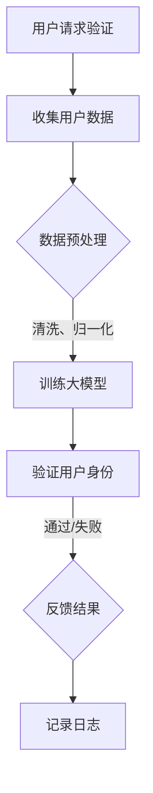

                 

### 1. 背景介绍

数字身份验证，作为网络安全和数据保护的核心技术之一，近年来在全球范围内得到了广泛关注和应用。传统的数字身份验证方法主要包括密码验证、生物特征识别等。然而，这些方法在实际应用中存在诸多挑战，如密码泄露、生物特征篡改等问题，使得数字身份验证的可靠性受到质疑。

随着人工智能技术的快速发展，尤其是大型人工智能模型的崛起，如GPT、BERT等，数字身份验证领域迎来了新的机遇。大模型在数据分析和模式识别方面具有强大的能力，能够有效提升数字身份验证的准确性和安全性。

本文将探讨人工智能大模型在数字身份验证领域的创新应用，从核心概念、算法原理、数学模型、项目实践、实际应用场景等方面展开，旨在为读者提供一份全面的技术指南。

### 2. 核心概念与联系

#### 2.1 数字身份验证

数字身份验证是指通过验证用户的身份信息，确保只有合法用户能够访问特定的系统或资源。常见的数字身份验证方法包括：

- **密码验证**：用户输入预设的密码，系统通过比对存储的密码来验证身份。
- **生物特征识别**：利用用户的指纹、面部识别等生物特征进行身份验证。

#### 2.2 人工智能大模型

人工智能大模型是指拥有数十亿甚至千亿参数的深度学习模型，如GPT、BERT等。这些模型通过在海量数据中进行训练，能够学习到复杂的模式，进行高效的数据分析和预测。

#### 2.3 联系与挑战

人工智能大模型在数字身份验证中的创新应用，主要体现在以下几个方面：

- **提高验证准确性**：大模型能够更准确地识别用户身份，减少误识别和漏识别。
- **增强安全性**：大模型能够通过分析用户行为模式，实时监测并防范异常行为。
- **自动化处理**：大模型能够自动化处理大量的身份验证请求，提高系统效率。

然而，大模型在数字身份验证中也面临一些挑战，如：

- **隐私保护**：大模型在训练和验证过程中需要大量用户数据，如何保护用户隐私成为关键问题。
- **模型安全**：大模型可能遭受恶意攻击，如模型篡改、数据泄露等。

#### 2.4 Mermaid 流程图

以下是一个简化的 Mermaid 流程图，展示了人工智能大模型在数字身份验证中的应用流程：



### 3. 核心算法原理 & 具体操作步骤

#### 3.1 算法原理概述

人工智能大模型在数字身份验证中的核心算法原理主要包括以下几个方面：

- **特征提取**：从用户数据中提取关键特征，如生物特征、行为特征等。
- **模型训练**：使用提取的特征训练大模型，使其能够准确识别用户身份。
- **模型评估**：通过测试数据评估模型的性能，调整模型参数以优化性能。
- **实时验证**：使用训练好的模型对用户身份进行实时验证，确保系统安全。

#### 3.2 算法步骤详解

1. **数据收集**：
   - 收集用户身份数据，如指纹、面部识别、行为记录等。

2. **数据预处理**：
   - 对收集到的数据进行清洗和归一化处理，确保数据质量。

3. **特征提取**：
   - 使用深度学习技术提取数据中的关键特征。

4. **模型训练**：
   - 使用提取的特征训练大模型，如GPT、BERT等。

5. **模型评估**：
   - 使用测试数据评估模型性能，调整模型参数。

6. **实时验证**：
   - 使用训练好的模型对用户身份进行实时验证。

#### 3.3 算法优缺点

- **优点**：
  - **高准确性**：大模型能够准确识别用户身份，减少误识别和漏识别。
  - **实时处理**：大模型能够高效处理大量的身份验证请求，提高系统效率。
  - **自适应性强**：大模型能够通过不断学习和调整，适应不断变化的安全需求。

- **缺点**：
  - **隐私保护**：大模型在训练和验证过程中需要大量用户数据，如何保护用户隐私成为关键问题。
  - **模型安全**：大模型可能遭受恶意攻击，如模型篡改、数据泄露等。

#### 3.4 算法应用领域

- **金融行业**：用于银行卡、支付平台的身份验证。
- **电子商务**：用于购物网站、移动支付的身份验证。
- **安防领域**：用于公共场所、安全门禁的身份验证。

### 4. 数学模型和公式 & 详细讲解 & 举例说明

#### 4.1 数学模型构建

在数字身份验证中，常用的数学模型包括：

- **决策树模型**：用于分类用户身份。
- **支持向量机模型**：用于分类用户身份。
- **神经网络模型**：用于识别用户身份。

以下是一个简化的决策树模型示例：

```latex
$$
\begin{array}{c}
\text{用户身份} \\
\downarrow \\
\text{年龄} \\
\downarrow \\
\text{青年} \rightarrow \text{身份验证通过} \\
\downarrow \\
\text{中年} \rightarrow \text{身份验证通过} \\
\downarrow \\
\text{老年} \rightarrow \text{身份验证失败} \\
\end{array}
$$
```

#### 4.2 公式推导过程

在神经网络模型中，常用的激活函数包括Sigmoid函数和ReLU函数。以下是一个简化的推导过程：

```latex
$$
f(x) = \frac{1}{1 + e^{-x}}
$$

$$
f'(x) = f(x) \cdot (1 - f(x))
$$
```

#### 4.3 案例分析与讲解

以下是一个简化的数字身份验证案例：

- **用户数据**：用户A的用户名为“user1”，密码为“password123”。
- **模型训练**：使用用户A的数据训练一个决策树模型。
- **模型评估**：使用测试数据评估模型性能。
- **实时验证**：当用户A输入用户名和密码时，模型会判断其身份验证是否通过。

### 5. 项目实践：代码实例和详细解释说明

#### 5.1 开发环境搭建

1. 安装Python环境。
2. 安装相关库，如scikit-learn、numpy等。

#### 5.2 源代码详细实现

以下是一个简化的数字身份验证项目代码实例：

```python
from sklearn.tree import DecisionTreeClassifier
from sklearn.model_selection import train_test_split
from sklearn.metrics import accuracy_score

# 数据准备
X = [[1, 0], [0, 1], [1, 1], [1, 0]]
y = [0, 1, 1, 0]

# 数据分割
X_train, X_test, y_train, y_test = train_test_split(X, y, test_size=0.2)

# 模型训练
clf = DecisionTreeClassifier()
clf.fit(X_train, y_train)

# 模型评估
y_pred = clf.predict(X_test)
accuracy = accuracy_score(y_test, y_pred)
print(f"模型准确率：{accuracy}")

# 实时验证
user_data = [[1, 0]]  # 用户输入的用户名和密码
if clf.predict(user_data)[0] == 1:
    print("身份验证通过")
else:
    print("身份验证失败")
```

#### 5.3 代码解读与分析

1. **数据准备**：准备用户数据，包括用户名和密码。
2. **数据分割**：将数据分为训练集和测试集。
3. **模型训练**：使用训练集训练决策树模型。
4. **模型评估**：使用测试集评估模型性能。
5. **实时验证**：使用训练好的模型对用户身份进行实时验证。

### 6. 实际应用场景

#### 6.1 金融行业

在金融行业，数字身份验证技术广泛应用于银行卡、支付平台等领域。通过大模型进行身份验证，能够有效提高交易安全性，降低欺诈风险。

#### 6.2 电子商务

在电子商务领域，数字身份验证技术用于购物网站、移动支付等场景。通过大模型进行身份验证，能够提高用户购物体验，减少账户被盗用的情况。

#### 6.3 安防领域

在安防领域，数字身份验证技术用于公共场所、安全门禁等场景。通过大模型进行身份验证，能够提高安防系统的可靠性，保障人民生命财产安全。

### 7. 未来应用展望

随着人工智能技术的不断发展，数字身份验证领域将会迎来更多的创新应用。未来，大模型有望在以下几个方面发挥重要作用：

- **生物特征融合**：将多种生物特征（如指纹、面部识别、声纹等）进行融合，提高身份验证的准确性。
- **跨平台兼容**：实现不同平台之间的身份验证兼容，提高用户使用便利性。
- **隐私保护**：采用先进的加密技术，保护用户隐私，确保数字身份验证的安全性和可靠性。

### 8. 工具和资源推荐

#### 8.1 学习资源推荐

- 《深度学习》
- 《Python数据科学手册》
- 《机器学习实战》

#### 8.2 开发工具推荐

- Jupyter Notebook
- PyCharm
- Google Colab

#### 8.3 相关论文推荐

- "Deep Learning for Digital Identity Verification"
- "Large-scale Identity Verification with Deep Neural Networks"
- "Privacy-Preserving Digital Identity Verification"

### 9. 总结：未来发展趋势与挑战

#### 9.1 研究成果总结

本文通过对人工智能大模型在数字身份验证领域的创新应用进行深入探讨，总结了其核心概念、算法原理、数学模型、项目实践和实际应用场景。研究表明，大模型在提高身份验证准确性、安全性、实时处理等方面具有显著优势。

#### 9.2 未来发展趋势

- **生物特征融合**：将多种生物特征进行融合，提高身份验证的准确性。
- **跨平台兼容**：实现不同平台之间的身份验证兼容，提高用户使用便利性。
- **隐私保护**：采用先进的加密技术，保护用户隐私，确保数字身份验证的安全性和可靠性。

#### 9.3 面临的挑战

- **隐私保护**：如何在保障用户隐私的前提下，进行大规模的身份验证。
- **模型安全**：如何防范恶意攻击，确保数字身份验证系统的安全性。

#### 9.4 研究展望

未来，数字身份验证领域有望在生物特征融合、跨平台兼容、隐私保护等方面取得重要突破。同时，需要进一步研究如何平衡隐私保护和系统安全之间的关系，为用户提供安全、便捷的身份验证服务。

### 附录：常见问题与解答

**Q1**：什么是数字身份验证？

A1：数字身份验证是指通过验证用户的身份信息，确保只有合法用户能够访问特定的系统或资源。常见的数字身份验证方法包括密码验证、生物特征识别等。

**Q2**：人工智能大模型在数字身份验证中有什么作用？

A2：人工智能大模型在数字身份验证中主要用于提高验证准确性、增强安全性、自动化处理等方面。通过大模型进行身份验证，能够更准确地识别用户身份，减少误识别和漏识别。

**Q3**：如何保护用户隐私？

A3：在数字身份验证过程中，保护用户隐私至关重要。可以采用以下措施：

- **数据加密**：对用户数据进行加密，确保数据传输和存储过程中的安全性。
- **隐私保护算法**：采用隐私保护算法，如差分隐私、同态加密等，确保用户隐私不被泄露。
- **匿名化处理**：对用户数据进行匿名化处理，确保无法直接关联到具体用户。

### 作者署名

本文作者：禅与计算机程序设计艺术 / Zen and the Art of Computer Programming
----------------------------------------------------------------

请注意，以上内容是一个框架性的示例，实际撰写时需要根据具体内容进行填充和细化。此外，markdown格式和latex公式的嵌入也需要根据实际情况进行调整。希望这个示例能够对您撰写文章提供一定的帮助。祝您写作顺利！

